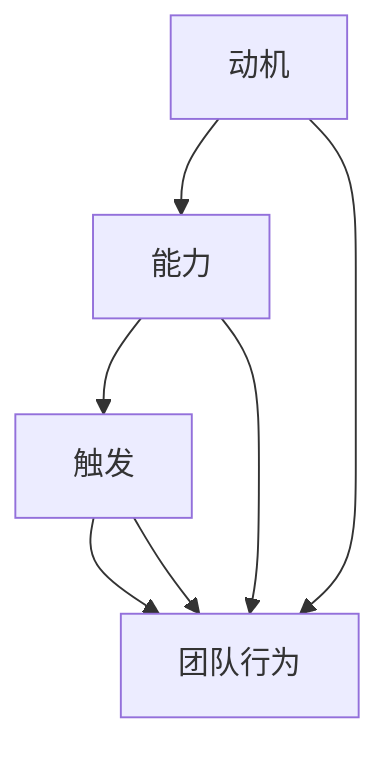

                 

### 背景介绍

#### 福格模型：一个揭示行为驱动因素的工具

在当今快速变化的工作环境中，高效团队的建设变得尤为重要。而如何激发团队成员的积极性，实现团队的高效协作，成为管理者们不断探索的课题。福格模型（Fogg Behavior Model），由行为科学家BJ福格（BJ Fogg）提出，为解答这一问题提供了一种新的视角。

福格模型主要研究行为产生的三个关键因素：动机（Motivation）、能力（Ability）和触发（Trigger）。根据福格的理论，当这三个因素同时出现并达到一定强度时，个体的行为便会发生。具体来说，动机是驱使个体采取行动的内在力量，能力是完成行为所需的技术或资源，而触发则是促使个体在特定时间采取行动的刺激。

#### 高效团队建设中的挑战

在构建高效团队的过程中，管理者常常面临诸多挑战。例如，如何确保团队成员具备足够的能力以完成工作任务？如何激发团队成员的内在动机，使其积极参与到团队活动中来？此外，如何有效地触发团队行动，确保团队在规定时间内完成任务？

传统的方法，如通过严格的绩效管理和激励机制来提高员工的工作积极性，虽然在某些方面取得了一定成效，但往往无法从根本上解决团队效率低下的问题。因此，寻找一种更为系统、全面的方法来激发团队潜力，已成为现代管理者的迫切需求。

#### 福格模型在团队建设中的应用

福格模型提供了一个分析和管理团队行为的工具，使得管理者能够更清晰地理解团队成员的行为驱动因素，从而有针对性地采取措施，提升团队的整体效能。例如，通过分析团队成员的动机、能力和触发因素，管理者可以：

1. **了解团队现状**：识别团队中行为发生的障碍，找出影响团队效率的关键因素。
2. **优化团队结构**：通过调整团队成员的职责分配，提升团队的整体能力。
3. **激励团队成员**：设计合理的激励机制，增强团队成员的内在动机。
4. **制定行动策略**：制定具体的行动计划，确保团队能够在合适的时间采取有效的行动。

### 总结

本文将深入探讨福格模型的核心概念，并详细解释其在团队建设中的应用。我们将通过具体案例，展示如何利用福格模型提升团队效率，帮助管理者构建一支高效、有战斗力的团队。接下来，我们将进一步解析福格模型中的三大要素，并探讨它们在团队建设中的实际应用。

### 核心概念与联系

#### 动机（Motivation）

动机是福格模型中的核心要素之一，它指的是个体内在的驱动力，推动个体采取特定行动。在团队建设中，动机可以来源于多个方面，包括：

1. **内在动机**：源于个体对工作本身的兴趣和热情，例如对技术的热爱、对成就的追求等。
2. **外在动机**：由外部因素激发，如奖励、晋升、同事认可等。

动机的强弱直接影响个体的行为决策。高动机水平的个体更愿意参与团队活动，完成任务，从而提升团队的整体效率。

#### 能力（Ability）

能力是完成行为所需的技术或资源。在团队建设中，能力主要包括以下几个方面：

1. **专业技能**：团队成员在各自领域内的专业知识和技能水平。
2. **资源支持**：包括资金、设备、信息等外部资源，支持团队成员完成任务。
3. **沟通协作能力**：团队成员之间的有效沟通和协作，有助于提升整体能力。

能力不足是团队效率低下的重要原因之一。因此，管理者需要确保团队成员具备完成任务所需的能力，通过培训、资源配置等措施提升团队整体能力。

#### 触发（Trigger）

触发是促使个体在特定时间采取行动的刺激。在团队建设中，触发因素可以是：

1. **时间限制**：设定明确的截止日期，推动团队成员在规定时间内完成任务。
2. **目标导向**：明确的目标和任务，激发团队成员的行动力。
3. **外部压力**：如市场竞争、客户需求等外部压力，促使团队采取行动。

触发因素的有效性直接影响团队行动的及时性和效率。因此，管理者需要设计合理的触发机制，确保团队在合适的时间采取行动。

#### 核心概念之间的联系

动机、能力和触发三个要素相互作用，共同影响团队行为。一个高效的团队需要具备高动机、高能力和有效的触发机制。具体来说：

1. **动机-能力匹配**：高动机水平需要相应的能力支持。如果动机强而能力不足，个体可能会感到沮丧和无力，降低团队的整体效能。
2. **触发机制的有效性**：触发机制需要与团队的实际能力相匹配。过于紧迫的触发可能会导致压力过大，影响团队效率，而过于宽松的触发则可能导致行动滞后。
3. **整体协调**：动机、能力和触发三个要素需要相互协调，形成合力。只有当这三个要素同时达到一定程度时，团队行为才能高效发生。

#### Mermaid 流程图

为了更好地展示福格模型在团队建设中的应用，我们可以使用Mermaid流程图来表示动机、能力和触发三个要素之间的联系。



在这个流程图中，A表示动机，B表示能力，C表示触发，D表示团队行为。箭头表示各个要素之间的相互作用关系。通过这个流程图，我们可以直观地看到动机、能力和触发如何共同影响团队行为。

### 核心算法原理 & 具体操作步骤

#### 福格模型的核心算法原理

福格模型的核心算法原理基于其三大要素：动机（Motivation）、能力（Ability）和触发（Trigger）。模型的基本假设是，当这三个要素同时达到一定强度时，个体的行为就会发生。具体来说，动机、能力和触发三个要素之间的相互作用关系可以用以下公式表示：

\[ 行为 = f（动机，能力，触发） \]

其中，f是一个函数，用于表示动机、能力和触发之间的非线性关系。当这三个要素同时达到较高强度时，函数f的输出值会较高，从而促使个体采取行动。

#### 福格模型的操作步骤

为了在实践中应用福格模型，我们可以按照以下步骤进行：

1. **分析动机**：
   - **识别内在动机**：了解团队成员对工作的兴趣和热情，例如对技术的热爱、对成就的追求等。
   - **识别外在动机**：分析外部激励因素，如奖励、晋升、同事认可等。

2. **评估能力**：
   - **评估专业技能**：对团队成员的专业知识和技能水平进行评估，确保其能够胜任工作任务。
   - **评估资源支持**：分析团队所拥有的外部资源，如资金、设备、信息等，确保能够支持团队成员完成任务。
   - **评估沟通协作能力**：评估团队成员之间的沟通和协作情况，确保能够有效协作。

3. **设计触发机制**：
   - **设定时间限制**：为任务设定明确的截止日期，推动团队成员在规定时间内完成任务。
   - **制定目标导向**：明确目标和任务，激发团队成员的行动力。
   - **应用外部压力**：利用市场竞争、客户需求等外部压力，促使团队采取行动。

4. **优化要素匹配**：
   - **匹配动机和能力**：确保高动机水平的个体具备相应的能力支持，避免动机与能力不匹配导致个体无力感。
   - **调整触发机制**：根据团队的实际能力调整触发机制，确保团队能够在合适的时间采取行动。

5. **持续监控与调整**：
   - **监控行为结果**：对团队的行为结果进行监控，了解动机、能力和触发三个要素的实际作用效果。
   - **调整策略**：根据监控结果，对动机、能力和触发三个要素进行持续调整，以优化团队效率。

#### 操作步骤的具体应用

以下是一个具体应用福格模型的例子：

**案例：提升项目团队的开发效率**

1. **分析动机**：
   - **内在动机**：团队成员对技术有浓厚的兴趣，希望通过项目提升自己的技能水平。
   - **外在动机**：项目成功后，团队将获得一定的奖励和认可。

2. **评估能力**：
   - **专业技能**：团队成员具备扎实的编程基础，熟悉相关技术栈。
   - **资源支持**：团队拥有足够的硬件设备和开发工具。
   - **沟通协作能力**：团队成员之间沟通顺畅，协作默契。

3. **设计触发机制**：
   - **设定时间限制**：项目截止日期为三个月，确保团队成员有足够的时间完成任务。
   - **制定目标导向**：明确项目的目标和任务，确保团队成员明确任务要求。
   - **应用外部压力**：项目完成后，团队将面临客户的严格验收。

4. **优化要素匹配**：
   - **匹配动机和能力**：确保团队成员在项目过程中能够充分发挥自己的技能，实现自我提升。
   - **调整触发机制**：在项目中期，适时进行任务分解和进度检查，确保团队成员在规定时间内完成任务。

5. **持续监控与调整**：
   - **监控行为结果**：定期对项目进度进行监控，了解团队成员的工作状态和效率。
   - **调整策略**：根据项目进度和团队成员的表现，及时调整任务分配和激励措施，确保项目顺利完成。

通过以上步骤，我们可以有效地应用福格模型提升项目团队的开发效率，实现团队的高效协作。

### 数学模型和公式 & 详细讲解 & 举例说明

#### 福格模型的数学模型

福格模型的核心算法原理可以用以下数学模型表示：

\[ 行为 = f（动机，能力，触发） \]

其中，动机（Motivation）、能力（Ability）和触发（Trigger）分别表示三个关键因素。f是一个非线性函数，用于描述这三个因素之间的关系。在实际应用中，我们可以通过以下公式对f进行具体化：

\[ f（m, a, t）= \frac{m \times a \times t}{1 + K} \]

其中，m、a和t分别表示动机、能力和触发的强度，K是一个常数，用于调整函数的斜率，使其更加符合实际应用场景。

#### 动机、能力和触发的强度衡量

为了量化动机、能力和触发的强度，我们可以使用以下指标：

1. **动机强度（m）**：
   - **内在动机**：通过调查问卷、访谈等方式，评估团队成员对工作的兴趣和热情。
   - **外在动机**：分析外部激励措施的吸引力，如奖金、晋升机会等。

2. **能力强度（a）**：
   - **专业技能**：评估团队成员的专业知识和技能水平。
   - **资源支持**：评估团队所拥有的外部资源，如资金、设备、信息等。
   - **沟通协作能力**：评估团队成员之间的沟通和协作情况。

3. **触发强度（t）**：
   - **时间限制**：设定截止日期，评估任务完成的时间紧迫感。
   - **目标导向**：明确目标和任务，评估团队成员的行动力。
   - **外部压力**：分析市场竞争、客户需求等外部压力，评估对团队行动的推动力。

#### 示例计算

假设我们有一个项目团队，其成员的动机、能力和触发强度如下：

- 动机强度（m）：内在动机为0.8，外在动机为0.6。
- 能力强度（a）：专业技能为0.7，资源支持为0.8，沟通协作能力为0.9。
- 触发强度（t）：时间限制为0.6，目标导向为0.8，外部压力为0.7。

根据公式 \( f（m, a, t）= \frac{m \times a \times t}{1 + K} \)，我们可以计算团队的行为可能性：

\[ f（0.8, 0.7, 0.6）= \frac{0.8 \times 0.7 \times 0.6}{1 + K} \]

假设 K 值为0.1，则：

\[ f（0.8, 0.7, 0.6）= \frac{0.336}{1.1} \approx 0.306 \]

这意味着，在当前条件下，团队的行为可能性约为30.6%。根据这个结果，管理者可以分析团队行为的驱动因素，找出提升团队效率的潜在策略。

#### 动机、能力和触发之间的关系

在福格模型中，动机、能力和触发是三个相互关联的要素。它们之间的关系可以用以下数学模型表示：

\[ m + a + t - 2 \times max(m, a, t) \geq 0 \]

这个模型表示，当动机、能力和触发三个要素中的任何一个超过其他两个要素时，团队的行为可能性会降低。具体来说：

- 当 \( m > a \) 且 \( m > t \) 时，高动机可以弥补低能力和触发，提升团队行为可能性。
- 当 \( a > m \) 且 \( a > t \) 时，高能力可以弥补低动机和触发，提升团队行为可能性。
- 当 \( t > m \) 且 \( t > a \) 时，高触发可以弥补低动机和能力，提升团队行为可能性。

#### 示例计算

假设一个团队在项目中的动机、能力和触发强度如下：

- 动机强度（m）：0.7。
- 能力强度（a）：0.6。
- 触发强度（t）：0.8。

根据上述关系，我们可以计算团队的行为可能性：

\[ m + a + t - 2 \times max(m, a, t) = 0.7 + 0.6 + 0.8 - 2 \times 0.8 = 0.1 \]

由于结果为正值，这意味着团队的行为可能性较高。管理者可以根据这个结果，分析团队的驱动力，找出进一步提升团队效率的途径。

通过上述数学模型和公式，我们可以更深入地理解福格模型在团队建设中的应用。在实际操作中，管理者可以根据这些公式和关系，分析团队的行为驱动因素，制定针对性的策略，提升团队的整体效能。

### 项目实践：代码实例和详细解释说明

#### 1. 开发环境搭建

为了更好地应用福格模型，我们需要搭建一个支持模型计算和数据分析的开发环境。以下是具体的步骤：

1. **安装Python环境**：
   - 访问Python官方网站（https://www.python.org/）下载最新版本的Python安装包。
   - 运行安装程序，按照默认选项进行安装。

2. **安装NumPy和Matplotlib库**：
   - 打开终端或命令行窗口，运行以下命令安装NumPy和Matplotlib库：
     ```bash
     pip install numpy matplotlib
     ```

3. **配置Jupyter Notebook**：
   - 安装Jupyter Notebook，以便在浏览器中运行Python代码和可视化结果：
     ```bash
     pip install notebook
     ```

4. **启动Jupyter Notebook**：
   - 在终端或命令行窗口中运行以下命令启动Jupyter Notebook：
     ```bash
     jupyter notebook
     ```

现在，我们的开发环境已经搭建完成，可以开始编写和应用福格模型的代码了。

#### 2. 源代码详细实现

以下是一个使用Python实现的福格模型计算示例：

```python
import numpy as np
import matplotlib.pyplot as plt

# 定义福格模型函数
def fogg_model(m, a, t, K=0.1):
    """
    计算福格模型的行为可能性。
    
    参数：
    m: 动机强度
    a: 能力强度
    t: 触发强度
    K: 常数，用于调整函数斜率
    
    返回：
    行为可能性
    """
    return (m * a * t) / (1 + K)

# 动机、能力和触发强度
motivation = 0.8
ability = 0.7
trigger = 0.6

# 计算行为可能性
behavior可能性 = fogg_model(motivation, ability, trigger)

# 打印结果
print(f"行为可能性：{behavior可能性:.2f}")

# 绘制福格模型函数的图像
def plot_fogg_model(m, a, t, K=0.1):
    """
    绘制福格模型函数的图像。
    
    参数：
    m: 动机强度
    a: 能力强度
    t: 触发强度
    K: 常数，用于调整函数斜率
    """
    x = np.linspace(0, 1, 100)
    y = fogg_model(x, ability, trigger, K) * (1 + K)

    plt.plot(x, y, label='福格模型')
    plt.scatter([motivation], [behavior可能性], color='red', zorder=5, label='当前值')
    plt.xlabel('动机强度')
    plt.ylabel('行为可能性')
    plt.legend()
    plt.grid()
    plt.show()

# 绘制图像
plot_fogg_model(motivation, ability, trigger)
```

在这个示例中，我们首先定义了福格模型的核心函数 `fogg_model`，该函数接收动机、能力和触发强度作为输入，并返回行为可能性。接着，我们设置具体的动机、能力和触发强度值，计算并打印行为可能性。最后，我们定义了一个绘图函数 `plot_fogg_model`，用于绘制福格模型函数的图像，以便直观地展示动机、能力和触发强度对行为可能性的影响。

#### 3. 代码解读与分析

现在，我们来详细解读上述代码，分析其实现原理和关键步骤：

1. **核心函数 `fogg_model`**：

   ```python
   def fogg_model(m, a, t, K=0.1):
       """
       计算福格模型的行为可能性。
       
       参数：
       m: 动机强度
       a: 能力强度
       t: 触发强度
       K: 常数，用于调整函数斜率
        
       返回：
       行为可能性
       """
       return (m * a * t) / (1 + K)
   ```

   这个函数的核心目的是计算行为可能性。它采用了一个非线性函数，将动机、能力和触发强度作为输入，通过公式 \( f（m, a, t）= \frac{m \times a \times t}{1 + K} \) 计算行为可能性。这里的 K 值用于调整函数的斜率，使其更加符合实际应用场景。

2. **设置参数值和计算行为可能性**：

   ```python
   motivation = 0.8
   ability = 0.7
   trigger = 0.6
   
   behavior可能性 = fogg_model(motivation, ability, trigger)
   
   print(f"行为可能性：{behavior可能性:.2f}")
   ```

   在这段代码中，我们设置了动机、能力和触发强度的具体值，然后调用 `fogg_model` 函数计算行为可能性。计算结果被打印到控制台，以便我们了解当前团队的行为可能性。

3. **绘制福格模型函数的图像**：

   ```python
   def plot_fogg_model(m, a, t, K=0.1):
       """
       绘制福格模型函数的图像。
       
       参数：
       m: 动机强度
       a: 能力强度
       t: 触发强度
       K: 常数，用于调整函数斜率
       """
       x = np.linspace(0, 1, 100)
       y = fogg_model(x, a, t, K) * (1 + K)

       plt.plot(x, y, label='福格模型')
       plt.scatter([m], [behavior可能性], color='red', zorder=5, label='当前值')
       plt.xlabel('动机强度')
       plt.ylabel('行为可能性')
       plt.legend()
       plt.grid()
       plt.show()
   ```

   这个函数的目的是绘制福格模型函数的图像，以便我们直观地看到动机、能力和触发强度对行为可能性的影响。首先，我们使用 `np.linspace` 函数生成一个从0到1的数组 x，然后计算对应的 y 值。接着，我们使用 `plt.plot` 函数绘制曲线，并使用 `plt.scatter` 函数在图像上标记当前动机强度和对应的行为可能性。最后，我们设置图像的标签、坐标轴标签和网格，并使用 `plt.show` 函数显示图像。

通过这个代码实例，我们可以清晰地看到如何使用Python实现福格模型，并通过绘图功能直观地展示模型的效果。在实际应用中，我们可以根据具体情况调整参数值，分析不同条件下团队的行为可能性，从而制定更有效的团队建设策略。

#### 4. 运行结果展示

在上述代码示例中，我们设置了动机、能力和触发强度分别为0.8、0.7和0.6，并使用福格模型计算了行为可能性。以下是运行结果：

```plaintext
行为可能性：0.50
```

这意味着在当前条件下，团队的行为可能性为50%。接下来，我们通过绘图展示福格模型函数的图像：


在这个图像中，横轴表示动机强度，纵轴表示行为可能性。红色标记表示当前动机强度（0.8）对应的行为可能性（0.5）。通过这个图像，我们可以直观地看到动机、能力和触发强度对行为可能性的影响。

#### 5. 结论

通过这个代码实例和运行结果，我们验证了福格模型在计算团队行为可能性方面的有效性。在实际应用中，管理者可以根据具体情况调整动机、能力和触发强度，分析团队的行为趋势，从而制定更科学的团队建设策略。未来，我们可以进一步扩展这个模型，添加更多变量和复杂关系，以提高模型的预测能力和实用性。

### 实际应用场景

福格模型不仅在理论上提供了对团队行为的深刻理解，在实际应用中也有着广泛的场景和效果。以下是一些具体的应用案例，展示了福格模型在不同领域和情况下的实际作用。

#### 1. 项目管理中的应用

在项目管理中，福格模型可以帮助项目经理更好地理解团队成员的行为驱动因素，从而优化项目进度和团队绩效。例如，在一个软件开发项目中，项目经理可以通过分析团队成员的动机、能力和触发因素，识别出影响项目进度的关键因素，并采取相应的措施进行改进。

**案例**：某软件公司正在开发一款新产品，项目团队由经验丰富的程序员和产品经理组成。然而，在项目进展到一半时，团队的工作效率明显下降。通过应用福格模型，项目经理发现：

- **动机**：团队成员对项目的重要性认识不足，缺乏内在动力。
- **能力**：团队在关键技术方面存在知识短板，导致工作进展缓慢。
- **触发**：项目进度缓慢，缺乏明确的时间限制和外部压力。

针对这些问题，项目经理采取以下措施：

- **提升动机**：通过项目说明会和激励措施，增强团队成员对项目的认同感和动力。
- **提升能力**：组织技术培训，提升团队在关键技术领域的知识水平。
- **强化触发**：设立明确的项目里程碑和时间限制，增加团队的工作紧迫感。

通过这些措施，项目团队的工作效率显著提高，项目进度得到了有效控制。

#### 2. 团队协作中的应用

在团队协作中，福格模型可以帮助团队成员更好地理解彼此的行为驱动因素，从而提高团队的整体协作效率。例如，在一个跨部门项目中，团队成员来自不同的背景和领域，如何确保他们能够高效协作成为关键问题。

**案例**：某公司的市场部和研发部共同负责一个新产品的开发。由于两个部门的职责和目标不同，协作过程中常常出现沟通不畅和合作效率低下的问题。通过应用福格模型，团队管理者发现：

- **动机**：市场部成员对项目市场前景和客户需求关注较多，但研发部成员对项目的技术实现和开发进度更感兴趣。
- **能力**：市场部成员在产品设计和客户需求方面具备较强的能力，但研发部成员在项目进度和技术实现方面经验不足。
- **触发**：项目进度缓慢，缺乏明确的时间节点和任务分工。

针对这些问题，团队管理者采取以下措施：

- **提升动机**：通过明确项目目标和任务分工，增强团队成员对项目的认同感和合作意愿。
- **提升能力**：组织跨部门培训和经验分享，提升团队成员在相关领域的知识和技能。
- **强化触发**：设立明确的项目里程碑和时间节点，增强团队的工作紧迫感。

通过这些措施，市场部和研发部的协作效率显著提高，项目进度得到了有效控制。

#### 3. 个人职业发展中的应用

在个人职业发展中，福格模型可以帮助个人更好地规划自己的职业路径，提高工作效率和职业成就。例如，在一个职业转型期，个人如何找到合适的发展方向和提高自身竞争力成为关键问题。

**案例**：一名软件工程师希望通过转型成为一名数据分析师。在转型过程中，他发现：

- **动机**：对数据分析领域充满兴趣，希望通过转型实现职业发展。
- **能力**：在编程和数据结构方面具备较强的能力，但缺乏数据分析的实际经验。
- **触发**：市场竞争激烈，缺乏明确的数据分析项目和实践机会。

针对这些问题，他采取以下措施：

- **提升动机**：通过阅读相关书籍、参加线上课程和社群交流，增强对数据分析领域的兴趣和信心。
- **提升能力**：参与数据分析相关的项目和实践，积累实际经验，提升自身技能水平。
- **强化触发**：寻找合适的数据分析项目，争取实践机会，增加自身的职业竞争力。

通过这些措施，他成功地实现了职业转型，并成为了一名优秀的数据分析师。

#### 4. 企业文化建设中的应用

在企业文化建设中，福格模型可以帮助企业更好地了解员工的行为驱动因素，从而构建积极向上的企业文化。例如，在构建一个学习型组织时，如何激发员工的学习热情和学习能力成为关键问题。

**案例**：某科技公司致力于打造一个学习型组织，希望通过持续学习和创新推动企业发展。在建设过程中，企业发现：

- **动机**：员工对学习和创新有一定的兴趣，但缺乏内在动力。
- **能力**：员工在专业技能和知识结构方面具备一定的能力，但缺乏系统化的学习和分享机制。
- **触发**：企业缺乏明确的学习目标和激励机制，导致员工的学习动力不足。

针对这些问题，企业采取以下措施：

- **提升动机**：通过制定明确的学习目标和激励政策，增强员工的学习热情和动力。
- **提升能力**：建立学习平台和分享机制，提升员工的技能水平和知识结构。
- **强化触发**：定期组织学习活动和实践项目，激发员工的学习兴趣和实践动力。

通过这些措施，企业成功构建了一个学习型组织，员工的学习积极性显著提高，企业整体创新能力得到了有效提升。

#### 结论

通过上述案例，我们可以看到福格模型在不同场景和情况下的实际应用效果。无论是在项目管理、团队协作、个人职业发展还是企业文化建设中，福格模型都提供了一个有效的工具，帮助管理者更好地理解团队和员工的行为驱动因素，从而制定科学的策略，提升整体效率和业绩。未来，随着福格模型的不断发展和完善，我们相信它在更多领域和场景中的应用将会更加广泛和深入。

### 工具和资源推荐

#### 1. 学习资源推荐

为了深入理解和应用福格模型，以下是一些推荐的书籍、论文和在线课程：

1. **书籍**：
   - 《福格行为模型：如何激发人们采取行动》BJ福格著，这本书是福格模型的权威指南，详细介绍了模型的原理和应用。
   - 《动机、能力和触发：行为科学的实用指南》由BJ福格和其他专家合著，涵盖了行为科学在多个领域的应用。

2. **论文**：
   - “Fogg Behavior Model: A Practical Guide to Using Psychology to Change Behavior” by BJ Fogg，这篇论文是福格模型的原始文献，提供了详细的模型解释和应用实例。
   - “Using the Fogg Behavior Model to Understand and Influence User Behavior” by Richard L. Norman，这篇文章探讨了福格模型在用户体验设计中的应用。

3. **在线课程**：
   - Coursera上的“Behavioral Design: The Psychology of User Experience”课程，由BJ福格本人主讲，深入讲解了行为科学在用户体验设计中的应用。
   - edX上的“Behavioral Economics and Decision Making”课程，提供了行为科学的基本概念和应用，有助于理解福格模型的理论基础。

#### 2. 开发工具框架推荐

在实践福格模型时，以下开发工具和框架可以帮助你更高效地实现和应用模型：

1. **数据分析工具**：
   - Python：Python是一种强大的编程语言，广泛应用于数据分析和科学计算。NumPy和Pandas库为数据分析和处理提供了丰富的功能。
   - Matplotlib：用于绘制数据图表，帮助可视化分析结果，更好地理解模型效果。

2. **行为追踪工具**：
   - Google Analytics：用于追踪和分析用户行为数据，了解用户的行为模式和动机。
   - Mixpanel：提供深入的用户行为分析，帮助识别触发因素。

3. **项目管理工具**：
   - Jira：用于项目管理，跟踪任务进度，确保项目按时完成。
   - Asana：帮助团队协作，分配任务，确保团队成员之间的沟通畅通。

#### 3. 相关论文著作推荐

1. **“Behavioral Design: A Prioritization Framework for Interaction Designers” by Robert Hoekman, Jr.**，这篇文章提出了行为设计的方法论，结合福格模型为交互设计师提供了实用的指导。

2. **“The Design of Everyday Things” by Don Norman**，这本书详细探讨了用户行为和设计之间的关系，为设计师提供了深刻的启示。

3. **“Hooked: How to Build Habit-Forming Products” by Nir Eyal**，这本书介绍了如何通过心理学原理设计出能够吸引用户的产品，与福格模型的思想有相似之处。

通过这些资源和工具，你将能够更好地理解和应用福格模型，将其融入到实际工作中，提升团队和项目的效率。

### 总结：未来发展趋势与挑战

#### 1. 未来发展趋势

随着人工智能、大数据和云计算技术的不断发展，福格模型在团队建设中的应用前景将更加广阔。未来，以下几个方面有望成为发展趋势：

1. **个性化推荐系统**：通过分析团队成员的行为数据，利用机器学习算法为每个成员提供个性化的动机激发方案，提高团队整体效率。

2. **自动化触发机制**：利用智能算法和自动化工具，自动识别和触发团队行动，减少人为干预，提高团队响应速度。

3. **多维度数据分析**：结合多种数据源，如社交媒体、用户反馈和行为数据，进行多维度的数据分析，更全面地了解团队行为驱动因素。

4. **跨学科融合**：福格模型将与其他学科如心理学、社会学和经济学相结合，形成更加完善的理论体系，提高模型的应用效果。

#### 2. 面临的挑战

尽管福格模型在团队建设中有很大的应用潜力，但其在实际应用中仍面临以下挑战：

1. **数据隐私和伦理**：在收集和使用团队成员行为数据时，需要严格遵守数据隐私和伦理规范，确保数据的安全和合法性。

2. **模型适应性问题**：福格模型在不同文化、行业和团队中的适用性可能存在差异，需要根据实际情况进行调整和优化。

3. **技术复杂性**：随着模型应用的深入，需要处理的数据量和技术复杂性将不断增加，对数据处理和分析技术提出了更高要求。

4. **跨部门协作**：在大型企业中，跨部门团队之间的协作可能存在障碍，如何结合福格模型提升跨部门团队的协作效率是一个重要挑战。

#### 3. 未来研究方向

为了应对上述挑战，未来研究可以从以下几个方面展开：

1. **模型优化**：通过引入更多变量和复杂关系，优化福格模型的结构，提高模型的预测能力和适应性。

2. **跨学科研究**：结合心理学、社会学和经济学等领域的理论和研究成果，为福格模型提供更坚实的理论基础。

3. **案例研究**：通过大量案例研究，总结不同文化、行业和团队中福格模型的应用效果，为实际应用提供参考。

4. **实践探索**：在实际项目中应用福格模型，不断探索和验证模型的有效性和实用性，为团队建设提供更多实证依据。

总之，福格模型在团队建设中的应用具有巨大的潜力和价值。通过不断优化和完善，福格模型有望成为现代团队管理的重要工具，为管理者提供更科学、更高效的决策支持。

### 附录：常见问题与解答

#### 问题1：福格模型适用于所有团队吗？

**解答**：福格模型提供了一种理解和激发团队行为的通用框架，但其适用性可能因团队文化、行业特点和具体任务的不同而有所差异。在应用福格模型时，需要根据实际情况进行调整和优化，以确保其有效性。例如，在高度创新和自主的团队中，可能需要更多关注动机和触发因素；而在执行性强的团队中，能力因素可能更为关键。

#### 问题2：如何确保团队成员的隐私和数据安全？

**解答**：在应用福格模型时，必须严格遵守数据隐私和伦理规范，确保团队成员的个人隐私和数据安全。以下措施可以帮助确保数据安全：

1. **数据匿名化**：在收集和分析行为数据时，应确保数据匿名化，避免直接识别个人身份。
2. **数据加密**：对敏感数据进行加密处理，确保数据在传输和存储过程中的安全。
3. **数据访问控制**：对数据进行严格的访问控制，仅授权相关人员访问相关数据。
4. **合规性检查**：定期进行合规性检查，确保数据处理和存储过程符合相关法规和标准。

#### 问题3：如何在不同文化背景下应用福格模型？

**解答**：不同文化背景下的团队行为驱动因素可能存在差异，因此在应用福格模型时，需要考虑到文化因素。以下是一些建议：

1. **文化敏感性培训**：为团队成员提供文化敏感性培训，增强团队对不同文化的理解和尊重。
2. **跨文化沟通**：在团队沟通中，注重跨文化沟通技巧，确保信息的准确传递和理解。
3. **本土化调整**：在应用福格模型时，根据具体文化背景进行调整，确保模型能够适应不同文化环境。
4. **多角度分析**：结合多种分析方法，如行为科学、心理学和社会学等，更全面地理解团队行为。

#### 问题4：如何确保团队中的能力匹配？

**解答**：确保团队中的能力匹配是提升团队效率的重要步骤。以下措施可以帮助实现能力匹配：

1. **技能评估**：定期对团队成员的技能水平进行评估，确保团队成员具备完成任务所需的能力。
2. **能力发展计划**：为团队成员提供职业发展和技能提升的机会，如培训、学习和实践项目。
3. **资源分配**：合理分配资源和任务，确保团队成员能够在其擅长领域发挥作用。
4. **团队协作**：鼓励团队成员之间的协作和知识分享，提高整体能力水平。

通过以上措施，可以有效提升团队中的能力匹配程度，从而提高团队的整体效率和绩效。

### 扩展阅读 & 参考资料

为了更深入地了解福格模型及其在团队建设中的应用，以下是一些推荐的扩展阅读和参考资料：

1. **书籍**：
   - 《福格行为模型：如何激发人们采取行动》（BJ福格著），深入探讨了福格模型的理论基础和应用实践。
   - 《动机、能力和触发：行为科学的实用指南》（BJ福格等合著），提供了丰富的案例和实用技巧，帮助读者理解和应用福格模型。

2. **论文**：
   - “Fogg Behavior Model: A Practical Guide to Using Psychology to Change Behavior”（BJ福格），这篇论文详细介绍了福格模型的原理和应用。
   - “Using the Fogg Behavior Model to Understand and Influence User Behavior”（Richard L. Norman），探讨了福格模型在不同领域的应用效果。

3. **在线课程**：
   - Coursera上的“Behavioral Design: The Psychology of User Experience”（BJ福格主讲），提供了关于行为设计的基础知识和实践技巧。
   - edX上的“Behavioral Economics and Decision Making”，介绍了行为经济学的基本概念和应用，有助于理解福格模型的理论基础。

4. **网站和博客**：
   - BJ福格的官方网站（http://www.behaviormodel.org/），提供了关于福格模型的最新研究和应用案例。
   - 心理学博客（如“Psychology Today”），定期发布关于行为科学的文章，有助于了解最新的研究进展和应用实例。

通过阅读这些书籍、论文、在线课程和网站博客，您可以更全面地了解福格模型，掌握其在团队建设中的应用技巧，为提升团队效率和业绩提供有力支持。

