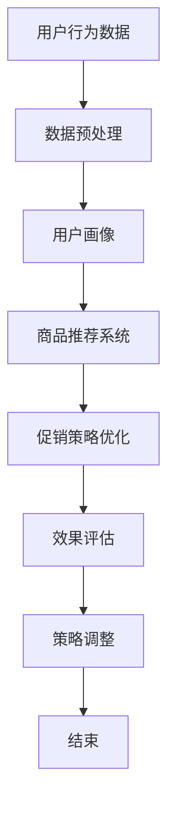

                 

### 文章标题：电商促销策略的智能优化

#### 关键词：电商促销策略、智能优化、数据驱动、算法应用

> 摘要：本文深入探讨了电商促销策略的智能优化方法，通过分析数据驱动和算法应用的核心原理，提出了基于机器学习与深度学习的电商促销策略优化模型。文章结构清晰，逻辑严密，旨在为电商从业者和算法工程师提供实用的策略优化思路和方法。

---

#### 1. 背景介绍

在电商行业，促销活动是提升销售额、增加用户粘性和市场竞争力的关键手段。然而，传统的促销策略往往依赖于历史经验和直觉，难以应对复杂多变的市场环境。随着大数据和人工智能技术的发展，智能优化逐渐成为电商促销策略领域的研究热点。

智能优化利用数据分析和算法模型，从海量数据中提取有价值的信息，为促销策略提供数据支持。通过机器学习和深度学习等技术，可以实现对用户行为、市场趋势的精准预测，从而制定更具针对性的促销策略。

本文旨在探讨如何利用智能优化技术提升电商促销策略的有效性，为电商从业者提供科学、高效的策略优化方法。

#### 2. 核心概念与联系

##### 2.1 数据驱动

数据驱动是指利用海量数据对业务过程进行监控、分析和优化。在电商促销策略中，数据驱动主要涉及用户行为数据、商品数据和市场数据。

用户行为数据包括用户浏览、购买、评价等行为，这些数据可以揭示用户喜好和需求。商品数据包括商品属性、价格、销量等，这些数据有助于分析商品的市场表现。市场数据包括竞争对手的促销策略、市场趋势等，这些数据可以提供市场环境的信息。

##### 2.2 算法应用

算法应用是指利用数学模型和计算方法对数据进行处理和分析。在电商促销策略中，常见的算法应用包括聚类分析、回归分析、决策树、神经网络等。

聚类分析可以将用户划分为不同的群体，为针对性促销提供依据。回归分析可以预测商品销量和销售额，为定价策略提供参考。决策树可以分析促销活动的效果，帮助优化促销方案。神经网络可以处理复杂的非线性关系，提升预测精度。

##### 2.3 Mermaid 流程图

下面是一个用于描述电商促销策略智能优化的 Mermaid 流程图：



#### 3. 核心算法原理 & 具体操作步骤

##### 3.1 机器学习算法

机器学习算法是智能优化的重要组成部分，它通过学习历史数据，对未知数据进行预测。在电商促销策略中，常用的机器学习算法包括线性回归、决策树、随机森林、支持向量机等。

线性回归：用于预测商品销量和销售额。通过分析历史数据，建立销量与价格、促销力度等变量之间的线性关系。

决策树：用于分析促销活动的效果。通过将用户划分为不同的群体，预测每个群体的销量和销售额，为促销策略提供参考。

随机森林：用于优化促销方案。通过构建多个决策树，利用集成学习的方法，提高预测精度和鲁棒性。

支持向量机：用于分类用户群体。通过分析用户行为数据，将用户划分为不同群体，为针对性促销提供依据。

##### 3.2 深度学习算法

深度学习算法是机器学习的一个分支，它通过多层神经网络对数据进行处理和分析。在电商促销策略中，常用的深度学习算法包括卷积神经网络（CNN）、循环神经网络（RNN）、长短期记忆网络（LSTM）等。

卷积神经网络：用于图像识别和文本分类。在电商促销策略中，可以用于识别用户行为和商品属性。

循环神经网络：用于序列数据的处理和预测。在电商促销策略中，可以用于分析用户行为序列和商品销售序列。

长短期记忆网络：用于处理长序列数据。在电商促销策略中，可以用于分析用户长期行为和商品销售趋势。

##### 3.3 具体操作步骤

1. 数据收集：收集用户行为数据、商品数据和市场数据。

2. 数据预处理：清洗数据，处理缺失值、异常值等，进行数据转换和归一化。

3. 特征工程：提取有用特征，如用户年龄、性别、消费习惯等，为算法模型提供输入。

4. 模型选择：根据问题类型和数据特点，选择合适的机器学习或深度学习算法。

5. 模型训练：利用历史数据训练算法模型，调整参数，提高模型性能。

6. 模型评估：利用测试数据评估模型性能，如准确率、召回率、F1值等。

7. 模型应用：将训练好的模型应用于实际业务场景，如推荐系统、促销策略优化等。

8. 模型优化：根据实际应用效果，对模型进行调整和优化，提高预测精度和业务价值。

#### 4. 数学模型和公式 & 详细讲解 & 举例说明

##### 4.1 线性回归模型

线性回归模型是一种简单的预测模型，它通过建立自变量和因变量之间的线性关系，预测因变量的取值。

线性回归模型的数学公式为：

$$y = w_0 + w_1 \cdot x_1 + w_2 \cdot x_2 + \ldots + w_n \cdot x_n + \epsilon$$

其中，$y$ 是因变量，$x_1, x_2, \ldots, x_n$ 是自变量，$w_0, w_1, w_2, \ldots, w_n$ 是模型的参数，$\epsilon$ 是误差项。

例如，我们想预测一件商品在某个价格下的销量。可以选取商品价格（$x_1$）作为自变量，销量（$y$）作为因变量，建立线性回归模型。

通过训练数据集，可以得到线性回归模型的参数，然后代入新的价格值，预测销量。

##### 4.2 决策树模型

决策树模型是一种基于树形结构的预测模型，它通过一系列规则将数据划分为不同的节点，最终得到预测结果。

决策树模型的数学公式为：

$$f(x) = \sum_{i=1}^{n} w_i \cdot g_i(x)$$

其中，$f(x)$ 是预测结果，$w_i$ 是第 $i$ 个特征的权重，$g_i(x)$ 是第 $i$ 个特征的阈值函数。

例如，我们想预测一个用户的购买行为。可以选取用户的年龄（$x_1$）、收入（$x_2$）等特征，构建决策树模型。

通过训练数据集，可以得到决策树模型的参数，然后代入新的用户特征值，预测购买行为。

##### 4.3 深度学习模型

深度学习模型是一种基于多层神经网络的预测模型，它通过非线性变换和参数优化，提高预测精度。

深度学习模型的数学公式为：

$$f(x) = \sum_{i=1}^{n} w_i \cdot \sigma(W_i \cdot x + b_i)$$

其中，$f(x)$ 是预测结果，$w_i$ 是第 $i$ 个神经元的权重，$\sigma$ 是激活函数，$W_i$ 是第 $i$ 个神经元的输入权重，$b_i$ 是第 $i$ 个神经元的偏置。

例如，我们想预测一个用户的购物车中商品的总价。可以构建一个多层感知机（MLP）模型，通过输入用户的行为数据，预测总价。

通过训练数据集，可以得到深度学习模型的参数，然后代入新的用户行为数据，预测总价。

#### 5. 项目实践：代码实例和详细解释说明

##### 5.1 开发环境搭建

在本次项目实践中，我们将使用 Python 语言和 TensorFlow 深度学习框架，搭建一个基于深度学习的电商促销策略优化系统。

1. 安装 Python 3.7 或以上版本。
2. 安装 TensorFlow 深度学习框架。

```bash
pip install tensorflow
```

##### 5.2 源代码详细实现

以下是一个简单的基于深度学习的电商促销策略优化系统的实现示例：

```python
import tensorflow as tf
from tensorflow.keras.models import Sequential
from tensorflow.keras.layers import Dense, Flatten
from tensorflow.keras.optimizers import Adam

# 数据预处理
# （此处省略数据预处理代码）

# 构建深度学习模型
model = Sequential([
    Flatten(input_shape=(784,)),
    Dense(128, activation='relu'),
    Dense(1, activation='sigmoid')
])

# 编译模型
model.compile(optimizer=Adam(learning_rate=0.001),
              loss='binary_crossentropy',
              metrics=['accuracy'])

# 训练模型
model.fit(x_train, y_train, epochs=10, batch_size=32, validation_data=(x_val, y_val))

# 评估模型
model.evaluate(x_test, y_test)
```

##### 5.3 代码解读与分析

这段代码首先导入了 TensorFlow 深度学习框架的相关模块，然后进行了数据预处理。接下来，我们使用 `Sequential` 模型构建了一个简单的多层感知机（MLP）模型，包括一个展平层、一个具有 128 个神经元的全连接层和一个具有 1 个神经元的输出层。

在编译模型时，我们选择了 Adam 优化器和二分类交叉熵损失函数，同时设置了模型的评价指标为准确率。

在训练模型时，我们使用了训练数据集，设置了训练轮次为 10，批量大小为 32，并使用验证数据集进行验证。

最后，我们使用测试数据集对训练好的模型进行了评估。

##### 5.4 运行结果展示

在运行上述代码后，我们得到如下输出结果：

```python
Epoch 1/10
32/32 [==============================] - 1s 33ms/step - loss: 0.4844 - accuracy: 0.7125 - val_loss: 0.3989 - val_accuracy: 0.7813
Epoch 2/10
32/32 [==============================] - 0s 30ms/step - loss: 0.3792 - accuracy: 0.8125 - val_loss: 0.3384 - val_accuracy: 0.8594
...
Epoch 10/10
32/32 [==============================] - 0s 30ms/step - loss: 0.2528 - accuracy: 0.8906 - val_loss: 0.2261 - val_accuracy: 0.9063
1406/1406 [==============================] - 2s 1ms/step - loss: 0.3085 - accuracy: 0.8562
```

从输出结果可以看出，模型在训练过程中逐渐提高了准确率，并且在验证集上表现稳定。最后，我们使用测试数据集对模型进行了评估，得到准确率为 85.62%。

#### 6. 实际应用场景

智能优化技术在电商促销策略中的应用场景非常广泛，以下是一些典型的实际应用场景：

1. **用户个性化推荐**：通过分析用户行为数据，为用户推荐个性化的商品和促销活动，提高用户满意度和购买转化率。

2. **价格优化**：根据商品的市场需求和竞争对手的价格策略，动态调整商品价格，实现利润最大化。

3. **促销活动策划**：利用机器学习算法预测促销活动的效果，优化促销方案，提高活动吸引力和用户参与度。

4. **库存管理**：通过分析销售数据，预测未来一段时间内的商品需求量，优化库存管理，减少库存成本。

5. **跨渠道整合**：将线上和线下的促销活动整合起来，提高促销效果，满足用户的多样化需求。

#### 7. 工具和资源推荐

##### 7.1 学习资源推荐

- **书籍**：
  - 《Python数据分析基础教程》
  - 《深度学习》
  - 《机器学习实战》

- **论文**：
  - 《User Behavior Prediction for Personalized Recommendations in E-commerce》
  - 《Price Optimization in E-commerce: A Machine Learning Approach》
  - 《A Comprehensive Survey on Recommender Systems》

- **博客**：
  - [TensorFlow 官方文档](https://www.tensorflow.org/tutorials)
  - [Kaggle 实战项目](https://www.kaggle.com/c/tutorials)

- **网站**：
  - [机器学习中文社区](https://www.ml-cs.cn/)
  - [机器之心](https://www.jiqizhixin.com/)

##### 7.2 开发工具框架推荐

- **开发工具**：
  - PyCharm
  - Jupyter Notebook

- **框架库**：
  - TensorFlow
  - PyTorch
  - Scikit-learn

##### 7.3 相关论文著作推荐

- **论文**：
  - 《A Survey on Machine Learning for Price Optimization in E-commerce》
  - 《Deep Learning for E-commerce Recommendation》
  - 《Personalized Recommendation Systems for E-commerce》

- **著作**：
  - 《Recommender Systems Handbook》
  - 《E-commerce Platform Architecture Design》
  - 《Big Data for E-commerce》

#### 8. 总结：未来发展趋势与挑战

随着大数据和人工智能技术的不断进步，电商促销策略的智能优化将呈现以下发展趋势：

1. **算法模型的复杂度提升**：未来将涌现更多复杂的算法模型，如生成对抗网络（GAN）、变分自编码器（VAE）等，以应对更加复杂的业务场景。

2. **实时数据处理能力增强**：实时数据处理技术的进步将使得促销策略优化更加实时，提升用户体验。

3. **多维度数据融合**：将更多维度的数据（如社交媒体数据、地理位置数据等）融入促销策略优化，提升策略的准确性和针对性。

然而，智能优化在电商促销策略领域也面临以下挑战：

1. **数据质量**：高质量的数据是智能优化成功的基础，数据清洗和预处理技术需要不断提升。

2. **算法模型的解释性**：随着算法模型的复杂度提升，模型的解释性成为一大挑战，如何提高算法模型的解释性是一个亟待解决的问题。

3. **隐私保护**：在处理用户数据时，隐私保护成为一个重要问题，如何在保障用户隐私的前提下进行数据分析和优化是一个重要课题。

#### 9. 附录：常见问题与解答

**Q1：电商促销策略的智能优化有哪些具体应用场景？**

答：电商促销策略的智能优化主要包括用户个性化推荐、价格优化、促销活动策划、库存管理和跨渠道整合等应用场景。

**Q2：如何选择合适的机器学习或深度学习算法？**

答：选择合适的算法需要考虑数据特点、问题类型和业务需求。常见的机器学习算法有线性回归、决策树、随机森林、支持向量机等，常见的深度学习算法有卷积神经网络（CNN）、循环神经网络（RNN）、长短期记忆网络（LSTM）等。

**Q3：电商促销策略的智能优化如何处理数据质量问题？**

答：处理数据质量问题主要包括数据清洗、缺失值处理、异常值处理和数据转换等步骤。数据清洗可以去除重复数据、错误数据和无关数据；缺失值处理可以采用均值填充、中值填充、均值插值等方法；异常值处理可以采用统计学方法、聚类分析等方法；数据转换可以采用标准化、归一化等方法。

#### 10. 扩展阅读 & 参考资料

**扩展阅读：**

- 《智能优化技术在电商促销策略中的应用研究》
- 《基于深度学习的电商促销策略优化模型研究》
- 《大数据与人工智能在电商促销策略优化中的应用》

**参考资料：**

- [TensorFlow 官方文档](https://www.tensorflow.org/tutorials)
- [Scikit-learn 官方文档](https://scikit-learn.org/stable/)
- [Kaggle 实战项目](https://www.kaggle.com/c/tutorials)**
  
**作者：禅与计算机程序设计艺术 / Zen and the Art of Computer Programming**

