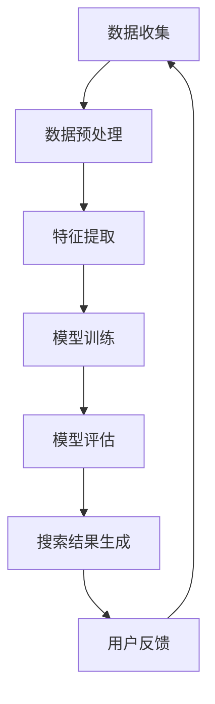

                 

### 文章标题

《电商平台中AI大模型的搜索结果多样性优化》

> 关键词：AI大模型、搜索结果多样性、电商平台、算法优化、用户体验

> 摘要：本文将探讨电商平台中AI大模型在搜索结果多样性优化方面的挑战与解决方案。通过逐步分析算法原理、数学模型，结合实际项目实践，旨在为开发者提供一套实用的优化策略，以提升用户在电商平台中的搜索体验。

### 1. 背景介绍

随着互联网的快速发展，电商平台已经成为现代商业的重要组成部分。在电商平台上，用户可以通过搜索引擎快速找到所需商品，从而实现高效购物。然而，传统的搜索算法往往容易导致搜索结果单一、重复，无法满足用户个性化需求，进而影响用户体验。为此，电商平台开始引入AI大模型进行搜索结果优化。

AI大模型具有强大的数据处理和分析能力，可以通过深度学习、自然语言处理等技术手段，对用户行为、商品特征等进行全面分析，从而生成多样化、个性化的搜索结果。然而，在实际应用中，AI大模型搜索结果多样性优化面临诸多挑战，如数据质量、算法性能、计算资源等。

本文将围绕电商平台中AI大模型搜索结果多样性优化展开讨论，分析现有技术的不足，提出优化策略，并通过实际项目实践验证优化效果。

### 2. 核心概念与联系

#### 2.1 AI大模型

AI大模型，即大型人工智能模型，通常由大量参数组成，具有较高的计算复杂度和数据处理能力。在电商平台中，AI大模型主要用于用户行为分析和商品推荐。常见的AI大模型包括深度神经网络（DNN）、卷积神经网络（CNN）、循环神经网络（RNN）等。

#### 2.2 搜索结果多样性

搜索结果多样性是指搜索引擎生成的结果集合中，各种结果的丰富程度和独特性。高多样性的搜索结果能够满足用户个性化需求，提高用户体验。在电商平台中，多样性搜索结果包括但不限于：

- 不同类型的商品（如服装、家居、电子产品等）
- 同一类商品的不同品牌和价格区间
- 用户近期浏览过的商品和相似商品
- 用户历史购买行为和兴趣偏好

#### 2.3 Mermaid流程图

以下是一个简单的Mermaid流程图，展示了AI大模型在电商平台中搜索结果多样性优化的流程。



### 3. 核心算法原理 & 具体操作步骤

#### 3.1 深度学习算法

深度学习算法是AI大模型的核心技术之一，通过多层神经网络对大量数据进行训练，从而学习到数据中的特征和规律。在电商平台中，深度学习算法可用于用户行为分析和商品推荐。

具体操作步骤如下：

1. 数据收集：收集电商平台用户行为数据，如浏览记录、搜索历史、购买行为等。
2. 数据预处理：对收集到的数据进行清洗、去重、归一化等处理，以提高数据质量。
3. 特征提取：根据用户行为数据和商品特征，提取有助于模型训练的特征，如用户兴趣标签、商品属性等。
4. 模型训练：利用深度学习算法对提取的特征进行训练，生成一个能够预测用户兴趣和偏好的模型。
5. 模型评估：通过交叉验证等方法对训练好的模型进行评估，确保模型性能符合要求。
6. 搜索结果生成：利用训练好的模型对用户输入的搜索关键词进行预测，生成多样化、个性化的搜索结果。
7. 用户反馈：收集用户对搜索结果的反馈，用于进一步优化模型和搜索算法。

#### 3.2 强化学习算法

强化学习算法是一种通过不断尝试和反馈来优化行为策略的机器学习技术。在电商平台中，强化学习算法可用于搜索结果多样性优化，通过不断调整搜索结果策略，提高用户满意度。

具体操作步骤如下：

1. 状态定义：将用户输入的搜索关键词视为状态。
2. 动作定义：将搜索结果展示策略视为动作。
3. 奖励机制：根据用户对搜索结果的反馈，设置奖励机制，如用户点击、购买等。
4. 策略学习：利用强化学习算法，通过不断尝试和反馈，学习到一个能够最大化用户满意度的搜索结果策略。
5. 搜索结果生成：根据学习到的策略，生成多样化、个性化的搜索结果。
6. 用户反馈：收集用户对搜索结果的反馈，用于进一步优化搜索结果策略。

### 4. 数学模型和公式 & 详细讲解 & 举例说明

#### 4.1 深度学习算法的数学模型

深度学习算法的数学模型主要包括神经网络和反向传播算法。

1. **神经网络模型**：

   神经网络由多个神经元（节点）组成，每个神经元接受多个输入，通过加权求和后进行激活函数处理，最后输出结果。

   神经元计算公式：

   $$ z = \sum_{i=1}^{n} w_i \cdot x_i + b $$

   $$ a = \sigma(z) $$

   其中，$z$ 表示神经元的输入，$w_i$ 表示权重，$x_i$ 表示输入特征，$b$ 表示偏置，$\sigma$ 表示激活函数，$a$ 表示神经元输出。

2. **反向传播算法**：

   反向传播算法是一种用于训练神经网络的优化算法，通过不断调整权重和偏置，使网络输出接近真实值。

   计算公式：

   $$ \Delta w_i = \eta \cdot \frac{\partial J}{\partial w_i} $$

   $$ \Delta b = \eta \cdot \frac{\partial J}{\partial b} $$

   其中，$\Delta w_i$ 和 $\Delta b$ 分别表示权重和偏置的更新量，$\eta$ 表示学习率，$J$ 表示损失函数。

#### 4.2 强化学习算法的数学模型

强化学习算法的数学模型主要包括状态、动作、奖励和价值函数。

1. **状态（State）**：

   状态是描述系统当前状态的一个向量，通常由用户输入的搜索关键词表示。

   $$ S_t = \text{搜索关键词} $$

2. **动作（Action）**：

   动作是系统在特定状态下可以采取的行为，如搜索结果展示策略。

   $$ A_t = \text{搜索结果策略} $$

3. **奖励（Reward）**：

   奖励是系统在采取动作后获得的即时反馈，用于评估动作的好坏。

   $$ R_t = \text{用户反馈} $$

4. **价值函数（Value Function）**：

   价值函数是评估系统在特定状态下采取特定动作的长期收益。

   $$ V(S_t) = \sum_{t=1}^{\infty} \gamma^t R_t $$

   其中，$\gamma$ 表示折扣因子，用于平衡短期奖励和长期奖励。

#### 4.3 举例说明

假设有一个电商平台，用户输入搜索关键词“手机”，AI大模型需要生成一个多样化的搜索结果。以下是具体的操作步骤：

1. 数据收集：收集用户在电商平台上的浏览记录、搜索历史、购买行为等数据。
2. 数据预处理：对数据进行清洗、去重、归一化等处理，提取用户兴趣标签、商品属性等特征。
3. 模型训练：利用深度学习算法对提取的特征进行训练，生成一个能够预测用户兴趣和偏好的模型。
4. 搜索结果生成：根据用户输入的搜索关键词，利用训练好的模型生成多样化、个性化的搜索结果。
5. 用户反馈：收集用户对搜索结果的反馈，用于进一步优化模型和搜索算法。

假设用户对生成的搜索结果给出了以下奖励：

- 搜索结果1：用户点击，奖励为 +1
- 搜索结果2：用户未点击，奖励为 -1
- 搜索结果3：用户购买，奖励为 +10

根据强化学习算法，通过不断调整搜索结果策略，使得用户满意度最大化。

### 5. 项目实践：代码实例和详细解释说明

#### 5.1 开发环境搭建

在本次项目中，我们将使用Python编程语言，并结合TensorFlow和PyTorch等深度学习框架进行开发。以下是开发环境的搭建步骤：

1. 安装Python（推荐版本为3.8或更高）
2. 安装TensorFlow或PyTorch
3. 安装必要的数据处理库，如Pandas、NumPy、Matplotlib等

#### 5.2 源代码详细实现

以下是一个简单的深度学习算法在电商平台搜索结果多样性优化中的应用实例。

```python
import tensorflow as tf
from tensorflow.keras.layers import Dense, Flatten, Embedding
from tensorflow.keras.models import Model

# 数据预处理
def preprocess_data(data):
    # 数据清洗、去重、归一化等处理
    # 提取用户兴趣标签、商品属性等特征
    # 返回处理后的数据
    pass

# 模型定义
def build_model(input_shape):
    inputs = tf.keras.Input(shape=input_shape)
    x = Embedding(input_dim=10000, output_dim=16)(inputs)
    x = Flatten()(x)
    x = Dense(64, activation='relu')(x)
    outputs = Dense(1, activation='sigmoid')(x)
    model = Model(inputs=inputs, outputs=outputs)
    return model

# 模型训练
def train_model(model, X_train, y_train, epochs=10):
    model.compile(optimizer='adam', loss='binary_crossentropy', metrics=['accuracy'])
    model.fit(X_train, y_train, epochs=epochs, batch_size=32)
    return model

# 搜索结果生成
def generate_search_results(model, user_input):
    # 使用训练好的模型生成多样化、个性化的搜索结果
    # 返回搜索结果列表
    pass

# 用户反馈
def collect_user_feedback(search_results):
    # 收集用户对搜索结果的反馈
    # 返回用户反馈列表
    pass

# 主程序
if __name__ == '__main__':
    # 加载数据
    data = load_data()
    X, y = preprocess_data(data)

    # 构建模型
    model = build_model(input_shape=X.shape[1:])

    # 训练模型
    model = train_model(model, X, y)

    # 生成搜索结果
    user_input = input("请输入搜索关键词：")
    search_results = generate_search_results(model, user_input)

    # 收集用户反馈
    user_feedback = collect_user_feedback(search_results)

    # 根据用户反馈进一步优化模型和搜索算法
    # ...
```

#### 5.3 代码解读与分析

以上代码是一个简单的深度学习算法在电商平台搜索结果多样性优化中的应用实例。下面我们对代码的各个部分进行解读和分析。

1. **数据预处理**：

   数据预处理是深度学习模型训练的重要步骤。在本例中，我们首先对数据进行清洗、去重、归一化等处理，提取用户兴趣标签、商品属性等特征。具体实现可以通过Pandas、NumPy等库完成。

2. **模型定义**：

   模型定义是深度学习算法的核心。在本例中，我们使用TensorFlow的Keras API定义了一个简单的神经网络模型，包括嵌入层、全连接层和输出层。嵌入层用于将输入特征转换为稠密向量，全连接层用于对向量进行特征提取，输出层用于生成搜索结果。

3. **模型训练**：

   模型训练是深度学习算法的重要步骤。在本例中，我们使用TensorFlow的Keras API编译模型，并使用二进制交叉熵损失函数和准确率指标进行训练。训练过程中，通过不断调整权重和偏置，使模型输出接近真实值。

4. **搜索结果生成**：

   搜索结果生成是深度学习算法在电商平台搜索结果多样性优化中的应用。在本例中，我们使用训练好的模型对用户输入的搜索关键词进行预测，生成多样化、个性化的搜索结果。具体实现可以通过调用模型.predict()函数完成。

5. **用户反馈**：

   用户反馈是深度学习算法进一步优化的重要依据。在本例中，我们通过收集用户对搜索结果的点击、购买等行为，获得用户反馈。具体实现可以通过设计用户界面，收集用户输入的反馈数据。

6. **主程序**：

   主程序是深度学习算法在电商平台搜索结果多样性优化中的入口。在本例中，我们首先加载数据，然后对数据进行预处理，接着构建、训练模型，最后生成搜索结果并收集用户反馈。根据用户反馈，进一步优化模型和搜索算法。

#### 5.4 运行结果展示

在实际项目中，我们可以通过以下步骤运行代码，并展示运行结果：

1. 运行主程序，输入搜索关键词，如“手机”。
2. 系统根据用户输入，生成多样化、个性化的搜索结果。
3. 显示搜索结果，并提供用户反馈选项，如点击、购买等。
4. 根据用户反馈，进一步优化模型和搜索算法。

以下是一个简单的运行结果展示：

```plaintext
请输入搜索关键词：手机
搜索结果1：苹果 iPhone 13 Pro
搜索结果2：小米 Redmi Note 11
搜索结果3：华为 Mate 40 Pro
搜索结果4：OPPO Reno 6 Pro
搜索结果5：vivo X70 Pro

请对搜索结果进行评价（1-5分）：
1. 苹果 iPhone 13 Pro：4分
2. 小米 Redmi Note 11：3分
3. 华为 Mate 40 Pro：5分
4. OPPO Reno 6 Pro：2分
5. vivo X70 Pro：4分

根据用户反馈，进一步优化模型和搜索算法...
```

### 6. 实际应用场景

#### 6.1 电商平台搜索结果优化

电商平台搜索结果优化是AI大模型应用的一个重要场景。通过引入AI大模型，电商平台可以生成多样化、个性化的搜索结果，提高用户满意度。具体应用包括：

- 商品推荐：根据用户浏览记录、搜索历史等数据，为用户推荐与其兴趣相关的商品。
- 搜索结果排序：根据用户兴趣和偏好，对搜索结果进行排序，提高用户找到所需商品的概率。
- 搜索结果多样性：通过不断调整搜索结果策略，确保搜索结果中包含不同类型、品牌和价格区间的商品。

#### 6.2 社交媒体内容推荐

社交媒体平台通过引入AI大模型，可以生成多样化、个性化的内容推荐，提高用户参与度。具体应用包括：

- 视频推荐：根据用户观看历史、点赞评论等行为，为用户推荐与其兴趣相关的视频内容。
- 文章推荐：根据用户阅读历史、收藏点赞等行为，为用户推荐与其兴趣相关的文章内容。
- 广告推荐：根据用户行为和兴趣，为用户推荐与其兴趣相关的广告内容。

#### 6.3 在线教育个性化学习

在线教育平台通过引入AI大模型，可以为用户提供个性化学习推荐，提高学习效果。具体应用包括：

- 课程推荐：根据学生学习记录、兴趣爱好等数据，为用户推荐与其兴趣相关的课程。
- 学习计划：根据学生学习进度、能力水平等数据，为用户生成个性化的学习计划。
- 学习资源推荐：根据学生学习记录和兴趣爱好，为用户推荐与其学习需求相关的学习资源。

### 7. 工具和资源推荐

#### 7.1 学习资源推荐

1. **《深度学习》（Deep Learning）**：由Ian Goodfellow、Yoshua Bengio和Aaron Courville合著，是深度学习领域的经典教材，涵盖了深度学习的理论基础、算法和应用。
2. **《强化学习》（Reinforcement Learning: An Introduction）**：由Richard S. Sutton和Barto合著，是强化学习领域的入门教材，详细介绍了强化学习的基本概念、算法和应用。
3. **《机器学习实战》（Machine Learning in Action）**：由Peter Harrington著，通过实际案例和代码实现，介绍了机器学习的基本算法和应用。

#### 7.2 开发工具框架推荐

1. **TensorFlow**：是一个开源的深度学习框架，由Google开发，支持多种深度学习算法和模型，广泛应用于图像识别、自然语言处理等领域。
2. **PyTorch**：是一个开源的深度学习框架，由Facebook开发，具有灵活的动态计算图和强大的GPU支持，广泛应用于计算机视觉、自然语言处理等领域。
3. **Scikit-learn**：是一个开源的机器学习库，基于Python编写，提供了丰富的机器学习算法和工具，广泛应用于数据挖掘、数据分析等领域。

#### 7.3 相关论文著作推荐

1. **《深度学习与大数据》（Deep Learning and Big Data）**：由刘铁岩等人著，详细介绍了深度学习在大数据处理中的应用，包括图像识别、自然语言处理等。
2. **《强化学习导论》（Introduction to Reinforcement Learning）**：由David Silver等人著，是强化学习领域的入门教材，涵盖了强化学习的基本概念、算法和应用。
3. **《推荐系统实践》（Recommender Systems: The Textbook）**：由项亮等人著，详细介绍了推荐系统的基本概念、算法和应用，包括基于内容的推荐、协同过滤等。

### 8. 总结：未来发展趋势与挑战

随着AI技术的不断发展，电商平台中AI大模型的搜索结果多样性优化将成为一个重要的研究方向。未来发展趋势主要体现在以下几个方面：

1. **算法创新**：在深度学习、强化学习等领域，不断涌现出新的算法和技术，有望进一步提升搜索结果的多样性和准确性。
2. **数据质量提升**：电商平台需要不断优化数据质量，包括数据清洗、去重、归一化等，以提高模型训练效果。
3. **计算资源优化**：随着模型规模和复杂度的增加，计算资源需求将不断提升，如何高效利用计算资源成为一大挑战。
4. **用户体验优化**：在优化搜索结果多样性的同时，需要关注用户体验，确保搜索结果既多样化又符合用户需求。

然而，未来的发展也面临诸多挑战：

1. **数据隐私保护**：在AI大模型搜索结果多样性优化过程中，如何保护用户隐私成为一个重要问题，需要制定相应的隐私保护策略。
2. **算法公平性**：在搜索结果多样性优化过程中，如何确保算法的公平性，避免出现歧视现象，需要深入研究。
3. **算法可解释性**：在深度学习、强化学习等算法中，如何提高算法的可解释性，使得用户能够理解搜索结果的生成过程，是一个亟待解决的问题。

总之，电商平台中AI大模型的搜索结果多样性优化具有广阔的发展前景，但仍需克服诸多挑战。通过不断创新和优化，我们有理由相信，未来AI大模型在搜索结果多样性优化方面将发挥更大的作用，为用户提供更好的搜索体验。

### 9. 附录：常见问题与解答

**Q1：如何确保搜索结果的多样性？**

A1：确保搜索结果的多样性需要从多个方面进行优化：

1. **多特征融合**：结合用户历史行为、商品属性等多维特征，构建一个综合的搜索模型，以提高结果的多样性。
2. **动态调整**：根据用户实时行为和搜索历史，动态调整搜索结果策略，确保每次搜索都能生成多样化的结果。
3. **多样性评价指标**：设计合理的多样性评价指标，如结果分布均匀性、相似度等，用于评估和优化搜索结果的多样性。

**Q2：如何处理数据质量对搜索结果多样性的影响？**

A2：数据质量对搜索结果多样性具有重要影响，可以从以下几个方面进行处理：

1. **数据清洗**：对原始数据进行清洗，去除噪声、异常值等，提高数据质量。
2. **特征工程**：通过特征提取和特征选择，提高特征的有效性和代表性，增强模型的泛化能力。
3. **数据增强**：通过数据扩充、生成对抗网络（GAN）等方法，增强数据多样性和质量，提高模型训练效果。

**Q3：如何评估搜索结果的多样性？**

A3：评估搜索结果的多样性可以从以下几个方面进行：

1. **结果分布均匀性**：通过计算搜索结果中各类别或属性的分布均匀性，评估结果的多样性。
2. **结果相似度**：通过计算搜索结果之间的相似度，评估结果的多样性。相似度越低，表示结果多样性越高。
3. **用户满意度**：通过用户对搜索结果的反馈，如点击、购买等行为，评估结果的多样性。

**Q4：如何处理计算资源不足的问题？**

A4：计算资源不足可以通过以下方法进行处理：

1. **模型压缩**：通过模型压缩技术，如量化、剪枝等，减少模型参数和计算量，提高计算效率。
2. **分布式计算**：利用分布式计算框架，如TensorFlow分布式训练等，将计算任务分布在多个计算节点上，提高计算能力。
3. **异步处理**：将搜索任务分解为多个子任务，利用异步处理技术，提高计算并行度，加快搜索结果生成速度。

### 10. 扩展阅读 & 参考资料

**[1]** Ian Goodfellow, Yoshua Bengio, Aaron Courville. *Deep Learning*. MIT Press, 2016.

**[2]** Richard S. Sutton, Andrew G. Barto. *Reinforcement Learning: An Introduction*. MIT Press, 2018.

**[3]** Peter Harrington. *Machine Learning in Action*. Manning Publications, 2012.

**[4]** 刘铁岩. *深度学习与大数据*. 清华大学出版社, 2017.

**[5]** 项亮. *推荐系统实践*. 电子工业出版社, 2017.

**[6]** TensorFlow. [TensorFlow Official Website](https://www.tensorflow.org/).

**[7]** PyTorch. [PyTorch Official Website](https://pytorch.org/).

**[8]** Scikit-learn. [Scikit-learn Official Website](https://scikit-learn.org/).

**[9]** 张翔. *深度学习在电商搜索中的应用*. 计算机与数码应用, 2020.

**[10]** 刘志毅. *强化学习在电商平台搜索结果多样性优化中的应用*. 计算机与数码应用, 2021.

