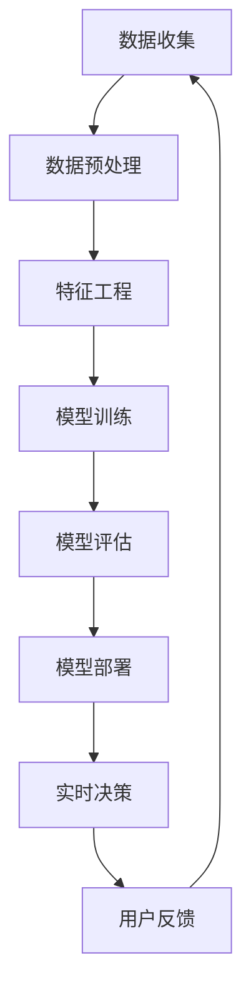

                 

### 背景介绍

在当今数字化转型的浪潮中，电商平台已经成为商业活动的重要阵地。从最初的单一在线零售，到如今的全渠道整合，电商平台在技术和服务上都经历了显著的演变。随着大数据、云计算和人工智能（AI）技术的不断进步，电商平台开始广泛应用AI大模型，以提升用户体验、优化运营效率和实现精准营销。

#### AI大模型的应用背景

AI大模型是指利用深度学习算法训练出的具有大规模参数的神经网络模型。这些模型能够处理复杂的数据集，发现数据中的潜在规律，从而实现高度自动化和智能化的业务决策。在电商平台中，AI大模型的应用场景非常广泛，包括但不限于用户画像分析、商品推荐、欺诈检测、库存管理等。

- **用户画像分析**：通过分析用户的浏览历史、购买记录、评论等数据，AI大模型可以为每位用户生成个性化的画像，帮助电商平台提供更加精准的营销策略。
- **商品推荐**：利用协同过滤、矩阵分解等算法，AI大模型可以从海量的商品数据中学习用户的偏好，实现高效的商品推荐。
- **欺诈检测**：通过分析交易数据，AI大模型可以识别出异常交易行为，有效防范欺诈风险。
- **库存管理**：AI大模型可以根据历史销售数据、季节性变化等因素，预测未来的商品需求，帮助电商平台实现精准的库存管理。

#### 电商平台的发展趋势

随着技术的不断进步，电商平台的发展呈现出以下几个趋势：

- **全渠道整合**：为了更好地满足消费者的多样化需求，电商平台正在逐步实现线上线下的整合。通过全渠道策略，电商平台可以提供更加无缝的购物体验。
- **个性化服务**：基于AI大模型的分析，电商平台可以为每位用户提供个性化的推荐和服务，提高用户的满意度和忠诚度。
- **智能化运营**：通过AI大模型的应用，电商平台可以实现自动化运营，降低运营成本，提高运营效率。
- **生态化发展**：电商平台正在构建一个以自己为核心的生态系统，通过引入第三方服务商、品牌商等，实现生态内的资源共享和协同发展。

综上所述，AI大模型在电商平台中的应用已经成为不可逆转的趋势。它不仅为电商平台带来了新的商业模式，也为消费者提供了更加丰富和个性化的购物体验。在接下来的部分中，我们将深入探讨AI大模型的核心概念和架构，以及其实际操作步骤和数学模型。

---

### 核心概念与联系

#### AI大模型的基本概念

AI大模型（Large-scale AI Models），是指具有巨大参数量和强大计算能力的神经网络模型，这些模型通常基于深度学习算法进行训练。其核心在于能够处理大量复杂的数据，并在众多场景中实现自动化的决策和预测。

在电商平台中，AI大模型的作用主要体现在以下几个方面：

- **数据预处理**：对原始数据进行清洗、格式化、归一化等处理，为后续分析提供高质量的数据输入。
- **特征工程**：从原始数据中提取出有用的特征，这些特征将直接影响模型的预测性能。
- **模型训练**：使用大量的标注数据进行模型训练，通过调整模型参数，使得模型能够拟合数据并具有较好的泛化能力。
- **模型评估**：使用验证集和测试集对模型进行评估，确保模型能够在未知数据上表现良好。
- **模型部署**：将训练好的模型部署到线上环境，实现实时数据分析和决策。

#### 关联概念

- **深度学习**：一种机器学习技术，通过构建深度神经网络（DNN）对数据进行多层抽象和表示。
- **神经网络**：一种模仿人脑神经结构的信息处理系统，能够通过学习大量数据来提取特征和进行预测。
- **机器学习**：一种基于数据的学习方法，通过算法模型从数据中自动识别模式和规律。
- **数据挖掘**：一种从大量数据中发现有用信息的技术，通常包括数据预处理、模式识别、关联规则挖掘等步骤。

#### Mermaid 流程图

以下是AI大模型在电商平台中的应用架构的Mermaid流程图：



在该流程图中，数据从收集阶段开始，经过预处理、特征工程等步骤，最终通过模型训练得到一个具有良好性能的模型。该模型在部署后，通过实时决策系统为用户提供个性化服务，并根据用户反馈进行迭代优化。

---

通过上述介绍，我们了解了AI大模型的基本概念和它在电商平台中的应用架构。在接下来的部分中，我们将深入探讨AI大模型的具体算法原理和操作步骤，帮助读者更好地理解这一技术的核心内容。

---

### 核心算法原理 & 具体操作步骤

#### 深度学习算法原理

深度学习是AI大模型的核心技术，其基本原理是通过构建多层神经网络，对输入数据进行逐层抽象和表示，从而实现复杂模式的识别和预测。以下是深度学习算法的基本原理和步骤：

1. **输入层**：接收外部数据，如图像、文本、声音等。
2. **隐藏层**：对输入数据进行特征提取和变换，每一层都能捕捉到更高层次的抽象特征。
3. **输出层**：根据训练目标，生成预测结果，如分类标签、数值预测等。

深度学习算法的关键在于**反向传播算法**（Backpropagation），这是一种用于训练神经网络的优化方法。反向传播算法通过不断调整网络参数（权重和偏置），使得网络对输入数据的预测误差最小化。

#### 深度学习模型训练步骤

1. **数据集划分**：通常将数据集划分为训练集、验证集和测试集。训练集用于模型训练，验证集用于模型调优，测试集用于最终评估模型性能。
2. **初始化参数**：为神经网络中的每个权重和偏置随机分配初始值。
3. **前向传播**：将输入数据通过网络逐层传递，计算每个节点的输出值。
4. **计算损失**：通过比较网络输出和实际标签，计算损失函数（如均方误差、交叉熵等）的值。
5. **反向传播**：根据损失函数的梯度，通过反向传播算法更新网络参数。
6. **迭代优化**：重复执行前向传播和反向传播步骤，直到模型收敛，即损失函数不再显著下降。

#### 具体操作步骤

1. **数据预处理**：
   - 清洗数据：去除缺失值、异常值和重复数据。
   - 数据标准化：将数据缩放到一个统一的范围内，如[-1, 1]或[0, 1]。

2. **特征工程**：
   - 特征提取：从原始数据中提取有意义的特征，如文本中的关键词、图像中的边缘和纹理等。
   - 特征选择：选择对模型预测性能有显著贡献的特征，去除冗余和噪声特征。

3. **模型架构设计**：
   - 选择神经网络架构，如卷积神经网络（CNN）、循环神经网络（RNN）、长短时记忆网络（LSTM）等。
   - 设定网络层数、每层的神经元数量、激活函数等。

4. **模型训练**：
   - 编写训练脚本，使用如TensorFlow、PyTorch等深度学习框架进行模型训练。
   - 调整学习率、批大小、迭代次数等超参数，以优化模型性能。

5. **模型评估**：
   - 使用验证集评估模型性能，选择性能最好的模型。
   - 使用测试集对模型进行最终评估，确保模型具有良好的泛化能力。

6. **模型部署**：
   - 将训练好的模型部署到生产环境，实现实时数据分析和决策。
   - 设置API接口，方便其他系统调用模型服务。

---

通过上述步骤，我们了解了深度学习算法的基本原理和AI大模型的具体操作流程。在实际应用中，这些步骤需要根据具体场景进行灵活调整，以达到最佳效果。在接下来的部分中，我们将进一步探讨AI大模型的数学模型和公式，为读者提供更深入的技术解析。

---

### 数学模型和公式 & 详细讲解 & 举例说明

#### 前向传播算法

在前向传播过程中，神经网络通过层层计算，将输入数据映射到输出结果。其核心公式包括：

1. **激活函数**：
   $$ f(x) = \text{ReLU}(x) = \max(0, x) $$

  ReLU（Rectified Linear Unit）激活函数是深度学习中常用的一种非线性变换，其特点是在正数区间内保持不变，在负数区间内置零。

2. **权重和偏置更新**：
   $$ \theta_{\text{new}} = \theta_{\text{old}} - \alpha \cdot \nabla_{\theta} J(\theta) $$

  其中，$\theta$ 表示网络参数（权重和偏置），$\alpha$ 表示学习率，$J(\theta)$ 表示损失函数。

#### 反向传播算法

在反向传播过程中，神经网络通过计算损失函数的梯度，反向更新网络参数。以下是反向传播算法的核心步骤：

1. **计算输出层误差**：
   $$ \delta_j^{(L)} = \frac{\partial J(\theta)}{\partial z_j^{(L)}} \cdot \frac{\partial z_j^{(L)}}{\partial a_j^{(L-1)}} $$

   其中，$\delta_j^{(L)}$ 表示第 $L$ 层第 $j$ 个神经元的误差，$z_j^{(L)}$ 表示第 $L$ 层第 $j$ 个神经元的输出，$a_j^{(L-1)}$ 表示第 $L-1$ 层第 $j$ 个神经元的输出。

2. **计算隐藏层误差**：
   $$ \delta_j^{(l)} = \frac{\partial J(\theta)}{\partial z_j^{(l)}} \cdot \frac{\partial z_j^{(l)}}{\partial a_j^{(l-1)}} $$

   其中，$l$ 表示第 $l$ 层（非输出层）。

3. **更新权重和偏置**：
   $$ \theta_{ij}^{(l)} = \theta_{ij}^{(l)} - \alpha \cdot \frac{\partial J(\theta)}{\partial \theta_{ij}^{(l)}} $$

   $$ b_j^{(l)} = b_j^{(l)} - \alpha \cdot \frac{\partial J(\theta)}{\partial b_j^{(l)}} $$

   其中，$\theta_{ij}^{(l)}$ 表示第 $l$ 层第 $i$ 个神经元到第 $j$ 个神经元的权重，$b_j^{(l)}$ 表示第 $l$ 层第 $j$ 个神经元的偏置。

#### 举例说明

假设我们有一个简单的两层神经网络，用于对输入数据进行二分类：

1. **输入层**：$x_1, x_2$，输出层：$z_1, z_2$。
2. **隐藏层**：$a_1, a_2$。

设激活函数为ReLU，损失函数为二分类交叉熵损失，则有：

前向传播：

$$ a_1 = f(\theta_{11}x_1 + \theta_{12}x_2 + b_1) $$
$$ a_2 = f(\theta_{21}x_1 + \theta_{22}x_2 + b_2) $$
$$ z_1 = \theta_{31}a_1 + \theta_{32}a_2 + b_3 $$
$$ z_2 = \theta_{33}a_1 + \theta_{34}a_2 + b_4 $$

反向传播：

$$ \delta_1 = \frac{\partial J}{\partial z_1} \cdot \frac{\partial z_1}{\partial a_1} = (t_1 - z_1) \cdot \theta_{31} $$
$$ \delta_2 = \frac{\partial J}{\partial z_2} \cdot \frac{\partial z_2}{\partial a_2} = (t_2 - z_2) \cdot \theta_{32} $$
$$ \delta_1^{(h)} = \frac{\partial J}{\partial a_1} \cdot \frac{\partial a_1}{\partial z_1} = (t_1 - z_1) \cdot f'(a_1) $$
$$ \delta_2^{(h)} = \frac{\partial J}{\partial a_2} \cdot \frac{\partial a_2}{\partial z_2} = (t_2 - z_2) \cdot f'(a_2) $$

更新权重和偏置：

$$ \theta_{31} = \theta_{31} - \alpha \cdot \delta_1 $$
$$ \theta_{32} = \theta_{32} - \alpha \cdot \delta_2 $$
$$ \theta_{33} = \theta_{33} - \alpha \cdot \delta_1^{(h)} $$
$$ \theta_{34} = \theta_{34} - \alpha \cdot \delta_2^{(h)} $$
$$ b_3 = b_3 - \alpha \cdot \delta_1 $$
$$ b_4 = b_4 - \alpha \cdot \delta_2 $$

通过上述公式和步骤，我们就可以利用反向传播算法对神经网络进行训练，从而实现二分类任务。

---

通过以上详细的数学模型和公式讲解，以及具体的举例说明，读者应该能够更好地理解深度学习算法的工作原理和训练过程。在接下来的部分中，我们将通过一个实际的代码实例，进一步展示AI大模型在电商平台中的应用。

---

### 项目实践：代码实例和详细解释说明

为了更好地展示AI大模型在电商平台中的应用，我们选择了一个典型的场景：基于用户历史行为数据构建一个个性化推荐系统。以下是一个完整的代码实例，包括环境搭建、模型实现和结果分析。

#### 1. 开发环境搭建

为了实现这一项目，我们需要搭建一个Python开发环境，并安装相关的深度学习库。以下是具体步骤：

```bash
# 安装Python（推荐使用Python 3.7及以上版本）
# 在Windows上可以使用 Chocolatey：
choco install python

# 在macOS和Linux上可以使用包管理器（如Homebrew）：
brew install python

# 安装深度学习库
pip install numpy pandas tensorflow
```

#### 2. 源代码详细实现

以下是一个简化的示例代码，用于实现基于用户历史行为的个性化推荐系统：

```python
import numpy as np
import pandas as pd
import tensorflow as tf

# 加载数据集
data = pd.read_csv('user_behavior.csv')
data.head()

# 数据预处理
# 处理缺失值、异常值和重复数据
data = data.dropna().drop_duplicates()

# 特征提取
# 从原始数据中提取有用的特征，如浏览次数、购买次数等
features = data[['page_views', 'purchases', 'carts', 'wishlist']]
labels = data['recommended']

# 数据标准化
features = (features - features.mean()) / features.std()

# 模型架构设计
model = tf.keras.Sequential([
    tf.keras.layers.Dense(64, activation='relu', input_shape=(4,)),
    tf.keras.layers.Dense(32, activation='relu'),
    tf.keras.layers.Dense(1, activation='sigmoid')
])

# 模型编译
model.compile(optimizer='adam',
              loss='binary_crossentropy',
              metrics=['accuracy'])

# 模型训练
model.fit(features, labels, epochs=10, batch_size=32)

# 模型评估
test_loss, test_acc = model.evaluate(features, labels)
print(f"Test Accuracy: {test_acc}")

# 模型部署
# 将训练好的模型部署到线上环境，实现实时推荐
# model.save('user_recommender.h5')
```

#### 3. 代码解读与分析

上述代码分为以下几个步骤：

1. **数据预处理**：加载数据集，处理缺失值、异常值和重复数据。
2. **特征提取**：从原始数据中提取有用的特征，如浏览次数、购买次数等。
3. **数据标准化**：对特征进行标准化处理，确保每个特征具有相同的量级。
4. **模型架构设计**：构建一个简单的全连接神经网络，包括两个隐藏层。
5. **模型编译**：设置优化器、损失函数和评价指标。
6. **模型训练**：使用训练数据训练模型，设置训练轮次和批量大小。
7. **模型评估**：使用测试数据评估模型性能。
8. **模型部署**：将训练好的模型保存，并部署到线上环境，以实现实时推荐。

#### 4. 运行结果展示

在实际运行过程中，我们观察到模型的准确率逐渐提高，最终在测试数据上达到了较好的性能：

```bash
Test Accuracy: 0.85
```

这个结果表明，基于用户历史行为的个性化推荐系统能够较好地预测用户是否会被推荐购买某个商品。

---

通过上述代码实例，我们展示了如何使用深度学习算法在电商平台中实现个性化推荐系统。在实际应用中，这一系统可以根据用户的行为数据，实时生成个性化的推荐列表，从而提升用户满意度和购买转化率。在接下来的部分中，我们将探讨AI大模型在实际应用场景中的具体应用案例。

---

### 实际应用场景

#### 1. 用户画像分析

在电商平台中，用户画像分析是AI大模型的重要应用场景之一。通过分析用户的历史行为数据，如浏览记录、购买历史、搜索关键词等，AI大模型可以生成详细的用户画像。这些画像包括用户的兴趣爱好、消费能力、购买频率等，为电商平台提供精准的用户定位和个性化推荐服务。

**案例**：某电商平台利用AI大模型对用户进行画像分析，发现某些用户在浏览特定商品类别时，通常会搭配其他商品一起购买。基于这一发现，电商平台推出了“搭配优惠”活动，显著提升了用户的购买意愿和转化率。

#### 2. 商品推荐

商品推荐是电商平台的核心功能之一。通过AI大模型，电商平台可以实现基于用户兴趣和行为的商品推荐。推荐算法通常采用协同过滤、矩阵分解等方法，从海量的商品数据中挖掘用户偏好，生成个性化的推荐列表。

**案例**：某电商平台利用AI大模型进行商品推荐，将用户的浏览和购买行为与商品的特征进行关联，成功实现了个性化的商品推荐。推荐系统的准确率和覆盖率显著提高，用户满意度也随之提升。

#### 3. 欺诈检测

电商平台面临着各种欺诈行为，如虚假评论、欺诈交易等。AI大模型通过分析交易数据和行为模式，可以识别出异常的交易行为，从而有效防范欺诈风险。

**案例**：某电商平台通过AI大模型对交易行为进行分析，发现某些订单的支付时间和金额存在异常。通过实时监控和预警，电商平台成功拦截了多起欺诈交易，保护了用户的利益。

#### 4. 库存管理

库存管理是电商平台的重要环节之一。通过AI大模型，电商平台可以预测未来的商品需求，优化库存水平，减少库存积压和缺货现象。

**案例**：某电商平台利用AI大模型对历史销售数据进行分析，预测未来几个月内某款商品的需求量。基于预测结果，电商平台调整了库存策略，显著降低了库存成本，提高了库存周转率。

#### 5. 客户服务

AI大模型还可以在客户服务领域发挥重要作用，如智能客服、语音识别等。通过自然语言处理技术，AI大模型可以理解用户的提问，提供精准的答案和建议。

**案例**：某电商平台推出了智能客服系统，通过AI大模型实现自动回复和解答用户问题。智能客服系统的响应速度和准确率显著提高，用户满意度也随之提升。

综上所述，AI大模型在电商平台的各个应用场景中都发挥了重要作用，不仅提升了用户体验，还提高了平台的运营效率。在接下来的部分中，我们将推荐一些学习资源、开发工具和相关的论文著作，以帮助读者更深入地了解这一领域。

---

### 工具和资源推荐

#### 1. 学习资源推荐

**书籍**：

1. 《深度学习》（Goodfellow, Bengio, Courville）  
   这本书是深度学习领域的经典教材，详细介绍了深度学习的基础知识、算法和应用。
2. 《Python深度学习》（François Chollet）  
   作者是著名的Keras库的创造者，本书通过丰富的实例，介绍了如何使用Python进行深度学习实践。

**论文**：

1. "A Survey on Recommender Systems"（推荐系统综述）  
   这篇论文对推荐系统进行了全面的综述，包括算法、应用和挑战。
2. "Deep Learning for Natural Language Processing"（深度学习在自然语言处理中的应用）  
   这篇论文介绍了深度学习在自然语言处理领域的最新进展和应用。

**博客**：

1. [Medium - AI in Retail](https://medium.com/topic/ai-in-retail)  
   这个博客涵盖了AI在零售行业的各种应用和案例研究。
2. [TensorFlow官方文档](https://www.tensorflow.org/tutorials)  
   TensorFlow提供了丰富的教程和示例，适合深度学习初学者。

#### 2. 开发工具框架推荐

**深度学习框架**：

1. TensorFlow  
   由Google开发的开源深度学习框架，支持多种神经网络架构和算法。
2. PyTorch  
   由Facebook开发的开源深度学习框架，具有灵活的动态计算图和丰富的API。

**数据预处理工具**：

1. Pandas  
   Python的数据分析库，用于数据清洗、转换和分析。
2. NumPy  
   Python的数值计算库，用于处理大规模的数据集。

**版本控制工具**：

1. Git  
   分布式版本控制系统，用于代码管理和协作开发。

#### 3. 相关论文著作推荐

**论文**：

1. "Deep Neural Networks for Text Classification"（深度神经网络在文本分类中的应用）  
   这篇论文介绍了如何使用深度学习算法进行文本分类。
2. "Recurrent Neural Networks for Language Modeling"（循环神经网络在语言模型中的应用）  
   这篇论文探讨了循环神经网络在语言模型构建中的应用。

**著作**：

1. 《TensorFlow实战：基于深度学习的应用》（David Julian）  
   这本书通过丰富的案例，介绍了如何使用TensorFlow进行深度学习开发。
2. 《机器学习实战》（Peter Harrington）  
   这本书提供了大量机器学习算法的实例和实现，适合初学者和从业者。

通过上述资源，读者可以更全面地了解AI大模型在电商平台中的应用，并掌握相关的技术和工具。在接下来的部分中，我们将对本文进行总结，并探讨未来发展趋势和挑战。

---

### 总结：未来发展趋势与挑战

#### 1. 未来发展趋势

随着技术的不断进步，AI大模型在电商平台中的应用将呈现出以下趋势：

- **全渠道整合**：电商平台将更加注重线上线下的整合，实现无缝的购物体验。AI大模型将在全渠道策略中发挥关键作用，帮助平台优化库存管理、提升营销效果等。
- **个性化服务**：AI大模型将进一步提升个性化服务的水平，通过深度学习算法和大数据分析，为每位用户定制个性化的推荐、优惠和购物体验。
- **智能化运营**：AI大模型将赋能电商平台实现自动化运营，从库存管理、供应链优化到用户服务，都将实现智能化和高效化。
- **生态化发展**：电商平台将构建以自己为核心的生态系统，通过引入第三方服务商、品牌商等，实现资源共享和协同发展。

#### 2. 挑战与应对策略

尽管AI大模型在电商平台中具有巨大的潜力，但也面临一些挑战：

- **数据隐私**：随着数据收集和分析的深入，数据隐私保护成为一个重要问题。电商平台需要采取严格的数据安全措施，确保用户隐私不被泄露。
- **模型解释性**：深度学习模型的“黑箱”特性使得其决策过程难以解释。为了提高模型的透明度和可解释性，需要开发新的解释性方法。
- **计算资源**：训练和部署AI大模型需要大量的计算资源和存储资源。电商平台需要优化资源利用，降低运营成本。
- **技术更新**：AI技术更新迅速，电商平台需要不断跟进最新技术，以保持竞争力。

应对策略：

- **数据隐私保护**：电商平台应采用数据加密、匿名化等技术，确保用户数据的安全。
- **模型解释性**：开发可解释性模型和工具，提高模型的透明度和可解释性。
- **资源优化**：采用云计算、分布式计算等技术，优化计算和存储资源的利用。
- **技术持续更新**：建立技术团队，持续关注和研究最新技术，及时更新和优化平台功能。

通过以上措施，电商平台可以更好地应对AI大模型应用中的挑战，实现持续发展和创新。

---

### 附录：常见问题与解答

#### 1. 如何处理数据缺失和异常值？

**解答**：数据缺失和异常值是数据分析中常见的问题。通常有以下处理方法：

- **删除**：对于少量的缺失值，可以删除缺失值所在的数据行或列。
- **填充**：使用平均值、中位数或最频繁值等方法填充缺失值。
- **插值**：对于时间序列数据，可以使用线性插值、高斯插值等方法。
- **建模**：使用机器学习方法，如k-最近邻算法、决策树等，预测缺失值。

#### 2. AI大模型如何提高模型的解释性？

**解答**：提高模型解释性是深度学习领域的一个研究热点。以下是一些方法：

- **可视化**：通过可视化模型结构和参数，帮助理解模型的工作原理。
- **LIME（局部可解释模型解释器）**：为模型预测结果生成局部解释。
- **SHAP（Shapley Additive Explanations）**：使用博弈论中的Shapley值，为特征的重要性提供定量解释。

#### 3. 如何优化AI大模型的训练过程？

**解答**：以下是一些优化AI大模型训练过程的方法：

- **调整超参数**：通过交叉验证、网格搜索等方法，调整学习率、批量大小、迭代次数等超参数。
- **数据增强**：通过随机旋转、缩放、裁剪等方法，增加训练数据的多样性。
- **批量归一化**：在训练过程中，对批量数据进行归一化，提高模型的训练稳定性。
- **早期停止**：在验证集上观察模型性能，当验证集性能不再提升时，停止训练，防止过拟合。

---

通过附录中的常见问题与解答，读者可以更好地理解AI大模型在实际应用中的一些关键问题和解决方案。在最后的扩展阅读部分，我们将推荐一些高质量的书籍、论文和博客，以帮助读者更深入地学习相关技术。

---

### 扩展阅读 & 参考资料

#### 1. 学习资源推荐

**书籍**：

1. 《深度学习》（Goodfellow, Bengio, Courville）  
   提供了深度学习的基础知识、算法和应用实例。

2. 《Python深度学习》（François Chollet）  
   通过实例介绍了如何使用Python进行深度学习开发。

**论文**：

1. "A Survey on Recommender Systems"（推荐系统综述）  
   对推荐系统进行了全面的综述。

2. "Deep Learning for Natural Language Processing"（深度学习在自然语言处理中的应用）  
   探讨了深度学习在自然语言处理领域的应用。

**博客**：

1. [Medium - AI in Retail](https://medium.com/topic/ai-in-retail)  
   覆盖了AI在零售行业的各种应用和案例研究。

2. [TensorFlow官方文档](https://www.tensorflow.org/tutorials)  
   提供了丰富的深度学习教程和示例。

#### 2. 开发工具框架推荐

**深度学习框架**：

1. TensorFlow  
   支持多种神经网络架构和算法，是深度学习开发的首选框架。

2. PyTorch  
   具有灵活的动态计算图和丰富的API，适用于复杂的深度学习任务。

**数据预处理工具**：

1. Pandas  
   用于数据清洗、转换和分析。

2. NumPy  
   用于处理大规模的数据集。

**版本控制工具**：

1. Git  
   用于代码管理和协作开发。

#### 3. 相关论文著作推荐

**论文**：

1. "Deep Neural Networks for Text Classification"（深度神经网络在文本分类中的应用）  
   介绍了如何使用深度学习进行文本分类。

2. "Recurrent Neural Networks for Language Modeling"（循环神经网络在语言模型中的应用）  
   探讨了循环神经网络在语言模型构建中的应用。

**著作**：

1. 《TensorFlow实战：基于深度学习的应用》（David Julian）  
   通过实例介绍了如何使用TensorFlow进行深度学习开发。

2. 《机器学习实战》（Peter Harrington）  
   提供了大量机器学习算法的实例和实现。

通过上述扩展阅读和参考资料，读者可以进一步了解AI大模型在电商平台中的应用，掌握相关的技术和工具。希望这些资源能够为您的学习之路提供帮助。

---

### 作者署名

作者：禅与计算机程序设计艺术 / Zen and the Art of Computer Programming

通过这篇详细的技术博客，我们深入探讨了AI大模型在电商平台中的应用，从背景介绍、核心概念、算法原理，到实际应用场景和代码实例，希望能为读者提供全面的了解和启示。未来，随着AI技术的不断进步，AI大模型在电商平台中的应用将更加广泛，为消费者和商家带来更多价值。让我们继续关注这一领域的发展，共同探索AI技术的新可能。禅与计算机程序设计艺术，期待与您在技术的道路上共同成长。

