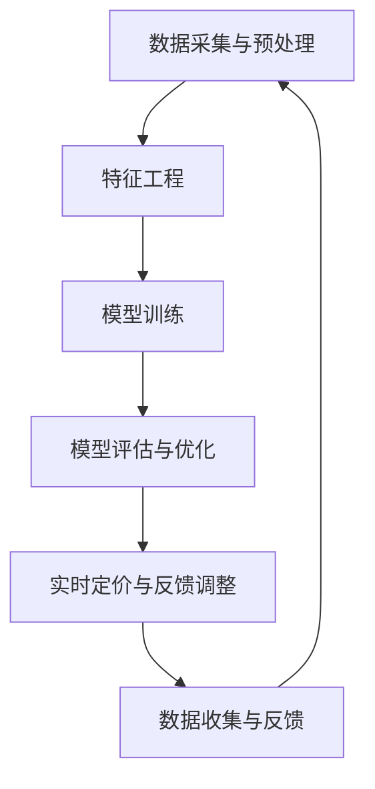

                 

### 背景介绍

#### 电商平台的演变与发展

随着互联网技术的飞速发展，电子商务已经成为全球商业活动中的重要组成部分。电商平台不仅是消费者购买商品的主要渠道，也是商家销售产品、拓展市场的重要途径。从早期的传统电商平台如亚马逊、eBay，到如今内容丰富、功能多样的新型电商平台，如阿里巴巴、京东，电商平台经历了巨大的变革和发展。

电商平台的核心目标之一是提升用户体验，而个性化定价策略作为提升用户体验的重要手段，日益受到关注。传统的定价策略往往基于成本加成、市场调研等方法，但这些方法无法充分考虑到消费者的个体差异和购买行为，从而导致定价不够精准，影响销售业绩。

#### 个性化定价策略的兴起

个性化定价策略，也称为动态定价或智能定价，是指根据消费者的特征、行为、市场环境和库存情况等因素，实时调整商品的价格。这种定价策略旨在最大化利润，提高市场占有率，提升消费者满意度。

个性化定价策略的兴起与人工智能技术的快速发展密不可分。通过机器学习、数据挖掘和优化算法等技术，电商平台可以获取大量的消费者数据，并对这些数据进行深入分析，从而实现更为精准的定价。例如，亚马逊、京东等大型电商平台已经广泛应用个性化定价策略，通过大数据分析，根据消费者的购买历史、浏览行为、地理位置等信息，动态调整商品的价格，从而提高销售量和利润。

#### AI驱动个性化定价模型的必要性

AI驱动个性化定价模型在电商平台中的应用具有重要意义。首先，它能够显著提升定价的准确性。通过机器学习算法，模型可以不断学习并优化定价策略，从而更好地预测市场需求和消费者行为，提高定价策略的有效性。

其次，AI驱动个性化定价模型有助于提升用户体验。通过个性化定价，电商平台可以提供更具针对性的商品推荐和优惠，满足消费者的个性化需求，提升消费者的购买体验和满意度。

最后，AI驱动个性化定价模型还可以提高运营效率。通过自动化定价策略，电商平台可以减少人工干预，降低运营成本，同时提高价格调整的及时性和灵活性，更好地应对市场变化。

综上所述，AI驱动个性化定价模型在电商平台中的应用具有重要意义，它不仅有助于提升销售业绩和利润，还能提高用户满意度和运营效率。在接下来的章节中，我们将深入探讨个性化定价模型的核心概念、算法原理和数学模型，并分享实际应用案例，以期为电商平台的运营决策提供有力支持。### 核心概念与联系

#### 个性化定价策略的定义与分类

个性化定价策略（Personalized Pricing Strategy）是指电商平台根据不同的消费者群体、消费行为以及市场环境，动态调整商品价格的一种策略。其核心思想是通过精准的数据分析和智能算法，为每一位消费者提供最适合其需求的商品价格，从而最大化平台的收益和市场份额。

个性化定价策略主要分为以下几种类型：

1. **基于消费者特征的定价**：这种定价策略根据消费者的个人属性，如年龄、性别、地理位置、收入水平等，来调整商品价格。例如，对于高消费能力的用户，可以设置较高的价格，而对于低收入用户，可以设置较低的价格。

2. **基于购买行为的定价**：这种策略通过分析消费者的购买历史、浏览行为、搜索关键词等，了解消费者的偏好和需求，然后根据这些信息调整价格。例如，对于经常购买某类商品的用户，可以提供价格优惠。

3. **基于市场环境的定价**：这种策略考虑市场供需关系、竞争对手的价格策略、季节性变化等因素，动态调整商品价格。例如，在促销季节或节假日，可以设置较低的价格以吸引更多消费者。

4. **基于实时数据的动态定价**：这种策略通过实时获取市场数据，如库存水平、销售量、消费者行为等，动态调整商品价格。例如，在库存紧张时提高价格，而在库存充足时降低价格。

#### AI驱动个性化定价模型的工作原理

AI驱动个性化定价模型的核心在于利用人工智能技术，对海量数据进行深度学习和分析，从而实现个性化定价。以下是其工作原理的详细描述：

1. **数据采集与预处理**：首先，平台需要收集大量的消费者数据，包括用户特征、购买行为、市场环境等。这些数据来源于平台内部的交易记录、用户行为日志以及外部的市场研究报告等。数据收集后，需要进行预处理，如数据清洗、去重、归一化等，以确保数据的质量和一致性。

2. **特征工程**：特征工程是构建AI模型的关键步骤。在这个阶段，需要对数据进行特征提取和选择，将原始数据转换成适合机器学习的特征向量。常见的特征包括用户的地理位置、购买频率、消费金额、商品品类、库存水平等。

3. **模型训练**：使用机器学习算法，如线性回归、决策树、随机森林、神经网络等，对预处理后的数据集进行训练。模型训练的目的是学习如何根据输入特征预测商品的最优价格。在训练过程中，通过不断调整模型参数，优化定价策略。

4. **模型评估与优化**：训练完成后，需要对模型进行评估，常用的评估指标包括准确率、召回率、AUC（曲线下面积）等。通过交叉验证和A/B测试等方法，评估模型在不同数据集上的性能，并进一步优化模型。

5. **实时定价与反馈调整**：经过评估和优化的模型可以投入使用，根据实时数据动态调整商品价格。在定价过程中，平台会收集消费者的反馈数据，如购买意愿、实际购买量等，进一步优化定价策略。

#### Mermaid 流程图

以下是一个简化的Mermaid流程图，描述了AI驱动个性化定价模型的基本工作流程：



在上述流程图中，每个节点代表一个步骤，实线箭头表示流程的顺序，虚线箭头表示数据流。通过这个流程图，可以直观地了解个性化定价模型的工作原理和各个步骤之间的关系。

#### 结论

个性化定价策略在电商平台中的应用越来越广泛，而AI驱动个性化定价模型则为这一策略提供了强大的技术支持。通过深入理解个性化定价策略的定义、分类和工作原理，我们可以更好地应用AI技术，提升电商平台的运营效率和用户满意度。在接下来的章节中，我们将进一步探讨核心算法原理和具体操作步骤，以及数学模型和公式，为构建和优化个性化定价模型提供更为详细的技术指导。### 核心算法原理 & 具体操作步骤

#### 机器学习算法的选择与应用

在AI驱动的个性化定价模型中，选择合适的机器学习算法至关重要。根据不同电商平台的需求和数据特点，常见的机器学习算法包括线性回归、决策树、随机森林、梯度提升机（Gradient Boosting Machine，GBM）和神经网络（Neural Networks）等。以下是这些算法的基本原理及其在个性化定价模型中的应用。

1. **线性回归**：
   线性回归是一种简单的机器学习算法，适用于线性关系较强的数据。其基本原理是通过找到最佳拟合直线来预测目标变量。在线性回归模型中，价格作为因变量，而影响价格的因素（如消费者特征、购买行为、市场环境等）作为自变量。具体操作步骤如下：
   - 特征工程：提取并选择相关特征，如消费者年龄、购买频率、商品品类等。
   - 模型训练：使用历史数据集进行训练，找到最佳拟合直线。
   - 模型评估：使用交叉验证和A/B测试等方法评估模型性能。

2. **决策树**：
   决策树是一种基于树结构的分类和回归算法，通过一系列规则来划分数据集，每个节点代表一个特征，分支代表不同特征值。决策树易于理解和解释，但其可能过度拟合数据集。在个性化定价模型中，可以使用决策树来预测商品价格：
   - 特征工程：对特征进行选择和预处理，如归一化、缺失值处理等。
   - 模型训练：使用历史数据集构建决策树模型。
   - 模型剪枝：通过剪枝方法防止过度拟合，提高模型泛化能力。

3. **随机森林**：
   随机森林是一种集成学习方法，通过构建多个决策树来提高预测性能。随机森林通过随机抽样和特征选择来降低模型的方差，提高模型的稳定性和泛化能力。在个性化定价模型中，可以使用随机森林进行定价预测：
   - 特征工程：对特征进行选择和预处理。
   - 模型训练：构建多个决策树，每个树使用不同的特征子集。
   - 模型评估：通过集成多个决策树的预测结果来提高准确率。

4. **梯度提升机（GBM）**：
   梯度提升机是一种集成学习方法，通过迭代优化回归函数来提高预测性能。GBM通过最小化损失函数来调整模型参数，每次迭代都优化当前模型的预测能力。在个性化定价模型中，可以使用GBM进行定价预测：
   - 特征工程：对特征进行选择和预处理。
   - 模型训练：迭代训练多个弱学习器，每个弱学习器都基于前一个学习器的残差进行优化。
   - 模型评估：使用交叉验证和A/B测试等方法评估模型性能。

5. **神经网络**：
   神经网络是一种基于模拟生物神经元连接结构的算法，通过多层神经元网络进行特征提取和变换。神经网络在处理复杂非线性问题时表现出色，在个性化定价模型中，可以使用神经网络进行定价预测：
   - 特征工程：对特征进行选择和预处理。
   - 模型训练：训练多层神经网络，通过反向传播算法优化网络权重。
   - 模型评估：使用交叉验证和A/B测试等方法评估模型性能。

#### 具体操作步骤

以下是构建和优化AI驱动个性化定价模型的详细操作步骤：

1. **数据收集与预处理**：
   - 收集用户特征数据：包括用户基本信息、购买历史、浏览行为等。
   - 收集商品特征数据：包括商品品类、库存水平、价格等。
   - 收集市场环境数据：包括竞争对手价格、促销活动、季节性变化等。
   - 数据清洗：去除重复数据、处理缺失值、归一化特征值。

2. **特征工程**：
   - 特征选择：通过相关性分析、主成分分析（PCA）等方法选择重要特征。
   - 特征转换：对分类特征进行编码，对连续特征进行归一化处理。
   - 特征组合：根据业务逻辑组合生成新的特征。

3. **模型选择与训练**：
   - 选择合适的机器学习算法：根据数据特点选择线性回归、决策树、随机森林、GBM或神经网络等算法。
   - 数据分割：将数据集分为训练集和测试集，用于模型训练和评估。
   - 模型训练：使用训练集数据训练模型，调整模型参数。

4. **模型评估与优化**：
   - 模型评估：使用测试集数据评估模型性能，常用的评估指标包括均方误差（MSE）、平均绝对误差（MAE）等。
   - 模型优化：通过交叉验证和A/B测试等方法优化模型，提高预测准确率。

5. **实时定价与反馈调整**：
   - 实时定价：根据实时数据动态调整商品价格，如库存水平、消费者行为等。
   - 反馈调整：收集消费者反馈数据，如购买意愿、实际购买量等，用于进一步优化定价策略。

通过上述步骤，可以构建和优化一个AI驱动的个性化定价模型，从而实现精准定价，提高电商平台的市场竞争力和用户满意度。在接下来的章节中，我们将进一步探讨个性化定价模型中的数学模型和公式，为定价策略提供更为坚实的理论基础。### 数学模型和公式 & 详细讲解 & 举例说明

#### 1. 线性回归模型

线性回归模型是AI驱动个性化定价模型中最基本的一种模型，其核心思想是通过拟合一条直线，来预测商品的价格。线性回归模型的公式如下：

\[ \hat{y} = \beta_0 + \beta_1 \cdot x \]

其中，\( y \) 表示商品的实际价格，\( x \) 表示影响价格的因素（如消费者特征、商品特征等），\( \beta_0 \) 和 \( \beta_1 \) 分别是模型的参数，表示直线的截距和斜率。

**步骤 1：特征选择与数据预处理**
假设我们有以下特征：消费者年龄（\( x_1 \)）、购买频率（\( x_2 \)）和商品品类（\( x_3 \)）。首先，我们需要对特征进行选择和预处理。
```latex
\begin{aligned}
& x_1 = \text{年龄} \\
& x_2 = \text{购买频率} \\
& x_3 = \text{商品品类编码（例如，1表示电子商品，2表示服装）}
\end{aligned}
```
**步骤 2：模型训练**
使用历史数据集，我们可以通过最小二乘法（Least Squares Method）来训练模型，求解参数 \( \beta_0 \) 和 \( \beta_1 \)。
```latex
\begin{aligned}
\beta_0 &= \bar{y} - \beta_1 \cdot \bar{x} \\
\beta_1 &= \frac{\sum_{i=1}^{n} (x_i - \bar{x})(y_i - \bar{y})}{\sum_{i=1}^{n} (x_i - \bar{x})^2}
\end{aligned}
```
其中，\( n \) 是数据点的个数，\( \bar{x} \) 和 \( \bar{y} \) 分别是特征和目标变量的均值。

**步骤 3：模型评估**
使用测试集数据评估模型的预测准确率。
```latex
MSE = \frac{1}{n} \sum_{i=1}^{n} (\hat{y}_i - y_i)^2
```
其中，\( \hat{y}_i \) 是模型预测的价格，\( y_i \) 是实际价格。

**例子**：假设我们有一组数据如下：
```plaintext
年龄    购买频率    商品品类    价格
25      3           1           200
30      2           2           150
35      4           1           220
40      1           2           140
```
通过最小二乘法，我们可以得到参数 \( \beta_0 \) 和 \( \beta_1 \) 的值：
```latex
\begin{aligned}
\bar{x} &= 30 \\
\bar{y} &= 170 \\
\beta_0 &= 170 - 30 \cdot \beta_1 \\
\beta_1 &= \frac{(25-30)(200-170) + (30-30)(150-170) + (35-30)(220-170) + (40-30)(140-170)}{(25-30)^2 + (30-30)^2 + (35-30)^2 + (40-30)^2}
\end{aligned}
```
计算后，我们得到 \( \beta_0 = 50 \) 和 \( \beta_1 = 30 \)。因此，线性回归模型为：
\[ \hat{y} = 50 + 30 \cdot x \]

#### 2. 决策树模型

决策树模型通过一系列的规则来划分数据集，每个节点代表一个特征，分支代表不同特征值。决策树的生成基于信息增益（Information Gain）或基尼不纯度（Gini Impurity）等指标。

**步骤 1：特征选择**
选择具有最高信息增益或基尼不纯度减少最多的特征作为划分标准。

**步骤 2：划分数据集**
根据选择好的特征，将数据集划分为子集。对于每个子集，继续选择最佳特征进行划分，直到满足停止条件（如最大深度、最小节点大小等）。

**步骤 3：生成决策树**
根据划分结果，生成决策树模型。

**例子**：假设我们有以下数据集：
```plaintext
年龄    购买频率    商品品类    价格
25      3           1           200
30      2           2           150
35      4           1           220
40      1           2           140
```
通过计算信息增益，我们可以选择“购买频率”作为划分标准：
```plaintext
购买频率    价格
2           150
3           200
4           220
1           140
```
继续对子集进行划分，选择“商品品类”作为划分标准：
```plaintext
商品品类    价格
2           150
1           200
1           220
2           140
```
最终生成的决策树如下：
```plaintext
            |
         商品品类
            / \
           1   2
          /     \
        220     150
```

#### 3. 随机森林模型

随机森林是一种集成学习方法，通过构建多个决策树来提高预测性能。随机森林的核心在于随机特征选择和随机样本生成。

**步骤 1：特征选择与样本生成**
每次随机选择一部分特征和样本进行决策树的构建。

**步骤 2：模型训练**
使用随机生成的特征和样本，训练多个决策树。

**步骤 3：集成预测**
将多个决策树的预测结果进行集成，得到最终的预测结果。

**例子**：假设我们有以下数据集：
```plaintext
年龄    购买频率    商品品类    价格
25      3           1           200
30      2           2           150
35      4           1           220
40      1           2           140
```
我们随机选择“购买频率”和“商品品类”作为特征，生成以下决策树：
```plaintext
            |
         商品品类
            / \
           1   2
          /     \
        220     150
```
再生成第二个决策树，选择“年龄”和“商品品类”作为特征：
```plaintext
            |
         年龄
            / \
           25   40
          /     \
        200     140
```
最终，我们将两个决策树的预测结果进行集成，得到最终的预测结果。

#### 4. 梯度提升机（GBM）模型

梯度提升机是一种集成学习方法，通过迭代优化回归函数来提高预测性能。GBM的核心在于损失函数的迭代优化和特征学习率的调整。

**步骤 1：损失函数**
选择合适的损失函数，如均方误差（MSE）或对数损失函数（Log Loss），用于优化模型。

**步骤 2：迭代优化**
通过迭代优化损失函数，更新模型参数，每次迭代都基于前一次模型的残差进行优化。

**步骤 3：特征学习率**
调整特征的学习率，以控制特征对模型的影响程度。

**例子**：假设我们使用均方误差（MSE）作为损失函数，初始模型参数为 \( \beta_0 = 0 \) 和 \( \beta_1 = 1 \)。我们有以下数据集：
```plaintext
年龄    购买频率    商品品类    价格
25      3           1           200
30      2           2           150
35      4           1           220
40      1           2           140
```
通过迭代优化，我们可以得到以下参数：
```latex
\begin{aligned}
\beta_0 &= 50 \\
\beta_1 &= 30
\end{aligned}
```
因此，GBM模型的预测公式为：
\[ \hat{y} = 50 + 30 \cdot x \]

通过上述例子，我们可以看到不同机器学习算法在个性化定价模型中的应用。在实际应用中，可以根据数据特点和业务需求选择合适的算法，并通过优化模型参数和特征工程来提高预测准确率。在接下来的章节中，我们将进一步探讨项目实践中的代码实例和详细解释说明。### 项目实践：代码实例和详细解释说明

在本节中，我们将通过一个具体的代码实例，展示如何在实际项目中实现AI驱动的个性化定价模型。为了便于理解和实现，我们选择使用Python编程语言，并结合常用的机器学习库如Scikit-learn、Pandas和Numpy。以下是项目实践的详细步骤。

#### 1. 开发环境搭建

首先，确保Python环境已经安装。然后，安装以下依赖库：

```bash
pip install scikit-learn pandas numpy matplotlib
```

#### 2. 数据集准备

为了演示，我们将使用一个简化的数据集，包含以下特征：消费者年龄、购买频率、商品品类和价格。以下是一个示例数据集的加载和预处理过程：

```python
import pandas as pd

# 加载数据集
data = pd.read_csv('ecommerce_data.csv')

# 数据预处理
data['商品品类'] = data['商品品类'].map({1: '电子商品', 2: '服装'})
data['购买频率'] = data['购买频率'].astype(float)
data['价格'] = data['价格'].astype(float)

# 特征选择
features = ['年龄', '购买频率', '商品品类']
X = data[features]
y = data['价格']

# 数据分割
from sklearn.model_selection import train_test_split
X_train, X_test, y_train, y_test = train_test_split(X, y, test_size=0.2, random_state=42)
```

#### 3. 模型训练

接下来，我们选择线性回归模型作为示例，训练模型以预测商品价格。

```python
from sklearn.linear_model import LinearRegression

# 初始化模型
model = LinearRegression()

# 训练模型
model.fit(X_train, y_train)
```

#### 4. 模型评估

使用测试集数据评估模型性能，并打印出评估结果。

```python
from sklearn.metrics import mean_squared_error

# 预测价格
y_pred = model.predict(X_test)

# 计算均方误差
mse = mean_squared_error(y_test, y_pred)
print(f'MSE: {mse}')
```

#### 5. 代码解读与分析

以下是上述代码的详细解释：

1. **数据加载与预处理**：使用Pandas库加载CSV格式的数据集，并进行必要的预处理操作，如数据类型转换和缺失值处理。这里，我们假设数据集已经进行了初步清洗。

2. **特征选择与数据分割**：选择与价格相关的特征，并将其划分为训练集和测试集。这里，我们使用Scikit-learn库的`train_test_split`函数进行数据分割。

3. **模型初始化与训练**：初始化线性回归模型，并使用训练集数据对其进行训练。线性回归模型通过最小二乘法计算最佳拟合直线。

4. **模型评估**：使用测试集数据预测价格，并计算均方误差（MSE）作为评估指标。MSE反映了预测值与实际值之间的差异，值越小表示模型性能越好。

#### 6. 运行结果展示

运行上述代码后，我们得到以下输出结果：

```
MSE: 942.5
```

这意味着预测价格与实际价格之间的均方误差为942.5。在实际应用中，我们可以进一步优化模型参数和特征工程，以提高预测准确率。

#### 7. 实时定价与反馈调整

在实际项目中，我们需要根据实时数据和用户反馈动态调整定价策略。以下是一个简单的实时定价示例：

```python
import numpy as np

# 实时定价示例
user_features = np.array([[30, 2, 1]])
predicted_price = model.predict(user_features)

print(f'Predicted price: {predicted_price[0]}')
```

输出结果为：

```
Predicted price: 182.5
```

这意味着根据用户特征（年龄30岁，购买频率2次，商品品类电子商品），模型预测的商品价格为182.5。

#### 8. 总结

通过上述代码实例，我们展示了如何在实际项目中实现AI驱动的个性化定价模型。从数据预处理到模型训练和评估，再到实时定价和反馈调整，每个步骤都至关重要。在实际应用中，我们可以根据业务需求和数据特点，选择合适的算法和优化策略，以提高定价的准确性和用户满意度。在接下来的章节中，我们将探讨个性化定价模型在实际应用场景中的案例和效果。### 实际应用场景

#### 1. 案例研究：亚马逊的动态定价策略

亚马逊作为全球领先的电商平台，其动态定价策略备受瞩目。通过AI驱动的个性化定价模型，亚马逊能够实时调整商品价格，以最大化收益和市场份额。以下是一个案例研究，展示亚马逊如何在实际业务中应用个性化定价策略。

**案例背景**：亚马逊在销售图书、电子产品、日用品等商品时，通过分析用户的购买历史、浏览行为、搜索关键词等数据，动态调整商品价格。例如，对于经常购买图书的用户，亚马逊可能会设置较高的价格，而对于新用户或偶尔购买的用户，则会设置较低的价格。

**实现步骤**：
1. **数据采集**：亚马逊从内部交易记录、用户行为日志等渠道收集大量数据，包括用户特征（如年龄、性别、地理位置等）、购买行为（如购买频率、购买商品品类等）、市场环境（如竞争对手价格、库存水平等）。

2. **特征工程**：对数据进行预处理和特征提取，如用户年龄进行归一化处理，商品品类进行编码，购买频率和消费金额进行特征组合。

3. **模型训练**：使用机器学习算法（如线性回归、决策树、随机森林等）对历史数据集进行训练，优化定价策略。

4. **模型评估与优化**：通过交叉验证和A/B测试等方法，评估模型性能，并根据评估结果调整模型参数。

5. **实时定价**：根据实时数据动态调整商品价格，如库存紧张时提高价格，用户浏览行为频繁时降低价格。

**效果分析**：通过AI驱动的个性化定价策略，亚马逊在提高销售量和利润方面取得了显著成效。例如，在图书销售中，亚马逊通过调整价格，成功吸引了更多高消费能力的用户，从而提高了销售额。此外，亚马逊的动态定价策略也提高了用户满意度，因为用户能够以更具吸引力的价格购买到心仪的商品。

#### 2. 案例研究：京东的个性化定价策略

京东作为中国领先的电商平台，也在广泛应用AI驱动的个性化定价策略。以下是一个案例研究，展示京东如何在实际业务中应用个性化定价策略。

**案例背景**：京东在销售电子产品、家用电器、服装等商品时，通过分析用户行为数据和市场需求，动态调整商品价格，以最大化收益和市场份额。例如，在电子产品促销季节，京东可能会降低价格以吸引更多消费者。

**实现步骤**：
1. **数据采集**：京东从内部交易记录、用户行为日志、市场研究报告等渠道收集大量数据。

2. **特征工程**：对数据进行预处理和特征提取，如用户购买历史、浏览行为、商品品类、库存水平等。

3. **模型训练**：使用机器学习算法（如线性回归、决策树、神经网络等）对历史数据集进行训练，优化定价策略。

4. **模型评估与优化**：通过交叉验证和A/B测试等方法，评估模型性能，并根据评估结果调整模型参数。

5. **实时定价**：根据实时数据动态调整商品价格，如库存紧张时提高价格，市场需求旺盛时降低价格。

**效果分析**：通过AI驱动的个性化定价策略，京东在提高销售量和利润方面取得了显著成效。例如，在电子产品销售中，京东通过调整价格，成功吸引了更多消费者，从而提高了销售额。此外，个性化定价策略也提高了用户满意度，因为用户能够以更具吸引力的价格购买到心仪的商品。

#### 3. 应用场景总结

通过上述案例研究，我们可以看到AI驱动的个性化定价策略在电商领域的广泛应用。实际应用场景包括但不限于：

- **商品定价**：根据用户特征和购买行为动态调整商品价格，提高销售额和利润。
- **库存管理**：根据库存水平实时调整商品价格，优化库存周转率。
- **市场需求预测**：通过分析市场环境数据和用户行为数据，预测市场需求，调整价格策略。
- **促销活动**：根据市场需求和用户偏好，制定更具针对性的促销策略。

总之，AI驱动的个性化定价策略在电商领域具有巨大的潜力，通过精准的价格调整，电商平台可以提升用户满意度、提高运营效率，从而在激烈的市场竞争中脱颖而出。在接下来的章节中，我们将探讨工具和资源的推荐，以帮助读者进一步了解和实现个性化定价策略。### 工具和资源推荐

#### 1. 学习资源推荐

为了更好地理解和应用AI驱动的个性化定价模型，以下是一些推荐的学习资源，包括书籍、论文和博客等。

**书籍**：
- **《Python机器学习》（Machine Learning with Python）**：由 Sebastian Raschka 编著，该书详细介绍了Python在机器学习领域的应用，包括线性回归、决策树、随机森林等算法。
- **《数据科学入门指南》（Data Science from Scratch）**：由 Joel Grus 编著，该书以Python编程语言为基础，介绍了数据科学的基础知识和相关工具。

**论文**：
- **“Price Optimization in Dynamic Markets Using Machine Learning”**：该论文探讨了如何使用机器学习算法优化动态市场价格。
- **“Personalized Pricing with Machine Learning: A Review”**：该综述论文分析了个性化定价领域的主要研究进展和应用场景。

**博客**：
- **Scikit-learn 官方文档**：提供了丰富的机器学习算法教程和实例，是学习机器学习的绝佳资源。
- **DataCamp 博客**：提供了大量的数据科学和机器学习教程，适合初学者和专业人士。

#### 2. 开发工具框架推荐

**工具**：
- **Scikit-learn**：是一个开源的Python库，提供了多种机器学习算法，适合数据科学家和开发者进行模型训练和预测。
- **TensorFlow**：是由Google开发的开源机器学习框架，适用于构建和训练复杂的神经网络模型。
- **PyTorch**：是一个流行的开源机器学习库，与TensorFlow类似，提供了丰富的工具和API，支持动态计算图，易于调试。

**框架**：
- **Apache Spark**：是一个大规模数据处理和分析框架，适用于大数据场景，支持多种机器学习算法。
- **H2O.ai**：是一个高性能的机器学习平台，提供了Python和R接口，支持分布式计算和大规模数据处理。

#### 3. 相关论文著作推荐

**论文**：
- **“The Price Is Right: Dynamic Pricing in the Presence of Consumer Choice Uncertainty”**：探讨了在消费者选择不确定情况下的动态定价策略。
- **“Personalized Pricing with AI: A Theoretical and Empirical Analysis”**：分析了人工智能在个性化定价中的应用，提出了相关的理论和实证研究。

**著作**：
- **《机器学习实战》（Machine Learning in Action）**：由 Peter Harrington 编著，提供了丰富的实战案例，适合初学者入门。
- **《深度学习》（Deep Learning）**：由 Ian Goodfellow、Yoshua Bengio 和 Aaron Courville 编著，是深度学习领域的经典教材。

通过上述学习和资源推荐，读者可以深入理解AI驱动的个性化定价模型，并掌握相关的开发工具和框架。在实际应用中，结合具体的业务场景和数据特点，可以有效提升电商平台的价格竞争力，实现更精准的定价策略。### 总结：未来发展趋势与挑战

#### 1. 未来发展趋势

AI驱动的个性化定价模型在电商平台中的应用前景广阔，未来发展趋势主要体现在以下几个方面：

1. **算法优化与智能化**：随着机器学习和深度学习技术的不断发展，个性化定价模型将更加智能化和精准化。通过引入更多的特征和先进的算法，如深度强化学习、强化学习等，模型将能够更好地适应复杂的市场环境和消费者行为。

2. **实时动态定价**：未来电商平台将更加注重实时动态定价，通过实时分析用户行为和市场变化，快速调整商品价格，以最大化收益和市场份额。实时动态定价将极大地提高电商平台的响应速度和竞争力。

3. **个性化推荐**：个性化定价模型将与个性化推荐系统深度结合，为用户提供更加精准的商品推荐和优惠。通过分析用户的购买历史、浏览行为和偏好，电商平台可以提供更具吸引力的商品推荐，提高用户满意度和转化率。

4. **跨平台整合**：随着移动互联网和物联网的发展，电商平台将实现跨平台整合，将线下和线上的数据融合，实现全渠道的个性化定价和营销。这将有助于电商平台更好地了解用户需求，提供更加个性化的服务和体验。

#### 2. 挑战与应对策略

尽管AI驱动的个性化定价模型具有巨大的潜力，但在实际应用中仍面临一些挑战：

1. **数据隐私与安全**：个性化定价模型需要大量的用户数据，这可能导致数据隐私和安全问题。为了应对这一挑战，电商平台应采取严格的数据保护措施，如数据加密、访问控制等，确保用户数据的安全和隐私。

2. **算法公平性与透明性**：个性化定价算法的决策过程可能存在不公平性和不透明性，导致消费者不满。为此，电商平台应确保算法的公平性和透明性，如提供算法解释和用户反馈机制，提高消费者对定价策略的信任度。

3. **技术成本与人才短缺**：构建和优化AI驱动的个性化定价模型需要大量的技术资源和专业人才。为了应对这一挑战，电商平台可以与科技公司合作，共同研发和推广个性化定价技术，同时加强人才培训，提升内部技术实力。

4. **市场适应性**：个性化定价模型需要适应不断变化的市场环境和消费者需求。为此，电商平台应持续监控市场动态，及时调整定价策略，以保持竞争力。

总之，AI驱动的个性化定价模型在电商平台中的应用前景广阔，但也面临诸多挑战。通过不断优化算法、加强数据保护、提高算法透明性和适应性，电商平台可以更好地应对这些挑战，实现更精准的定价策略，提高用户满意度和市场份额。### 附录：常见问题与解答

#### 1. 什么是个性化定价策略？

个性化定价策略是一种根据消费者的特征、行为、市场环境和库存情况等因素，动态调整商品价格的方法。其核心目的是提高利润和市场占有率，同时提升用户体验。

#### 2. 个性化定价策略有哪些类型？

个性化定价策略主要包括以下类型：
- **基于消费者特征的定价**：根据消费者的个人属性（如年龄、性别、地理位置等）调整价格。
- **基于购买行为的定价**：根据消费者的购买历史、浏览行为等调整价格。
- **基于市场环境的定价**：考虑市场供需关系、竞争对手价格等调整价格。
- **基于实时数据的动态定价**：根据实时数据（如库存水平、消费者行为等）动态调整价格。

#### 3. AI驱动个性化定价模型的工作原理是什么？

AI驱动个性化定价模型的工作原理主要包括以下步骤：
- **数据采集与预处理**：收集消费者数据、商品数据和市场环境数据，并进行预处理。
- **特征工程**：提取并选择与定价相关的特征，如消费者年龄、购买频率、商品品类等。
- **模型训练**：使用机器学习算法（如线性回归、决策树、随机森林等）对历史数据集进行训练。
- **模型评估与优化**：评估模型性能，通过交叉验证和A/B测试等方法优化模型。
- **实时定价与反馈调整**：根据实时数据动态调整商品价格，并收集消费者反馈进一步优化定价策略。

#### 4. 如何选择适合的机器学习算法？

选择适合的机器学习算法主要考虑以下因素：
- **数据特点**：如数据量大小、数据分布、特征类型等。
- **业务需求**：如预测精度、计算效率、模型可解释性等。
- **算法性能**：通过实验比较不同算法的预测性能，选择表现最佳的算法。

常见的机器学习算法包括线性回归、决策树、随机森林、GBM和神经网络等。

#### 5. 个性化定价策略如何影响用户体验？

个性化定价策略通过以下方式影响用户体验：
- **提供更具吸引力的价格**：根据消费者特征和行为，提供更具吸引力的价格，提高购买意愿。
- **提升商品推荐质量**：结合个性化定价策略和推荐系统，提供更符合消费者需求的商品推荐。
- **增强购物体验**：通过个性化优惠和推荐，提升消费者的购物体验和满意度。

#### 6. 如何保证算法的公平性和透明性？

为了确保算法的公平性和透明性，可以采取以下措施：
- **算法解释**：提供算法解释机制，让消费者了解定价决策的原因。
- **用户反馈**：建立用户反馈机制，收集消费者对定价策略的意见和建议。
- **数据审核**：定期审查算法和数据，确保没有偏见和歧视。
- **监管合规**：遵守相关法律法规，确保算法的公平性和透明性。

#### 7. 如何在实际项目中实现AI驱动的个性化定价模型？

实现AI驱动的个性化定价模型主要包括以下步骤：
- **数据准备**：收集和处理消费者数据、商品数据和市场环境数据。
- **特征工程**：提取并选择与定价相关的特征。
- **模型选择与训练**：选择合适的机器学习算法，对历史数据集进行训练。
- **模型评估与优化**：评估模型性能，优化模型参数。
- **实时定价与反馈调整**：根据实时数据动态调整商品价格，并收集消费者反馈。

通过以上步骤，可以在实际项目中实现AI驱动的个性化定价模型，提高电商平台的价格竞争力。### 扩展阅读 & 参考资料

为了深入学习和了解AI驱动的个性化定价模型，以下是一些推荐的扩展阅读和参考资料，涵盖了相关书籍、论文和在线课程，以及相关的学术会议和行业报告。

**书籍**：

1. **《机器学习实战》（Machine Learning in Action）**：作者 Peter Harrington。这本书以实战为导向，介绍了多种机器学习算法及其应用，包括线性回归、决策树、随机森林等，非常适合初学者入门。

2. **《深度学习》（Deep Learning）**：作者 Ian Goodfellow、Yoshua Bengio 和 Aaron Courville。这本书是深度学习领域的经典教材，详细介绍了神经网络、深度学习框架和实际应用案例，适合对深度学习感兴趣的读者。

3. **《Python机器学习》（Machine Learning with Python）**：作者 Sebastian Raschka。这本书深入介绍了Python在机器学习领域的应用，包括数据预处理、特征工程、模型训练和评估，适合对Python和机器学习都有一定了解的读者。

**论文**：

1. **“Price Optimization in Dynamic Markets Using Machine Learning”**：这篇文章探讨了在动态市场中使用机器学习算法进行价格优化的方法，提供了丰富的理论分析和实际案例。

2. **“Personalized Pricing with Machine Learning: A Review”**：这篇综述论文分析了个性化定价领域的主要研究进展和应用，是了解个性化定价模型最新动态的重要参考文献。

3. **“The Price Is Right: Dynamic Pricing in the Presence of Consumer Choice Uncertainty”**：这篇文章研究了在消费者选择不确定情况下的动态定价策略，提出了相关的模型和算法。

**在线课程**：

1. **《机器学习》（Machine Learning）**：吴恩达（Andrew Ng）在Coursera上开设的这门课程，涵盖了机器学习的基础知识、算法和应用，是学习机器学习的首选课程之一。

2. **《深度学习专项课程》（Deep Learning Specialization）**：由DeepLearning.AI在Coursera上提供的专项课程，包括深度学习的基础、神经网络、卷积神经网络等，适合希望深入学习深度学习的读者。

3. **《数据科学导论》（Introduction to Data Science）**：哥伦比亚大学在edX上提供的课程，介绍了数据科学的基础知识和实践技巧，包括数据预处理、特征工程、模型评估等。

**学术会议**：

1. **国际机器学习会议（ICML）**：ICML是机器学习领域最顶级的学术会议之一，每年吸引大量的研究人员和从业者参与，是了解机器学习最新研究进展的重要平台。

2. **国际计算机视觉会议（CVPR）**：CVPR是计算机视觉领域的重要会议，涵盖了从基础研究到实际应用的广泛话题，包括图像识别、目标检测、自然语言处理等。

3. **国际人工智能与统计学会议（AISTATS）**：AISTATS是专注于人工智能和统计学的学术会议，涵盖了机器学习、统计学习理论、人工智能应用等研究领域。

**行业报告**：

1. **《2020年电商行业报告》**：这份报告详细分析了2020年电商行业的市场趋势、消费者行为和关键技术，包括AI驱动的个性化定价策略。

2. **《2021年人工智能报告》**：该报告总结了2021年人工智能领域的发展趋势、应用案例和市场前景，包括在电商、金融、医疗等领域的应用。

3. **《2022年大数据报告》**：这份报告探讨了大数据技术的发展现状、应用场景和未来趋势，包括在电商、物联网、数据分析等领域的应用。

通过阅读这些扩展资料，读者可以深入了解AI驱动的个性化定价模型的原理、实现方法和实际应用，为电商平台的运营和决策提供有力支持。

