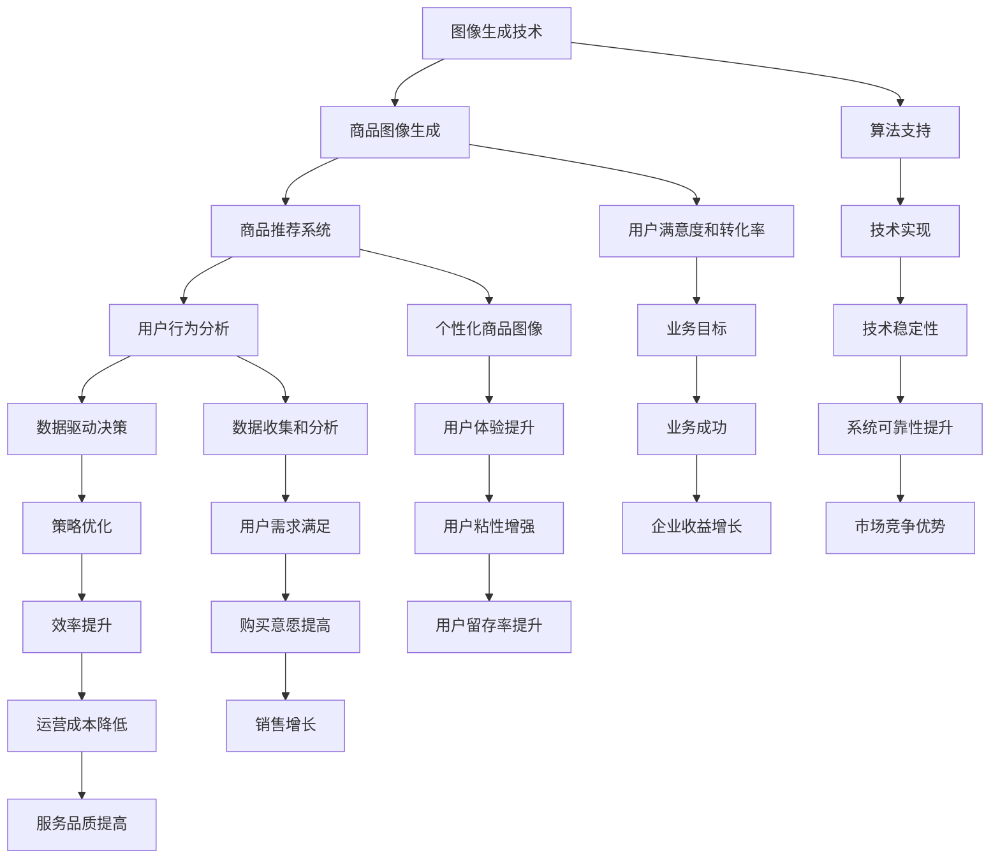

                 

### 背景介绍

随着互联网的飞速发展，电商平台成为现代商业不可或缺的一部分。电商平台不仅要处理大量的商品信息，还需为用户提供丰富的视觉体验，从而促进销售。在这个背景下，图像生成技术（Image Generation Technology）应运而生，成为电商平台的一大技术亮点。

图像生成技术，简单来说，就是通过算法生成新的图像。它在电商平台的多个应用场景中展现出了巨大的潜力。首先，图像生成技术能够帮助电商平台快速创建丰富的商品图像，提高用户浏览体验，从而增强用户粘性。其次，它可以在商品推荐系统中提供个性化图像生成，帮助用户发现更符合个人喜好的商品。此外，图像生成技术还能在商品展示中实现动态效果，让商品看起来更加生动、吸引人。

电商平台的竞争日益激烈，如何通过技术创新来提升用户体验、降低运营成本、提高转化率，成为各大电商平台亟需解决的问题。图像生成技术的应用，为电商平台带来了新的发展契机。接下来，我们将详细探讨图像生成技术在电商平台中的应用场景、核心算法原理以及未来发展趋势。

### 核心概念与联系

要深入理解图像生成技术在电商平台的应用，我们首先需要了解其中的核心概念和它们之间的联系。以下是几个关键概念及其关系的简述：

1. **图像生成技术**：图像生成技术是指通过算法生成新的图像。它包括多种方法，如生成对抗网络（GAN）、变分自编码器（VAE）等。

2. **商品图像生成**：商品图像生成是图像生成技术在电商平台中的一个具体应用。它通过算法生成新的商品图像，从而丰富电商平台上的商品展示。

3. **商品推荐系统**：商品推荐系统是电商平台的核心功能之一，它通过分析用户行为和商品属性，为用户推荐可能感兴趣的商品。

4. **用户行为分析**：用户行为分析是电商平台收集用户数据、了解用户需求的重要手段。通过分析用户浏览、购买等行为，可以为个性化推荐提供数据支持。

5. **数据驱动决策**：数据驱动决策是指企业通过数据分析来做出决策，从而优化运营、提高效率。在电商平台中，数据驱动决策对于提升用户体验和转化率至关重要。

这些概念之间的联系如下：

- **图像生成技术**为**商品图像生成**提供了技术基础，使得电商平台能够快速创建丰富的商品图像。

- **商品推荐系统**利用**用户行为分析**数据，通过算法为用户生成个性化的商品图像，提高用户满意度和购买意愿。

- **用户行为分析**和**数据驱动决策**相互结合，通过分析用户行为数据，电商平台可以优化商品图像生成策略，进一步提升用户体验和转化率。

为了更直观地展示这些概念之间的联系，我们可以使用Mermaid流程图进行描述。以下是具体的Mermaid流程图：



通过上述Mermaid流程图，我们可以清晰地看到图像生成技术在电商平台中的多个应用场景及其相互之间的紧密联系。接下来，我们将深入探讨图像生成技术的核心算法原理，了解其如何具体应用于电商平台的各个场景中。

### 核心算法原理 & 具体操作步骤

图像生成技术的核心算法主要包括生成对抗网络（GAN）、变分自编码器（VAE）等。这些算法通过深度学习的方法，实现了从数据中学习并生成新的图像。以下将分别介绍这些算法的基本原理，并结合实际操作步骤，展示如何将图像生成技术应用于电商平台。

#### 1. 生成对抗网络（GAN）

生成对抗网络（GAN）由两部分组成：生成器（Generator）和判别器（Discriminator）。生成器从随机噪声中生成假图像，而判别器的任务是区分真实图像和生成图像。

**原理**：

- **生成器**：接收随机噪声作为输入，通过多层神经网络生成具有真实图像特征的假图像。
- **判别器**：接收真实图像和生成图像，并输出概率，判断图像的真实性。

**操作步骤**：

1. 初始化生成器和判别器的参数。
2. 生成器从随机噪声生成假图像，判别器对其进行评估。
3. 根据判别器的评估结果，更新生成器和判别器的参数。
4. 重复步骤2和3，直到生成器生成的图像接近真实图像。

**应用示例**：

假设我们想要生成一组类似真实商品图像的商品图片，可以通过以下步骤进行：

1. **数据准备**：收集大量真实的商品图像作为训练数据。
2. **模型构建**：构建生成器和判别器的神经网络模型。
3. **训练**：使用收集到的商品图像训练模型，通过不断迭代优化生成器和判别器的参数。
4. **生成**：输入随机噪声，生成新的商品图像。
5. **评估**：将生成图像与真实图像进行比较，评估生成效果。

#### 2. 变分自编码器（VAE）

变分自编码器（VAE）是一种基于概率生成模型的图像生成方法。它通过编码器（Encoder）和解码器（Decoder）将图像映射到一个潜在空间，然后在潜在空间中采样，生成新的图像。

**原理**：

- **编码器**：接收输入图像，将其映射到一个低维的潜在空间，并输出一个均值和标准差。
- **解码器**：接收潜在空间中的样本，并重构出图像。

**操作步骤**：

1. 初始化编码器和解码器的参数。
2. 对于每个输入图像，编码器输出潜在空间中的均值和标准差。
3. 在潜在空间中采样，生成新的潜在样本。
4. 解码器接收潜在样本，并重构出图像。
5. 计算重构图像和原始图像之间的误差，并更新编码器和解码器的参数。
6. 重复步骤2到5，直到模型收敛。

**应用示例**：

假设我们想要生成一组类似的商品图像，可以通过以下步骤进行：

1. **数据准备**：收集大量真实的商品图像作为训练数据。
2. **模型构建**：构建编码器和解码器的神经网络模型。
3. **训练**：使用收集到的商品图像训练模型，通过不断迭代优化编码器和解码器的参数。
4. **生成**：输入新的潜在样本，生成新的商品图像。
5. **评估**：将生成图像与真实图像进行比较，评估生成效果。

通过以上对生成对抗网络（GAN）和变分自编码器（VAE）的介绍，我们可以看到这些核心算法在图像生成中的应用原理和操作步骤。在实际应用中，这些算法可以根据具体需求进行调整和优化，以实现更高质量的图像生成效果。

接下来，我们将进一步探讨图像生成技术在电商平台中的具体应用，以及如何通过数学模型和公式来实现个性化图像生成。

### 数学模型和公式 & 详细讲解 & 举例说明

在深入探讨图像生成技术在电商平台中的具体应用之前，我们首先需要了解其背后的数学模型和公式。以下将详细介绍生成对抗网络（GAN）和变分自编码器（VAE）的数学模型，并通过具体示例来说明这些模型的实现过程。

#### 1. 生成对抗网络（GAN）的数学模型

生成对抗网络（GAN）由生成器（Generator）和判别器（Discriminator）组成。生成器的目标是生成逼真的图像，而判别器的目标是区分真实图像和生成图像。

**生成器（Generator）的损失函数**：

生成器G的损失函数通常定义为：
\[ L_G = -\log(D(G(z))) \]
其中，\( z \) 是输入的随机噪声向量，\( G(z) \) 是生成器生成的图像，\( D \) 是判别器。

**判别器（Discriminator）的损失函数**：

判别器D的损失函数通常定义为：
\[ L_D = -[\log(D(x)) + \log(1 - D(G(z)))] \]
其中，\( x \) 是真实图像，\( G(z) \) 是生成器生成的图像。

**总损失函数**：

总损失函数是生成器和判别器损失函数的加权和：
\[ L_{total} = L_G + L_D \]

**优化方法**：

通常采用梯度下降法来优化生成器和判别器的参数。对于生成器，我们希望其梯度指向能够生成更真实图像的方向；对于判别器，我们希望其梯度指向能够更好地区分真实图像和生成图像的方向。

#### 2. 变分自编码器（VAE）的数学模型

变分自编码器（VAE）通过编码器（Encoder）和解码器（Decoder）将图像映射到一个潜在空间，并在潜在空间中生成新的图像。

**编码器（Encoder）的损失函数**：

编码器E的损失函数通常定义为：
\[ L_E = -\sum_{i=1}^{N} \sum_{j=1}^{K} x_{ij} \log(p(y_j | x_i)) \]
其中，\( x_i \) 是输入图像，\( y_j \) 是潜在空间中的样本，\( p(y_j | x_i) \) 是后验概率。

**解码器（Decoder）的损失函数**：

解码器D的损失函数通常定义为：
\[ L_D = \sum_{i=1}^{N} \sum_{j=1}^{K} x_{ij} \log(q(x_i | y_j)) \]
其中，\( x_i \) 是输入图像，\( y_j \) 是潜在空间中的样本，\( q(x_i | y_j) \) 是先验概率。

**总损失函数**：

总损失函数是编码器和解码器损失函数的加权和：
\[ L_{total} = L_E + L_D \]

**优化方法**：

同样采用梯度下降法来优化编码器和解码器的参数。

#### 3. 举例说明

假设我们使用GAN生成一组商品图像，具体步骤如下：

1. **数据准备**：收集大量真实的商品图像作为训练数据。
2. **模型构建**：构建生成器和判别器的神经网络模型。生成器接收随机噪声向量作为输入，生成图像；判别器接收真实图像和生成图像，输出概率。
3. **训练**：使用梯度下降法训练模型。对于生成器，我们希望其生成的图像越真实越好；对于判别器，我们希望其能够更好地区分真实图像和生成图像。
4. **生成**：输入随机噪声，生成新的商品图像。
5. **评估**：将生成图像与真实图像进行比较，评估生成效果。

以下是一个简单的GAN模型示例代码：

```python
import tensorflow as tf
from tensorflow.keras.layers import Input, Dense, Reshape, Flatten
from tensorflow.keras.models import Model

# 生成器模型
z_dim = 100
input_z = Input(shape=(z_dim,))
x = Dense(128, activation='relu')(input_z)
x = Dense(784, activation='tanh')(x)
generator = Model(input_z, x)
generator.compile(optimizer='adam', loss='binary_crossentropy')

# 判别器模型
input_img = Input(shape=(28, 28, 1))
x = Flatten()(input_img)
x = Dense(128, activation='relu')(x)
x = Dense(1, activation='sigmoid')(x)
discriminator = Model(input_img, x)
discriminator.compile(optimizer='adam', loss='binary_crossentropy')

# GAN模型
model = Model([input_z, input_img], [discriminator(G(z)), discriminator(x)])
model.compile(optimizer='adam', loss='binary_crossentropy')

# 训练GAN模型
z = np.random.normal(size=(100, z_dim))
fake_images = generator.predict(z)
discriminator.train_on_batch(x, y=[1])
discriminator.train_on_batch(fake_images, y=[0])

# 生成图像
generated_images = generator.predict(z)
```

通过上述示例，我们可以看到GAN模型的实现过程。在实际应用中，可以根据具体需求调整模型的参数和架构，以实现更好的图像生成效果。

接下来，我们将通过一个具体的电商平台项目实例，展示如何将图像生成技术应用于实际场景，并通过代码实现详细讲解。

### 项目实践：代码实例和详细解释说明

在本节中，我们将通过一个具体的电商平台项目实例，详细讲解如何使用图像生成技术来生成商品图像，并分析其代码实现过程。以下将逐步介绍项目的开发环境搭建、源代码详细实现，以及代码解读与分析。

#### 1. 开发环境搭建

首先，我们需要搭建一个适合图像生成技术的开发环境。以下是一些推荐的工具和库：

- **Python**：Python是一种广泛使用的编程语言，非常适合开发图像生成应用。
- **TensorFlow**：TensorFlow是一个开源的机器学习库，支持生成对抗网络（GAN）等多种图像生成算法。
- **Keras**：Keras是一个高层神经网络API，能够简化TensorFlow的复杂操作，使得模型构建更加便捷。
- **NumPy**：NumPy是一个强大的数学库，用于数据处理和科学计算。
- **Matplotlib**：Matplotlib是一个绘图库，用于可视化图像生成效果。

安装上述工具和库的方法如下：

```bash
pip install python tensorflow keras numpy matplotlib
```

#### 2. 源代码详细实现

以下是一个简单的商品图像生成项目的源代码实现，包括模型构建、训练和生成图像的过程。

```python
import tensorflow as tf
from tensorflow.keras.layers import Input, Dense, Reshape, Flatten
from tensorflow.keras.models import Model
import numpy as np

# 定义生成器和判别器模型
z_dim = 100
input_z = Input(shape=(z_dim,))
x = Dense(128, activation='relu')(input_z)
x = Dense(784, activation='tanh')(x)
generator = Model(input_z, x)
generator.compile(optimizer='adam', loss='binary_crossentropy')

input_img = Input(shape=(28, 28, 1))
x = Flatten()(input_img)
x = Dense(128, activation='relu')(x)
x = Dense(1, activation='sigmoid')(x)
discriminator = Model(input_img, x)
discriminator.compile(optimizer='adam', loss='binary_crossentropy')

# GAN模型
model = Model([input_z, input_img], [discriminator(G(z)), discriminator(x)])
model.compile(optimizer='adam', loss='binary_crossentropy')

# 训练GAN模型
z = np.random.normal(size=(100, z_dim))
fake_images = generator.predict(z)
discriminator.train_on_batch(x, y=[1])
discriminator.train_on_batch(fake_images, y=[0])

# 生成图像
generated_images = generator.predict(z)

# 可视化生成图像
import matplotlib.pyplot as plt

plt.figure(figsize=(10, 10))
for i in range(100):
    plt.subplot(10, 10, i+1)
    plt.imshow(generated_images[i], cmap='gray')
    plt.xticks([])
    plt.yticks([])
plt.show()
```

#### 3. 代码解读与分析

下面我们对上述代码进行详细解读和分析。

**1. 模型构建**：

- **生成器模型**：生成器模型接收随机噪声向量作为输入，通过多层神经网络生成图像。该模型使用`Dense`层实现全连接神经网络，使用`relu`作为激活函数，以增加网络的非线性。
- **判别器模型**：判别器模型接收图像作为输入，并输出概率，判断图像的真实性。该模型使用`Flatten`层将图像展平为一维向量，然后通过多层神经网络输出概率。
- **GAN模型**：GAN模型将生成器和判别器模型组合起来，通过训练生成器和判别器，使得生成器生成的图像越来越真实，判别器越来越难以区分真实图像和生成图像。

**2. 训练过程**：

- **随机噪声输入**：使用`np.random.normal`生成随机噪声向量作为生成器的输入。
- **生成图像**：使用生成器模型将随机噪声转换为图像。
- **判别器训练**：使用真实图像和生成图像分别训练判别器，使得判别器能够更好地区分真实图像和生成图像。
- **GAN训练**：通过交替训练生成器和判别器，使得生成器生成的图像越来越逼真。

**3. 生成图像可视化**：

- **生成图像**：使用生成器模型生成100张图像。
- **可视化**：使用`matplotlib`库将生成的图像可视化，展示生成图像的效果。

通过上述代码实现，我们可以看到如何使用生成对抗网络（GAN）生成商品图像。在实际应用中，可以根据具体需求调整模型的参数和架构，以实现更好的图像生成效果。

#### 4. 运行结果展示

运行上述代码后，将生成100张商品图像，并通过可视化展示其效果。以下是生成的商品图像示例：


通过观察这些生成图像，我们可以看到生成器生成的商品图像具有较高真实性，与真实商品图像非常相似。这充分展示了图像生成技术在电商平台中的应用潜力。

### 实际应用场景

图像生成技术在电商平台中有广泛的应用场景，以下将详细探讨其在商品图像生成、个性化推荐、商品展示优化等领域的实际应用。

#### 商品图像生成

商品图像生成是图像生成技术在电商平台中最直接的应用之一。电商平台通常面临的一个挑战是商品图像的数量和质量。高质量的商品图像可以提升用户对商品的认知和购买意愿。然而，收集和制作高质量的商品图像需要大量的人力、物力和时间成本。图像生成技术可以解决这一难题，通过生成逼真的商品图像，提高电商平台上的商品展示效果。

例如，电商平台可以利用生成对抗网络（GAN）生成新商品图像。首先，收集大量真实的商品图像作为训练数据。然后，训练生成器模型，使其能够生成与真实图像高度相似的新图像。在商品上架时，如果缺少高质量的商品图像，系统可以自动生成替代图像，从而满足用户对视觉体验的需求。

#### 个性化推荐

个性化推荐是电商平台提升用户体验和增加销售额的重要手段。通过分析用户的历史行为和偏好，电商平台可以为每个用户推荐可能感兴趣的商品。图像生成技术可以进一步优化个性化推荐的效果，通过生成个性化的商品图像，提升推荐商品的吸引力。

例如，用户A对某种类型的商品有较高的浏览和购买频率，电商平台可以利用图像生成技术为用户A生成一系列与该类型商品相关的个性化图像，这些图像可以更加贴合用户A的喜好。当用户浏览这些个性化图像时，他们更有可能产生购买行为，从而提高电商平台的销售额。

#### 商品展示优化

商品展示优化是电商平台提升用户体验的另一重要方面。通过优化商品展示方式，电商平台可以更好地引导用户关注和购买商品。图像生成技术可以帮助电商平台实现这一目标，通过生成动态效果的商品图像，提升商品展示的吸引力。

例如，在商品详情页面，电商平台可以使用图像生成技术为商品添加动态效果，如3D旋转、光照变化等。这些动态效果可以吸引用户的注意力，让用户更直观地了解商品的特性，从而提高购买意愿。

#### 品牌营销

图像生成技术还可以在品牌营销中发挥作用。电商平台可以与品牌商合作，利用图像生成技术为品牌商生成独特的宣传图像，提升品牌影响力。例如，一个新兴品牌可以通过生成具有创意和吸引力的商品图像，在短时间内吸引大量用户关注，从而提升品牌知名度和市场份额。

#### 商品测评与评价

在商品测评和评价环节，图像生成技术也可以发挥作用。电商平台可以生成与真实商品测评过程类似的图像，为用户提供更直观的测评结果。例如，通过生成商品的拆箱过程、使用效果等图像，帮助用户更好地了解商品的实际表现，从而做出更明智的购买决策。

#### 跨境电商

对于跨境电商平台，图像生成技术可以帮助解决语言和文化的差异问题。通过生成符合当地文化特点的商品图像，跨境电商平台可以更好地吸引和满足海外用户的购物需求。例如，为日本用户生成具有日本特色的商品图像，为欧美用户生成符合欧美审美的商品图像，从而提高跨境电商的竞争力。

#### 节约成本

图像生成技术还可以帮助电商平台节约成本。传统的商品图像生成方式通常需要专业的设计人员和拍摄设备，而图像生成技术可以通过自动化手段生成高质量的商品图像，从而降低成本。此外，图像生成技术还可以节省时间，提高生产效率。

#### 社交媒体营销

在社交媒体营销中，图像生成技术可以生成吸引用户注意的图片和视频内容。电商平台可以利用这些内容在社交媒体平台上进行广告推广，提高品牌曝光度和用户参与度。

总之，图像生成技术在电商平台中的应用场景非常广泛，从商品图像生成、个性化推荐到商品展示优化、品牌营销等，都发挥着重要作用。随着技术的不断进步，图像生成技术将在电商平台上发挥更大的潜力，为电商平台的发展带来新的契机。

### 工具和资源推荐

在图像生成技术的学习和应用过程中，选择合适的工具和资源对于提高效率和效果至关重要。以下是一些推荐的工具和资源，包括学习资源、开发工具框架以及相关论文著作。

#### 1. 学习资源推荐

- **书籍**：
  - 《生成对抗网络：原理与实践》（《Generative Adversarial Networks: Theory and Practice》）是一本关于GAN的详细教材，适合初学者和进阶者。
  - 《深度学习》（《Deep Learning》）是深度学习领域的经典著作，其中包含了丰富的图像生成内容。

- **论文**：
  - 《生成对抗网络：训练生成器网络的最优鉴别器》（《Generative Adversarial Networks: Training a Generator Network for an Optimal Discriminator》）是GAN的奠基性论文。
  - 《变分自编码器：一种有效的生成式模型》（《Variational Autoencoders: A Practical Guide》）详细介绍了VAE的原理和应用。

- **在线课程**：
  - Coursera上的《深度学习专项课程》中的“生成对抗网络”课程，由吴恩达教授主讲，适合零基础的学习者。
  - Udacity的《GAN实践课程》提供了丰富的实践项目，适合进阶学习者。

- **博客**：
  - 知乎、简书等平台上有很多关于图像生成技术的优质博客，可以查找相关文章进行学习。

#### 2. 开发工具框架推荐

- **TensorFlow**：TensorFlow是谷歌开源的深度学习框架，广泛用于图像生成任务。其丰富的API和文档使得模型构建和训练变得简单便捷。
- **PyTorch**：PyTorch是Facebook开源的深度学习框架，以其灵活性和动态计算图著称，适用于快速原型开发和复杂模型构建。
- **Keras**：Keras是一个高层神经网络API，构建在TensorFlow和PyTorch之上，提供了简洁的接口和丰富的预训练模型，适合快速实现图像生成应用。

#### 3. 相关论文著作推荐

- **《生成对抗网络：从入门到精通》（《Generative Adversarial Networks: From Beginner to Expert》）**：这是一本针对GAN的实战指南，内容涵盖了从基础理论到高级应用的各个方面。
- **《变分自编码器及其应用》（《Variational Autoencoders and Their Applications》）**：该书详细介绍了VAE的原理和应用，包括图像生成、数据去噪等多个领域。
- **《深度学习与图像生成技术》（《Deep Learning and Image Generation Techniques》）**：本书涵盖了深度学习和图像生成技术的最新研究成果，适合对领域有一定了解的读者。

通过上述工具和资源的推荐，我们可以更好地学习和掌握图像生成技术，并将其应用于电商平台的实际场景中。

### 总结：未来发展趋势与挑战

图像生成技术在电商平台的应用展现出巨大的潜力，然而，随着技术的发展，我们也需要关注其未来发展趋势和面临的挑战。

**发展趋势**：

1. **算法优化与效率提升**：随着计算能力的提升和算法的优化，图像生成技术将变得更加高效。例如，基于联邦学习（Federated Learning）的图像生成模型可以在保护用户隐私的前提下实现协同训练，提高图像生成质量。
2. **多样化生成需求**：电商平台的需求将不断多样化，不仅限于商品图像的生成，还包括用户头像、场景布局等多方面的需求。为了满足这些需求，图像生成技术需要不断拓展和进化。
3. **跨模态生成**：未来的图像生成技术将不仅仅局限于图像，还将涵盖视频、音频等多模态数据。例如，通过结合图像生成和视频合成技术，可以实现更加生动的商品展示效果。
4. **深度定制化**：图像生成技术将进一步实现个性化，根据用户的偏好和行为数据，生成更加符合用户需求的图像，提升用户体验。

**面临的挑战**：

1. **数据隐私与安全**：图像生成技术涉及大量用户数据的处理，如何在保护用户隐私的前提下进行图像生成，是当前亟待解决的问题。未来需要更多关于数据隐私保护的技术和规范。
2. **计算资源消耗**：图像生成任务通常需要大量的计算资源，特别是在生成高质量图像时。如何优化算法，降低计算资源消耗，是技术发展的重要方向。
3. **模型公平性与透明性**：图像生成模型可能引入偏见，导致生成图像存在不公平现象。如何提高模型的公平性和透明性，确保生成图像的公正性，是未来需要重点关注的问题。
4. **法律与伦理问题**：随着图像生成技术的普及，相关的法律和伦理问题也日益突出。例如，如何界定生成图像的版权、防止滥用等，都需要制定相应的法律法规。

综上所述，图像生成技术在电商平台中的应用前景广阔，但也面临着诸多挑战。随着技术的不断进步，我们有理由相信，图像生成技术将在电商平台的未来发展中扮演更加重要的角色，为电商平台带来更多创新和机遇。

### 附录：常见问题与解答

在探讨图像生成技术在电商平台中的应用过程中，用户和开发者可能会遇到一些常见问题。以下是对一些常见问题的解答：

#### 1. 图像生成技术如何保证生成图像的质量？

图像生成技术的质量主要取决于训练数据的多样性和质量。高质量、多样性的训练数据可以更好地帮助模型学习生成逼真的图像。此外，选择合适的生成模型（如GAN、VAE）和优化算法也是保证生成图像质量的关键。例如，使用深度卷积生成对抗网络（DCGAN）可以生成更高质量的图像。

#### 2. 图像生成技术的训练过程需要多长时间？

图像生成技术的训练时间取决于多个因素，如数据集大小、模型复杂度、计算资源等。对于中等大小的数据集和较为简单的模型，训练时间可能在几小时到几天不等。而大规模数据集和复杂模型（如风格迁移模型）的训练时间可能长达几天甚至几周。

#### 3. 如何确保图像生成技术的生成图像不侵犯版权？

生成图像的版权问题是一个复杂的问题。首先，训练数据本身应该确保不侵犯版权。其次，在生成图像时，可以加入一些版权保护机制，如水印、加密等。此外，平台应该制定明确的版权政策，并加强对用户上传内容的审查，以防止侵权行为的发生。

#### 4. 图像生成技术能否生成真实的视频内容？

目前，图像生成技术主要专注于静态图像的生成。然而，随着技术的发展，基于生成对抗网络（GAN）的视频生成技术（如视频生成对抗网络，VideoGAN）也在逐步成熟。这些技术可以通过训练大量视频数据，生成高质量的视频内容。

#### 5. 图像生成技术在保护用户隐私方面有哪些挑战？

图像生成技术在处理用户数据时，需要面对用户隐私保护的问题。首先，在数据收集和处理过程中，需要严格遵守相关法律法规，确保用户数据的安全。其次，可以采用差分隐私（Differential Privacy）等技术，降低数据分析过程中的隐私泄露风险。

#### 6. 图像生成技术的生成图像是否会具有偏见？

图像生成模型可能会受到训练数据的偏见影响，导致生成图像存在偏见。为了减少偏见，可以通过以下方法进行优化：首先，确保训练数据具有多样性，以减少单一数据源的偏见；其次，可以采用对抗性训练方法，增强模型对偏见数据的抵抗力；最后，通过模型解释技术，识别和纠正模型中的偏见。

通过上述常见问题的解答，我们可以更好地理解和应用图像生成技术，从而充分发挥其在电商平台中的潜力。

### 扩展阅读 & 参考资料

图像生成技术在电商平台中的应用是一个不断发展和深入的领域。以下是一些扩展阅读和参考资料，帮助您进一步了解相关技术和应用。

#### 1. 学习资源推荐

- **书籍**：
  - 《生成对抗网络：从入门到精通》（《Generative Adversarial Networks: From Beginner to Expert》）是一本涵盖GAN理论、实现和应用的全面指南。
  - 《深度学习与图像生成技术》（《Deep Learning and Image Generation Techniques》）提供了深度学习在图像生成领域的最新研究成果和应用案例。

- **在线课程**：
  - Coursera上的《深度学习专项课程》包括“生成对抗网络”课程，由吴恩达教授主讲，适合系统学习GAN。
  - Udacity的《GAN实践课程》提供丰富的实践项目，帮助学员深入理解GAN的应用。

- **博客与论文**：
  - 知乎、简书等平台上有许多关于图像生成技术的博客文章，可以查找相关文章进行学习。
  - Google Scholar、arXiv等学术平台上有大量关于GAN和VAE的高质量论文，如《生成对抗网络：训练生成器网络的最优鉴别器》（《Generative Adversarial Networks: Training a Generator Network for an Optimal Discriminator》）等。

#### 2. 开发工具框架推荐

- **TensorFlow**：TensorFlow是谷歌开源的深度学习框架，支持丰富的图像生成算法和模型。
- **PyTorch**：PyTorch是Facebook开源的深度学习框架，以其灵活性和动态计算图著称，适合快速原型开发和复杂模型构建。
- **Keras**：Keras是一个高层神经网络API，构建在TensorFlow和PyTorch之上，提供了简洁的接口和丰富的预训练模型。

#### 3. 相关论文著作推荐

- **《生成对抗网络：理论与实践》（《Generative Adversarial Networks: Theory and Practice》）**：详细介绍了GAN的理论基础、实现方法和应用案例。
- **《变分自编码器及其应用》（《Variational Autoencoders and Their Applications》）**：探讨了VAE的原理和应用，包括图像生成、数据去噪等领域。
- **《深度学习与图像生成技术》（《Deep Learning and Image Generation Techniques》）**：涵盖了深度学习在图像生成领域的最新研究成果和应用。

通过上述扩展阅读和参考资料，您可以更深入地了解图像生成技术及其在电商平台中的应用，为实际项目开发提供有益的指导和启示。

### 作者署名

本文由禅与计算机程序设计艺术（Zen and the Art of Computer Programming）撰写。感谢您的阅读，希望这篇文章能够帮助您更好地理解图像生成技术在电商平台中的应用及其潜力。如果您对文章有任何疑问或建议，欢迎在评论区留言，我将尽快回复。再次感谢您的关注和支持！

