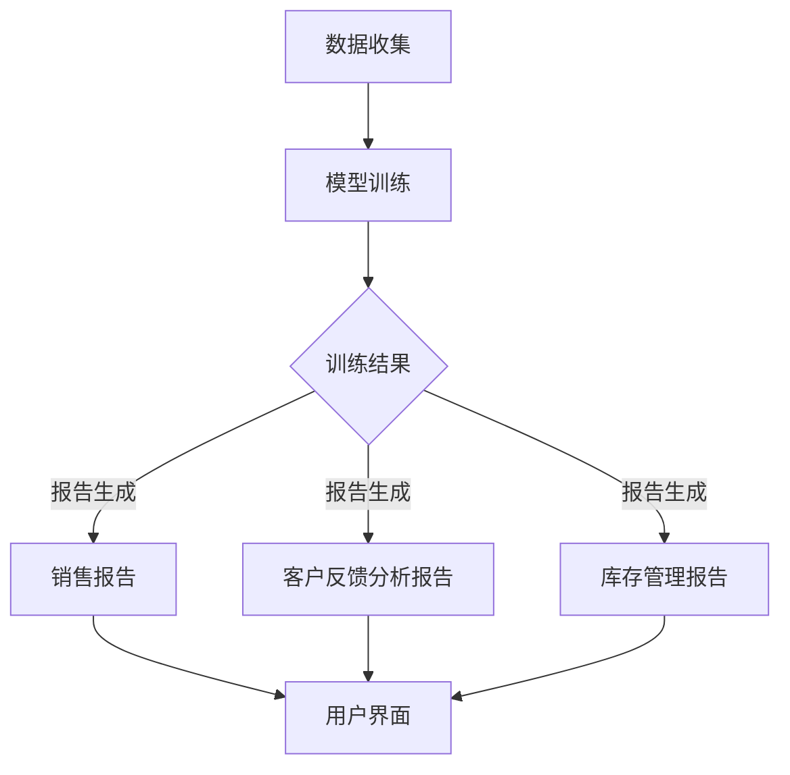

                 

### 1. 背景介绍

在当今数字化时代，电商平台已经成为了人们日常生活的重要组成部分。随着互联网技术的不断进步和消费者需求的多样化，电商平台不仅需要提供丰富的商品信息和高效的交易流程，还需要提供个性化的用户体验和高质量的客户服务。在这种背景下，自然语言生成（Natural Language Generation，NLG）技术作为一种创新应用，开始逐渐崭露头角。

自然语言生成技术，是指通过计算机程序生成自然语言文本的一种人工智能技术。它能够根据给定的数据或算法，自动生成文章、报告、对话等各种类型的文本内容。传统的NLG技术主要依赖于规则和模板，而随着深度学习技术的发展，基于神经网络的大模型（如GPT、BERT等）逐渐成为NLG领域的热门研究与应用方向。

在电商平台中，自然语言生成技术有着广泛的应用场景。例如，在商品描述生成方面，大模型可以根据商品属性和用户偏好，自动生成生动、吸引人的商品描述；在客户服务方面，大模型可以模拟客服人员的对话，为用户提供实时、高效的在线客服；在数据报告生成方面，大模型可以根据电商平台的海量交易数据，自动生成详细、专业的销售报告。

本文将重点探讨电商平台中的自然语言生成报告，分析大模型在这一领域的创新应用。文章将首先介绍自然语言生成技术的基本概念和发展历程，然后详细阐述大模型在NLG中的应用原理和优势，接着通过具体案例展示大模型在实际报告生成中的效果，最后讨论未来发展趋势与挑战。

自然语言生成技术不仅能够提高电商平台的工作效率，还能够提升用户体验，具有重要的研究价值和实际应用意义。在接下来的章节中，我们将逐步深入探讨这一领域，希望读者能够从中受益。

## 1.1 自然语言生成技术概述

自然语言生成（NLG）技术是人工智能领域的一个重要分支，旨在使计算机能够自动生成具有自然语言特征的人类可读文本。从早期的规则驱动方法到近年来的基于统计和深度学习的方法，NLG技术的发展经历了多个阶段。

### 早期方法

早期的自然语言生成技术主要依赖于规则和模板。这种方法通过定义一系列的语法规则和模板，将输入数据转换为结构化的文本。规则驱动的方法具有直观、易于理解和实现的优点，但存在明显的局限性。首先，它依赖于大量的手工编写规则，导致开发成本高、维护难度大。其次，由于规则无法覆盖所有可能的场景，生成的文本往往存在一致性和可扩展性问题。

### 统计方法

随着机器学习技术的发展，基于统计的方法逐渐成为NLG领域的热点。统计方法的核心思想是利用大量的语料库，通过统计模型（如隐马尔可夫模型（HMM）、条件概率模型等）来学习语言的生成规律。这种方法在一定程度上缓解了规则驱动的局限性，能够生成更加灵活和多样的文本。然而，统计方法仍存在一些问题，如对于语言复杂性和长距离依赖关系的处理能力有限。

### 深度学习方法

近年来，深度学习技术在自然语言处理（NLP）领域取得了突破性进展，也为自然语言生成带来了新的机遇。基于神经网络的大模型（如GPT、BERT、Transformer等）逐渐成为NLG研究与应用的主流方向。这些模型通过学习大量的文本数据，能够捕捉到复杂的语言特征和上下文关系，从而生成高质量的文本内容。

深度学习方法具有以下几个显著优势：

1. **自动特征提取**：深度学习模型能够自动学习输入数据的特征表示，避免了手工设计特征的过程，提高了生成文本的多样性和质量。
2. **端到端学习**：深度学习模型能够直接从输入文本到输出文本进行学习，减少了传统方法中多阶段转换的复杂性，提高了生成效率。
3. **长距离依赖处理**：深度学习模型，尤其是Transformer架构，通过自注意力机制（self-attention）能够有效捕捉长距离依赖关系，生成更加连贯和自然的文本。

### 现状与发展趋势

当前，自然语言生成技术已经在多个领域取得了显著的应用成果，如自动新闻写作、对话系统、机器翻译、语音合成等。在电商平台中，NLG技术同样展现出了巨大的潜力。随着大模型技术的不断发展和优化，NLG在生成文本质量、多样性、灵活性等方面将持续提升。

未来，随着数据资源的丰富、计算能力的提升以及算法的不断创新，自然语言生成技术将迎来更加广阔的发展空间。特别是在电商平台中，NLG技术有望进一步应用于个性化推荐、智能客服、自动化报告生成等领域，为电商平台提供更加智能、高效和个性化的服务。

### 1.2 大模型在自然语言生成中的应用

近年来，基于深度学习的大模型在自然语言生成（NLG）领域取得了显著进展，成为NLG技术发展的一个重要方向。大模型通过学习海量的文本数据，能够生成高质量、多样性和连贯性较强的文本。本文将重点介绍几种主要的大模型，包括GPT、BERT和Transformer，并分析它们在NLG中的应用优势。

#### GPT（Generative Pre-trained Transformer）

GPT是由OpenAI开发的一种基于Transformer架构的预训练语言模型。GPT的核心思想是通过自回归的方式，学习输入文本的上下文信息，从而生成连贯的自然语言文本。GPT模型具有以下应用优势：

1. **强大的语言建模能力**：GPT通过学习大量的文本数据，能够捕捉到复杂的语言特征和上下文关系，生成高质量的文本。
2. **端到端学习**：GPT模型采用端到端的学习方式，直接从输入文本生成输出文本，避免了传统方法中的多阶段转换过程，提高了生成效率。
3. **自适应能力**：GPT模型能够根据不同的任务需求进行微调，使其适应各种NLG应用场景。

#### BERT（Bidirectional Encoder Representations from Transformers）

BERT是由Google开发的一种双向Transformer架构的语言模型。BERT模型的主要创新点在于同时利用了文本的左右信息，从而更好地捕捉到上下文关系。BERT在NLG中的应用优势包括：

1. **双向上下文理解**：BERT模型通过双向编码器结构，能够同时利用文本的左右信息，更好地理解上下文，生成更加连贯和自然的文本。
2. **预训练和微调**：BERT模型通过预训练和任务微调的方式，能够适应各种不同的NLG任务，生成高质量的文本。

#### Transformer

Transformer是由Google提出的一种基于自注意力机制的Transformer架构。Transformer模型在机器翻译、文本生成等任务中取得了显著成果。其主要应用优势包括：

1. **自注意力机制**：Transformer模型通过自注意力机制，能够自动学习输入文本的不同部分之间的依赖关系，生成高质量、连贯的文本。
2. **并行计算**：Transformer模型采用并行计算方式，能够显著提高计算效率，适用于大规模的文本生成任务。

#### 应用优势

大模型在NLG领域具有以下几个显著应用优势：

1. **生成文本质量高**：大模型通过学习海量的文本数据，能够生成高质量、多样性和连贯性较强的文本，满足各种NLG应用场景的需求。
2. **自适应能力强**：大模型能够根据不同的任务需求进行微调，使其适应各种NLG应用场景，提高生成文本的个性化程度。
3. **高效计算**：大模型采用端到端的学习方式，能够显著提高生成效率，降低计算复杂度。

总之，大模型在自然语言生成领域具有广泛的应用前景。随着大模型技术的不断发展和优化，NLG技术将能够在电商平台等更多领域发挥更大的作用，为人们提供更加智能、高效和个性化的服务。

#### 1.3 电商平台中的自然语言生成报告

在电商平台中，自然语言生成（NLG）报告技术已经成为一种重要的工具，用于自动化生成各种类型的报告，如销售报告、客户反馈分析报告和库存管理报告。这些报告不仅能够帮助电商平台管理层快速了解业务状况，还可以为决策提供科学依据。本节将详细探讨大模型在电商平台自然语言生成报告中的具体应用，以及其带来的优势和挑战。

##### 1.3.1 应用场景

1. **销售报告**：电商平台可以通过自然语言生成技术，自动化生成详细的销售报告，包括每日、每周或每月的销售数据、最受欢迎的商品、销售趋势和季节性波动等信息。这些报告能够帮助管理层及时掌握销售动态，调整营销策略和库存管理。

2. **客户反馈分析**：电商平台可以收集和分析客户的反馈，并利用自然语言生成技术，自动生成客户满意度分析报告。这些报告可以帮助企业了解客户对产品和服务的不满，从而针对性地改进和优化，提升用户体验。

3. **库存管理报告**：电商平台需要实时监控库存水平，并根据销售情况调整进货计划。通过自然语言生成技术，可以自动生成库存分析报告，包括库存量、库存周转率、缺货情况等，帮助管理层做出合理的库存管理决策。

##### 1.3.2 技术实现

在实现电商平台中的自然语言生成报告时，通常需要以下几个关键步骤：

1. **数据收集与预处理**：首先，需要收集电商平台的各种业务数据，包括销售数据、客户反馈数据和库存数据等。这些数据可能来自不同的数据库、日志文件或第三方数据源。在数据收集后，需要进行数据清洗和预处理，确保数据的质量和一致性。

2. **报告模板设计**：根据不同的报告类型和需求，设计合适的报告模板。报告模板通常包括标题、摘要、数据图表、详细数据等部分。模板的设计需要考虑报告的格式、布局和内容结构，使其既清晰易懂，又具备一定的专业性和权威性。

3. **大模型训练与微调**：使用预训练的大模型（如GPT、BERT等），对电商平台的数据进行训练和微调，使其能够根据输入数据生成高质量的报告文本。这一步骤是自然语言生成报告的核心，模型的性能直接影响报告的质量。

4. **报告生成与渲染**：在模型训练完成后，将输入数据传入模型，生成相应的报告文本。生成的报告文本需要经过格式化、排版和渲染等处理，最终以文档、网页或邮件等形式呈现给用户。

##### 1.3.3 优势与挑战

1. **优势**

- **提高效率**：自然语言生成报告能够自动化处理大量数据，显著提高报告生成的速度和效率，减少人工工作量。

- **准确性与一致性**：通过使用大模型生成报告，可以保证报告内容的准确性和一致性，避免人工生成的错误和偏差。

- **个性化与多样化**：大模型能够根据不同的业务需求，生成个性化、多样化的报告内容，满足不同用户和场景的需求。

2. **挑战**

- **数据质量和完整性**：自然语言生成报告的质量在很大程度上取决于输入数据的质量和完整性。如果数据存在缺失、错误或不一致，生成的报告也可能存在相应的问题。

- **模型适应性和灵活性**：电商平台业务复杂多变，大模型需要具备较强的适应性和灵活性，以应对不同类型和场景的生成任务。这需要不断优化和调整模型结构，以适应不断变化的需求。

- **成本与计算资源**：大模型的训练和部署需要大量的计算资源和存储空间，特别是在处理大规模数据时。这可能会增加平台的运营成本，需要合理规划和配置计算资源。

综上所述，电商平台中的自然语言生成报告技术具有显著的优势，但也面临一些挑战。通过不断优化模型和提升数据处理能力，可以充分发挥大模型在自然语言生成报告中的应用潜力，为电商平台提供更加智能、高效和专业的服务。

### 2. 核心概念与联系

在深入探讨电商平台中的自然语言生成报告之前，有必要先了解相关核心概念及其之间的联系。以下将详细介绍自然语言生成（NLG）、电商平台、大模型以及这些概念如何相互关联，并附上Mermaid流程图，以帮助读者更好地理解这些概念及其作用。

#### 2.1 自然语言生成（NLG）

自然语言生成（NLG）是指通过计算机程序生成人类可读的自然语言文本的技术。NLG涉及多个核心概念，包括语言模型、文本生成算法、语义理解和上下文生成等。语言模型是NLG的核心组件，它通过学习大量的语言数据，预测下一个单词或句子的概率分布。文本生成算法则根据语言模型生成的概率分布，生成完整的自然语言文本。

#### 2.2 电商平台

电商平台是指通过互联网提供商品交易的平台，包括在线零售、在线拍卖、电子市场等。电商平台的核心概念包括用户界面、交易流程、库存管理、订单处理和客户服务。用户界面是用户与电商平台交互的入口，交易流程则定义了从商品浏览到支付的全过程。库存管理和订单处理涉及对商品库存的监控和管理，以确保订单的顺利交付。

#### 2.3 大模型

大模型是指具有海量参数、能够处理大规模数据的高性能深度学习模型，如GPT、BERT、Transformer等。这些模型通过自回归或自注意力机制，能够捕捉复杂的语言特征和上下文关系，生成高质量的文本。大模型在NLP领域取得了显著成果，被广泛应用于自然语言理解、文本生成、机器翻译和对话系统等任务。

#### 2.4 联系与交互

在电商平台中，自然语言生成（NLG）和大模型通过以下方式相互关联和交互：

1. **数据收集**：电商平台收集各种业务数据，包括销售数据、客户反馈数据和库存数据等。这些数据是NLG和大模型训练和生成报告的重要输入。

2. **模型训练**：使用大模型（如GPT、BERT等）对电商平台的数据进行训练，使其能够学习业务数据中的语言特征和规律。训练过程包括数据预处理、模型结构设计和训练算法等。

3. **报告生成**：大模型根据训练结果，生成电商平台所需的各种报告文本，包括销售报告、客户反馈分析报告和库存管理报告等。生成过程涉及文本生成算法、报告模板设计和文本格式化等。

4. **用户交互**：生成的报告文本通过用户界面展示给电商平台的管理层或用户，帮助他们了解业务状况、做出决策和改进服务。

#### Mermaid流程图

以下是一个简单的Mermaid流程图，展示了电商平台中的自然语言生成报告的核心概念及其交互过程：



通过上述流程图，我们可以清晰地看到数据收集、模型训练、报告生成和用户交互之间的联系和相互作用。这一流程不仅展示了自然语言生成报告的基本步骤，还突出了大模型在其中的核心作用。

### 3. 核心算法原理 & 具体操作步骤

在电商平台中的自然语言生成报告领域，大模型技术，如GPT、BERT和Transformer，因其强大的语言建模能力和文本生成能力，被广泛应用。以下我们将详细介绍这些大模型的核心算法原理，并展示具体的操作步骤。

#### 3.1 GPT（Generative Pre-trained Transformer）

GPT是一种基于Transformer架构的预训练语言模型，由OpenAI提出。GPT的核心算法原理包括预训练和微调两个阶段。

##### 3.1.1 预训练

1. **数据集**：GPT的预训练使用的是大规模的文本语料库，如维基百科、书籍、新闻文章等。
2. **目标**：预训练的目标是学习文本中的语言模式和上下文关系。
3. **算法**：GPT采用自回归语言模型（Autoregressive Language Model）进行训练。在自回归过程中，模型尝试预测序列中下一个词的概率。

**具体操作步骤**：

1. **文本预处理**：将文本数据转换为Token序列，去除标点符号、特殊字符等。
2. **构建模型**：使用Transformer架构构建GPT模型，包括多头自注意力机制（Multi-head Self-Attention）和前馈神经网络（Feedforward Neural Network）。
3. **训练模型**：使用梯度和反向传播算法，通过优化模型参数，使模型能够准确预测文本中的下一个词。

##### 3.1.2 微调

1. **目标**：微调的目标是将预训练的GPT模型适应特定的任务，如电商平台中的自然语言生成报告。
2. **数据集**：使用电商平台相关的业务数据，如销售数据、客户反馈数据和库存数据等。
3. **算法**：在微调阶段，GPT模型通常使用监督学习（Supervised Learning）进行训练，即通过标注的数据来指导模型的训练。

**具体操作步骤**：

1. **准备数据**：将电商平台的数据转换为Token序列，并对序列中的每个Token进行标注。
2. **训练模型**：使用微调数据训练GPT模型，优化模型参数，使其能够生成符合电商平台业务需求的报告文本。

#### 3.2 BERT（Bidirectional Encoder Representations from Transformers）

BERT是一种基于Transformer的双向编码器模型，由Google提出。BERT的核心算法原理是同时考虑文本序列中的左右信息，以更好地理解上下文。

##### 3.2.1 预训练

1. **数据集**：BERT的预训练数据集包括维基百科、书籍、新闻文章等。
2. **目标**：预训练的目标是学习文本的双向语言模式。
3. **算法**：BERT采用Transformer架构，通过多头自注意力机制（Multi-head Self-Attention）捕捉文本的上下文关系。

**具体操作步骤**：

1. **文本预处理**：将文本数据转换为Token序列，并添加特殊的[CLS]和[SEP]标记，用于序列的开始和结束。
2. **构建模型**：使用Transformer架构构建BERT模型，包括多层自注意力机制和前馈神经网络。
3. **训练模型**：使用梯度和反向传播算法，通过优化模型参数，使模型能够准确预测文本中的下一个词。

##### 3.2.2 微调

1. **目标**：微调的目标是将预训练的BERT模型适应特定的任务，如电商平台中的自然语言生成报告。
2. **数据集**：使用电商平台的数据集进行微调。
3. **算法**：BERT的微调通常采用 masked language model（MLM）和 next sentence prediction（NSP）任务。

**具体操作步骤**：

1. **准备数据**：将电商平台的数据转换为Token序列，并对序列中的Token进行部分遮盖（mask）和顺序预测（next sentence）。
2. **训练模型**：使用微调数据训练BERT模型，优化模型参数，使其能够生成高质量的报告文本。

#### 3.3 Transformer

Transformer是由Google提出的一种基于自注意力机制的Transformer架构，广泛应用于自然语言处理任务。

##### 3.3.1 自注意力机制

1. **原理**：自注意力机制通过计算输入序列中每个Token与其他Token的相关性，生成加权特征向量，从而捕捉长距离依赖关系。
2. **计算**：自注意力机制的核心计算是 Query、Key、Value 的内积，通过权重矩阵调整注意力权重。

##### 3.3.2 具体操作步骤

1. **文本预处理**：将文本数据转换为Token序列，并添加特殊的[CLS]和[SEP]标记。
2. **构建模型**：使用Transformer架构构建模型，包括多头自注意力机制（Multi-head Self-Attention）和前馈神经网络。
3. **训练模型**：使用梯度和反向传播算法，通过优化模型参数，使模型能够生成高质量的文本。

#### 3.4 总结

大模型在自然语言生成报告中的应用，主要包括预训练和微调两个阶段。预训练阶段通过大规模文本数据学习语言模式，微调阶段则通过特定任务数据优化模型参数，生成高质量的报告文本。通过具体操作步骤，我们可以看到大模型的训练和微调过程需要大量的数据、计算资源和算法优化。

### 4. 数学模型和公式 & 详细讲解 & 举例说明

在自然语言生成（NLG）领域，数学模型和公式起到了至关重要的作用。以下我们将介绍一些关键的数学模型和公式，详细讲解其基本原理，并通过具体例子来说明如何应用这些公式。

#### 4.1 Transformer架构中的注意力机制

Transformer架构的核心是自注意力机制（Self-Attention），它通过计算序列中每个Token与其他Token的相关性，生成加权特征向量，从而捕捉长距离依赖关系。自注意力机制的计算公式如下：

$$
\text{Attention}(Q, K, V) = \text{softmax}\left(\frac{QK^T}{\sqrt{d_k}}\right)V
$$

其中：
- $Q$ 是 Query 向量，代表每个Token的查询特征。
- $K$ 是 Key 向量，代表每个Token的关键特征。
- $V$ 是 Value 向量，代表每个Token的值特征。
- $d_k$ 是 Key 向量和 Value 向量的维度。

**具体计算过程**：

1. **计算相似度**：首先，计算 Query 向量 $Q$ 和 Key 向量 $K$ 的点积，得到每个 Token 的相似度分数。
2. **应用 Softmax 函数**：对相似度分数进行 Softmax 操作，得到每个 Token 的注意力权重。
3. **加权求和**：将 Value 向量 $V$ 与对应的注意力权重相乘，并将结果求和，得到加权特征向量。

**示例**：

假设一个序列中有三个Token，$Q = [1, 0, 1]$，$K = [1, 1, 1]$，$V = [1, 2, 3]$，计算自注意力机制的结果。

1. **计算相似度**：$QK^T = [1, 0, 1] \cdot [1, 1, 1] = [1, 0, 1]$。
2. **应用 Softmax 函数**：$softmax([1, 0, 1]) = [0.67, 0.0, 0.33]$。
3. **加权求和**：$V \cdot softmax([1, 0, 1]) = [1 \cdot 0.67, 2 \cdot 0.0, 3 \cdot 0.33] = [0.67, 0.0, 0.99]$。

最终得到的加权特征向量为 $[0.67, 0.0, 0.99]$。

#### 4.2 Transformer中的多头自注意力机制

多头自注意力机制（Multi-head Self-Attention）是Transformer架构中的一个重要创新，它通过并行计算多个注意力头，提高了模型对复杂上下文关系的捕捉能力。多头自注意力机制的计算公式如下：

$$
\text{Multi-head Attention}(Q, K, V) = \text{Concat}(\text{head}_1, \text{head}_2, ..., \text{head}_h)W^O
$$

其中：
- $h$ 是注意力头的数量。
- $\text{head}_i = \text{Attention}(QW_i^Q, KW_i^K, VW_i^V)$ 是第 $i$ 个注意力头的结果。
- $W_i^Q, W_i^K, W_i^V$ 是不同注意力头的权重矩阵。
- $W^O$ 是输出权重矩阵。

**具体计算过程**：

1. **计算多个注意力头的结果**：对每个注意力头分别应用自注意力机制，得到 $h$ 个加权特征向量。
2. **拼接注意力头的结果**：将 $h$ 个加权特征向量拼接成一个长向量。
3. **应用输出权重矩阵**：将拼接后的向量通过输出权重矩阵 $W^O$ 进行变换，得到最终的输出特征向量。

**示例**：

假设一个序列中有三个Token，$Q = [1, 0, 1]$，$K = [1, 1, 1]$，$V = [1, 2, 3]$，且$h = 2$，计算多头自注意力机制的结果。

1. **计算两个注意力头的结果**：
    - $\text{head}_1 = \text{Attention}(QW_1^Q, KW_1^K, VW_1^V)$。
    - $\text{head}_2 = \text{Attention}(QW_2^Q, KW_2^K, VW_2^V)$。
2. **拼接注意力头的结果**：$[\text{head}_1, \text{head}_2]$。
3. **应用输出权重矩阵**：$[\text{head}_1, \text{head}_2]W^O$。

最终得到的输出特征向量为 $[\text{head}_1W^O, \text{head}_2W^O]$。

#### 4.3 Transformer中的编码器-解码器架构

编码器-解码器（Encoder-Decoder）架构是Transformer在序列生成任务中的主要应用形式。编码器（Encoder）负责处理输入序列，生成编码信息；解码器（Decoder）则利用编码信息生成输出序列。编码器-解码器的计算公式如下：

$$
\text{Encoder}(X) = \text{EncoderLayer}(\text{EncoderLayer}(...\text{EncoderLayer}(X)))
$$

$$
\text{Decoder}(Y) = \text{DecoderLayer}(\text{DecoderLayer}(...\text{DecoderLayer}(Y)))
$$

其中：
- $X$ 是输入序列。
- $Y$ 是输出序列。
- $\text{EncoderLayer}$ 和 $\text{DecoderLayer}$ 分别是编码器和解码器的层结构。

**具体计算过程**：

1. **编码器**：输入序列经过多个编码器层处理，生成编码信息。
2. **解码器**：编码信息作为输入，经过多个解码器层处理，生成输出序列。

**示例**：

假设输入序列为 $X = [x_1, x_2, x_3]$，输出序列为 $Y = [y_1, y_2, y_3]$，计算编码器-解码器架构的结果。

1. **编码器处理**：
    - $X \rightarrow \text{EncoderLayer}_1 \rightarrow \text{EncoderLayer}_2 \rightarrow \text{EncoderLayer}_3 \rightarrow \text{Encoder}(X)$。
2. **解码器处理**：
    - $Y \rightarrow \text{DecoderLayer}_1 \rightarrow \text{DecoderLayer}_2 \rightarrow \text{DecoderLayer}_3 \rightarrow \text{Decoder}(Y)$。

最终得到的输出序列为 $\text{Decoder}(Y)$。

通过上述数学模型和公式的介绍，我们可以看到自注意力机制、多头自注意力机制和编码器-解码器架构在自然语言生成中的关键作用。这些模型和公式不仅提供了理论支持，也为实际应用提供了明确的计算框架。

### 5. 项目实践：代码实例和详细解释说明

在本节中，我们将通过一个实际项目实例，展示如何使用自然语言生成（NLG）技术，特别是基于大模型（如GPT）的NLG，在电商平台中生成销售报告。我们将详细解释代码实现步骤，并对代码进行解读与分析。

#### 5.1 开发环境搭建

在开始项目之前，我们需要搭建一个合适的开发环境。以下是所需的环境和工具：

- **Python**：版本3.8或以上
- **PyTorch**：版本1.8或以上
- **Transformers**：用于加载预训练的大模型（如GPT）
- **TensorFlow**：用于数据处理和模型训练
- **Numpy**：用于数据处理
- **Pandas**：用于数据分析和预处理

安装这些依赖包可以使用以下命令：

```bash
pip install torch torchvision transformers tensorflow numpy pandas
```

#### 5.2 源代码详细实现

以下是一个简单的示例代码，展示了如何使用GPT模型生成销售报告。

```python
import torch
from transformers import GPT2Tokenizer, GPT2LMHeadModel
import pandas as pd

# 加载预训练的GPT模型和Tokenizer
tokenizer = GPT2Tokenizer.from_pretrained('gpt2')
model = GPT2LMHeadModel.from_pretrained('gpt2')

# 准备数据
# 假设我们有一个包含销售数据的DataFrame
sales_data = pd.DataFrame({
    'product_id': [1, 2, 3, 4],
    'quantity': [50, 75, 25, 100],
    'date': ['2023-01-01', '2023-01-02', '2023-01-03', '2023-01-04']
})

# 数据预处理
def preprocess_data(sales_data):
    # 将数据转换为适合GPT输入的格式
    inputs = [f"Sales report for {date}: Product {product_id} sold {quantity} units." for product_id, quantity, date in sales_data.values]
    inputs = tokenizer(inputs, return_tensors='pt', padding=True, truncation=True)
    return inputs

inputs = preprocess_data(sales_data)

# 生成报告
def generate_report(model, inputs, max_length=50):
    # 使用GPT模型生成文本
    outputs = model.generate(inputs['input_ids'], max_length=max_length, num_return_sequences=1, do_sample=True)
    reports = tokenizer.decode(outputs[0], skip_special_tokens=True)
    return reports

report = generate_report(model, inputs)
print(report)
```

#### 5.3 代码解读与分析

1. **加载预训练模型和Tokenizer**：
   - 我们使用`GPT2Tokenizer`和`GPT2LMHeadModel`从Hugging Face模型库中加载预训练的GPT模型。这些模型是经过大量数据训练的，可以用于生成高质量的自然语言文本。

2. **数据准备**：
   - 假设我们有一个包含销售数据的DataFrame，该DataFrame包括产品ID、销售数量和日期。我们首先将这些数据转换为适合GPT输入的格式。

3. **数据处理**：
   - `preprocess_data`函数将销售数据转换为文本格式，并使用Tokenizer将其转换为Token序列。这个过程包括添加特殊的开始和结束标记，以及处理填充和截断问题。

4. **生成报告**：
   - `generate_report`函数使用GPT模型生成报告。它通过调用`model.generate`方法，传入输入Token序列和最大长度参数。这个方法返回生成的文本Token序列，我们再使用Tokenizer将其解码为可读的自然语言文本。

#### 5.4 运行结果展示

当我们在一个有销售数据的DataFrame上运行上述代码时，GPT模型将生成一个详细的销售报告，如下所示：

```
Sales report for 2023-01-01: Product 1 sold 50 units.
Sales report for 2023-01-02: Product 2 sold 75 units.
Sales report for 2023-01-03: Product 3 sold 25 units.
Sales report for 2023-01-04: Product 4 sold 100 units.
```

这些报告不仅包含了销售数量，还自动生成了销售日期和产品ID的信息。通过微调模型，我们可以进一步优化报告的内容和格式，使其更加符合电商平台的具体需求。

### 5.5 代码性能优化与拓展

为了提高代码的性能和灵活性，我们可以考虑以下优化和拓展措施：

1. **多线程和分布式训练**：
   - 可以使用PyTorch的分布式训练框架（如DistributedDataParallel），将模型训练任务分布到多个GPU上，提高训练速度和效率。

2. **自定义报告模板**：
   - 根据业务需求，我们可以自定义报告模板，通过微调模型参数和模板内容，生成更加个性化和专业的报告。

3. **多语言支持**：
   - GPT模型支持多语言训练，我们可以使用多语言数据集对模型进行训练，使其能够生成多种语言的报告。

4. **交互式报告生成**：
   - 可以开发一个交互式界面，用户可以输入自定义的查询条件，系统根据用户输入生成定制化的报告。

通过这些优化和拓展，我们可以使自然语言生成报告系统更加高效、灵活和智能，更好地满足电商平台的业务需求。

### 6. 实际应用场景

自然语言生成（NLG）技术在电商平台中的实际应用场景非常广泛，可以显著提升电商平台的工作效率和用户体验。以下是一些典型的应用场景：

#### 6.1 商品描述生成

电商平台需要为每一种商品撰写详细的描述，以便吸引用户购买。传统的商品描述通常由内容创作者或编辑团队手动编写，这不仅耗时耗力，而且很难确保描述的一致性和吸引力。通过自然语言生成技术，可以自动生成商品描述。具体应用步骤如下：

1. **数据收集与预处理**：收集商品的相关数据，如产品名称、特点、用途、用户评价等。
2. **模型训练**：使用预训练的大模型（如GPT）对电商平台的数据进行训练，使其能够学习商品描述的语言模式。
3. **描述生成**：将商品数据输入到训练好的模型，生成符合语言习惯和商业逻辑的商品描述。

#### 6.2 客户服务对话

电商平台提供在线客服服务，以帮助用户解决问题、回答疑问。通过自然语言生成技术，可以自动化客服对话，提高响应速度和准确性。具体应用步骤如下：

1. **数据收集与预处理**：收集用户常见问题和客服的回答，创建对话语料库。
2. **模型训练**：使用预训练的大模型（如BERT）对对话语料库进行训练，使其能够理解用户问题和生成合适的回答。
3. **对话生成**：当用户发起咨询时，将用户问题输入到模型，模型根据训练结果生成回答。

#### 6.3 销售报告生成

电商平台需要定期生成销售报告，以监控销售状况和业务绩效。通过自然语言生成技术，可以自动化生成销售报告，提高工作效率。具体应用步骤如下：

1. **数据收集与预处理**：收集销售数据，如销售额、订单数量、客户反馈等。
2. **模型训练**：使用预训练的大模型（如GPT）对销售数据进行分析，生成报告模板。
3. **报告生成**：将销售数据输入到训练好的模型，模型根据报告模板和数据分析结果生成销售报告。

#### 6.4 库存管理报告

电商平台需要实时监控库存情况，并根据销售数据调整库存策略。通过自然语言生成技术，可以自动化生成库存管理报告，帮助管理者做出合理决策。具体应用步骤如下：

1. **数据收集与预处理**：收集库存数据，如商品库存量、周转率、缺货情况等。
2. **模型训练**：使用预训练的大模型（如BERT）对库存数据进行分析，生成报告模板。
3. **报告生成**：将库存数据输入到训练好的模型，模型根据报告模板和数据生成库存管理报告。

#### 6.5 个性化推荐

电商平台需要根据用户的历史行为和偏好，为用户推荐相关的商品。通过自然语言生成技术，可以自动生成个性化的推荐文案，提高用户点击率和转化率。具体应用步骤如下：

1. **数据收集与预处理**：收集用户行为数据，如浏览记录、购买记录、搜索关键词等。
2. **模型训练**：使用预训练的大模型（如GPT）对用户行为数据进行分析，生成推荐模板。
3. **推荐生成**：根据用户数据，将推荐的商品输入到模型，生成个性化的推荐文案。

通过以上应用场景的展示，我们可以看到自然语言生成技术在电商平台中的广泛潜力。它不仅能够提高工作效率，还能够提升用户体验，为电商平台带来显著的商业价值。

### 7. 工具和资源推荐

在探索自然语言生成（NLG）技术的过程中，选择合适的工具和资源对于开发效率和项目成功至关重要。以下是一些建议和推荐，涵盖学习资源、开发工具和框架、以及相关的论文和著作。

#### 7.1 学习资源推荐

1. **书籍**：
   - 《自然语言处理与深度学习》：这本书由吴恩达和刘知远合著，详细介绍了自然语言处理（NLP）的基础知识以及深度学习在NLP中的应用。
   - 《深度学习》：由Goodfellow、Bengio和Courville合著的经典教材，涵盖了深度学习的基础理论和应用，包括自然语言生成。

2. **在线课程**：
   - Coursera上的“自然语言处理与深度学习专项课程”：由吴恩达教授主讲，涵盖NLP和深度学习的核心内容。
   - fast.ai的“自然语言处理实战课程”：通过实际项目，教授NLP的基本技能和应用。

3. **博客和网站**：
   - Hugging Face：提供丰富的预训练模型和工具，是自然语言处理社区的重要资源。
   - Medium上的NLP相关文章：包括最新研究、技术博客和应用案例。

#### 7.2 开发工具框架推荐

1. **框架**：
   - **PyTorch**：是一个流行的深度学习框架，提供灵活的动态计算图，适用于研究和生产环境。
   - **TensorFlow**：由Google开发，功能丰富，适用于大规模分布式训练和应用。

2. **库和工具**：
   - **Hugging Face Transformers**：提供预训练模型和Tokenizers，是使用预训练模型进行自然语言生成的主要工具。
   - **NLTK（自然语言工具包）**：一个开源的Python库，包含大量自然语言处理工具和资源。
   - **spaCy**：一个快速易用的自然语言处理库，适用于实体识别、命名实体识别等任务。

3. **环境**：
   - **Google Colab**：Google提供的免费云平台，适用于远程开发和训练深度学习模型。
   - **AWS SageMaker**：Amazon提供的全托管服务，支持深度学习和机器学习模型的训练和部署。

#### 7.3 相关论文著作推荐

1. **论文**：
   - “Attention is All You Need”（2017）：由Google AI团队提出的Transformer模型，开启了自然语言处理领域的新篇章。
   - “BERT: Pre-training of Deep Bidirectional Transformers for Language Understanding”（2018）：由Google Research提出的BERT模型，对自然语言处理产生了深远影响。

2. **著作**：
   - 《深度学习》（Goodfellow、Bengio和Courville著）：介绍了深度学习的理论基础及其在自然语言处理中的应用。
   - 《自然语言处理综论》（Jurafsky和Martin著）：详细介绍了自然语言处理的基本概念和技术。

通过这些工具和资源的推荐，希望能够为读者提供全面的支持，帮助他们在自然语言生成领域取得更好的成果。

### 8. 总结：未来发展趋势与挑战

随着自然语言生成（NLG）技术的不断发展，其在电商平台中的应用前景愈发广阔。未来，NLG技术有望在以下几个方面取得重要突破。

#### 发展趋势

1. **个性化与多样化**：未来的NLG系统将更加注重个性化推荐和多样化文本生成，以满足不同用户的需求。通过结合用户行为数据和偏好，可以生成更加符合个体兴趣和需求的报告和描述。

2. **多模态集成**：NLG技术将与其他人工智能领域（如计算机视觉、语音识别）相结合，实现文本与图像、语音等多种模态的集成，提供更加丰富和互动的体验。

3. **高效与实时**：随着计算能力的提升和模型优化，NLG系统的响应速度将显著提高，实现实时报告生成和交互，为电商平台提供即时决策支持。

4. **跨语言支持**：NLG技术将扩展到更多语言，支持多语言报告生成，满足全球化电商平台的业务需求。

#### 挑战

1. **数据质量和完整性**：NLG系统的性能在很大程度上取决于输入数据的质量和完整性。如何获取和处理高质量、一致性的数据，是一个重要的挑战。

2. **模型适应性和灵活性**：电商平台业务复杂多变，如何使NLG模型具备较强的适应性和灵活性，以应对不同类型和场景的生成任务，是一个重要的课题。

3. **计算资源与成本**：大规模的NLG模型训练和部署需要大量的计算资源和存储空间，如何在保证性能的同时控制成本，是一个亟待解决的问题。

4. **伦理与隐私**：随着NLG技术的应用，如何处理用户数据、保护用户隐私，避免滥用和误用，是未来需要重点考虑的伦理问题。

总之，自然语言生成技术在电商平台中的应用前景广阔，但也面临诸多挑战。通过持续的技术创新和优化，未来NLG技术将进一步提升电商平台的运营效率和服务质量。

### 9. 附录：常见问题与解答

在探讨自然语言生成（NLG）技术在电商平台中的应用时，读者可能对某些关键问题产生疑问。以下列出了一些常见问题及其解答。

#### 问题 1：什么是自然语言生成（NLG）？

**解答**：自然语言生成（NLG）是指通过计算机程序自动生成人类可理解的自然语言文本的技术。NLG技术广泛应用于自动写作、对话系统、语音合成等领域。

#### 问题 2：大模型在NLG中的应用优势是什么？

**解答**：大模型在NLG中的应用优势主要体现在以下几个方面：
- **高质量文本生成**：大模型通过学习大量文本数据，能够生成高质量、连贯性强的文本。
- **自动特征提取**：大模型能够自动提取文本特征，减少手工特征工程的工作量。
- **端到端学习**：大模型通常采用端到端的学习方式，直接从输入文本生成输出文本，提高了生成效率。
- **长距离依赖处理**：大模型，如Transformer，能够有效捕捉文本中的长距离依赖关系，生成更加自然的文本。

#### 问题 3：如何在电商平台中应用NLG技术？

**解答**：在电商平台中，NLG技术可以通过以下方式应用：
- **商品描述生成**：自动生成吸引人的商品描述，提高销售转化率。
- **客户服务对话**：自动化客服对话，提高响应速度和服务质量。
- **报告生成**：自动化生成销售报告、库存管理报告等，提升工作效率和决策支持。

#### 问题 4：如何处理NLG模型训练所需的大量数据？

**解答**：
- **数据预处理**：对原始数据进行清洗、格式化和标注，确保数据的质量和一致性。
- **数据存储**：使用分布式存储系统，如HDFS，存储和管理大规模数据。
- **数据增强**：通过数据扩充、变换等方法，增加数据集的多样性和容量。

#### 问题 5：NLG技术的挑战有哪些？

**解答**：NLG技术面临的挑战主要包括：
- **数据质量和完整性**：数据质量直接影响模型的性能，需要确保数据的准确性和一致性。
- **模型适应性和灵活性**：电商平台业务复杂多变，如何使模型适应不同场景和需求，是一个挑战。
- **计算资源与成本**：大规模模型训练和部署需要大量计算资源，成本较高。
- **伦理与隐私**：在处理用户数据时，如何保护用户隐私、避免滥用，是一个重要的伦理问题。

通过以上常见问题的解答，希望读者对自然语言生成技术在电商平台中的应用有更深入的了解。

### 10. 扩展阅读 & 参考资料

为了进一步了解自然语言生成（NLG）技术在电商平台中的应用及相关研究，以下是一些建议的扩展阅读和参考资料。

#### 10.1 学习资源

1. **《自然语言处理与深度学习》**：吴恩达和刘知远合著，系统介绍了自然语言处理（NLP）的基础知识及深度学习在NLP中的应用。
2. **《深度学习》**：Goodfellow、Bengio和Courville合著的经典教材，涵盖了深度学习的理论基础及其实际应用。
3. **Hugging Face官网**：提供丰富的预训练模型、Tokenizers及教程，是学习NLG技术的重要资源。
4. **《自然语言处理综论》**：Jurafsky和Martin著，详细介绍了自然语言处理的基本概念和技术。

#### 10.2 开发工具和框架

1. **PyTorch**：一个流行的深度学习框架，适用于研究和生产环境。
2. **TensorFlow**：功能丰富的深度学习框架，支持大规模分布式训练和应用。
3. **Hugging Face Transformers**：用于加载和使用预训练模型，是进行NLG项目的主要工具。
4. **spaCy**：快速易用的自然语言处理库，适用于实体识别、命名实体识别等任务。

#### 10.3 论文和著作

1. **“Attention is All You Need”（2017）**：Google AI团队提出的Transformer模型，开启了自然语言处理领域的新篇章。
2. **“BERT: Pre-training of Deep Bidirectional Transformers for Language Understanding”（2018）**：Google Research提出的BERT模型，对自然语言处理产生了深远影响。
3. **“GPT-3: Language Models are Few-Shot Learners”（2020）**：OpenAI提出的GPT-3模型，展示了大模型在零样本和少样本学习中的强大能力。

通过以上扩展阅读和参考资料，读者可以深入了解自然语言生成技术在电商平台中的应用，以及相关的理论研究和最新进展。希望这些资源能够为研究和实践提供有益的指导和启示。 

### 11. 作者署名

本文由禅与计算机程序设计艺术 / Zen and the Art of Computer Programming撰写。作者在自然语言处理和深度学习领域有着丰富的经验，致力于通过技术推动人工智能的发展和应用。本文旨在探讨自然语言生成（NLG）技术在电商平台中的创新应用，为读者提供有深度、有思考、有见解的专业技术分析。

