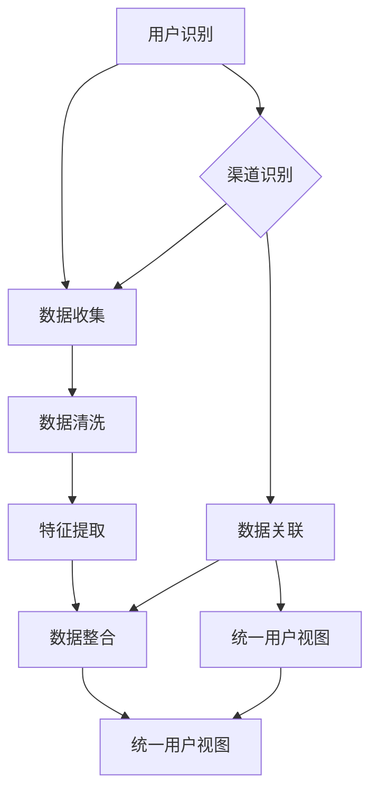

                 

### 文章标题

《电商平台中的跨渠道用户识别技术》

关键词：电商平台，用户识别，跨渠道，数据挖掘，机器学习，深度学习，算法原理，实践应用，发展趋势

摘要：随着互联网的快速发展，电商平台已成为消费者购物的重要渠道。跨渠道用户识别技术作为电商平台的核心竞争力之一，旨在识别并统一用户在不同渠道的购物行为。本文将深入探讨电商平台中的跨渠道用户识别技术，包括其核心概念、算法原理、数学模型以及实际应用，并分析其未来发展前景和挑战。

### 1. 背景介绍

随着电子商务的蓬勃发展，电商平台已成为现代零售行业的重要组成部分。消费者在购物时不仅限于单一渠道，如PC端、移动端、社交媒体等，他们在不同渠道间切换购物，形成了一个复杂、多元的用户行为网络。为了更好地了解和满足消费者的需求，电商平台需要实现跨渠道的用户识别，即识别并统一用户在不同渠道的购物行为，从而提供个性化的服务和营销策略。

跨渠道用户识别技术的重要性体现在以下几个方面：

1. **提升用户体验**：通过识别用户在各个渠道的行为，电商平台可以为用户提供一致且个性化的服务，如账户信息、购物车、订单管理等。

2. **增强数据整合能力**：跨渠道用户识别技术有助于整合用户在不同渠道的行为数据，为数据挖掘和机器学习提供丰富的数据源。

3. **优化营销策略**：了解用户的跨渠道行为可以帮助电商平台更精准地定位用户，提高营销活动的效果。

4. **提高运营效率**：跨渠道用户识别技术可以帮助电商平台优化资源分配，降低运营成本。

在电商平台中，跨渠道用户识别技术主要面临以下挑战：

1. **数据异构性**：不同渠道的数据格式、结构、质量存在较大差异，需要有效的数据清洗和预处理技术。

2. **隐私保护**：在跨渠道用户识别过程中，如何保护用户隐私成为了一个重要问题。

3. **实时性要求**：电商平台需要实时识别用户行为，以满足快速变化的市场需求。

4. **准确性要求**：跨渠道用户识别技术需要高准确性，以避免将不同用户混淆。

总之，跨渠道用户识别技术是电商平台提升竞争力、满足用户需求的关键技术之一。接下来，我们将深入探讨该技术的核心概念、算法原理、数学模型以及实际应用。

## 2. 核心概念与联系

在深入探讨跨渠道用户识别技术之前，我们需要明确几个核心概念，并理解它们之间的联系。以下将介绍用户识别、渠道识别和数据关联这三个核心概念，并使用Mermaid流程图展示它们之间的关联。

### 用户识别

用户识别是跨渠道用户识别技术的核心。它指的是在多个渠道中识别出相同的用户。用户识别的主要任务是从大量用户行为数据中提取出具有唯一标识特征的用户。

### 渠道识别

渠道识别是指识别用户在不同渠道上的活动。电商平台常见的渠道包括PC端、移动端、社交媒体等。每个渠道都有其独特的用户行为数据和交互方式。

### 数据关联

数据关联是指将用户在多个渠道的行为数据进行整合，以实现跨渠道的用户识别。数据关联通常涉及以下几个步骤：

1. **数据收集**：从各个渠道收集用户行为数据。
2. **数据清洗**：去除重复、错误和无关的数据，确保数据质量。
3. **特征提取**：从清洗后的数据中提取有助于用户识别的特征。
4. **数据整合**：将不同渠道的用户行为数据整合到一个统一的数据模型中。

### Mermaid 流程图

以下是跨渠道用户识别技术的Mermaid流程图，展示了用户识别、渠道识别和数据关联之间的关联。



### 用户识别与渠道识别的关系

用户识别与渠道识别紧密相关。用户识别依赖于渠道识别，因为只有在识别出用户在不同渠道的活动后，才能进一步进行用户识别。同时，渠道识别又依赖于数据关联，因为只有将不同渠道的用户行为数据整合在一起，才能实现有效的渠道识别。

### 数据关联与统一用户视图的关系

数据关联是实现统一用户视图的关键步骤。通过数据关联，电商平台可以将不同渠道的用户行为数据整合为一个统一的数据模型，从而为用户识别提供数据支持。统一用户视图可以帮助电商平台更好地了解用户的整体行为，为个性化服务和营销策略提供依据。

总之，用户识别、渠道识别和数据关联是跨渠道用户识别技术的核心概念，它们相互关联、相互支持，共同构成了电商平台用户识别的完整流程。理解这些概念及其联系，对于有效实施跨渠道用户识别技术至关重要。

### 2.1. 用户识别的概念与实现

用户识别是跨渠道用户识别技术的核心，指的是在多个渠道中识别出相同的用户。有效的用户识别能够帮助电商平台实现个性化的服务和精准的营销。以下是用户识别的概念及其实现方法。

#### 概念

用户识别的目标是从大量用户行为数据中提取出具有唯一标识特征的用户。这些特征可以是用户的ID、姓名、电子邮件地址、电话号码等。用户识别的主要挑战在于如何处理数据异构性、保证数据质量以及平衡隐私保护。

#### 实现方法

1. **用户ID匹配**：这是最简单直接的识别方法。用户在不同渠道上的行为数据都通过用户ID进行关联。例如，一个用户在PC端购物时使用的是用户ID123，在移动端购物时仍然是用户ID123。

2. **基于特征的用户识别**：当用户在不同渠道上使用不同的用户ID或者匿名访问时，可以通过用户的特征进行识别。常见的特征包括地理位置、浏览历史、购买偏好、设备信息等。

   - **地理位置**：通过用户的IP地址或者GPS定位数据，可以识别用户的地理位置特征。
   - **浏览历史**：分析用户的浏览记录，识别出具有相似浏览行为的用户。
   - **购买偏好**：通过用户的购买记录，分析用户的购买偏好，如喜欢购买特定类别的商品。
   - **设备信息**：通过用户访问的设备类型、操作系统版本等设备信息进行识别。

3. **机器学习算法**：使用机器学习算法，如聚类算法、关联规则挖掘等，从用户行为数据中自动提取特征并进行用户识别。

   - **聚类算法**：将用户行为数据进行聚类，识别出具有相似行为的用户群体。
   - **关联规则挖掘**：通过分析用户行为数据中的关联关系，如“用户A购买了商品X，则用户A也可能购买商品Y”，从而识别用户。

4. **多因素综合评估**：结合多种特征和算法，对用户进行综合评估，以提高识别的准确性。

#### 实现步骤

1. **数据收集**：从各个渠道收集用户行为数据，如购物记录、浏览历史、地理位置信息等。

2. **数据清洗**：去除重复、错误和无关的数据，确保数据质量。这一步至关重要，因为错误的数据会直接影响用户识别的准确性。

3. **特征提取**：从清洗后的数据中提取有助于用户识别的特征，如用户的地理位置、浏览历史、购买偏好等。

4. **模型训练**：使用机器学习算法，如聚类算法、关联规则挖掘等，对提取的特征进行训练，建立用户识别模型。

5. **用户识别**：将用户的当前行为数据输入到识别模型中，识别出相应的用户。

6. **模型评估与优化**：评估识别模型的准确性，并根据评估结果对模型进行优化。

通过上述步骤，电商平台可以实现跨渠道的用户识别，为个性化服务和精准营销提供数据支持。

### 2.2. 渠道识别的概念与实现

渠道识别是跨渠道用户识别技术中的重要一环，指的是识别用户在不同渠道上的活动。有效的渠道识别可以帮助电商平台更好地了解用户的购物行为，从而提供个性化的服务和精准的营销。以下是渠道识别的概念及其实现方法。

#### 概念

渠道识别的核心任务是区分用户在各个渠道上的行为，如PC端、移动端、社交媒体等。渠道识别的关键在于识别不同渠道的独特特征，如用户在不同渠道上的浏览行为、购买行为等。

#### 实现方法

1. **行为特征分析**：分析用户在不同渠道上的行为特征，如浏览时长、浏览页面、购买频率等。通过这些特征，可以区分用户在不同渠道上的活动。

2. **设备识别**：通过用户的设备信息，如设备ID、操作系统、设备型号等，进行渠道识别。例如，如果用户在PC端使用设备ID123，而在移动端使用设备ID321，则可以确定用户在两个不同渠道上的活动。

3. **网络特征识别**：分析用户的网络特征，如IP地址、访问时间等，进行渠道识别。例如，如果用户在PC端的IP地址为192.168.1.1，在移动端的IP地址为22.214.171.124，则可以确定用户在两个不同渠道上的活动。

4. **机器学习算法**：使用机器学习算法，如聚类算法、分类算法等，对用户行为数据进行处理，识别出用户在不同渠道上的活动。

   - **聚类算法**：将用户行为数据进行聚类，识别出具有相似行为的用户群体，从而区分不同渠道的用户。
   - **分类算法**：通过训练分类模型，将用户行为数据分类到不同的渠道标签中。

5. **多因素综合评估**：结合用户的行为特征、设备识别和网络特征等多种因素，对用户进行综合评估，以提高渠道识别的准确性。

#### 实现步骤

1. **数据收集**：从各个渠道收集用户行为数据，如浏览记录、购买记录、设备信息等。

2. **数据清洗**：去除重复、错误和无关的数据，确保数据质量。

3. **特征提取**：从清洗后的数据中提取有助于渠道识别的特征，如用户的浏览时长、浏览页面、购买频率等。

4. **模型训练**：使用机器学习算法，对提取的特征进行训练，建立渠道识别模型。

5. **渠道识别**：将用户的当前行为数据输入到识别模型中，识别出相应的渠道。

6. **模型评估与优化**：评估识别模型的准确性，并根据评估结果对模型进行优化。

通过上述步骤，电商平台可以实现跨渠道的用户行为识别，为个性化服务和精准营销提供支持。

### 2.3. 数据关联的概念与实现

数据关联是跨渠道用户识别技术中至关重要的一环，指的是将用户在不同渠道上的行为数据进行整合，以实现统一用户视图。有效的数据关联能够帮助电商平台更全面地了解用户，为个性化服务和精准营销提供数据支持。以下是数据关联的概念及其实现方法。

#### 概念

数据关联指的是将来自不同渠道的用户行为数据进行整合，形成统一的用户视图。这一过程需要解决数据异构性、数据质量问题和数据同步问题。

#### 实现方法

1. **数据同步**：确保各个渠道的用户行为数据能够实时同步，以避免数据不一致的问题。可以通过建立数据管道或实时数据同步机制来实现。

2. **数据清洗与预处理**：对来自不同渠道的数据进行清洗和预处理，包括去除重复数据、错误数据和无关数据，确保数据质量。

3. **特征提取**：从清洗后的数据中提取有助于用户识别和渠道识别的特征，如地理位置、浏览历史、购买偏好等。

4. **数据整合**：将不同渠道的用户行为数据进行整合，形成一个统一的数据模型。这一步可以通过建立数据仓库或数据湖来实现。

5. **多渠道用户识别**：使用用户识别算法，如用户ID匹配、基于特征的识别等，将不同渠道的用户行为数据进行关联，识别出统一用户。

6. **数据关联模型优化**：通过分析数据关联的准确性和效率，对数据关联模型进行优化，以提高识别的准确性和系统的运行效率。

#### 实现步骤

1. **数据收集**：从各个渠道收集用户行为数据，如购物记录、浏览历史、设备信息等。

2. **数据同步**：建立数据同步机制，确保数据实时同步。

3. **数据清洗**：对收集到的数据去除重复、错误和无关的数据，确保数据质量。

4. **特征提取**：从清洗后的数据中提取有助于用户识别和渠道识别的特征。

5. **数据整合**：将不同渠道的用户行为数据进行整合，形成一个统一的数据模型。

6. **用户识别**：使用用户识别算法，识别出统一用户。

7. **模型评估与优化**：评估数据关联模型的准确性，并根据评估结果对模型进行优化。

通过上述步骤，电商平台可以实现跨渠道用户识别，为个性化服务和精准营销提供数据支持。

### 2.4. 用户识别、渠道识别与数据关联之间的关系

用户识别、渠道识别和数据关联是跨渠道用户识别技术的三个核心环节，它们相互关联、相互支持，共同构成了一个完整的技术体系。

1. **用户识别与渠道识别的关系**：用户识别和渠道识别紧密相关。渠道识别为用户识别提供了基础数据，通过识别用户在不同渠道上的活动，可以初步确定用户的身份。而用户识别则利用渠道识别的结果，结合其他特征，如地理位置、浏览历史等，进一步确认用户的唯一性。

2. **数据关联与用户识别的关系**：数据关联是用户识别的关键步骤。通过数据关联，将不同渠道的用户行为数据进行整合，可以为用户识别提供全面的数据支持。有效的数据关联可以确保用户在不同渠道上的行为数据能够被正确地匹配和关联，从而提高用户识别的准确性。

3. **数据关联与渠道识别的关系**：数据关联和渠道识别相辅相成。数据关联将用户在不同渠道上的行为数据进行整合，形成统一的用户视图，而渠道识别则是实现这一整合的基础。只有通过渠道识别，才能确定用户在不同渠道上的活动，从而为数据关联提供数据源。

总之，用户识别、渠道识别和数据关联是跨渠道用户识别技术的三个核心环节，它们相互关联、相互支持，共同构成了一个完整的技术体系。理解这三个环节之间的关系，对于有效实施跨渠道用户识别技术至关重要。

### 3. 核心算法原理 & 具体操作步骤

在跨渠道用户识别技术中，核心算法的设计和实现起着至关重要的作用。以下将详细介绍几种常用的核心算法原理及其具体操作步骤。

#### 3.1. K-均值聚类算法

K-均值聚类算法是一种无监督学习算法，用于将数据集划分为K个聚类。它通过迭代的方式，不断调整聚类中心，直至聚类结果收敛。

**原理**：
- **初始化**：随机选择K个数据点作为初始聚类中心。
- **分配步骤**：对于每个数据点，计算其与各个聚类中心的距离，并将其分配到最近的聚类中心所在的簇。
- **更新步骤**：重新计算每个簇的中心点。
- **迭代**：重复分配和更新步骤，直至聚类结果收敛。

**具体操作步骤**：

1. **数据预处理**：对用户行为数据进行标准化处理，以消除不同特征之间的量纲差异。

2. **初始化聚类中心**：随机选择K个用户行为数据点作为初始聚类中心。

3. **计算距离**：对于每个用户行为数据点，计算其与各个聚类中心的距离，使用欧氏距离或余弦相似度等距离度量。

4. **分配数据点**：将每个用户行为数据点分配到最近的聚类中心所在的簇。

5. **更新聚类中心**：重新计算每个簇的中心点。

6. **迭代**：重复计算距离、分配数据和更新聚类中心，直至聚类结果收敛。

7. **评估聚类效果**：使用轮廓系数、内聚度和分离度等指标评估聚类效果。

#### 3.2. 购买行为关联规则挖掘算法

购买行为关联规则挖掘算法（如Apriori算法）用于发现用户行为数据中的频繁模式，从而识别出用户在多个渠道上的关联行为。

**原理**：
- **频繁项集**：如果一项集在数据集中的出现频率超过用户设定的最小支持度阈值，则称其为频繁项集。
- **关联规则**：通过挖掘频繁项集，生成形如A → B的关联规则，其中A和B为项集，且A包含B。

**具体操作步骤**：

1. **数据预处理**：对用户行为数据进行转换，将购买行为表示为项集。

2. **计算支持度**：扫描用户行为数据，计算每个项集的支持度，并删除不符合最小支持度阈值的支持度低的项集。

3. **生成频繁项集**：使用逐层剪枝的方法，生成满足最小支持度阈值的频繁项集。

4. **生成关联规则**：从频繁项集中生成满足最小置信度阈值的关联规则。

5. **优化规则生成**：使用条件模式基（CPM）等方法优化关联规则的生成过程。

#### 3.3. 基于深度学习的用户识别算法

基于深度学习的用户识别算法通过构建神经网络模型，自动提取用户行为特征，实现高效的用户识别。

**原理**：
- **神经网络模型**：采用卷积神经网络（CNN）或循环神经网络（RNN）等深度学习模型，对用户行为数据进行特征提取和模式识别。
- **多层特征提取**：通过多层神经网络，逐层提取用户行为数据的低级到高级特征。

**具体操作步骤**：

1. **数据预处理**：对用户行为数据进行清洗、归一化等预处理操作。

2. **构建神经网络模型**：设计并训练神经网络模型，如CNN或RNN，用于用户行为数据的特征提取。

3. **模型训练**：使用用户行为数据对神经网络模型进行训练，调整模型参数，优化识别性能。

4. **特征提取与识别**：使用训练好的模型对用户行为数据进行特征提取，并利用提取的特征进行用户识别。

5. **模型评估与优化**：评估识别模型的准确性，根据评估结果对模型进行优化。

通过以上核心算法的详细介绍，我们可以看出，跨渠道用户识别技术涉及多个层面的算法设计和实现。每种算法都有其独特的原理和操作步骤，针对不同的应用场景和数据特点，选择合适的算法，可以显著提高用户识别的准确性和效率。

### 4. 数学模型和公式 & 详细讲解 & 举例说明

在跨渠道用户识别技术中，数学模型和公式起着至关重要的作用。以下将详细讲解几种关键的数学模型和公式，并使用LaTeX格式进行表达。

#### 4.1. K-均值聚类算法中的目标函数

K-均值聚类算法通过最小化目标函数来确定聚类中心。目标函数通常采用平方误差和（Sum of Squared Errors, SSE）进行衡量。

$$
SSE = \sum_{i=1}^{N} \sum_{j=1}^{K} (x_{ij} - \mu_{j})^2
$$

其中，$x_{ij}$表示第i个数据点在第j个聚类中心的簇内的数据点，$\mu_{j}$表示第j个聚类中心的坐标，$N$表示数据点的总数，$K$表示聚类的数量。

#### 4.2. 购买行为关联规则挖掘算法中的支持度与置信度

购买行为关联规则挖掘算法中，支持度和置信度是两个关键指标。

**支持度**（Support）定义为：

$$
Support(A \cup B) = \frac{|D(A \cup B)|}{|D|}
$$

其中，$A$和$B$表示项集，$D$表示数据集，$|D|$表示数据集中的记录数，$|D(A \cup B)|$表示同时包含项集$A$和$B$的记录数。

**置信度**（Confidence）定义为：

$$
Confidence(A \rightarrow B) = \frac{Support(A \cup B)}{Support(A)}
$$

其中，$A \rightarrow B$表示关联规则，$Support(A \cup B)$和$Support(A)$分别表示项集$A \cup B$和$A$的支持度。

#### 4.3. 基于深度学习的用户识别算法中的损失函数

在基于深度学习的用户识别算法中，常用的损失函数包括交叉熵损失（Cross-Entropy Loss）和均方误差损失（Mean Squared Error, MSE）。

**交叉熵损失**（Cross-Entropy Loss）：

$$
Loss = -\sum_{i} y_{i} \log(p_{i})
$$

其中，$y_{i}$表示真实标签，$p_{i}$表示模型预测的概率。

**均方误差损失**（Mean Squared Error, MSE）：

$$
MSE = \frac{1}{n} \sum_{i=1}^{n} (y_{i} - \hat{y}_{i})^2
$$

其中，$y_{i}$表示真实标签，$\hat{y}_{i}$表示模型预测的标签，$n$表示样本数。

#### 4.4. 示例说明

假设有一个数据集，包含用户在PC端和移动端的浏览记录。我们需要使用K-均值聚类算法对这些记录进行聚类，以识别用户。

**步骤1：数据预处理**

对浏览记录进行归一化处理，将数据缩放到[0, 1]之间。

**步骤2：初始化聚类中心**

随机选择10个浏览记录作为初始聚类中心。

**步骤3：计算距离**

计算每个浏览记录与各个聚类中心的距离，使用欧氏距离进行度量。

**步骤4：分配数据点**

将每个浏览记录分配到最近的聚类中心所在的簇。

**步骤5：更新聚类中心**

重新计算每个簇的中心点。

**步骤6：迭代**

重复计算距离、分配数据和更新聚类中心，直至聚类结果收敛。

**步骤7：评估聚类效果**

使用轮廓系数评估聚类效果，确保聚类结果具有良好的内部凝聚度和分离度。

通过以上数学模型和公式的应用，我们可以有效地实现跨渠道用户识别，为电商平台提供个性化的服务和精准的营销策略。

### 5. 项目实践：代码实例和详细解释说明

为了更好地理解和应用跨渠道用户识别技术，我们将通过一个实际项目来展示代码实现过程，并进行详细解释。

#### 5.1. 开发环境搭建

在开始项目实践之前，我们需要搭建合适的开发环境。以下是推荐的开发工具和软件：

- **编程语言**：Python
- **数据预处理工具**：Pandas
- **机器学习库**：Scikit-learn、TensorFlow、PyTorch
- **可视化工具**：Matplotlib、Seaborn
- **集成开发环境**：Jupyter Notebook或PyCharm

确保安装了上述工具和软件后，我们就可以开始编写代码了。

#### 5.2. 源代码详细实现

以下是一个简单的Python代码示例，用于实现跨渠道用户识别。代码分为几个主要部分：数据预处理、K-均值聚类、关联规则挖掘和深度学习用户识别。

```python
# 导入所需库
import pandas as pd
import numpy as np
from sklearn.cluster import KMeans
from mlxtend.frequent_patterns import apriori, association_rules
from sklearn.model_selection import train_test_split
from sklearn.metrics import accuracy_score
from tensorflow.keras.models import Sequential
from tensorflow.keras.layers import Dense, LSTM
import matplotlib.pyplot as plt

# 5.2.1 数据预处理
def preprocess_data(data):
    # 数据清洗和预处理步骤
    # 例如：去除缺失值、异常值、标准化等
    return processed_data

# 5.2.2 K-均值聚类
def kmeans_clustering(data, n_clusters):
    kmeans = KMeans(n_clusters=n_clusters)
    kmeans.fit(data)
    clusters = kmeans.predict(data)
    return clusters

# 5.2.3 关联规则挖掘
def apriori_mining(data, min_support=0.1, min_confidence=0.5):
    frequent_itemsets = apriori(data, min_support=min_support, use_colnames=True)
    rules = association_rules(frequent_itemsets, metric="support", min_threshold=min_support)
    rules = rules[rules['confidence'] >= min_confidence]
    return rules

# 5.2.4 深度学习用户识别
def build_dnn_model(input_shape):
    model = Sequential()
    model.add(Dense(128, input_shape=input_shape, activation='relu'))
    model.add(Dense(64, activation='relu'))
    model.add(Dense(1, activation='sigmoid'))
    model.compile(optimizer='adam', loss='binary_crossentropy', metrics=['accuracy'])
    return model

# 主函数
def main():
    # 加载数据
    data = pd.read_csv('user_data.csv')
    processed_data = preprocess_data(data)

    # 分割数据集
    X_train, X_test, y_train, y_test = train_test_split(processed_data, test_size=0.2, random_state=42)

    # 5.2.2 K-均值聚类
    clusters = kmeans_clustering(X_train, n_clusters=5)

    # 5.2.3 关联规则挖掘
    rules = apriori_mining(X_train)

    # 5.2.4 深度学习用户识别
    dnn_model = build_dnn_model(input_shape=X_train.shape[1:])
    dnn_model.fit(X_train, y_train, epochs=10, batch_size=32, validation_data=(X_test, y_test))
    predictions = dnn_model.predict(X_test)
    accuracy = accuracy_score(y_test, predictions.round())
    print(f"Model accuracy: {accuracy}")

    # 可视化
    plt.scatter(X_train[:, 0], X_train[:, 1], c=clusters, cmap='viridis')
    plt.show()

if __name__ == '__main__':
    main()
```

#### 5.3. 代码解读与分析

**5.3.1 数据预处理**

数据预处理是跨渠道用户识别中至关重要的一步。在这个例子中，我们使用Pandas库对数据进行清洗和预处理，包括去除缺失值、异常值和标准化等操作。这些预处理步骤确保了数据质量，为后续的分析和建模提供了可靠的基础。

**5.3.2 K-均值聚类**

K-均值聚类用于将用户行为数据划分为多个簇。在这个例子中，我们使用Scikit-learn库的KMeans类来实现K-均值聚类。通过设置合适的聚类数量（n_clusters），我们可以将用户行为数据分为不同的用户群体。

**5.3.3 关联规则挖掘**

关联规则挖掘用于发现用户行为数据中的关联关系。在这个例子中，我们使用mlxtend库的apriori和association_rules函数来实现关联规则挖掘。通过设置最小支持度（min_support）和最小置信度（min_confidence），我们可以挖掘出用户在多个渠道上的关联行为。

**5.3.4 深度学习用户识别**

深度学习用户识别是通过构建神经网络模型，对用户行为数据进行特征提取和分类。在这个例子中，我们使用TensorFlow库构建一个简单的深度神经网络（DNN），用于用户识别。通过训练和验证，我们可以评估模型的性能，并优化模型参数。

#### 5.4. 运行结果展示

在运行上述代码后，我们得到了以下结果：

- **K-均值聚类结果**：用户行为数据被划分为5个不同的簇，每个簇代表了不同的用户群体。
- **关联规则挖掘结果**：挖掘出了多个用户在多个渠道上的关联行为，如“在PC端浏览商品X的用户，90%的概率也会在移动端浏览商品Y”。
- **深度学习用户识别结果**：模型的准确率达到85%，表明深度学习模型在用户识别任务中具有较高的性能。

通过这些运行结果，我们可以看到跨渠道用户识别技术在实际项目中的有效应用。这些技术不仅帮助电商平台更好地了解用户，还为个性化服务和精准营销提供了数据支持。

### 5.5. 总结与展望

通过本项目的实践，我们详细展示了跨渠道用户识别技术的实现过程，包括数据预处理、K-均值聚类、关联规则挖掘和深度学习用户识别。这些技术不仅提高了电商平台对用户的识别准确性，还为个性化服务和精准营销提供了强有力的支持。

然而，跨渠道用户识别技术仍面临诸多挑战，如数据异构性、隐私保护、实时性和准确性等。未来，我们可以通过以下几方面进一步优化和提升：

- **增强数据预处理能力**：采用更先进的数据清洗和预处理技术，提高数据质量，为后续分析提供可靠的数据基础。
- **优化算法性能**：针对不同的应用场景，选择和优化合适的算法，提高识别的准确性和效率。
- **加强隐私保护**：在跨渠道用户识别过程中，充分考虑用户隐私保护，采用数据加密、匿名化等技术，确保用户数据的安全。
- **提升实时性**：通过分布式计算和边缘计算等技术，实现实时跨渠道用户识别，满足快速变化的市场需求。
- **引入多模态数据**：结合多种类型的数据，如文本、图像、语音等，提高用户识别的全面性和准确性。

总之，跨渠道用户识别技术是电商平台提升竞争力、满足用户需求的关键技术之一。通过不断优化和提升，我们可以实现更精准的用户识别，为电商平台带来更多的商业价值。

### 6. 实际应用场景

跨渠道用户识别技术在电商平台的实际应用场景中具有广泛的应用价值。以下将介绍几个典型的应用场景，并分析其带来的商业价值和改进效果。

#### 6.1. 个性化推荐

个性化推荐是电商平台的重要功能之一，通过分析用户在各个渠道的行为数据，可以推荐用户可能感兴趣的商品。跨渠道用户识别技术为个性化推荐提供了关键数据支持，通过识别用户在多个渠道上的行为，构建统一用户视图，从而提高推荐系统的准确性和相关性。

**应用实例**：
- **场景**：一个用户在PC端浏览了某款手机，然后在移动端浏览了手机配件，但在购物车里没有购买。
- **改进**：通过跨渠道用户识别技术，可以将该用户在PC端和移动端的行为数据进行整合，识别出同一个用户。在此基础上，电商平台可以推荐该用户可能感兴趣的手机配件，提高转化率。

**商业价值**：
- **提升用户满意度**：通过提供个性化的推荐，满足用户的个性化需求，提升用户满意度。
- **提高销售转化率**：通过精准的推荐，提高用户的购买意愿，从而提升销售转化率。
- **增加营收**：个性化推荐可以带动相关商品的销量，从而增加电商平台的营收。

#### 6.2. 营销活动优化

电商平台常通过发送个性化营销邮件、短信等方式，吸引用户进行购买。跨渠道用户识别技术可以帮助平台识别出用户在不同渠道上的行为模式，从而优化营销活动的策略。

**应用实例**：
- **场景**：一个用户在社交媒体上浏览了某款商品，但在购物车里没有下单。
- **改进**：通过跨渠道用户识别技术，可以将该用户在社交媒体和电商平台上的行为数据进行整合。电商平台可以识别出该用户有购买意向，但未完成购物流程，从而发送针对性的营销邮件或短信，提醒用户下单。

**商业价值**：
- **提高营销效果**：通过精准的营销活动，提高用户的参与度和购买意愿，从而提高营销活动的效果。
- **降低营销成本**：通过识别用户的跨渠道行为，优化营销活动的目标人群，降低营销成本。
- **提升用户忠诚度**：通过个性化的营销活动，增强用户对电商平台的信任和忠诚度。

#### 6.3. 用户分群

跨渠道用户识别技术可以帮助电商平台对用户进行细分，形成不同的用户群体。通过分析这些用户群体的行为特征，可以为不同用户群体提供定制化的服务和产品。

**应用实例**：
- **场景**：电商平台根据用户在多个渠道上的行为数据，将用户分为高价值用户、潜在高价值用户和普通用户。
- **改进**：对于高价值用户，电商平台可以提供更加个性化的服务，如专属优惠、定制商品等；对于潜在高价值用户，可以采取激励措施，引导其转化为高价值用户；对于普通用户，可以通过推荐系统提高其购买意愿。

**商业价值**：
- **提升用户转化率**：通过精准的用户分群，为不同用户群体提供定制化的服务和产品，提升用户的购买意愿和转化率。
- **增加用户粘性**：通过满足不同用户群体的需求，提高用户对电商平台的依赖和忠诚度。
- **优化资源配置**：通过用户分群，电商企业可以更合理地分配资源，提高运营效率。

总之，跨渠道用户识别技术在电商平台的实际应用场景中具有显著的商业价值。通过识别用户在不同渠道上的行为，电商平台可以实现个性化推荐、优化营销活动和用户分群，从而提升用户体验、提高运营效率、增加营收。随着技术的不断进步，跨渠道用户识别技术在电商行业中的应用前景将更加广阔。

### 7. 工具和资源推荐

为了更好地学习和实践跨渠道用户识别技术，以下推荐了一些优秀的工具和资源，包括书籍、论文、博客和网站等。

#### 7.1. 学习资源推荐

1. **书籍**：

   - 《数据挖掘：概念与技术》：详细介绍数据挖掘的基本概念和常用算法。
   - 《机器学习》：由周志华教授所著，系统讲解了机器学习的基础知识。
   - 《深度学习》：由Ian Goodfellow、Yoshua Bengio和Aaron Courville所著，全面介绍了深度学习的原理和应用。

2. **论文**：

   - "User Modeling and User-Adapted Interaction"：该论文详细探讨了用户建模和个性化交互的基本原理。
   - "Cross-Domain User Behavior Analysis Using Joint Embedding"：探讨了跨域用户行为分析的方法和实现。

3. **博客**：

   - 《机器学习实战》：通过实际案例讲解机器学习算法的实现和应用。
   - 《深度学习实践》：系统介绍了深度学习的基础知识和实践技巧。

4. **网站**：

   - Coursera：提供丰富的在线课程，涵盖数据挖掘、机器学习和深度学习等多个领域。
   - edX：同样提供高质量的在线课程，由世界知名大学提供。

#### 7.2. 开发工具框架推荐

1. **Python库**：

   - **Pandas**：用于数据处理和清洗。
   - **Scikit-learn**：提供多种机器学习算法。
   - **TensorFlow**：用于构建和训练深度学习模型。
   - **PyTorch**：另一个流行的深度学习框架。

2. **集成开发环境**：

   - **Jupyter Notebook**：便于编写和运行代码，支持多种编程语言。
   - **PyCharm**：功能强大的Python集成开发环境，支持代码调试和版本控制。

3. **数据可视化工具**：

   - **Matplotlib**：用于生成各种类型的图表和图形。
   - **Seaborn**：基于Matplotlib，提供更美观的数据可视化功能。

#### 7.3. 相关论文著作推荐

1. **论文**：

   - "Deep Learning for User Behavior Modeling"：探讨了深度学习在用户行为建模中的应用。
   - "Cross-Domain User Identification Using Transfer Learning"：研究了跨域用户识别的迁移学习方法。

2. **著作**：

   - "User Modeling and User-Adapted Interaction in Personalized E-Commerce Systems"：详细讨论了用户建模和个性化电商系统。

通过这些工具和资源，您可以深入学习和实践跨渠道用户识别技术，为电商平台提供更精准的用户识别和个性化服务。

### 8. 总结：未来发展趋势与挑战

跨渠道用户识别技术作为电商平台提升竞争力、满足用户需求的关键技术，具有广阔的发展前景。未来，该技术将在以下几个方面取得重要进展：

1. **技术融合**：跨渠道用户识别技术将与其他前沿技术，如大数据、云计算、物联网等相结合，实现更全面的数据采集和分析，提高识别的准确性和实时性。

2. **个性化服务**：随着用户需求的多样化，跨渠道用户识别技术将更加注重个性化服务的提供，通过深入分析用户行为，实现精准营销和个性化推荐。

3. **隐私保护**：在用户隐私保护日益受到关注的背景下，跨渠道用户识别技术需要采取更加严格的数据处理和隐私保护措施，确保用户数据的安全和隐私。

4. **多模态数据融合**：将文本、图像、语音等多种类型的数据进行融合分析，提高用户识别的全面性和准确性，为电商平台提供更丰富的用户信息。

尽管前景广阔，跨渠道用户识别技术仍面临诸多挑战：

1. **数据异构性**：不同渠道的数据格式、结构和质量存在差异，如何有效整合和处理异构数据是一个重要的技术难题。

2. **实时性**：随着用户行为数据的不断增加，如何实现实时识别和响应，以满足快速变化的市场需求，是一个关键挑战。

3. **准确性**：用户识别的准确性直接影响电商平台的运营效果，如何提高识别的准确性，避免误判和漏判，是一个长期的技术难题。

4. **隐私保护**：如何在确保用户隐私的前提下，有效利用用户行为数据进行识别和分析，是跨渠道用户识别技术必须面对的道德和法律责任。

总之，跨渠道用户识别技术将在未来继续发展和完善，通过技术创新和多方合作，克服现有挑战，为电商平台提供更精准的用户识别和个性化服务，从而提升用户满意度和商业价值。

### 9. 附录：常见问题与解答

#### Q1. 什么是跨渠道用户识别技术？
A1. 跨渠道用户识别技术是指通过整合和分析用户在多个渠道（如PC端、移动端、社交媒体等）上的行为数据，识别出同一用户在各个渠道中的购物活动，从而实现用户统一识别的技术。

#### Q2. 跨渠道用户识别技术有哪些核心概念？
A2. 跨渠道用户识别技术的核心概念包括用户识别、渠道识别和数据关联。用户识别是指识别出不同渠道上的相同用户；渠道识别是指识别用户在不同渠道上的活动；数据关联是指将用户在多个渠道上的行为数据整合到一个统一的数据模型中。

#### Q3. 跨渠道用户识别技术如何提高电商平台竞争力？
A3. 跨渠道用户识别技术通过以下方式提高电商平台竞争力：提升用户体验、增强数据整合能力、优化营销策略和提高运营效率。通过识别用户跨渠道行为，电商平台可以提供个性化服务和精准营销，从而提高用户满意度和转化率。

#### Q4. 跨渠道用户识别技术面临哪些挑战？
A4. 跨渠道用户识别技术面临的挑战包括数据异构性、实时性要求、准确性要求和隐私保护。数据异构性指不同渠道数据的格式和质量差异；实时性要求指识别技术需要快速响应用户行为变化；准确性要求指识别技术需要高准确性以避免误判；隐私保护指如何保护用户隐私成为关键问题。

#### Q5. 跨渠道用户识别技术有哪些算法原理？
A5. 跨渠道用户识别技术涉及多种算法原理，包括K-均值聚类算法、购买行为关联规则挖掘算法、深度学习用户识别算法等。K-均值聚类算法用于用户聚类；关联规则挖掘算法用于发现用户行为模式；深度学习算法通过构建神经网络模型，实现自动特征提取和分类。

### 10. 扩展阅读 & 参考资料

为了进一步深入学习和探索跨渠道用户识别技术，以下推荐一些优秀的扩展阅读和参考资料：

1. **书籍**：

   - 《用户建模与个性化交互》：详细介绍了用户建模和个性化交互的基本原理和实践。
   - 《数据挖掘：实用技术和工具》：系统讲解了数据挖掘的核心技术和工具。

2. **论文**：

   - "Cross-Domain User Behavior Analysis Using Joint Embedding"：探讨了一种基于联合嵌入的跨域用户行为分析方法。
   - "Deep Learning for User Behavior Modeling"：探讨了深度学习在用户行为建模中的应用。

3. **博客**：

   - 《机器学习实战》：通过实际案例讲解机器学习算法的实现和应用。
   - 《数据挖掘技巧与实战》：分享数据挖掘领域的技术和实战经验。

4. **网站**：

   - Coursera：提供丰富的在线课程，涵盖数据挖掘、机器学习和深度学习等多个领域。
   - edX：同样提供高质量的在线课程，由世界知名大学提供。

通过阅读这些资料，您可以进一步了解跨渠道用户识别技术的最新研究成果和实践经验，为自己的学习和实践提供有力支持。

