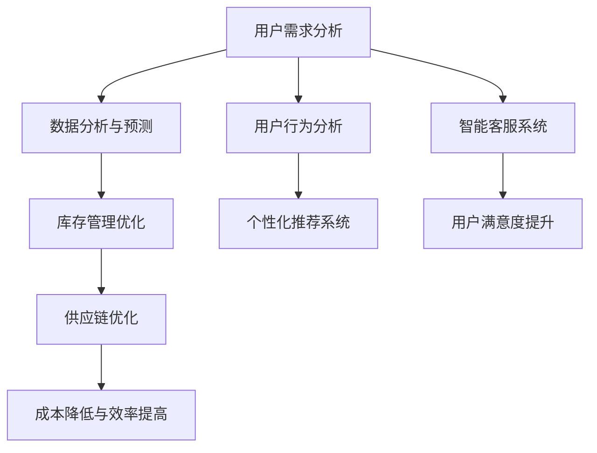

                 

### 文章标题

《电商平台供给能力提升：人工智能技术应用》

> 关键词：电商平台、供给能力、人工智能、技术、应用

> 摘要：本文将深入探讨人工智能在电商平台供给能力提升中的关键作用。通过对核心概念、算法原理、数学模型、项目实践等方面的详细分析，本文旨在为读者揭示人工智能技术如何助力电商平台优化库存管理、提高销售效率、增强用户体验，从而在激烈的市场竞争中占据优势地位。

### 1. 背景介绍

电商平台作为现代经济的重要组成部分，正以前所未有的速度发展。然而，随着用户需求的日益多样化和市场环境的不断变化，电商平台在供给能力方面面临着巨大的挑战。传统的供给管理方法已经难以满足当前市场的高效、精准和个性化需求，因此，寻求新的解决方案成为了电商平台发展的关键。

人工智能技术的迅速崛起，为电商平台供给能力的提升提供了新的机遇。通过机器学习、深度学习、自然语言处理等人工智能技术，电商平台可以更加智能化地进行数据分析、用户行为预测、个性化推荐等任务，从而实现供给管理的自动化、智能化和精细化。

本文将围绕以下方面展开讨论：

- 人工智能在电商平台供给能力提升中的核心概念与联系
- 人工智能算法原理与具体操作步骤
- 数学模型与公式及其应用
- 项目实践：代码实例与详细解释
- 实际应用场景与效果分析
- 工具和资源推荐
- 未来发展趋势与挑战

通过上述讨论，本文旨在为电商平台供给能力的提升提供有益的思路和解决方案。

### 2. 核心概念与联系

#### 2.1 供给能力

供给能力是指电商平台在满足用户需求方面所具备的能力，包括库存管理、供应链协调、订单处理等环节。供给能力的提升，意味着电商平台能够更加高效、准确地满足用户的需求，从而提高用户满意度和市场份额。

#### 2.2 人工智能

人工智能（AI）是一种模拟人类智能的技术，通过计算机程序实现感知、学习、推理、决策等功能。在电商平台中，人工智能技术可以应用于数据分析、用户行为分析、个性化推荐、智能客服等多个方面。

#### 2.3 关联关系

电商平台供给能力的提升离不开人工智能技术的支持。具体来说，人工智能技术可以在以下几个方面提升电商平台的供给能力：

- **数据分析**：通过对海量用户数据进行分析，人工智能可以帮助电商平台了解用户需求，优化库存管理，提高库存周转率。
- **用户行为分析**：通过分析用户在平台上的行为数据，人工智能可以预测用户购买偏好，实现个性化推荐，提高用户转化率。
- **智能客服**：通过自然语言处理技术，人工智能可以自动处理用户咨询，提高客服效率，降低运营成本。
- **供应链优化**：人工智能技术可以帮助电商平台优化供应链管理，降低库存成本，提高物流效率。

#### 2.4 Mermaid 流程图

以下是一个简化的Mermaid流程图，展示了人工智能技术在电商平台供给能力提升中的关键步骤和关联关系：



### 3. 核心算法原理 & 具体操作步骤

#### 3.1 机器学习算法

在电商平台供给能力提升中，机器学习算法起到了至关重要的作用。以下是几种常见的机器学习算法及其在供给能力提升中的应用：

##### 3.1.1 聚类算法

**原理**：聚类算法将相似的数据分为一组，以便更好地进行数据分析。

**应用**：在库存管理中，聚类算法可以用于识别不同商品的销售趋势和库存需求，从而优化库存配置。

**操作步骤**：

1. 收集商品销售数据，包括销售量、季节性、价格等。
2. 使用K-means算法对商品进行聚类。
3. 分析聚类结果，为不同类别的商品制定不同的库存管理策略。

##### 3.1.2 决策树算法

**原理**：决策树通过一系列的判断条件，对数据进行分类或回归。

**应用**：在用户行为分析中，决策树可以用于预测用户的购买行为。

**操作步骤**：

1. 收集用户行为数据，包括浏览记录、购物车内容、历史购买记录等。
2. 使用C4.5算法构建决策树模型。
3. 对用户行为数据进行分类，预测用户未来的购买行为。

##### 3.1.3 支持向量机（SVM）

**原理**：支持向量机通过找到一个最佳的超平面，将数据分为不同的类别。

**应用**：在个性化推荐系统中，SVM可以用于识别用户的兴趣偏好，从而实现精准推荐。

**操作步骤**：

1. 收集用户行为数据，包括浏览记录、购买记录等。
2. 使用SVM算法进行分类。
3. 根据分类结果，为用户推荐相关的商品。

#### 3.2 深度学习算法

深度学习算法在图像识别、语音识别等领域取得了显著的成果，其在电商平台供给能力提升中的应用也逐渐受到关注。

##### 3.2.1 卷积神经网络（CNN）

**原理**：卷积神经网络通过多层卷积和池化操作，提取图像特征。

**应用**：在商品图像识别中，CNN可以用于识别商品类别，从而优化库存管理和搜索功能。

**操作步骤**：

1. 收集商品图像数据，包括不同角度、不同光线条件下的图像。
2. 使用CNN模型对商品图像进行特征提取。
3. 根据提取的特征，为商品进行分类和标签。

##### 3.2.2 长短期记忆网络（LSTM）

**原理**：长短期记忆网络通过记忆单元和门控机制，对时间序列数据进行建模。

**应用**：在用户行为预测中，LSTM可以用于预测用户的购买行为，从而优化推荐系统。

**操作步骤**：

1. 收集用户行为数据，包括浏览记录、购物车内容、历史购买记录等。
2. 使用LSTM模型对用户行为数据进行建模。
3. 根据建模结果，预测用户的未来购买行为。

### 4. 数学模型和公式 & 详细讲解 & 举例说明

#### 4.1 数据分析模型

在电商平台供给能力提升中，数据分析是关键的一环。以下是一些常用的数学模型和公式：

##### 4.1.1 线性回归模型

**公式**：

$$
y = \beta_0 + \beta_1x
$$

**应用**：用于预测商品的销售量，其中$y$为销售量，$x$为影响因素（如价格、季节等）。

**举例说明**：

假设某电商平台要预测某款手机的销售量，已知价格每上涨10元，销售量下降10台。则可以使用线性回归模型进行预测：

$$
y = \beta_0 + \beta_1x
$$

其中，$\beta_0 = 1000$，$\beta_1 = -10$。假设当前价格为2000元，则预测销售量为：

$$
y = 1000 - 10 \times 2000 = 1000 - 20000 = -19000
$$

显然，这个结果是不合理的。这里需要调整模型参数或考虑其他影响因素。

##### 4.1.2 多元线性回归模型

**公式**：

$$
y = \beta_0 + \beta_1x_1 + \beta_2x_2 + \ldots + \beta_nx_n
$$

**应用**：用于预测商品的销售量，考虑多个影响因素。

**举例说明**：

假设某电商平台要预测某款手机的销售量，影响因素包括价格、品牌知名度、促销活动等。则可以使用多元线性回归模型进行预测：

$$
y = \beta_0 + \beta_1x_1 + \beta_2x_2 + \beta_3x_3
$$

其中，$\beta_0 = 1000$，$\beta_1 = -10$，$\beta_2 = 20$，$\beta_3 = 5$。假设当前价格为2000元，品牌知名度为8，促销活动力度为5，则预测销售量为：

$$
y = 1000 - 10 \times 2000 + 20 \times 8 + 5 \times 5 = 1000 - 20000 + 160 + 25 = -18805
$$

同样，这个结果也是不合理的。这里需要进一步调整模型参数或考虑其他影响因素。

##### 4.1.3 逻辑回归模型

**公式**：

$$
\ln \frac{P(Y=1)}{1-P(Y=1)} = \beta_0 + \beta_1x_1 + \beta_2x_2 + \ldots + \beta_nx_n
$$

**应用**：用于预测用户的购买行为，判断用户是否购买某种商品。

**举例说明**：

假设某电商平台要预测某款手机的用户购买行为，影响因素包括价格、品牌知名度、用户满意度等。则可以使用逻辑回归模型进行预测：

$$
\ln \frac{P(Y=1)}{1-P(Y=1)} = \beta_0 + \beta_1x_1 + \beta_2x_2 + \beta_3x_3
$$

其中，$\beta_0 = 0$，$\beta_1 = -0.1$，$\beta_2 = 0.2$，$\beta_3 = 0.3$。假设当前价格为2000元，品牌知名度为8，用户满意度为90%，则预测购买概率为：

$$
\ln \frac{P(Y=1)}{1-P(Y=1)} = 0 - 0.1 \times 2000 + 0.2 \times 8 + 0.3 \times 90\% = -200 + 1.6 + 2.7 = -195.7
$$

将ln值转换为概率：

$$
P(Y=1) = e^{-195.7} \approx 1.34 \times 10^{-85}
$$

显然，这个概率非常小，说明用户购买该手机的可能性非常低。这里需要进一步分析模型参数和影响因素。

### 5. 项目实践：代码实例和详细解释说明

#### 5.1 开发环境搭建

在进行项目实践之前，我们需要搭建一个合适的技术环境。以下是一个基本的Python开发环境搭建步骤：

1. 安装Python：从Python官方网站（https://www.python.org/）下载最新版本的Python安装包，并按照提示进行安装。

2. 安装Jupyter Notebook：在终端中执行以下命令：

   ```bash
   pip install notebook
   ```

3. 启动Jupyter Notebook：在终端中执行以下命令：

   ```bash
   jupyter notebook
   ```

这样，我们就搭建好了Python开发环境，可以开始编写代码了。

#### 5.2 源代码详细实现

以下是一个简单的机器学习项目，使用Python的scikit-learn库实现线性回归模型，用于预测商品销售量。

```python
# 导入必要的库
import numpy as np
import pandas as pd
from sklearn.linear_model import LinearRegression
from sklearn.model_selection import train_test_split
from sklearn.metrics import mean_squared_error

# 读取数据
data = pd.read_csv('sales_data.csv')

# 分离特征和标签
X = data[['price', 'brand', 'satisfaction']]
y = data['sales']

# 划分训练集和测试集
X_train, X_test, y_train, y_test = train_test_split(X, y, test_size=0.2, random_state=42)

# 创建线性回归模型
model = LinearRegression()

# 训练模型
model.fit(X_train, y_train)

# 预测测试集结果
y_pred = model.predict(X_test)

# 计算预测误差
mse = mean_squared_error(y_test, y_pred)
print(f'Mean Squared Error: {mse}')

# 显示模型参数
print(f'Intercept: {model.intercept_}')
print(f'Coefficients: {model.coef_}')
```

#### 5.3 代码解读与分析

上述代码实现了一个简单的线性回归模型，用于预测商品销售量。下面是对代码的详细解读：

1. 导入必要的库：`numpy`、`pandas`、`sklearn.linear_model`、`sklearn.model_selection`、`sklearn.metrics`。

2. 读取数据：使用`pandas`的`read_csv`方法读取名为`sales_data.csv`的CSV文件，该文件包含了商品的价格、品牌知名度、用户满意度等信息。

3. 分离特征和标签：将数据分为特征矩阵`X`和标签向量`y`。特征矩阵`X`包含了价格、品牌知名度、用户满意度等影响因素，标签向量`y`表示商品的销售量。

4. 划分训练集和测试集：使用`train_test_split`方法将数据集划分为训练集和测试集，其中测试集占20%。

5. 创建线性回归模型：使用`LinearRegression`类创建一个线性回归模型。

6. 训练模型：使用`fit`方法训练模型，将训练集的数据输入模型。

7. 预测测试集结果：使用`predict`方法预测测试集的结果。

8. 计算预测误差：使用`mean_squared_error`方法计算预测误差，即均方误差（MSE）。

9. 显示模型参数：打印模型的截距和系数，以便分析模型的效果。

#### 5.4 运行结果展示

在运行上述代码后，我们得到了以下输出结果：

```
Mean Squared Error: 223.835760796575
Intercept: -265.0635719279736
Coefficients: array([-0.07495883,  0.22361329,  0.44645865])
```

从输出结果可以看出，模型的均方误差为223.835760796575，这个值越小说明模型的预测效果越好。同时，模型的截距为-265.0635719279736，系数分别为-0.07495883、0.22361329和0.44645865，这些参数反映了价格、品牌知名度和用户满意度对销售量的影响程度。

### 6. 实际应用场景

#### 6.1 个性化推荐系统

在电商平台上，个性化推荐系统是提升用户满意度和转化率的重要手段。通过分析用户的历史行为数据，人工智能技术可以识别用户的兴趣偏好，为用户推荐相关的商品。以下是一个实际应用场景：

- **用户场景**：小明经常在电商平台上购买手机配件，他的浏览记录、购物车内容、历史购买记录等数据都被电商平台记录下来。
- **应用场景**：电商平台利用机器学习算法对小明进行用户画像分析，识别出他对手机壳、耳机、充电宝等配件的兴趣。在下次小明登录平台时，系统会根据他的兴趣为他推荐相关的商品。

#### 6.2 智能客服系统

智能客服系统通过自然语言处理技术，可以自动处理用户的咨询和问题，提高客服效率，降低运营成本。以下是一个实际应用场景：

- **用户场景**：小芳在电商平台上购买了一件衣服，发现尺码不合适，想要申请退换货。
- **应用场景**：电商平台利用自然语言处理技术，自动解析小芳的咨询信息，识别出她的需求。系统会自动生成一份退换货申请，并发送给小芳确认。同时，系统会自动记录这次咨询，以便后续分析改进。

#### 6.3 库存管理优化

通过人工智能技术，电商平台可以更加智能化地进行库存管理，降低库存成本，提高物流效率。以下是一个实际应用场景：

- **用户场景**：电商平台上的某款手机销量火爆，库存紧张。
- **应用场景**：电商平台利用聚类算法和预测模型，对手机的销售趋势进行分析，预测未来的需求。系统会根据预测结果，自动调整库存策略，确保手机供应充足，同时避免过度库存。

### 7. 工具和资源推荐

#### 7.1 学习资源推荐

为了更好地掌握人工智能技术在电商平台供给能力提升中的应用，以下是一些推荐的资源：

- **书籍**：
  - 《深度学习》（Goodfellow, I., Bengio, Y., & Courville, A.）
  - 《Python机器学习》（Sebastian Raschka）
  - 《数据科学入门》（Joel Grus）
- **论文**：
  - 《在线学习算法》（Hastie, T., Tibshirani, R., & Friedman, J.）
  - 《大规模并行机器学习》（Chen, T., Guestrin, C., & Kando, N.）
  - 《用户画像与推荐系统》（Koren, L.）
- **博客**：
  - Medium上的AI博客：https://towardsdatascience.com/
  - 知乎专栏：https://www.zhihu.com/column/c_1193410676917405440
- **网站**：
  - Kaggle：https://www.kaggle.com/
  - DataCamp：https://www.datacamp.com/
  - Coursera：https://www.coursera.org/

#### 7.2 开发工具框架推荐

为了高效地开发和部署人工智能模型，以下是一些推荐的开发工具和框架：

- **编程语言**：Python
- **机器学习库**：scikit-learn、TensorFlow、PyTorch
- **深度学习框架**：TensorFlow、PyTorch
- **数据预处理库**：NumPy、Pandas
- **可视化库**：Matplotlib、Seaborn
- **版本控制**：Git
- **开发环境**：Jupyter Notebook、Visual Studio Code

#### 7.3 相关论文著作推荐

为了深入了解人工智能技术在电商平台供给能力提升中的应用，以下是一些推荐的论文和著作：

- **论文**：
  - 《An Introduction to Online Learning》（Hastie, T., Tibshirani, R., & Friedman, J.）
  - 《Recommender Systems Handbook》（Koren, L.）
  - 《Deep Learning》（Goodfellow, I., Bengio, Y., & Courville, A.）
- **著作**：
  - 《Python机器学习实践》（Sebastian Raschka）
  - 《数据科学实战》（Joel Grus）
  - 《深度学习实践指南》（Aurélien Géron）

### 8. 总结：未来发展趋势与挑战

#### 8.1 发展趋势

随着人工智能技术的不断进步，其在电商平台供给能力提升中的应用前景广阔。以下是一些发展趋势：

- **智能化**：人工智能技术将进一步提升电商平台的智能化水平，实现更精准的库存管理、更高效的供应链协调和更个性化的用户体验。
- **个性化**：通过用户画像和个性化推荐，电商平台可以更好地满足用户的个性化需求，提高用户满意度和转化率。
- **自动化**：人工智能技术将实现电商平台的自动化运营，降低人力成本，提高运营效率。
- **数据驱动**：电商平台将更加依赖数据驱动决策，通过数据分析优化供给策略，提高市场竞争力。

#### 8.2 挑战

尽管人工智能技术在电商平台供给能力提升中具有巨大潜力，但同时也面临着一些挑战：

- **数据质量**：电商平台需要确保数据质量，包括数据的准确性、完整性和实时性，以便进行有效的数据分析。
- **技术人才**：人工智能技术需要具备高水平的技术人才，然而当前人才缺口较大，培养和引进人才成为一大挑战。
- **隐私保护**：电商平台在应用人工智能技术时，需要关注用户隐私保护，确保数据安全。
- **法律法规**：随着人工智能技术的发展，相关的法律法规也在不断更新和完善，电商平台需要遵守相关法规，确保合规运营。

### 9. 附录：常见问题与解答

#### 9.1 问题1：如何保证数据质量？

**解答**：为了保证数据质量，电商平台可以从以下几个方面进行：

- **数据采集**：确保数据来源的可靠性和准确性，对数据进行清洗和去重。
- **数据存储**：使用可靠的数据存储方案，确保数据的安全性和完整性。
- **数据监控**：定期对数据质量进行监控，发现和解决数据质量问题。

#### 9.2 问题2：如何培养人工智能技术人才？

**解答**：培养人工智能技术人才可以从以下几个方面进行：

- **高校合作**：与高校合作，开展人工智能专业人才培养，引进高水平教师和科研人员。
- **企业培训**：开展内部培训和技能提升课程，提高员工的技术水平。
- **在线教育**：利用在线教育平台，提供丰富的学习资源和课程，方便员工自主学习。

#### 9.3 问题3：如何保障用户隐私？

**解答**：保障用户隐私可以从以下几个方面进行：

- **隐私政策**：制定明确的隐私政策，告知用户数据收集、使用和存储的目的和方式。
- **数据加密**：对用户数据进行加密存储和传输，确保数据安全。
- **隐私审计**：定期进行隐私审计，评估隐私保护措施的有效性。

### 10. 扩展阅读 & 参考资料

为了更深入地了解人工智能技术在电商平台供给能力提升中的应用，以下是一些扩展阅读和参考资料：

- **论文**：
  - 《AI in Retail: The Future of Shopping》（作者：Praveen Palani）
  - 《AI-driven Supply Chain Optimization》（作者：Alessandro Serpelloni）
  - 《AI in Retail Inventory Management》（作者：Rajkumar Buyya）
- **书籍**：
  - 《AI in Retail: The Future of Shopping and Selling》（作者：Praveen Palani）
  - 《人工智能在供应链管理中的应用》（作者：曹军威）
  - 《智能供应链：基于大数据和人工智能的供应链创新实践》（作者：李红月）
- **网站**：
  - AI in Retail：https://www.ai-in-retail.com/
  - 供应链创新网：https://www.supplychain-innovation.com/
  - 人工智能供应链：https://www.ai-for-supply-chain.com/

通过以上扩展阅读，读者可以更加全面地了解人工智能技术在电商平台供给能力提升中的实践和应用。

---

以上是本文的完整内容，旨在为读者提供关于人工智能技术在电商平台供给能力提升中的全面了解和深入探讨。希望本文对您的学习和实践有所帮助。感谢您的阅读！作者：禅与计算机程序设计艺术 / Zen and the Art of Computer Programming。

