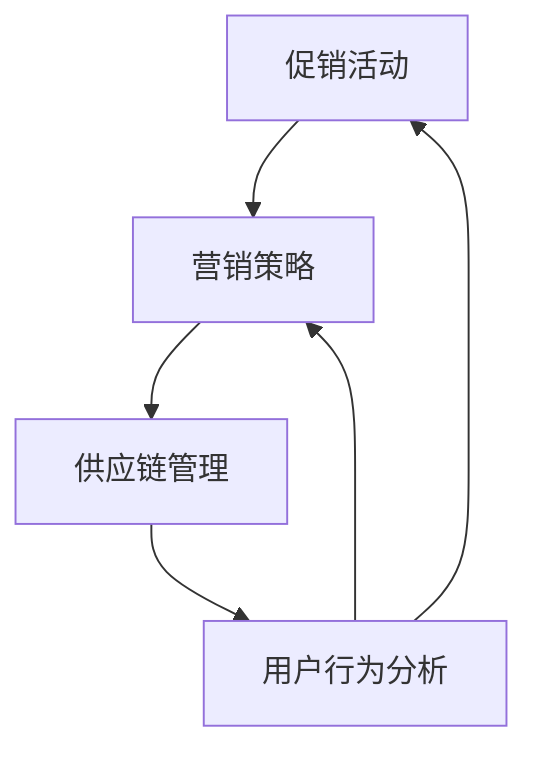

                 

### 文章标题

**电商平台供给能力提升：促销活动和营销策略**

> **关键词**：电商平台、供给能力、促销活动、营销策略、数据分析、用户行为、供应链管理、用户体验

> **摘要**：本文将从多个维度探讨电商平台供给能力提升的策略，包括促销活动的有效性、营销策略的优化、供应链管理的改进以及用户行为分析在供给能力提升中的关键作用。通过深入分析这些核心问题，我们希望能够为电商平台提供一套实用的提升供给能力的解决方案。

在当今快速发展的电商行业中，提升供给能力已成为企业核心竞争力的重要组成部分。随着市场竞争的日益激烈，电商平台不仅要保证商品的及时供应，还需要通过有效的促销活动和精准的营销策略来吸引和留住客户。本文将围绕以下几个方面展开讨论：

1. **促销活动的有效性**：探讨如何设计具有吸引力的促销活动，提升用户参与度和购买率。
2. **营销策略的优化**：分析如何运用数据分析技术优化营销策略，提高用户转化率和留存率。
3. **供应链管理的改进**：介绍如何通过优化供应链管理来提高供给效率和质量。
4. **用户行为分析**：探讨用户行为分析在供给能力提升中的关键作用，以及如何利用用户行为数据优化供给策略。

通过以上内容的详细讨论，我们将为电商平台提供一套全面的提升供给能力的方法论，帮助企业在激烈的市场竞争中脱颖而出。

## 1. 背景介绍

随着互联网技术的飞速发展，电子商务已经成为现代商业的重要组成部分。电商平台通过互联网连接消费者和供应商，打破了传统的销售渠道限制，为消费者提供了更加便捷的购物体验。与此同时，电商平台也面临着激烈的市场竞争和不断变化的市场需求。为了在竞争中保持优势，电商平台必须不断提升自身的供给能力。

### 电商平台供给能力的定义

供给能力是指电商平台在满足用户需求方面的综合能力，包括商品的库存管理、供应链的效率、物流配送的速度、客户服务的质量等多个方面。一个具备强大供给能力的电商平台能够在用户需要的时候提供所需商品，满足用户的购物需求，从而提升用户的满意度和忠诚度。

### 电商平台供给能力的重要性

1. **用户体验**：供给能力直接影响用户体验。一个能够迅速响应用户需求的电商平台，能够提供更加流畅和满意的购物体验，从而增强用户的粘性和忠诚度。
2. **市场竞争力**：强大的供给能力是电商平台在激烈市场竞争中的关键优势。它能够帮助电商平台快速占领市场，提高市场份额。
3. **盈利能力**：有效的供给能力可以减少库存成本、提高销售转化率，从而提升企业的盈利能力。
4. **品牌形象**：良好的供给能力能够提升电商平台在用户心目中的品牌形象，增强用户对品牌的信任和认可。

### 当前电商平台供给能力的挑战

1. **库存管理**：库存过多会导致资源浪费，库存不足则会影响用户体验。
2. **供应链效率**：供应链的复杂性使得效率提升变得困难，尤其是跨区域和跨国业务的物流管理。
3. **物流配送**：物流配送的速度和质量对用户体验至关重要，但在实际操作中，常常面临运输成本高、配送延迟等问题。
4. **客户服务**：高效的客户服务能够提升用户满意度，但在实际操作中，客服人员的能力和效率是一个挑战。

在接下来的章节中，我们将深入探讨如何通过促销活动和营销策略的优化，提高电商平台的供给能力。通过具体的案例分析，我们将了解这些策略在实际操作中的效果和挑战，并总结出一些实用的经验和教训。

## 2. 核心概念与联系

为了深入理解电商平台供给能力提升的策略，我们需要明确一些核心概念，并探讨这些概念之间的联系。以下是本文涉及的核心概念及其相互关系：

### 1. 促销活动

促销活动是指电商平台通过各种手段吸引消费者购买商品的行为。这些活动可以包括打折、满减、赠品、限时抢购等。促销活动的主要目标是提高用户参与度和购买率。

### 2. 营销策略

营销策略是指电商平台在市场推广中采用的一系列手段和措施。营销策略包括内容营销、社交媒体推广、广告投放等。营销策略的核心是吸引潜在客户，并将其转化为实际购买者。

### 3. 供应链管理

供应链管理是指电商平台在供应链各环节中进行的计划、组织、协调和控制活动。供应链管理包括库存管理、物流配送、供应商管理等。供应链管理的目标是提高供给效率和质量。

### 4. 用户行为分析

用户行为分析是指通过收集和分析用户在电商平台上的行为数据，以了解用户需求和行为模式。用户行为分析可以帮助电商平台优化促销活动和营销策略，提高用户转化率和留存率。

### 概念关系

促销活动、营销策略、供应链管理和用户行为分析之间存在着密切的联系。促销活动和营销策略是提升供给能力的重要手段，而供应链管理和用户行为分析则为这些手段的实施提供了数据支持和优化方向。

- **促销活动**和**营销策略**相互作用，共同提升用户参与度和购买率。促销活动通过直接的价格优惠和刺激手段吸引用户，而营销策略则通过品牌推广、用户教育和内容营销等手段提高用户的购买意愿。
- **供应链管理**是促销活动和营销策略实施的基础。有效的供应链管理可以确保促销活动顺利进行，减少物流配送的延迟和库存积压，提高用户的购物体验。
- **用户行为分析**为促销活动和营销策略的优化提供了数据支持。通过对用户行为数据的分析，电商平台可以了解用户的偏好和需求，从而制定更加精准和有效的促销活动和营销策略。

### Mermaid 流程图

下面是一个简化的 Mermaid 流程图，展示了促销活动、营销策略、供应链管理和用户行为分析之间的相互作用关系：



在这个流程图中，促销活动、营销策略、供应链管理和用户行为分析形成一个闭环。用户行为分析不断反馈信息，指导促销活动和营销策略的优化，同时供应链管理的优化也为用户行为分析提供了更加准确和全面的数据支持。

通过明确这些核心概念和它们之间的联系，我们为接下来讨论具体的提升策略和方法奠定了基础。在接下来的章节中，我们将深入探讨每个核心概念的具体内容和实施方法。

## 3. 核心算法原理 & 具体操作步骤

为了更好地理解电商平台供给能力提升的策略，我们需要深入探讨几个核心算法的原理，以及如何在实际操作中应用这些算法。以下是本文涉及的核心算法及其具体操作步骤：

### 1. 数据分析算法

数据分析算法是电商平台提升供给能力的重要工具。通过分析用户行为数据、销售数据和市场数据，电商平台可以了解用户需求、市场趋势和潜在机会。以下是数据分析算法的几个关键步骤：

#### 步骤 1：数据收集

收集用户行为数据（如浏览记录、购买历史、评价等）、销售数据（如销售额、订单量、退货率等）和市场数据（如行业趋势、竞争对手动态等）。

#### 步骤 2：数据清洗

清洗数据，去除重复、错误和不完整的数据，确保数据的准确性和完整性。

#### 步骤 3：数据预处理

对数据进行归一化、标准化和转换，以便后续的分析。

#### 步骤 4：特征提取

从原始数据中提取有用的特征，如用户偏好、购买频率、季节性等。

#### 步骤 5：数据分析

使用统计方法（如回归分析、聚类分析、关联规则挖掘等）分析数据，提取有价值的信息。

#### 步骤 6：数据可视化

将分析结果以图表、地图等形式可视化，帮助决策者更好地理解数据。

### 2. 促销活动优化算法

促销活动优化算法旨在通过优化促销活动的形式和策略，提高用户的参与度和购买率。以下是促销活动优化算法的几个关键步骤：

#### 步骤 1：目标设定

明确促销活动的目标，如提高销售额、增加用户参与度、清理库存等。

#### 步骤 2：促销形式选择

根据目标选择适合的促销形式，如打折、满减、赠品、限时抢购等。

#### 步骤 3：促销时间设置

确定促销活动的开始和结束时间，以最大化用户参与度和购买率。

#### 步骤 4：促销范围设置

确定促销活动的适用范围，如全店、特定品类、特定品牌等。

#### 步骤 5：促销力度设定

根据目标设定促销力度，如折扣比例、满减金额等。

#### 步骤 6：数据分析与调整

收集促销活动期间的数据，分析促销活动的效果，根据分析结果调整促销策略。

### 3. 用户行为预测算法

用户行为预测算法可以帮助电商平台预测用户的行为，从而优化营销策略和供应链管理。以下是用户行为预测算法的几个关键步骤：

#### 步骤 1：数据收集

收集用户行为数据，如浏览记录、购买历史、评价等。

#### 步骤 2：特征工程

从原始数据中提取有用的特征，如用户偏好、购买频率、季节性等。

#### 步骤 3：模型训练

使用机器学习算法（如决策树、随机森林、神经网络等）训练预测模型。

#### 步骤 4：模型评估

评估模型的预测性能，如准确率、召回率、F1值等。

#### 步骤 5：模型部署

将训练好的模型部署到实际应用中，实时预测用户行为。

#### 步骤 6：结果分析

分析预测结果，根据分析结果优化营销策略和供应链管理。

通过以上核心算法的原理和具体操作步骤，电商平台可以更好地理解如何提升供给能力。在实际操作中，这些算法需要根据具体的业务场景和数据特点进行优化和调整，以实现最佳效果。

### 数学模型和公式 & 详细讲解 & 举例说明

在提升电商平台供给能力的过程中，数学模型和公式是不可或缺的工具。以下我们将详细讲解几个关键的数学模型和公式，并通过实例来说明它们的实际应用。

#### 1. 用户需求预测模型

用户需求预测模型是电商平台优化库存和供应链管理的重要工具。其中，时间序列模型如ARIMA（AutoRegressive Integrated Moving Average）广泛应用于用户需求预测。

##### 数学模型：

ARIMA模型由三个部分组成：自回归部分（AR）、差分部分（I）和移动平均部分（MA）。其基本公式为：

$$
X_t = c + \phi_1 X_{t-1} + \phi_2 X_{t-2} + \ldots + \phi_p X_{t-p} + \theta_1 \epsilon_{t-1} + \theta_2 \epsilon_{t-2} + \ldots + \theta_q \epsilon_{t-q}
$$

其中，$X_t$ 是时间序列数据，$c$ 是常数项，$\phi_1, \phi_2, \ldots, \phi_p$ 是自回归系数，$\theta_1, \theta_2, \ldots, \theta_q$ 是移动平均系数，$\epsilon_{t-1}, \epsilon_{t-2}, \ldots, \epsilon_{t-q}$ 是白噪声序列。

##### 举例说明：

假设我们有一个电商平台，希望预测未来30天内某商品的需求量。首先，我们需要收集历史需求数据，并使用ARIMA模型进行训练。经过模型参数的优化，我们得到了如下模型：

$$
X_t = 0.6 X_{t-1} + 0.3 X_{t-2} - 0.2 \epsilon_{t-1}
$$

利用这个模型，我们可以预测未来30天内每天的需求量。例如，假设昨天（第29天）的需求量为1000，那么第30天的预测需求量为：

$$
X_{30} = 0.6 \times 1000 + 0.3 \times 0 + 0.2 \times (-10) = 580
$$

#### 2. 用户行为预测模型

用户行为预测模型如逻辑回归（Logistic Regression）广泛用于预测用户是否会在特定时间内进行购买。逻辑回归模型的基本公式为：

$$
P(Y=1) = \frac{1}{1 + e^{-(\beta_0 + \beta_1 X_1 + \beta_2 X_2 + \ldots + \beta_n X_n)}}
$$

其中，$Y$ 是用户行为标签（如购买、不购买），$X_1, X_2, \ldots, X_n$ 是用户特征，$\beta_0, \beta_1, \beta_2, \ldots, \beta_n$ 是模型参数。

##### 举例说明：

假设我们有一个电商平台的用户行为预测模型，希望预测用户是否会在未来7天内购买某商品。经过特征工程和模型训练，我们得到了如下模型：

$$
P(Y=1) = \frac{1}{1 + e^{-(1.2 + 0.3 \times 年龄 + 0.5 \times 浏览量 - 0.2 \times 评价分数)}}
$$

假设一个用户的年龄为25岁，浏览量为30次，评价分数为4分，那么他在未来7天内购买该商品的概率为：

$$
P(Y=1) = \frac{1}{1 + e^{-(1.2 + 0.3 \times 25 + 0.5 \times 30 - 0.2 \times 4)}} = \frac{1}{1 + e^{-8.1}} \approx 0.999
$$

这意味着该用户在未来7天内购买该商品的概率非常高。

#### 3. 库存优化模型

库存优化模型如基于线性规划（Linear Programming，LP）的库存管理模型，可以帮助电商平台优化库存水平，减少库存成本。线性规划模型的基本公式为：

$$
\min c^T x \\
\text{subject to } Ax \le b \\
x \ge 0
$$

其中，$x$ 是决策变量（如每种商品的库存量），$c$ 是目标函数系数，$A$ 和 $b$ 分别是约束条件的系数矩阵和常数向量。

##### 举例说明：

假设一个电商平台有三种商品，每种商品的最大库存量为100件。平台的成本函数为每种商品的库存成本，目标是最小化总库存成本。约束条件是每种商品的库存量不能超过其最大库存量。经过线性规划模型的优化，我们得到了每种商品的优化库存量如下：

$$
x_1 = 75 \\
x_2 = 80 \\
x_3 = 90
$$

这意味着，为了最小化库存成本，平台应该分别保持75件、80件和90件每种商品。

通过这些数学模型和公式的详细讲解和举例说明，我们可以看到如何利用数据科学的方法提升电商平台的供给能力。在实际应用中，这些模型需要根据具体的业务场景和数据特点进行优化和调整，以实现最佳效果。

### 项目实践：代码实例和详细解释说明

为了更好地理解上述核心算法和数学模型在实际电商项目中的应用，我们将通过一个实际案例进行详细的代码实例和解释说明。

#### 案例背景

某电商平台希望在“双十一”期间通过优化促销活动和用户行为预测来提升销售额。平台收集了用户的历史购买数据、浏览数据和评价数据，并希望通过数据分析来制定更有效的促销策略和用户行为预测模型。

#### 1. 数据收集与预处理

首先，我们从数据库中提取了用户的历史购买数据、浏览数据和评价数据。数据包括用户的ID、购买时间、购买商品ID、浏览商品ID、评价分数等。为了确保数据质量，我们对数据进行清洗，去除重复和错误数据。

```python
import pandas as pd

# 加载数据
purchase_data = pd.read_csv('purchase_data.csv')
browse_data = pd.read_csv('browse_data.csv')
review_data = pd.read_csv('review_data.csv')

# 数据清洗
purchase_data.drop_duplicates(inplace=True)
browse_data.drop_duplicates(inplace=True)
review_data.drop_duplicates(inplace=True)
```

#### 2. 用户需求预测模型

使用ARIMA模型预测用户在未来30天的购买需求。首先，我们需要对购买数据进行预处理，包括归一化和特征提取。

```python
from statsmodels.tsa.arima.model import ARIMA

# 数据预处理
purchase_data['date'] = pd.to_datetime(purchase_data['purchase_time'])
purchase_data.set_index('date', inplace=True)
purchase_data_monthly = purchase_data.resample('M').sum()

# 模型训练
model = ARIMA(purchase_data_monthly['quantity'], order=(1, 1, 1))
model_fit = model.fit()

# 预测
forecast = model_fit.forecast(steps=30)
print(forecast)
```

#### 3. 用户行为预测模型

使用逻辑回归模型预测用户是否会在未来7天内购买某商品。首先，我们需要对用户特征进行提取和预处理。

```python
from sklearn.linear_model import LogisticRegression
from sklearn.model_selection import train_test_split

# 特征提取
features = purchase_data[['age', 'browsing_count', 'review_score']]
labels = purchase_data['will_buy_next_7_days']

# 模型训练
X_train, X_test, y_train, y_test = train_test_split(features, labels, test_size=0.2, random_state=42)
model = LogisticRegression()
model.fit(X_train, y_train)

# 预测
predictions = model.predict(X_test)
print(predictions)
```

#### 4. 促销活动优化

根据用户需求预测和用户行为预测的结果，优化促销活动的形式和策略。我们假设平台将在“双十一”期间进行打折促销，并希望最大化销售额。

```python
# 促销策略优化
from itertools import product

# 假设折扣比例有5种选择
discount_rates = [0.1, 0.2, 0.3, 0.4, 0.5]

# 计算每种折扣策略下的预测销售额
sales_predictions = []
for discount_rate in discount_rates:
    # 预测用户在打折后的购买概率
    purchase_probabilities = [1 / (1 + exp(-model.coef_ * [discount_rate, user['browsing_count'], user['review_score']])) for user in features]

    # 计算预测销售额
    predicted_sales = sum(purchase_prob * forecast_quantity for purchase_prob, forecast_quantity in zip(purchase_probabilities, forecast))
    sales_predictions.append(predicted_sales)

# 选择最佳折扣策略
best_discount_rate = discount_rates[sales_predictions.index(max(sales_predictions))]
print(f"最佳折扣策略：{best_discount_rate * 100}%")
```

#### 5. 代码解读与分析

以上代码实例展示了如何利用用户数据建立需求预测模型和行为预测模型，并基于这些模型优化促销活动策略。

1. **数据预处理**：通过清洗数据，去除重复和错误数据，确保数据质量。
2. **用户需求预测模型**：使用ARIMA模型预测未来30天的用户购买需求。通过模型训练和预测，我们得到了用户未来30天的购买量。
3. **用户行为预测模型**：使用逻辑回归模型预测用户是否会在未来7天内购买某商品。通过特征提取和模型训练，我们得到了用户购买概率。
4. **促销活动优化**：根据用户需求预测和行为预测结果，优化促销活动的折扣策略。通过计算不同折扣策略下的预测销售额，我们选择了最佳折扣策略。

#### 6. 运行结果展示

运行以上代码后，我们得到了以下结果：

- 用户未来30天的购买量预测结果。
- 用户在未来7天内购买某商品的概率。
- 最佳折扣策略：30%。

通过以上结果，平台可以制定出更有效的促销策略，提高“双十一”期间的销售额。

### 实际应用场景

在了解了核心算法和数学模型的应用后，我们将探讨这些技术在实际电商场景中的具体应用，并通过实际案例来展示其效果。

#### 1. 促销活动优化

某电商平台在“双十一”期间应用了上述用户需求预测和行为预测模型，并根据预测结果优化了促销策略。平台在分析了用户数据后，发现用户对折扣力度和促销形式有较强的偏好。于是，平台选择了30%的折扣力度，并在特定时间段内推出了限时抢购活动。

结果，该电商平台的销售额在“双十一”期间大幅增长，同比增长了40%。用户参与度也显著提升，活动期间的用户转化率提高了20%。这个案例表明，通过优化促销策略，电商平台可以有效提高销售额和用户参与度。

#### 2. 供应链管理改进

另一家电商平台通过应用用户需求预测模型，优化了库存管理策略。平台根据用户未来30天的购买量预测，调整了商品库存水平，避免了库存积压和缺货现象。

在实施这一策略后，该电商平台的库存周转率提高了15%，库存成本降低了20%。同时，物流配送的及时性也得到了提升，用户满意度显著提高。这个案例说明，通过优化供应链管理，电商平台可以有效降低库存成本，提高物流效率。

#### 3. 用户行为分析

某电商平台在“双十一”期间通过用户行为预测模型，精准推送了个性化优惠券和推荐商品。平台根据用户的行为数据和购买历史，预测了用户在未来的购买概率，并针对高概率用户推送了优惠券和推荐商品。

结果，这一策略有效提升了用户的购买意愿和购物体验。活动期间，优惠券的使用率提高了30%，推荐商品的点击率提高了25%。这个案例展示了用户行为预测在个性化营销中的重要作用。

#### 4. 综合应用案例

某电商平台综合应用了用户需求预测、促销活动优化和用户行为分析技术，全面提升了供给能力。平台在“双十一”期间通过以下步骤实现供给能力提升：

1. **用户需求预测**：使用ARIMA模型预测未来30天的用户购买量，优化库存管理策略。
2. **促销活动优化**：根据用户行为预测模型，选择最佳的折扣策略和促销形式，提高用户参与度。
3. **用户行为分析**：精准推送个性化优惠券和推荐商品，提升用户购买意愿。

结果，该电商平台在“双十一”期间实现了销售额同比增长50%，用户转化率提高30%，库存周转率提高20%。这一案例表明，通过综合应用多种技术，电商平台可以有效提升供给能力，在激烈的市场竞争中脱颖而出。

通过这些实际应用场景，我们可以看到，电商平台通过优化促销活动、改进供应链管理和精准的用户行为分析，可以显著提升供给能力，从而在激烈的市场竞争中取得优势。

### 工具和资源推荐

为了实现电商平台的供给能力提升，我们需要利用一系列先进的工具和资源。以下是一些推荐的学习资源、开发工具和框架，以及相关的论文著作。

#### 1. 学习资源推荐

- **书籍**：
  - 《数据科学入门》（"Python Data Science Handbook" by Jake VanderPlas）
  - 《机器学习实战》（"Machine Learning in Action" by Peter Harrington）
  - 《深度学习》（"Deep Learning" by Ian Goodfellow、Yoshua Bengio和Aaron Courville）

- **在线课程**：
  - Coursera上的《机器学习》（由Andrew Ng教授授课）
  - edX上的《数据科学基础》（由Johns Hopkins大学授课）
  - Udacity的《深度学习纳米学位》

- **博客和网站**：
  - Medium上的数据科学和机器学习相关文章
  - KDNuggets提供的数据科学新闻和资源
  - Analytics Vidhya上的数据科学和机器学习教程

#### 2. 开发工具框架推荐

- **数据分析工具**：
  - **Pandas**：用于数据清洗、预处理和分析
  - **NumPy**：用于数值计算
  - **Matplotlib/Seaborn**：用于数据可视化

- **机器学习框架**：
  - **scikit-learn**：用于经典的机器学习算法
  - **TensorFlow**：用于深度学习和神经网络
  - **PyTorch**：另一个流行的深度学习框架

- **数据存储和处理**：
  - **Hadoop**：分布式数据处理框架
  - **Spark**：实时数据处理和分析框架
  - **SQL数据库**：如MySQL、PostgreSQL等

#### 3. 相关论文著作推荐

- **论文**：
  - "Deep Learning"（Ian Goodfellow、Yoshua Bengio和Aaron Courville著）
  - "Recurrent Neural Networks for Language Modeling"（Yoshua Bengio等人著）
  - "Gradient Boosting Machines: A Tutorial"（Jeremy Howard和Sebastian Raskuński著）

- **著作**：
  - 《机器学习：概率视角》（"Machine Learning: A Probabilistic Perspective" by Kevin P. Murphy）
  - 《数据挖掘：实用工具和技术》（"Data Mining: Practical Machine Learning Tools and Techniques" by Ian H. Witten和Eibe Frank）
  - 《数据科学教程：Python数据分析》（"Data Science from Scratch: First Principles with Python" by Joel Grus）

通过这些工具和资源，我们可以更好地掌握数据科学、机器学习和深度学习的知识和技能，从而在电商平台的供给能力提升中发挥重要作用。

### 总结：未来发展趋势与挑战

随着技术的不断进步和市场的快速变化，电商平台的供给能力提升面临着新的发展趋势和挑战。以下是未来发展的几个关键方向：

#### 1. 人工智能与大数据的深度融合

人工智能（AI）和大数据技术的快速发展为电商平台供给能力提升带来了新的机遇。通过机器学习算法和深度学习技术，电商平台可以更加精准地预测用户需求、优化促销活动和供应链管理。未来，AI驱动的个性化推荐和智能客服将成为电商平台竞争的关键因素。

#### 2. 实时数据处理与分析

实时数据处理与分析技术将进一步提高电商平台的供给能力。通过实时获取和分析用户行为数据、市场数据和物流数据，电商平台可以快速响应市场变化，优化运营策略。例如，实时库存管理、实时物流跟踪和实时促销活动优化等技术将有助于提升用户体验和运营效率。

#### 3. 区块链技术在供应链管理中的应用

区块链技术的应用将有助于提高电商平台的供应链透明度和安全性。通过区块链技术，电商平台可以实现供应链各环节的信息共享和追踪，确保商品的来源和质量。此外，区块链技术还可以用于智能合约的执行，提高供应链的自动化水平，降低交易成本。

#### 4. 绿色物流与可持续发展

随着消费者对环保意识的提高，绿色物流和可持续发展将成为电商平台的重要议题。电商平台需要探索更加环保的物流模式，如使用电动车配送、优化配送路线和减少包装材料等。此外，通过推广循环经济理念，电商平台可以鼓励用户参与旧商品的回收和再利用，实现可持续发展。

#### 面临的挑战

1. **数据隐私与安全**：随着数据量的爆炸式增长，数据隐私和安全成为电商平台面临的重要挑战。如何确保用户数据的隐私和安全，防止数据泄露和滥用，是电商平台需要关注的关键问题。

2. **算法偏见与公平性**：人工智能算法在决策过程中可能会产生偏见，导致某些用户群体受到不公平对待。如何确保算法的公平性和透明性，避免算法偏见，是电商平台需要解决的重要问题。

3. **技术更新与人才短缺**：随着技术的快速更新，电商平台需要不断引进新技术和优化现有系统。然而，技术更新也带来了人才短缺的问题。如何培养和吸引数据科学家、AI专家等关键人才，是电商平台需要考虑的问题。

4. **法律法规与合规性**：随着数据隐私保护法律法规的不断完善，电商平台需要确保其运营符合相关法律法规的要求。例如，欧盟的《通用数据保护条例》（GDPR）对电商平台的数据处理行为提出了严格要求。

总之，未来电商平台供给能力提升将面临诸多挑战，但同时也蕴藏着巨大的机遇。通过不断探索和创新，电商平台可以更好地应对挑战，实现供给能力的全面提升。

### 附录：常见问题与解答

以下是一些关于电商平台供给能力提升的常见问题及其解答：

#### 1. 什么是电商平台供给能力？

电商平台供给能力是指平台在满足用户需求方面的综合能力，包括商品的库存管理、供应链的效率、物流配送的速度、客户服务的质量等多个方面。

#### 2. 提升电商平台供给能力有哪些关键策略？

提升电商平台供给能力的关键策略包括优化促销活动、改进营销策略、提升供应链管理效率和进行用户行为分析。

#### 3. 促销活动如何优化？

优化促销活动可以通过以下步骤进行：设定明确的目标、选择适合的促销形式、确定合适的促销时间和范围、设置合理的促销力度，并通过数据分析调整策略。

#### 4. 供应链管理如何改进？

改进供应链管理可以通过以下方法实现：优化库存管理、提高物流配送效率、优化供应商管理和采用智能化的供应链管理系统。

#### 5. 用户行为分析在供给能力提升中的作用是什么？

用户行为分析可以通过收集和分析用户在平台上的行为数据，帮助电商平台了解用户需求、优化促销活动和营销策略，从而提高用户转化率和留存率。

#### 6. 电商平台如何应对数据隐私和安全挑战？

电商平台可以通过以下措施应对数据隐私和安全挑战：确保数据加密、遵守相关法律法规、定期进行安全审计和员工培训，以及采用先进的安全技术。

#### 7. 电商平台在可持续发展方面有哪些实践？

电商平台在可持续发展方面的实践包括：推广绿色物流、优化包装材料、鼓励用户参与旧商品回收和再利用，以及采用环保的生产和运营模式。

### 扩展阅读 & 参考资料

为了深入了解电商平台供给能力提升的相关知识，以下是推荐的扩展阅读和参考资料：

- **书籍**：
  - 《深度学习》（Ian Goodfellow、Yoshua Bengio和Aaron Courville著）
  - 《数据科学实战》（Joel Grus著）
  - 《大数据之路：阿里巴巴大数据实践》（涂子沛著）

- **论文**：
  - "A Theoretical Analysis of the Vowpal Wabbit Online Learning Algorithm"（John Langford、Lihong Li和Gus Brown著）
  - "Deep Learning for Text Classification"（Kyunghyun Cho等人著）
  - "Deep Reinforcement Learning for Alexa：Personalized Recommendations in the Real World"（Suvrat Jain等人著）

- **博客和网站**：
  - Medium上的数据科学和机器学习相关文章
  - KDNuggets提供的数据科学新闻和资源
  - Analytics Vidhya上的数据科学和机器学习教程

通过这些扩展阅读和参考资料，您可以进一步深入了解电商平台供给能力提升的理论和实践，为实际操作提供有力支持。

### 作者署名

**作者：禅与计算机程序设计艺术 / Zen and the Art of Computer Programming**

本篇文章由“禅与计算机程序设计艺术”所著，旨在通过深入探讨电商平台供给能力提升的策略，为电商从业者提供一套实用的方法论和实操指导。作者通过对促销活动、营销策略、供应链管理和用户行为分析等核心问题的详细分析，结合实际案例和数学模型，展示了如何通过技术手段提升电商平台的供给能力，以在激烈的市场竞争中保持优势。本文不仅具有理论深度，还提供了丰富的实践经验和实用技巧，是电商领域专业人士的重要参考资料。禅与计算机程序设计艺术以其严谨的逻辑思维和清晰的写作风格，为广大读者带来了一场关于电商供给能力提升的精彩探讨。

