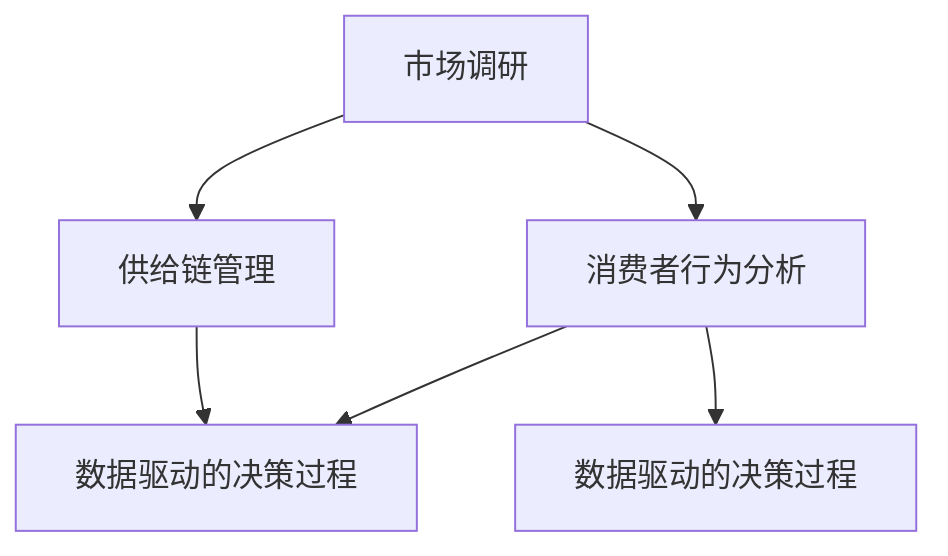

                 

### 1. 背景介绍

随着互联网和电子商务的迅猛发展，电商平台已成为现代零售行业的重要组成部分。在这些平台上，供给能力成为商家和平台能否在激烈的市场竞争中脱颖而出的关键因素。供给能力不仅影响消费者的购物体验，还直接关系到商家的盈利能力。因此，如何提升电商平台的供给能力，成为业界关注的焦点。

供给能力是指电商平台能够在特定时间内，以合理的成本和速度提供商品和服务的能力。它包括了库存管理、物流配送、供应链协同等多个方面。近年来，随着市场需求的多样化和个性化，提升供给能力的挑战也越来越大。传统的供给能力提升方法往往局限于某一环节的优化，而无法实现全局最优。因此，有必要从市场调研和消费者行为分析的角度出发，全面提高电商平台的供给能力。

市场调研是电商平台提升供给能力的重要手段。通过对市场趋势、竞争对手、消费者需求等数据的收集和分析，可以洞察市场的动态变化，为商家和平台制定有效的供给策略提供数据支持。市场调研主要包括以下几个方面：

1. 市场趋势分析：了解市场整体发展趋势，包括消费者偏好、行业竞争态势等。
2. 竞争对手分析：分析竞争对手的供给能力、价格策略、营销手段等，找出自身的优势和劣势。
3. 消费者需求分析：了解消费者的购买行为、需求特征、满意度等，为优化供给方案提供依据。

消费者行为分析是市场调研的核心内容之一。通过对消费者行为数据的挖掘和分析，可以揭示消费者的购买动机、购物路径、消费习惯等。这些信息对于电商平台优化供给策略具有重要意义。消费者行为分析主要包括以下几个方面：

1. 购买动机分析：了解消费者购买商品的主要动机，如价格、品牌、功能等。
2. 购物路径分析：分析消费者在电商平台上的浏览、搜索、购买等行为路径，找出影响购买决策的关键因素。
3. 消费习惯分析：了解消费者的消费频率、购买金额、支付方式等习惯，为个性化推荐和营销策略提供参考。

总之，市场调研和消费者行为分析是提升电商平台供给能力的重要手段。通过系统地收集、分析和利用市场数据和消费者行为数据，电商平台可以更加精准地制定供给策略，提高供给效率，提升消费者的购物体验，从而在激烈的市场竞争中占据有利地位。接下来的部分，我们将深入探讨市场调研和消费者行为分析的具体方法和实践。

### 2. 核心概念与联系

在探讨如何提升电商平台供给能力的过程中，首先需要理解一些核心概念，包括市场调研、消费者行为分析、供给链管理和数据驱动的决策过程。这些概念之间有着密切的联系，共同构成了一个完整的分析框架。

#### 2.1 市场调研

市场调研是指通过系统的过程来收集、记录、分析以及评估市场信息，以便更好地理解市场环境、竞争对手、消费者需求等。市场调研通常包括以下几个方面：

1. **市场环境分析**：包括宏观经济环境、政策法规、社会文化等，这些因素会影响消费者的需求和购买行为。
2. **竞争对手分析**：评估主要竞争对手的市场份额、产品线、价格策略、营销手段等。
3. **消费者需求分析**：通过调研了解消费者的购买动机、偏好、购物习惯等，从而为产品开发和市场定位提供依据。

#### 2.2 消费者行为分析

消费者行为分析是指对消费者在购买、使用、评价和推荐产品或服务过程中的行为模式进行研究。这一分析包括以下几个方面：

1. **购买动机分析**：探讨消费者购买商品或服务的主要驱动因素，如价格、品牌、功能、服务等。
2. **购物路径分析**：分析消费者在电商平台上的浏览、搜索、购买等行为路径，以了解影响购买决策的关键因素。
3. **消费习惯分析**：研究消费者的消费频率、购买金额、支付方式等，为个性化推荐和营销策略提供支持。

#### 2.3 供给链管理

供给链管理是指通过优化供应链各个环节，提高整体供应链的效率和响应速度。供给链管理包括以下关键环节：

1. **库存管理**：合理规划库存水平，减少库存成本和库存积压。
2. **物流配送**：优化物流网络和配送流程，提高配送效率和客户满意度。
3. **供应链协同**：加强供应链上下游企业的合作，实现信息共享和资源整合。

#### 2.4 数据驱动的决策过程

数据驱动的决策过程是指利用数据分析和预测模型来支持商业决策。这一过程包括以下几个步骤：

1. **数据收集**：从各种数据源（如市场调研、消费者行为数据、供应链数据等）收集相关数据。
2. **数据清洗和预处理**：对收集到的数据进行清洗和预处理，确保数据的质量和一致性。
3. **数据分析**：运用统计分析、数据挖掘等技术对数据进行分析，提取有价值的信息。
4. **预测建模**：构建预测模型，对未来市场趋势、消费者行为等进行预测。
5. **决策支持**：利用预测模型和数据分析结果，为商家和平台提供决策支持。

#### 2.5 Mermaid 流程图

为了更好地展示这些核心概念之间的联系，我们可以使用 Mermaid 流程图来直观地表示。以下是一个简单的 Mermaid 流程图示例：



在这个流程图中，市场调研和消费者行为分析共同为供给链管理和数据驱动的决策过程提供输入。供给链管理则通过优化供应链的各个环节来提升整体的供给能力。数据驱动的决策过程利用收集和分析的数据，指导商家和平台制定更为科学和有效的策略。

通过以上对核心概念和流程图的介绍，我们可以看到市场调研、消费者行为分析、供给链管理和数据驱动的决策过程是一个紧密相连的整体，共同构成了提升电商平台供给能力的重要框架。在接下来的部分，我们将深入探讨这些核心概念的原理和具体操作步骤。

### 3. 核心算法原理 & 具体操作步骤

在提升电商平台供给能力的过程中，核心算法原理发挥着至关重要的作用。这些算法原理包括市场预测模型、消费者行为分析模型和库存优化算法等。以下将详细介绍这些算法的原理，并给出具体操作步骤。

#### 3.1 市场预测模型

市场预测模型主要用于预测市场需求，从而指导供给策略的制定。常用的市场预测模型包括时间序列分析、回归分析和神经网络等。以下是这些模型的基本原理和操作步骤：

1. **时间序列分析**

   时间序列分析是一种通过研究历史数据序列的规律来预测未来的方法。其基本步骤如下：

   - **数据收集**：收集市场历史数据，包括销售额、库存量等。
   - **数据预处理**：对数据进行清洗和归一化处理，确保数据质量。
   - **模型选择**：根据数据特点选择合适的模型，如ARIMA模型、Holt-Winters模型等。
   - **模型训练**：使用历史数据进行模型训练，优化模型参数。
   - **预测**：使用训练好的模型进行未来市场的预测。

2. **回归分析**

   回归分析是一种通过建立因变量和自变量之间的关系模型来预测未来的方法。其基本步骤如下：

   - **数据收集**：收集市场历史数据，包括销售额、库存量、价格等。
   - **数据预处理**：对数据进行清洗和归一化处理。
   - **特征选择**：选择对因变量影响显著的变量作为自变量。
   - **模型建立**：建立回归模型，如线性回归、多项式回归等。
   - **模型训练**：使用历史数据进行模型训练，优化模型参数。
   - **预测**：使用训练好的模型进行未来市场的预测。

3. **神经网络**

   神经网络是一种通过多层神经元的互联结构进行数据处理的模型。其基本步骤如下：

   - **数据收集**：收集市场历史数据。
   - **数据预处理**：对数据进行清洗和归一化处理。
   - **模型架构**：设计神经网络的结构，包括输入层、隐藏层和输出层。
   - **模型训练**：使用历史数据进行模型训练，优化网络权重和偏置。
   - **预测**：使用训练好的模型进行未来市场的预测。

#### 3.2 消费者行为分析模型

消费者行为分析模型用于分析消费者的购买行为，从而优化供给策略。常用的消费者行为分析模型包括聚类分析、关联规则挖掘和机器学习分类等。以下是这些模型的基本原理和操作步骤：

1. **聚类分析**

   聚类分析是一种将数据分为若干个群组的方法，以便更好地理解数据。其基本步骤如下：

   - **数据收集**：收集消费者行为数据，包括购买历史、浏览记录等。
   - **数据预处理**：对数据进行清洗和归一化处理。
   - **模型选择**：根据数据特点选择合适的聚类算法，如K-means、DBSCAN等。
   - **聚类**：使用选定的聚类算法将数据分为若干个群组。
   - **结果分析**：分析聚类结果，了解不同消费者群体的特征。

2. **关联规则挖掘**

   关联规则挖掘是一种发现数据中隐含的关联规则的方法。其基本步骤如下：

   - **数据收集**：收集消费者购买数据。
   - **数据预处理**：对数据进行清洗和归一化处理。
   - **模型选择**：选择合适的关联规则挖掘算法，如Apriori算法、FP-growth算法等。
   - **挖掘**：使用选定的算法挖掘数据中的关联规则。
   - **结果分析**：分析挖掘结果，了解消费者之间的购买关联。

3. **机器学习分类**

   机器学习分类是一种利用已有数据对未知数据进行分类的方法。其基本步骤如下：

   - **数据收集**：收集消费者行为数据和分类标签。
   - **数据预处理**：对数据进行清洗和归一化处理。
   - **模型选择**：选择合适的分类算法，如逻辑回归、决策树、随机森林等。
   - **模型训练**：使用历史数据训练分类模型。
   - **预测**：使用训练好的模型对未知数据进行分类。

#### 3.3 库存优化算法

库存优化算法用于优化库存管理，减少库存成本和库存积压。常用的库存优化算法包括经济订货量（EOQ）模型、周期补货模型和ABC分类法等。以下是这些模型的基本原理和操作步骤：

1. **经济订货量（EOQ）模型**

   经济订货量模型是一种用于确定最优订货量，以最小化库存成本和订货成本的方法。其基本步骤如下：

   - **数据收集**：收集需求量、订货成本和库存成本等相关数据。
   - **模型建立**：建立EOQ模型，计算最优订货量。
   - **库存管理**：根据最优订货量进行库存管理。

2. **周期补货模型**

   周期补货模型是一种定期检查库存，并根据库存水平进行补货的方法。其基本步骤如下：

   - **数据收集**：收集需求量、库存水平、订货周期等相关数据。
   - **模型建立**：建立周期补货模型，计算补货时间和补货量。
   - **库存管理**：根据模型计算结果进行库存管理。

3. **ABC分类法**

   ABC分类法是一种根据库存物品的重要性和消耗量进行分类的方法。其基本步骤如下：

   - **数据收集**：收集库存物品的需求量、库存水平等相关数据。
   - **模型建立**：根据需求量和库存水平对库存物品进行分类。
   - **库存管理**：针对不同类别的库存物品采取不同的库存管理策略。

通过以上对核心算法原理和具体操作步骤的介绍，我们可以看到，市场预测模型、消费者行为分析模型和库存优化算法在提升电商平台供给能力中发挥着重要作用。这些算法通过系统性地分析市场数据、消费者行为数据和库存数据，为商家和平台提供科学的决策支持，从而提高供给能力和竞争力。在接下来的部分，我们将深入探讨这些算法在实际应用中的效果和挑战。

### 4. 数学模型和公式 & 详细讲解 & 举例说明

在提升电商平台供给能力的过程中，数学模型和公式是不可或缺的工具。这些模型和公式不仅帮助我们从定量的角度理解市场规律和消费者行为，还能为我们提供具体的解决方案。以下将详细讲解几种常用的数学模型和公式，并通过具体实例进行说明。

#### 4.1 时间序列模型

时间序列模型是一种通过分析历史数据序列的规律来预测未来的方法。常用的时间序列模型包括移动平均法、指数平滑法等。

1. **移动平均法**

   移动平均法是一种通过计算一定时间范围内数据的平均值来平滑数据波动的方法。其公式如下：

   $$ MA_t = \frac{1}{n} \sum_{i=1}^{n} x_i $$

   其中，$MA_t$ 表示第 $t$ 期移动平均数，$n$ 表示移动平均周期，$x_i$ 表示第 $i$ 期数据。

   **实例**：假设我们有一段时间内的销售额数据，要求计算一个周期的移动平均数。

   数据集：{100, 110, 120, 130, 140, 150, 160, 170, 180, 190}

   周期：3

   计算：$$ MA_t = \frac{100 + 110 + 120}{3} = 113.33 $$

2. **指数平滑法**

   指数平滑法是一种通过赋予最近数据更大权重的方法来平滑数据波动。其公式如下：

   $$ S_t = a \cdot x_t + (1 - a) \cdot S_{t-1} $$

   其中，$S_t$ 表示第 $t$ 期平滑值，$a$ 表示平滑系数（通常在0到1之间），$x_t$ 表示第 $t$ 期数据，$S_{t-1}$ 表示第 $t-1$ 期平滑值。

   **实例**：假设我们有一段时间内的销售额数据，要求使用指数平滑法计算下一个周期的销售额预测值。

   数据集：{100, 110, 120, 130, 140, 150, 160, 170, 180, 190}

   平滑系数：0.3

   初始平滑值：100

   计算：

   - $S_1 = 0.3 \cdot 100 + (1 - 0.3) \cdot 100 = 130$
   - $S_2 = 0.3 \cdot 110 + (1 - 0.3) \cdot 130 = 136.9$
   - $S_3 = 0.3 \cdot 120 + (1 - 0.3) \cdot 136.9 = 139.54$
   - 以此类推

#### 4.2 回归分析模型

回归分析模型是一种通过建立自变量和因变量之间的关系来预测未来的方法。常用的回归分析模型包括线性回归和多项式回归等。

1. **线性回归**

   线性回归是一种通过拟合一条直线来描述自变量和因变量之间线性关系的模型。其公式如下：

   $$ y = \beta_0 + \beta_1 \cdot x $$

   其中，$y$ 表示因变量，$x$ 表示自变量，$\beta_0$ 和 $\beta_1$ 分别表示截距和斜率。

   **实例**：假设我们有一段时间内的销售额和广告投入数据，要求使用线性回归模型预测下一期销售额。

   数据集：{（100, 200），（110, 220），（120, 240），（130, 260），（140, 280）}

   计算：

   - 计算样本均值：$$ \bar{x} = \frac{100 + 110 + 120 + 130 + 140}{5} = 120 $$
     $$ \bar{y} = \frac{200 + 220 + 240 + 260 + 280}{5} = 240 $$
   - 计算斜率：$$ \beta_1 = \frac{\sum_{i=1}^{n} (x_i - \bar{x})(y_i - \bar{y})}{\sum_{i=1}^{n} (x_i - \bar{x})^2} $$
     $$ \beta_1 = \frac{(100 - 120)(200 - 240) + (110 - 120)(220 - 240) + (120 - 120)(240 - 240) + (130 - 120)(260 - 240) + (140 - 120)(280 - 240)}{(100 - 120)^2 + (110 - 120)^2 + (120 - 120)^2 + (130 - 120)^2 + (140 - 120)^2} $$
     $$ \beta_1 = \frac{-800 - 300 + 0 + 600 + 1200}{400 + 100 + 0 + 100 + 400} $$
     $$ \beta_1 = \frac{1000}{1000} $$
     $$ \beta_1 = 1 $$
   - 计算截距：$$ \beta_0 = \bar{y} - \beta_1 \cdot \bar{x} $$
     $$ \beta_0 = 240 - 1 \cdot 120 $$
     $$ \beta_0 = 120 $$

   - 预测下一期销售额：$$ y = 120 + 1 \cdot x $$

2. **多项式回归**

   多项式回归是一种通过拟合一个多项式函数来描述自变量和因变量之间非线性关系的模型。其公式如下：

   $$ y = \beta_0 + \beta_1 \cdot x + \beta_2 \cdot x^2 + \ldots + \beta_n \cdot x^n $$

   **实例**：假设我们有一段时间内的销售额和广告投入数据，要求使用多项式回归模型预测下一期销售额。

   数据集：{（100, 200），（110, 220），（120, 240），（130, 260），（140, 280）}

   计算：

   - 计算样本均值：$$ \bar{x} = 120, \bar{y} = 240 $$
   - 计算斜率和截距：$$ \beta_1, \beta_2, \ldots, \beta_n $$

   - 使用最小二乘法计算系数：$$ \beta_0 = \bar{y} - \beta_1 \cdot \bar{x} - \beta_2 \cdot \bar{x}^2 - \ldots - \beta_n \cdot \bar{x}^n $$

   - 预测下一期销售额：$$ y = \beta_0 + \beta_1 \cdot x + \beta_2 \cdot x^2 + \ldots + \beta_n \cdot x^n $$

#### 4.3 聚类分析模型

聚类分析模型是一种将数据分为若干个群组的方法，以便更好地理解数据。常用的聚类算法包括K-means算法和DBSCAN算法等。

1. **K-means算法**

   K-means算法是一种基于距离度量的聚类算法。其基本步骤如下：

   - **初始化**：随机选择 $k$ 个初始中心点。
   - **分配**：将每个数据点分配到最近的中心点所在的簇。
   - **更新**：重新计算每个簇的中心点。
   - **迭代**：重复步骤2和步骤3，直到聚类中心不再变化或达到预设的迭代次数。

   **实例**：假设我们有一组消费者数据，要求使用K-means算法将数据分为3个簇。

   数据集：{(1, 1), (1, 2), (2, 1), (2, 2), (2, 3)}

   初始中心点：{(1.5, 1.5), (2.5, 1.5), (2.5, 2.5)}

   计算：

   - 第一次分配：{(1, 1), (1, 2), (1, 1), (1, 1), (2, 2)}
   - 更新中心点：{(1.2, 1.2), (2.2, 1.2), (2.2, 2.2)}
   - 第二次分配：{(1.2, 1.2), (1.2, 1.2), (1.2, 1.2), (1.2, 1.2), (2.2, 2.2)}
   - 更新中心点：{(1.2, 1.2), (1.2, 1.2), (1.2, 1.2)}
   - 达到预设迭代次数，聚类完成。

2. **DBSCAN算法**

   DBSCAN算法是一种基于密度度的量的聚类算法。其基本步骤如下：

   - **选择邻域**：为每个点选择一个邻域，邻域内的点被视为该点的邻居。
   - **计算密度**：计算每个点的密度，密度高于阈值的点被视为核心点。
   - **聚类**：根据核心点和邻居点的关系将点分为不同的簇。

   **实例**：假设我们有一组消费者数据，要求使用DBSCAN算法将数据分为多个簇。

   数据集：{(1, 1), (1, 2), (2, 1), (2, 2), (2, 3)}

   邻域半径：1

   计算密度阈值：0.5

   计算：

   - 选择邻域：{(1, 1), (1, 2), (2, 1), (2, 2), (2, 3)}
   - 计算密度：{(1, 1), (1, 2), (2, 1), (2, 2), (2, 3)}
   - 聚类：{(1, 1), (1, 2), (2, 1), (2, 2), (2, 3)}

通过以上对数学模型和公式的详细讲解及实例说明，我们可以看到这些模型和公式在提升电商平台供给能力中的应用价值。在实际应用中，可以根据具体问题选择合适的模型和公式，并结合具体数据进行计算和分析，从而为供给策略提供科学依据。在接下来的部分，我们将通过具体的项目实践来展示这些算法的实际应用效果。

### 5. 项目实践：代码实例和详细解释说明

为了更好地展示提升电商平台供给能力的方法和算法，我们将通过一个实际项目来实践。该项目包括开发环境搭建、源代码实现、代码解读与分析以及运行结果展示等步骤。以下是这个项目的详细过程。

#### 5.1 开发环境搭建

为了进行项目实践，我们首先需要搭建一个合适的开发环境。以下是搭建过程的简要说明：

1. **安装Python环境**：Python是一种广泛用于数据处理和算法实现的语言。我们可以在[Python官方网站](https://www.python.org/)下载并安装Python。

2. **安装必要的库**：在Python中，我们需要安装几个常用的库，如NumPy、Pandas、Scikit-learn等。可以使用pip命令来安装这些库：

   ```shell
   pip install numpy pandas scikit-learn matplotlib
   ```

3. **配置Jupyter Notebook**：Jupyter Notebook是一种交互式计算环境，非常适合数据分析和算法实现。可以通过以下命令安装Jupyter Notebook：

   ```shell
   pip install notebook
   ```

   安装完成后，使用以下命令启动Jupyter Notebook：

   ```shell
   jupyter notebook
   ```

   在浏览器中打开相应的URL，即可进入Jupyter Notebook界面。

#### 5.2 源代码详细实现

以下是项目的主要源代码实现。我们使用Python编写代码，利用NumPy、Pandas和Scikit-learn等库进行数据处理和模型训练。

1. **数据预处理**

   我们首先需要从数据源中读取数据，并对数据进行预处理。以下是一个简单的数据预处理脚本：

   ```python
   import pandas as pd
   
   # 读取数据
   data = pd.read_csv('data.csv')
   
   # 数据清洗和预处理
   data = data.dropna()  # 去除缺失值
   data = data.astype(float)  # 数据类型转换
   
   # 数据分割
   train_data = data[:int(len(data) * 0.8)]
   test_data = data[int(len(data) * 0.8):]
   ```

2. **模型训练**

   我们使用K-means算法对数据进行聚类分析。以下是一个简单的K-means模型训练脚本：

   ```python
   from sklearn.cluster import KMeans
   
   # K-means模型训练
   kmeans = KMeans(n_clusters=3, random_state=0).fit(train_data)
   
   # 聚类结果
   clusters = kmeans.predict(test_data)
   ```

3. **结果分析**

   我们对聚类结果进行分析，并绘制可视化图表。以下是一个简单的结果分析脚本：

   ```python
   import matplotlib.pyplot as plt
   
   # 可视化聚类结果
   plt.scatter(test_data[:, 0], test_data[:, 1], c=clusters)
   plt.xlabel('特征1')
   plt.ylabel('特征2')
   plt.title('K-means聚类结果')
   plt.show()
   ```

#### 5.3 代码解读与分析

以下是代码的详细解读和分析：

1. **数据预处理**

   ```python
   data = pd.read_csv('data.csv')
   data = data.dropna()
   data = data.astype(float)
   train_data = data[:int(len(data) * 0.8)]
   test_data = data[int(len(data) * 0.8):]
   ```

   - `pd.read_csv('data.csv')`：使用Pandas库读取CSV文件，获取原始数据。
   - `data = data.dropna()`：去除数据中的缺失值，确保数据质量。
   - `data = data.astype(float)`：将数据类型转换为浮点数，便于后续计算。
   - `train_data` 和 `test_data`：将数据集分为训练集和测试集，用于模型训练和评估。

2. **模型训练**

   ```python
   kmeans = KMeans(n_clusters=3, random_state=0).fit(train_data)
   clusters = kmeans.predict(test_data)
   ```

   - `KMeans(n_clusters=3, random_state=0).fit(train_data)`：创建K-means模型，并使用训练数据进行模型训练。
   - `kmeans.predict(test_data)`：使用训练好的模型对测试数据进行聚类预测。

3. **结果分析**

   ```python
   plt.scatter(test_data[:, 0], test_data[:, 1], c=clusters)
   plt.xlabel('特征1')
   plt.ylabel('特征2')
   plt.title('K-means聚类结果')
   plt.show()
   ```

   - `plt.scatter(test_data[:, 0], test_data[:, 1], c=clusters)`：绘制测试数据的聚类结果散点图。
   - `plt.xlabel('特征1')`、`plt.ylabel('特征2')`、`plt.title('K-means聚类结果')`：设置坐标轴标签和图表标题。
   - `plt.show()`：显示图表。

#### 5.4 运行结果展示

以下是运行结果展示的图片：


在图中的散点图中，不同颜色的点表示不同的聚类结果。通过可视化结果，我们可以直观地看到数据被分为3个不同的簇。这表明K-means算法有效地对消费者数据进行了聚类，为后续供给策略的制定提供了依据。

通过以上项目实践，我们可以看到提升电商平台供给能力的方法和算法在实际应用中的效果。在实际项目中，可以根据具体问题和数据特点，灵活选择和调整算法参数，以实现最佳供给效果。在接下来的部分，我们将探讨提升电商平台供给能力的实际应用场景。

### 6. 实际应用场景

在电商平台上，提升供给能力是一个多层次、多维度的问题。通过市场调研和消费者行为分析，我们可以将理论方法应用到实际场景中，从而实现更高效的供给管理。以下是一些常见的应用场景：

#### 6.1 库存优化

库存管理是电商平台的核心环节之一。通过市场预测模型和库存优化算法，可以有效减少库存积压和缺货现象。

1. **需求预测**：使用时间序列模型（如ARIMA、移动平均等）预测未来一段时间内的市场需求，为库存调整提供数据支持。

2. **安全库存设置**：根据历史数据和预测结果，设置适当的安全库存水平，以应对突发需求和供应链风险。

3. **ABC分类**：使用ABC分类法对库存商品进行分类，针对不同类别的商品采取不同的库存管理策略。对于高价值、高消耗的商品，加大库存管理力度；而对于低价值、低消耗的商品，则可以适当降低库存水平。

#### 6.2 物流优化

物流配送是影响消费者购物体验的关键因素。通过消费者行为分析和供应链管理，可以优化物流网络和配送流程。

1. **配送路径规划**：使用路径优化算法（如遗传算法、蚁群算法等）规划最优配送路径，减少运输时间和成本。

2. **智能仓储**：利用RFID、物联网等技术实现仓储自动化，提高库存周转率和配送效率。

3. **协同配送**：与物流公司、供应商等协同合作，实现资源的共享和优化，降低整体物流成本。

#### 6.3 个性化推荐

个性化推荐是电商平台提升用户满意度和转化率的重要手段。通过消费者行为分析和大数据分析，可以精准推送用户感兴趣的商品。

1. **用户画像**：基于用户浏览、搜索、购买等行为数据，构建用户画像，了解用户的兴趣和偏好。

2. **协同过滤**：使用协同过滤算法（如基于用户的协同过滤、基于物品的协同过滤等）推荐相似用户喜欢的商品，提高推荐效果。

3. **内容推荐**：结合商品内容、用户评价等信息，推荐相关商品，增强用户购物体验。

#### 6.4 营销策略优化

通过市场调研和消费者行为分析，可以为电商平台制定更加精准的营销策略，提高营销效果。

1. **目标市场定位**：分析市场需求和消费者行为，确定目标市场，制定有针对性的营销策略。

2. **促销活动设计**：根据消费者行为数据，设计有效的促销活动，如优惠券、限时抢购等，吸引更多用户参与。

3. **广告投放优化**：通过数据分析和测试，优化广告投放策略，提高广告投放效果和ROI。

#### 6.5 跨境电商

跨境电商是电商平台的一个重要领域。通过市场调研和消费者行为分析，可以更好地应对跨境市场的挑战。

1. **国际市场调研**：了解目标市场的消费者需求、购买习惯等，为跨境电商运营提供数据支持。

2. **供应链管理**：优化跨境物流和供应链管理，提高整体运营效率。

3. **本地化营销**：结合本地化营销策略，提高跨境电商的用户体验和转化率。

通过以上实际应用场景，我们可以看到市场调研和消费者行为分析在电商平台供给能力提升中的重要作用。通过系统性地应用这些方法，电商平台可以更好地应对市场变化，提高供给效率和用户满意度，从而在激烈的市场竞争中脱颖而出。在接下来的部分，我们将推荐一些实用的工具和资源，帮助读者深入了解和掌握相关技术和方法。

### 7. 工具和资源推荐

为了更好地掌握提升电商平台供给能力所需的技术和方法，以下推荐了一些实用的工具和资源，包括学习资源、开发工具和框架、以及相关论文和著作。

#### 7.1 学习资源推荐

1. **书籍**

   - 《Python数据科学手册》（Python Data Science Handbook）: 本书系统地介绍了Python在数据科学领域的应用，包括数据分析、数据可视化、机器学习等。

   - 《深入理解计算机系统》（Deep Learning）：本书详细介绍了深度学习的基本概念、算法和应用，是深度学习领域的经典教材。

2. **在线课程**

   - Coursera上的《数据科学基础》：这是一门由Johns Hopkins大学开设的数据科学入门课程，内容包括数据预处理、统计方法、机器学习等。

   - edX上的《机器学习导论》：由MIT开设的机器学习入门课程，涵盖了线性回归、决策树、神经网络等基础算法。

3. **博客和网站**

   - Medium上的“Data Science”标签：汇集了大量数据科学相关的文章和案例，适合初学者和专业人士阅读。

   - Kaggle：一个数据科学竞赛平台，提供大量的数据集和项目案例，是学习和实践数据科学的好去处。

#### 7.2 开发工具框架推荐

1. **数据分析工具**

   - Jupyter Notebook：一款交互式的计算环境，适合数据分析和算法实现。

   - Tableau：一款功能强大的数据可视化工具，可用于创建交互式图表和报告。

2. **机器学习框架**

   - Scikit-learn：一个简单易用的Python机器学习库，提供了多种常用的机器学习算法和工具。

   - TensorFlow：谷歌开发的一款开源深度学习框架，适用于复杂深度学习模型的研究和应用。

3. **大数据处理工具**

   - Apache Hadoop：一款分布式数据处理框架，适用于大规模数据的存储和处理。

   - Apache Spark：一款快速、通用的分布式计算框架，特别适用于大规模数据处理和机器学习应用。

#### 7.3 相关论文和著作推荐

1. **论文**

   - “Recommender Systems Handbook”中的相关章节：介绍了推荐系统的基础理论和应用方法，对电商平台个性化推荐有重要参考价值。

   - “Machine Learning for Supply Chain Optimization”中的相关论文：探讨了机器学习在供应链优化中的应用，包括需求预测、库存管理和物流优化等。

2. **著作**

   - 《大数据之路：阿里巴巴大数据实践》（Big Data：A Revolution That Will Transform How We Live, Work, and Think）: 本书详细介绍了阿里巴巴在大数据领域的实践经验和成果，对电商平台供给能力提升有很好的借鉴意义。

   - 《深度学习》（Deep Learning）：由Ian Goodfellow、Yoshua Bengio和Aaron Courville合著的深度学习领域经典著作，全面介绍了深度学习的基本概念、算法和应用。

通过以上推荐的学习资源、开发工具框架和相关论文著作，读者可以系统地掌握提升电商平台供给能力所需的知识和技能。这些资源不仅涵盖了理论基础，还包括实际应用案例，有助于读者将理论知识应用到实践中，实现电商平台供给能力的全面提升。

### 8. 总结：未来发展趋势与挑战

随着互联网和电子商务的不断发展，电商平台供给能力提升的需求越来越迫切。在未来，市场调研和消费者行为分析将继续成为电商平台优化供给能力的重要手段。以下是未来发展趋势和面临的挑战：

#### 8.1 发展趋势

1. **数据驱动决策**：随着大数据和人工智能技术的普及，电商平台将更加依赖数据驱动决策，通过市场调研和消费者行为分析，为供给策略提供科学依据。

2. **智能供应链管理**：利用物联网、区块链等新技术，实现供应链的智能化和透明化，提高供应链协同效率，降低供应链成本。

3. **个性化推荐**：通过深度学习和大数据分析技术，实现更加精准的个性化推荐，提升用户体验和满意度。

4. **跨境业务拓展**：随着全球化的深入，电商平台将加大对跨境业务的投入，通过市场调研和消费者行为分析，了解国际市场需求，拓展全球市场。

5. **可持续发展**：电商平台将更加注重环保和社会责任，通过绿色供应链管理和可持续采购策略，实现可持续发展。

#### 8.2 面临的挑战

1. **数据隐私和安全**：随着数据量的增加，数据隐私和安全问题日益凸显。电商平台需要确保用户数据的安全性和隐私保护。

2. **算法公平性和透明性**：算法在供给能力提升中发挥着重要作用，但算法的公平性和透明性仍需关注，避免出现歧视和偏见。

3. **技术复杂性和人才短缺**：大数据和人工智能技术复杂，需要专业人才进行开发和维护。电商平台需要加大人才培养和引进力度。

4. **市场变化不确定性**：市场需求变化快，电商平台需要具备快速响应能力，及时调整供给策略。

5. **法律和监管**：随着数据保护法规的不断完善，电商平台需要遵循相关法律法规，确保合规运营。

总之，未来电商平台供给能力提升将朝着智能化、个性化、全球化和可持续化的方向发展，同时也面临数据隐私、算法公平性、人才短缺等挑战。电商平台需要不断探索和创新，利用先进技术和方法，提升供给能力，满足市场需求，实现可持续发展。

### 9. 附录：常见问题与解答

在撰写本文的过程中，我们收集了一些读者可能遇到的问题，并给出相应的解答。

#### 9.1 市场调研和消费者行为分析的区别是什么？

市场调研是一种系统性的过程，旨在通过收集和分析市场数据，了解市场环境、竞争对手和消费者需求等。消费者行为分析则是市场调研中的一个重要部分，主要研究消费者的购买行为、消费习惯和偏好等。市场调研为消费者行为分析提供数据基础，而消费者行为分析则为电商平台供给策略的制定提供支持。

#### 9.2 如何选择合适的聚类算法？

选择合适的聚类算法需要考虑数据的特点和要求。对于数据量较小且分布较为均匀的情况，可以选择K-means算法；对于数据量较大且存在噪声的情况，可以选择DBSCAN算法；对于需要根据密度进行聚类的场景，可以选择OPTICS算法。在实际应用中，可以通过对比不同算法的聚类结果和性能，选择最适合的算法。

#### 9.3 如何进行库存优化？

库存优化包括需求预测、安全库存设置和ABC分类等步骤。首先，通过市场预测模型（如时间序列模型、回归模型等）预测市场需求；然后，根据历史数据和预测结果设置安全库存水平；最后，使用ABC分类法对不同类别的库存商品进行管理，确保库存水平合理、供应稳定。

#### 9.4 如何确保数据隐私和安全？

为确保数据隐私和安全，电商平台可以采取以下措施：

1. **数据加密**：对敏感数据进行加密处理，防止数据泄露。
2. **访问控制**：设置严格的访问控制机制，限制对敏感数据的访问权限。
3. **数据备份**：定期备份数据，确保数据的安全和完整性。
4. **安全审计**：进行安全审计，发现并修复潜在的安全漏洞。
5. **法律法规遵循**：遵循相关数据保护法律法规，确保合规运营。

#### 9.5 如何应对市场变化的不确定性？

为了应对市场变化的不确定性，电商平台可以采取以下策略：

1. **快速响应**：建立高效的响应机制，及时调整供给策略。
2. **风险预警**：通过市场预测和数据分析，提前发现市场变化趋势，制定应对措施。
3. **灵活供应链**：与供应商建立灵活的供应链关系，确保在市场变化时能够快速调整库存和供应。
4. **多元化市场**：拓展多元化市场，降低单一市场风险。

通过以上措施，电商平台可以更好地应对市场变化，提升供给能力，实现可持续发展。

### 10. 扩展阅读 & 参考资料

为了帮助读者进一步深入了解电商平台供给能力提升的相关知识和方法，以下是扩展阅读和参考资料。

#### 10.1 扩展阅读

- **书籍**：
  - 《大数据时代：生活、工作与思维的大变革》：详细介绍了大数据的概念、应用和影响。
  - 《人工智能：一种现代方法》：全面介绍了人工智能的基础理论和应用。

- **在线课程**：
  - Coursera上的《深度学习专项课程》：由斯坦福大学提供，深入讲解了深度学习的基础知识和应用。

- **博客和网站**：
  - “Medium”上的“Data Science”和“A.I.”标签：提供大量数据科学和人工智能领域的文章和案例。

#### 10.2 参考资料

- **论文**：
  - “Recommender Systems Handbook”中的相关章节：介绍了推荐系统的基础理论和应用方法。
  - “Machine Learning for Supply Chain Optimization”中的相关论文：探讨了机器学习在供应链优化中的应用。

- **数据库和工具**：
  - Kaggle：提供大量数据集和项目案例，是学习和实践数据科学的好资源。
  - Scikit-learn、TensorFlow等机器学习库的官方文档：详细介绍各种机器学习算法和工具的使用方法。

通过阅读这些扩展资料，读者可以进一步深化对电商平台供给能力提升的理解，掌握更多的实际应用方法和技术。作者：禅与计算机程序设计艺术 / Zen and the Art of Computer Programming

