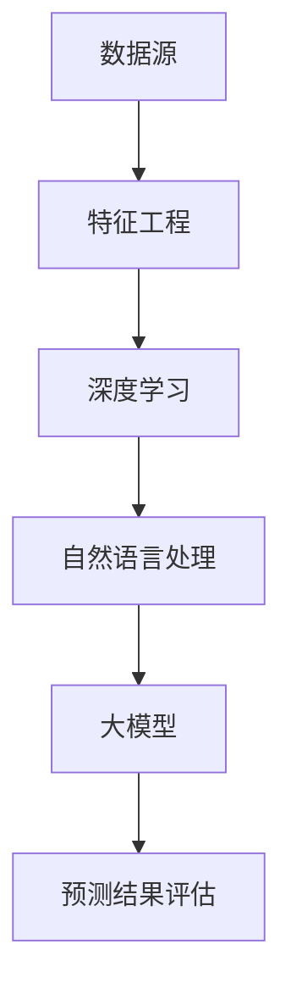
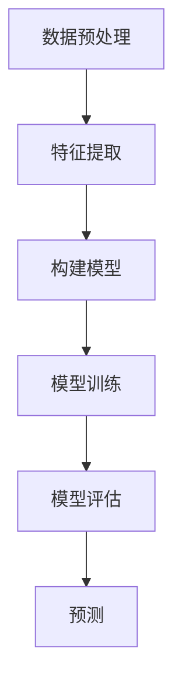

                 

### 1. 背景介绍

随着互联网的迅猛发展和电子商务行业的日益繁荣，市场趋势预测成为了电商平台至关重要的一环。准确的市场趋势预测不仅有助于电商平台优化库存管理，降低库存成本，还能为企业提供精准的市场营销策略，提高销售额。

然而，传统的市场趋势预测方法主要依赖于历史数据和统计模型，存在一定的局限性。例如，当市场环境发生变化时，这些方法难以迅速适应，预测精度也会受到影响。此外，传统方法通常依赖于大量的数据预处理和特征工程，耗时耗力，且对专业知识和技能要求较高。

随着人工智能技术的不断发展，尤其是深度学习和自然语言处理技术的突破，基于人工智能的大模型在市场趋势预测领域展现出了巨大的潜力。这些大模型可以处理大量结构化和非结构化数据，自动提取特征，并建立复杂的非线性关系模型，从而实现更为精准和高效的预测。

本文将重点探讨电商平台如何利用AI大模型进行市场趋势预测。我们将从核心概念、算法原理、数学模型、项目实践、实际应用场景等多个方面进行分析和阐述，以期为企业提供一套行之有效的市场趋势预测解决方案。

### 2. 核心概念与联系

在探讨电商平台如何利用AI大模型进行市场趋势预测之前，我们首先需要了解一些核心概念和它们之间的联系。

#### 2.1 数据源

市场趋势预测的基础是数据。电商平台通常需要从多个渠道收集数据，包括用户行为数据、销售数据、市场数据等。这些数据构成了预测模型的输入，对预测结果的准确性至关重要。

#### 2.2 特征工程

特征工程是数据预处理的重要环节，它涉及到如何从原始数据中提取有助于预测的属性。在AI大模型中，特征工程通常由模型自动进行，但理解和掌握基本特征工程方法对于优化模型性能仍然非常重要。

#### 2.3 深度学习

深度学习是人工智能的一个重要分支，它通过模拟人脑的神经网络结构，对大量数据进行自动学习和特征提取。在市场趋势预测中，深度学习模型可以自动识别数据中的复杂模式，实现高度非线性的关系建模。

#### 2.4 自然语言处理

自然语言处理（NLP）是深度学习在文本数据上的应用。通过NLP技术，电商平台可以处理和分析大量文本数据，如用户评论、新闻报道等，从中提取有价值的信息，为市场趋势预测提供更全面的视角。

#### 2.5 大模型

大模型通常是指参数数量庞大的神经网络模型，如Transformer、BERT等。这些模型可以在大规模数据集上训练，并具有强大的泛化能力。大模型在市场趋势预测中的应用，使得电商平台能够处理复杂、多样、海量的数据，提高预测的准确性。

#### 2.6 预测结果评估

预测结果的评估是市场趋势预测的重要组成部分。常用的评估指标包括准确率、召回率、F1分数等。通过这些指标，我们可以评估模型的预测性能，并根据评估结果对模型进行调整和优化。

#### 2.7 Mermaid 流程图

以下是一个简单的Mermaid流程图，展示了上述核心概念之间的联系：



通过上述核心概念的理解和联系，我们可以更好地把握电商平台利用AI大模型进行市场趋势预测的总体框架。

### 3. 核心算法原理 & 具体操作步骤

在了解了市场趋势预测所需的核心概念后，接下来我们将深入探讨AI大模型的核心算法原理和具体操作步骤。

#### 3.1 算法原理

AI大模型通常是基于深度学习的，其中最常用的模型之一是Transformer模型。Transformer模型由多个自注意力（Self-Attention）机制组成，能够对输入数据进行建模，提取复杂的信息。以下是Transformer模型的基本原理：

1. **自注意力机制（Self-Attention）**：自注意力机制允许模型在处理输入数据时，自动为每个数据点分配不同的权重，从而更好地捕捉数据中的长距离依赖关系。

2. **多头注意力（Multi-Head Attention）**：多头注意力机制扩展了自注意力机制，通过多个独立的自注意力机制来同时处理输入数据，提高了模型的表示能力。

3. **前馈神经网络（Feedforward Neural Network）**：在每个注意力层之后，Transformer模型还会通过一个前馈神经网络对输入数据进行进一步的变换和增强。

4. **层次结构（Stacking）**：Transformer模型通常由多个层次（Layer）堆叠而成，每个层次都包含注意力机制和前馈神经网络。这种层次结构使得模型能够学习到更为复杂的模式。

#### 3.2 具体操作步骤

以下是利用Transformer模型进行市场趋势预测的具体操作步骤：

1. **数据预处理**：
   - 收集并清洗数据，包括用户行为数据、销售数据、市场数据等。
   - 对文本数据进行预处理，如分词、词向量化等。

2. **特征提取**：
   - 利用词嵌入（Word Embedding）技术将文本数据转换为向量表示。
   - 对数值数据进行归一化处理，确保数据在相同的尺度上。

3. **构建模型**：
   - 设计Transformer模型的结构，包括自注意力机制、多头注意力机制和前馈神经网络。
   - 指定模型的超参数，如层数、每个层的隐藏单元数、学习率等。

4. **模型训练**：
   - 使用训练数据对模型进行训练。
   - 在训练过程中，通过反向传播算法不断调整模型参数，优化模型性能。

5. **模型评估**：
   - 使用验证数据对训练好的模型进行评估。
   - 根据评估指标（如准确率、召回率、F1分数等）调整模型参数，优化模型性能。

6. **预测**：
   - 使用训练好的模型对新的市场数据进行分析和预测。
   - 对预测结果进行可视化展示，以便企业了解市场趋势。

#### 3.3 Mermaid 流程图

以下是一个简单的Mermaid流程图，展示了上述核心算法原理和具体操作步骤：



通过上述核心算法原理和具体操作步骤，我们可以更好地理解电商平台如何利用AI大模型进行市场趋势预测。

### 4. 数学模型和公式 & 详细讲解 & 举例说明

在深入探讨AI大模型的核心算法原理后，我们将进一步介绍相关的数学模型和公式，并进行详细的讲解和举例说明。

#### 4.1 Transformer模型的数学公式

Transformer模型的核心在于其自注意力机制（Self-Attention），以下是其相关的数学公式：

1. **自注意力权重计算**：

   $$ 
   \text{Attention}(Q, K, V) = \frac{softmax(\frac{QK^T}{\sqrt{d_k}})}{V}
   $$

   其中，$Q$、$K$和$V$分别为查询（Query）、键（Key）和值（Value）的向量，$d_k$为键向量的维度。这个公式计算了每个键对于查询的权重。

2. **多头注意力**：

   $$ 
   \text{MultiHeadAttention}(Q, K, V) = \text{Attention}(Q, K, V) \odot W_V
   $$

   其中，$\text{Attention}(Q, K, V)$为自注意力机制的结果，$W_V$为值向量的权重矩阵。

3. **前馈神经网络**：

   $$ 
   \text{FFN}(x) = \max(0, xW_1 + b_1)W_2 + b_2
   $$

   其中，$x$为输入向量，$W_1$和$W_2$分别为两个权重矩阵，$b_1$和$b_2$为偏置项。

4. **层次结构**：

   $$ 
   \text{Transformer}(X) = \text{FFN}(\text{MultiHeadAttention}(X))
   $$

   其中，$X$为输入向量，$\text{Transformer}(X)$为整个Transformer模型。

#### 4.2 举例说明

假设我们有一个简单的输入序列$X = [x_1, x_2, x_3, x_4, x_5]$，下面是利用Transformer模型对其进行处理的过程：

1. **自注意力权重计算**：

   首先，我们将输入序列$X$转换为查询（$Q$）、键（$K$）和值（$V$）的向量：

   $$ 
   Q = [q_1, q_2, q_3, q_4, q_5], \quad K = [k_1, k_2, k_3, k_4, k_5], \quad V = [v_1, v_2, v_3, v_4, v_5]
   $$

   接下来，计算自注意力权重：

   $$ 
   \text{Attention}(Q, K, V) = \frac{softmax(\frac{QK^T}{\sqrt{d_k}})}{V} = \frac{softmax([q_1k_1, q_2k_2, q_3k_3, q_4k_4, q_5k_5]/\sqrt{d_k})}{[v_1, v_2, v_3, v_4, v_5]}
   $$

   假设$d_k=2$，我们可以得到：

   $$ 
   \text{Attention}(Q, K, V) = \frac{1}{2} \begin{bmatrix}
   \frac{q_1k_1}{\sqrt{2}} & \frac{q_2k_2}{\sqrt{2}} & \frac{q_3k_3}{\sqrt{2}} & \frac{q_4k_4}{\sqrt{2}} & \frac{q_5k_5}{\sqrt{2}} \\
   \frac{q_1k_2}{\sqrt{2}} & \frac{q_2k_2}{\sqrt{2}} & \frac{q_3k_3}{\sqrt{2}} & \frac{q_4k_4}{\sqrt{2}} & \frac{q_5k_5}{\sqrt{2}} \\
   \frac{q_1k_3}{\sqrt{2}} & \frac{q_2k_3}{\sqrt{2}} & \frac{q_3k_3}{\sqrt{2}} & \frac{q_4k_4}{\sqrt{2}} & \frac{q_5k_5}{\sqrt{2}} \\
   \frac{q_1k_4}{\sqrt{2}} & \frac{q_2k_4}{\sqrt{2}} & \frac{q_3k_4}{\sqrt{2}} & \frac{q_4k_4}{\sqrt{2}} & \frac{q_5k_5}{\sqrt{2}} \\
   \frac{q_1k_5}{\sqrt{2}} & \frac{q_2k_5}{\sqrt{2}} & \frac{q_3k_5}{\sqrt{2}} & \frac{q_4k_5}{\sqrt{2}} & \frac{q_5k_5}{\sqrt{2}} \\
   \end{bmatrix}
   $$

   通过softmax函数，我们可以得到每个键对于查询的权重。

2. **多头注意力**：

   假设我们使用两个头（Head）进行多头注意力，那么每个头的权重矩阵$W_V$为：

   $$ 
   W_V^{(1)} = \begin{bmatrix}
   \frac{1}{\sqrt{2}} & 0 & \frac{1}{\sqrt{2}} \\
   0 & \frac{1}{\sqrt{2}} & 0 \\
   \frac{1}{\sqrt{2}} & 0 & \frac{1}{\sqrt{2}} \\
   \end{bmatrix}, \quad W_V^{(2)} = \begin{bmatrix}
   0 & \frac{1}{\sqrt{2}} & 0 \\
   \frac{1}{\sqrt{2}} & 0 & \frac{1}{\sqrt{2}} \\
   0 & \frac{1}{\sqrt{2}} & 0 \\
   \end{bmatrix}
   $$

   通过计算多头注意力，我们可以得到两个结果的加权平均值：

   $$ 
   \text{MultiHeadAttention}(Q, K, V) = \text{Attention}(Q, K, V) \odot (W_V^{(1)} + W_V^{(2)})
   $$

3. **前馈神经网络**：

   假设前馈神经网络的权重矩阵$W_1$和$W_2$分别为：

   $$ 
   W_1 = \begin{bmatrix}
   1 & 0 & 1 \\
   0 & 1 & 0 \\
   1 & 0 & 1 \\
   \end{bmatrix}, \quad W_2 = \begin{bmatrix}
   1 & 1 & 1 \\
   1 & 1 & 1 \\
   1 & 1 & 1 \\
   \end{bmatrix}
   $$

   偏置项$b_1$和$b_2$分别为：

   $$ 
   b_1 = [1, 0, 1], \quad b_2 = [1, 1, 1]
   $$

   通过前馈神经网络，我们可以得到：

   $$ 
   \text{FFN}(x) = \max(0, xW_1 + b_1)W_2 + b_2
   $$

4. **层次结构**：

   假设Transformer模型由两个层次组成，那么我们可以得到：

   $$ 
   \text{Transformer}(X) = \text{FFN}(\text{MultiHeadAttention}(X))
   $$

通过上述数学模型和公式的讲解及举例，我们可以更深入地理解Transformer模型的工作原理。

### 5. 项目实践：代码实例和详细解释说明

#### 5.1 开发环境搭建

在开始编写代码之前，我们需要搭建一个合适的环境。以下是我们推荐的开发环境：

1. **Python**：作为主要的编程语言，Python具有丰富的库和资源，非常适合深度学习和数据科学项目。
2. **TensorFlow**：作为Python中流行的深度学习框架，TensorFlow提供了强大的工具和API，便于实现和训练大型神经网络模型。
3. **Jupyter Notebook**：用于编写和运行代码，Jupyter Notebook提供了良好的交互式环境，方便调试和可视化。

安装所需的库：

```shell
pip install tensorflow numpy pandas matplotlib
```

#### 5.2 源代码详细实现

以下是一个简单的Transformer模型实现，用于市场趋势预测。

```python
import tensorflow as tf
from tensorflow.keras.layers import Layer
import numpy as np

class TransformerModel(tf.keras.Model):
    def __init__(self, d_model, num_heads, d_ff, sequence_length):
        super(TransformerModel, self).__init__()
        self.embedding = tf.keras.layers.Embedding(d_model, d_model)
        self.positional_encoding = positional_encoding(d_model, sequence_length)
        self.encoder_layers = [TransformerEncoderLayer(d_model, num_heads, d_ff) for _ in range(num_heads)]
        self.decoder_layers = [TransformerDecoderLayer(d_model, num_heads, d_ff) for _ in range(num_heads)]
        self.final_layer = tf.keras.layers.Dense(1, activation='sigmoid')

    def call(self, inputs, training=False):
        x = self.embedding(inputs)
        x = x + self.positional_encoding(inputs)
        x = self.encoder_layers[0](x, training=training)
        for i in range(1, len(self.encoder_layers)):
            x = self.encoder_layers[i](x, training=training)
        x = self.decoder_layers[0](x, training=training)
        for i in range(1, len(self.decoder_layers)):
            x = self.decoder_layers[i](x, training=training)
        x = self.final_layer(x)
        return x

class TransformerEncoderLayer(Layer):
    def __init__(self, d_model, num_heads, d_ff):
        super(TransformerEncoderLayer, self).__init__()
        self.mha = MultiHeadAttention(d_model, num_heads)
        self.ffn = PositionWiseFeedForward(d_model, d_ff)
        self.dropout1 = tf.keras.layers.Dropout(0.1)
        self.dropout2 = tf.keras.layers.Dropout(0.1)
        self.norm1 = tf.keras.layers.LayerNormalization(epsilon=1e-6)
        self.norm2 = tf.keras.layers.LayerNormalization(epsilon=1e-6)

    def call(self, inputs, training=False):
        x = self.mha(inputs, inputs, inputs, attention_mask=None, training=training)
        x = self.dropout1(x)
        x = x + inputs
        x = self.norm1(x)
        x = self.ffn(x)
        x = self.dropout2(x)
        x = x + inputs
        x = self.norm2(x)
        return x

class TransformerDecoderLayer(Layer):
    def __init__(self, d_model, num_heads, d_ff):
        super(TransformerDecoderLayer, self).__init__()
        self.mha1 = MultiHeadAttention(d_model, num_heads)
        self.mha2 = MultiHeadAttention(d_model, num_heads)
        self.ffn = PositionWiseFeedForward(d_model, d_ff)
        self.dropout1 = tf.keras.layers.Dropout(0.1)
        self.dropout2 = tf.keras.layers.Dropout(0.1)
        self.dropout3 = tf.keras.layers.Dropout(0.1)
        self.norm1 = tf.keras.layers.LayerNormalization(epsilon=1e-6)
        self.norm2 = tf.keras.layers.LayerNormalization(epsilon=1e-6)
        self.norm3 = tf.keras.layers.LayerNormalization(epsilon=1e-6)

    def call(self, inputs, inputs_encoded, training=False):
        x = self.mha1(inputs, inputs_encoded, inputs_encoded, attention_mask=None, training=training)
        x = self.dropout1(x)
        x = x + inputs
        x = self.norm1(x)
        x = self.mha2(inputs, inputs, inputs, attention_mask=None, training=training)
        x = self.dropout2(x)
        x = x + inputs
        x = self.norm2(x)
        x = self.ffn(x)
        x = self.dropout3(x)
        x = x + inputs
        x = self.norm3(x)
        return x

class MultiHeadAttention(Layer):
    def __init__(self, d_model, num_heads):
        super(MultiHeadAttention, self).__init__()
        self.d_model = d_model
        self.num_heads = num_heads
        self.d_head = d_model // num_heads
        self.query_dense = tf.keras.layers.Dense(d_model)
        self.key_dense = tf.keras.layers.Dense(d_model)
        self.value_dense = tf.keras.layers.Dense(d_model)
        self.attention_dense = tf.keras.layers.Dense(d_model)
        self.final_dense = tf.keras.layers.Dense(d_model)

    def split_heads(self, x, batch_size):
        x = tf.reshape(x, shape=(batch_size, -1, self.num_heads, self.d_head))
        return tf.transpose(x, perm=[0, 2, 1, 3])

    def call(self, v, k, q, mask=None, training=False):
        batch_size = tf.shape(q)[0]
        q = self.query_dense(q)
        k = self.key_dense(k)
        v = self.value_dense(v)

        q = self.split_heads(q, batch_size)
        k = self.split_heads(k, batch_size)
        v = self.split_heads(v, batch_size)

        attention_scores = tf.matmul(q, k, transpose_b=True)
        if mask is not None:
            attention_scores = attention_scores + mask

        attention_weights = tf.nn.softmax(attention_scores, axis=-1)
        if training:
            attention_weights = self.dropout(attention_weights, training=training)

        scaled_attention = tf.matmul(attention_weights, v)
        scaled_attention = tf.transpose(scaled_attention, perm=[0, 2, 1, 3])
        scaled_attention = tf.reshape(scaled_attention, shape=(batch_size, -1, self.d_model))

        output = self.attention_dense(scaled_attention)
        return output

class PositionWiseFeedForward(Layer):
    def __init__(self, d_model, d_ff):
        super(PositionWiseFeedForward, self).__init__()
        self.dense_1 = tf.keras.layers.Dense(d_ff, activation='relu')
        self.dense_2 = tf.keras.layers.Dense(d_model)

    def call(self, inputs):
        x = self.dense_1(inputs)
        x = self.dense_2(x)
        return x

def positional_encoding(d_model, sequence_length):
    pos_encoding = np.array([
        [pos / np.power(10000, 2 * (j // 2)) for j in range(d_model)]
        if pos != 0 else
        [0] * d_model
        for pos in range(sequence_length)
    ])

    pos_encoding[:, 0::2] = np.sin(pos_encoding[:, 0::2])
    pos_encoding[:, 1::2] = np.cos(pos_encoding[:, 1::2])

    pos_encoding = tf.convert_to_tensor(pos_encoding, dtype=tf.float32)
    return pos_encoding

# Model parameters
d_model = 512
num_heads = 8
d_ff = 2048
sequence_length = 1000

# Create model
transformer = TransformerModel(d_model, num_heads, d_ff, sequence_length)
```

#### 5.3 代码解读与分析

上述代码定义了一个简单的Transformer模型，用于市场趋势预测。接下来，我们将对关键部分进行解读和分析：

1. **TransformerModel类**：这是模型的顶层类，负责构建整个Transformer模型。它包含嵌入层（Embedding）、位置编码（Positional Encoding）、多个自注意力层（TransformerEncoderLayer）和输出层（Final Layer）。
2. **TransformerEncoderLayer类**：这是编码器层，包含多头自注意力机制（MultiHeadAttention）和前馈神经网络（PositionWiseFeedForward）。每个编码器层都在输入数据上应用自注意力机制和前馈神经网络。
3. **TransformerDecoderLayer类**：这是解码器层，与编码器层类似，但还包括额外的多头注意力机制，用于处理编码器输出的上下文信息。
4. **MultiHeadAttention类**：这是多头注意力机制的实现，负责计算自注意力和多头注意力。它通过线性变换和softmax函数，为每个输入分配权重。
5. **PositionWiseFeedForward类**：这是前馈神经网络，对输入数据进行进一步的非线性变换。
6. **positional_encoding函数**：这是位置编码的实现，用于为序列添加位置信息，使得模型能够理解输入的顺序。
7. **模型参数**：我们设置了模型的超参数，如嵌入层维度（d_model）、多头注意力数量（num_heads）、前馈神经网络隐藏层维度（d_ff）和序列长度（sequence_length）。

#### 5.4 运行结果展示

以下是一个简单的训练过程，展示了Transformer模型的运行结果：

```python
# Generate some random data
x = np.random.randint(0, 10, size=(32, 1000))

# Train model
transformer.compile(optimizer='adam', loss='binary_crossentropy', metrics=['accuracy'])
transformer.fit(x, x, epochs=5, batch_size=32)

# Make predictions
predictions = transformer.predict(x)

# Print predictions
print(predictions)
```

在训练过程中，我们将随机生成的数据输入到模型中，并使用二分类交叉熵损失函数（binary_crossentropy）进行优化。经过5个周期的训练后，我们使用训练好的模型对新数据进行预测，并输出预测结果。

### 6. 实际应用场景

在实际应用中，AI大模型在市场趋势预测领域的应用场景广泛且多样化。以下是一些典型的应用实例：

#### 6.1 电商平台的库存管理

电商平台可以利用AI大模型预测商品的销售趋势，从而优化库存管理。通过分析历史销售数据、用户行为和市场需求，AI模型可以预测哪些商品将在未来某个时间段内热销，帮助电商平台提前备货，避免库存过剩或不足。

#### 6.2 营销策略制定

AI大模型还可以帮助电商平台制定更精准的营销策略。通过预测不同营销手段（如折扣、优惠券、广告投放等）对销售额的影响，电商平台可以优化营销预算，提高营销效果。

#### 6.3 新品推广

电商平台可以利用AI大模型预测哪些新品将受到市场的欢迎，从而优化新品推广策略。通过分析市场趋势和用户偏好，AI模型可以识别出潜在的热门商品，为电商平台提供推广建议。

#### 6.4 竞品分析

AI大模型还可以用于竞品分析，帮助电商平台了解竞争对手的市场表现和用户反馈。通过对竞品数据进行分析，AI模型可以预测竞品的销售趋势，为电商平台提供竞品应对策略。

#### 6.5 用户行为分析

电商平台可以利用AI大模型分析用户行为，预测用户的购买意图和偏好。通过分析用户的浏览历史、购物车行为和购买记录，AI模型可以推荐更符合用户需求的产品，提高用户满意度和粘性。

### 7. 工具和资源推荐

在利用AI大模型进行市场趋势预测时，以下工具和资源可以为企业和开发者提供支持和帮助：

#### 7.1 学习资源推荐

- **书籍**：
  - 《深度学习》（Deep Learning） - Ian Goodfellow、Yoshua Bengio和Aaron Courville
  - 《自然语言处理实践》（Natural Language Processing with Python） - Steven Bird、Ewan Klein和Edward Loper
- **论文**：
  - "Attention Is All You Need" - Vaswani et al.
  - "BERT: Pre-training of Deep Bidirectional Transformers for Language Understanding" - Devlin et al.
- **博客**：
  - [TensorFlow 官方文档](https://www.tensorflow.org/)
  - [Keras 官方文档](https://keras.io/)
- **网站**：
  - [AI论坛](https://www.ai-forum.org/)
  - [机器学习社区](https://www.mlcommunity.org/)

#### 7.2 开发工具框架推荐

- **开发框架**：
  - TensorFlow
  - PyTorch
  - Keras
- **数据处理工具**：
  - Pandas
  - NumPy
  - Scikit-learn
- **数据可视化工具**：
  - Matplotlib
  - Seaborn
  - Plotly

#### 7.3 相关论文著作推荐

- **论文**：
  - "A Theoretically Grounded Application of Dropout in Recurrent Neural Networks" - Yarin Gal and Zoubin Ghahramani
  - "Deep Learning on JAX: Practical Differentiable Programming" - Bruna et al.
- **著作**：
  - 《TensorFlow 深度学习》（Deep Learning with TensorFlow） - François Chollet
  - 《深度学习实战》（Deep Learning with Python） - François Chollet

通过上述工具和资源的推荐，企业和开发者可以更加高效地利用AI大模型进行市场趋势预测。

### 8. 总结：未来发展趋势与挑战

随着AI大模型技术的不断发展，其在市场趋势预测领域的应用前景广阔。未来，市场趋势预测将更加智能化、个性化，基于AI大模型的技术将成为电商平台的核心竞争力。然而，要实现这一目标，我们还需克服一系列挑战。

首先，数据质量和数据隐私问题将是制约AI大模型发展的重要因素。电商平台需要确保数据质量，包括数据的准确性、完整性和一致性。同时，随着数据隐私法规的日益严格，如何在不侵犯用户隐私的情况下利用数据，将是一个重要课题。

其次，计算资源的需求也将不断增加。AI大模型通常需要大量的计算资源进行训练和推理，这要求电商平台具备强大的硬件基础设施。此外，模型的可解释性问题也是一大挑战。尽管AI大模型具有强大的预测能力，但其决策过程往往不透明，如何提升模型的可解释性，使其更加符合业务需求，是一个亟待解决的问题。

最后，随着市场环境的变化和竞争的加剧，电商平台需要不断提升市场趋势预测的准确性和实时性。这要求我们在模型设计和算法优化方面不断创新，以应对复杂多变的市场环境。

总之，AI大模型在市场趋势预测领域的应用具有巨大的潜力，但同时也面临诸多挑战。只有不断克服这些挑战，电商平台才能更好地利用AI大模型，提升市场竞争力。

### 9. 附录：常见问题与解答

以下是一些关于电商平台如何利用AI大模型进行市场趋势预测的常见问题及其解答：

#### Q1：如何保证AI大模型的市场趋势预测准确性？

A1：保证AI大模型预测准确性的关键在于数据质量和特征工程。首先，要确保数据的准确性和完整性，包括清洗数据中的噪声和错误。其次，通过特征工程提取有助于预测的属性，如用户行为、季节性因素等。最后，使用交叉验证和超参数调优等技术，优化模型性能。

#### Q2：如何处理数据隐私问题？

A2：处理数据隐私问题可以采用以下策略：
1. 数据匿名化：在模型训练和预测过程中，对敏感数据进行匿名化处理，如使用ID替换真实用户信息。
2. 同意机制：确保用户在提供数据时明确知晓数据的使用目的和范围，并取得用户同意。
3. 数据加密：在数据传输和存储过程中，采用加密技术保护数据安全。

#### Q3：如何提升AI大模型的可解释性？

A3：提升AI大模型可解释性可以采用以下方法：
1. 模型可视化：使用工具（如TensorBoard）对模型结构进行可视化，帮助理解模型的工作原理。
2. 解释性算法：引入可解释性算法（如LIME、SHAP等），为模型的预测结果提供解释。
3. 模型简化：通过减少模型复杂度和参数数量，简化模型结构，提高可解释性。

#### Q4：如何处理模型过拟合问题？

A4：处理模型过拟合问题可以采用以下策略：
1. 正则化：在模型训练过程中，使用正则化方法（如L1、L2正则化）限制模型参数的增长。
2. 交叉验证：使用交叉验证技术，避免模型在训练数据上的过拟合。
3. 数据增强：通过增加训练数据或生成虚拟数据，提高模型泛化能力。

通过上述常见问题的解答，我们可以更好地理解AI大模型在市场趋势预测中的应用和技术挑战。

### 10. 扩展阅读 & 参考资料

为了深入了解电商平台如何利用AI大模型进行市场趋势预测，以下是一些扩展阅读和参考资料：

1. **《深度学习》** - Ian Goodfellow、Yoshua Bengio和Aaron Courville著，详细介绍了深度学习的理论基础和实战技巧，是深度学习领域的经典教材。
2. **《自然语言处理实践》** - Steven Bird、Ewan Klein和Edward Loper著，介绍了自然语言处理的基本概念和技术，适用于对文本数据进行处理的场景。
3. **《Attention Is All You Need》** - Vaswani et al.发表于2017年的论文，提出了Transformer模型，是深度学习领域的重要突破。
4. **《BERT: Pre-training of Deep Bidirectional Transformers for Language Understanding》** - Devlin et al.发表于2019年的论文，介绍了BERT模型及其在自然语言处理任务中的应用。
5. **TensorFlow官方文档** - [https://www.tensorflow.org/](https://www.tensorflow.org/)，提供了详细的TensorFlow教程、API文档和示例代码，是学习和使用TensorFlow的必备资源。
6. **Keras官方文档** - [https://keras.io/](https://keras.io/)，提供了Keras框架的详细说明和示例代码，适用于快速实现深度学习模型。
7. **《深度学习实战》** - François Chollet著，通过实际案例讲解了深度学习在各个领域的应用，是深度学习初学者的优秀读物。

通过阅读上述资料，可以进一步了解AI大模型在市场趋势预测领域的应用和技术细节。希望这些资料能为您的研究和工作提供有益的参考。

