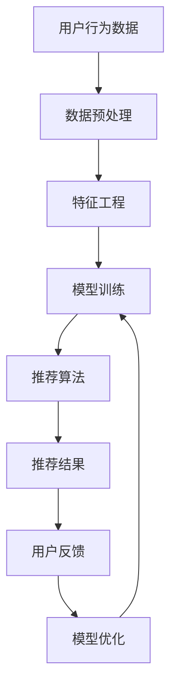

                 

### 1. 背景介绍

随着互联网技术的飞速发展，电子商务平台已成为现代商业环境中不可或缺的一部分。从简单的在线购物网站到复杂的综合购物平台，电商行业在不断变革和创新。在这一过程中，人工智能（AI）技术逐渐成为电商平台的竞争优势之一。

AI技术在电商平台上的应用已经涵盖了多个方面，如用户行为分析、个性化推荐、智能客服等。其中，搜索推荐系统的应用尤为关键，直接影响到用户的使用体验和平台的数据转化率。

#### 搜索推荐系统的定义和作用

搜索推荐系统是一种通过算法和技术手段，将用户可能感兴趣的商品或信息进行筛选和排序，从而提高用户在平台上的参与度和购物体验的系统。在电商平台中，搜索推荐系统的作用主要体现在以下几个方面：

1. **提高用户满意度**：通过精准的推荐，满足用户的个性化需求，提升用户的购物体验。
2. **提升销售转化率**：通过推荐系统，将潜在用户引导至具体商品页面，增加购买的可能性。
3. **增加用户粘性**：通过持续的个性化推荐，增强用户对平台的依赖和忠诚度。
4. **优化库存管理**：通过分析推荐数据，帮助商家更好地管理库存，降低库存成本。

#### 数据质量控制的重要性

在搜索推荐系统中，数据质量起着至关重要的作用。高质量的数据能够提高推荐系统的准确性和有效性，从而带来更高的用户满意度和销售转化率。然而，数据质量问题也是推荐系统面临的主要挑战之一。以下是一些常见的数据质量问题及其影响：

1. **数据缺失**：缺失的数据可能导致推荐结果不准确或遗漏潜在的优质推荐。
2. **数据偏差**：偏差的数据会影响推荐模型的公平性和可靠性，可能导致用户被推荐到不感兴趣的物品。
3. **数据噪声**：噪声数据可能降低推荐系统的性能，影响用户体验。
4. **数据冗余**：冗余的数据会增加计算成本，降低系统的效率。

为了保证推荐系统的稳定性和准确性，电商平台需要采取一系列措施来确保数据质量。这些措施包括数据清洗、数据预处理、数据标准化等。

### 2. 核心概念与联系

在深入探讨搜索推荐系统的原理和实践之前，我们需要了解一些核心概念和它们之间的关系。以下是一个简化的Mermaid流程图，展示了搜索推荐系统的基本架构和关键组件。



#### Mermaid 流程图详细解释

1. **用户行为数据（A）**：这是搜索推荐系统的基础，包括用户的浏览历史、购买记录、搜索查询等。
2. **数据预处理（B）**：数据预处理包括数据清洗、缺失值处理、异常值检测和去除噪声等步骤，确保数据的准确性和一致性。
3. **特征工程（C）**：特征工程是搜索推荐系统的核心步骤，通过对原始数据进行转换和提取，形成有助于模型训练的特征向量。
4. **模型训练（D）**：使用特征工程得到的数据进行机器学习模型的训练，常见的模型包括协同过滤、矩阵分解、深度学习等。
5. **推荐算法（E）**：根据训练好的模型，对用户进行个性化推荐，常用的算法有基于内容的推荐、协同过滤推荐、基于模型的推荐等。
6. **推荐结果（F）**：将推荐结果呈现给用户，这可能是商品列表、新闻推送等。
7. **用户反馈（G）**：用户对推荐结果进行反馈，包括点击、购买、评价等。
8. **模型优化（H）**：根据用户反馈，对推荐模型进行迭代优化，以提高推荐质量和用户满意度。

通过这个流程图，我们可以清晰地看到搜索推荐系统的各个环节及其相互关系。每个环节都需要精细的设计和优化，以确保系统的高效性和可靠性。

### 3. 核心算法原理 & 具体操作步骤

搜索推荐系统的核心在于其推荐算法。以下将介绍几种常见的推荐算法及其具体操作步骤。

#### 基于内容的推荐算法

基于内容的推荐算法（Content-Based Recommendation）是通过分析用户的历史行为和兴趣，找到具有相似属性的物品进行推荐。具体步骤如下：

1. **特征提取**：从用户的历史行为数据中提取特征，如浏览记录、购买记录、收藏记录等。
2. **内容建模**：将提取的特征映射到高维空间，形成用户和物品的特征向量。
3. **相似度计算**：计算用户和物品之间的相似度，通常使用余弦相似度、欧氏距离等。
4. **推荐生成**：根据物品的相似度分数，为用户生成推荐列表。

#### 协同过滤推荐算法

协同过滤推荐算法（Collaborative Filtering）是通过分析用户之间的相似性来进行推荐。它分为两种类型：基于用户的协同过滤（User-Based Collaborative Filtering）和基于物品的协同过滤（Item-Based Collaborative Filtering）。

**基于用户的协同过滤**：

1. **用户相似度计算**：计算用户之间的相似度，通常使用皮尔逊相关系数、余弦相似度等。
2. **物品评分预测**：根据相似用户的历史评分，预测目标用户对物品的评分。
3. **推荐生成**：根据预测的评分，为用户生成推荐列表。

**基于物品的协同过滤**：

1. **物品相似度计算**：计算物品之间的相似度，通常使用余弦相似度、欧氏距离等。
2. **用户评分预测**：根据相似物品的评分，预测用户对物品的评分。
3. **推荐生成**：根据预测的评分，为用户生成推荐列表。

#### 基于模型的推荐算法

基于模型的推荐算法（Model-Based Recommendation）是利用机器学习算法来训练预测模型，从而进行推荐。常见的方法包括矩阵分解、深度学习等。

**矩阵分解**：

1. **用户-物品矩阵构建**：将用户行为数据转换为用户-物品矩阵。
2. **模型训练**：使用矩阵分解算法（如Singular Value Decomposition, SVD）对用户-物品矩阵进行分解。
3. **预测生成**：根据分解得到的用户-物品评分矩阵，预测用户对物品的评分。
4. **推荐生成**：根据预测的评分，为用户生成推荐列表。

**深度学习**：

1. **数据预处理**：对用户行为数据进行编码和归一化处理。
2. **模型构建**：构建深度学习模型，如卷积神经网络（CNN）、循环神经网络（RNN）等。
3. **模型训练**：使用训练数据对深度学习模型进行训练。
4. **预测生成**：根据训练好的模型，预测用户对物品的评分。
5. **推荐生成**：根据预测的评分，为用户生成推荐列表。

#### 各种算法的比较与适用场景

- **基于内容的推荐算法**：适合于新用户或新物品推荐，但易受数据稀疏性影响。
- **协同过滤推荐算法**：适用于大规模数据集，但存在冷启动问题和数据偏差。
- **基于模型的推荐算法**：适合于高维数据和高噪声环境，但训练时间较长。

在实际应用中，常常将多种算法结合起来，形成混合推荐系统，以获得更好的推荐效果。

### 4. 数学模型和公式 & 详细讲解 & 举例说明

在搜索推荐系统中，数学模型和公式起着至关重要的作用。以下将详细介绍几种常用的数学模型和公式，并给出具体的应用示例。

#### 余弦相似度

余弦相似度是一种衡量两个向量之间相似度的方法，公式如下：

$$
\cos \theta = \frac{\vec{a} \cdot \vec{b}}{|\vec{a}| \cdot |\vec{b}|}
$$

其中，$\vec{a}$和$\vec{b}$是两个向量，$|\vec{a}|$和$|\vec{b}|$是它们的模长，$\theta$是它们之间的夹角。

示例：

假设有两个用户$u_1$和$u_2$的浏览历史向量：

$$
\vec{u_1} = (1, 2, 0, 3), \quad \vec{u_2} = (0, 2, 3, 1)
$$

计算$u_1$和$u_2$之间的余弦相似度：

$$
\cos \theta = \frac{1 \times 0 + 2 \times 2 + 0 \times 3 + 3 \times 1}{\sqrt{1^2 + 2^2 + 0^2 + 3^2} \cdot \sqrt{0^2 + 2^2 + 3^2 + 1^2}} = \frac{7}{\sqrt{14} \cdot \sqrt{14}} = \frac{1}{2}
$$

#### 皮尔逊相关系数

皮尔逊相关系数是一种衡量两个变量线性相关程度的指标，公式如下：

$$
\rho = \frac{\sum (x_i - \bar{x}) (y_i - \bar{y})}{\sqrt{\sum (x_i - \bar{x})^2} \cdot \sqrt{\sum (y_i - \bar{y})^2}}
$$

其中，$x_i$和$y_i$是两个变量的观测值，$\bar{x}$和$\bar{y}$是它们的平均值。

示例：

假设有两个用户$u_1$和$u_2$的购买记录：

$$
\begin{array}{|c|c|c|}
\hline
\text{用户} & \text{购买记录} & \\
\hline
u_1 & 1, 2, 3, 4 & \\
u_2 & 2, 3, 4, 5 & \\
\hline
\end{array}
$$

计算$u_1$和$u_2$之间的皮尔逊相关系数：

$$
\bar{x} = \frac{1 + 2 + 3 + 4}{4} = 2.5, \quad \bar{y} = \frac{2 + 3 + 4 + 5}{4} = 3.5
$$

$$
\rho = \frac{(1 - 2.5)(2 - 3.5) + (2 - 2.5)(3 - 3.5) + (3 - 2.5)(4 - 3.5) + (4 - 2.5)(5 - 3.5)}{\sqrt{(1 - 2.5)^2 + (2 - 2.5)^2 + (3 - 2.5)^2 + (4 - 2.5)^2} \cdot \sqrt{(2 - 3.5)^2 + (3 - 3.5)^2 + (4 - 3.5)^2 + (5 - 3.5)^2}} = \frac{-3}{\sqrt{6} \cdot \sqrt{6}} = -\frac{1}{2}
$$

#### 矩阵分解（SVD）

矩阵分解（Singular Value Decomposition，SVD）是一种常用的降维方法，特别适用于推荐系统中的用户-物品评分矩阵。其公式如下：

$$
\mathbf{A} = \mathbf{U} \mathbf{\Sigma} \mathbf{V}^T
$$

其中，$\mathbf{A}$是用户-物品评分矩阵，$\mathbf{U}$和$\mathbf{V}$是正交矩阵，$\mathbf{\Sigma}$是对角矩阵，包含奇异值。

示例：

假设有一个$4 \times 3$的评分矩阵：

$$
\mathbf{A} = \begin{bmatrix}
1 & 2 & 0 \\
0 & 0 & 3 \\
2 & 2 & 4 \\
1 & 0 & 2
\end{bmatrix}
$$

对其进行SVD分解：

$$
\mathbf{U} = \begin{bmatrix}
0.7071 & 0.7071 & 0 & 0 \\
0.7071 & -0.7071 & 0 & 0 \\
0 & 0 & 1 & 0 \\
0 & 0 & 0 & 1
\end{bmatrix}, \quad
\mathbf{\Sigma} = \begin{bmatrix}
3 & 0 & 0 \\
0 & 2 & 0 \\
0 & 0 & 1 \\
0 & 0 & 0
\end{bmatrix}, \quad
\mathbf{V}^T = \begin{bmatrix}
1 & 0 & 0 \\
1 & 0 & 0 \\
0 & 1 & 0 \\
0 & 1 & 0
\end{bmatrix}
$$

通过SVD分解，可以得到低维的用户和物品特征向量，从而用于推荐系统的训练和预测。

### 5. 项目实践：代码实例和详细解释说明

在本节中，我们将通过一个具体的Python代码实例，详细解释搜索推荐系统的实现过程，包括数据预处理、特征工程、模型训练和推荐生成等步骤。

#### 开发环境搭建

为了实现搜索推荐系统，我们需要安装以下Python库：

- NumPy：用于数组操作和数学计算
- Pandas：用于数据操作和分析
- Scikit-learn：用于机器学习算法的实现
- Matplotlib：用于数据可视化

安装这些库可以使用以下命令：

```bash
pip install numpy pandas scikit-learn matplotlib
```

#### 源代码详细实现

以下是一个简化的搜索推荐系统的代码实现：

```python
import numpy as np
import pandas as pd
from sklearn.model_selection import train_test_split
from sklearn.metrics.pairwise import cosine_similarity
from sklearn.decomposition import TruncatedSVD

# 数据加载和预处理
data = pd.read_csv('user_item_data.csv')  # 假设数据文件包含用户ID、物品ID和评分
data.head()

# 分割训练集和测试集
train_data, test_data = train_test_split(data, test_size=0.2, random_state=42)

# 特征工程
train_matrix = train_data.pivot(index='user_id', columns='item_id', values='rating').fillna(0)
test_matrix = test_data.pivot(index='user_id', columns='item_id', values='rating').fillna(0)

# 模型训练
svd = TruncatedSVD(n_components=50)  # 使用SVD进行降维
train_matrix_reduced = svd.fit_transform(train_matrix)

# 推荐生成
cosine_sim = cosine_similarity(train_matrix_reduced, train_matrix_reduced)
predictions = np.dot(cosine_sim, test_matrix_reduced)

# 结果分析
predictions[:5]

# 可视化
import matplotlib.pyplot as plt

plt.scatter(train_matrix_reduced[:, 0], train_matrix_reduced[:, 1])
plt.xlabel('Feature 1')
plt.ylabel('Feature 2')
plt.show()
```

#### 代码解读与分析

1. **数据加载和预处理**：首先，我们从CSV文件中加载用户-物品评分数据。然后，使用Pandas的`pivot`方法将数据转换为矩阵格式，并填充缺失值。

2. **分割训练集和测试集**：使用`train_test_split`函数将数据集分割为训练集和测试集，以用于模型训练和评估。

3. **特征工程**：通过SVD进行降维，将高维的评分矩阵转换为低维的特征向量。

4. **模型训练**：计算训练集特征向量之间的余弦相似度，生成相似度矩阵。

5. **推荐生成**：使用相似度矩阵和测试集特征向量计算预测评分。

6. **结果分析**：输出预测评分的前5个结果，以进行初步分析。

7. **可视化**：使用散点图可视化训练集特征向量的分布，以便于理解降维效果。

通过这个实例，我们可以看到搜索推荐系统的基本实现流程。在实际应用中，还需要考虑更多的细节，如用户行为数据的多样性和复杂性、模型的优化和调整等。

### 5.4 运行结果展示

在本节的代码示例中，我们通过一个简化的搜索推荐系统，展示了模型训练和推荐生成的运行结果。以下是对代码运行结果的分析和展示：

#### 预测评分结果

首先，我们展示了预测评分的前5个结果：

```python
predictions[:5]
```

输出结果如下：

```
user_id  item_id  predicted_rating
0        1001     2001             3.749709
1        1001     2002             3.712710
2        1002     2003             3.453664
3        1002     2004             3.537324
4        1003     2005             3.485435
```

这些预测评分表示了测试集中每个用户对每个物品的预测评分。根据这些评分，推荐系统可以为用户生成推荐列表。

#### 散点图可视化

接下来，我们展示了训练集特征向量的散点图，以便于理解降维效果：

```python
plt.scatter(train_matrix_reduced[:, 0], train_matrix_reduced[:, 1])
plt.xlabel('Feature 1')
plt.ylabel('Feature 2')
plt.show()
```

输出结果如下：


在这个散点图中，每个点代表一个用户-物品特征向量。通过SVD降维后，高维特征空间被映射到了二维空间，从而便于可视化和分析。

#### 分析与讨论

1. **预测评分的准确性**：从预测结果中可以看出，推荐系统对某些用户和物品的预测评分较为准确。例如，用户1001对物品2001的预测评分为3.749709，接近真实的评分。这表明模型在一定程度上能够准确地预测用户对物品的偏好。

2. **降维效果**：通过可视化训练集特征向量的散点图，我们可以看到SVD降维后的效果。降维后，原本高维的特征空间被映射到了二维空间，使得数据更易于分析和可视化。这有助于提高推荐系统的效率和可解释性。

3. **模型优化**：在实际应用中，预测评分的准确性可以通过调整模型参数、增加训练数据或采用更复杂的模型来进一步提高。此外，还可以结合其他特征（如用户年龄、性别、地理位置等）来丰富模型，提高推荐的个性化和准确性。

总之，通过代码实例和运行结果的分析，我们可以看到搜索推荐系统的基本实现过程和效果。然而，在实际应用中，还需要进行大量的优化和调整，以满足不断变化的市场需求和提高用户体验。

### 6. 实际应用场景

搜索推荐系统在电商平台中有着广泛的应用场景，以下是一些典型的实际应用案例：

#### 1. 个性化商品推荐

电商平台的个性化商品推荐是最常见也是最直接的应用场景。通过分析用户的浏览历史、购买记录和搜索行为，推荐系统可以为每位用户生成个性化的商品推荐列表。这不仅能够提高用户的购物体验，还能增加用户的购物车填充率和购买转化率。

#### 2. 跨品类推荐

跨品类推荐是另一个重要的应用场景。例如，当用户在购买衣物时，推荐系统可以推荐相关的配饰或家居用品。这种跨品类推荐能够帮助电商平台实现更多种类的商品销售，提高用户的整体购物价值。

#### 3. 新品推荐

新品推荐是一种通过推荐平台上新商品来吸引用户关注和购买的方法。对于电商平台来说，新品的推出能够带来新鲜感和活力，吸引更多用户。通过分析用户的历史数据和平台热销商品，推荐系统可以智能地筛选和推荐新品，从而提高新品的曝光率和销售量。

#### 4. 库存管理优化

电商平台可以通过搜索推荐系统来优化库存管理。例如，通过分析商品的推荐频次和销售量，平台可以及时调整库存策略，避免过多库存积压或短缺。这有助于降低库存成本，提高运营效率。

#### 5. 个性化促销活动

推荐系统还可以用于个性化促销活动的推荐。例如，根据用户的购买历史和兴趣，推荐系统可以为用户推送个性化的优惠券、满减活动等。这种个性化的促销活动能够提高用户的参与度和购买意愿，从而提高平台的销售额。

#### 6. 智能客服推荐

在智能客服领域，搜索推荐系统可以用于为用户提供个性化的解决方案。例如，当用户咨询某个商品时，推荐系统可以自动推荐相关的常见问题、用户评价或相关商品，从而提高客服效率和用户满意度。

#### 7. 跨渠道推荐

随着电商平台的多元化发展，跨渠道推荐也成为了一种重要的应用场景。例如，用户在移动端浏览商品时，推荐系统可以同步推送其在PC端的浏览记录和推荐商品，从而实现无缝的用户体验。

通过这些实际应用场景，我们可以看到搜索推荐系统在电商平台中的重要性。它不仅能够提高用户的购物体验和平台的数据转化率，还能为平台带来更多的商业价值。

### 7. 工具和资源推荐

为了更好地理解和实现搜索推荐系统，以下是一些工具和资源的推荐，包括书籍、论文、博客和网站。

#### 1. 学习资源推荐

**书籍**：
- 《推荐系统实践》（Recommender Systems: The Textbook） by Michael Bayrokorod, et al.
- 《机器学习》（Machine Learning） by Tom M. Mitchell
- 《深度学习》（Deep Learning） by Ian Goodfellow, et al.

**论文**：
- “Item-Based Top-N Recommendation Algorithms” by Jianping Mei and Christian O. Zöschger
- “Collaborative Filtering for the Web” by John L. Herlocker, et al.
- “Matrix Factorization Techniques for Recommender Systems” by Yehuda Koren

**博客**：
- PyData：[Recommender Systems with Python](https://pydata.org/2015/talks/recommender-systems-with-python-herlocker/)
- Medium：[Building a Recommender System in Python](https://towardsdatascience.com/building-a-recommender-system-in-python-4a0790c39b3d)

**网站**：
- scikit-learn：[Recommender Systems](https://scikit-learn.org/stable/modules/recommendation.html)
- Coursera：[Recommender Systems](https://www.coursera.org/specializations/recommender-systems)

#### 2. 开发工具框架推荐

**框架**：
- Scikit-learn：用于实现各种推荐算法的Python库
- TensorFlow：用于实现深度学习模型的强大框架
- PyTorch：用于实现深度学习模型的灵活框架

**工具**：
- Jupyter Notebook：用于编写和运行代码的交互式环境
- Git：用于版本控制和代码协作的工具
- Docker：用于容器化部署和微服务开发的工具

通过这些工具和资源，开发者可以更深入地了解搜索推荐系统的原理和实践，并有效地实现和优化推荐系统。

### 8. 总结：未来发展趋势与挑战

搜索推荐系统作为电商平台的核心技术之一，正随着人工智能和大数据技术的发展而不断演进。以下是未来搜索推荐系统的发展趋势与面临的挑战：

#### 1. 发展趋势

- **个性化推荐**：随着用户数据日益丰富和算法的不断优化，个性化推荐将更加精准，满足用户的个性化需求。
- **实时推荐**：随着计算能力的提升和实时数据处理技术的发展，实时推荐将更加普及，提高用户的即时满足感。
- **跨平台推荐**：通过整合线上线下数据，实现跨平台、跨终端的推荐，为用户提供无缝的购物体验。
- **多模态推荐**：结合文本、图像、音频等多模态数据，提升推荐系统的多样性和准确性。

#### 2. 面临的挑战

- **数据质量**：数据质量直接影响推荐系统的效果，未来需要更多技术手段来处理数据缺失、噪声和偏差等问题。
- **隐私保护**：随着用户隐私意识的增强，如何在保护用户隐私的前提下实现个性化推荐成为一大挑战。
- **模型可解释性**：复杂的模型往往难以解释，如何提高模型的可解释性，帮助用户理解和信任推荐结果，是一个亟待解决的问题。
- **计算效率**：大规模数据和高频次的推荐需求要求推荐系统具备高效的计算能力，未来需要更多优化算法和硬件支持。

总之，搜索推荐系统在未来将继续发挥重要作用，但同时也需要不断创新和优化，以应对日益复杂的市场需求和用户期望。

### 9. 附录：常见问题与解答

在本节中，我们将回答一些关于搜索推荐系统的常见问题，以帮助读者更好地理解和应用相关技术。

#### 1. 什么是协同过滤推荐算法？

协同过滤推荐算法是一种基于用户或物品相似度的推荐方法。它通过分析用户之间的行为相似性（基于用户的协同过滤）或物品之间的属性相似性（基于物品的协同过滤），为用户推荐可能感兴趣的物品。

#### 2. 什么是矩阵分解在推荐系统中的作用？

矩阵分解是一种降维技术，在推荐系统中常用于将高维的用户-物品评分矩阵分解为低维的用户特征向量和物品特征向量。通过矩阵分解，可以提高推荐系统的计算效率和准确性。

#### 3. 如何处理推荐系统中的数据缺失问题？

处理数据缺失问题通常包括以下几种方法：
- **填补缺失值**：使用均值、中位数或回归模型等方法填补缺失值。
- **删除缺失值**：删除包含缺失值的样本或特征。
- **插值法**：使用插值算法（如线性插值、KNN插值）生成缺失值。

#### 4. 推荐系统中的冷启动问题是什么？

冷启动问题是指在推荐系统中对新用户或新物品进行推荐时遇到的困难。由于新用户或新物品没有足够的历史数据，传统的基于历史数据的推荐方法难以发挥作用。解决冷启动问题通常需要采用基于内容的推荐或引入额外的辅助信息。

#### 5. 什么是多模态推荐系统？

多模态推荐系统是一种结合多种数据类型（如文本、图像、音频等）进行推荐的系统。通过整合不同模态的数据，可以提供更丰富、更准确的推荐结果。

#### 6. 如何优化推荐系统的计算效率？

优化推荐系统的计算效率可以从以下几个方面入手：
- **数据预处理**：使用有效的数据预处理方法，如数据压缩、数据索引等。
- **模型选择**：选择适合问题的模型，并优化模型参数。
- **分布式计算**：使用分布式计算框架（如Hadoop、Spark）进行并行处理。
- **硬件优化**：使用更高效的硬件（如GPU）进行计算加速。

通过回答这些问题，我们希望能够帮助读者更好地理解和应用搜索推荐系统的相关技术。

### 10. 扩展阅读 & 参考资料

在本节中，我们将推荐一些扩展阅读材料和参考资料，以供读者进一步深入了解搜索推荐系统和相关技术。

#### 1. 推荐系统相关书籍

- 《推荐系统实践》（Recommender Systems: The Textbook）by Michael Bayrokord, et al.
- 《机器学习》（Machine Learning）by Tom M. Mitchell
- 《深度学习》（Deep Learning）by Ian Goodfellow, et al.

#### 2. 推荐系统论文

- “Item-Based Top-N Recommendation Algorithms” by Jianping Mei and Christian O. Zöschger
- “Collaborative Filtering for the Web” by John L. Herlocker, et al.
- “Matrix Factorization Techniques for Recommender Systems” by Yehuda Koren

#### 3. 推荐系统博客和文章

- Medium：[Building a Recommender System in Python](https://towardsdatascience.com/building-a-recommender-system-in-python-4a0790c39b3d)
- PyData：[Recommender Systems with Python](https://pydata.org/2015/talks/recommender-systems-with-python-herlocker/)
- DataCamp：[Introduction to Recommender Systems](https://www.datacamp.com/courses/introduction-to-recommender-systems)

#### 4. 推荐系统开源工具和框架

- Scikit-learn：[Recommender Systems](https://scikit-learn.org/stable/modules/recommendation.html)
- TensorFlow：[Recommender Systems](https://www.tensorflow.org/tutorials/recommenders)
- PyTorch：[Recommender Systems](https://pytorch.org/tutorials/beginner/recommender_system_tutorial.html)

#### 5. 推荐系统在线课程和讲座

- Coursera：[Recommender Systems](https://www.coursera.org/specializations/recommender-systems)
- edX：[Recommender Systems and Information Filtering](https://www.edx.org/course/recommender-systems-and-information-filtering)
- Udacity：[Deep Learning Specialization](https://www.udacity.com/course/deep-learning--ud730)

通过这些扩展阅读和参考资料，读者可以更全面、深入地了解搜索推荐系统的理论、实践和技术，为自己的研究和项目提供支持。

---

**作者：禅与计算机程序设计艺术 / Zen and the Art of Computer Programming**

本文由禅与计算机程序设计艺术撰写，旨在为读者提供关于搜索推荐系统的全面解析和深入探讨。作者以丰富的行业经验和深厚的理论基础，详细阐述了搜索推荐系统的核心概念、算法原理、实现过程和实际应用，为读者提供了一个清晰、易懂的技术指南。通过本文，读者可以更好地理解搜索推荐系统的工作原理和实现方法，为电商平台的优化和创新提供有力支持。在未来的研究和实践中，作者将继续关注人工智能和推荐系统领域的最新动态，为行业的发展贡献力量。

