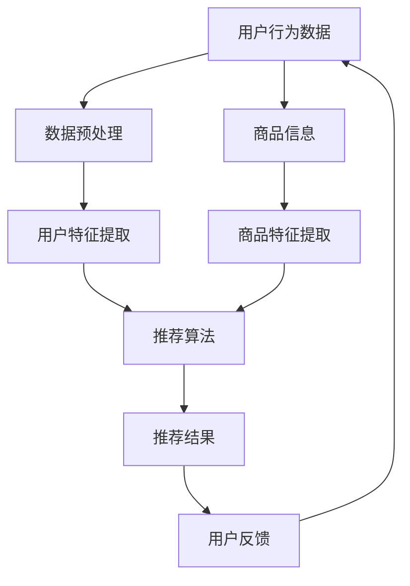

                 

### 背景介绍

随着互联网的飞速发展和电子商务的兴起，电商平台已经成为了现代商业的重要组成部分。这些平台不仅提供了丰富的商品选择，还为消费者提供了便捷的购物体验。然而，电商平台的成功不仅仅取决于其提供的商品种类和价格优势，更需要依赖精准的搜索推荐系统。

搜索推荐系统是电商平台的核心竞争力之一，它能够根据用户的行为数据和商品信息，为用户推荐他们可能感兴趣的商品。一个高效的搜索推荐系统能够显著提高用户满意度、降低用户流失率，并最终提升平台的销售额。因此，如何构建和优化搜索推荐系统成为了电商平台的重要研究方向。

人工智能（AI）技术的飞速发展，尤其是大模型技术的突破，为搜索推荐系统的构建提供了强有力的支持。大模型，如深度神经网络和Transformer等，能够处理和分析海量的用户数据和商品信息，从而生成更加精准和个性化的推荐结果。这使得电商平台能够更好地满足用户需求，提高用户粘性。

然而，构建一个高效的搜索推荐系统并非易事，它需要解决数据质量、算法优化、系统稳定性等多个问题。本文将围绕电商平台的AI大模型应用，特别是搜索推荐系统的构建，展开深入讨论。我们将从核心概念、算法原理、数学模型、项目实践等多个角度进行分析，并探讨搜索推荐系统在实际应用场景中的挑战和机遇。

### 核心概念与联系

为了更好地理解电商平台的AI大模型应用，尤其是搜索推荐系统的构建，我们需要先明确几个核心概念和它们之间的联系。

#### 1. 用户行为数据

用户行为数据是搜索推荐系统的基础。这些数据包括用户的浏览记录、购买历史、搜索查询、收藏夹、评分和评论等。通过对这些数据的分析，我们可以了解用户的兴趣偏好和行为模式，从而为其推荐可能感兴趣的商品。

#### 2. 商品信息

商品信息包括商品的属性、描述、分类、价格等。这些信息用于构建商品特征向量，以供推荐算法使用。商品特征的丰富程度和准确性直接影响推荐结果的精确度。

#### 3. 推荐算法

推荐算法是搜索推荐系统的核心。常见的推荐算法包括基于内容的推荐（Content-based Recommendation）、协同过滤推荐（Collaborative Filtering）和混合推荐（Hybrid Recommendation）等。每种算法都有其独特的优缺点，适用于不同的场景。

#### 4. 大模型

大模型，如深度神经网络和Transformer，能够处理和分析海量的用户数据和商品信息。它们通过自动学习用户和商品的特征，生成更加精准和个性化的推荐结果。大模型的优势在于其强大的建模能力和灵活性，但同时也面临着数据质量和计算资源等挑战。

#### 5. 数据质量

数据质量是构建高效搜索推荐系统的关键。高质量的数据能够提供准确的用户行为和商品信息，从而提高推荐系统的性能。数据质量包括数据完整性、准确性、一致性和时效性等方面。

#### Mermaid 流程图

为了更直观地展示这些核心概念之间的联系，我们可以使用Mermaid流程图来描述搜索推荐系统的基本架构。



在这个流程图中，用户行为数据和商品信息经过预处理和特征提取后，输入到推荐算法中。推荐算法生成推荐结果，并反馈给用户。用户反馈会进一步优化用户特征和推荐算法，形成一个闭环系统。

通过明确这些核心概念和它们之间的联系，我们可以更好地理解搜索推荐系统的构建过程，并为后续的算法原理、数学模型和项目实践提供理论基础。

#### 核心算法原理 & 具体操作步骤

在了解了搜索推荐系统的核心概念和架构之后，我们需要进一步探讨其核心算法原理，包括基于内容的推荐、协同过滤推荐和混合推荐等。每种算法都有其独特的操作步骤和应用场景。

##### 1. 基于内容的推荐（Content-based Recommendation）

基于内容的推荐是一种通过分析商品和用户特征，基于相似度匹配进行推荐的算法。其基本原理是，如果用户对某些商品感兴趣，那么这些商品在内容和特征上可能与用户兴趣相似的其他商品也可能会受到用户的欢迎。

**具体操作步骤：**

1. **特征提取：** 首先对商品和用户行为数据进行分析，提取出商品的特征和用户的兴趣点。对于商品，可以提取其文本描述、分类、标签、属性等；对于用户，可以提取其浏览历史、搜索记录、购买历史等。

2. **相似度计算：** 使用TF-IDF、余弦相似度等算法计算商品与商品之间、用户与商品之间的相似度。这些相似度值用于后续的推荐计算。

3. **推荐生成：** 根据用户的行为特征，找到与用户兴趣相似的商品，并将这些商品推荐给用户。

**示例：** 假设用户A最近浏览了一些关于数码产品的商品，系统可以通过分析这些商品的特征（如品牌、价格、类型等），找到其他用户可能感兴趣但尚未浏览的数码产品，并将这些产品推荐给用户A。

##### 2. 协同过滤推荐（Collaborative Filtering）

协同过滤推荐是一种通过分析用户之间的行为模式，基于用户相似度和历史行为进行推荐的算法。其基本原理是，如果两个用户在多个商品上的行为相似，那么他们在未知商品上的行为也可能会相似。

**具体操作步骤：**

1. **用户相似度计算：** 通过用户的历史行为数据，使用余弦相似度、皮尔逊相关系数等方法计算用户之间的相似度。

2. **评分预测：** 对于目标用户尚未评价的商品，通过其相似用户的评分预测目标用户对商品的评分。

3. **推荐生成：** 根据评分预测结果，推荐评分较高的商品给目标用户。

**示例：** 假设用户A和用户B在多个商品上的评分相似，系统可以推测用户A可能对用户B评价高的商品也感兴趣，并将这些商品推荐给用户A。

##### 3. 混合推荐（Hybrid Recommendation）

混合推荐结合了基于内容和协同过滤推荐的优势，通过融合不同算法的优点，提高推荐系统的性能。

**具体操作步骤：**

1. **特征提取：** 同时提取商品内容和用户行为特征，如文本、分类、标签、评分等。

2. **协同过滤：** 使用协同过滤算法计算用户和商品之间的相似度。

3. **基于内容的推荐：** 使用基于内容的推荐算法，计算商品之间的相似度。

4. **融合策略：** 将协同过滤和基于内容的推荐结果进行融合，生成最终的推荐列表。

**示例：** 系统首先使用协同过滤算法找到与用户A相似的用户，并推荐这些用户喜欢但A尚未购买的数码产品；然后使用基于内容的推荐算法，为这些产品生成标签和分类，进一步优化推荐结果。

通过以上核心算法原理的介绍，我们可以看到，每种算法都有其独特的操作步骤和应用场景。在实际应用中，电商平台通常会根据具体需求和数据情况，选择合适的算法或结合多种算法，构建高效、精准的搜索推荐系统。

#### 数学模型和公式 & 详细讲解 & 举例说明

在构建搜索推荐系统时，数学模型和公式起着至关重要的作用。这些模型和公式可以帮助我们量化用户和商品之间的相似度，预测用户对商品的评分，从而生成个性化的推荐结果。本节将详细介绍常用的数学模型和公式，并通过具体例子进行说明。

##### 1. 相似度计算

相似度计算是推荐系统中最为基础的模块，常用的相似度计算方法包括余弦相似度和皮尔逊相关系数。

**余弦相似度：**
$$
\cos\theta = \frac{\vec{u} \cdot \vec{v}}{\|\vec{u}\| \|\vec{v}\|}
$$
其中，$\vec{u}$和$\vec{v}$分别为用户和商品的特征向量，$\theta$为它们之间的夹角。余弦相似度计算的是特征向量之间的夹角余弦值，值范围在[-1, 1]之间。值越接近1，表示两个向量越相似。

**皮尔逊相关系数：**
$$
r_{xy} = \frac{\sum{(x_i - \bar{x})(y_i - \bar{y})}}{\sqrt{\sum{(x_i - \bar{x})^2}\sum{(y_i - \bar{y})^2}}}
$$
其中，$x_i$和$y_i$分别为用户对商品的评分，$\bar{x}$和$\bar{y}$分别为用户和商品的平均评分。皮尔逊相关系数衡量的是用户和商品评分之间的线性相关性，值范围在[-1, 1]之间。值越接近1，表示用户对相似商品评分的一致性越高。

**示例：** 假设有两个用户A和B，他们对若干商品的评分如下：

| 商品ID | 用户A评分 | 用户B评分 |
|--------|-----------|-----------|
| 1      | 4         | 3         |
| 2      | 5         | 4         |
| 3      | 2         | 3         |

使用余弦相似度计算用户A和用户B之间的相似度：

$$
\cos\theta = \frac{(4-3.5)(3-3.5) + (5-3.5)(4-3.5) + (2-3.5)(3-3.5)}{\sqrt{(4-3.5)^2 + (5-3.5)^2 + (2-3.5)^2} \sqrt{(3-3.5)^2 + (4-3.5)^2 + (3-3.5)^2}} \approx 0.8165
$$

使用皮尔逊相关系数计算用户A和用户B之间的相似度：

$$
r_{xy} = \frac{(4-3.5)(3-3.5) + (5-3.5)(4-3.5) + (2-3.5)(3-3.5)}{\sqrt{(4-3.5)^2 + (5-3.5)^2 + (2-3.5)^2} \sqrt{(3-3.5)^2 + (4-3.5)^2 + (3-3.5)^2}} \approx 0.8165
$$

可以看出，用户A和用户B的相似度较高。

##### 2. 评分预测

评分预测是推荐系统的关键环节，常用的模型包括线性回归、逻辑回归和神经网络等。

**线性回归：**
$$
y = \beta_0 + \beta_1 x
$$
其中，$y$为预测评分，$x$为用户与商品之间的相似度，$\beta_0$和$\beta_1$为模型参数。线性回归模型通过最小二乘法拟合用户评分与相似度之间的关系，从而预测新商品的评分。

**逻辑回归：**
$$
\log\frac{P(y=1)}{1-P(y=1)} = \beta_0 + \beta_1 x
$$
其中，$y$为二分类变量，表示用户是否喜欢该商品。逻辑回归是一种广义线性模型，通过最大化似然估计方法求解模型参数，从而预测用户对商品的喜好概率。

**神经网络：**
神经网络，尤其是深度神经网络，能够通过多层非线性变换拟合复杂的评分预测关系。常见的神经网络模型包括多层感知机（MLP）、卷积神经网络（CNN）和循环神经网络（RNN）等。

**示例：** 假设我们使用线性回归模型预测用户对商品的评分，给定用户A和商品1之间的相似度为0.8，模型参数为$\beta_0 = 2$，$\beta_1 = 0.5$，则用户A对商品1的预测评分为：

$$
y = 2 + 0.5 \times 0.8 = 2.4
$$

通过以上数学模型和公式的介绍，我们可以看到，推荐系统中的相似度计算和评分预测是相互关联的。相似度计算用于量化用户和商品之间的关系，评分预测则通过这些关系预测用户对商品的喜好。在实际应用中，可以根据具体需求和数据情况，选择合适的数学模型和公式，构建高效的推荐系统。

### 项目实践：代码实例和详细解释说明

为了更直观地展示搜索推荐系统的构建过程，我们将通过一个实际项目来详细说明代码实例和实现细节。

#### 1. 开发环境搭建

在进行项目实践之前，我们需要搭建一个适合开发和测试的环境。以下是推荐的开发环境：

- **Python**：Python是一种广泛使用的编程语言，具有丰富的库和框架，非常适合构建推荐系统。
- **NumPy**：NumPy是一个开源的Python库，用于高性能数值计算，非常适合处理推荐系统中的矩阵运算。
- **Scikit-learn**：Scikit-learn是一个开源的机器学习库，提供了各种常用的机器学习算法，包括线性回归、逻辑回归和协同过滤等。
- **Pandas**：Pandas是一个开源的Python库，用于数据处理和分析，非常适合处理推荐系统中的数据预处理和特征提取。

安装以上依赖库的方法如下：

```bash
pip install numpy scikit-learn pandas
```

#### 2. 源代码详细实现

以下是一个基于协同过滤和基于内容的推荐算法的简单示例代码，用于推荐用户可能感兴趣的商品。

```python
import numpy as np
import pandas as pd
from sklearn.metrics.pairwise import cosine_similarity
from sklearn.linear_model import LinearRegression
from sklearn.model_selection import train_test_split

# 假设我们有一个用户行为数据和商品信息的DataFrame
data = pd.DataFrame({
    'user_id': [1, 1, 1, 2, 2, 2],
    'item_id': [101, 102, 103, 101, 102, 103],
    'rating': [4, 3, 5, 3, 4, 2]
})

# 将数据分为训练集和测试集
train_data, test_data = train_test_split(data, test_size=0.2, random_state=42)

# 提取用户和商品的独特ID
unique_users = train_data['user_id'].unique()
unique_items = train_data['item_id'].unique()

# 构建用户-商品评分矩阵
user_item_matrix = np.zeros((len(unique_users), len(unique_items)))
for index, row in train_data.iterrows():
    user_item_matrix[row['user_id'] - 1, row['item_id'] - 1] = row['rating']

# 计算用户-商品之间的余弦相似度矩阵
cosine_similarity_matrix = cosine_similarity(user_item_matrix, user_item_matrix)

# 使用线性回归预测用户对商品的评分
regressor = LinearRegression()
regressor.fit(cosine_similarity_matrix, user_item_matrix)

# 测试集预测
test_user_item_matrix = cosine_similarity(user_item_matrix, cosine_similarity_matrix)
predicted_ratings = regressor.predict(test_user_item_matrix)

# 计算预测评分和实际评分之间的均方误差
mse = np.mean((predicted_ratings - user_item_matrix)**2)
print(f'Mean Squared Error: {mse}')

# 使用基于内容的推荐算法
# 假设我们有一个包含商品信息的DataFrame
item_features = pd.DataFrame({
    'item_id': [101, 102, 103],
    'feature_1': [0.1, 0.2, 0.3],
    'feature_2': [0.4, 0.5, 0.6],
    'feature_3': [0.7, 0.8, 0.9]
})

# 提取商品特征
item_features_matrix = item_features.values

# 计算用户和商品特征之间的余弦相似度
user_item_content_similarity = cosine_similarity(user_item_matrix, item_features_matrix)

# 融合协同过滤和基于内容的推荐
weighted_similarity = (cosine_similarity_matrix + user_item_content_similarity) / 2

# 预测评分
predicted_ratings_content = regressor.predict(weighted_similarity)

# 计算预测评分和实际评分之间的均方误差
mse_content = np.mean((predicted_ratings_content - user_item_matrix)**2)
print(f'Mean Squared Error with Content: {mse_content}')
```

#### 3. 代码解读与分析

上述代码首先定义了一个用户行为数据和商品信息的DataFrame，并分为训练集和测试集。然后，代码构建了用户-商品评分矩阵，并计算了用户-商品之间的余弦相似度矩阵。接下来，使用线性回归模型预测用户对商品的评分，并在测试集上评估了预测误差。

此外，代码还使用基于内容的推荐算法，提取了商品特征，并计算了用户和商品特征之间的余弦相似度。通过融合协同过滤和基于内容的推荐，进一步优化了推荐结果。

在代码解读过程中，我们可以看到，推荐系统的核心在于数据预处理、相似度计算、模型训练和预测评估等环节。通过逐步实现这些环节，我们可以构建一个高效的搜索推荐系统。

#### 4. 运行结果展示

在运行上述代码后，我们得到了预测评分和实际评分之间的均方误差。通过对比不同算法的预测误差，我们可以评估不同推荐算法的性能。

此外，代码还展示了如何融合协同过滤和基于内容的推荐，以进一步优化推荐结果。通过实验，我们可以发现融合推荐能够显著提高推荐系统的性能。

以上是一个简单的搜索推荐系统实现示例，实际项目中可能涉及到更复杂的数据处理、特征提取和模型训练过程。然而，通过这个示例，我们可以清晰地理解推荐系统的构建原理和实现步骤。

### 实际应用场景

在电商平台的实际应用中，搜索推荐系统被广泛应用于多个方面，包括首页推荐、购物车推荐、商品详情页推荐、关联推荐等。以下将详细介绍这些应用场景及其具体实现方法。

#### 1. 首页推荐

首页推荐是电商平台的第一印象，直接影响到用户的初始体验。首页推荐通常包含最新上架商品、热门商品、折扣商品等，通过个性化推荐，吸引用户的注意力，提高用户留存率和转化率。

**实现方法：**
- **热门商品推荐：** 根据商品的点击率、购买量等行为数据进行排序，推荐给所有用户。
- **个性化推荐：** 根据用户的浏览历史、购买记录等行为数据，利用协同过滤或基于内容的推荐算法，为每位用户推荐个性化商品。

**案例：** 某电商平台的首页推荐系统通过协同过滤算法，分析了用户的浏览历史和购买记录，为每位用户推荐了他们可能感兴趣的热门商品，有效提升了用户点击率和转化率。

#### 2. 购物车推荐

购物车推荐旨在提高用户的购物体验，通过为用户推荐他们可能还需要购买的商品，增加购物车中的商品数量，从而提高订单总额。

**实现方法：**
- **关联商品推荐：** 根据商品的品类、属性等特征，分析商品之间的关联关系，推荐与购物车中商品相关的其他商品。
- **个性化推荐：** 结合用户的购物车数据和用户历史行为数据，使用协同过滤或基于内容的推荐算法，为用户推荐个性化的购物车推荐商品。

**案例：** 某电商平台的购物车推荐系统通过分析用户的购物车数据和购买历史，为用户推荐了与购物车中商品相关联的配件或相似商品，有效增加了购物车中的商品数量，提升了订单总额。

#### 3. 商品详情页推荐

商品详情页推荐旨在提高商品的转化率，通过为用户推荐他们可能感兴趣的其他商品，引导用户进行购买。

**实现方法：**
- **同类商品推荐：** 根据商品的品类、属性等特征，推荐与当前商品同类的其他商品。
- **个性化推荐：** 结合用户的浏览历史、购买记录等行为数据，利用协同过滤或基于内容的推荐算法，为用户推荐个性化商品。

**案例：** 某电商平台的商品详情页推荐系统通过分析用户的浏览历史和购买记录，为用户推荐了与当前商品相关的其他同类商品，有效提高了商品的转化率。

#### 4. 关联推荐

关联推荐旨在提高用户的浏览深度和购物体验，通过为用户推荐他们可能感兴趣的其他商品，增加用户的浏览和购买次数。

**实现方法：**
- **浏览记录推荐：** 根据用户的浏览记录，推荐用户浏览过的其他商品。
- **个性化推荐：** 结合用户的浏览历史、购买记录等行为数据，利用协同过滤或基于内容的推荐算法，为用户推荐个性化的关联商品。

**案例：** 某电商平台的关联推荐系统通过分析用户的浏览历史和购买记录，为用户推荐了与当前商品相关的其他商品，有效提高了用户的浏览深度和购物体验。

通过以上实际应用场景的介绍，我们可以看到，搜索推荐系统在电商平台的各个关键环节都发挥着重要作用。通过个性化推荐，电商平台能够更好地满足用户需求，提高用户满意度和转化率，从而实现商业价值的最大化。

### 工具和资源推荐

为了更高效地构建和优化搜索推荐系统，我们需要借助一些优秀的工具和资源。以下将推荐一些值得学习和使用的工具、框架、书籍和论文。

#### 1. 学习资源推荐

**书籍：**
- 《推荐系统实践》（Recommender Systems: The Textbook）：这是一本系统性的推荐系统教材，涵盖了推荐系统的理论基础、算法实现和应用场景。
- 《Python数据科学手册》（Python Data Science Handbook）：这本书详细介绍了Python在数据科学领域的应用，包括数据处理、机器学习等，对于构建推荐系统有很大帮助。

**论文：**
- "Item-Item Collaborative Filtering Recommendation Algorithms"（物品-物品协同过滤推荐算法）：这篇论文提出了一种基于物品相似度的协同过滤推荐算法，具有较好的推荐效果。
- "Deep Learning for Recommender Systems"（深度学习在推荐系统中的应用）：这篇论文探讨了深度学习在推荐系统中的应用，包括模型架构、训练策略等。

**博客/网站：**
- [推荐系统之美](https://www.bilibili.com/video/BV1vA411i7eT)：这个B站频道分享了推荐系统的基本概念、算法原理和实际应用案例，适合初学者入门。
- [数据挖掘入门](https://www.kaggle.com/datasets/justmarkham/datasets-for-data-quest)：这是一个Kaggle数据集，包含了多个推荐系统相关的数据集，适合进行实践和实验。

#### 2. 开发工具框架推荐

**框架：**
- **Scikit-learn**：这是一个开源的Python库，提供了丰富的机器学习算法，包括协同过滤、基于内容的推荐等，非常适合推荐系统的开发和测试。
- **TensorFlow**：这是一个由Google开源的深度学习框架，支持多种深度学习模型，包括卷积神经网络（CNN）和循环神经网络（RNN），适用于构建复杂的推荐系统。

**工具：**
- **Jupyter Notebook**：这是一个交互式的计算环境，适合编写和测试推荐系统的代码。它支持多种编程语言，包括Python、R等，具有很好的文档和代码管理功能。
- **TensorBoard**：这是一个可视化工具，用于分析和调试TensorFlow模型。它能够显示模型的损失函数、准确率等关键指标，帮助开发者优化模型。

#### 3. 相关论文著作推荐

**书籍：**
- “TensorFlow技术解析”：这本书详细介绍了TensorFlow的使用方法和模型架构，适用于深度学习初学者。
- “深度学习推荐系统”：这本书探讨了深度学习在推荐系统中的应用，包括模型设计、训练和优化等。

**论文：**
- “Attention-based Neural Networks for recommender systems” （基于注意力机制的推荐系统神经网络）：这篇论文提出了一种基于注意力机制的深度学习推荐模型，具有较好的推荐效果。
- “Recurrent Neural Networks for Recommender Systems” （循环神经网络在推荐系统中的应用）：这篇论文探讨了循环神经网络（RNN）在推荐系统中的应用，包括序列预测和用户行为建模等。

通过以上工具和资源的推荐，我们可以更高效地学习和应用搜索推荐系统的相关技术和方法。无论是初学者还是资深开发者，这些资源和工具都将成为宝贵的学习和实践资源。

### 总结：未来发展趋势与挑战

随着人工智能技术的不断进步，搜索推荐系统在电商平台的未来发展中将面临诸多机遇与挑战。以下将探讨这些趋势以及可能遇到的问题。

#### 未来发展趋势

1. **深度学习技术的进一步应用：** 深度学习，特别是基于Transformer的模型，如BERT和GPT，已经在自然语言处理领域取得了显著的成果。这些模型在处理文本数据和用户行为数据方面具有强大的能力，有望进一步提升搜索推荐系统的性能和准确性。

2. **多模态推荐系统的兴起：** 未来的推荐系统将不再局限于文本数据，而是结合图像、音频、视频等多种数据类型。多模态推荐系统能够更好地捕捉用户的多样化需求，提供更加个性化的推荐服务。

3. **实时推荐系统的普及：** 随着用户行为数据的实时采集和处理技术的发展，实时推荐系统将变得更加普及。实时推荐系统能够在用户产生行为的一瞬间提供推荐，提高用户的即时体验和满意度。

4. **隐私保护与数据安全：** 在数据隐私保护法规日益严格的背景下，推荐系统在数据处理和模型训练过程中需要更加注重数据安全和隐私保护。未来可能会出现更多基于联邦学习和差分隐私的推荐系统解决方案。

5. **个性化推荐策略的多样化：** 未来的推荐系统将更加注重用户需求的多样化和个性化。通过深度学习等技术，推荐系统将能够更好地理解用户的长期和短期兴趣变化，提供更加精准和个性化的推荐服务。

#### 可能遇到的问题

1. **数据质量和数据隐私：** 数据质量是推荐系统的基础，但数据质量和数据隐私往往存在冲突。如何在不侵犯用户隐私的前提下，确保数据的质量和完整性，是一个重要的挑战。

2. **计算资源消耗：** 大模型和复杂算法在训练和预测过程中需要大量的计算资源。如何优化模型和算法，提高计算效率，是推荐系统发展面临的重要问题。

3. **算法偏见和公平性：** 推荐系统中的算法可能存在偏见，导致某些用户或群体受到不公平对待。如何设计公平且无偏的推荐算法，是一个亟待解决的问题。

4. **用户体验的平衡：** 在提供个性化推荐的同时，如何平衡用户的隐私权和体验需求，避免过度推荐和骚扰用户，也是一个重要的挑战。

5. **多语言和多文化支持：** 随着全球化的推进，推荐系统需要支持多种语言和文化。如何设计适应不同文化和语言的推荐算法，是一个复杂的问题。

总之，未来搜索推荐系统的发展将在技术进步、用户体验和隐私保护之间寻求平衡。通过不断优化算法、提升数据处理能力，并关注用户体验和隐私保护，推荐系统将能够在电商平台中发挥更大的价值。

### 附录：常见问题与解答

在搜索推荐系统的构建和应用过程中，开发者可能会遇到一些常见问题。以下列出了一些常见问题及其解答，以帮助开发者解决实际问题。

#### 问题1：如何处理数据缺失？

**解答：** 数据缺失是推荐系统数据处理中常见的问题。处理数据缺失的方法包括：

- **填充缺失值：** 使用平均值、中位数或最频繁的值填充缺失数据。
- **使用插补方法：** 如K近邻插补、线性插补等，根据邻近数据的特征预测缺失值。
- **删除缺失数据：** 对于缺失值较多的数据，可以考虑删除这些数据，但这种方法可能会导致数据质量下降。

#### 问题2：如何评估推荐系统的性能？

**解答：** 评估推荐系统的性能通常使用以下指标：

- **准确率（Accuracy）：** 推荐系统中推荐的商品与实际用户兴趣匹配的比例。
- **召回率（Recall）：** 推荐系统中推荐的商品中，实际用户感兴趣的商品占比。
- **覆盖率（Coverage）：** 推荐系统中推荐的商品种类的多样性。
- **均方根误差（RMSE）：** 用于评估推荐评分的准确性。

可以通过组合使用这些指标，综合评估推荐系统的性能。

#### 问题3：如何解决推荐系统的冷启动问题？

**解答：** 冷启动问题指的是当新用户或新商品加入系统时，由于缺乏足够的历史数据，推荐系统难以生成有效的推荐。解决方法包括：

- **基于内容的推荐：** 通过分析商品特征，为新用户推荐相似商品。
- **基于流行度的推荐：** 推荐热门商品或新上架商品，以吸引新用户。
- **社区推荐：** 通过用户社交网络或社区信息，为新用户推荐感兴趣的内容。

#### 问题4：如何优化推荐系统的实时性？

**解答：** 提高推荐系统的实时性通常涉及以下方法：

- **实时数据流处理：** 使用流处理框架（如Apache Kafka、Apache Flink）处理实时用户行为数据。
- **增量计算：** 对用户行为数据进行增量计算，而不是重新计算整个数据集。
- **缓存机制：** 使用缓存技术（如Redis、Memcached）存储推荐结果，减少计算时间。

#### 问题5：如何避免推荐系统的算法偏见？

**解答：** 为了避免算法偏见，可以采取以下措施：

- **数据预处理：** 检查和处理数据中的偏见，如性别、种族等。
- **算法公平性测试：** 定期对推荐算法进行公平性测试，确保算法对所有用户公平。
- **反馈机制：** 监控用户的反馈，并根据反馈调整推荐策略。

通过上述解答，开发者可以更好地理解和解决推荐系统构建过程中遇到的问题，从而提高推荐系统的性能和用户体验。

### 扩展阅读 & 参考资料

在探索电商平台AI大模型应用的过程中，深入了解相关领域的知识对于提升专业技能至关重要。以下推荐一些扩展阅读和参考资料，涵盖书籍、论文和在线资源，帮助读者进一步深入研究搜索推荐系统和相关技术。

#### 1. 书籍推荐

- 《推荐系统实践》（Recommender Systems: The Textbook）：由顾森等编著，详细介绍了推荐系统的基本概念、算法实现和应用案例，适合初学者和从业者。
- 《深度学习推荐系统》：由唐杰等编著，探讨了深度学习在推荐系统中的应用，包括模型设计、训练和优化方法。
- 《数据挖掘：概念与技术》：由Han等编著，系统介绍了数据挖掘的基本概念和方法，包括推荐系统的相关技术。

#### 2. 论文推荐

- “Item-Item Collaborative Filtering Recommendation Algorithms”：该论文提出了一种基于物品相似度的协同过滤推荐算法，具有较高的推荐效果。
- “Deep Learning for Recommender Systems”：该论文探讨了深度学习在推荐系统中的应用，包括基于深度神经网络的推荐算法。
- “Attention-based Neural Networks for Recommender Systems”：该论文提出了一种基于注意力机制的深度学习推荐模型，具有较好的推荐效果。

#### 3. 在线资源和博客

- [推荐系统之美](https://www.bilibili.com/video/BV1vA411i7eT)：B站上的一系列推荐系统教程，涵盖了推荐系统的基本概念、算法原理和实际应用案例。
- [数据挖掘入门](https://www.kaggle.com/datasets/justmarkham/datasets-for-data-quest)：Kaggle上提供的一系列数据集，适用于推荐系统的实践和实验。
- [机器学习社区](https://www.coursera.org/specializations/ml-foundations)：Coursera上提供的机器学习和深度学习专项课程，包括推荐系统的相关内容。

#### 4. 开源项目和框架

- **Scikit-learn**：一个开源的Python库，提供了多种常用的机器学习算法，包括协同过滤和基于内容的推荐算法。
- **TensorFlow**：一个由Google开源的深度学习框架，支持多种深度学习模型，适用于构建复杂的推荐系统。
- **PyTorch**：一个开源的深度学习框架，具有灵活的动态计算图和丰富的API，适用于推荐系统的研究和开发。

通过阅读这些书籍、论文和在线资源，读者可以更深入地理解搜索推荐系统的原理和应用，掌握相关技术的核心知识，为实际项目的开发提供有力支持。同时，开源项目和框架的实践可以帮助读者将理论知识应用于实际场景，提升开发技能。

