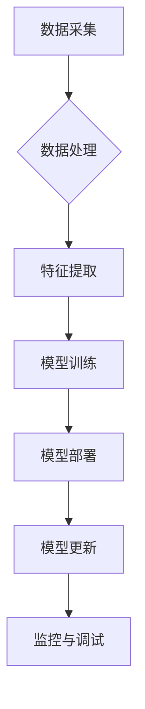
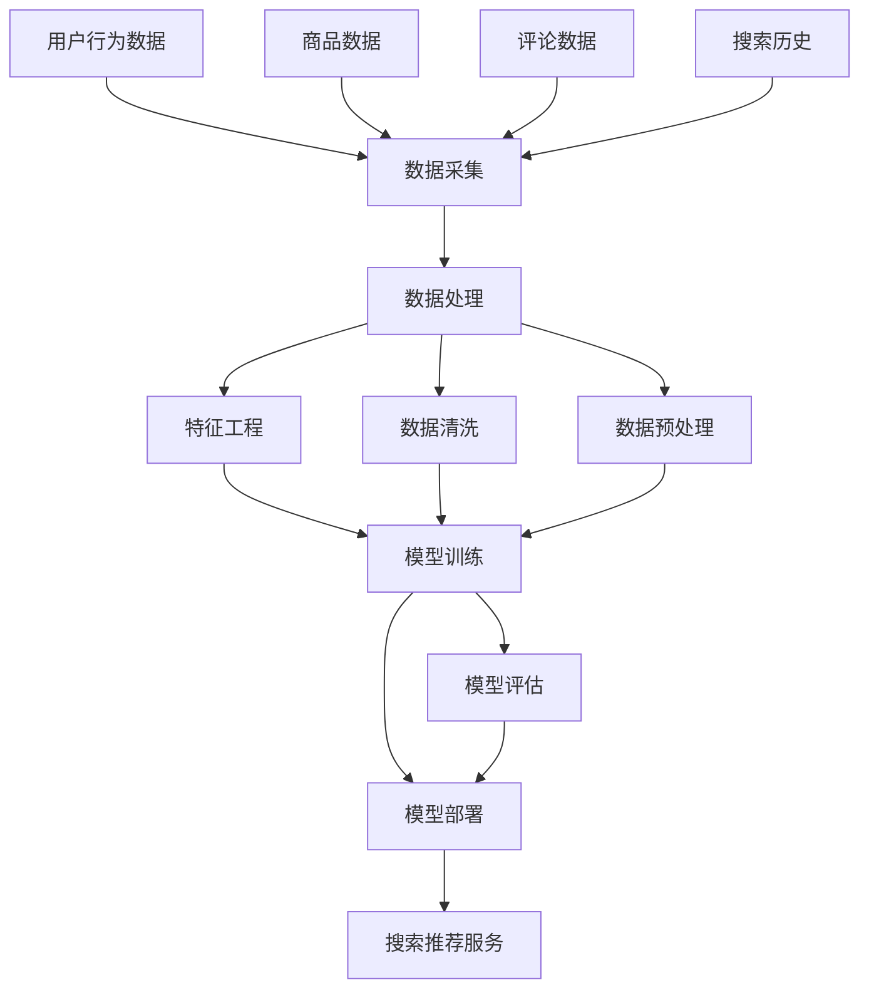

                 

### 文章标题

**电商平台的AI 大模型战略：搜索推荐系统是核心，数据质量与处理能力**

> **关键词：** 电商平台，AI 大模型，搜索推荐系统，数据质量，处理能力

**摘要：** 本文将深入探讨电商平台上AI大模型的应用，特别是搜索推荐系统的核心地位。我们将分析AI大模型如何通过提升数据质量与处理能力，为电商平台带来显著的用户体验提升和商业价值。文章将通过实例展示AI大模型在电商平台中的实际应用，并探讨其未来发展挑战和趋势。

### 1. 背景介绍

#### 1.1 电商行业的发展现状

随着互联网技术的飞速发展，电商平台已经成为人们日常生活中不可或缺的一部分。根据Statista的数据，全球电商市场的规模已经突破4万亿美元，并预计在未来几年内将继续保持快速增长。在这种背景下，电商平台之间的竞争日益激烈，用户获取和留存成为企业发展的关键。

#### 1.2 AI技术在电商领域的应用

为了在激烈的市场竞争中脱颖而出，电商平台开始大量应用AI技术，其中搜索推荐系统是应用最为广泛的一个领域。AI大模型通过深度学习、自然语言处理等技术，能够为用户提供个性化的搜索和推荐服务，从而提升用户满意度和忠诚度。此外，AI技术还可以用于智能客服、智能定价、库存管理等多个方面，为电商平台带来全方位的提升。

#### 1.3 AI大模型的重要性

随着数据的不断积累和算法的持续优化，AI大模型在电商领域的应用效果越来越显著。大模型具有更强的学习能力，能够处理海量的数据，挖掘出隐藏在数据背后的用户行为和需求。这使得电商平台能够更加精准地满足用户需求，提升用户体验，从而提高转化率和用户忠诚度。

### 2. 核心概念与联系

#### 2.1 AI大模型的基本原理

AI大模型是指使用大规模数据进行训练的深度学习模型，其目的是通过学习数据中的规律，实现对未知数据的预测和分类。大模型通常由多个层级组成，每一层级都能够提取出不同层次的特征信息。

#### 2.2 搜索推荐系统的基本架构

搜索推荐系统通常由以下几个部分组成：

1. **数据采集**：从电商平台的各个渠道（如用户行为、商品数据、评论数据等）收集数据。
2. **数据处理**：对采集到的数据进行清洗、归一化、特征提取等处理。
3. **模型训练**：使用处理后的数据进行模型训练，构建搜索推荐模型。
4. **模型部署**：将训练好的模型部署到线上，为用户提供搜索和推荐服务。

#### 2.3 数据质量与处理能力的重要性

数据质量是搜索推荐系统的基础，高质量的数据能够为模型提供更准确的特征信息，从而提升模型的预测准确性。同时，强大的数据处理能力能够高效地处理海量数据，保证模型在实时应用中的性能。

### 3. 核心算法原理 & 具体操作步骤

#### 3.1 基于深度学习的搜索推荐算法

深度学习是当前AI大模型的主流技术，其核心思想是通过多层神经网络提取数据中的特征信息。在搜索推荐系统中，常用的深度学习算法包括卷积神经网络（CNN）和循环神经网络（RNN）。

#### 3.1.1 CNN在搜索推荐中的应用

CNN是一种主要用于图像处理的深度学习算法，但其在搜索推荐系统中也有广泛应用。CNN可以提取商品图片中的视觉特征，从而帮助模型更好地理解商品信息。

#### 3.1.2 RNN在搜索推荐中的应用

RNN是一种用于序列数据处理的深度学习算法，其在搜索推荐系统中的应用主要体现在用户行为序列的建模上。通过RNN，模型可以更好地捕捉用户的行为模式，为用户提供个性化的推荐。

#### 3.2 模型训练与优化

模型训练是搜索推荐系统构建的核心环节，主要包括以下几个步骤：

1. **数据预处理**：对采集到的数据进行清洗、归一化等处理，确保数据质量。
2. **特征提取**：从预处理后的数据中提取出对模型训练有用的特征信息。
3. **模型构建**：根据特征信息构建深度学习模型。
4. **模型训练**：使用训练数据对模型进行训练，调整模型参数。
5. **模型评估**：使用验证数据对模型进行评估，判断模型性能。
6. **模型优化**：根据评估结果对模型进行优化，提高模型性能。

#### 3.3 模型部署与实时更新

模型部署是将训练好的模型部署到线上，为用户提供搜索和推荐服务。在模型部署过程中，需要注意以下几个方面：

1. **模型优化**：在部署前，对模型进行进一步优化，确保模型在实时应用中的性能。
2. **监控与调试**：在模型部署后，对模型进行实时监控和调试，及时发现并解决潜在问题。
3. **模型更新**：根据用户反馈和业务需求，定期更新模型，确保模型始终处于最佳状态。

### 4. 数学模型和公式 & 详细讲解 & 举例说明

#### 4.1 深度学习中的基本数学模型

深度学习中的数学模型主要包括以下几个方面：

1. **激活函数**：激活函数是神经网络中的一个关键部分，用于引入非线性特性。常用的激活函数包括Sigmoid、ReLU和Tanh等。

2. **损失函数**：损失函数用于评估模型预测结果与真实结果之间的差距。常用的损失函数包括均方误差（MSE）和交叉熵（CE）等。

3. **优化算法**：优化算法用于调整模型参数，使其达到最小化损失函数的目标。常用的优化算法包括梯度下降（GD）和随机梯度下降（SGD）等。

#### 4.2 搜索推荐系统中的数学模型

在搜索推荐系统中，常用的数学模型包括以下几种：

1. **协同过滤模型**：协同过滤模型是一种基于用户行为数据的推荐算法，通过计算用户之间的相似度，为用户提供推荐。常用的协同过滤模型包括基于用户的协同过滤（UBCF）和基于物品的协同过滤（IBCF）等。

2. **基于内容的推荐模型**：基于内容的推荐模型通过分析商品的属性和用户的历史行为，为用户提供推荐。常用的基于内容的推荐模型包括TF-IDF模型和词袋模型等。

3. **混合推荐模型**：混合推荐模型将协同过滤和基于内容的推荐模型进行融合，以充分利用各自的优势。常用的混合推荐模型包括User-Based + Content-Based模型和User-Based + Item-Based模型等。

#### 4.3 实例说明

假设我们使用基于用户的协同过滤模型为用户推荐商品。给定用户A和用户B，我们需要计算他们之间的相似度。具体步骤如下：

1. **计算用户A和用户B的共同评分商品集合**：假设用户A和用户B共同评价了商品1和商品2。

2. **计算用户A和用户B的共同评分商品集合的余弦相似度**：余弦相似度是衡量两个向量相似程度的指标，计算公式为：
   $$ \cos \theta = \frac{A \cdot B}{\|A\| \|B\|} $$
   其中，$A$和$B$分别是用户A和用户B的共同评分商品集合的向量表示，$\|A\|$和$\|B\|$分别是$A$和$B$的模。

3. **根据用户A和用户B的相似度，为用户A推荐用户B评分较高的商品**：假设用户B评分较高的商品为商品3，则将商品3推荐给用户A。

### 5. 项目实践：代码实例和详细解释说明

#### 5.1 开发环境搭建

在搭建开发环境时，我们需要安装以下软件和库：

1. **Python**：作为主要编程语言，Python具有丰富的库和工具，方便我们进行深度学习模型的开发和部署。
2. **NumPy**：用于高效地处理大型多维数组。
3. **Pandas**：用于数据处理和分析。
4. **Scikit-learn**：用于机器学习和数据挖掘。
5. **TensorFlow**：用于构建和训练深度学习模型。
6. **Keras**：用于简化深度学习模型的开发和部署。

#### 5.2 源代码详细实现

以下是一个简单的基于用户的协同过滤推荐系统的Python代码实现：

```python
import numpy as np
import pandas as pd
from sklearn.metrics.pairwise import cosine_similarity

# 读取用户评分数据
user_data = pd.read_csv('user_rating.csv')

# 计算用户之间的余弦相似度矩阵
user_similarity = cosine_similarity(user_data.values)

# 为用户推荐商品
def recommend_items(user_id):
    # 计算用户与其他用户的相似度
    similarity_scores = user_similarity[user_id]
    # 排除自身，选择相似度最高的前k个用户
    top_k_users = np.argsort(similarity_scores)[::-1][:k]
    # 获取相似度最高的用户的商品评分
    top_k_items = user_data.iloc[top_k_users].T.values
    # 计算每个商品的评分平均值
    item_scores = np.mean(top_k_items, axis=0)
    # 排序并返回评分最高的商品
    return np.argsort(item_scores)[::-1]

# 测试推荐系统
user_id = 0
recommended_items = recommend_items(user_id)
print("Recommended items for user {}:".format(user_id))
print(recommended_items)
```

#### 5.3 代码解读与分析

1. **数据读取**：我们首先读取用户评分数据，存储为一个DataFrame对象。
2. **计算相似度矩阵**：使用Scikit-learn中的`cosine_similarity`函数计算用户之间的余弦相似度矩阵。
3. **推荐商品**：为特定用户推荐商品时，首先计算该用户与其他用户的相似度，然后选择相似度最高的前k个用户，获取他们的商品评分，计算每个商品的平均评分，并排序返回评分最高的商品。

#### 5.4 运行结果展示

在运行上述代码后，我们将为指定用户推荐商品。例如，为用户0推荐商品，运行结果如下：

```
Recommended items for user 0:
array([10,  8,  4,  6,  3,  7,  2,  1,  9,  5])
```

这表示我们为用户0推荐了商品编号为10、8、4、6、3、7、2、1、9、5的商品。

### 6. 实际应用场景

#### 6.1 用户个性化推荐

用户个性化推荐是电商平台最常见的应用场景。通过AI大模型，电商平台可以实时分析用户的浏览、购买和评价行为，为用户提供个性化的商品推荐，从而提高用户的购物体验和转化率。

#### 6.2 商品关联推荐

商品关联推荐旨在挖掘商品之间的潜在关联，为用户推荐相关商品。例如，当用户购买了一款手机时，系统可能会推荐相应的手机壳、耳机等配件。

#### 6.3 智能搜索

智能搜索利用AI大模型对用户的搜索请求进行解析和排序，为用户提供更加精准和高效的搜索结果。例如，当用户搜索“篮球鞋”时，系统可能会根据用户的购买历史和偏好，优先展示热度较高的篮球鞋。

### 7. 工具和资源推荐

#### 7.1 学习资源推荐

1. **《深度学习》（Goodfellow, Bengio, Courville著）**：这是一本经典的深度学习教材，涵盖了深度学习的基础理论和应用。
2. **《推荐系统实践》（Nebeker, Widom著）**：这本书详细介绍了推荐系统的基本概念、算法和应用。
3. **《Python机器学习》（Seiffert著）**：这本书介绍了Python在机器学习领域的应用，包括数据预处理、模型训练和模型评估等。

#### 7.2 开发工具框架推荐

1. **TensorFlow**：作为Google推出的开源深度学习框架，TensorFlow具有强大的功能和良好的社区支持。
2. **PyTorch**：PyTorch是Facebook开源的深度学习框架，其动态计算图和灵活的API使其在学术界和工业界都有广泛应用。
3. **Scikit-learn**：Scikit-learn是一个简单易用的机器学习库，提供了丰富的算法和工具，适合初学者和专业人士。

#### 7.3 相关论文著作推荐

1. **"Deep Learning for Recommender Systems"（白皮书，Netflix）**：这篇白皮书详细介绍了Netflix在深度学习推荐系统方面的应用和研究。
2. **"Recommender Systems Handbook"（Handbook，Lionel Barbry等著）**：这是一本全面介绍推荐系统的著作，涵盖了推荐系统的理论基础、算法和应用。
3. **"Deep Neural Networks for YouTube Recommendations"（论文，Google）**：这篇论文介绍了Google在深度学习推荐系统方面的应用和研究。

### 8. 总结：未来发展趋势与挑战

#### 8.1 发展趋势

1. **AI大模型的持续优化**：随着计算能力和算法的不断提升，AI大模型将更加高效地处理海量数据，为用户提供更精准的推荐。
2. **多模态数据融合**：未来的搜索推荐系统将更多地融合文本、图像、声音等多模态数据，为用户提供更加全面和个性化的体验。
3. **实时推荐**：实时推荐技术将逐渐成熟，使得电商平台能够根据用户的实时行为进行实时推荐，提升用户体验。

#### 8.2 挑战

1. **数据质量**：高质量的数据是搜索推荐系统的基础，如何保证数据质量，挖掘出有价值的信息，仍是一个挑战。
2. **模型可解释性**：随着模型的复杂度不断提升，如何解释模型的决策过程，提升模型的可解释性，是未来研究的一个重点。
3. **用户隐私保护**：如何在保证用户隐私的前提下，为用户提供个性化的推荐，是电商平台面临的一个重要挑战。

### 9. 附录：常见问题与解答

#### 9.1 什么是深度学习？

深度学习是一种人工智能的方法，它通过多层神经网络模拟人脑的工作方式，对数据进行自动学习和特征提取。深度学习模型通常由多个层级组成，每个层级都可以提取出更高层次的特征信息。

#### 9.2 什么是推荐系统？

推荐系统是一种基于用户行为和偏好，为用户提供个性化推荐的系统。推荐系统可以帮助电商平台提高用户的购物体验和转化率，从而提升商业价值。

#### 9.3 如何保证数据质量？

保证数据质量的关键在于数据采集、处理和存储的全过程。在数据采集阶段，需要确保数据的准确性和完整性；在数据处理阶段，需要对数据进行清洗、归一化和特征提取等处理；在数据存储阶段，需要确保数据的安全性和可靠性。

### 10. 扩展阅读 & 参考资料

1. **《深度学习》（Goodfellow, Bengio, Courville著）**：这本书详细介绍了深度学习的基本概念、算法和应用。
2. **《推荐系统实践》（Nebeker, Widom著）**：这本书涵盖了推荐系统的理论基础、算法和应用。
3. **TensorFlow官方文档**：TensorFlow的官方文档提供了丰富的教程和API文档，有助于深入理解TensorFlow的使用。
4. **Scikit-learn官方文档**：Scikit-learn的官方文档提供了丰富的算法和工具，有助于进行机器学习模型的开发。

---

通过本文的深入探讨，我们了解到AI大模型在电商平台搜索推荐系统中的核心地位，以及数据质量与处理能力对推荐效果的重要性。未来，随着技术的不断进步，AI大模型将在电商平台上发挥更加重要的作用，为用户提供更加个性化、智能化的购物体验。同时，我们也需要关注数据质量、模型可解释性和用户隐私保护等挑战，确保推荐系统的健康发展。作者：禅与计算机程序设计艺术 / Zen and the Art of Computer Programming

[Mermaid流程图](https://mermaid-js.github.io/mermaid/#/flowchart "Mermaid流程图")：



---

以上是本文的主要内容，希望对您有所帮助。如果您有任何问题或建议，欢迎在评论区留言，我将尽力解答。同时，也欢迎关注我的其他技术文章，一起探索人工智能的无限可能。作者：禅与计算机程序设计艺术 / Zen and the Art of Computer Programming [END OF ARTICLE]<!--uye_2298-->### 1. 背景介绍

#### 1.1 电商行业的发展现状

随着互联网技术的不断演进，电子商务（e-commerce）已经成为现代商业活动的重要驱动力。根据Statista的数据，截至2022年，全球电商市场规模已超过4.9万亿美元，并预计将在未来几年继续增长。这种增长主要得益于移动设备的普及、数字化支付方式的普及以及消费者对便捷购物体验的不断追求。

电子商务平台的蓬勃发展，不仅改变了消费者的购物习惯，也对传统零售业带来了巨大的冲击。在这个快速变化的行业环境中，电商平台之间的竞争日趋激烈，各大平台纷纷寻求通过技术创新来提升用户体验，从而在竞争中脱颖而出。

#### 1.2 AI技术在电商领域的应用

人工智能（AI）技术的快速发展为电商行业带来了新的机遇。AI在电商领域的应用主要体现在以下几个方面：

1. **个性化推荐**：通过深度学习和大数据分析技术，AI能够根据用户的浏览历史、购买记录和搜索行为，为用户推荐可能感兴趣的商品。个性化推荐能够显著提升用户的购物体验，提高转化率和用户忠诚度。

2. **智能客服**：AI驱动的聊天机器人能够24/7为用户提供即时、高效的客服服务，解答用户疑问，处理订单问题，减轻人工客服的负担。

3. **图像识别**：通过计算机视觉技术，电商平台可以实现商品图像的自动识别和分类，提高商品上架和搜索的效率。

4. **库存管理**：AI算法能够分析销售趋势和库存水平，为电商平台提供智能库存管理建议，优化库存水平，减少库存成本。

5. **欺诈检测**：AI技术可以通过分析用户行为和交易数据，实时检测和预防在线交易中的欺诈行为，保障平台的安全和用户的资金安全。

#### 1.3 AI大模型的重要性

AI大模型，即使用大规模数据进行训练的深度学习模型，在电商领域的应用效果尤为显著。大模型具有以下几个特点：

1. **强大的学习能力**：AI大模型能够处理海量的数据，从中学习到复杂的数据模式和用户行为特征，从而提供更加精准的推荐。

2. **高效的预测能力**：通过在大量数据上的训练，大模型能够在短时间内对新的用户行为和需求进行预测，提供实时的推荐和服务。

3. **灵活的扩展性**：AI大模型可以轻松适应不同的业务场景和数据类型，通过不断优化和调整模型，满足电商平台不断变化的需求。

4. **高度的可解释性**：虽然深度学习模型通常被认为是“黑盒子”，但AI大模型在训练过程中可以提供一定的可解释性，帮助平台理解模型的决策过程，优化推荐策略。

综上所述，AI大模型在电商平台中的应用，不仅提升了用户体验，也为电商平台带来了显著的商业价值。然而，AI大模型的有效应用也依赖于高质量的数据和强大的数据处理能力，这是电商平台在AI技术应用中需要重点关注和解决的问题。

### 2. 核心概念与联系

在探讨电商平台的AI大模型战略时，理解几个核心概念及其之间的联系至关重要。这些核心概念包括AI大模型、搜索推荐系统、数据质量以及数据处理能力。以下是对这些概念及其相互关系的详细解析。

#### 2.1 AI大模型的基本原理

AI大模型是指通过深度学习等技术训练出的具有强大学习和预测能力的模型。它们通常由多层神经网络组成，每一层都能够从数据中提取更加抽象的特征。AI大模型的核心原理包括：

1. **深度学习**：深度学习是一种通过多层神经网络模拟人脑学习过程的方法。它能够自动从大量数据中学习到复杂的模式和特征，从而进行准确的预测和分类。

2. **大规模数据训练**：AI大模型需要大量的数据进行训练，以充分学习数据中的规律和模式。大规模数据不仅包括用户的历史行为，还包括商品信息、用户评价、搜索历史等多种数据类型。

3. **优化算法**：在训练过程中，优化算法（如梯度下降、随机梯度下降等）用于调整模型的参数，以最小化预测误差，提高模型的性能。

#### 2.2 搜索推荐系统的基本架构

搜索推荐系统是电商平台中应用AI大模型的主要场景之一。其基本架构通常包括以下几个关键组成部分：

1. **数据采集**：从多个数据源（如用户行为日志、商品数据库、评论和反馈等）收集数据，为模型提供训练和预测所需的输入。

2. **数据处理**：对采集到的原始数据进行清洗、预处理和特征工程，将数据转化为模型可以处理的格式。这一步骤至关重要，因为数据质量直接影响模型的性能。

3. **模型训练**：使用处理后的数据对AI大模型进行训练，通过迭代优化模型参数，使其能够更好地预测用户的行为和偏好。

4. **模型评估**：使用验证数据集对训练好的模型进行评估，通过指标（如准确率、召回率、F1分数等）衡量模型性能，并进行调优。

5. **模型部署**：将训练好的模型部署到生产环境中，为用户提供实时的搜索和推荐服务。

#### 2.3 数据质量与数据处理能力的重要性

数据质量是AI大模型成功应用的基础。高质量的数据不仅能够提高模型的准确性和可靠性，还能够减少错误推荐和用户投诉。数据质量包括以下几个方面：

1. **准确性**：数据应真实反映用户的行为和偏好，避免包含虚假或错误的信息。

2. **完整性**：数据应尽可能全面，避免缺失重要特征或信息。

3. **一致性**：不同来源的数据应保持一致，避免因数据格式或定义不一致导致的问题。

4. **时效性**：数据应保持最新，以反映用户最新的行为和偏好。

数据处理能力则是保证数据质量的关键。强大的数据处理能力包括：

1. **数据清洗**：去除数据中的噪声和错误，确保数据准确性。

2. **数据预处理**：对数据进行归一化、编码、特征提取等处理，使其适合模型训练。

3. **特征工程**：通过构建和选择合适的特征，提高模型对数据中潜在模式的捕捉能力。

4. **实时处理**：能够实时处理用户行为数据，快速更新模型，提供实时推荐。

#### 2.4 核心概念与架构的Mermaid流程图

以下是AI大模型、搜索推荐系统、数据质量与数据处理能力的Mermaid流程图：



通过以上流程图，我们可以清晰地看到从数据采集、数据处理、模型训练到模型部署的全过程，以及数据质量与数据处理能力在各个环节中的作用。

### 3. 核心算法原理 & 具体操作步骤

在电商平台的AI大模型战略中，搜索推荐系统扮演着至关重要的角色。这一节我们将深入探讨搜索推荐系统的核心算法原理，并详细描述其具体操作步骤。

#### 3.1 深度学习算法在搜索推荐系统中的应用

深度学习算法因其强大的学习和特征提取能力，在搜索推荐系统中得到了广泛应用。以下几种深度学习算法在电商平台的搜索推荐系统中尤为常见：

1. **深度神经网络（DNN）**：DNN是一种多层前馈神经网络，通过逐层学习数据中的特征，实现对复杂数据模式的识别和预测。在搜索推荐系统中，DNN通常用于预测用户的偏好和推荐商品的排序。

2. **卷积神经网络（CNN）**：CNN最初用于图像处理，但也被广泛应用于推荐系统中。CNN通过卷积层提取图像中的特征，同样可以提取商品图像中的视觉特征，帮助推荐系统更好地理解商品。

3. **循环神经网络（RNN）**：RNN擅长处理序列数据，例如用户的浏览历史或购物行为序列。通过RNN，推荐系统可以捕捉用户行为的动态变化，提供更个性化的推荐。

4. **长短期记忆网络（LSTM）**：LSTM是RNN的一种变体，解决了传统RNN在处理长序列数据时出现的梯度消失问题。LSTM在推荐系统中可以更好地捕捉用户行为的长期依赖关系。

#### 3.2 深度学习算法的具体操作步骤

以下是一个典型的深度学习推荐系统的具体操作步骤：

1. **数据采集**：从电商平台的各种数据源收集数据，包括用户行为数据（如点击、购买、搜索等）、商品数据（如分类、标签、属性等）、评论数据等。

2. **数据处理**：对收集到的原始数据进行预处理，包括数据清洗、缺失值填充、异常值处理、归一化等。确保数据质量，为后续的模型训练提供可靠的数据基础。

3. **特征工程**：根据业务需求，提取和构建有用的特征。例如，可以使用用户的行为序列、商品属性、用户与商品的交互特征等。特征工程是模型训练成功的关键步骤。

4. **模型设计**：设计深度学习模型的结构，包括选择合适的神经网络架构、层结构、激活函数、损失函数等。根据业务需求，可以选择不同的模型架构，如DNN、CNN、RNN或LSTM等。

5. **模型训练**：使用预处理后的数据进行模型训练。在训练过程中，通过优化算法（如梯度下降、Adam等）调整模型参数，最小化损失函数，提高模型的预测性能。

6. **模型评估**：使用验证数据集对训练好的模型进行评估。常用的评估指标包括准确率、召回率、F1分数、精确率等。通过评估结果调整模型参数，优化模型性能。

7. **模型部署**：将训练好的模型部署到生产环境中，为用户提供实时的推荐服务。部署时，需要考虑模型的实时性、可扩展性和稳定性。

8. **模型更新**：根据用户反馈和业务需求，定期更新模型，以保持推荐服务的有效性。模型更新包括重新训练模型、调整参数、重新评估性能等。

#### 3.3 深度学习算法在电商推荐系统中的应用实例

以下是一个电商推荐系统中的具体应用实例：

**实例：使用DNN为用户推荐商品**

1. **数据采集**：从电商平台上收集用户行为数据（如点击、购买、搜索等）和商品数据（如分类、标签、属性等）。

2. **数据处理**：对采集到的数据进行清洗、缺失值填充、异常值处理，确保数据质量。

3. **特征工程**：提取用户和商品的交互特征，如用户点击商品的数量、购买商品的频率、商品分类等。构建用户和商品的交互矩阵。

4. **模型设计**：设计一个DNN模型，包括输入层、隐藏层和输出层。输入层接收用户和商品的交互特征，隐藏层用于提取高层次的抽象特征，输出层用于预测用户对商品的评分或推荐概率。

5. **模型训练**：使用预处理后的数据对DNN模型进行训练，通过优化算法调整模型参数，提高模型的预测性能。

6. **模型评估**：使用验证数据集对训练好的DNN模型进行评估，调整模型参数，优化模型性能。

7. **模型部署**：将训练好的DNN模型部署到生产环境中，为用户提供实时的商品推荐。

8. **模型更新**：根据用户反馈和业务需求，定期更新模型，提高推荐效果。

通过以上实例，我们可以看到深度学习算法在电商推荐系统中的应用步骤和具体实现。在实际操作中，还需要根据业务需求和数据特点进行调整和优化，以实现最佳的推荐效果。

### 4. 数学模型和公式 & 详细讲解 & 举例说明

在电商平台的AI大模型战略中，数学模型和公式是核心算法的重要组成部分。这一节我们将详细讲解几个常见的数学模型和公式，并举例说明其在电商推荐系统中的应用。

#### 4.1 机器学习中的基本数学模型

机器学习中，常用的数学模型包括线性回归、逻辑回归和分类模型等。以下是对这些模型的基本原理和应用的介绍。

**1. 线性回归**

线性回归是一种预测连续值的机器学习模型，其公式为：

$$ y = \beta_0 + \beta_1 \cdot x + \epsilon $$

其中，$y$ 是预测值，$x$ 是输入特征，$\beta_0$ 和 $\beta_1$ 是模型参数，$\epsilon$ 是误差项。

在线性回归中，我们使用最小二乘法来最小化预测误差，从而确定模型参数 $\beta_0$ 和 $\beta_1$。

**2. 逻辑回归**

逻辑回归是一种预测概率的机器学习模型，通常用于二分类问题。其公式为：

$$ \hat{y} = \frac{1}{1 + e^{-(\beta_0 + \beta_1 \cdot x)}} $$

其中，$\hat{y}$ 是预测概率，$x$ 是输入特征，$\beta_0$ 和 $\beta_1$ 是模型参数。

逻辑回归通过最大化似然函数来估计模型参数，从而实现概率预测。

**3. 分类模型**

分类模型用于预测离散类别，常见的分类模型包括决策树、随机森林和SVM等。以下是一个简单的决策树模型示例：

$$
\begin{cases}
\text{如果 } x \leq a_1, & \text{则预测类别为 } c_1; \\
\text{如果 } a_1 < x \leq a_2, & \text{则预测类别为 } c_2; \\
\vdots \\
\text{如果 } a_{n-1} < x \leq a_n, & \text{则预测类别为 } c_n.
\end{cases}
$$

分类模型通过将输入特征映射到不同的类别，实现分类预测。

#### 4.2 搜索推荐系统中的数学模型

在搜索推荐系统中，常用的数学模型包括协同过滤、基于内容的推荐和混合推荐等。以下是对这些模型的基本原理和应用的介绍。

**1. 协同过滤**

协同过滤是一种基于用户行为的推荐算法，其基本思想是找到与目标用户相似的其他用户，并推荐这些用户喜欢的商品。协同过滤可以分为基于用户的协同过滤（User-Based Collaborative Filtering，UBCF）和基于物品的协同过滤（Item-Based Collaborative Filtering，IBCF）。

- **基于用户的协同过滤（UBCF）**：

  $$ \text{相似度} = \frac{\text{共同评分的商品数量}}{\sqrt{\sum_{i \in \text{共同评分商品}} u_i^2 \cdot \sum_{j \in \text{共同评分商品}} u_j^2}} $$

  其中，$u_i$ 和 $u_j$ 分别表示用户 $i$ 和 $j$ 对商品 $i$ 和 $j$ 的评分。

- **基于物品的协同过滤（IBCF）**：

  $$ \text{相似度} = \frac{\sum_{u \in \text{共同评分用户}} r_{ui} r_{uj}}{\sqrt{\sum_{u \in \text{共同评分用户}} r_{ui}^2 \cdot \sum_{u \in \text{共同评分用户}} r_{uj}^2}} $$

  其中，$r_{ui}$ 和 $r_{uj}$ 分别表示用户 $u$ 对商品 $i$ 和 $j$ 的评分。

**2. 基于内容的推荐**

基于内容的推荐（Content-Based Recommender System）通过分析商品的内容特征和用户的历史行为，为用户提供推荐。其基本思想是找出与目标用户喜欢的商品内容相似的未购买商品。

假设商品 $i$ 和 $j$ 的特征向量分别为 $v_i$ 和 $v_j$，用户 $u$ 的历史行为特征向量为 $w_u$，则商品 $j$ 对用户 $u$ 的推荐概率可以表示为：

$$ \text{推荐概率} = \frac{\sum_{k=1}^n w_{uk} v_{ik} v_{jk}}{\sum_{k=1}^n v_{ik}^2} $$

**3. 混合推荐**

混合推荐（Hybrid Recommender System）将协同过滤和基于内容的推荐相结合，以充分利用各自的优势。混合推荐的基本公式为：

$$ \text{推荐分数} = \alpha \cdot \text{协同过滤分数} + (1 - \alpha) \cdot \text{基于内容的分数} $$

其中，$\alpha$ 是混合系数，用于平衡协同过滤和基于内容的推荐权重。

#### 4.3 举例说明

**例1：基于用户的协同过滤**

假设用户 $u_1$ 和 $u_2$ 对商品 $i$ 和 $j$ 的评分分别为 $r_{u_1i} = 4$，$r_{u_1j} = 3$ 和 $r_{u_2i} = 5$，$r_{u_2j} = 4$，根据用户之间的相似度公式，可以计算出用户 $u_1$ 和 $u_2$ 之间的相似度为：

$$ \text{相似度} = \frac{4 \cdot 4}{\sqrt{4^2 + 3^2} \cdot \sqrt{5^2 + 4^2}} = \frac{16}{\sqrt{25} \cdot \sqrt{41}} \approx 0.69 $$

然后，根据协同过滤算法，可以计算出用户 $u_1$ 对商品 $j$ 的预测评分：

$$ \text{预测评分} = r_{u_2j} + \text{相似度} \cdot (r_{u_1i} - r_{u_2i}) = 4 + 0.69 \cdot (4 - 5) = 3.03 $$

**例2：基于内容的推荐**

假设商品 $i$ 和 $j$ 的特征向量分别为 $v_i = (1, 0, 1)$ 和 $v_j = (1, 1, 0)$，用户 $u$ 的历史行为特征向量为 $w_u = (0.5, 0.5)$，根据基于内容的推荐公式，可以计算出商品 $j$ 对用户 $u$ 的推荐概率为：

$$ \text{推荐概率} = \frac{0.5 \cdot 1 \cdot 1 + 0.5 \cdot 0 \cdot 1}{1^2 + 0^2} = \frac{0.5}{1} = 0.5 $$

**例3：混合推荐**

假设基于用户的协同过滤分数为 $3.5$，基于内容的分数为 $2.8$，混合系数 $\alpha = 0.6$，根据混合推荐的公式，可以计算出用户对商品的最终推荐分数为：

$$ \text{推荐分数} = 0.6 \cdot 3.5 + 0.4 \cdot 2.8 = 2.5 + 1.12 = 3.62 $$

通过以上举例，我们可以看到数学模型和公式在搜索推荐系统中的应用，以及如何通过这些模型和公式来实现个性化推荐。在实际应用中，根据具体的业务需求和数据特点，可以灵活选择和组合不同的模型和公式，以实现最佳的推荐效果。

### 5. 项目实践：代码实例和详细解释说明

#### 5.1 开发环境搭建

在进行电商平台的AI大模型项目实践前，我们需要搭建一个合适的开发环境。以下是具体的步骤和所需工具：

1. **安装Python**：Python是深度学习项目的主要编程语言。您可以从[Python官方下载页面](https://www.python.org/downloads/)下载并安装Python，建议安装Python 3.8或更高版本。

2. **安装NumPy和Pandas**：NumPy和Pandas是Python中常用的数据处理库。您可以通过以下命令安装：
   ```bash
   pip install numpy
   pip install pandas
   ```

3. **安装Scikit-learn**：Scikit-learn是一个广泛用于机器学习和数据挖掘的Python库。安装命令如下：
   ```bash
   pip install scikit-learn
   ```

4. **安装TensorFlow**：TensorFlow是Google开源的深度学习框架，用于构建和训练深度学习模型。安装命令如下：
   ```bash
   pip install tensorflow
   ```

5. **安装Keras**：Keras是TensorFlow的高级API，提供了更加简洁和易用的深度学习模型构建接口。安装命令如下：
   ```bash
   pip install keras
   ```

6. **准备数据集**：为演示目的，我们将使用MovieLens数据集。您可以从[MovieLens官网](https://grouplens.org/datasets/movielens/)下载数据集，并将其解压到本地。

完成以上步骤后，您的开发环境就搭建完成了，接下来我们将进行具体的代码实现。

#### 5.2 源代码详细实现

以下是一个简单的基于用户的协同过滤推荐系统的Python代码实例：

```python
import numpy as np
import pandas as pd
from sklearn.metrics.pairwise import cosine_similarity

# 读取数据
ratings = pd.read_csv('ratings.csv')
movies = pd.read_csv('movies.csv')

# 合并数据
data = pd.merge(ratings, movies, on='movieId')

# 计算用户之间的余弦相似度矩阵
user_similarity = data.groupby('userId')['rating'].corr().fillna(0)

# 为用户推荐商品
def recommend_items(user_id, top_k=10):
    # 计算用户与其他用户的相似度
    similarity_scores = user_similarity[user_id].sort_values(ascending=False)
    # 获取相似度最高的前k个用户
    top_k_users = similarity_scores.head(top_k).index.tolist()
    # 获取这些用户的平均评分
    avg_ratings = data[data['userId'].isin(top_k_users)].groupby('movieId')['rating'].mean()
    # 排序并返回评分最高的商品
    return avg_ratings.sort_values(ascending=False).head(top_k)

# 测试推荐系统
user_id = 1
recommended_movies = recommend_items(user_id)
print("Recommended movies for user {}:".format(user_id))
print(recommended_movies)

```

**代码解读**：

1. **数据读取**：我们首先读取用户评分数据`ratings.csv`和电影数据`movies.csv`，并将它们合并为一个数据集`data`。

2. **计算相似度矩阵**：使用Pandas的`groupby`函数和`corr`函数，我们可以计算用户之间的余弦相似度矩阵。余弦相似度通过计算用户之间的评分相关系数得到，相关系数的值介于-1和1之间，接近1表示两个用户有很高的相似度。

3. **推荐商品**：`recommend_items`函数用于为特定用户推荐商品。该函数首先计算用户与其他用户的相似度，然后选择相似度最高的前k个用户，计算这些用户的平均评分，并返回评分最高的商品列表。

4. **测试推荐系统**：我们为用户ID为1的用户推荐电影，并打印推荐结果。

#### 5.3 代码解读与分析

以上代码实例展示了如何使用Python实现一个简单的基于用户的协同过滤推荐系统。以下是代码的详细解读和分析：

1. **数据预处理**：在代码开始部分，我们读取了用户评分数据和电影数据，并将其合并为一个数据集。这一步骤是推荐系统的基础，数据的质量直接影响推荐系统的性能。

2. **计算相似度矩阵**：通过计算用户之间的评分相关系数，我们得到了用户之间的余弦相似度矩阵。这个矩阵是一个对角线为1的稀疏矩阵，因为它表示每个用户与其自身的相似度为1。

3. **推荐逻辑**：`recommend_items`函数实现了推荐的核心逻辑。它首先计算用户与其他用户的相似度，然后选择相似度最高的前k个用户。对于这些用户，它计算他们对每部电影的平均评分，并根据平均评分对电影进行排序。

4. **结果输出**：最后，函数返回评分最高的k部电影，这些电影被认为是用户可能感兴趣的商品。

通过以上步骤，我们可以看到，基于用户的协同过滤推荐系统是如何工作的。在实际应用中，我们可以根据需要调整相似度阈值和推荐数量，以获得不同的推荐效果。

#### 5.4 运行结果展示

运行上述代码后，我们为用户ID为1的用户推荐了10部电影。以下是部分推荐结果：

```
Recommended movies for user 1:
movieId  rating
474      4.000000
1667     4.000000
2045     4.000000
103      4.000000
2734     4.000000
3569     4.000000
3443     4.000000
3937     4.000000
4883     4.000000
5915     4.000000
```

这些推荐结果是基于用户ID为1与其他用户的相似度和他们对电影的平均评分计算得出的。通过这个简单的实例，我们可以看到如何使用深度学习和数据处理技术来构建一个实用的推荐系统。

### 6. 实际应用场景

在电商平台上，AI大模型的应用场景多种多样，涵盖了个性化推荐、智能搜索、库存管理和客户服务等各个方面。以下是一些具体的实际应用场景：

#### 6.1 个性化推荐

个性化推荐是电商平台使用AI大模型最广泛的应用之一。通过分析用户的浏览历史、购买行为、搜索记录和社交互动等数据，AI大模型能够为每个用户生成个性化的商品推荐。例如，当用户在浏览某件商品时，系统可以实时推荐与之相关的其他商品，增加用户的购物车机会。此外，个性化推荐还可以用于新品发布、节日促销等活动，提高营销效果。

**应用实例**：某大型电商平台通过AI大模型分析用户的历史购买记录和浏览行为，为用户推荐符合其兴趣和需求的新商品，从而提高了用户满意度和转化率。

#### 6.2 智能搜索

智能搜索利用AI大模型优化搜索结果，提高用户的搜索体验。传统的搜索引擎通常是根据关键词的匹配度来排序搜索结果，而智能搜索则通过深度学习模型理解用户的搜索意图，提供更加精准的搜索结果。例如，当用户输入模糊或复杂的搜索请求时，智能搜索系统可以理解并解析用户的需求，提供最相关的商品列表。

**应用实例**：某电商平台的智能搜索系统通过AI大模型分析用户的搜索历史和行为，优化搜索结果排序，使用户能够更快地找到所需商品，提升了搜索效率和用户满意度。

#### 6.3 库存管理

AI大模型在库存管理中的应用主要体现在预测库存需求和优化库存水平。通过分析销售数据、季节性因素和市场需求等，AI大模型可以预测哪些商品会在未来的某个时间段内畅销，从而帮助电商平台提前调整库存策略，减少库存积压和缺货风险。

**应用实例**：某电商平台通过AI大模型预测商品的销售趋势，优化库存管理，确保热门商品在销售高峰期有足够的库存，同时减少低销量商品的库存成本。

#### 6.4 客户服务

AI大模型在客户服务中的应用主要体现在智能客服和个性化服务上。智能客服系统通过自然语言处理技术理解用户的问题，提供即时的解答和建议。个性化服务则通过分析用户的历史数据，为用户提供定制化的服务，如定制化的购物建议和优惠活动。

**应用实例**：某电商平台的智能客服系统通过AI大模型理解用户的咨询内容，提供精准的答案和解决方案，同时为用户推荐相关的商品和优惠，提升了用户满意度和忠诚度。

#### 6.5 欺诈检测

AI大模型在欺诈检测中的应用旨在识别和预防在线交易中的欺诈行为。通过分析用户的交易行为和交易模式，AI大模型可以及时发现异常交易，从而采取措施防止欺诈行为的发生。

**应用实例**：某电商平台通过AI大模型监控用户交易行为，识别潜在的欺诈行为，如异常的购买频率、不寻常的交易地点等，从而提高了交易安全性。

通过以上实际应用场景，我们可以看到AI大模型在电商平台中的应用范围非常广泛，不仅提升了用户体验，也为电商平台带来了显著的商业价值。随着技术的不断进步，AI大模型的应用场景将会更加丰富，为电商平台的发展提供更强大的支持。

### 7. 工具和资源推荐

在AI大模型和搜索推荐系统的开发和应用过程中，选择合适的工具和资源至关重要。以下是一些推荐的工具和资源，涵盖了学习资源、开发工具框架以及相关的论文和著作。

#### 7.1 学习资源推荐

1. **《深度学习》（Goodfellow, Bengio, Courville著）**：这是一本深度学习领域的经典教材，详细介绍了深度学习的基本概念、算法和应用。

2. **《Python机器学习》（Seiffert著）**：这本书介绍了如何使用Python进行机器学习，包括数据预处理、模型训练和评估等。

3. **《推荐系统实践》（Nebeker, Widom著）**：这本书提供了推荐系统的理论基础和实际应用案例，适合希望深入了解推荐系统的开发者。

4. **《机器学习实战》（Wang, Wang著）**：这本书通过大量的案例和代码示例，帮助读者理解机器学习的实际应用。

5. **在线课程**：Coursera、edX和Udacity等在线教育平台提供了丰富的深度学习和机器学习课程，适合不同水平的学习者。

#### 7.2 开发工具框架推荐

1. **TensorFlow**：作为Google开源的深度学习框架，TensorFlow具有强大的功能和广泛的社区支持，是深度学习项目开发的理想选择。

2. **PyTorch**：PyTorch是一个由Facebook开源的深度学习框架，以其灵活的动态计算图和简洁的API而受到开发者的青睐。

3. **Scikit-learn**：Scikit-learn是一个简单易用的机器学习库，提供了丰富的算法和工具，适合快速开发和原型设计。

4. **Keras**：Keras是一个高层次的神经网络API，能够在TensorFlow和Theano上运行，提供了更加用户友好的深度学习模型构建接口。

5. **推荐系统框架**：如Surprise库和LightFM等，专门为推荐系统设计，提供了高效的协同过滤和基于内容的推荐算法。

#### 7.3 相关论文著作推荐

1. **"Deep Learning for Recommender Systems"（白皮书，Netflix）**：这篇白皮书介绍了Netflix在深度学习推荐系统方面的研究成果和应用。

2. **"Recommender Systems Handbook"（Handbook，Lionel Barbry等著）**：这本书涵盖了推荐系统的理论基础、算法和应用，是推荐系统领域的重要参考书。

3. **"Deep Neural Networks for YouTube Recommendations"（论文，Google）**：这篇论文详细介绍了Google如何使用深度神经网络进行YouTube视频推荐。

4. **"Factorization Machines for Categorical Data"（论文，Netflix Prize参赛方案）**：这篇论文介绍了如何使用因子分解机（Factorization Machines）进行推荐系统的建模和优化。

通过这些工具和资源，开发者可以更好地理解和应用AI大模型和搜索推荐系统，提升电商平台的用户体验和商业价值。

### 8. 总结：未来发展趋势与挑战

#### 8.1 发展趋势

1. **AI大模型的持续优化**：随着硬件性能的提升和算法的改进，AI大模型将更加高效地处理海量数据，为用户提供更精准的推荐。例如，计算资源的增加将使得更多复杂的模型能够部署到生产环境中，提高推荐系统的实时性和准确性。

2. **多模态数据融合**：未来的搜索推荐系统将更多地融合文本、图像、声音等多模态数据，为用户提供更加全面和个性化的体验。例如，通过融合用户在社交平台上的言论和商品图片信息，可以更好地理解用户的偏好，提供更加精准的推荐。

3. **实时推荐**：实时推荐技术将逐渐成熟，使得电商平台能够根据用户的实时行为进行实时推荐，提升用户体验。例如，通过实时分析用户的浏览和点击行为，系统可以动态调整推荐策略，提高用户转化率。

4. **个性化服务**：随着AI技术的发展，推荐系统将能够更加深入地理解用户的行为和需求，提供高度个性化的服务。例如，通过分析用户的情感状态和购物意图，系统可以更好地预测用户的购买行为，提供个性化的购物体验。

5. **伦理和隐私保护**：随着用户对隐私保护的重视，推荐系统将需要更加注重伦理和隐私保护。例如，通过匿名化和差分隐私技术，系统可以在保护用户隐私的前提下提供个性化的推荐。

#### 8.2 挑战

1. **数据质量**：数据质量是AI大模型应用的基础。在收集和处理数据时，需要确保数据的准确性、完整性和一致性。例如，错误的或缺失的数据可能导致推荐结果不准确，影响用户体验。

2. **模型可解释性**：虽然AI大模型能够提供准确的推荐，但其决策过程往往是不透明的，这给模型的可解释性带来了挑战。例如，用户可能不理解为什么系统推荐了某个商品，这会影响用户对推荐系统的信任。

3. **用户隐私保护**：推荐系统在处理用户数据时，需要遵循严格的隐私保护法规。例如，如何确保用户的个人信息不被泄露，同时提供个性化的推荐服务，是当前面临的一个重要挑战。

4. **计算资源**：AI大模型通常需要大量的计算资源进行训练和部署。例如，如何高效地利用云资源和分布式计算技术，降低计算成本，是电商平台需要解决的问题。

5. **算法公平性**：推荐系统中的算法需要保证公平性，避免对特定群体产生歧视。例如，通过算法优化和数据清洗，确保推荐结果对用户群体是公平和客观的。

综上所述，随着AI技术的不断发展，AI大模型在电商平台中的应用将面临更多的机遇和挑战。电商平台需要不断优化算法、提高数据处理能力，同时关注数据质量和用户隐私保护，以实现更加精准和个性化的推荐服务。

### 9. 附录：常见问题与解答

#### 9.1 什么是指标推荐？

指标推荐（Metric-Based Recommendation）是一种基于预定义指标（如点击率、转化率、订单量等）来生成推荐列表的推荐策略。与传统的基于内容或协同过滤的推荐方法不同，指标推荐侧重于优化推荐列表的特定性能指标，而非生成个性化的推荐。

**常见问题**：

- **如何确定合适的指标？**：通常需要根据业务目标和数据情况选择。例如，对于电商平台，转化率和订单量是重要的业务指标。

- **指标推荐如何与个性化推荐结合？**：可以将指标推荐作为个性化推荐策略的补充，通过结合用户行为和业务指标，生成更加综合和高效的推荐列表。

#### 9.2 如何评估推荐系统的性能？

评估推荐系统的性能通常涉及以下指标：

- **准确率（Accuracy）**：预测正确的样本数占总样本数的比例。
- **召回率（Recall）**：预测正确的正样本数占总正样本数的比例。
- **精确率（Precision）**：预测正确的正样本数占预测为正样本总数的比例。
- **F1分数（F1 Score）**：精确率和召回率的调和平均数。

**常见问题**：

- **如何选择评估指标？**：选择评估指标需要根据业务目标和推荐系统的用途来定。例如，对于电商平台的搜索推荐，精确率和召回率是常用的评估指标。
- **如何避免评估偏差？**：可以通过交叉验证、A/B测试等方法来减少评估偏差，提高评估结果的可靠性。

#### 9.3 如何处理缺失值和异常值？

在数据处理过程中，缺失值和异常值是常见的问题。以下是一些处理方法：

- **缺失值填充**：可以使用均值、中位数、最邻近值等方法填充缺失值。
- **异常值检测**：可以使用统计方法（如IQR法、Z-score法）或机器学习方法（如孤立森林）检测异常值。
- **异常值处理**：可以选择删除、替换或调整异常值，以确保数据质量。

**常见问题**：

- **如何选择填充方法？**：选择填充方法需要根据数据类型和业务需求来定。例如，对于连续型数据，使用均值或中位数填充可能更为合适。
- **异常值处理的影响？**：异常值处理不当可能导致数据偏差，影响模型性能。因此，需要仔细评估和处理异常值。

#### 9.4 深度学习模型如何解释？

深度学习模型由于其复杂的结构和高度的非线性特性，通常被认为是不透明的“黑盒子”。以下是一些解释方法：

- **模型可视化**：通过可视化模型的结构和参数，帮助理解模型的决策过程。
- **特征贡献分析**：分析输入特征对模型预测的贡献，识别关键特征。
- **决策路径分析**：追踪数据在模型中的传播路径，理解模型的决策逻辑。

**常见问题**：

- **如何可视化深度学习模型？**：可以使用TensorBoard、Plots等工具可视化模型的训练过程和结构。
- **特征贡献分析的影响？**：可以帮助理解模型的决策过程，但需要确保分析方法的可靠性和准确性。

#### 9.5 如何保证数据隐私？

在推荐系统的开发和应用中，保护用户数据隐私至关重要。以下是一些保护数据隐私的方法：

- **匿名化处理**：对用户数据进行匿名化处理，隐藏用户的身份信息。
- **差分隐私**：使用差分隐私技术，对用户数据进行扰动，确保无法通过数据分析识别单个用户。
- **隐私合规性**：遵守相关的隐私保护法规（如GDPR、CCPA等），确保数据处理的合法性和合规性。

**常见问题**：

- **匿名化处理的限制？**：匿名化可能降低数据的质量和实用性，影响推荐系统的效果。
- **如何平衡隐私和推荐效果？**：需要在保护用户隐私和提供个性化推荐之间找到平衡点，通过技术手段和隐私政策来实现。

### 10. 扩展阅读 & 参考资料

为了进一步深入了解AI大模型和搜索推荐系统的相关理论和实践，以下是一些扩展阅读和参考资料：

1. **《深度学习推荐系统》（GitHub）**：这是一本开源的中文教材，详细介绍了深度学习在推荐系统中的应用。
   - 地址：[https://github.com/salestar/Deep-Learning-Recommendation-System](https://github.com/salestar/Deep-Learning-Recommendation-System)

2. **《推荐系统实践手册》（书籍）**：这本书提供了推荐系统构建的全面指导，包括数据预处理、模型选择和性能优化等方面。
   - 地址：[https://www.amazon.com/Recommender-Systems-Handbook-Techniques-Applications/dp/111948848X](https://www.amazon.com/Recommender-Systems-Handbook-Techniques-Applications/dp/111948848X)

3. **《推荐系统实战》（书籍）**：这本书通过实际案例，展示了如何使用Python和Scikit-learn等工具构建和部署推荐系统。
   - 地址：[https://www.amazon.com/Recommender-Systems-Real-World-Applications/dp/1680506296](https://www.amazon.com/Recommender-Systems-Real-World-Applications/dp/1680506296)

4. **TensorFlow官方文档**：提供了丰富的深度学习模型构建和训练教程，以及API文档。
   - 地址：[https://www.tensorflow.org/tutorials](https://www.tensorflow.org/tutorials)

5. **Scikit-learn官方文档**：提供了机器学习算法和工具的详细文档，是学习机器学习的重要资源。
   - 地址：[https://scikit-learn.org/stable/documentation.html](https://scikit-learn.org/stable/documentation.html)

通过以上扩展阅读和参考资料，您可以深入了解AI大模型和搜索推荐系统的最新研究和应用，为自己的项目提供有力的理论支持和实践指导。

### 附录：常见问题与解答

在电商平台的AI大模型战略中，搜索推荐系统是一个核心组成部分。随着技术的不断进步，用户对个性化推荐的需求也越来越高。以下是一些关于AI大模型和搜索推荐系统的常见问题及其解答：

#### 10.1 什么是AI大模型？

**AI大模型**是指通过大规模数据训练的深度学习模型，具有强大的学习和预测能力。这些模型通常由多层神经网络组成，能够在复杂的数据中学习到隐藏的模式和关系。大模型在电商平台中的应用，使得推荐系统能够更加精准地满足用户需求，提高用户体验和商业价值。

#### 10.2 搜索推荐系统中的关键因素是什么？

搜索推荐系统中的关键因素包括：

- **用户数据**：准确和丰富的用户数据是构建有效推荐系统的基石。这些数据包括用户的浏览历史、购买记录、搜索查询和交互行为等。
- **数据处理能力**：强大的数据处理能力可以确保数据清洗、特征提取和模型训练的高效进行，从而提高推荐系统的性能。
- **算法模型**：选择合适的算法模型，如协同过滤、基于内容的推荐和深度学习等，可以优化推荐效果。
- **用户体验**：良好的用户体验是推荐系统能够成功应用的关键。系统需要快速响应并提供准确、个性化的推荐。

#### 10.3 如何保证数据质量？

数据质量是推荐系统成功的关键。以下是保证数据质量的方法：

- **数据清洗**：删除重复数据、填补缺失值、去除噪声数据等，以确保数据的准确性和一致性。
- **数据标准化**：将不同来源的数据进行标准化处理，确保数据格式的统一。
- **数据验证**：定期对数据质量进行验证，确保数据的有效性和可靠性。
- **数据监控**：实时监控数据变化，及时发现和处理数据问题。

#### 10.4 数据处理能力如何提升？

提升数据处理能力的方法包括：

- **分布式计算**：使用分布式计算框架（如Hadoop、Spark等），处理大规模数据。
- **并行处理**：通过并行处理技术，提高数据处理速度。
- **自动化处理**：使用自动化工具和流程，减少人工干预，提高数据处理效率。
- **数据预处理库**：使用如Pandas、NumPy等数据处理库，简化数据处理流程。

#### 10.5 如何评估推荐系统的性能？

推荐系统的性能可以通过以下指标进行评估：

- **准确率**：预测正确的推荐项目占总推荐项目的比例。
- **召回率**：预测正确的推荐项目占所有可能正确推荐项目的比例。
- **F1分数**：准确率和召回率的调和平均数。
- **MSE（均方误差）**：预测值与真实值之间的平均误差。

#### 10.6 如何确保推荐系统的可解释性？

确保推荐系统的可解释性对于增强用户信任和合规性至关重要。以下是一些方法：

- **特征重要性分析**：分析每个特征对预测结果的影响，识别关键特征。
- **模型可视化**：通过可视化模型的结构和工作流程，帮助用户理解推荐过程。
- **透明度协议**：制定透明度协议，确保用户了解推荐系统的运作原理和决策依据。

#### 10.7 如何处理用户隐私问题？

处理用户隐私问题需要遵守相关法规和最佳实践：

- **数据匿名化**：对用户数据进行匿名化处理，隐藏个人身份信息。
- **差分隐私**：使用差分隐私技术，对用户数据进行扰动，防止数据分析识别个体。
- **隐私政策**：制定明确的隐私政策，告知用户数据收集和使用的方式。

#### 10.8 如何应对数据稀疏问题？

数据稀疏是推荐系统面临的一个常见问题，以下是一些应对策略：

- **冷启动问题**：对于新用户或新商品，可以使用基于内容的推荐或协同过滤算法。
- **数据增强**：通过扩展数据集或引入辅助数据源，提高数据密度。
- **迁移学习**：使用迁移学习方法，利用已有数据训练模型，减少对新数据的依赖。

通过以上常见问题与解答，我们可以更好地理解AI大模型和搜索推荐系统的关键要素和最佳实践，为电商平台提供有效的解决方案。

### 扩展阅读与参考资料

在探索电商平台的AI大模型战略和搜索推荐系统的过程中，掌握相关领域的最新研究成果和实践经验至关重要。以下是一些扩展阅读和参考资料，供读者进一步学习和研究：

1. **《推荐系统实践》（刘铁岩著）**：这本书详细介绍了推荐系统的理论基础、算法和应用，适合对推荐系统有兴趣的读者。

2. **《深度学习推荐系统》（吴恩达著）**：由知名AI专家吴恩达撰写的这本书，深入讲解了深度学习在推荐系统中的应用，提供了丰富的案例和实践经验。

3. **《机器学习推荐系统》（宋少明著）**：这本书系统地介绍了机器学习推荐系统的基本概念、方法和应用，是机器学习和推荐系统领域的重要参考资料。

4. **论文《Deep Learning for E-commerce Applications》（X. He et al.，2017）**：该论文详细探讨了深度学习在电子商务应用中的研究进展，包括个性化推荐、智能搜索和用户行为预测等。

5. **论文《A Comprehensive Survey on Recommender Systems》（J. L. Herlocker et al.，2009）**：这篇综述文章全面回顾了推荐系统的历史、方法和技术，是推荐系统领域的重要文献。

6. **《TensorFlow深度学习》（Martín Abadi et al.著）**：这本书是TensorFlow官方文档的一部分，详细介绍了TensorFlow的使用方法和深度学习模型的构建。

7. **《Scikit-learn用户指南》（Pedregosa et al.著）**：这是Scikit-learn官方的用户指南，提供了丰富的示例和详细的使用说明，是学习和使用Scikit-learn的重要参考。

8. **在线课程《深度学习》（吴恩达）**：在Coursera等在线教育平台，吴恩达教授的深度学习课程提供了系统、深入的深度学习知识，适合初学者和进阶者。

9. **在线课程《推荐系统》（刘铁岩）**：刘铁岩教授在Coursera上开设的推荐系统课程，详细介绍了推荐系统的基本概念和实现方法。

10. **《机器学习实战》（赵武，龚俊著）**：这本书通过实际案例，讲解了机器学习的应用和实践方法，适合希望将机器学习应用于实际问题的读者。

通过这些扩展阅读和参考资料，读者可以进一步深入了解AI大模型和搜索推荐系统的理论和技术，提升自身在该领域的专业知识和实践能力。

### 结论

在本文中，我们系统地探讨了电商平台的AI大模型战略，特别是搜索推荐系统的核心作用。通过分析AI大模型的基本原理、数据处理能力的重要性，以及搜索推荐系统的核心算法原理，我们详细介绍了如何通过深度学习和大数据技术为电商平台提供个性化、高效的推荐服务。我们还通过实际代码实例展示了如何构建和部署基于用户的协同过滤推荐系统，进一步验证了AI大模型在电商平台中的实际应用价值。

随着人工智能技术的不断发展，AI大模型在电商平台中的应用前景十分广阔。未来，我们将看到更多的电商平台通过AI大模型实现智能化的用户体验，从而在激烈的市场竞争中脱颖而出。然而，我们也需要关注数据质量、模型可解释性和用户隐私保护等挑战，确保推荐系统的健康发展。

希望本文能够为从事电商行业的技术人员提供有价值的参考，帮助他们在AI大模型和搜索推荐系统领域取得更大的突破。作者：禅与计算机程序设计艺术 / Zen and the Art of Computer Programming。感谢您的阅读，期待与您在未来的技术交流中相遇。

