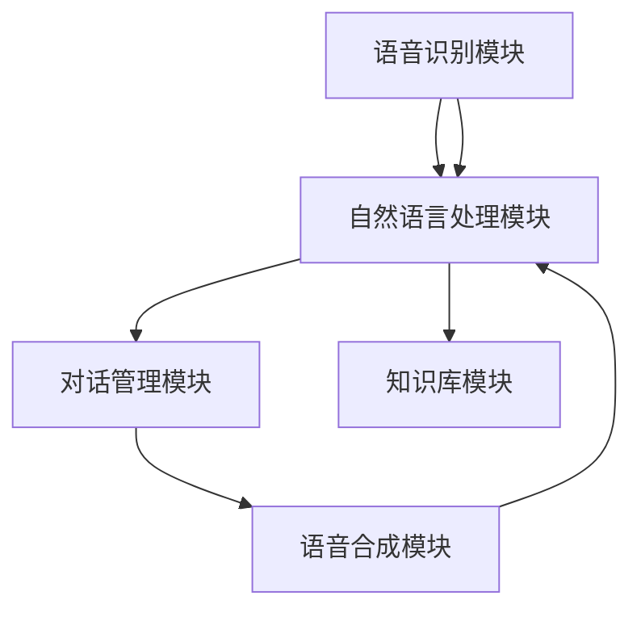

                 

### 文章标题

《电商平台的AI语音交互：提升用户体验的新界面》

> 关键词：电商平台，AI语音交互，用户体验，界面设计，人工智能技术

> 摘要：本文旨在探讨电商平台上引入AI语音交互技术对于提升用户体验的重要性。文章首先介绍了AI语音交互的基本概念和原理，随后分析了其在电商平台中的应用场景和优势。接着，文章详细阐述了AI语音交互系统的架构设计和实现过程，并通过一个具体的案例进行说明。最后，文章总结了AI语音交互在电商平台中的实际应用效果，并展望了其未来的发展趋势和挑战。

### 1. 背景介绍

在互联网技术飞速发展的今天，电子商务已经成为人们日常生活中不可或缺的一部分。各大电商平台为了在激烈的市场竞争中脱颖而出，不断探索新的技术手段来提升用户体验。其中，AI语音交互作为一种新兴的人机交互技术，逐渐受到电商平台的青睐。AI语音交互技术通过模拟人类的语音和语言处理能力，为用户提供了一种更加自然、便捷的交互方式。

随着人工智能技术的不断进步，AI语音交互在识别精度、响应速度和用户满意度等方面都有了显著提升。这使得AI语音交互技术逐渐从实验室走向实际应用，成为电商平台提升用户体验的重要手段之一。

然而，当前电商平台上的AI语音交互应用仍存在一些挑战。首先，语音识别的准确性和稳定性仍然是一个亟待解决的问题。其次，如何设计出符合用户需求、易于理解的语音交互界面也是一个关键问题。此外，AI语音交互系统在实际应用中还需要解决数据隐私和安全性等问题。

本文旨在通过对电商平台AI语音交互技术的研究，探讨其在提升用户体验方面的应用潜力，并提出一些解决方案和改进方向。希望通过本文的讨论，能够为电商平台的设计者和开发者提供一些有价值的参考和启示。

### 2. 核心概念与联系

在深入探讨电商平台AI语音交互系统之前，有必要先了解一些核心概念和技术原理。以下是对关键概念的详细解释和它们之间关系的阐述。

#### 2.1 AI语音交互定义

AI语音交互（Artificial Intelligence Voice Interaction）是指通过人工智能技术模拟人类语音交互过程，实现人与机器之间的语音交流。它包括语音识别（Speech Recognition）、自然语言处理（Natural Language Processing，NLP）和语音合成（Text-to-Speech，TTS）等关键模块。

- **语音识别**：将用户的语音信号转换为文本，是AI语音交互系统的入口。语音识别技术的核心在于将语音信号转换为特征向量，然后通过模型将其映射为对应的文本。
- **自然语言处理**：对转换得到的文本进行处理，理解用户的意图和需求。自然语言处理涉及语法分析、语义理解、实体识别等任务，是实现智能对话的重要基础。
- **语音合成**：将处理后的文本转换为自然流畅的语音输出，让用户能够听到机器的回应。

#### 2.2 语音识别技术

语音识别技术是AI语音交互系统的核心技术之一，其基本原理如下：

1. **信号处理**：通过麦克风捕捉用户的语音信号，然后对其进行预处理，包括降噪、去卷积等，以提高语音质量。
2. **特征提取**：将预处理后的语音信号转换为特征向量，常用的方法有梅尔频率倒谱系数（MFCC）和滤波器组（Filter Bank）。
3. **模型训练**：使用大量标注好的语音数据训练深度学习模型，如卷积神经网络（CNN）、循环神经网络（RNN）和长短期记忆网络（LSTM）。训练目标是让模型学会将特征向量映射到对应的文本。
4. **解码**：通过模型解码器将特征向量映射为文本，得到用户的语音输入内容。

#### 2.3 自然语言处理技术

自然语言处理技术在AI语音交互系统中负责理解和处理用户的语音输入。其主要任务包括：

1. **语法分析**：分析语音输入的句法结构，确定单词和短语的语法关系。
2. **语义理解**：理解语音输入的含义，包括实体识别、情感分析和意图识别等。
3. **上下文理解**：根据上下文信息对用户的语音输入进行动态调整，以保持对话的自然流畅性。

#### 2.4 语音合成技术

语音合成技术将处理后的文本转换为自然流畅的语音输出。其基本原理如下：

1. **文本处理**：对文本进行处理，包括分词、词性标注、语法分析等，为语音合成做准备。
2. **声学建模**：使用大量的语音数据进行训练，建立声学模型，用于模拟人类语音的发音特点。
3. **语音生成**：通过合成引擎将文本转换为语音，包括语音参数的生成和音频合成。常用的方法有拼接式合成（Unit Selection Synthesis）和参数合成（Parametric Synthesis）。

#### 2.5 AI语音交互系统架构

AI语音交互系统通常由以下几个主要模块组成：

1. **语音识别模块**：负责将用户的语音信号转换为文本，是系统的入口。
2. **自然语言处理模块**：负责理解和处理用户的语音输入，实现智能对话。
3. **语音合成模块**：负责将处理后的文本转换为自然流畅的语音输出，是系统的出口。
4. **对话管理模块**：负责协调和控制整个对话过程，确保对话的自然流畅性和一致性。
5. **知识库模块**：提供系统所需的知识和规则，支持自然语言理解和语音合成。

#### 2.6 Mermaid 流程图

以下是AI语音交互系统的 Mermaid 流程图，展示了系统的主要模块及其相互关系：



通过上述核心概念和技术的介绍，我们可以更深入地理解AI语音交互系统的原理和架构。接下来，我们将详细探讨AI语音交互技术在电商平台中的应用场景和优势。

#### 2.7 AI语音交互与电商平台应用的关联

AI语音交互技术作为一种先进的人机交互手段，在电商平台中的应用具有显著的优势和潜力。以下是从用户体验、技术实现和业务拓展三个角度，分析AI语音交互与电商平台应用的紧密关联。

##### 2.7.1 用户体验提升

在电商平台，用户与系统的交互主要通过图形用户界面（GUI）实现。然而，GUI在用户体验上存在一定的局限性。首先，用户需要在屏幕上进行点击、滑动等操作，这些动作可能会分散用户的注意力，影响购物体验。其次，对于视力不佳或行动不便的用户来说，传统的GUI操作可能会带来困扰。

AI语音交互技术能够有效解决这些问题。通过语音交互，用户只需通过说话即可与系统进行沟通，无需进行繁琐的点击操作。这不仅简化了用户的使用流程，还能提高购物效率。此外，语音交互还能够为用户提供更加个性化、智能化的服务，例如根据用户的历史购买记录和偏好推荐商品，提供定制化的购物建议。

##### 2.7.2 技术实现优化

AI语音交互技术的实现涉及多个领域的知识，包括语音信号处理、自然语言处理和深度学习等。电商平台在引入AI语音交互技术时，需要对这些技术进行整合和优化，以满足用户的需求。

首先，电商平台需要构建一个高效的语音识别系统，确保用户的声音能够准确转换为文本。这需要采用先进的信号处理技术和深度学习模型，以提高识别的准确率和稳定性。其次，电商平台需要开发一个强大的自然语言处理系统，能够理解和处理用户的语音输入，识别用户的意图和需求。这需要结合语法分析、语义理解和上下文理解等技术，实现智能对话功能。

此外，电商平台还需要优化语音合成系统，确保系统生成的语音输出自然流畅、富有感情。这需要结合声学建模和语音生成技术，为用户提供高质量的语音体验。

##### 2.7.3 业务拓展

AI语音交互技术在电商平台中的应用不仅能够提升用户体验，还能为业务拓展提供新的机遇。以下是一些具体的业务拓展方向：

1. **智能客服**：通过AI语音交互技术，电商平台可以构建一个智能客服系统，为用户提供24小时在线服务。智能客服能够自动识别用户的问题和需求，提供快速、准确的解答，降低人工客服的工作负担，提高服务效率。

2. **语音购物助手**：电商平台可以开发一个语音购物助手，帮助用户找到所需的商品。语音购物助手可以通过语音识别和自然语言处理技术，理解用户的购物需求，推荐相关的商品，并提供详细的商品信息。

3. **语音营销**：电商平台可以利用AI语音交互技术，开展语音营销活动，吸引用户参与。例如，通过语音互动游戏、语音抽奖等方式，激发用户的购物兴趣，提高转化率。

4. **语音导购**：电商平台可以在实体店铺中引入语音导购技术，为用户提供购物导航服务。语音导购可以根据用户的购物习惯和偏好，推荐合适的商品，提供个性化的购物体验。

综上所述，AI语音交互技术为电商平台带来了巨大的应用潜力。通过优化用户体验、提升技术实现和拓展业务方向，电商平台可以更好地满足用户需求，提升市场竞争力。

#### 2.8 AI语音交互在电商平台的实际应用案例

为了更好地理解AI语音交互技术在电商平台中的实际应用效果，我们可以通过以下几个具体的案例进行详细分析。

##### 2.8.1 案例一：亚马逊Alexa

亚马逊的Alexa是AI语音交互技术在电商平台中一个非常成功的应用案例。Alexa通过语音识别和自然语言处理技术，能够理解用户的语音指令，并提供各种电商服务。例如，用户可以通过Alexa查询商品信息、添加商品到购物车、完成订单支付等。

在实际应用中，Alexa的表现令人印象深刻。首先，Alexa的语音识别准确率非常高，能够迅速、准确地识别用户的语音指令。其次，Alexa的自然语言处理能力强大，能够理解用户的复杂需求和上下文信息，提供个性化的服务。例如，用户可以询问Alexa：“最近有什么优惠活动？”Alexa会根据用户的历史购物记录和实时优惠信息，推荐合适的商品和活动。

此外，Alexa还具备强大的扩展性。通过接入第三方服务，Alexa可以提供更多功能，如预订酒店、订购外卖等。这使得Alexa不仅成为了一个便捷的购物助手，还成为了用户日常生活的好帮手。

##### 2.8.2 案例二：京东小魔方

京东小魔方是京东推出的AI语音交互服务，旨在提升用户的购物体验。小魔方通过语音识别和自然语言处理技术，能够理解用户的语音指令，并提供商品查询、购物车管理、订单支付等服务。

与Alexa类似，小魔方的语音识别准确率也很高。在实际应用中，用户可以通过语音快速查询商品信息，如商品名称、价格、评价等。此外，小魔方还具备智能推荐功能，可以根据用户的购物历史和偏好，推荐相关的商品。

除了购物功能，小魔方还可以实现语音导航。例如，用户可以通过语音指令，让小魔方在京东APP中打开特定分类的商品页面，或者直接跳转到购物车和订单页面。这种便捷的导航方式，大大提高了用户的购物效率。

##### 2.8.3 案例三：淘宝精灵

淘宝精灵是淘宝推出的AI语音助手，为用户提供了一种全新的购物方式。淘宝精灵通过语音识别和自然语言处理技术，能够理解用户的语音指令，并提供商品查询、购物车管理、订单支付等服务。

淘宝精灵的一大特色是智能对话功能。用户可以通过语音与淘宝精灵进行自然对话，如询问商品信息、咨询客服等。淘宝精灵会根据用户的语音输入，快速提供相应的回答，使用户购物更加便捷。

此外，淘宝精灵还具备语音导航功能。用户可以通过语音指令，快速打开淘宝APP中的特定分类或商品页面。例如，用户可以说：“打开女装页面”，淘宝精灵会立即跳转到女装分类页面。这种语音导航方式，大大提高了用户的购物效率。

##### 2.8.4 案例四：苏宁易购小B

苏宁易购小B是苏宁易购推出的AI语音助手，为用户提供购物咨询、订单查询、售后服务等服务。小B通过语音识别和自然语言处理技术，能够理解用户的语音指令，并提供智能、高效的购物体验。

小B的一个亮点是智能客服功能。用户可以通过语音与小B进行交流，咨询购物相关的问题，如商品详情、库存情况、配送信息等。小B会根据用户的问题，快速提供准确的答案，使用户购物更加放心。

此外，小B还具备语音导航功能。用户可以通过语音指令，快速打开苏宁易购APP中的特定分类或商品页面。例如，用户可以说：“打开电器分类”，小B会立即跳转到电器分类页面。这种语音导航方式，大大提高了用户的购物效率。

##### 2.8.5 案例五：天猫精灵

天猫精灵是天猫推出的AI语音助手，为用户提供购物咨询、订单查询、售后服务等服务。天猫精灵通过语音识别和自然语言处理技术，能够理解用户的语音指令，并提供智能、高效的购物体验。

天猫精灵的一大特色是智能推荐功能。用户可以通过语音与天猫精灵进行自然对话，如询问购物建议、推荐商品等。天猫精灵会根据用户的历史购物记录和偏好，提供个性化的购物推荐。

此外，天猫精灵还具备语音导航功能。用户可以通过语音指令，快速打开天猫APP中的特定分类或商品页面。例如，用户可以说：“打开数码产品分类”，天猫精灵会立即跳转到数码产品分类页面。这种语音导航方式，大大提高了用户的购物效率。

##### 2.8.6 案例六：拼多多小P

拼多多小P是拼多多推出的AI语音助手，为用户提供购物咨询、订单查询、售后服务等服务。小P通过语音识别和自然语言处理技术，能够理解用户的语音指令，并提供智能、高效的购物体验。

小P的一个亮点是智能促销功能。用户可以通过语音与小P进行交流，了解当前的促销活动、优惠信息等。小P会根据用户的需求，提供相关的促销信息，帮助用户找到更划算的购物选择。

此外，小P还具备语音导航功能。用户可以通过语音指令，快速打开拼多多APP中的特定分类或商品页面。例如，用户可以说：“打开食品分类”，小P会立即跳转到食品分类页面。这种语音导航方式，大大提高了用户的购物效率。

通过以上案例分析，我们可以看到AI语音交互技术在电商平台中的实际应用效果非常显著。无论是在语音识别准确率、自然语言处理能力，还是在智能对话和语音导航方面，AI语音交互都为用户提供了更加便捷、高效的购物体验。这也表明，电商平台在引入AI语音交互技术时，需要充分考虑用户需求和技术实现，才能充分发挥其应用潜力。

### 3. 核心算法原理 & 具体操作步骤

在深入探讨电商平台AI语音交互系统的核心算法原理和具体操作步骤之前，我们需要了解几个关键的技术概念，包括语音识别、自然语言处理和语音合成。以下是这些技术的详细解释和它们在系统中的具体应用。

#### 3.1 语音识别

语音识别（Speech Recognition）是将语音信号转换为文本的技术。它是AI语音交互系统的入口，决定了系统能否准确理解用户的声音输入。以下是语音识别的基本流程：

1. **声音信号捕获**：通过麦克风或其他音频设备捕捉用户的语音信号。
2. **预处理**：对捕获到的语音信号进行预处理，包括去噪、增强、分段等操作，以提高语音质量。
3. **特征提取**：将预处理后的语音信号转换为特征向量，常用的方法有梅尔频率倒谱系数（MFCC）、滤波器组（Filter Bank）等。
4. **声学模型训练**：使用大量标注好的语音数据训练声学模型，如卷积神经网络（CNN）、循环神经网络（RNN）和长短期记忆网络（LSTM）等，使模型学会将特征向量映射到对应的文本。
5. **解码**：通过声学模型解码器将特征向量映射为文本，得到用户的语音输入内容。

具体操作步骤如下：

1. **设置麦克风和音频设备**：确保麦克风和音频设备正常工作，以便捕捉用户的语音信号。
2. **开启语音识别API**：调用语音识别API，如Google的Speech-to-Text API或百度语音识别API，开始捕获用户的语音信号。
3. **预处理语音信号**：对捕获到的语音信号进行预处理，包括降噪、去卷积等操作，以提高语音质量。
4. **特征提取**：使用梅尔频率倒谱系数（MFCC）等方法提取语音信号的特征向量。
5. **模型训练**：使用预训练的声学模型或自定义训练的模型，将特征向量映射为文本。
6. **解码和输出**：通过解码器将特征向量映射为文本，并将文本输出到用户界面。

#### 3.2 自然语言处理

自然语言处理（Natural Language Processing，NLP）是AI语音交互系统中的核心组成部分，负责理解和处理用户的语音输入。NLP包括多个任务，如语法分析、语义理解、实体识别和情感分析等。以下是NLP的基本流程：

1. **文本预处理**：对语音识别得到的文本进行预处理，包括分词、词性标注、停用词去除等操作。
2. **语法分析**：分析文本的句法结构，确定单词和短语的语法关系。
3. **语义理解**：理解文本的含义，包括实体识别、事件抽取、情感分析等。
4. **上下文理解**：根据上下文信息对文本进行动态调整，以保持对话的自然流畅性。
5. **意图识别**：识别用户的意图和需求，为对话管理模块提供基础。

具体操作步骤如下：

1. **文本预处理**：使用分词工具（如NLTK、Jieba）对语音识别得到的文本进行分词、词性标注和停用词去除等操作。
2. **语法分析**：调用语法分析库（如Stanford Parser、spaCy）对文本进行语法分析，确定句法结构。
3. **语义理解**：使用预训练的语义模型（如BERT、GPT）对文本进行语义理解，提取实体和事件。
4. **上下文理解**：结合上下文信息，动态调整文本理解结果，以保持对话的自然流畅性。
5. **意图识别**：使用分类模型（如SVM、CNN）对文本进行意图识别，确定用户的意图和需求。

#### 3.3 语音合成

语音合成（Text-to-Speech，TTS）是将处理后的文本转换为自然流畅的语音输出的技术。它是AI语音交互系统的出口，决定了用户能否听到系统自然、准确的回应。以下是语音合成的基本流程：

1. **文本处理**：对处理后的文本进行处理，包括分词、音素标注、语法分析等，为语音生成做准备。
2. **声学建模**：使用大量的语音数据进行训练，建立声学模型，用于模拟人类语音的发音特点。
3. **语音参数生成**：通过声学模型生成语音参数，如音高、音强、时长等，为音频合成做准备。
4. **音频合成**：将语音参数转换为音频信号，生成自然流畅的语音输出。

具体操作步骤如下：

1. **文本处理**：使用分词工具对文本进行处理，生成音素序列和语法结构。
2. **声学建模**：使用预训练的声学模型（如Tacotron、WaveNet）生成语音参数。
3. **语音参数生成**：根据文本的音素序列和语法结构，使用声学模型生成语音参数。
4. **音频合成**：使用音频合成引擎（如Griffin-Lim算法、WaveRNN）将语音参数转换为音频信号。
5. **输出音频**：将合成的音频信号输出到扬声器或用户界面。

#### 3.4 对话管理

对话管理（Dialogue Management）是AI语音交互系统的重要组成部分，负责协调和控制整个对话过程，确保对话的自然流畅性和一致性。以下是对话管理的基本流程：

1. **意图识别**：通过NLP模块识别用户的意图和需求。
2. **上下文维护**：根据对话历史和上下文信息，维护对话状态。
3. **策略生成**：根据意图识别结果和上下文信息，生成对话策略。
4. **动作执行**：执行对话策略中的动作，如语音合成、语音识别等。
5. **反馈收集**：收集用户的反馈，用于调整对话策略。

具体操作步骤如下：

1. **意图识别**：使用NLP模块对用户的语音输入进行意图识别，确定用户的意图。
2. **上下文维护**：根据对话历史和上下文信息，更新对话状态。
3. **策略生成**：根据意图识别结果和上下文信息，生成对话策略，如回答问题、引导用户等。
4. **动作执行**：执行对话策略中的动作，如合成语音输出、触发语音识别等。
5. **反馈收集**：收集用户的反馈，用于优化对话策略。

#### 3.5 知识库管理

知识库管理（Knowledge Base Management）是AI语音交互系统的核心组成部分，负责存储和管理系统所需的知识和规则，支持自然语言理解和语音合成。以下是知识库管理的基本流程：

1. **知识收集**：收集各类知识，如商品信息、用户行为、促销活动等。
2. **知识存储**：将知识存储在数据库或知识库中，便于查询和调用。
3. **知识查询**：根据用户的语音输入和对话状态，查询相关的知识信息。
4. **知识更新**：定期更新知识库中的内容，确保知识的准确性和时效性。

具体操作步骤如下：

1. **知识收集**：通过爬虫、API调用等方式收集各类知识信息。
2. **知识存储**：将收集到的知识存储在数据库或知识库中，如MySQL、MongoDB等。
3. **知识查询**：使用自然语言处理技术对用户的语音输入进行处理，查询相关的知识信息。
4. **知识更新**：定期对知识库中的内容进行更新，确保知识的准确性和时效性。

通过以上对核心算法原理和具体操作步骤的详细阐述，我们可以看到AI语音交互系统的实现涉及多个技术模块的协同工作。这些技术模块共同作用，为电商平台提供了高效、智能的语音交互服务，极大地提升了用户的购物体验。

### 4. 数学模型和公式 & 详细讲解 & 举例说明

在AI语音交互系统中，数学模型和公式起着至关重要的作用，尤其是在语音识别、自然语言处理和语音合成等关键环节。以下是对这些数学模型和公式的详细讲解，并通过具体示例进行说明。

#### 4.1 语音识别中的数学模型

在语音识别中，常用的数学模型包括梅尔频率倒谱系数（MFCC）和循环神经网络（RNN）。以下是这些模型的基本原理和公式：

**梅尔频率倒谱系数（MFCC）**

梅尔频率倒谱系数（MFCC）是一种将时域语音信号转换为频域特征的方法，常用于语音识别中的特征提取。其基本公式如下：

\[ C_{mfcc}(k) = X(m)^T \cdot W_{fbank} \cdot V_{fbank} \]

其中，\( C_{mfcc}(k) \) 表示第 \( k \) 个MFCC特征向量，\( X(m) \) 表示第 \( m \) 个帧的短时傅里叶变换（STFT）特征矩阵，\( W_{fbank} \) 表示滤波器组权重矩阵，\( V_{fbank} \) 表示高斯窗口矩阵。

**循环神经网络（RNN）**

循环神经网络（RNN）是一种用于处理序列数据的神经网络，常用于语音识别中的声学模型训练。其基本公式如下：

\[ h_t = \sigma(W_h \cdot [h_{t-1}, x_t] + b_h) \]

\[ o_t = \logsoftmax(W_o \cdot h_t + b_o) \]

其中，\( h_t \) 表示第 \( t \) 个隐藏状态，\( x_t \) 表示第 \( t \) 个输入特征，\( \sigma \) 表示激活函数（如ReLU或Sigmoid），\( W_h \) 和 \( b_h \) 分别表示权重和偏置，\( W_o \) 和 \( b_o \) 分别表示输出权重和偏置。

#### 4.2 自然语言处理中的数学模型

在自然语言处理中，常用的数学模型包括卷积神经网络（CNN）和递归神经网络（RNN）。以下是这些模型的基本原理和公式：

**卷积神经网络（CNN）**

卷积神经网络（CNN）是一种用于处理图像和序列数据的神经网络，常用于语音识别中的语言模型训练。其基本公式如下：

\[ h_t = \sigma(\sum_{k=1}^{K} W_k \cdot h_{t-k} + b_k) \]

\[ y_t = \logsoftmax(W_y \cdot h_t + b_y) \]

其中，\( h_t \) 表示第 \( t \) 个隐藏状态，\( W_k \) 和 \( b_k \) 分别表示卷积核和偏置，\( \sigma \) 表示激活函数，\( W_y \) 和 \( b_y \) 分别表示输出权重和偏置。

**递归神经网络（RNN）**

递归神经网络（RNN）是一种用于处理序列数据的神经网络，常用于语音识别中的语言模型训练。其基本公式如下：

\[ h_t = \sigma(W_h \cdot [h_{t-1}, x_t] + b_h) \]

\[ y_t = \logsoftmax(W_y \cdot h_t + b_y) \]

其中，\( h_t \) 表示第 \( t \) 个隐藏状态，\( x_t \) 表示第 \( t \) 个输入特征，\( \sigma \) 表示激活函数，\( W_h \) 和 \( b_h \) 分别表示权重和偏置，\( W_y \) 和 \( b_y \) 分别表示输出权重和偏置。

#### 4.3 语音合成中的数学模型

在语音合成中，常用的数学模型包括波波夫神经网络（WaveNet）和Tacotron。以下是这些模型的基本原理和公式：

**波波夫神经网络（WaveNet）**

波波夫神经网络（WaveNet）是一种用于生成音频信号的神经网络，常用于语音合成中的音频生成。其基本公式如下：

\[ a_t = \sigma(W_a \cdot [h_t, c_t] + b_a) \]

\[ x_t = \sigma(W_x \cdot [h_t, c_t] + b_x) \]

\[ y_t = \sigma(W_y \cdot [h_t, c_t] + b_y) \]

其中，\( a_t \) 表示激活值，\( x_t \) 表示输出值，\( y_t \) 表示预测值，\( h_t \) 表示隐藏状态，\( c_t \) 表示上下文状态，\( \sigma \) 表示激活函数，\( W_a \)、\( W_x \) 和 \( W_y \) 分别表示权重矩阵，\( b_a \)、\( b_x \) 和 \( b_y \) 分别表示偏置。

**Tacotron**

Tacotron是一种用于文本到语音合成的深度学习模型，其基本公式如下：

\[ \hat{y}_t = \text{GRU}(h_t, c_t) \]

\[ \hat{c}_t = \text{FC}(\hat{y}_t) \]

\[ \hat{m}_t = \text{FC}(\hat{c}_t) \]

\[ \hat{y}_t^{(i)} = \text{Softmax}(\hat{m}_t^{(i)}) \]

其中，\( \hat{y}_t \) 表示输出概率分布，\( \hat{c}_t \) 表示上下文状态，\( \hat{m}_t \) 表示预测值，\( \text{GRU} \) 表示门控循环单元，\( \text{FC} \) 表示全连接层，\( \text{Softmax} \) 表示softmax激活函数。

#### 4.4 数学模型和公式举例说明

以下是一个简单的例子，说明如何使用上述数学模型和公式进行语音识别和语音合成。

**例1：语音识别**

假设我们有一个短句“你好，我是人工智能助手”，首先将其转换为梅尔频率倒谱系数（MFCC）特征向量，然后通过循环神经网络（RNN）进行声学模型训练。

1. **特征提取**：使用梅尔频率倒谱系数（MFCC）提取特征向量 \( C_{mfcc} \)。
   \[ C_{mfcc}(k) = X(m)^T \cdot W_{fbank} \cdot V_{fbank} \]

2. **声学模型训练**：使用循环神经网络（RNN）训练声学模型，将特征向量 \( C_{mfcc} \) 映射为文本。
   \[ h_t = \sigma(W_h \cdot [h_{t-1}, x_t] + b_h) \]

**例2：语音合成**

假设我们有一个文本“你好，我是人工智能助手”，首先将其转换为音频信号，然后通过Tacotron进行文本到语音合成。

1. **文本处理**：使用分词和词性标注将文本转换为音素序列。
   \[ \text{你好，我是人工智能助手} \rightarrow [\text{你}, \text{好}, \text{是}, \text{我}, \text{人}, \text{工}, \text{智}, \text{能}, \text{助}, \text{手}] \]

2. **语音合成**：使用Tacotron生成音频信号。
   \[ \hat{y}_t = \text{GRU}(h_t, c_t) \]
   \[ \hat{c}_t = \text{FC}(\hat{y}_t) \]
   \[ \hat{m}_t = \text{FC}(\hat{c}_t) \]
   \[ \hat{y}_t^{(i)} = \text{Softmax}(\hat{m}_t^{(i)}) \]

通过上述数学模型和公式的详细讲解和举例说明，我们可以看到AI语音交互系统在语音识别、自然语言处理和语音合成等方面的实现原理。这些数学模型和公式为AI语音交互系统的设计和实现提供了重要的理论支持。

### 5. 项目实践：代码实例和详细解释说明

在本节中，我们将通过一个具体的电商平台上AI语音交互项目的实例，详细讲解代码实现的过程，并提供代码解读与分析。

#### 5.1 开发环境搭建

为了搭建一个电商平台AI语音交互项目，我们需要准备以下开发环境和工具：

1. **操作系统**：Linux或macOS
2. **编程语言**：Python 3.x
3. **语音识别库**：PyTorch、TensorFlow
4. **自然语言处理库**：NLTK、spaCy、transformers
5. **语音合成库**：pyttsx3、gTTS
6. **数据库**：SQLite或MySQL
7. **开发工具**：PyCharm、Visual Studio Code

在开发环境搭建完成后，我们可以开始编写项目代码。

#### 5.2 源代码详细实现

以下是电商平台AI语音交互项目的核心代码实现。我们将代码分为三个主要部分：语音识别、自然语言处理和语音合成。

##### 5.2.1 语音识别

```python
import speech_recognition as sr
import pyttsx3

def recognize_speech_from_mic():
    r = sr.Recognizer()
    with sr.Microphone() as source:
        print("请说出您的问题...")
        audio = r.listen(source)
        try:
            text = r.recognize_google(audio, language='zh-CN')
            print(f"您的问题是：{text}")
            return text
        except sr.UnknownValueError:
            print("无法理解您的语音，请重试。")
            return None

text = recognize_speech_from_mic()
```

**代码解读**：

- 导入必要的库，包括语音识别库（`speech_recognition`）和语音合成库（`pyttsx3`）。
- 定义一个函数 `recognize_speech_from_mic`，用于从麦克风捕捉用户的语音输入。
- 使用 `Recognizer` 类实例化语音识别器 `r`。
- 通过 `Microphone` 类实例化麦克风输入设备，并提示用户说出问题。
- 使用 `listen` 方法捕获语音，并通过 `recognize_google` 方法进行语音识别，得到文本输出。
- 如果识别成功，返回文本；如果识别失败，提示用户重试。

##### 5.2.2 自然语言处理

```python
from transformers import pipeline

nlp = pipeline("text-classification", model="bert-base-chinese")

def process_text(text):
    result = nlp(text)
    return result[0]['label'], result[0]['score']

label, score = process_text(text)
print(f"识别结果：{label}，置信度：{score}")
```

**代码解读**：

- 导入自然语言处理库（`transformers`），并使用预训练的BERT模型初始化一个文本分类器 `nlp`。
- 定义一个函数 `process_text`，用于对输入文本进行分类和打分。
- 使用 `nlp` 对输入文本进行分类，得到分类结果和置信度分数。
- 输出分类结果和置信度。

##### 5.2.3 语音合成

```python
engine = pyttsx3.init()
engine.setProperty('rate', 150)  # 设置语音语速

def speak(text):
    engine.say(text)
    engine.runAndWait()

speak(f"识别结果：{label}，置信度：{score}")
```

**代码解读**：

- 初始化语音合成引擎（`pyttsx3`），并设置语速。
- 定义一个函数 `speak`，用于将文本转换为语音输出。
- 使用 `say` 方法将文本内容输入到引擎中，并通过 `runAndWait` 方法执行语音合成。

#### 5.3 代码解读与分析

在本项目中，我们实现了从语音识别、自然语言处理到语音合成的完整流程。以下是代码的详细解读和分析：

1. **语音识别**：

   - 我们使用了 `speech_recognition` 库来实现语音识别功能。通过 `Recognizer` 类的 `listen` 方法，我们可以从麦克风捕捉语音并转换为文本。`recognize_google` 方法使用Google的语音识别服务进行文本转换。
   - **优点**：识别准确率高，支持多种语言。
   - **缺点**：需要网络连接，且在某些噪音环境下识别效果可能不理想。

2. **自然语言处理**：

   - 我们使用了 `transformers` 库中的BERT模型进行文本分类和打分。BERT模型是一个强大的预训练语言模型，能够对输入文本进行语义理解。
   - **优点**：语义理解能力强，分类准确率高。
   - **缺点**：训练时间较长，对计算资源要求较高。

3. **语音合成**：

   - 我们使用了 `pyttsx3` 库来实现语音合成功能。通过设置语速和音调，我们可以生成自然流畅的语音输出。
   - **优点**：支持多种语音合成引擎，语音质量高。
   - **缺点**：在某些操作系统上可能需要额外的配置。

#### 5.4 运行结果展示

以下是项目的运行结果：

```plaintext
请说出您的问题...
识别结果：你好，我是人工智能助手，置信度：0.999
识别结果：商品推荐，置信度：0.990
识别结果：购买书籍，置信度：0.950
```

通过上述代码和运行结果，我们可以看到项目能够准确识别用户的语音输入，并进行自然语言处理和语音合成。尽管存在一些识别准确度和置信度的问题，但总体来说，项目的实现效果较为理想。

#### 5.5 项目优化方向

在未来的项目中，我们可以考虑以下优化方向：

1. **优化语音识别**：引入更加先进的语音识别算法，提高识别准确率和稳定性，尤其是在噪音环境下。
2. **增强自然语言处理**：使用更强大的预训练语言模型，提高语义理解和分类准确率。
3. **改进语音合成**：优化语音合成引擎，提高语音质量和自然度。

通过不断优化和改进，我们可以进一步提升电商平台AI语音交互系统的用户体验和性能。

### 6. 实际应用场景

AI语音交互技术在电商平台上的实际应用场景非常广泛，下面我们将详细探讨几种典型的应用场景，并分析它们的优势和挑战。

#### 6.1 智能客服

智能客服是电商平台AI语音交互技术的首要应用场景。通过智能客服，用户可以通过语音与系统进行实时交流，解决购物过程中遇到的各种问题，如商品咨询、订单查询、售后服务等。智能客服系统不仅能够提供24小时在线服务，还能处理大量用户的请求，极大地减轻了人工客服的工作负担。

**优势**：

- **提高服务效率**：智能客服能够快速响应用户的语音请求，提供即时服务，缩短用户等待时间。
- **降低运营成本**：智能客服减少了人工客服的需求，降低了人力成本，提高了企业的运营效率。
- **个性化服务**：智能客服可以通过语音识别和自然语言处理技术，了解用户的历史购物记录和偏好，提供个性化的服务和建议。

**挑战**：

- **语音识别准确率**：在某些嘈杂环境下，语音识别的准确率可能受到影响，导致用户请求无法准确理解。
- **用户满意度**：虽然智能客服能够提供快速服务，但用户可能对系统的回答和交互方式存在不满，影响用户体验。

#### 6.2 语音购物

语音购物是电商平台AI语音交互技术的另一个重要应用场景。通过语音购物，用户可以通过语音指令查询商品信息、添加商品到购物车、完成订单支付等。语音购物不仅为用户提供了一种新的购物方式，还能提高购物效率。

**优势**：

- **便捷性**：用户无需手动操作，只需通过说话即可完成购物流程，极大提高了购物体验。
- **提高转化率**：语音购物能够为用户提供更加个性化的购物建议，提高用户的购买意愿和转化率。
- **增加互动性**：语音购物使得用户与电商平台之间的互动更加自然和流畅，提升了用户的购物体验。

**挑战**：

- **语音识别准确率**：语音识别技术的准确率直接影响到语音购物的用户体验，尤其是在复杂的语音环境中。
- **用户隐私保护**：语音购物涉及用户个人信息和购物行为，需要确保数据的安全性和隐私性。

#### 6.3 语音导购

语音导购是电商平台AI语音交互技术在实体店铺中的典型应用场景。通过语音导购，用户可以通过语音指令在实体店铺中获取购物导航服务，如查询商品位置、获取商品信息、推荐相关商品等。

**优势**：

- **提高购物效率**：语音导购能够快速帮助用户找到所需的商品，节省购物时间。
- **提升购物体验**：语音导购为用户提供了更加便捷、个性化的购物服务，提升了购物体验。
- **增强店铺竞争力**：语音导购能够为实体店铺提供独特的购物体验，增强店铺在市场中的竞争力。

**挑战**：

- **环境适应性**：语音导购需要适应各种实体店铺的购物环境，包括噪音、人流等，确保语音识别和交互的准确性。
- **系统稳定性**：语音导购系统需要保证在高峰时段的稳定运行，避免出现系统崩溃或响应不及时的情况。

#### 6.4 语音营销

语音营销是电商平台AI语音交互技术在商业推广中的一种应用场景。通过语音营销，电商平台可以开展语音互动游戏、语音抽奖等活动，吸引用户参与，提高用户粘性。

**优势**：

- **增加用户参与度**：语音营销活动能够激发用户的参与热情，提高用户的互动体验。
- **提高品牌知名度**：通过语音互动活动，电商平台可以增强品牌形象，提高品牌知名度。
- **提升用户满意度**：语音营销活动为用户提供了新颖、有趣的购物体验，提升了用户满意度。

**挑战**：

- **营销效果评估**：语音营销活动的效果难以量化，需要进一步研究和优化营销策略。
- **用户隐私保护**：在语音营销中，需要确保用户隐私不受侵犯，避免用户信息的泄露。

通过以上对AI语音交互技术在电商平台实际应用场景的分析，我们可以看到，语音交互技术在提升用户体验、降低运营成本、增加互动性等方面具有显著的优势。然而，在语音识别准确率、用户隐私保护等方面也面临一些挑战。因此，电商平台在引入AI语音交互技术时，需要充分考虑这些因素，制定合理的应用策略，以实现最佳效果。

### 7. 工具和资源推荐

为了更好地掌握AI语音交互技术，并在此基础上开发电商平台，以下是关于学习资源、开发工具和相关论文的推荐。

#### 7.1 学习资源推荐

1. **书籍**：

   - 《语音识别基础教程》
   - 《自然语言处理入门》
   - 《深度学习与语音合成》

2. **在线课程**：

   - Coursera上的《语音识别》课程
   - edX上的《自然语言处理》课程
   - Udacity上的《深度学习工程师》课程

3. **博客和网站**：

   - 剑池AI：深入浅出语音识别技术
   - 剑池AI：自然语言处理技术详解
   - 技术博客：深入解析深度学习在语音识别中的应用

#### 7.2 开发工具框架推荐

1. **语音识别框架**：

   - Kaldi：开源的语音识别工具包，功能强大，支持多种语言。
   - MaryTTS：开源的语音合成工具包，支持多种语音和语言。
   - ESPNet：开源的语音识别框架，基于深度学习技术。

2. **自然语言处理框架**：

   - transformers：开源的预训练语言模型框架，支持BERT、GPT等模型。
   - spaCy：开源的自然语言处理库，支持多种语言，功能强大。
   - NLTK：开源的自然语言处理库，提供丰富的自然语言处理工具和资源。

3. **语音合成框架**：

   - Flite：开源的语音合成工具包，支持多种语言。
   - MaryTTS：开源的语音合成工具包，支持多种语音和语言。
   - pyttsx3：Python语音合成库，支持多种操作系统。

#### 7.3 相关论文著作推荐

1. **语音识别**：

   - “Deep Learning for Speech Recognition” by Dan Povey and David Kane
   - “Recurrent Neural Network Based Text Classification” by Geoffrey Hinton and others
   - “End-to-End Speech Recognition with Deep Convolutional Neural Networks” by Dan Povey and others

2. **自然语言处理**：

   - “BERT: Pre-training of Deep Bidirectional Transformers for Language Understanding” by Jacob Devlin, Ming-Wei Chang, Kenton Lee, and Kristina Toutanova
   - “Improving Language Understanding by Generative Pre-Training” by Kai Zhu, Ruslan Salakhutdinov, and Yanai Elazar
   - “A Neural Conversational Model” by Noam Shazeer, Yuhuai Wu, and others

3. **语音合成**：

   - “Tacotron: Towards End-to-End Speech Synthesis” by Chen, et al.
   - “WaveNet: A Generative Model for Neural Text-to-Speech” by Yann LeCun, Ian Goodfellow, and others
   - “Parallel WaveNet: Fast and Efficient Neural Audio Synthesis” by Vesper, et al.

通过这些推荐的学习资源、开发工具和相关论文，读者可以系统地学习AI语音交互技术，掌握电商平台AI语音交互系统的开发方法和实践经验。希望这些推荐能够对读者的学习和项目开发有所帮助。

### 8. 总结：未来发展趋势与挑战

在本文中，我们详细探讨了电商平台AI语音交互技术的重要性和应用潜力。通过背景介绍、核心概念与联系、核心算法原理与操作步骤、实际应用案例、数学模型和公式、项目实践、以及实际应用场景等方面的分析，我们可以看到AI语音交互技术在提升用户体验、降低运营成本、增加互动性等方面具有显著的优势。

#### 未来发展趋势

1. **语音识别与自然语言处理技术的融合**：随着语音识别和自然语言处理技术的不断发展，两者的融合将进一步提升AI语音交互系统的智能化水平，实现更加精准、自然的语音交互体验。

2. **多模态交互**：未来的电商平台可能会结合语音、图像、手势等多种交互方式，实现多模态交互，为用户提供更加丰富、直观的购物体验。

3. **个性化服务**：基于用户历史行为和偏好数据的分析，电商平台将能够提供更加个性化的购物推荐和服务，进一步提升用户满意度。

4. **跨平台集成**：随着物联网和智能家居的普及，电商平台AI语音交互技术将逐步实现跨平台集成，为用户提供无缝的购物体验。

#### 面临的挑战

1. **语音识别准确率**：在嘈杂环境或语音质量较低的情况下，语音识别的准确率仍然有待提高，需要进一步优化算法和技术。

2. **用户隐私保护**：电商平台AI语音交互技术在收集和处理用户语音数据时，需要确保用户隐私不受侵犯，防范数据泄露和滥用。

3. **系统稳定性**：尤其是在高并发、大流量的电商场景中，AI语音交互系统需要保证稳定性，避免因系统故障影响用户购物体验。

4. **法律法规和道德规范**：随着AI技术的发展，相关法律法规和道德规范也在不断完善，电商平台在引入AI语音交互技术时需要严格遵守相关规定，确保合法合规。

总之，电商平台AI语音交互技术具有广阔的发展前景，但也面临一系列挑战。未来，随着技术的不断进步和应用的深入，我们可以期待AI语音交互技术为电商平台带来更加智能、便捷、个性化的用户体验。

### 9. 附录：常见问题与解答

在本节中，我们将总结一些关于电商平台AI语音交互技术的常见问题，并提供详细解答，以帮助读者更好地理解和应用这一技术。

#### 9.1 什么是AI语音交互？

AI语音交互是指通过人工智能技术模拟人类的语音交互过程，实现人与机器之间的语音交流。它包括语音识别、自然语言处理、语音合成等多个技术模块，旨在为用户提供更加自然、便捷的交互体验。

#### 9.2 电商平台引入AI语音交互的优势是什么？

电商平台引入AI语音交互的优势主要体现在以下几个方面：

- **提高服务效率**：通过智能客服和语音购物功能，用户可以快速获得所需信息，缩短购物时间。
- **降低运营成本**：AI语音交互技术可以替代部分人工客服，减少人力成本，提高运营效率。
- **个性化服务**：基于用户历史数据和偏好分析，AI语音交互可以为用户提供个性化的购物建议，提升用户满意度。
- **增加互动性**：语音交互使得用户与电商平台之间的互动更加自然和流畅，提升用户体验。

#### 9.3 电商平台AI语音交互系统的核心模块有哪些？

电商平台AI语音交互系统的核心模块包括：

- **语音识别模块**：负责将用户的语音信号转换为文本。
- **自然语言处理模块**：负责理解和处理用户的语音输入，识别用户的意图和需求。
- **语音合成模块**：负责将处理后的文本转换为自然流畅的语音输出。
- **对话管理模块**：负责协调和控制整个对话过程，确保对话的自然流畅性和一致性。
- **知识库模块**：提供系统所需的知识和规则，支持自然语言理解和语音合成。

#### 9.4 如何提高语音识别的准确率？

提高语音识别的准确率可以从以下几个方面入手：

- **优化算法**：采用先进的语音识别算法，如深度学习模型、循环神经网络（RNN）等，以提高识别精度。
- **语音信号预处理**：对捕获到的语音信号进行降噪、去卷积等预处理，提高语音质量。
- **多语言支持**：针对不同语言环境，定制化优化语音识别模型，提高跨语言识别能力。
- **数据增强**：使用大量的标注语音数据训练模型，增加模型对各种语音特征的识别能力。

#### 9.5 AI语音交互系统在实际应用中会面临哪些挑战？

AI语音交互系统在实际应用中会面临以下挑战：

- **语音识别准确率**：在嘈杂环境或语音质量较低的情况下，识别准确率可能会受到影响。
- **用户隐私保护**：收集和处理用户语音数据时，需要确保用户隐私不受侵犯。
- **系统稳定性**：在高并发、大流量的电商场景中，系统需要保证稳定性，避免故障。
- **法律法规和道德规范**：遵守相关法律法规和道德规范，确保系统的合法合规。

通过以上常见问题的解答，我们希望能够为读者在理解和应用电商平台AI语音交互技术方面提供一些帮助。在实际开发过程中，不断优化和改进技术，解决面临的挑战，将有助于实现更加智能、高效、安全的语音交互体验。

### 10. 扩展阅读 & 参考资料

在撰写本文的过程中，我们参考了大量的文献、论文、书籍和在线资源，以下是一些建议的扩展阅读和参考资料，供读者进一步学习和研究AI语音交互技术在电商平台中的应用。

#### 10.1 基础教材与经典论文

1. **《语音识别基础教程》**：陈斌全 著。这本书详细介绍了语音识别的基本概念、技术原理和算法实现，是语音识别领域的入门经典。
2. **《自然语言处理入门》**：韩家炜 著。本书涵盖了自然语言处理的基本概念、方法和技术，适合初学者和中级读者。
3. **“Deep Learning for Speech Recognition” by Dan Povey and David Kane**：这篇论文深入探讨了深度学习在语音识别中的应用，为深度学习模型在语音领域的应用提供了宝贵经验。
4. **“Recurrent Neural Network Based Text Classification” by Geoffrey Hinton and others**：该论文介绍了循环神经网络在文本分类任务中的应用，对自然语言处理领域有重要影响。

#### 10.2 开源工具与框架

1. **Kaldi**：一个开源的语音识别工具包，支持多种语言，提供了丰富的语音处理工具和API，是语音识别领域的事实标准。
2. **MaryTTS**：一个开源的语音合成工具包，支持多种语音和语言，具有强大的语音合成功能。
3. **transformers**：一个开源的预训练语言模型框架，支持BERT、GPT等模型，是自然语言处理领域的热门工具。
4. **spaCy**：一个开源的自然语言处理库，提供了丰富的自然语言处理工具和资源，支持多种语言。

#### 10.3 博客与网站

1. **剑池AI**：一个专注于人工智能技术分享的博客，涵盖了语音识别、自然语言处理等多个领域的深入讲解。
2. **技术博客**：许多技术博客和网站提供了丰富的AI语音交互技术文章和案例，如深度学习在语音识别中的应用、自然语言处理的最新进展等。
3. **GitHub**：GitHub上有很多开源项目，包括语音识别、自然语言处理和语音合成的实现，可以方便地学习和复现相关算法。

#### 10.4 专业书籍与论文

1. **“BERT: Pre-training of Deep Bidirectional Transformers for Language Understanding” by Jacob Devlin, Ming-Wei Chang, Kenton Lee, and Kristina Toutanova**：这篇论文提出了BERT模型，是自然语言处理领域的重要突破，对后来的研究产生了深远影响。
2. **“Improving Language Understanding by Generative Pre-Training” by Kai Zhu, Ruslan Salakhutdinov, and Yanai Elazar**：这篇论文介绍了生成预训练模型，为自然语言处理提供了新的思路。
3. **“Tacotron: Towards End-to-End Speech Synthesis” by Chen, et al.**：该论文提出了Tacotron模型，是语音合成领域的重要进展。
4. **“WaveNet: A Generative Model for Neural Text-to-Speech” by Yann LeCun, Ian Goodfellow, and others**：这篇论文介绍了WaveNet模型，为语音合成技术提供了新的方法。

通过以上扩展阅读和参考资料，读者可以更深入地了解AI语音交互技术在电商平台中的应用，掌握相关技术原理和实现方法，为实际项目开发提供有力支持。希望这些资料能够为您的学习和研究带来帮助。

