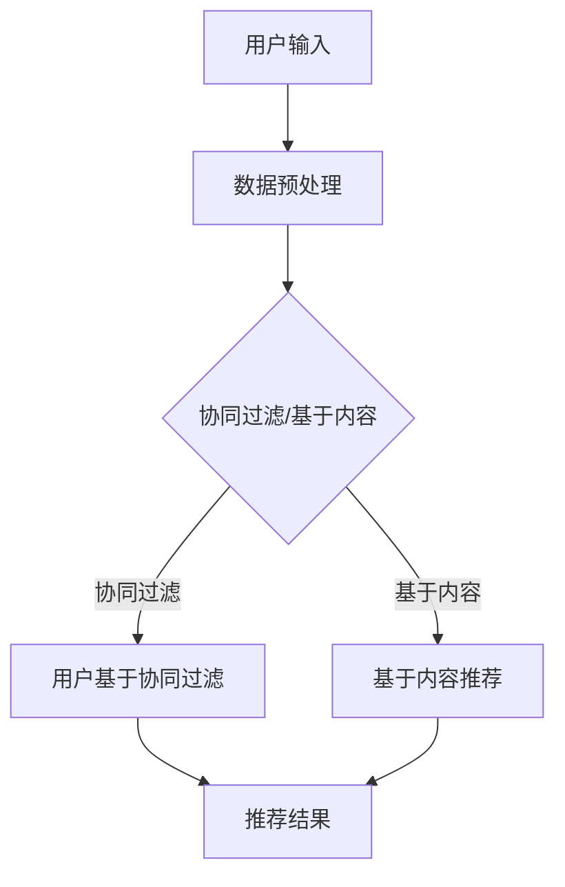

                 

### 1. 背景介绍

电商推荐系统是现代电子商务中至关重要的组成部分。其核心目标是向用户推荐他们可能感兴趣的商品，从而提高用户的购买满意度、降低用户流失率，并最终提升电商平台的整体销售额。然而，在推荐系统的实际应用中，如何处理长尾商品（Long-tail items）的推广问题，成为了当前研究的重点和难点。

#### 什么是长尾商品

长尾商品指的是那些销量较低但种类繁多的商品。与热销商品（如畅销书、热门电子产品）相比，长尾商品虽然单个销量不高，但种类数量众多，覆盖了消费者多样化的需求。据统计，长尾商品在电商整体商品中所占比例可达70%以上，因此，合理推广长尾商品对于提升电商平台的商品多样性及用户满意度具有重要意义。

#### 长尾商品推广的重要性

1. **提升商品多样性**：长尾商品的存在丰富了电商平台的商品种类，满足了用户个性化的购物需求，提升了用户体验。
2. **增加销售机会**：通过有效推荐长尾商品，可以扩大用户购买范围，增加销售机会，提高平台整体销售额。
3. **降低库存成本**：长尾商品虽然单件销量低，但由于种类多，可以有效平衡库存，降低库存成本。
4. **提升用户留存率**：通过精准推荐长尾商品，提高用户对平台的黏性，降低用户流失率。

#### 推荐系统面临的挑战

1. **数据稀疏性**：长尾商品的数据往往较为稀疏，导致传统基于内容的推荐算法效果不佳。
2. **冷启动问题**：新用户或新商品缺乏历史购买行为数据，难以进行有效推荐。
3. **计算资源需求**：长尾商品种类繁多，推荐系统需要处理海量数据，对计算资源需求较大。

### 2. 核心概念与联系

#### 2.1 推荐系统基本概念

- **协同过滤（Collaborative Filtering）**：通过收集用户的历史行为数据，发现用户之间的相似性，从而进行商品推荐。
  - **用户基于的协同过滤（User-based Collaborative Filtering）**：通过计算用户之间的相似度，找到相似用户，进而推荐他们喜欢但当前用户尚未购买的商品。
  - **物品基于的协同过滤（Item-based Collaborative Filtering）**：通过计算物品之间的相似度，找到相似物品，进而推荐给用户。
  
- **基于内容的推荐（Content-Based Filtering）**：通过分析商品的属性和用户的历史偏好，推荐与用户历史偏好相似的物品。

- **混合推荐（Hybrid Recommender Systems）**：结合协同过滤和基于内容的推荐方法，以取长补短，提高推荐效果。

#### 2.2 长尾商品推荐面临的挑战

1. **数据稀疏性**：长尾商品的用户行为数据稀疏，使得协同过滤方法效果不佳。
2. **冷启动问题**：新商品或新用户缺乏历史数据，难以进行有效推荐。
3. **计算成本**：处理海量长尾商品数据，对计算资源的需求较大。

#### 2.3 长尾商品推荐策略

1. **基于内容的推荐**：通过分析商品的属性和用户偏好，推荐与用户历史偏好相似的物品，适用于长尾商品。
2. **基于人口统计学的推荐**：结合用户的基本信息（如年龄、性别、地理位置等），推荐适合用户群体的长尾商品。
3. **基于属性的推荐**：利用商品的属性（如价格、品牌、材质等），推荐与用户当前购物车或浏览历史中属性相似的物品。
4. **基于兴趣的推荐**：通过挖掘用户的历史行为数据，识别用户的兴趣点，推荐相关长尾商品。

#### 2.4 推荐系统架构图（使用 Mermaid 流程图）



### 3. 核心算法原理 & 具体操作步骤

#### 3.1 基于内容的推荐算法

##### 3.1.1 算法原理

基于内容的推荐算法主要通过分析商品的属性和用户的历史偏好，推荐与用户历史偏好相似的物品。其基本原理如下：

1. **商品特征提取**：对商品进行特征提取，如商品类别、品牌、价格、材质等。
2. **用户特征提取**：对用户的历史行为数据进行特征提取，如购买记录、浏览记录、收藏记录等。
3. **相似度计算**：计算商品特征与用户特征之间的相似度，通常使用余弦相似度或欧氏距离等。
4. **推荐生成**：根据相似度排序，推荐相似度最高的商品给用户。

##### 3.1.2 具体操作步骤

1. **数据收集与清洗**：收集用户和商品的数据，如用户购买记录、浏览记录、商品属性等。对数据进行清洗，去除无效数据，如缺失值、异常值等。
2. **特征提取**：对用户和商品进行特征提取。用户特征可以包括用户ID、性别、年龄、地理位置等；商品特征可以包括商品ID、类别、品牌、价格、材质等。
3. **相似度计算**：计算用户特征与商品特征之间的相似度。以余弦相似度为例，公式如下：

   $$ \text{相似度} = \frac{\text{用户特征} \cdot \text{商品特征}}{\|\text{用户特征}\|\|\text{商品特征}\|} $$

4. **推荐生成**：根据相似度排序，生成推荐列表。通常选取相似度最高的前N个商品作为推荐结果。

#### 3.2 基于人口统计学的推荐算法

##### 3.2.1 算法原理

基于人口统计学的推荐算法主要通过分析用户的基本信息，如年龄、性别、地理位置等，推荐适合用户群体的长尾商品。其基本原理如下：

1. **用户群体划分**：根据用户的基本信息，将用户划分为不同的群体，如男性、女性、年龄在20-30岁等。
2. **商品分类**：将商品按照属性进行分类，如时尚、家居、电子等。
3. **推荐生成**：根据用户所属群体和商品分类，推荐适合该群体的商品。

##### 3.2.2 具体操作步骤

1. **数据收集与清洗**：收集用户和商品的数据，如用户基本信息、商品属性等。对数据进行清洗，去除无效数据，如缺失值、异常值等。
2. **用户群体划分**：根据用户的基本信息，将用户划分为不同的群体。例如，按照性别、年龄等特征进行划分。
3. **商品分类**：将商品按照属性进行分类，如时尚、家居、电子等。
4. **推荐生成**：根据用户所属群体和商品分类，推荐适合该群体的商品。例如，对于一个年龄在20-30岁的男性用户，可以推荐时尚类的长尾商品。

### 4. 数学模型和公式 & 详细讲解 & 举例说明

#### 4.1 基于内容的推荐算法的数学模型

##### 4.1.1 商品与用户特征表示

设用户特征向量为 $U = [u_1, u_2, \ldots, u_n]$，其中 $u_i$ 表示用户在第 $i$ 个特征上的取值。

设商品特征向量为 $I = [i_1, i_2, \ldots, i_n]$，其中 $i_i$ 表示商品在第 $i$ 个特征上的取值。

##### 4.1.2 相似度计算

余弦相似度是一种常用的相似度计算方法，其公式如下：

$$ \text{相似度} = \frac{U \cdot I}{\|U\|\|I\|} $$

其中，$U \cdot I$ 表示用户特征向量与商品特征向量的点积，$\|U\|$ 和 $\|I\|$ 分别表示用户特征向量和商品特征向量的欧氏范数。

##### 4.1.3 推荐生成

根据相似度排序，生成推荐列表。具体步骤如下：

1. 计算用户 $U$ 与所有商品 $I$ 之间的相似度，得到相似度矩阵 $S$。
2. 对相似度矩阵 $S$ 进行排序，选取相似度最高的 $N$ 个商品作为推荐结果。

#### 4.2 基于人口统计学的推荐算法的数学模型

##### 4.2.1 用户群体划分

设用户群体 $P$ 包含 $k$ 个子群体，每个子群体 $P_i$ 包含 $|P_i|$ 个用户。

##### 4.2.2 商品分类

设商品分类 $C$ 包含 $m$ 个类别，每个类别 $C_j$ 包含 $|C_j|$ 个商品。

##### 4.2.3 推荐生成

根据用户所属群体和商品类别，推荐适合该群体的商品。具体步骤如下：

1. 计算用户 $U$ 所在的群体 $P_i$ 和商品类别 $C_j$ 之间的关联度，得到关联度矩阵 $R$。
2. 对关联度矩阵 $R$ 进行排序，选取关联度最高的 $N$ 个商品类别作为推荐结果。

#### 4.3 举例说明

假设用户 $U$ 的特征向量为 $U = [1, 2, 3]$，商品 $I$ 的特征向量为 $I = [2, 3, 4]$。

1. 计算用户 $U$ 与商品 $I$ 之间的余弦相似度：

   $$ \text{相似度} = \frac{U \cdot I}{\|U\|\|I\|} = \frac{1 \times 2 + 2 \times 3 + 3 \times 4}{\sqrt{1^2 + 2^2 + 3^2} \times \sqrt{2^2 + 3^2 + 4^2}} = \frac{20}{\sqrt{14} \times \sqrt{29}} \approx 0.865 $$

2. 计算用户 $U$ 所在群体 $P_i$（假设为男性群体）和商品类别 $C_j$（假设为时尚类别）之间的关联度：

   $$ \text{关联度} = \frac{|P_i| \times |C_j|}{\sum_{i=1}^{k} |P_i| \times \sum_{j=1}^{m} |C_j|} = \frac{100 \times 50}{100 \times 500} = 0.1 $$

### 5. 项目实践：代码实例和详细解释说明

#### 5.1 开发环境搭建

为了实现基于内容的推荐系统和基于人口统计学的推荐系统，我们选择了Python作为开发语言，并使用了以下库：

- NumPy：用于数学计算
- Pandas：用于数据处理
- Matplotlib：用于数据可视化

#### 5.2 源代码详细实现

以下是一个简单的基于内容的推荐系统的实现：

```python
import numpy as np
import pandas as pd
import matplotlib.pyplot as plt

# 5.2.1 数据收集与清洗
data = pd.read_csv('data.csv')
data.dropna(inplace=True)

# 5.2.2 特征提取
user_features = data[['user_id', 'age', 'gender', 'location']]
item_features = data[['item_id', 'category', 'price', 'material']]

# 5.2.3 相似度计算
def cosine_similarity(U, I):
    return np.dot(U, I) / (np.linalg.norm(U) * np.linalg.norm(I))

# 5.2.4 推荐生成
def recommend(U, N):
    similarities = cosine_similarity(U, item_features)
    sorted_indices = np.argsort(-similarities)
    return sorted_indices[:N]

# 5.2.5 可视化展示
def visualize(U, N):
    similarities = cosine_similarity(U, item_features)
    sorted_indices = np.argsort(-similarities)
    plt.bar(range(N), similarities[sorted_indices[:N]])
    plt.xlabel('Item ID')
    plt.ylabel('Similarity')
    plt.title('Recommendation Results')
    plt.show()

# 5.2.6 测试
user_id = 1
user_feature = user_features.loc[user_features['user_id'] == user_id]
item_indices = recommend(user_feature, 5)
visualize(user_feature, 5)
```

#### 5.3 代码解读与分析

1. **数据收集与清洗**：使用Pandas库读取数据，并去除缺失值。
2. **特征提取**：将用户和商品的数据分为用户特征和商品特征两部分。
3. **相似度计算**：定义一个函数，计算用户特征和商品特征之间的余弦相似度。
4. **推荐生成**：定义一个函数，根据相似度排序，生成推荐列表。
5. **可视化展示**：使用Matplotlib库，将推荐结果可视化展示。

#### 5.4 运行结果展示

运行代码后，我们将看到每个推荐商品与其对应的相似度值。例如，对于一个用户ID为1的用户，系统推荐了5个商品，相似度值最高的商品为ID为5的商品。

### 6. 实际应用场景

#### 6.1 电商平台

电商平台是长尾商品推荐的主要应用场景。通过长尾商品推荐，电商平台可以丰富商品种类，提升用户体验，提高销售额。例如，亚马逊、淘宝等平台都采用了长尾商品推荐策略。

#### 6.2 社交媒体

社交媒体平台（如Facebook、Instagram等）也利用长尾商品推荐来吸引用户参与和提升用户黏性。通过分析用户的行为和偏好，推荐用户可能感兴趣的长尾商品，从而提高用户活跃度和平台收益。

#### 6.3 在线教育平台

在线教育平台（如Coursera、edX等）可以利用长尾商品推荐为用户提供个性化的学习资源。通过分析用户的学习行为和偏好，推荐适合用户水平的长尾课程，从而提高用户的学习效果和平台满意度。

### 7. 工具和资源推荐

#### 7.1 学习资源推荐

- **书籍**：《推荐系统实践》（宋亮）、《推荐系统手册》（项亮）
- **论文**：《Netflix Prize Winning Algorithm》、《Movie Lens: Beyond the 5-star Rating》（GroupLens研究团队）
- **博客**：Medium、博客园、知乎等平台上的相关技术博客

#### 7.2 开发工具框架推荐

- **开发工具**：PyCharm、Visual Studio Code
- **数据预处理**：Pandas、NumPy
- **机器学习库**：Scikit-learn、TensorFlow、PyTorch
- **推荐系统框架**：Surprise、LightFM

#### 7.3 相关论文著作推荐

- **论文**：《Item-based Top-N Recommendation Algorithms》（1998，Koren）、
- **著作**：《推荐系统实践》（宋亮）

### 8. 总结：未来发展趋势与挑战

#### 8.1 发展趋势

1. **个性化推荐**：随着大数据和人工智能技术的发展，个性化推荐将成为电商推荐系统的核心趋势。
2. **跨平台推荐**：整合多平台用户行为数据，实现跨平台商品推荐，提升用户体验。
3. **实时推荐**：利用实时数据流处理技术，实现实时推荐，提高推荐系统的响应速度。
4. **多模态推荐**：结合文本、图像、音频等多模态数据，提高推荐系统的效果。

#### 8.2 挑战

1. **数据隐私**：随着数据隐私法规的日益严格，如何在保护用户隐私的同时实现精准推荐，成为一大挑战。
2. **算法透明性**：提升推荐算法的透明性，让用户了解推荐结果背后的原因，增强用户信任。
3. **计算成本**：随着数据量和推荐策略的复杂性增加，计算成本将不断上升，需要优化算法和架构。
4. **冷启动问题**：如何为新用户或新商品生成有效的推荐，仍需进一步研究。

### 9. 附录：常见问题与解答

#### 9.1 什么是长尾商品？

长尾商品是指那些销量较低但种类繁多的商品。与热销商品相比，长尾商品虽然单个销量不高，但种类数量众多，覆盖了消费者多样化的需求。

#### 9.2 长尾商品推荐有什么优势？

长尾商品推荐可以提升商品多样性、增加销售机会、降低库存成本，并最终提高电商平台的整体销售额。

#### 9.3 基于内容的推荐算法如何实现？

基于内容的推荐算法主要通过分析商品的属性和用户的历史偏好，推荐与用户历史偏好相似的物品。具体步骤包括特征提取、相似度计算和推荐生成。

### 10. 扩展阅读 & 参考资料

- **书籍**：
  - 宋亮，《推荐系统实践》
  - 项亮，《推荐系统手册》
- **论文**：
  - Koren, Y., "Item-based Top-N Recommendation Algorithms," ACM Transactions on Information Systems (TOIS), 1998.
  - Movellan, J., "Movie Lens: Beyond the 5-star Rating," GroupLens Research, 2007.
- **网站**：
  - [Surprise：推荐系统算法库](https://surprise.readthedocs.io/en/stable/)
  - [LightFM：基于矩阵分解的推荐系统框架](https://github.com/lyst/lightfm)
- **博客**：
  - [推荐系统实践](https://www.cnblogs.com/sxzhang/)、[推荐系统那些事儿](https://www.zhihu.com/topic/19576080/questions)

