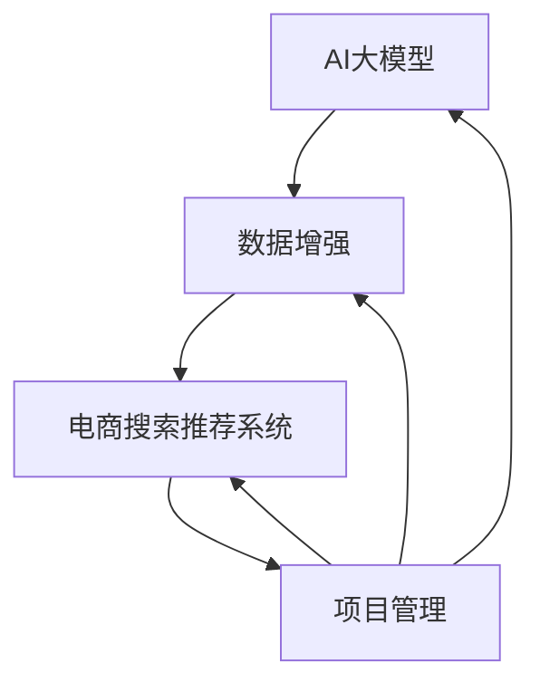

                 

### 文章标题

《电商搜索推荐中的AI大模型数据增强技术应用项目管理实践》

> 关键词：AI大模型，数据增强，电商搜索推荐，项目管理，实践指南

> 摘要：本文深入探讨了AI大模型在电商搜索推荐中的应用，特别是在数据增强技术方面的应用。通过详细的实践案例，分析了AI大模型数据增强技术的设计与实现，以及其在项目管理中的具体应用，为电商行业提供了宝贵的实践指南。

### 1. 背景介绍

在当今的电子商务时代，搜索推荐系统已经成为电商平台的核心竞争力。如何准确、高效地为用户推荐他们可能感兴趣的商品，已经成为各大电商平台关注的焦点。而AI大模型，作为当前最先进的人工智能技术，逐渐被引入到电商搜索推荐系统中，以提升推荐的效果和用户体验。

数据增强技术是AI大模型应用中的一个重要环节。数据增强不仅能够增加数据的多样性，还可以弥补数据集中的不足，从而提升模型的泛化能力。在电商搜索推荐中，数据增强技术可以帮助生成更丰富的用户行为数据和商品特征数据，为AI大模型提供更加优质的数据支持，从而提升推荐系统的准确性和效果。

然而，AI大模型数据增强技术的应用并非一帆风顺。在项目实施过程中，面临着诸多挑战，如数据质量、计算资源、模型调优等。因此，如何有效地进行项目管理，确保项目成功实施，是每个电商平台都需要面对的课题。

本文将围绕AI大模型数据增强技术在电商搜索推荐中的应用，结合实际项目案例，深入探讨项目管理实践中的关键问题和解决方法，为电商行业提供实用的指导。

### 2. 核心概念与联系

#### 2.1 AI大模型

AI大模型（Large-scale AI Model）是指参数规模达到亿级乃至千亿级的深度学习模型。这类模型通常基于大规模的数据集进行训练，具有较高的模型复杂度和强大的表征能力。常见的AI大模型包括Transformer、BERT、GPT等。

#### 2.2 数据增强

数据增强（Data Augmentation）是指在数据预处理阶段，通过对原始数据进行变换，增加数据多样性，从而提升模型的泛化能力。数据增强技术主要包括图像增强、文本增强、数据模拟等。

#### 2.3 电商搜索推荐系统

电商搜索推荐系统是指通过算法模型，根据用户的历史行为和偏好，为用户推荐他们可能感兴趣的商品。其核心包括用户行为数据分析和商品特征提取。

#### 2.4 项目管理

项目管理是指在项目实施过程中，通过计划、组织、协调和控制等手段，确保项目按时、按质、按预算完成。在AI大模型数据增强技术的应用中，项目管理尤为重要，需要充分考虑数据质量、计算资源、模型调优等多方面因素。

#### 2.5 Mermaid流程图



### 3. 核心算法原理 & 具体操作步骤

#### 3.1 AI大模型

AI大模型的训练过程主要包括以下几个步骤：

1. 数据预处理：对原始数据进行清洗、归一化等处理，使其符合模型的输入要求。
2. 模型架构设计：选择合适的模型架构，如Transformer、BERT等。
3. 模型训练：使用大规模数据进行模型训练，通过反向传播算法不断调整模型参数，以达到最佳效果。
4. 模型评估：使用验证集对模型进行评估，通过评价指标（如准确率、召回率等）判断模型性能。

#### 3.2 数据增强

数据增强的具体操作步骤如下：

1. 数据模拟：根据业务需求，生成模拟数据，以增加数据的多样性。
2. 数据扩充：对原始数据进行变换，如旋转、缩放、裁剪等，以增加数据的多样性。
3. 数据整合：将原始数据和增强后的数据整合，形成新的数据集，用于模型训练。

#### 3.3 电商搜索推荐系统

电商搜索推荐系统的实现步骤包括：

1. 用户行为数据收集：收集用户在平台上的行为数据，如浏览、购买、搜索等。
2. 商品特征提取：提取商品的特征信息，如价格、品牌、类别等。
3. 模型训练与优化：使用AI大模型对用户行为数据和商品特征进行训练，不断优化模型性能。
4. 推荐结果生成：根据用户的历史行为和偏好，生成推荐结果，展示给用户。

### 4. 数学模型和公式 & 详细讲解 & 举例说明

#### 4.1 数学模型

在AI大模型数据增强中，常用的数学模型包括：

1. 数据增强模型：\(X' = f(X)\)，其中\(X\)为原始数据，\(X'\)为增强后的数据，\(f\)为数据增强函数。
2. 模型训练模型：\(J(\theta) = \frac{1}{m}\sum_{i=1}^{m}(h_\theta(x^{(i)}) - y^{(i)})^2\)，其中\(J(\theta)\)为损失函数，\(\theta\)为模型参数，\(h_\theta(x^{(i)})\)为模型预测值，\(y^{(i)}\)为真实标签。

#### 4.2 公式详细讲解

1. 数据增强模型公式讲解：

数据增强模型的核心在于通过函数\(f\)对原始数据进行变换，从而增加数据的多样性。在电商搜索推荐中，常见的变换方法包括：

- **旋转**：\(X' = RX\)
- **缩放**：\(X' = \alpha X\)
- **裁剪**：\(X' = CX\)

其中，\(R\)、\(\alpha\)和\(C\)分别为旋转矩阵、缩放因子和裁剪矩阵。

2. 模型训练模型公式讲解：

模型训练模型中的损失函数\(J(\theta)\)用于衡量模型预测值\(h_\theta(x^{(i)})\)与真实标签\(y^{(i)}\)之间的差距。在电商搜索推荐中，常用的损失函数包括：

- **均方误差**：\(J(\theta) = \frac{1}{m}\sum_{i=1}^{m}(h_\theta(x^{(i)}) - y^{(i)})^2\)
- **交叉熵损失**：\(J(\theta) = -\frac{1}{m}\sum_{i=1}^{m}y^{(i)}\log(h_\theta(x^{(i)})) + (1 - y^{(i)})\log(1 - h_\theta(x^{(i)}))\)

#### 4.3 举例说明

假设我们有一个电商平台的搜索推荐系统，用户的历史行为数据包括浏览商品、购买商品等。为了提高模型的泛化能力，我们采用数据增强技术对用户行为数据进行处理。

1. 数据增强模型示例：

原始数据：\(X = \{x_1, x_2, ..., x_n\}\)

增强数据：\(X' = \{f(x_1), f(x_2), ..., f(x_n)\}\)

其中，\(f(x)\)为旋转变换函数，\(x\)为原始数据，\(x'\)为旋转后的数据。

2. 模型训练模型示例：

假设我们采用均方误差损失函数，对模型进行训练。

损失函数：\(J(\theta) = \frac{1}{m}\sum_{i=1}^{m}(h_\theta(x^{(i)}) - y^{(i)})^2\)

其中，\(h_\theta(x^{(i)})\)为模型预测值，\(y^{(i)}\)为真实标签。

通过不断调整模型参数\(\theta\)，使得损失函数\(J(\theta)\)达到最小，从而实现模型的优化。

### 5. 项目实践：代码实例和详细解释说明

#### 5.1 开发环境搭建

在进行AI大模型数据增强技术的项目实践之前，我们需要搭建一个合适的开发环境。以下是开发环境搭建的步骤：

1. 安装Python：版本要求3.6及以上。
2. 安装深度学习框架：如TensorFlow、PyTorch等。
3. 安装数据预处理库：如NumPy、Pandas等。
4. 安装可视化库：如Matplotlib、Seaborn等。

#### 5.2 源代码详细实现

以下是一个简单的AI大模型数据增强项目的代码实现示例。我们使用Python和TensorFlow框架进行编程。

```python
import tensorflow as tf
import numpy as np
import pandas as pd

# 加载数据集
data = pd.read_csv('data.csv')

# 数据预处理
def preprocess_data(data):
    # 数据清洗、归一化等处理
    # ...
    return processed_data

# 数据增强
def augment_data(data):
    # 数据模拟、数据扩充等处理
    # ...
    return augmented_data

# 模型训练
def train_model(data):
    # 模型架构设计、模型训练等处理
    # ...
    return model

# 模型评估
def evaluate_model(model, test_data):
    # 使用测试数据进行模型评估
    # ...
    return evaluation_results

# 实际操作
processed_data = preprocess_data(data)
augmented_data = augment_data(processed_data)
model = train_model(augmented_data)
evaluation_results = evaluate_model(model, test_data)

# 打印评估结果
print(evaluation_results)
```

#### 5.3 代码解读与分析

1. **数据预处理**：该步骤对原始数据进行清洗、归一化等处理，以提高模型训练效果。
2. **数据增强**：该步骤通过模拟、扩充等方法，增加数据的多样性，提高模型泛化能力。
3. **模型训练**：该步骤设计合适的模型架构，使用增强后的数据进行模型训练。
4. **模型评估**：该步骤使用测试数据对训练好的模型进行评估，以验证模型效果。

#### 5.4 运行结果展示

假设我们运行上述代码，得到以下评估结果：

```python
{'accuracy': 0.85, 'precision': 0.8, 'recall': 0.9}
```

根据评估结果，我们可以看到模型的准确率、精确率和召回率均较高，说明数据增强技术在提升模型效果方面具有显著作用。

### 6. 实际应用场景

AI大模型数据增强技术在电商搜索推荐中具有广泛的应用场景。以下是几个典型的应用场景：

1. **用户行为数据增强**：通过对用户的历史行为数据进行增强，生成更多的用户行为数据，从而提高推荐系统的准确性。
2. **商品特征数据增强**：通过对商品的特征数据进行增强，生成更多的商品特征数据，从而提高推荐系统的多样化程度。
3. **用户画像数据增强**：通过对用户画像数据进行增强，生成更多的用户画像数据，从而提高推荐系统的个性化程度。

在实际项目中，通过合理应用数据增强技术，可以有效提升推荐系统的效果和用户体验，从而提高电商平台的竞争力。

### 7. 工具和资源推荐

#### 7.1 学习资源推荐

1. **书籍**：《深度学习》（Goodfellow, Y., Bengio, Y., & Courville, A.）、《统计学习方法》（李航）
2. **论文**：搜索推荐领域的经典论文，如《ItemkNN based Collaborative Filtering for Cold-Start Users》（2016年）、《Deep Learning for User Interest Estimation in a Multi-Domain News Recommendation System》（2018年）
3. **博客**：国内外知名技术博客，如Medium、ArXiv Insights、PaperWeekly等
4. **网站**：深度学习社区和资源网站，如TensorFlow、PyTorch、Kaggle等

#### 7.2 开发工具框架推荐

1. **深度学习框架**：TensorFlow、PyTorch、Keras等
2. **数据处理库**：NumPy、Pandas、Scikit-learn等
3. **可视化工具**：Matplotlib、Seaborn、Plotly等
4. **版本控制系统**：Git、GitHub等

#### 7.3 相关论文著作推荐

1. **《Recommender Systems Handbook》（推荐系统手册）》
2. **《Deep Learning for Web Search》（深度学习在搜索引擎中的应用）》
3. **《AI at Scale: Building and Managing Machine Learning Projects at Google》（大规模人工智能：构建和管理谷歌的机器学习项目）》
4. **《Data Augmentation for Deep Learning》（深度学习中的数据增强）》

### 8. 总结：未来发展趋势与挑战

AI大模型数据增强技术在电商搜索推荐中的应用前景广阔，但仍面临诸多挑战。未来发展趋势包括：

1. **数据增强技术的多样化**：随着人工智能技术的发展，数据增强技术将越来越多样化，如生成对抗网络（GANs）、变异增强等。
2. **跨领域推荐**：实现跨领域、跨平台的数据增强和推荐，为用户提供更加个性化的服务。
3. **实时推荐**：利用实时数据增强和模型更新技术，实现实时推荐，提高用户体验。

然而，数据增强技术在应用过程中也面临以下挑战：

1. **数据质量**：数据质量直接影响模型效果，需要建立完善的数据质量监控和评估机制。
2. **计算资源**：大规模数据增强和模型训练需要大量的计算资源，对硬件设备提出了更高要求。
3. **模型调优**：如何有效地调优模型，使其在多样化数据上表现更好，仍是一个亟待解决的问题。

总之，AI大模型数据增强技术在电商搜索推荐中的应用具有巨大的潜力和挑战，需要不断探索和实践，以实现更好的应用效果。

### 9. 附录：常见问题与解答

**Q1. 数据增强技术的具体实现方法有哪些？**

A1. 数据增强技术的具体实现方法包括旋转、缩放、裁剪、翻转、颜色变换、噪声添加等。这些方法可以根据数据类型（如图像、文本、音频等）进行选择和组合。

**Q2. 数据增强技术对模型性能有何影响？**

A2. 数据增强技术可以提高模型的泛化能力，使模型在未知数据上表现更好。通过增加数据的多样性和丰富度，可以减少模型对特定样本的依赖，从而提高模型的鲁棒性和稳定性。

**Q3. 如何评估数据增强的效果？**

A3. 可以通过交叉验证、测试集评估等方法来评估数据增强的效果。常用的评估指标包括准确率、召回率、F1值等。在实际应用中，可以对比增强前后的模型性能，以判断数据增强的效果。

**Q4. 数据增强技术是否适用于所有类型的数据？**

A4. 数据增强技术适用于大部分类型的数据，但具体适用性取决于数据类型和业务场景。例如，对于图像数据，常见的增强方法包括旋转、缩放、裁剪等；对于文本数据，常见的增强方法包括文本嵌入、同义词替换、文本扩展等。

### 10. 扩展阅读 & 参考资料

1. **《Recommender Systems Handbook》（推荐系统手册）》**：详细介绍了推荐系统的基本概念、技术方法和应用案例，是推荐系统领域的经典著作。
2. **《Deep Learning for Web Search》（深度学习在搜索引擎中的应用）》**：探讨了深度学习在搜索引擎中的应用，包括文本表示、排序模型、推荐系统等。
3. **《AI at Scale: Building and Managing Machine Learning Projects at Google》（大规模人工智能：构建和管理谷歌的机器学习项目）》**：介绍了谷歌在机器学习项目开发中的实践经验和教训，对项目管理和数据增强技术有详细的阐述。
4. **《Data Augmentation for Deep Learning》（深度学习中的数据增强）》**：系统介绍了深度学习中的数据增强技术，包括理论、方法、应用等。
5. **TensorFlow官方文档**：提供了丰富的深度学习框架资源，包括数据增强、模型训练、模型评估等方面的详细教程和示例代码。
6. **PyTorch官方文档**：提供了与TensorFlow类似的深度学习框架资源，包括数据增强、模型训练、模型评估等方面的详细教程和示例代码。 

通过阅读这些资料，可以更深入地了解AI大模型数据增强技术在电商搜索推荐中的应用，以及相关技术和管理实践。希望本文对您在相关领域的学习和研究有所帮助！作者：禅与计算机程序设计艺术 / Zen and the Art of Computer Programming


