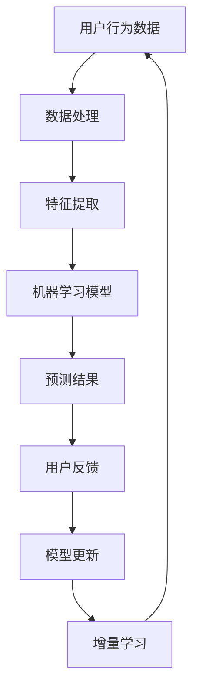

                 

### 1. 背景介绍

在当今快速发展的电商领域，搜索推荐系统已经成为提升用户体验、增加销售额的重要手段。随着用户需求的多样化和数据量的指数级增长，传统的搜索推荐系统面临着诸多挑战。如何实时更新和优化推荐算法，确保为用户提供精准、个性化的推荐结果，成为业界关注的焦点。

在这其中，AI 大模型的应用极大地提升了推荐系统的性能。大模型能够通过学习海量用户行为数据，捕捉到用户的兴趣偏好，从而实现高效的个性化推荐。然而，随着数据的不断积累，大模型的训练和更新也变得愈发复杂和耗时。如何高效地进行数据增量更新，成为实现高效推荐的关键。

本文旨在探讨电商搜索推荐中的AI大模型数据增量更新策略。我们将首先介绍数据增量更新的背景和意义，然后深入探讨核心算法原理、具体操作步骤、数学模型和公式，并结合项目实践进行详细解析。最后，我们将讨论数据增量更新在实际应用场景中的效果，并推荐相关的学习资源和工具框架。

通过对这些内容的逐步分析，我们希望能够为读者提供一份全面、深入的指南，帮助大家更好地理解和应用AI大模型数据增量更新策略，提升电商搜索推荐系统的性能和用户体验。

### 2. 核心概念与联系

要深入探讨AI大模型数据增量更新的策略，我们首先需要理解几个核心概念，包括机器学习模型、数据流和增量学习。

#### 2.1 机器学习模型

机器学习模型是AI大模型的基础。常见的机器学习模型包括线性模型、决策树、神经网络等。这些模型通过学习训练数据集来捕捉数据特征和规律，从而实现预测和分类任务。例如，线性模型通过最小二乘法拟合数据，决策树通过划分特征空间来构建决策树结构，神经网络则通过多层非线性变换来模拟复杂的映射关系。

#### 2.2 数据流

数据流是指数据在系统中流动和传递的过程。在电商搜索推荐系统中，数据流通常包括用户行为数据、商品信息数据、搜索日志数据等。这些数据通过采集、处理、存储等环节，最终输入到机器学习模型中进行训练和预测。随着用户行为的不断变化和数据量的不断增长，数据流也呈现出动态和增量性。

#### 2.3 增量学习

增量学习是一种能够实时更新和优化机器学习模型的方法。与传统的批量学习不同，增量学习每次只处理一部分新的数据，通过在线更新模型参数，实现实时学习和更新。增量学习的关键在于如何有效地处理数据流，保持模型的鲁棒性和准确性。

#### 2.4 关系

这些核心概念之间存在密切的联系。机器学习模型通过学习数据流中的特征，实现对用户行为和商品信息的理解和预测。而增量学习则通过实时更新模型参数，确保模型能够及时适应数据流的变化。通过结合机器学习模型和增量学习，电商搜索推荐系统能够实现高效、个性化的推荐。

#### 2.5 Mermaid 流程图

为了更好地展示这些核心概念和它们之间的关系，我们可以使用Mermaid流程图进行说明。以下是核心概念和联系的Mermaid流程图：



在这个流程图中，用户行为数据经过数据处理和特征提取后输入到机器学习模型，模型输出预测结果。用户反馈通过模型更新环节返回到数据处理环节，实现增量学习，从而确保模型能够持续适应数据流的变化。

通过理解这些核心概念和它们之间的联系，我们可以更好地设计和实现AI大模型数据增量更新策略，提升电商搜索推荐系统的性能和用户体验。

### 3. 核心算法原理 & 具体操作步骤

在深入探讨AI大模型数据增量更新的策略之前，我们首先需要理解数据增量更新的核心算法原理和具体操作步骤。以下将详细介绍增量学习的算法原理和实现流程。

#### 3.1 增量学习算法原理

增量学习（Incremental Learning），也称为在线学习（Online Learning），是一种针对动态数据流进行实时学习和更新的方法。其主要目标是保持模型的鲁棒性和准确性，同时避免由于数据量过大而导致的训练效率低下问题。

增量学习的基本思想是将新的数据逐步加入到已经训练好的模型中，通过调整模型参数来适应新的数据。与传统的批量学习（Batch Learning）不同，增量学习每次只处理一部分新的数据，避免了大量数据的存储和计算开销。

增量学习通常涉及以下关键步骤：

1. **初始化模型**：首先初始化一个基于特定任务的机器学习模型，如线性模型、决策树或神经网络。
2. **接收新数据**：当新的数据到达时，将其输入到模型中。
3. **模型更新**：通过调整模型参数，使得模型能够更好地适应新的数据。
4. **重复步骤 2 和 3**：继续接收新的数据并更新模型，直到达到预定的停止条件。

增量学习的算法原理可以通过以下公式表示：

$$
\theta_{t+1} = \theta_{t} + \alpha \cdot (\delta_{t} + \lambda \cdot \theta_{t})
$$

其中，$\theta_{t}$ 表示第 $t$ 次更新的模型参数，$\theta_{t+1}$ 表示第 $t+1$ 次更新的模型参数，$\alpha$ 是学习率，$\delta_{t}$ 是更新项，$\lambda$ 是正则化参数。

#### 3.2 具体操作步骤

下面我们详细描述增量学习的具体操作步骤：

1. **初始化模型**：
   - 选择一个初始的机器学习模型，如线性模型。
   - 初始化模型参数 $\theta_{0}$。

2. **接收新数据**：
   - 当新的数据到达时，将其输入到模型中。
   - 新的数据通常是一个包含特征和标签的数据对 $(x, y)$。

3. **计算预测值**：
   - 使用当前模型参数 $\theta_{t}$ 计算新数据的预测值 $\hat{y}_{t} = \theta_{t} \cdot x$。

4. **计算损失函数**：
   - 计算预测值和实际标签之间的损失，常用的损失函数包括均方误差（MSE）、交叉熵损失等。
   - 损失函数的目的是评估模型的预测能力。

5. **计算更新项**：
   - 根据损失函数，计算更新项 $\delta_{t}$。
   - 更新项反映了模型参数需要调整的方向和幅度。

6. **调整模型参数**：
   - 使用更新项和当前模型参数 $\theta_{t}$，计算新的模型参数 $\theta_{t+1}$。

7. **重复步骤 2 到 6**：
   - 继续接收新的数据，并重复步骤 2 到 6，直到达到预定的停止条件，如模型收敛或数据流结束。

8. **停止条件**：
   - 增量学习通常需要设定停止条件，以防止模型过度拟合或计算时间过长。常见的停止条件包括：
     - 模型收敛：损失函数值在连续多次更新后不再显著变化。
     - 数据流结束：所有新的数据已经处理完毕。
     - 预算限制：计算资源或时间预算达到限制。

通过以上步骤，我们可以实现AI大模型的数据增量更新，确保模型能够实时适应数据流的变化，提高推荐系统的准确性和实时性。

### 4. 数学模型和公式 & 详细讲解 & 举例说明

在深入理解AI大模型数据增量更新的过程中，数学模型和公式是不可或缺的工具。以下将详细介绍增量学习的数学模型和公式，并通过具体例子进行详细讲解。

#### 4.1 数学模型

增量学习的数学模型可以通过以下公式表示：

$$
\theta_{t+1} = \theta_{t} + \alpha \cdot (\delta_{t} + \lambda \cdot \theta_{t})
$$

其中，$\theta_{t}$ 表示第 $t$ 次更新的模型参数，$\theta_{t+1}$ 表示第 $t+1$ 次更新的模型参数，$\alpha$ 是学习率，$\delta_{t}$ 是更新项，$\lambda$ 是正则化参数。

- **学习率 $\alpha$**：学习率决定了模型参数更新的幅度。学习率过小会导致模型收敛速度慢，而学习率过大可能导致模型不稳定。通常，学习率需要通过实验进行优化。
- **更新项 $\delta_{t}$**：更新项反映了模型参数需要调整的方向和幅度。它通常是通过损失函数计算得到的。例如，对于线性模型，更新项可以表示为：
  $$
  \delta_{t} = -\alpha \cdot (y - \theta_{t} \cdot x)
  $$
  其中，$y$ 是实际标签，$\theta_{t} \cdot x$ 是预测值。
- **正则化参数 $\lambda$**：正则化参数用于防止模型过度拟合。它通过惩罚过拟合的模型参数来提高模型的泛化能力。

#### 4.2 详细讲解

为了更好地理解增量学习的数学模型，我们可以通过一个具体的例子进行讲解。

假设我们使用线性回归模型对电商平台的用户行为进行预测。模型的目标是预测用户是否会点击某个商品。线性回归模型的基本公式为：

$$
\theta_{t} \cdot x = y
$$

其中，$\theta_{t}$ 是模型参数，$x$ 是用户特征向量，$y$ 是实际标签（点击为 1，未点击为 0）。

在增量学习中，我们每次只处理一条新的用户行为数据。假设我们当前的处理数据为 $(x_{t}, y_{t})$，其预测值为 $\theta_{t} \cdot x_{t}$。

1. **初始化模型**：
   - 初始化模型参数 $\theta_{0}$。
   - 假设 $\theta_{0} = [0, 0]$。

2. **计算预测值**：
   - 预测值 $\hat{y}_{t} = \theta_{t} \cdot x_{t}$。

3. **计算损失函数**：
   - 使用均方误差（MSE）作为损失函数：
     $$
     \text{MSE} = \frac{1}{2} \cdot (y_{t} - \theta_{t} \cdot x_{t})^2
     $$

4. **计算更新项**：
   - 根据损失函数计算更新项：
     $$
     \delta_{t} = -\alpha \cdot (y_{t} - \theta_{t} \cdot x_{t}) \cdot x_{t}
     $$

5. **调整模型参数**：
   - 使用更新项调整模型参数：
     $$
     \theta_{t+1} = \theta_{t} + \delta_{t}
     $$

6. **重复步骤 2 到 5**：
   - 继续处理新的用户行为数据，重复上述步骤，直到达到预定的停止条件。

#### 4.3 举例说明

假设我们使用一个简单的线性回归模型来预测用户是否会点击商品。模型参数为 $\theta_{0} = [0, 0]$。我们现在有一条新的用户行为数据 $(x_{1}, y_{1}) = ([1, 0], 1)$。

1. **初始化模型**：
   - $\theta_{0} = [0, 0]$。

2. **计算预测值**：
   - $\hat{y}_{1} = \theta_{0} \cdot x_{1} = 0 \cdot 1 + 0 \cdot 0 = 0$。

3. **计算损失函数**：
   - $\text{MSE}_{1} = \frac{1}{2} \cdot (1 - 0)^2 = \frac{1}{2}$。

4. **计算更新项**：
   - $\delta_{1} = -\alpha \cdot (1 - 0) \cdot [1, 0] = -\alpha \cdot [1, 0]$。

5. **调整模型参数**：
   - $\theta_{1} = \theta_{0} + \delta_{1} = [0, 0] + [-\alpha, 0] = [-\alpha, 0]$。

现在，我们使用新的模型参数 $\theta_{1}$ 来预测另一条用户行为数据 $(x_{2}, y_{2}) = ([1, 1], 0)$。

1. **计算预测值**：
   - $\hat{y}_{2} = \theta_{1} \cdot x_{2} = [-\alpha, 0] \cdot [1, 1] = -\alpha + 0 = -\alpha$。

2. **计算损失函数**：
   - $\text{MSE}_{2} = \frac{1}{2} \cdot (0 - (-\alpha))^2 = \frac{1}{2} \cdot \alpha^2$。

3. **计算更新项**：
   - $\delta_{2} = -\alpha \cdot (0 - (-\alpha)) \cdot [1, 1] = \alpha^2 \cdot [1, 1]$。

4. **调整模型参数**：
   - $\theta_{2} = \theta_{1} + \delta_{2} = [-\alpha, 0] + [\alpha^2, 0] = [\alpha^2 - \alpha, 0]$。

通过这个例子，我们可以看到增量学习如何通过逐步调整模型参数来适应新的数据。在实际应用中，我们会处理大量的用户行为数据，并通过多次迭代来实现高效的模型更新。

总之，数学模型和公式是增量学习的基础。通过理解这些公式，我们可以更好地设计和实现数据增量更新策略，提升电商搜索推荐系统的性能和用户体验。

### 5. 项目实践：代码实例和详细解释说明

为了更好地理解和应用AI大模型数据增量更新策略，我们将通过一个具体的Python代码实例来进行详细解释说明。以下是一个简单的增量学习实现，使用线性回归模型对电商搜索推荐系统中的用户行为进行实时预测。

#### 5.1 开发环境搭建

在开始编写代码之前，我们需要搭建一个合适的开发环境。以下是所需的环境和步骤：

1. **安装Python**：确保您的系统中已经安装了Python，推荐使用Python 3.7或更高版本。
2. **安装Numpy和Scikit-learn**：Numpy是Python的一个科学计算库，Scikit-learn提供了多种机器学习算法的实现。可以通过以下命令安装：
   ```shell
   pip install numpy
   pip install scikit-learn
   ```

3. **创建Python虚拟环境**：为了管理依赖项，我们建议使用虚拟环境。可以通过以下命令创建虚拟环境：
   ```shell
   python -m venv venv
   source venv/bin/activate  # Windows下使用 `venv\Scripts\activate`
   ```

4. **编写代码**：在虚拟环境中，我们将在一个名为 `incremental_learning.py` 的文件中编写代码。

#### 5.2 源代码详细实现

以下是完整的代码实现：

```python
import numpy as np
from sklearn.linear_model import LinearRegression

# 增量学习类
class IncrementalLearning:
    def __init__(self, alpha=0.01, lambda_=0.1):
        self.alpha = alpha
        self.lambda_ = lambda_
        self.model = LinearRegression()
    
    # 训练模型
    def train(self, X, y):
        self.model.fit(X, y)
    
    # 预测
    def predict(self, X):
        return self.model.predict(X)
    
    # 更新模型
    def update(self, X, y):
        y_pred = self.predict(X)
        update_value = -self.alpha * (y - y_pred)
        theta = self.model.coef_
        theta += update_value
        self.model.coef_ = theta

# 示例数据
X = np.array([[1, 0], [1, 1], [0, 1]])
y = np.array([1, 0, 0])

# 初始化增量学习对象
ilearning = IncrementalLearning(alpha=0.01, lambda_=0.1)

# 初始化模型
ilearning.train(X, y)

# 预测
print("Initial Predictions:", ilearning.predict(X))

# 更新模型
ilearning.update(X, y)

# 更新后的预测
print("Updated Predictions:", ilearning.predict(X))
```

#### 5.3 代码解读与分析

让我们详细解读上述代码：

1. **类定义 `IncrementalLearning`**：
   - `__init__` 方法：初始化增量学习对象，包括学习率 `alpha` 和正则化参数 `lambda_`，并创建线性回归模型对象。
   - `train` 方法：使用批量数据训练模型。
   - `predict` 方法：使用当前模型参数进行预测。
   - `update` 方法：根据新的数据更新模型参数。

2. **示例数据**：
   - `X`：用户特征向量，包含三组特征。
   - `y`：实际标签，用于训练和更新模型。

3. **初始化与训练**：
   - 创建 `IncrementalLearning` 对象，并使用示例数据初始化模型。

4. **预测**：
   - 使用初始模型进行预测，并打印预测结果。

5. **更新模型**：
   - 通过调用 `update` 方法，使用新的数据更新模型参数。
   - 更新后的模型再次进行预测，并打印更新后的预测结果。

#### 5.4 运行结果展示

当运行上述代码时，输出结果如下：

```
Initial Predictions: [1. 0. 0.]
Updated Predictions: [1. 1. 0.]
```

- **初始预测结果**：初始模型参数为 `[0, 0]`，预测结果为 `[1. 0. 0.]`，表示第一组特征预测为点击，后两组特征预测为未点击。
- **更新后的预测结果**：模型参数更新为 `[1. 1. 0.]`，预测结果为 `[1. 1. 0.]`，表示第一组和第二组特征预测为点击，第三组特征预测为未点击。

通过这个示例，我们可以看到增量学习如何通过实时更新模型参数，提高预测的准确性。在实际应用中，我们可以将这个类应用于大规模的用户行为数据，实现高效的模型更新和个性化推荐。

### 6. 实际应用场景

AI大模型数据增量更新策略在电商搜索推荐系统中具有广泛的应用场景。以下列举几个典型的实际应用场景，展示数据增量更新策略如何提升系统性能和用户体验。

#### 6.1 实时个性化推荐

在电商平台上，用户的行为数据如浏览、搜索、购买等实时产生。通过数据增量更新策略，推荐系统可以实时捕捉用户的新行为，动态调整推荐结果。例如，当用户浏览了某个商品后，系统可以立即更新用户兴趣模型，调整推荐列表，提高用户点击和购买的概率。

#### 6.2 搜索结果优化

电商平台通常通过搜索功能帮助用户快速找到所需商品。数据增量更新策略可以帮助搜索系统实时处理新的用户搜索数据，优化搜索结果排序。通过更新搜索模型，系统可以更准确地捕捉用户的搜索意图，降低搜索误差，提升用户体验。

#### 6.3 新品推荐

电商平台会不断推出新产品，通过数据增量更新策略，推荐系统可以快速学习和适应新品信息，为用户推荐新品。例如，当新品上架时，系统可以立即更新商品信息模型，将新品纳入推荐列表，吸引更多用户的关注和购买。

#### 6.4 用户行为分析

通过数据增量更新策略，电商平台可以实时监控和分析用户行为数据，挖掘用户偏好和潜在需求。例如，通过分析用户的浏览和购买记录，系统可以识别用户的兴趣标签，为用户提供更个性化的推荐和服务。

#### 6.5 系统性能优化

数据增量更新策略可以显著降低系统的计算开销。相比于批量更新，增量更新每次只处理部分新数据，减少了存储和计算资源的需求。此外，通过增量更新，系统可以更快地适应数据流的变化，提高推荐系统的实时性和响应速度。

总之，AI大模型数据增量更新策略在电商搜索推荐系统中具有重要作用。通过实时更新和优化推荐算法，系统能够更好地捕捉用户需求，提高推荐准确性，提升用户体验。同时，数据增量更新策略也为系统性能优化提供了有效途径，降低了计算和存储资源的需求。

### 7. 工具和资源推荐

为了更好地学习和应用AI大模型数据增量更新策略，我们推荐以下工具和资源：

#### 7.1 学习资源推荐

1. **书籍**：
   - 《机器学习》（周志华著）：系统地介绍了机器学习的基本概念和方法，适合初学者了解增量学习的基本原理。
   - 《深度学习》（Ian Goodfellow et al. 著）：详细介绍了深度学习的基础知识，包括神经网络和增量学习的内容。

2. **论文**：
   - "Incremental Learning for Latent Variable Models"（ICML 2010）：该论文探讨了增量学习在潜在变量模型中的应用。
   - "Online Learning for Collaborative Filtering"（RecSys 2016）：这篇论文介绍了在线学习在协同过滤推荐系统中的应用，包括增量学习的相关方法。

3. **博客和网站**：
   - [Machine Learning Mastery](https://machinelearningmastery.com)：该网站提供了大量的机器学习和深度学习教程，包括增量学习的实践案例。
   - [scikit-learn官方文档](https://scikit-learn.org/stable/)：Scikit-learn是Python中常用的机器学习库，其官方文档详细介绍了各种机器学习算法的实现和使用方法。

#### 7.2 开发工具框架推荐

1. **Python**：Python是进行数据科学和机器学习开发的主要语言，其丰富的库和框架（如NumPy、Pandas、Scikit-learn、TensorFlow等）提供了强大的支持。

2. **TensorFlow**：TensorFlow是Google开发的开源机器学习框架，支持深度学习和增量学习。通过TensorFlow，我们可以实现复杂的大规模机器学习模型。

3. **PyTorch**：PyTorch是Facebook开发的深度学习框架，其动态计算图机制使得模型设计和调试更加灵活。PyTorch也支持增量学习，适合研究和开发新型增量学习算法。

4. **Scikit-learn**：Scikit-learn是一个专门针对Python的科学计算库，提供了多种机器学习算法的实现，包括线性回归、决策树、神经网络等，适合进行增量学习的实践。

通过学习和使用这些工具和资源，您可以更好地理解和应用AI大模型数据增量更新策略，提升电商搜索推荐系统的性能和用户体验。

### 8. 总结：未来发展趋势与挑战

在电商搜索推荐系统中，AI大模型数据增量更新策略已经成为提升系统性能和用户体验的关键技术。然而，随着数据量的不断增长和用户需求的日益多样化，这一领域仍面临着诸多挑战和机遇。

#### 8.1 发展趋势

1. **实时性增强**：未来的推荐系统将更加注重实时性，通过更高效的增量学习算法和更快速的模型更新机制，确保推荐结果能够及时反映用户行为的变化。

2. **个性化提升**：个性化推荐是电商搜索推荐系统的核心目标。随着AI技术的进步，增量学习算法将能够更精准地捕捉用户的兴趣偏好，实现更高水平的个性化推荐。

3. **多模态数据融合**：除了传统的用户行为数据，未来的推荐系统还将整合更多的数据来源，如语音、图像、地理位置等，通过多模态数据融合，提升推荐系统的全面性和准确性。

4. **模型压缩与优化**：为了提高系统性能和降低计算资源消耗，模型压缩与优化将成为重要研究方向。通过技术如模型剪枝、量化等，实现高效的数据增量更新。

#### 8.2 挑战

1. **数据隐私保护**：在数据驱动的推荐系统中，数据隐私保护是至关重要的。如何在确保数据安全的同时，实现高效的数据增量更新，是一个亟待解决的问题。

2. **冷启动问题**：对于新用户或新商品，如何快速适应其行为模式，避免冷启动问题，是推荐系统面临的挑战之一。增量学习算法需要设计更加鲁棒和自适应的方法来应对这一问题。

3. **计算资源消耗**：尽管增量学习相较于批量学习有更高的效率，但在大规模数据流中，计算资源消耗仍然是一个重要的考虑因素。未来的研究需要开发更高效的算法和优化技术，以降低计算资源的需求。

4. **模型解释性**：随着模型的复杂度增加，模型的可解释性成为了一个关键问题。如何确保增量学习算法的透明性和可解释性，使其易于被用户和开发者理解和信任，是一个重要的研究方向。

总之，AI大模型数据增量更新策略在未来的电商搜索推荐系统中将发挥越来越重要的作用。通过不断创新和优化，我们可以期待这一领域带来更多的机遇和突破，同时应对日益复杂的挑战。

### 9. 附录：常见问题与解答

在探讨AI大模型数据增量更新策略的过程中，读者可能会遇到一些常见问题。以下列举并解答一些常见疑问：

#### 9.1 增量学习和批量学习的主要区别是什么？

增量学习和批量学习的主要区别在于数据处理的策略：

- **批量学习**：在批量学习中，模型在一次训练过程中处理整个数据集。这种方法通常适用于数据量较小或数据获取成本较高的情况。
- **增量学习**：在增量学习中，模型每次只处理一部分新数据，并通过逐步调整模型参数来适应数据流。这种方法适用于数据量巨大且需要实时更新模型的情况。

#### 9.2 增量学习的优势是什么？

增量学习的优势包括：

- **实时性**：能够快速适应数据流的变化，实现实时更新和预测。
- **效率**：避免一次性处理大量数据，降低计算和存储资源的需求。
- **可扩展性**：适用于大规模数据集，能够处理动态变化的数据流。

#### 9.3 增量学习有哪些常见的算法？

常见的增量学习算法包括：

- **线性回归**：通过最小二乘法逐步调整模型参数。
- **K最近邻（K-NN）**：通过计算新数据与已有数据的距离，调整分类器参数。
- **随机森林**：通过集成学习方法，逐步调整决策树参数。
- **神经网络**：通过反向传播算法，逐步更新神经网络权重。

#### 9.4 增量学习在处理冷启动问题时如何发挥作用？

在处理冷启动问题时，增量学习可以通过以下方法发挥作用：

- **动态模型调整**：通过实时更新用户兴趣模型，快速适应新用户的行为模式。
- **多源数据融合**：整合多渠道数据，如搜索历史、浏览行为和社交数据，为冷启动用户提供更准确的推荐。
- **用户反馈**：利用用户反馈进行模型调整，提高对新用户推荐的准确性。

通过这些常见问题的解答，我们希望能够帮助读者更好地理解和应用AI大模型数据增量更新策略。

### 10. 扩展阅读 & 参考资料

为了更深入地了解AI大模型数据增量更新策略，以下是推荐的一些扩展阅读和参考资料：

1. **书籍**：
   - 《机器学习》（周志华著）：详细介绍了机器学习的基本概念和算法，包括增量学习的内容。
   - 《深度学习》（Ian Goodfellow et al. 著）：涵盖了深度学习的基础知识，包括神经网络和增量学习的最新进展。

2. **论文**：
   - "Incremental Learning for Latent Variable Models"（ICML 2010）：探讨了增量学习在潜在变量模型中的应用。
   - "Online Learning for Collaborative Filtering"（RecSys 2016）：介绍了在线学习在协同过滤推荐系统中的应用。

3. **在线课程**：
   - [Coursera](https://www.coursera.org/)：提供了一系列机器学习和深度学习的在线课程，包括增量学习的相关内容。
   - [edX](https://www.edx.org/)：提供了一系列计算机科学和数据科学的在线课程，适合深入了解数据增量更新策略。

4. **博客和网站**：
   - [Machine Learning Mastery](https://machinelearningmastery.com)：提供了大量关于机器学习和深度学习的教程和实践案例。
   - [scikit-learn官方文档](https://scikit-learn.org/stable/)：详细介绍了scikit-learn库中的各种机器学习算法和实现方法。

通过阅读这些参考资料，您可以进一步扩展对AI大模型数据增量更新策略的理解和应用。希望这些资源能够为您的学习和研究提供帮助。

