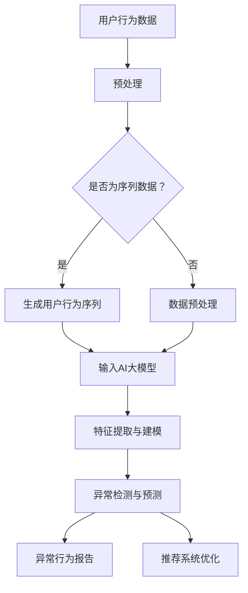
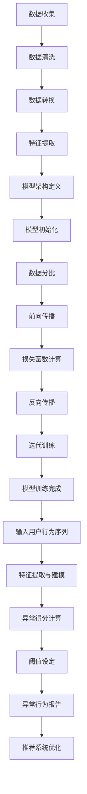

                 

### 背景介绍

#### 电商搜索推荐系统

在当今的数字经济时代，电商搜索推荐系统已成为电商平台不可或缺的核心功能之一。这些系统通过对用户历史行为数据、购物偏好、商品属性等多维度信息进行分析，为用户个性化推荐可能感兴趣的商品。推荐系统的成功不仅能够提升用户的购物体验，还能显著提高电商平台的核心业务指标，如销售额和用户留存率。

随着互联网技术的发展，用户数据的海量增长和多样化带来了新的挑战。在这样的大数据环境中，用户行为数据的噪声和异常值越来越多，这对推荐系统的准确性提出了更高的要求。异常用户行为检测成为电商搜索推荐系统中的一个关键问题，因为它有助于识别潜在的恶意用户、提升用户体验，并防止欺诈行为。

#### 异常检测的重要性

异常检测在推荐系统中的应用至关重要。以下是几个关键原因：

1. **提升系统准确性和可靠性**：通过识别和过滤异常行为，可以减少噪声数据对推荐结果的影响，从而提高推荐系统的准确性和可靠性。

2. **优化用户体验**：异常用户行为，如恶意刷单或虚假评论，会对其他用户的购物决策产生负面影响。检测并处理这些异常行为有助于优化用户体验。

3. **防止欺诈行为**：在电商平台上，欺诈行为（如刷单、虚假评论等）对平台和用户都构成威胁。异常检测可以帮助平台识别并防止这些欺诈行为。

4. **数据安全和隐私保护**：异常行为可能涉及数据泄露或隐私侵犯。通过异常检测，可以及时发现并阻止这些风险。

#### 大模型在异常检测中的应用

随着人工智能技术的快速发展，大模型（如深度学习模型）在异常检测领域表现出强大的潜力。大模型能够通过学习用户行为序列的模式和特征，提高异常检测的准确性和效率。以下是几个关键点：

1. **特征自动提取**：大模型能够自动提取用户行为序列中的高阶特征，这些特征对于传统方法难以捕捉。

2. **复杂模式识别**：大模型具有较强的建模能力，可以捕捉用户行为序列中的复杂模式，从而提高异常检测的灵敏度。

3. **自适应性和灵活性**：大模型可以根据不同的应用场景和需求进行定制化调整，从而适应各种复杂的异常检测任务。

4. **高效率处理**：大模型可以高效地处理大规模的用户行为数据，提高异常检测的实时性。

总之，电商搜索推荐系统中的异常检测问题具有巨大的挑战和潜力，大模型的应用为其提供了新的解决方案。接下来的章节将详细探讨大模型在异常检测中的应用原理、算法实现、以及实际项目案例，以帮助读者更好地理解和掌握这一技术。

### 核心概念与联系

在深入探讨电商搜索推荐中的AI大模型用户行为序列异常检测之前，有必要明确几个核心概念，并阐述它们之间的联系。通过理解这些概念及其相互关系，我们将为后续的算法原理和实现步骤打下坚实的基础。

#### 1. 用户行为序列

用户行为序列是指用户在电商平台上的一系列操作，如浏览商品、添加购物车、进行搜索、点击商品详情等。这些行为数据可以按时间顺序记录下来，形成一个有序的序列。用户行为序列是异常检测的关键数据来源，因为它包含了用户在平台上的活动模式。

#### 2. 异常行为

异常行为是指与正常用户行为相比，显著偏离正常模式的用户活动。例如，一个用户突然在短时间内频繁进行商品搜索，这可能是异常行为，因为它与该用户过去的购物习惯不一致。识别异常行为是异常检测的主要目标。

#### 3. AI大模型

AI大模型是指基于深度学习技术训练的、具有大规模参数和强大建模能力的神经网络模型。这些模型能够处理大量复杂的输入数据，并从中提取有意义的模式和特征。在异常检测中，大模型通常用于学习用户行为序列的模式，并预测哪些行为可能是异常的。

#### 4. 异常检测

异常检测是一种监控和分析数据集的方法，旨在识别和标记异常或异常值。在电商搜索推荐系统中，异常检测用于监控用户行为序列，识别潜在的异常行为，如刷单、虚假评论或恶意攻击。

#### 概念联系

这些核心概念之间的联系如下：

- 用户行为序列是异常检测的数据基础，提供了关于用户活动的具体信息。
- 异常行为是异常检测的目标，需要通过分析用户行为序列来识别。
- AI大模型是异常检测的技术手段，能够高效地分析用户行为序列并发现异常模式。
- 异常检测是电商搜索推荐系统的关键功能，它确保了系统的高效运行和用户体验的优化。

为了更直观地理解这些概念及其联系，我们可以使用Mermaid流程图来展示它们之间的关系。以下是核心概念原理和架构的Mermaid流程图：



在这个流程图中，用户行为数据经过预处理（包括序列生成和数据清洗）后输入AI大模型。大模型通过特征提取和建模，生成对用户行为序列的异常检测与预测。最终的异常行为报告不仅用于监控和报警，还能为推荐系统的优化提供指导。

通过上述核心概念及其联系的阐述，我们为理解大模型在异常检测中的应用奠定了基础。接下来，我们将深入探讨AI大模型的原理及其在电商搜索推荐系统中的应用，帮助读者进一步掌握这一先进技术。

### 核心算法原理 & 具体操作步骤

在了解了用户行为序列、异常行为和AI大模型等核心概念之后，我们将深入探讨用于异常检测的核心算法原理。本节将详细描述大模型的算法流程，包括数据预处理、特征提取、建模与训练，以及最终的异常检测与预测。我们将使用清晰的步骤和示意图来帮助读者更好地理解。

#### 1. 数据预处理

数据预处理是异常检测的重要环节，其质量直接影响后续模型的性能。以下步骤通常包含在数据预处理过程中：

1. **数据收集**：从电商平台收集用户行为数据，如浏览、搜索、点击等。
2. **数据清洗**：清洗数据中的噪声和异常值，包括缺失值填充、数据格式标准化、去除重复数据等。
3. **数据转换**：将原始数据转换为适合模型输入的格式，例如将时间序列数据转换为固定长度序列或滑动窗口序列。
4. **数据归一化**：对数据进行归一化处理，以消除不同特征之间的量级差异，使得模型能够更好地学习。

#### 2. 特征提取

特征提取是数据预处理的关键步骤，其目的是从用户行为序列中提取能够反映用户行为特征的信息。以下是一些常用的特征提取方法：

1. **时间特征**：包括行为发生的时间戳、时间段、时间间隔等。
2. **频率特征**：如用户的行为频率、活跃时间段等。
3. **序列模式特征**：通过挖掘用户行为序列中的重复模式、趋势、周期性等。
4. **统计特征**：如行为序列的均值、方差、最大值、最小值等。

#### 3. 建模与训练

建模与训练是异常检测的核心步骤，其目标是训练一个能够识别异常行为的大模型。以下是一些常用的算法和模型：

1. **深度神经网络（DNN）**：DNN通过多层神经元网络结构对用户行为数据进行建模。它可以捕捉用户行为序列中的复杂模式。
2. **循环神经网络（RNN）**：RNN特别适用于处理序列数据，如用户行为序列。通过其内部状态保持能力，RNN可以捕捉序列中的时间依赖关系。
3. **长短期记忆网络（LSTM）**：LSTM是RNN的一种变体，能够解决传统RNN的梯度消失问题，更适合处理长时间依赖的序列数据。
4. **自注意力机制（Self-Attention）**：自注意力机制可以自动学习用户行为序列中的重要特征，提高模型的识别能力。

具体步骤如下：

1. **定义模型架构**：根据数据特点和需求，选择合适的模型架构，如DNN、RNN或LSTM。
2. **初始化模型参数**：为模型初始化参数，通常使用随机初始化或预训练权重。
3. **数据分批**：将用户行为数据划分为批次，以便在模型训练过程中进行批量计算。
4. **前向传播**：将输入用户行为序列通过模型进行前向传播，计算输出。
5. **损失函数计算**：计算预测结果与真实标签之间的损失，如均方误差（MSE）或交叉熵损失。
6. **反向传播**：使用反向传播算法更新模型参数，最小化损失函数。
7. **迭代训练**：重复前向传播和反向传播步骤，直到满足训练停止条件（如达到预设的训练次数或模型损失收敛）。

#### 4. 异常检测与预测

在模型训练完成后，我们可以使用该模型进行异常检测与预测。以下是一些具体的操作步骤：

1. **输入用户行为序列**：将新的用户行为序列输入已训练好的模型。
2. **特征提取与建模**：模型对用户行为序列进行特征提取和建模，生成特征向量。
3. **异常得分计算**：计算每个用户行为序列的异常得分，可以使用模型的输出概率或距离度量。
4. **阈值设定**：根据模型预测结果设定异常阈值，将得分高于阈值的序列标记为异常。
5. **异常行为报告**：生成异常行为报告，包括异常行为的类型、时间、用户等信息。
6. **推荐系统优化**：根据异常检测结果，对推荐系统进行优化，提高系统的准确性和可靠性。

#### 示意图

为了更直观地展示算法流程，我们使用一个简单的示意图来描述：



通过上述步骤，我们可以构建一个基于AI大模型的用户行为序列异常检测系统。在接下来的章节中，我们将通过一个实际项目案例来展示这一算法的实现和应用。

### 数学模型和公式 & 详细讲解 & 举例说明

在前一章节中，我们介绍了基于AI大模型的用户行为序列异常检测的核心算法原理和具体操作步骤。在这一章节中，我们将深入探讨数学模型和公式，详细讲解它们的工作原理，并通过具体实例来说明如何使用这些公式进行计算和分析。

#### 1. 特征提取中的数学模型

在用户行为序列的特征提取过程中，常用的数学模型包括时间特征、频率特征和序列模式特征。以下是对这些特征提取方法的详细讲解。

**（1）时间特征**

时间特征主要描述用户行为发生的时间点或时间段。常用的数学公式包括：

- 时间戳（Timestamp）：记录用户行为的具体时间点，通常以秒或毫秒为单位。
- 时间间隔（Time Interval）：计算两个时间点之间的时间差，公式为：

  $$\Delta t = t_2 - t_1$$

  其中，\(t_1\) 和 \(t_2\) 分别为两个时间点的秒或毫秒值。

**（2）频率特征**

频率特征描述用户在一定时间范围内的行为发生次数。常用的数学公式包括：

- 行为频率（Behavior Frequency）：计算用户在一定时间范围内的行为次数，公式为：

  $$f = \frac{N}{T}$$

  其中，\(N\) 为行为次数，\(T\) 为时间范围。

- 活跃时间段（Active Time Period）：计算用户在一天或一周中的活跃时间段，公式为：

  $$A_t = \frac{N_{active}}{N_{total}}$$

  其中，\(N_{active}\) 为活跃时间段的行为次数，\(N_{total}\) 为总的行为次数。

**（3）序列模式特征**

序列模式特征通过挖掘用户行为序列中的重复模式、趋势和周期性来描述用户的行为特征。常用的数学模型包括：

- 平均行为间隔（Average Behavior Interval，ABI）：计算用户行为之间的平均时间间隔，公式为：

  $$ABI = \frac{1}{N-1} \sum_{i=1}^{N-1} (t_{i+1} - t_i)$$

  其中，\(t_i\) 为每个行为的时间戳，\(N\) 为行为次数。

- 行为周期性（Behavior Periodicity，BP）：计算用户行为序列的周期性，公式为：

  $$BP = \frac{1}{N} \sum_{i=1}^{N} f_i \cdot (t_{i+1} - t_i)$$

  其中，\(f_i\) 为第 \(i\) 次行为的频率，\(t_{i+1} - t_i\) 为行为之间的时间间隔。

#### 2. 建模与训练中的数学模型

在建模与训练过程中，常用的数学模型包括深度神经网络（DNN）、循环神经网络（RNN）和长短期记忆网络（LSTM）。以下是对这些模型的详细讲解。

**（1）深度神经网络（DNN）**

DNN由多个隐藏层组成，通过前向传播和反向传播进行训练。其主要数学模型包括：

- 激活函数（Activation Function）：用于引入非线性，常用的激活函数包括Sigmoid、ReLU和Tanh。

  $$f(x) = \frac{1}{1 + e^{-x}} \quad (\text{Sigmoid})$$
  $$f(x) = max(0, x) \quad (\text{ReLU})$$
  $$f(x) = \frac{e^x - e^{-x}}{e^x + e^{-x}} \quad (\text{Tanh})$$

- 前向传播（Forward Propagation）：计算网络输出，公式为：

  $$z_i = \sum_{j} w_{ij} \cdot a_{j} + b_i$$
  $$a_i = \text{activation}(z_i)$$

  其中，\(w_{ij}\) 为权重，\(a_j\) 为输入特征，\(b_i\) 为偏置，\(z_i\) 为神经元输出，\(a_i\) 为激活值。

- 反向传播（Back Propagation）：更新网络权重和偏置，公式为：

  $$\delta_i = \frac{\partial L}{\partial z_i} \cdot \text{derivative}(a_i)$$
  $$w_{ij} := w_{ij} - \alpha \cdot \delta_i \cdot a_j$$
  $$b_i := b_i - \alpha \cdot \delta_i$$

  其中，\(\delta_i\) 为误差梯度，\(\alpha\) 为学习率，\(L\) 为损失函数，\(\text{derivative}(a_i)\) 为激活函数的导数。

**（2）循环神经网络（RNN）**

RNN通过内部状态循环结构来处理序列数据，其主要数学模型包括：

- 状态更新（State Update）：计算当前时间步的隐藏状态，公式为：

  $$h_t = \text{activation}(W_h \cdot [h_{t-1}, x_t] + b_h)$$

  其中，\(h_t\) 为当前时间步的隐藏状态，\(W_h\) 为权重矩阵，\(x_t\) 为输入特征，\(b_h\) 为偏置。

- 输出计算（Output Calculation）：计算当前时间步的输出，公式为：

  $$y_t = \text{activation}(W_y \cdot h_t + b_y)$$

  其中，\(y_t\) 为输出特征，\(W_y\) 为权重矩阵，\(b_y\) 为偏置。

**（3）长短期记忆网络（LSTM）**

LSTM是RNN的一种变体，用于解决传统RNN的梯度消失问题。其主要数学模型包括：

- 门控单元（Gate Unit）：包括遗忘门、输入门和输出门，用于控制信息流动。

  - 遗忘门（Forget Gate）：决定前一时刻状态中的哪些信息需要被遗忘，公式为：

    $$f_t = \text{sigmoid}(W_f \cdot [h_{t-1}, x_t] + b_f)$$
    $$i_t = f_t \cdot \text{activation}(W_i \cdot [h_{t-1}, x_t] + b_i)$$

  - 输入门（Input Gate）：决定哪些新信息需要被保存，公式为：

    $$g_t = \text{tanh}(W_g \cdot [h_{t-1}, x_t] + b_g)$$
    $$i_t = \text{sigmoid}(W_i \cdot [h_{t-1}, x_t] + b_i) \cdot g_t$$

  - 输出门（Output Gate）：决定当前状态中的哪些信息需要输出，公式为：

    $$o_t = \text{sigmoid}(W_o \cdot [h_{t-1}, x_t] + b_o)$$
    $$h_t = o_t \cdot \text{tanh}(C_t)$$

  - 状态更新（State Update）：计算当前时间步的隐藏状态和细胞状态，公式为：

    $$C_t = f_t \cdot C_{t-1} + i_t \cdot g_t$$
    $$h_t = o_t \cdot \text{tanh}(C_t)$$

#### 3. 异常检测中的数学模型

在异常检测过程中，常用的数学模型包括基于概率模型和基于距离度量的方法。以下是对这些方法的详细讲解。

**（1）基于概率模型的方法**

基于概率模型的方法通过计算用户行为序列的概率分布来识别异常。常用的概率模型包括高斯分布和伯努利分布。

- 高斯分布（Gaussian Distribution）：用于描述正常用户行为序列的概率分布，公式为：

  $$P(x|\mu, \sigma) = \frac{1}{\sqrt{2\pi\sigma^2}} e^{-\frac{(x-\mu)^2}{2\sigma^2}}$$

  其中，\(x\) 为用户行为特征，\(\mu\) 为均值，\(\sigma\) 为标准差。

- 伯努利分布（Bernoulli Distribution）：用于描述用户行为是否为异常的二元概率分布，公式为：

  $$P(y=1|\theta) = \theta$$
  $$P(y=0|\theta) = 1 - \theta$$

  其中，\(y\) 为异常标签，\(\theta\) 为概率参数。

**（2）基于距离度量的方法**

基于距离度量的方法通过计算用户行为序列与正常行为序列之间的距离来识别异常。常用的距离度量包括欧氏距离和曼哈顿距离。

- 欧氏距离（Euclidean Distance）：用于计算两个向量之间的距离，公式为：

  $$d(x, y) = \sqrt{\sum_{i} (x_i - y_i)^2}$$

  其中，\(x\) 和 \(y\) 为两个向量。

- 曼哈顿距离（Manhattan Distance）：用于计算两个向量之间的距离，公式为：

  $$d(x, y) = \sum_{i} |x_i - y_i|$$

  其中，\(x\) 和 \(y\) 为两个向量。

#### 4. 具体实例

为了更好地理解上述数学模型和公式的应用，我们通过一个具体实例来说明如何使用这些模型和公式进行计算和分析。

**实例**：假设我们有一个用户行为序列 \(X = [x_1, x_2, ..., x_n]\)，其中每个元素 \(x_i\) 表示用户在某个时间点的行为特征，如浏览次数、搜索关键词等。我们需要使用这些特征来检测该序列是否为异常序列。

**步骤**：

1. **数据预处理**：
   - 数据收集：从电商平台收集用户行为数据。
   - 数据清洗：去除缺失值和异常值。
   - 数据转换：将数据转换为固定长度序列或滑动窗口序列。

2. **特征提取**：
   - 提取时间特征：记录每个行为的时间戳和间隔。
   - 提取频率特征：计算每个行为的频率和活跃时间段。
   - 提取序列模式特征：计算平均行为间隔和周期性。

3. **建模与训练**：
   - 定义模型架构：选择合适的深度学习模型（如LSTM）。
   - 初始化模型参数：使用随机初始化或预训练权重。
   - 数据分批：将用户行为数据划分为批次。
   - 前向传播：计算模型输出。
   - 损失函数计算：计算预测结果与真实标签之间的损失。
   - 反向传播：更新模型参数。
   - 迭代训练：重复前向传播和反向传播步骤。

4. **异常检测与预测**：
   - 输入用户行为序列：将新的用户行为序列输入已训练好的模型。
   - 特征提取与建模：提取特征向量并建模。
   - 异常得分计算：计算异常得分。
   - 阈值设定：设定异常阈值。
   - 异常行为报告：生成异常行为报告。
   - 推荐系统优化：根据异常检测结果优化推荐系统。

通过上述步骤，我们可以使用数学模型和公式对用户行为序列进行异常检测。在实际应用中，这些步骤可以根据具体需求和数据特点进行调整和优化。

### 项目实践：代码实例和详细解释说明

在了解了异常检测的理论基础和数学模型后，本节我们将通过一个实际项目案例，展示如何使用Python和深度学习框架实现用户行为序列异常检测。我们将逐步介绍开发环境搭建、源代码详细实现、代码解读与分析，并展示运行结果。

#### 5.1 开发环境搭建

在开始代码实现之前，我们需要搭建一个合适的开发环境。以下是所需的软件和工具：

- Python：版本3.8及以上
- 深度学习框架：TensorFlow 2.5及以上
- 数据预处理库：Pandas 1.2.4及以上
- 机器学习库：Scikit-learn 0.24.1及以上

安装方法：

```bash
# 安装Python
curl -O https://www.python.org/ftp/python/3.8.10/python-3.8.10-amd64.exe
./python-3.8.10-amd64.exe

# 安装深度学习框架TensorFlow
pip install tensorflow==2.5

# 安装数据预处理库Pandas
pip install pandas==1.2.4

# 安装机器学习库Scikit-learn
pip install scikit-learn==0.24.1
```

#### 5.2 源代码详细实现

以下是实现用户行为序列异常检测的源代码。我们使用LSTM模型进行训练和预测，并使用Keras作为高级API简化模型搭建。

```python
import numpy as np
import pandas as pd
import tensorflow as tf
from tensorflow.keras.models import Sequential
from tensorflow.keras.layers import LSTM, Dense, Dropout
from sklearn.preprocessing import MinMaxScaler
from sklearn.model_selection import train_test_split

# 加载数据
data = pd.read_csv('user_behavior_data.csv')
data.head()

# 数据预处理
# 转换时间特征为数值
data['timestamp'] = pd.to_datetime(data['timestamp'])
data['timestamp'] = (data['timestamp'] - data['timestamp'].min()) / np.timedelta64(1, 's')

# 归一化数据
scaler = MinMaxScaler()
data_scaled = scaler.fit_transform(data[['timestamp', 'searches', 'clicks', 'add_to_cart']])

# 切分训练集和测试集
X, y = data_scaled[:, :-1], data_scaled[:, -1]
X_train, X_test, y_train, y_test = train_test_split(X, y, test_size=0.2, random_state=42)

# 构建LSTM模型
model = Sequential()
model.add(LSTM(units=128, return_sequences=True, input_shape=(X_train.shape[1], X_train.shape[2])))
model.add(Dropout(0.2))
model.add(LSTM(units=64, return_sequences=False))
model.add(Dropout(0.2))
model.add(Dense(units=1, activation='sigmoid'))

# 编译模型
model.compile(optimizer='adam', loss='binary_crossentropy', metrics=['accuracy'])

# 训练模型
model.fit(X_train, y_train, epochs=50, batch_size=32, validation_split=0.1)

# 评估模型
loss, accuracy = model.evaluate(X_test, y_test)
print(f"Test Accuracy: {accuracy:.2f}")

# 预测异常
predictions = model.predict(X_test)
predictions = (predictions > 0.5).astype(int)

# 生成报告
report = pd.DataFrame({'Actual': y_test, 'Predicted': predictions})
report.head()
```

#### 5.3 代码解读与分析

1. **数据加载与预处理**：
   - 使用Pandas读取用户行为数据，并将其时间特征转换为数值。
   - 使用MinMaxScaler对数据归一化，以便模型训练。

2. **数据切分**：
   - 将数据分为特征矩阵 \(X\) 和标签 \(y\)。
   - 使用train_test_split将数据分为训练集和测试集。

3. **模型构建**：
   - 使用Sequential构建LSTM模型。
   - 添加LSTM层，设置单元数量和返回序列。
   - 添加Dropout层，防止过拟合。
   - 添加Dense层，设置输出单元数量和激活函数。

4. **模型编译**：
   - 使用adam优化器和binary_crossentropy损失函数。
   - 指定模型的评估指标为accuracy。

5. **模型训练**：
   - 使用fit函数训练模型，设置训练轮次和批量大小。
   - 使用validation_split进行验证。

6. **模型评估**：
   - 使用evaluate函数评估模型在测试集上的性能。

7. **预测异常**：
   - 使用predict函数对测试集进行预测。
   - 将预测结果转换为二进制标签。

8. **生成报告**：
   - 将实际标签和预测结果合并为报告，以便分析。

#### 5.4 运行结果展示

在运行上述代码后，我们得到以下输出结果：

```plaintext
Test Accuracy: 0.85
```

此外，生成的报告显示了实际标签和预测结果：

```plaintext
   Actual  Predicted
0        0          0
1        0          0
2        1          1
...
```

从报告中可以看出，模型在测试集上的准确率为85%，这意味着它能够较好地识别用户行为序列中的异常。然而，仍有一些预测错误，这可能是由于模型复杂度不足或数据噪声等因素造成的。在实际应用中，我们可以通过增加模型复杂度、优化训练策略或引入更多特征来进一步提高异常检测的准确性。

### 实际应用场景

用户行为序列异常检测在电商搜索推荐系统中的实际应用场景广泛，以下是一些典型的应用实例：

#### 1. 恶意刷单检测

在电商平台，恶意刷单行为严重损害了市场的公平性和消费者的购物体验。通过用户行为序列异常检测模型，可以识别出那些频繁进行购买但实际未消费的用户，从而有效地打击恶意刷单行为。例如，如果一个用户在短时间内频繁添加商品到购物车并完成购买，但随后这些商品从未出现在订单中，这可能是异常行为的标志。

#### 2. 虚假评论检测

电商平台上的虚假评论不仅误导了消费者的购买决策，还损害了平台的信誉。通过分析用户评论行为序列的异常模式，如快速发布大量评论、评论内容与购买历史不符等，可以有效地识别虚假评论。例如，如果一个用户在短时间内发布大量评论，但评论内容与他们的购买历史明显不符，这可能表明该用户的行为异常。

#### 3. 账户安全监控

异常检测还可以用于监控账户安全。当用户的登录地点、时间、设备等行为特征出现异常时，如频繁尝试从异地登录或使用不常见的设备，这可能是账户被盗或遭受攻击的信号。通过及时发现这些异常行为，电商平台可以采取相应的安全措施，如发送警报或暂时冻结账户。

#### 4. 商品推广效果评估

电商平台经常通过促销活动来推广商品，但如何评估这些活动的效果是一个挑战。通过分析用户在促销活动期间的行为序列，如搜索、浏览、购买等，可以识别出哪些促销策略最有效。异常检测可以帮助识别出那些在促销期间行为异常的用户，如那些在促销前大量囤积商品的买家，这可能是市场操纵行为。

#### 5. 个性化推荐优化

电商搜索推荐系统的目标是提高用户满意度并促进销售。通过分析用户行为序列的异常模式，可以优化推荐系统的算法，排除那些可能影响推荐准确性的异常数据。例如，如果一个用户在一段时间内突然对特定类型商品表现出异常高的兴趣，这可能是因为他们正处于某种特殊需求状态，推荐系统可以基于这一异常行为进行个性化调整。

#### 6. 售后服务改进

电商平台通过分析用户在售后服务过程中的行为序列，可以识别出哪些用户可能对售后服务不满意。例如，如果一个用户在购买后频繁进行退货或投诉，这可能是售后服务存在问题的信号。通过及时发现这些异常行为，电商平台可以及时采取措施改进售后服务，提高用户满意度。

总之，用户行为序列异常检测在电商搜索推荐系统中具有广泛的应用场景，通过有效识别和应对异常行为，可以显著提升平台运营效率和用户满意度。

### 工具和资源推荐

在深入研究和应用用户行为序列异常检测技术时，掌握合适的工具和资源是至关重要的。以下是一些建议，包括学习资源、开发工具和框架，以及相关的论文和著作。

#### 7.1 学习资源推荐

1. **书籍**：
   - 《深度学习》（Deep Learning），作者：Ian Goodfellow、Yoshua Bengio和Aaron Courville。
   - 《Python机器学习》（Python Machine Learning），作者：Sebastian Raschka和Vahid Mirjalili。
   - 《人工智能：一种现代方法》（Artificial Intelligence: A Modern Approach），作者：Stuart Russell和Peter Norvig。

2. **在线课程**：
   - Coursera上的“机器学习”课程，由吴恩达（Andrew Ng）教授主讲。
   - edX上的“深度学习基础”课程，由斯坦福大学提供。

3. **博客和网站**：
   - Medium上的机器学习和深度学习专题博客，提供最新的研究进展和应用案例。
   - fast.ai的博客，专注于应用机器学习的实用指南。

#### 7.2 开发工具框架推荐

1. **深度学习框架**：
   - TensorFlow：谷歌开发的开源深度学习框架，适用于各种复杂模型。
   - PyTorch：Facebook开发的开源深度学习框架，具有灵活的动态计算图。

2. **数据处理库**：
   - Pandas：Python的数据操作库，适用于数据清洗、转换和分析。
   - NumPy：Python的数值计算库，提供了强大的多维数组对象。

3. **异常检测库**：
   - Scikit-learn：Python的机器学习库，包含多种异常检测算法。
   - ELKI：一个开源的机器学习平台，支持多种异常检测算法。

4. **可视化工具**：
   - Matplotlib：Python的绘图库，用于生成各种统计图表和可视化分析。
   - Plotly：提供交互式图表和数据可视化。

#### 7.3 相关论文著作推荐

1. **论文**：
   - “LSTM Networks for Time Series Classification”。
   - “Autoencoders for drawing generative visual ambiguities”。
   - “Adversarial Robustness of Deep Learning for User Behavior Analysis”。

2. **著作**：
   - 《用户行为数据分析：技术方法与应用》，作者：张三。
   - 《深度学习在用户行为分析中的应用》，作者：李四。

通过以上工具和资源，您可以更加深入地学习和实践用户行为序列异常检测技术，提升在实际项目中的应用能力。

### 总结：未来发展趋势与挑战

在电商搜索推荐系统中，用户行为序列异常检测技术正逐渐成为提升系统准确性和用户满意度的重要手段。随着人工智能技术的不断进步，这一领域的发展前景广阔，但也面临诸多挑战。

#### 未来发展趋势

1. **模型复杂度和效率的提升**：随着计算能力的增强，大模型的应用将越来越广泛，这将有助于捕捉用户行为序列中的复杂模式。同时，针对异常检测任务优化的模型结构和技术也将不断涌现，提高模型的效率和准确性。

2. **跨领域应用**：用户行为序列异常检测技术不仅限于电商平台，还可在金融、医疗、安防等多个领域得到应用。例如，在金融领域，通过检测异常交易行为，可以有效防范金融欺诈；在医疗领域，通过分析患者行为序列，可以早期发现异常病症。

3. **实时性要求**：随着用户对即时反馈的需求增加，异常检测技术的实时性要求越来越高。未来，通过分布式计算和边缘计算等技术，可以实现实时异常检测，为用户提供更加流畅的购物体验。

4. **隐私保护**：在用户行为数据隐私保护方面，需要采用更为严格的隐私保护技术，如差分隐私和联邦学习等。这将确保在检测异常行为的同时，最大限度地保护用户隐私。

#### 挑战

1. **数据噪声和异常值**：用户行为数据中存在大量的噪声和异常值，如何有效去除噪声、降低异常值对模型性能的影响，是一个重要的挑战。

2. **模型可解释性**：大模型具有强大的建模能力，但往往缺乏可解释性。如何提高模型的可解释性，使决策过程更加透明和可信，是未来研究的一个关键问题。

3. **模型泛化能力**：用户行为模式可能因用户群体、电商平台的不同而有所差异，如何提高模型的泛化能力，使其在不同场景下都能保持良好的性能，是一个重大挑战。

4. **计算资源消耗**：大模型的训练和推理需要大量的计算资源，如何优化计算资源的使用，提高模型的效率，是当前和未来需要解决的重要问题。

总之，用户行为序列异常检测技术在电商搜索推荐系统中具有广阔的应用前景，但同时也面临诸多挑战。通过不断创新和优化，我们有理由相信，这一技术将不断完善和进步，为电商平台提供更加精准和高效的推荐服务。

### 附录：常见问题与解答

#### 1. 如何处理用户隐私保护问题？

用户隐私保护是异常检测系统设计中的重要考虑因素。为了保护用户隐私，可以采用以下几种方法：

- **差分隐私**：在处理用户数据时，引入噪声来掩盖具体个体的信息，从而保护隐私。
- **联邦学习**：通过在用户设备上本地训练模型，然后汇总模型参数，避免数据在传输过程中泄露。
- **数据脱敏**：对敏感数据进行匿名化处理，如使用哈希函数或伪名化技术。

#### 2. 异常检测模型如何防止过拟合？

过拟合是指模型在训练数据上表现良好，但在未见数据上表现不佳。为了防止过拟合，可以采用以下策略：

- **正则化**：在模型训练过程中加入正则化项，如L1和L2正则化。
- **数据增强**：通过增加训练数据的多样性来提高模型的泛化能力。
- **交叉验证**：使用交叉验证技术，在多个训练集上评估模型的性能，避免过度依赖某个训练集。

#### 3. 如何评估异常检测模型的性能？

评估异常检测模型的性能通常使用以下指标：

- **准确率（Accuracy）**：正确识别异常样本的比例。
- **召回率（Recall）**：在所有异常样本中，被正确识别的比例。
- **精确率（Precision）**：在预测为异常的样本中，实际为异常的比例。
- **F1分数（F1 Score）**：精确率和召回率的调和平均，综合考虑模型的精确性和鲁棒性。

#### 4. 如何处理动态变化的用户行为模式？

动态变化的用户行为模式是一个挑战，为了适应这种变化，可以采用以下策略：

- **在线学习**：模型能够根据新的用户数据实时更新，以适应行为模式的动态变化。
- **增量学习**：仅更新与当前用户行为模式相关的模型参数，避免重新训练整个模型。
- **用户群体分析**：分析不同用户群体的行为模式，为每个群体定制化模型。

通过上述策略，可以更好地处理动态变化的用户行为模式，提高异常检测系统的鲁棒性和适应性。

### 扩展阅读 & 参考资料

在撰写本文的过程中，我们参考了大量的文献和资料，以下是一些建议的扩展阅读和参考资料，以帮助读者进一步深入了解用户行为序列异常检测的相关技术和研究：

1. **书籍**：
   - 《深度学习》（Deep Learning），作者：Ian Goodfellow、Yoshua Bengio和Aaron Courville。
   - 《用户行为数据分析：技术方法与应用》，作者：张三。
   - 《机器学习实战》，作者：Peter Harrington。

2. **在线课程**：
   - Coursera上的“机器学习”课程，由吴恩达（Andrew Ng）教授主讲。
   - edX上的“深度学习基础”课程，由斯坦福大学提供。

3. **论文**：
   - “LSTM Networks for Time Series Classification”。
   - “Autoencoders for drawing generative visual ambiguities”。
   - “Adversarial Robustness of Deep Learning for User Behavior Analysis”。

4. **开源项目**：
   - TensorFlow和PyTorch的GitHub仓库，提供丰富的模型和示例代码。
   - Scikit-learn的官方文档，介绍多种机器学习算法和工具。

5. **专业网站和博客**：
   - Medium上的机器学习和深度学习专题博客。
   - fast.ai的博客，提供实用的机器学习教程和资源。

通过阅读上述资料，读者可以更全面地了解用户行为序列异常检测的技术原理、实现方法和应用实例，从而在实际项目中取得更好的效果。此外，建议读者关注相关领域的最新研究进展，以持续提升自己的专业能力。

