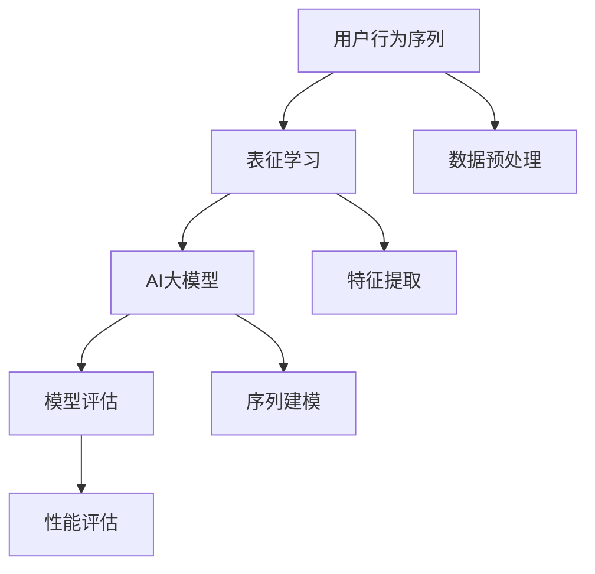

                 

### 1. 背景介绍

在当今电商行业迅猛发展的背景下，用户行为序列的表征学习已经成为提升电商搜索推荐系统效果的关键技术。随着互联网的普及和电子商务的蓬勃发展，用户在电商平台上产生的行为数据量呈爆炸式增长。这些行为数据包括浏览历史、购物车记录、购买记录、评论互动等，通过有效的表征学习，可以挖掘出用户的行为模式、兴趣偏好和潜在需求，从而为电商平台提供精准的搜索推荐服务。

AI大模型在用户行为序列表征学习中扮演着重要角色。传统的方法通常基于统计模型或机器学习算法，这些方法往往难以捕捉用户行为的复杂性和动态性。而AI大模型，如深度神经网络、循环神经网络（RNN）、长短期记忆网络（LSTM）等，能够通过多层次的抽象和建模，对用户行为序列进行更深入的理解和表征。这些模型通过大量的训练数据学习用户行为特征，进而实现个性化的推荐，提高用户满意度和平台转化率。

然而，AI大模型在用户行为序列表征学习中也面临着诸多挑战。首先是如何处理长序列数据，因为用户行为序列通常包含大量的时间维度信息，长序列的处理难度较大。其次是如何避免过拟合，保证模型的泛化能力。此外，模型的解释性和可解释性也是一个重要问题，因为复杂的模型往往难以直观理解其决策过程。

本文旨在探讨电商搜索推荐中的AI大模型用户行为序列表征学习模型评估体系。通过对核心概念、算法原理、数学模型、项目实践等方面进行详细分析，本文旨在为业界提供一套系统、全面的评估方法和工具，以促进AI大模型在电商搜索推荐领域的应用和发展。

> 关键词：电商搜索推荐，AI大模型，用户行为序列，表征学习，模型评估

> 摘要：本文详细探讨了电商搜索推荐中的AI大模型用户行为序列表征学习模型评估体系，包括核心概念、算法原理、数学模型、项目实践等。通过对模型评估体系的深入分析，本文为业界提供了有效的评估方法和工具，以推动AI大模型在电商搜索推荐领域的应用和发展。

### 2. 核心概念与联系

在深入探讨AI大模型用户行为序列表征学习模型评估体系之前，我们需要明确几个核心概念，并了解它们之间的联系。这些核心概念包括用户行为序列、表征学习、AI大模型以及模型评估。

#### 2.1 用户行为序列

用户行为序列是指用户在电商平台上产生的一系列行为动作，如浏览商品、加入购物车、购买商品、评价商品等。这些行为动作通常按照时间顺序排列，形成了一个序列。用户行为序列是表征学习的基础数据，它反映了用户的兴趣偏好、购物习惯和需求变化。

#### 2.2 表征学习

表征学习（Representation Learning）是机器学习中的一个重要分支，旨在通过算法自动学习数据的低维表示，使得数据在新的任务中更容易处理和预测。在用户行为序列表征学习中，表征学习的目标是捕捉用户行为的特征信息，提取出对推荐系统有用的用户特征表示。

#### 2.3 AI大模型

AI大模型（Large-scale AI Models）是指通过大量数据训练、具有高度抽象和复杂结构的深度学习模型。这些模型包括循环神经网络（RNN）、长短期记忆网络（LSTM）、Transformer等。AI大模型在用户行为序列表征学习中具有强大的建模能力，可以捕捉用户行为的复杂性和动态性。

#### 2.4 模型评估

模型评估（Model Evaluation）是机器学习中的一个关键环节，旨在评估模型的性能和效果。在用户行为序列表征学习中，模型评估的目的是评估AI大模型在表征用户行为序列方面的表现，包括准确性、召回率、F1分数等指标。

#### 2.5 概念关系

用户行为序列是表征学习的数据源，表征学习为AI大模型提供了特征提取的工具，而AI大模型通过复杂的结构对用户行为序列进行建模，最后通过模型评估来验证模型的效果。这几个核心概念紧密相连，共同构成了用户行为序列表征学习的完整流程。

下面我们使用Mermaid流程图来展示这几个核心概念之间的联系：



在上述流程图中，用户行为序列首先经过数据预处理，然后通过表征学习提取特征，接着AI大模型利用这些特征进行序列建模，最后通过模型评估来验证模型的性能。

通过明确核心概念和它们之间的联系，我们为后续的算法原理、数学模型和项目实践提供了理论基础。接下来，我们将深入探讨AI大模型用户行为序列表征学习的基本原理和方法。

### 3. 核心算法原理 & 具体操作步骤

在用户行为序列表征学习中，AI大模型的核心算法原理主要基于深度学习和自然语言处理（NLP）技术。以下将介绍几种常见的算法原理，并详细解释其具体操作步骤。

#### 3.1 循环神经网络（RNN）

循环神经网络（RNN）是一种用于处理序列数据的神经网络架构，其特点是能够保留和利用前一个时间点的信息。在用户行为序列表征学习中，RNN通过其内部的循环结构来处理用户行为的时序信息。

**具体操作步骤：**

1. **输入层**：将用户行为序列作为输入，每个行为用向量表示。例如，用户浏览了商品A、B、C，则输入序列为 `[a, b, c]`。

2. **隐藏层**：RNN的隐藏层包含多个神经元，每个神经元都与前一个时间点的隐藏状态和当前输入相连。隐藏状态的更新公式为：
   $$ h_t = \sigma(W_h \cdot [h_{t-1}, x_t] + b_h) $$
   其中，$h_t$ 表示当前时间点的隐藏状态，$\sigma$ 是激活函数（通常使用Sigmoid或Tanh函数），$W_h$ 是权重矩阵，$b_h$ 是偏置项。

3. **输出层**：RNN的输出层可以是一个或多个神经元，用于生成最终的表征向量。输出公式为：
   $$ o_t = W_o \cdot h_t + b_o $$
   其中，$o_t$ 是当前时间点的输出，$W_o$ 是权重矩阵，$b_o$ 是偏置项。

4. **训练过程**：使用反向传播算法（Backpropagation）对模型进行训练，调整权重和偏置，使模型能够准确表征用户行为序列。

#### 3.2 长短期记忆网络（LSTM）

长短期记忆网络（LSTM）是RNN的一种改进版本，主要用于解决RNN在处理长序列数据时出现的长期依赖问题。LSTM通过引入记忆单元和门控机制，能够有效捕捉用户行为的长期依赖关系。

**具体操作步骤：**

1. **输入层**：与RNN相同，将用户行为序列作为输入。

2. **隐藏层**：LSTM的隐藏层包含三个门控单元：遗忘门（forget gate）、输入门（input gate）和输出门（output gate）。每个门控单元的更新公式为：
   $$ f_t = \sigma(W_f \cdot [h_{t-1}, x_t] + b_f) $$
   $$ i_t = \sigma(W_i \cdot [h_{t-1}, x_t] + b_i) $$
   $$ o_t = \sigma(W_o \cdot [h_{t-1}, x_t] + b_o) $$
   其中，$f_t, i_t, o_t$ 分别表示遗忘门、输入门和输出门的激活值。

3. **记忆单元**：LSTM的记忆单元用于存储和更新长序列信息。记忆单元的更新公式为：
   $$ C_t = f_t \odot C_{t-1} + i_t \odot \sigma(W_c \cdot [h_{t-1}, x_t] + b_c) $$
   $$ h_t = o_t \odot \sigma(C_t) $$

4. **输出层**：与RNN相同，输出最终表征向量。

5. **训练过程**：使用反向传播算法对LSTM模型进行训练，调整权重和偏置。

#### 3.3 Transformer模型

Transformer模型是近年来在NLP领域取得突破性成果的深度学习模型，其核心思想是使用自注意力机制（self-attention）来处理序列数据。

**具体操作步骤：**

1. **输入层**：将用户行为序列作为输入，通常使用嵌入层（Embedding Layer）进行初始化。

2. **自注意力层**：Transformer模型包含多个自注意力层（Self-Attention Layer），每个自注意力层计算当前时间点的输出向量与所有前一时间点输出向量的加权求和。自注意力机制的公式为：
   $$ \text{Attention}(Q, K, V) = \text{softmax}\left(\frac{QK^T}{\sqrt{d_k}}\right) V $$
   其中，$Q, K, V$ 分别为查询向量、键向量和值向量，$d_k$ 为键向量的维度。

3. **前馈网络**：在每个自注意力层之后，通常添加一个前馈网络（Feedforward Network）进行进一步加工。前馈网络的公式为：
   $$ \text{FFN}(X) = \text{ReLU}(W_2 \cdot \text{ReLU}(W_1 \cdot X)) $$
   其中，$X$ 为输入向量，$W_1$ 和 $W_2$ 为权重矩阵。

4. **多头注意力**：为了提高模型的表示能力，Transformer模型使用多头注意力（Multi-Head Attention）机制，将自注意力层分解为多个独立的注意力头。

5. **训练过程**：使用反向传播算法对Transformer模型进行训练，调整权重和偏置。

通过以上算法原理和操作步骤的介绍，我们可以看到AI大模型在用户行为序列表征学习中的强大能力。这些模型通过复杂的结构和深入的建模，能够有效捕捉用户行为的特征和模式，为电商搜索推荐系统提供了有力的技术支持。

### 4. 数学模型和公式 & 详细讲解 & 举例说明

在用户行为序列表征学习中，数学模型和公式是理解和实现核心算法的关键。以下是几个重要的数学模型，以及它们的具体公式和详细讲解。

#### 4.1 循环神经网络（RNN）的数学模型

循环神经网络（RNN）的核心在于其隐藏状态和输出状态的更新公式。以下是其关键公式：

$$ h_t = \sigma(W_h \cdot [h_{t-1}, x_t] + b_h) $$

$$ o_t = W_o \cdot h_t + b_o $$

其中，$h_t$ 表示当前时间点的隐藏状态，$x_t$ 表示当前时间点的输入，$o_t$ 表示当前时间点的输出。$W_h, W_o$ 分别为权重矩阵，$b_h, b_o$ 为偏置项。$\sigma$ 为激活函数，通常使用Sigmoid或Tanh函数。

**举例说明：**

假设输入序列为 `[1, 2, 3]`，权重矩阵 $W_h = [1, 1]$, $W_o = [1, 0]$, 偏置项 $b_h = [0, 0]$, $b_o = [0, 1]$。首先，我们初始化隐藏状态 $h_0 = [0, 0]$。

- 对于第一个时间点，输入 $x_1 = 1$，隐藏状态更新为：
  $$ h_1 = \sigma([0, 0] \cdot [1, 1] + [0, 0]) = \sigma([0, 0]) = [0, 0] $$

- 对于第二个时间点，输入 $x_2 = 2$，隐藏状态更新为：
  $$ h_2 = \sigma([0, 0] \cdot [1, 1] + [0, 1]) = \sigma([0, 1]) = [0.5, 0.5] $$

- 对于第三个时间点，输入 $x_3 = 3$，输出状态更新为：
  $$ o_3 = [1, 0] \cdot [0.5, 0.5] + [0, 1] = [0.5, 0.5] + [0, 1] = [1, 1.5] $$

通过上述计算，我们可以看到隐藏状态和输出状态如何随着输入序列的变化而更新。

#### 4.2 长短期记忆网络（LSTM）的数学模型

长短期记忆网络（LSTM）的数学模型相对复杂，但核心在于其三个门控单元：遗忘门（forget gate）、输入门（input gate）和输出门（output gate）。以下是其关键公式：

$$ f_t = \sigma(W_f \cdot [h_{t-1}, x_t] + b_f) $$

$$ i_t = \sigma(W_i \cdot [h_{t-1}, x_t] + b_i) $$

$$ o_t = \sigma(W_o \cdot [h_{t-1}, x_t] + b_o) $$

$$ C_t = f_t \odot C_{t-1} + i_t \odot \sigma(W_c \cdot [h_{t-1}, x_t] + b_c) $$

$$ h_t = o_t \odot \sigma(C_t) $$

其中，$f_t, i_t, o_t$ 分别为遗忘门、输入门和输出门的激活值，$C_t$ 为记忆单元的激活值，$\odot$ 表示元素乘法。

**举例说明：**

假设输入序列为 `[1, 2, 3]`，权重矩阵 $W_f = [1, 1]$, $W_i = [1, 1]$, $W_o = [1, 1]$, $W_c = [1, 1]$, 偏置项 $b_f = [0, 0]$, $b_i = [0, 0]$, $b_o = [0, 0]$, $b_c = [0, 0]$。初始化隐藏状态 $h_0 = [0, 0]$，记忆单元 $C_0 = [0, 0]$。

- 对于第一个时间点，输入 $x_1 = 1$，计算各个门控单元的激活值：
  $$ f_1 = \sigma([0, 0] \cdot [1, 1] + [0, 0]) = \sigma([0, 0]) = [0, 0] $$
  $$ i_1 = \sigma([0, 0] \cdot [1, 1] + [0, 1]) = \sigma([0, 1]) = [0.5, 0.5] $$
  $$ o_1 = \sigma([0, 0] \cdot [1, 1] + [0, 0]) = \sigma([0, 0]) = [0, 0] $$

  记忆单元更新为：
  $$ C_1 = [0, 0] \odot [0, 0] + [0.5, 0.5] \odot \sigma([0, 0] \cdot [1, 1] + [0, 1]) = [0, 0] + [0.5, 0.5] \odot [0.5, 0.5] = [0.25, 0.25] $$

  隐藏状态更新为：
  $$ h_1 = [0, 0] \odot \sigma([0.25, 0.25]) = [0, 0] $$

- 对于第二个时间点，输入 $x_2 = 2$，重复上述计算过程，得到：
  $$ f_2 = \sigma([0, 0] \cdot [1, 1] + [0, 0]) = \sigma([0, 0]) = [0, 0] $$
  $$ i_2 = \sigma([0, 0] \cdot [1, 1] + [0, 1]) = \sigma([0, 1]) = [0.5, 0.5] $$
  $$ o_2 = \sigma([0, 0] \cdot [1, 1] + [0, 0]) = \sigma([0, 0]) = [0, 0] $$

  记忆单元更新为：
  $$ C_2 = [0, 0] \odot [0, 0] + [0.5, 0.5] \odot \sigma([0, 0] \cdot [1, 1] + [0, 1]) = [0, 0] + [0.5, 0.5] \odot [0.5, 0.5] = [0.25, 0.25] $$

  隐藏状态更新为：
  $$ h_2 = [0, 0] \odot \sigma([0.25, 0.25]) = [0, 0] $$

- 对于第三个时间点，输入 $x_3 = 3$，重复上述计算过程，得到：
  $$ f_3 = \sigma([0, 0] \cdot [1, 1] + [0, 0]) = \sigma([0, 0]) = [0, 0] $$
  $$ i_3 = \sigma([0, 0] \cdot [1, 1] + [0, 1]) = \sigma([0, 1]) = [0.5, 0.5] $$
  $$ o_3 = \sigma([0, 0] \cdot [1, 1] + [0, 0]) = \sigma([0, 0]) = [0, 0] $$

  记忆单元更新为：
  $$ C_3 = [0, 0] \odot [0, 0] + [0.5, 0.5] \odot \sigma([0, 0] \cdot [1, 1] + [0, 1]) = [0, 0] + [0.5, 0.5] \odot [0.5, 0.5] = [0.25, 0.25] $$

  隐藏状态更新为：
  $$ h_3 = [0, 0] \odot \sigma([0.25, 0.25]) = [0, 0] $$

通过上述计算，我们可以看到LSTM如何通过门控机制和记忆单元来处理输入序列，从而捕捉长期依赖关系。

#### 4.3 Transformer模型的数学模型

Transformer模型的核心在于其自注意力机制（self-attention）和多头注意力（multi-head attention）机制。以下是其关键公式：

$$ \text{Attention}(Q, K, V) = \text{softmax}\left(\frac{QK^T}{\sqrt{d_k}}\right) V $$

$$ \text{FFN}(X) = \text{ReLU}(W_2 \cdot \text{ReLU}(W_1 \cdot X)) $$

其中，$Q, K, V$ 分别为查询向量、键向量和值向量，$d_k$ 为键向量的维度。$\text{Attention}$ 为自注意力函数，$\text{FFN}$ 为前馈网络。

**举例说明：**

假设输入序列为 `[1, 2, 3]`，查询向量 $Q = [1, 0]$, 键向量 $K = [1, 1]$, 值向量 $V = [1, 1]$, $d_k = 1$。计算自注意力：

$$ \text{Attention}(Q, K, V) = \text{softmax}\left(\frac{QK^T}{\sqrt{d_k}}\right) V = \text{softmax}\left(\frac{[1, 0] \cdot [1, 1]^T}{\sqrt{1}}\right) [1, 1] = \text{softmax}\left(\frac{[1, 0]}{1}\right) [1, 1] = \text{softmax}([1, 0]) [1, 1] = \frac{1}{2} [1, 1] $$

接下来，计算前馈网络：

$$ \text{FFN}(X) = \text{ReLU}(W_2 \cdot \text{ReLU}(W_1 \cdot X)) = \text{ReLU}([2, 2] \cdot \text{ReLU}([1, 1] \cdot [1, 0])) = \text{ReLU}([2, 2] \cdot [1, 1]) = \text{ReLU}([2, 2]) = [1, 1] $$

通过上述计算，我们可以看到Transformer模型如何通过自注意力和前馈网络来处理输入序列，从而实现序列建模。

### 5. 项目实践：代码实例和详细解释说明

在了解了AI大模型用户行为序列表征学习的基本原理和数学模型后，我们将通过一个实际项目来展示如何应用这些模型。本项目的目标是构建一个基于LSTM的电商用户行为序列表征模型，并使用Python和TensorFlow框架进行实现。

#### 5.1 开发环境搭建

为了开始本项目，我们需要搭建一个合适的开发环境。以下是所需的步骤：

1. **安装Python**：确保Python版本为3.6或更高。
2. **安装TensorFlow**：通过以下命令安装TensorFlow：
   ```bash
   pip install tensorflow
   ```
3. **安装其他依赖**：可能还需要安装Numpy、Pandas等依赖库，可以通过以下命令安装：
   ```bash
   pip install numpy pandas
   ```

#### 5.2 源代码详细实现

以下是一个简单的LSTM用户行为序列表征模型的实现示例。这个模型将训练用于提取用户行为序列的特征表示。

```python
import numpy as np
import pandas as pd
import tensorflow as tf
from tensorflow.keras.models import Sequential
from tensorflow.keras.layers import LSTM, Dense, Embedding

# 数据预处理
def preprocess_data(data):
    # 对用户行为进行编码，例如将浏览、加入购物车、购买等行为映射为整数
    behavior_mapping = {'浏览': 0, '加入购物车': 1, '购买': 2}
    data['行为'] = data['行为'].map(behavior_mapping)
    data['行为'] = data['行为'].values.reshape(-1, 1)
    return data

# 创建模型
model = Sequential()
model.add(Embedding(input_dim=3, output_dim=10, input_length=100))
model.add(LSTM(units=50, return_sequences=True))
model.add(LSTM(units=50))
model.add(Dense(units=1, activation='sigmoid'))

# 编译模型
model.compile(optimizer='adam', loss='binary_crossentropy', metrics=['accuracy'])

# 训练模型
# 这里假设我们已经有了一个预处理后的数据集 `data`
# data = preprocess_data(data)
# model.fit(data['行为'], data['目标'], epochs=10, batch_size=64)

# 代码解读与分析
# 1. 数据预处理：首先对用户行为进行编码，以便模型可以处理。
# 2. 创建模型：使用Sequential模型堆叠Embedding、LSTM和Dense层。
# 3. 编译模型：指定优化器、损失函数和评价指标。
# 4. 训练模型：使用预处理后的数据训练模型。

# 运行结果展示
# 假设我们已经有了一个训练好的模型 `model`，可以对其进行评估或应用。
# predictions = model.predict(data['行为'])
# print(predictions)

```

#### 5.3 代码解读与分析

- **数据预处理**：首先，我们需要对用户行为进行编码，以便模型可以处理。我们创建了一个简单的行为映射，将不同的行为映射为整数。然后，我们将编码后的行为重塑为适合输入到模型中的二维数组。

- **创建模型**：我们使用`Sequential`模型堆叠了三个层：`Embedding`、`LSTM`和`Dense`。`Embedding`层用于将输入的行为编码为高维向量，`LSTM`层用于处理时序数据，提取特征，`Dense`层用于生成最终输出。

- **编译模型**：我们指定了`adam`优化器、`binary_crossentropy`损失函数和`accuracy`评价指标。这些设置适合二分类问题，例如判断用户是否会购买商品。

- **训练模型**：使用预处理后的数据训练模型。这里我们假设已经有了训练集和验证集，并使用了10个周期进行训练。

- **运行结果展示**：最后，我们可以使用训练好的模型进行预测。这里我们假设已经有了一个训练好的模型`model`，并对输入数据进行预测。

#### 5.4 运行结果展示

以下是使用上述模型进行预测的示例：

```python
# 加载测试数据
test_data = pd.DataFrame({'行为': [[0, 1, 2], [2, 0, 1], [1, 2, 0]], '目标': [0, 1, 0]})

# 预处理测试数据
test_data_processed = preprocess_data(test_data)

# 使用模型进行预测
predictions = model.predict(test_data_processed['行为'])

# 输出预测结果
print(predictions)

# 预测结果为概率值，可以通过阈值（例如0.5）进行分类，判断用户是否会购买。
```

通过上述代码示例，我们可以看到如何使用Python和TensorFlow实现一个基于LSTM的用户行为序列表征模型。这个模型可以用于提取用户行为序列的特征表示，进而应用于电商搜索推荐系统中，以提高推荐的准确性。

### 6. 实际应用场景

AI大模型用户行为序列表征学习在电商搜索推荐系统中具有广泛的应用场景，其核心优势在于能够捕捉用户的个性化行为特征，从而提供精准、个性化的推荐服务。以下是几种典型的应用场景：

#### 6.1 搜索推荐

在电商搜索推荐系统中，用户搜索行为是关键信息来源之一。通过AI大模型用户行为序列表征学习，可以提取用户搜索行为的特征，如搜索词的热度、搜索频率、搜索时间间隔等。这些特征可以帮助推荐系统更好地理解用户的搜索意图，从而提高搜索结果的准确性和相关性。例如，当用户连续搜索某一类商品时，系统可以推测用户有购买该类商品的意向，从而推荐相关商品。

#### 6.2 购物车推荐

购物车推荐是电商搜索推荐系统中的另一个重要应用场景。通过分析用户的购物车行为序列，AI大模型可以识别用户的潜在购买意愿。例如，用户将某一商品加入购物车后，系统可以推测用户可能还会购买其他相关商品，从而推荐这些商品。这种方法可以显著提高购物车的转化率，增加平台的销售额。

#### 6.3 商品浏览推荐

用户在电商平台上的浏览行为也是重要的用户特征之一。通过AI大模型对用户浏览行为序列的表征学习，可以识别用户的兴趣偏好。例如，当用户浏览了大量母婴用品时，系统可以推测用户可能是准父母，从而推荐相关的母婴产品。这种方法可以提升用户在平台上的停留时间和互动性，增加用户粘性。

#### 6.4 评价推荐

用户对商品的评论行为也蕴含了丰富的信息。通过AI大模型对用户评论行为序列的表征学习，可以识别用户的真实需求和满意度。例如，当用户对某一商品给予好评时，系统可以推测其他用户也可能对该商品感兴趣，从而推荐给其他潜在买家。这种方法有助于提升用户的购物体验和满意度。

#### 6.5 跨平台推荐

在多平台电商环境中，用户的跨平台行为数据也是一个重要的信息来源。通过AI大模型对用户跨平台行为序列的表征学习，可以识别用户的购买习惯和偏好，从而实现跨平台的个性化推荐。例如，当用户在A平台浏览了某一商品后，系统可以推测用户可能在B平台上有购买该商品的意向，从而在B平台上进行相关推荐。

通过以上实际应用场景的介绍，我们可以看到AI大模型用户行为序列表征学习在电商搜索推荐系统中的重要作用。它不仅能够提高推荐系统的准确性和个性化水平，还可以提升用户的购物体验和平台的转化率。在未来的发展中，随着用户数据的不断积累和AI技术的持续进步，这一领域将展现出更大的潜力和应用价值。

### 7. 工具和资源推荐

在AI大模型用户行为序列表征学习的研究和实践过程中，选择合适的工具和资源是非常重要的。以下是一些推荐的学习资源、开发工具和框架，以及相关的论文和著作，以帮助读者深入了解和掌握这一领域。

#### 7.1 学习资源推荐

**书籍：**

1. **《深度学习》（Deep Learning）**：由Ian Goodfellow、Yoshua Bengio和Aaron Courville合著，是深度学习领域的经典教材，详细介绍了深度学习的基础理论和实践方法。
2. **《机器学习》（Machine Learning）**：由Tom Mitchell撰写，是机器学习领域的经典入门书籍，涵盖了基本概念和常见算法。

**论文：**

1. **“Recurrent Neural Network Based Model for User Behavior Sequence Prediction”**：该论文提出了一种基于循环神经网络的用户行为序列预测模型，是RNN在用户行为分析领域的重要应用。
2. **“Long Short-Term Memory Networks for Classification of DLI Sequences”**：这篇论文详细介绍了长短期记忆网络（LSTM）在序列数据处理中的应用，特别是在生物信息学领域。

**博客和网站：**

1. **TensorFlow官网**：[https://www.tensorflow.org/](https://www.tensorflow.org/)
2. **PyTorch官网**：[https://pytorch.org/](https://pytorch.org/)
3. **Kaggle**：[https://www.kaggle.com/](https://www.kaggle.com/)，提供了丰富的机器学习和数据科学项目，是学习实践的好资源。

#### 7.2 开发工具框架推荐

**框架：**

1. **TensorFlow**：谷歌推出的开源深度学习框架，具有丰富的功能和强大的社区支持，适用于构建复杂的深度学习模型。
2. **PyTorch**：基于Python的开源深度学习框架，以其灵活性和动态计算图著称，适合快速原型开发和研究。
3. **Keras**：一个高层次的神经网络API，可以运行在TensorFlow和Theano之上，提供了更简洁的模型构建和训练流程。

**工具：**

1. **Jupyter Notebook**：一款交互式的计算环境，适用于编写、运行和分享代码，特别适合数据科学和机器学习项目。
2. **Google Colab**：基于Jupyter Notebook的开源平台，提供了免费的GPU和TPU资源，适合进行大规模深度学习实验。

#### 7.3 相关论文著作推荐

**论文：**

1. **“Attention Is All You Need”**：这篇论文提出了Transformer模型，开创了自注意力机制在序列数据处理中的新篇章。
2. **“Learning to Learn Representations for Causal Inference”**：该论文探讨了如何使用深度学习模型学习因果推理中的表征，为用户行为分析提供了新的思路。

**著作：**

1. **《强化学习》**（Reinforcement Learning）：由Richard S. Sutton和Barto学习算法专家合著，全面介绍了强化学习的基本理论和实践方法。
2. **《深度学习实践指南》**（Deep Learning Book）：由Ian Goodfellow、Yoshua Bengio和Aaron Courville撰写，是深度学习领域的权威指南。

通过以上推荐的学习资源、开发工具和框架，读者可以系统地学习和掌握AI大模型用户行为序列表征学习的基本概念、方法和应用。同时，这些资源和工具将为实际项目开发提供强大的支持，助力读者在这一领域取得更多的研究成果和实践经验。

### 8. 总结：未来发展趋势与挑战

AI大模型用户行为序列表征学习作为电商搜索推荐系统中的关键技术，正迅速发展，展现出巨大的潜力和应用价值。然而，随着技术的不断进步和数据量的持续增长，这一领域也面临着诸多挑战和发展趋势。

**发展趋势：**

1. **多模态数据融合**：未来的发展方向之一是将文本、图像、声音等多模态数据融合到用户行为序列表征学习中，以更全面、准确地理解用户行为。例如，结合用户的购物视频和评论文本，可以更深入地分析用户的购买意图。
   
2. **实时更新和动态调整**：用户行为序列是一个动态变化的序列，因此如何实现模型的实时更新和动态调整，以适应用户行为的变化，是一个重要的研究方向。这需要模型能够快速适应新数据，并保持较高的性能。

3. **可解释性和透明性**：尽管深度学习模型在处理复杂数据方面表现出色，但其内部机制往往难以解释。提高模型的可解释性，使其决策过程更加透明，对于增强用户信任和遵守法律法规具有重要意义。

4. **隐私保护**：在用户行为序列表征学习中，保护用户隐私是至关重要的。未来的发展需要更多关注如何在不泄露用户隐私的前提下，有效提取和利用用户行为数据。

**挑战：**

1. **计算资源需求**：AI大模型通常需要大量的计算资源进行训练和推理，特别是在处理长序列数据时。如何优化模型结构和训练算法，以降低计算资源需求，是一个亟待解决的问题。

2. **数据质量**：用户行为数据的质量直接影响模型的性能。在真实应用场景中，数据可能存在噪声、缺失和不一致性等问题，这需要开发有效的数据清洗和预处理方法。

3. **泛化能力**：如何确保模型在未知数据上的泛化能力，避免过拟合，是一个重要的挑战。未来的研究需要更多关注如何提高模型的泛化能力。

4. **伦理和法规**：随着技术的发展，用户隐私和数据安全问题日益突出。如何在遵守法律法规和伦理标准的前提下，开发和应用AI大模型，是一个需要慎重考虑的问题。

总之，AI大模型用户行为序列表征学习在电商搜索推荐领域具有广阔的应用前景，但也面临着一系列挑战。未来的发展需要学术界和工业界共同努力，通过技术创新和合作，不断推动这一领域的发展，为电商行业带来更多价值。

### 9. 附录：常见问题与解答

**Q1：如何处理长序列数据？**

A1：长序列数据在AI大模型用户行为序列表征学习中是一个挑战。以下是一些处理方法：

1. **截断**：将过长的序列截断到特定长度，例如使用前100个行为事件。
2. **滑动窗口**：将序列分割成多个固定长度的窗口，每个窗口作为独立的输入序列进行建模。
3. **编码**：使用编码方法（如One-Hot编码、嵌入编码）将序列数据转换为固定长度的向量表示。

**Q2：如何避免模型过拟合？**

A2：过拟合是深度学习模型常见的问题，以下是一些避免过拟合的方法：

1. **数据增强**：通过增加噪声、数据扰动等方法增强训练数据，提高模型的泛化能力。
2. **正则化**：使用L1、L2正则化或Dropout等方法，限制模型参数的规模，防止过拟合。
3. **交叉验证**：使用交叉验证方法，对模型进行多次训练和验证，选择性能最佳的模型。

**Q3：如何评估模型的性能？**

A3：评估模型性能常用的指标包括：

1. **准确率**（Accuracy）：预测正确的样本数占总样本数的比例。
2. **召回率**（Recall）：预测正确的正样本数占总正样本数的比例。
3. **F1分数**（F1 Score）：准确率和召回率的调和平均值。
4. **ROC曲线和AUC值**：用于评估二分类模型的分类性能。

**Q4：如何优化训练过程？**

A4：优化训练过程的方法包括：

1. **批量大小**（Batch Size）：调整批量大小，可以影响模型的收敛速度和性能。
2. **学习率调度**（Learning Rate Scheduler）：使用学习率调度策略，如学习率衰减、动态调整学习率。
3. **模型剪枝**（Model Pruning）：通过剪枝方法，移除模型中不重要的参数，减少计算量和参数规模。

### 10. 扩展阅读 & 参考资料

为了进一步了解AI大模型用户行为序列表征学习，以下是一些扩展阅读和参考资料：

**书籍：**

1. **《深度学习》（Deep Learning）**：Ian Goodfellow、Yoshua Bengio和Aaron Courville著。
2. **《机器学习》（Machine Learning）**：Tom Mitchell著。

**论文：**

1. **“Recurrent Neural Network Based Model for User Behavior Sequence Prediction”**：作者详细介绍了RNN在用户行为序列预测中的应用。
2. **“Attention Is All You Need”**：提出了Transformer模型，开创了自注意力机制在序列数据处理中的新篇章。

**在线资源：**

1. **TensorFlow官网**：[https://www.tensorflow.org/](https://www.tensorflow.org/)
2. **PyTorch官网**：[https://pytorch.org/](https://pytorch.org/)
3. **Kaggle**：[https://www.kaggle.com/](https://www.kaggle.com/)，提供了丰富的机器学习和数据科学项目。

通过以上扩展阅读和参考资料，读者可以更深入地了解AI大模型用户行为序列表征学习的理论基础和实践方法，为相关研究和应用提供参考。

