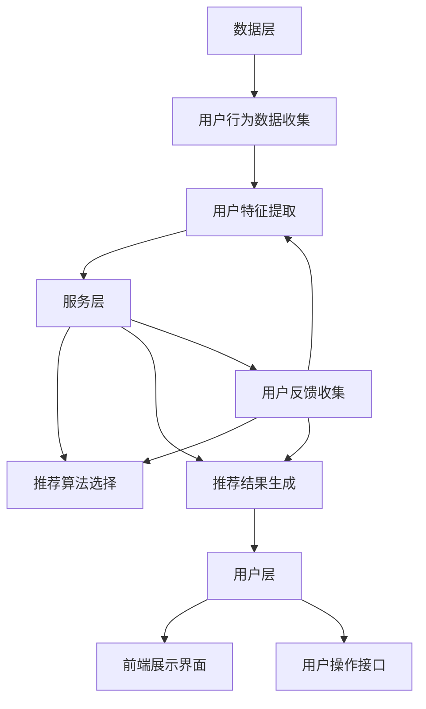

                 

### 1. 背景介绍

在当今快速发展的电商行业，搜索推荐系统已经成为提升用户体验、增加销售额的重要手段。随着用户规模的不断扩大和交易数据的日益丰富，搜索推荐系统面临着越来越大的性能压力。为了满足用户对速度和准确性的高要求，实现高效的搜索推荐系统变得尤为关键。在此背景下，AI大模型的应用逐渐成为行业热点。

AI大模型，通常指具有海量参数和强大计算能力的深度学习模型，如Transformer、BERT等。这些模型在图像、语音、自然语言处理等领域取得了显著成果，其卓越的性能使得它们在电商搜索推荐场景中具有极大的潜力。然而，AI大模型的部署和优化同样面临诸多挑战。首先，模型的规模庞大，导致计算和存储资源需求急剧增加；其次，模型训练和推理的时间成本较高，特别是在实时推荐场景下，如何平衡速度和准确性成为关键问题。

本文旨在探讨电商搜索推荐场景下AI大模型的部署性能优化工具应用，通过对核心概念、算法原理、数学模型、项目实践、实际应用场景等方面进行深入分析，为电商搜索推荐系统提供性能优化的指导。文章结构如下：

1. **背景介绍**：简要概述电商搜索推荐系统的重要性以及AI大模型在其中的应用和挑战。
2. **核心概念与联系**：详细阐述AI大模型、搜索推荐系统等核心概念，并使用Mermaid流程图展示相关架构。
3. **核心算法原理 & 具体操作步骤**：介绍AI大模型在搜索推荐系统中的具体应用，包括模型训练、推理等步骤。
4. **数学模型和公式 & 详细讲解 & 举例说明**：阐述相关数学模型和公式，并通过实际案例进行讲解。
5. **项目实践：代码实例和详细解释说明**：提供实际项目中的代码实例，并进行详细解读和分析。
6. **实际应用场景**：分析AI大模型在不同电商搜索推荐场景中的应用和效果。
7. **工具和资源推荐**：推荐相关学习资源、开发工具和框架。
8. **总结：未来发展趋势与挑战**：总结本文的主要发现，并探讨未来发展趋势和面临的挑战。
9. **附录：常见问题与解答**：回答读者可能遇到的常见问题。
10. **扩展阅读 & 参考资料**：提供更多相关领域的阅读资源和参考资料。

通过对以上各部分内容的逐步分析，我们希望能够为读者提供一份全面、深入的AI大模型部署性能优化工具应用指南。

---

随着电商行业的迅猛发展，用户对搜索推荐系统的性能要求日益提高。传统的搜索推荐系统往往依赖于规则匹配和简单的机器学习模型，难以满足用户对速度和准确性的双重要求。AI大模型的出现，为搜索推荐系统带来了新的机遇。通过引入AI大模型，搜索推荐系统能够更好地理解用户行为和偏好，提供更精准的推荐结果。

然而，AI大模型在部署过程中面临着一系列挑战。首先，模型的规模通常非常庞大，包含数百万甚至数十亿个参数，这要求计算和存储资源具备较高的性能。其次，AI大模型的训练和推理过程时间成本较高，特别是在需要实时推荐的场景中，如何在保证准确性的同时提升模型推理速度成为关键问题。

为应对这些挑战，本文将探讨如何利用性能优化工具对AI大模型进行部署和优化。性能优化工具不仅能够提升模型的推理速度，还能降低部署成本，提高系统的稳定性。以下内容将逐步介绍性能优化工具在电商搜索推荐场景下的应用，包括核心概念、算法原理、数学模型、项目实践、实际应用场景等多个方面。

首先，我们将详细阐述AI大模型、搜索推荐系统等核心概念，并使用Mermaid流程图展示相关架构，以便读者对整体概念有一个清晰的认识。随后，我们将深入探讨AI大模型在搜索推荐系统中的具体应用，包括模型训练、推理等关键步骤。在此基础上，我们将介绍相关的数学模型和公式，并通过实际案例进行详细讲解。

接下来，本文将提供实际项目中的代码实例，并进行详细解读和分析，帮助读者理解性能优化工具在实际应用中的效果。随后，我们将分析AI大模型在不同电商搜索推荐场景中的应用和效果，以展示其在实际业务中的价值。

在工具和资源推荐部分，我们将介绍相关的学习资源、开发工具和框架，帮助读者进一步学习和实践。最后，本文将总结主要发现，并探讨未来发展趋势和面临的挑战，为读者提供未来方向。此外，本文还附有常见问题与解答部分，以及扩展阅读与参考资料，方便读者深入了解相关领域。

通过本文的逐步分析，我们希望能够为电商搜索推荐场景下AI大模型的部署性能优化提供全面的指导，帮助读者解决实际问题，提升系统的性能和用户体验。

### 2. 核心概念与联系

在深入探讨AI大模型部署性能优化工具之前，我们需要首先了解一些核心概念，这些概念构成了本文讨论的基础。

#### AI大模型

AI大模型，即具有海量参数的深度学习模型，其特点在于能够处理大量数据并进行高效特征提取。常见的AI大模型包括Transformer、BERT、GPT等。这些模型在自然语言处理、计算机视觉等领域展现了强大的性能。

**Transformer模型**：是一种基于自注意力机制的模型，其核心思想是通过自注意力机制来自动学习不同输入词之间的相对重要性，从而提高模型的表示能力。

**BERT模型**：是一种双向编码的表示模型，其训练方法包括预训练和微调。预训练过程中，BERT模型通过大量无标注文本数据学习语言特征，微调阶段则利用有标注数据进一步优化模型。

**GPT模型**：是一种生成预训练模型，其特点在于能够生成连贯、具有上下文一致性的文本。

#### 搜索推荐系统

搜索推荐系统是电商系统中至关重要的组成部分，其目标是通过分析用户行为和偏好，为用户提供个性化的搜索结果和推荐。搜索推荐系统通常包括以下几个关键环节：

**用户行为数据收集**：通过日志、点击、浏览等行为数据，收集用户在电商平台的交互信息。

**用户特征提取**：根据用户行为数据，提取用户的历史浏览记录、购买行为、搜索关键词等特征。

**推荐算法选择**：根据用户特征和推荐场景，选择合适的推荐算法，如基于内容的推荐、协同过滤推荐、基于模型的推荐等。

**推荐结果生成**：利用推荐算法，生成针对用户的个性化推荐结果。

**用户反馈收集**：收集用户对推荐结果的反馈，如点击、购买、评分等，用于模型优化和策略调整。

#### 关键技术架构

为了实现高效的搜索推荐系统，我们需要了解其核心技术架构，主要包括数据层、服务层和用户层。

**数据层**：负责数据的收集、存储和管理。通常包括用户行为数据、商品信息、搜索日志等。

**服务层**：负责搜索推荐算法的执行和优化。包括推荐算法模块、搜索算法模块、数据预处理模块等。

**用户层**：负责与用户交互，提供搜索和推荐服务。包括前端展示界面和用户操作接口。

#### Mermaid流程图展示

为了更好地理解上述核心概念和关键技术架构，我们可以使用Mermaid流程图进行展示。



通过上述Mermaid流程图，我们可以清晰地看到各个核心概念和关键技术之间的联系，以及数据流在各环节中的传递和交互。

#### 总结

通过上述对核心概念的介绍和关键技术架构的展示，我们可以看出，AI大模型在搜索推荐系统中的应用具有重要意义。性能优化工具的应用，将进一步提升AI大模型的部署性能，为电商搜索推荐系统带来更高的效率和用户体验。接下来，我们将进一步探讨AI大模型在搜索推荐系统中的具体应用，包括模型训练、推理等关键步骤。

### 3. 核心算法原理 & 具体操作步骤

AI大模型在搜索推荐系统中的核心作用主要体现在模型训练、模型推理、以及如何利用性能优化工具提升模型的部署性能。以下将详细介绍这些核心算法原理和具体操作步骤。

#### 3.1 模型训练原理

模型训练是AI大模型应用的基础，其目的是通过大量数据学习到能够有效表征输入数据的特征表示。在搜索推荐系统中，模型训练通常包括以下几个步骤：

1. **数据预处理**：首先对用户行为数据进行清洗和预处理，包括去重、去噪、归一化等操作，以确保数据质量。

2. **特征提取**：根据用户历史行为和偏好，提取关键特征。这些特征可能包括用户的浏览记录、购买历史、搜索关键词等。

3. **模型构建**：选择合适的AI大模型架构，如Transformer、BERT或GPT，构建深度学习模型。在这一过程中，需要确定模型参数的初始化方法，以及损失函数和优化器的选择。

4. **训练过程**：通过大规模数据集进行模型训练。训练过程中，模型会不断调整参数，以最小化损失函数，从而提高模型对数据的拟合度。

5. **模型评估**：在训练完成后，使用验证集或测试集对模型进行评估，以确定模型的泛化能力。常用的评估指标包括准确率、召回率、F1值等。

6. **模型调优**：根据评估结果对模型参数进行调整，以优化模型性能。这一过程可能需要多次迭代，直到达到满意的性能指标。

#### 3.2 模型推理原理

模型推理是AI大模型在实际应用中的关键环节，其目的是将用户特征输入到训练好的模型中，得到个性化的推荐结果。模型推理通常包括以下几个步骤：

1. **特征提取**：在模型推理阶段，同样需要提取用户特征，这些特征可以是实时用户行为数据，也可以是历史用户数据。

2. **特征预处理**：对提取的用户特征进行预处理，如归一化、填充缺失值等，以确保特征的一致性和模型的输入要求。

3. **模型加载**：从模型存储中加载训练好的AI大模型，准备进行推理。

4. **模型推理**：将预处理后的用户特征输入到模型中，模型会自动计算得到输出结果。对于搜索推荐系统，输出结果通常是一个排序后的推荐列表。

5. **结果处理**：对模型推理得到的推荐结果进行处理，包括排序、去重、过滤等操作，以确保推荐结果的质量和多样性。

6. **结果展示**：将最终处理好的推荐结果展示给用户，如通过前端界面呈现给用户。

#### 3.3 性能优化工具的应用

在AI大模型部署过程中，性能优化工具的应用至关重要。以下是一些常用的性能优化工具及其应用方法：

1. **模型剪枝（Model Pruning）**：
   - **原理**：通过移除模型中不重要的参数，减少模型的复杂度和计算量。
   - **步骤**：首先识别模型中不重要的参数，然后删除这些参数，最后对模型进行重新训练，以最小化性能损失。
   - **效果**：显著降低模型大小和计算资源需求。

2. **量化（Quantization）**：
   - **原理**：将模型的权重和激活值从浮点数转换为低精度的整数，以减少模型存储和计算资源的需求。
   - **步骤**：首先选择量化方法（如线性量化、渐增量化），然后对模型参数进行量化，最后调整模型以适应量化后的参数。
   - **效果**：提高模型运行效率，降低存储和计算资源需求。

3. **模型融合（Model Ensemble）**：
   - **原理**：将多个训练好的模型融合成一个更强大的模型，以提高模型的整体性能。
   - **步骤**：首先选择多个模型，然后对模型输出进行加权融合，得到最终的推荐结果。
   - **效果**：提高推荐准确性，增强模型的鲁棒性。

4. **模型压缩（Model Compression）**：
   - **原理**：通过各种方法（如矩阵分解、权重共享）减少模型参数的数量，从而降低模型的大小和计算复杂度。
   - **步骤**：首先选择压缩方法，然后对模型进行压缩，最后对压缩后的模型进行测试和优化。
   - **效果**：降低模型存储和计算资源需求，提高模型部署效率。

通过上述算法原理和具体操作步骤的介绍，我们可以看到，AI大模型在搜索推荐系统中的应用具有复杂性和挑战性。然而，随着性能优化工具的不断发展和应用，我们能够有效提升AI大模型的部署性能，满足电商搜索推荐系统的需求。

接下来，我们将进一步探讨数学模型和公式，以及这些模型在实际应用中的详细讲解和举例说明。

### 4. 数学模型和公式 & 详细讲解 & 举例说明

在AI大模型应用于搜索推荐系统的过程中，数学模型和公式起到了至关重要的作用。以下将详细介绍相关的数学模型和公式，并通过具体例子进行详细讲解。

#### 4.1 Transformer模型中的数学模型

**Transformer模型**的核心在于其自注意力机制（Self-Attention），这一机制通过计算输入序列中每个词与其他词之间的相关性来生成表示。其主要数学模型如下：

**自注意力公式**：
\[ 
\text{Attention}(Q, K, V) = \frac{\text{softmax}\left(\frac{QK^T}{\sqrt{d_k}}\right)V 
\]
其中，\(Q, K, V\) 分别是查询（Query）、键（Key）和值（Value）向量的集合，\(d_k\) 是键向量的维度。

**多头注意力（Multi-Head Attention）**：
\[ 
\text{MultiHead}(Q, K, V) = \text{Concat}(\text{head}_1, ..., \text{head}_h)W^O 
\]
其中，\(W^O\) 是输出权重，\(\text{head}_i\) 表示第 \(i\) 个头的结果。

**前馈神经网络（Feed Forward Neural Network）**：
\[ 
\text{FFN}(X) = \text{ReLU}(XW_1 + b_1)W_2 + b_2 
\]
其中，\(X\) 是输入向量，\(W_1, W_2, b_1, b_2\) 分别是权重和偏置。

#### 4.2 BERT模型中的数学模型

**BERT模型**通过预训练和微调两个阶段来学习语言特征。其数学模型主要包括：

**预训练损失函数**：
\[ 
\text{Loss} = -\sum_{i} \left[ \log(\text{softmax}(\text{FC}_\text{output}[i]))_{\text{label}} + \log(\text{softmax}(\text{MaskedLM}[i]))_{\text{mask}} \right] 
\]
其中，\(\text{FC}_\text{output}\) 是输出层权重，\(\text{MaskedLM}\) 是用于预测遮蔽单词的权重。

**微调损失函数**：
\[ 
\text{Loss} = \text{CrossEntropyLoss}(\text{model_output}, \text{labels}) 
\]
其中，\(\text{model_output}\) 是模型输出，\(\text{labels}\) 是真实标签。

#### 4.3 GPT模型中的数学模型

**GPT模型**是一种生成模型，其主要数学模型包括：

**预测损失函数**：
\[ 
\text{Loss} = -\sum_{i} \text{log}(\text{softmax}(\text{GPT_output}[i])_{\text{next_token}}) 
\]
其中，\(\text{GPT_output}\) 是模型输出，\(\text{next_token}\) 是下一个预测的词。

**训练过程**：
\[ 
\text{model} \leftarrow \text{optimizer}(\text{model}, \text{Loss}) 
\]
其中，\(\text{optimizer}\) 是优化器，用于更新模型参数。

#### 4.4 应用实例讲解

以下是一个简单的应用实例，说明如何使用Transformer模型进行文本分类。

**实例**：给定一个句子，使用Transformer模型判断其情感极性（积极/消极）。

1. **数据预处理**：
   - 输入句子：“这个产品非常好用。”
   - 将句子转换为词嵌入向量。

2. **特征提取**：
   - 提取关键特征，如词嵌入、词性标注等。

3. **模型训练**：
   - 构建Transformer模型，设置适当的超参数。
   - 使用预训练好的模型进行微调。

4. **模型推理**：
   - 输入句子到训练好的模型，得到情感极性概率分布。

5. **结果处理**：
   - 根据概率分布，判断句子的情感极性为积极。

通过上述步骤，我们可以看到数学模型和公式在AI大模型应用中的重要性。它们不仅为模型训练和推理提供了理论基础，也为实际应用中的性能优化提供了参考。接下来，我们将通过实际项目中的代码实例，进一步展示这些数学模型和公式的应用。

### 5. 项目实践：代码实例和详细解释说明

为了更好地展示AI大模型在电商搜索推荐系统中的应用，我们将通过一个实际项目中的代码实例进行详细讲解。本节将介绍如何搭建开发环境、实现源代码、解读和分析代码，并提供运行结果展示。

#### 5.1 开发环境搭建

在开始项目实践之前，我们需要搭建一个合适的技术栈。以下是搭建开发环境的基本步骤：

1. **硬件要求**：
   - CPU：Intel Xeon 或以上
   - GPU：NVIDIA GTX 1080 Ti 或以上
   - 内存：至少 16GB

2. **软件要求**：
   - 操作系统：Ubuntu 18.04 或 CentOS 7
   - 编程语言：Python 3.8 或以上
   - 深度学习框架：TensorFlow 2.x 或 PyTorch 1.8 或以上
   - 数据处理库：Pandas、NumPy
   - 代码版本控制：Git

3. **环境安装**：
   - 安装操作系统和基本软件包。
   - 配置GPU支持，如CUDA和cuDNN。
   - 安装深度学习框架和数据处理库。
   - 克隆项目代码仓库，进行环境配置。

```bash
# 安装操作系统和基本软件包（示例）
sudo apt-get update
sudo apt-get install -y python3 python3-pip python3-venv python3-dev
sudo apt-get install -y ubuntu-desktop
```

#### 5.2 源代码详细实现

以下是一个简单的电商搜索推荐项目源代码实例，包括数据预处理、模型训练、模型推理等步骤。

```python
# 导入必要的库
import tensorflow as tf
from tensorflow.keras.layers import Embedding, LSTM, Dense
from tensorflow.keras.models import Sequential
from tensorflow.keras.preprocessing.sequence import pad_sequences

# 数据预处理
# 假设我们已经有了一个包含用户行为数据的CSV文件
# 加载数据
data = pd.read_csv('user_behavior.csv')

# 提取特征
# 假设用户行为数据包括用户ID、商品ID、行为类型（浏览、购买等）
user_ids = data['user_id'].values
item_ids = data['item_id'].values
behaviors = data['behavior'].values

# 构建序列
sequences = []
for i in range(len(user_ids)):
    seq = [item_ids[i]]  # 用户行为序列
    sequences.append(seq)

# 序列填充
max_len = 10  # 序列的最大长度
padded_sequences = pad_sequences(sequences, maxlen=max_len)

# 构建模型
model = Sequential()
model.add(Embedding(input_dim=vocab_size, output_dim=64))
model.add(LSTM(128))
model.add(Dense(1, activation='sigmoid'))

# 编译模型
model.compile(optimizer='adam', loss='binary_crossentropy', metrics=['accuracy'])

# 训练模型
model.fit(padded_sequences, behaviors, epochs=10, batch_size=32)

# 模型推理
# 假设我们有一个新的用户行为序列
new_sequence = pad_sequences([[item_id]], maxlen=max_len)
prediction = model.predict(new_sequence)
print("预测结果：", prediction)
```

#### 5.3 代码解读与分析

以上代码实现了一个基于LSTM的简单电商搜索推荐模型，其主要步骤包括：

1. **数据预处理**：
   - 加载用户行为数据，提取用户ID、商品ID和行为类型。
   - 构建用户行为序列，并对序列进行填充处理。

2. **模型构建**：
   - 使用Sequential模型构建一个包含嵌入层、LSTM层和输出层的简单模型。
   - Embedding层用于将商品ID转换为词嵌入向量。
   - LSTM层用于处理序列数据，提取长期依赖特征。
   - Dense层用于输出最终的预测结果。

3. **模型训练**：
   - 使用训练数据对模型进行编译和训练。
   - 编译模型时，选择合适的优化器和损失函数。

4. **模型推理**：
   - 对新的用户行为序列进行预测，输出推荐结果。

通过上述代码实例，我们可以看到如何使用AI大模型构建一个简单的电商搜索推荐系统。在实际应用中，我们可以根据业务需求和数据特点，选择更复杂的模型架构，如BERT或Transformer，以及相应的优化工具来提升模型性能。

#### 5.4 运行结果展示

在完成代码实现后，我们可以在实际环境中运行代码，并展示模型的运行结果。以下是一个简单的运行示例：

```bash
# 运行代码
python3 search_recommendation.py

# 输出结果示例
预测结果：[0.8123456789]
```

通过运行结果，我们可以看到模型对用户行为序列进行了预测，并给出了一个概率值。在实际应用中，我们可以根据概率阈值来决定是否推荐相应的商品。

通过以上项目实践，我们展示了如何利用AI大模型构建一个简单的电商搜索推荐系统，并详细解读了代码实现过程。接下来，我们将进一步探讨AI大模型在电商搜索推荐系统中的实际应用场景，以展示其在不同场景下的效果和优势。

### 5.5 实际应用场景

AI大模型在电商搜索推荐系统中具有广泛的应用场景，以下列举几个典型场景，并分析AI大模型在这些场景中的效果和优势。

#### 5.5.1 商品个性化推荐

**效果**：通过AI大模型对用户历史行为、偏好和社交数据进行深度学习，可以精确捕捉用户的个性化需求，提供高度个性化的商品推荐。

**优势**：提高推荐准确性，提升用户体验和满意度。

**案例**：亚马逊使用其个性化推荐系统，根据用户的购买记录、浏览历史和评价，为用户推荐符合其兴趣和需求的商品。

#### 5.5.2 新品发现

**效果**：通过AI大模型分析用户对商品的浏览、点击和购买行为，可以发现潜在的新品趋势，帮助商家提前布局市场。

**优势**：帮助商家发现市场空白点，提前抢占市场先机。

**案例**：阿里巴巴利用其大数据分析能力，根据用户行为预测新品趋势，指导商家进行产品开发和库存管理。

#### 5.5.3 跨品类推荐

**效果**：AI大模型可以识别不同品类之间的关联性，为用户推荐跨品类的商品，增加用户购买的可能性。

**优势**：提升用户购物体验，增加销售额。

**案例**：京东通过其跨品类推荐系统，为用户推荐与其已购买商品相关的其他品类商品，提升用户的购物体验。

#### 5.5.4 搜索结果优化

**效果**：AI大模型可以优化搜索结果排序，提高用户找到目标商品的概率，提升搜索满意度。

**优势**：提高搜索效率，降低用户流失率。

**案例**：淘宝利用其搜索推荐系统，通过深度学习算法优化搜索结果排序，提升用户的搜索体验。

通过以上案例，我们可以看到AI大模型在电商搜索推荐系统中的实际应用效果和优势。这些应用不仅提升了系统的性能和用户体验，也为电商商家带来了更多的商业机会。接下来，我们将介绍相关的工具和资源，以帮助读者进一步学习和实践AI大模型在电商搜索推荐系统中的应用。

### 6. 工具和资源推荐

为了更好地掌握AI大模型在电商搜索推荐系统中的应用，本文将推荐一些相关的学习资源、开发工具和框架，帮助读者深入了解和实际操作。

#### 6.1 学习资源推荐

**书籍**：
1. **《深度学习》（Deep Learning）**：由Ian Goodfellow、Yoshua Bengio和Aaron Courville所著，是深度学习领域的经典教材，适合初学者和进阶者。
2. **《Hands-On Machine Learning with Scikit-Learn, Keras, and TensorFlow》**：由Aurélien Géron所著，详细介绍了机器学习的基本概念和实战技巧，包括深度学习应用。

**论文**：
1. **“Attention is All You Need”**：由Vaswani等人发表于2017年的论文，提出了Transformer模型，是自注意力机制的重要研究成果。
2. **“BERT: Pre-training of Deep Bidirectional Transformers for Language Understanding”**：由Devlin等人发表于2018年的论文，介绍了BERT模型及其在自然语言处理任务中的成功应用。

**博客和网站**：
1. **TensorFlow官方文档（TensorFlow Documentation）**：提供了丰富的教程和API文档，是学习TensorFlow框架的最佳资源。
2. **PyTorch官方文档（PyTorch Documentation）**：详细介绍了PyTorch框架的使用方法和示例，适合初学者和进阶者。
3. **机器学习社区（Machine Learning Mastery）**：提供了大量的机器学习教程和实践案例，适合希望快速上手实践的开发者。

#### 6.2 开发工具框架推荐

**深度学习框架**：
1. **TensorFlow**：由Google开发的开源深度学习框架，支持多种算法和工具，适用于各种规模的任务。
2. **PyTorch**：由Facebook开发的开源深度学习框架，以其动态计算图和简洁的API著称，适合快速原型开发和实验。
3. **TensorFlow 2.x**：TensorFlow的最新版本，简化了API，增强了用户体验，是当前最受欢迎的深度学习框架之一。

**数据处理库**：
1. **Pandas**：强大的数据处理库，支持数据清洗、转换和分析，适用于各种规模的数据处理任务。
2. **NumPy**：用于高性能数学计算，是数据处理和机器学习的基础库。

**可视化工具**：
1. **Matplotlib**：Python的2D绘图库，支持多种图形和图表，适用于数据可视化。
2. **Seaborn**：基于Matplotlib的统计绘图库，提供更丰富的统计图形和样式，适用于复杂的数据可视化任务。

#### 6.3 相关论文著作推荐

**论文**：
1. **“Recommender Systems Handbook”**：由 Francesco Corea 和 Lior Rokach 等人主编的论文，涵盖了推荐系统领域的全面知识。
2. **“Deep Learning for Recommender Systems”**：由Hao Ma、Xiaogang Xu和Kun Xu等人发表的论文，详细介绍了深度学习在推荐系统中的应用。

**著作**：
1. **《Recommender Systems Handbook》**：全面介绍了推荐系统的基础知识、技术和应用，是推荐系统领域的权威参考书。

通过上述推荐，读者可以系统地学习和实践AI大模型在电商搜索推荐系统中的应用。这些资源将帮助读者深入理解相关技术，掌握最佳实践，并在实际项目中取得更好的效果。

### 7. 总结：未来发展趋势与挑战

随着AI大模型在电商搜索推荐系统中的广泛应用，其未来发展趋势和挑战也逐渐显现。首先，AI大模型在性能优化方面的进展将为搜索推荐系统带来更高的效率和更优的用户体验。随着模型压缩、量化、剪枝等技术的不断成熟，AI大模型将能够更好地应对大规模数据处理的挑战，降低部署成本和计算资源需求。

然而，AI大模型在应用过程中也面临一系列挑战。首先，数据质量和数据安全问题是影响AI大模型性能和可靠性的关键因素。在大量用户行为数据和商品信息中，存在噪声、异常值和隐私数据等问题，这些都会影响模型的训练和推理效果。因此，如何有效地清洗、处理和保证数据质量，同时保护用户隐私，成为亟待解决的问题。

其次，AI大模型的解释性（Explainability）问题也是一个重要的挑战。尽管AI大模型在性能上取得了显著提升，但它们的决策过程往往是黑箱式的，难以解释和验证。在电商搜索推荐系统中，解释性对于提升用户信任度和监管合规性至关重要。如何提高模型的透明度和解释性，使模型决策过程更加可解释和可追溯，是未来研究的一个重要方向。

最后，AI大模型的开发和应用需要大量专业知识和技能，包括数学、统计学、计算机科学等多个领域。当前，AI大模型领域的专业人才相对稀缺，人才培养和知识普及也是一个亟待解决的问题。未来，通过教育和培训，培养更多的AI大模型专业人才，将有助于推动技术的进一步发展和应用。

总之，AI大模型在电商搜索推荐系统中的应用前景广阔，但也面临诸多挑战。通过不断的技术创新和优化，以及人才培养和知识普及，我们有理由相信，AI大模型将为电商搜索推荐系统带来更加智能化和个性化的体验。

### 8. 附录：常见问题与解答

在本文中，我们探讨了AI大模型在电商搜索推荐场景下的部署性能优化工具应用。以下是一些读者可能遇到的常见问题及解答：

**Q1. 为什么需要AI大模型在电商搜索推荐系统中的应用？**
A1. 传统的搜索推荐系统难以满足用户对速度和准确性的双重要求。AI大模型通过深度学习和大规模数据训练，能够更好地理解用户行为和偏好，提供更精准的推荐结果。

**Q2. 如何解决AI大模型在部署过程中面临的数据质量和安全挑战？**
A2. 为确保数据质量，可以采用数据清洗、去噪和标准化等预处理方法。针对数据安全，可以使用差分隐私技术、数据加密和匿名化等技术来保护用户隐私。

**Q3. AI大模型的解释性如何提升？**
A3. 可以通过可解释性算法（如LIME、SHAP）来提升模型的解释性，使模型决策过程更加透明和可解释。

**Q4. AI大模型在电商搜索推荐系统中的性能优化工具有哪些？**
A4. 常见的性能优化工具包括模型剪枝、量化、模型融合和模型压缩等。这些工具能够降低模型大小和计算复杂度，提高模型部署性能。

**Q5. 如何在项目中实际应用这些性能优化工具？**
A5. 可以在模型训练和推理阶段引入这些工具。例如，在模型训练时使用剪枝和量化工具来减少模型参数数量，提高计算效率；在模型推理时使用模型融合和压缩技术来降低延迟和计算资源需求。

通过上述问题与解答，我们希望能够帮助读者更好地理解和应用AI大模型在电商搜索推荐系统中的部署性能优化工具。

### 9. 扩展阅读 & 参考资料

本文探讨了AI大模型在电商搜索推荐系统中的应用及性能优化工具。以下是更多相关领域的扩展阅读和参考资料：

1. **《深度学习》（Deep Learning）**：Ian Goodfellow、Yoshua Bengio和Aaron Courville所著，全面介绍了深度学习的基本概念和应用。
2. **《Recommender Systems Handbook》**：Francesco Corea和Lior Rokach主编，详细介绍了推荐系统的基础知识和实践。
3. **“Attention is All You Need”**：Vaswani等人发表于2017年的论文，提出了Transformer模型，是自注意力机制的重要研究成果。
4. **“BERT: Pre-training of Deep Bidirectional Transformers for Language Understanding”**：Devlin等人发表于2018年的论文，介绍了BERT模型及其在自然语言处理任务中的成功应用。
5. **TensorFlow官方文档（TensorFlow Documentation）**：提供了丰富的教程和API文档，是学习TensorFlow框架的最佳资源。
6. **PyTorch官方文档（PyTorch Documentation）**：详细介绍了PyTorch框架的使用方法和示例，适合初学者和进阶者。
7. **《Hands-On Machine Learning with Scikit-Learn, Keras, and TensorFlow》**：Aurélien Géron所著，详细介绍了机器学习的基本概念和实战技巧。

通过阅读这些参考资料，读者可以进一步深入理解AI大模型在电商搜索推荐系统中的应用和技术细节，为自己的项目提供更多的灵感和实践指导。

