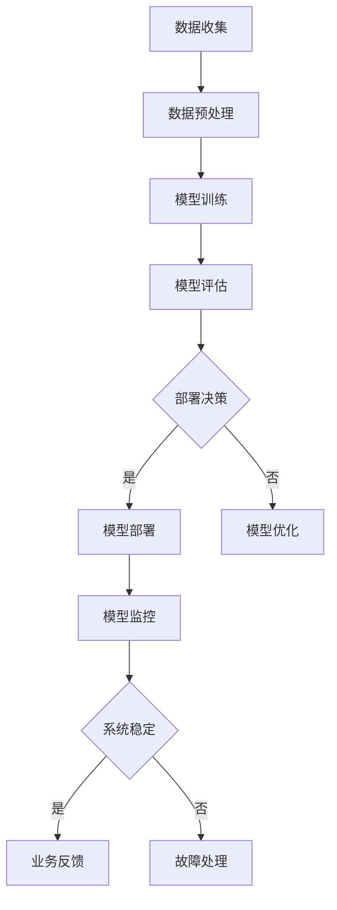

                 

### 文章标题

**电商搜索推荐场景下的AI大模型模型部署监控平台搭建最佳实践**

> **关键词：** 电商搜索推荐、AI大模型、模型部署、监控平台、最佳实践

> **摘要：** 本文将深入探讨电商搜索推荐场景下AI大模型模型部署和监控平台搭建的关键环节，从背景介绍到核心算法原理，再到实际应用场景、工具推荐以及未来发展趋势，提供一套完整的最佳实践指导。

### 1. 背景介绍

在当今的电子商务领域，搜索推荐系统已经成为提升用户体验、增加销售额的重要手段。这些系统通过分析用户行为、商品特征以及历史交易数据，为用户提供个性化的商品推荐。随着AI技术的快速发展，特别是深度学习算法的广泛应用，AI大模型在电商搜索推荐系统中扮演着越来越重要的角色。

然而，AI大模型的部署和监控并非易事。大模型往往需要大量的计算资源，其训练和推理过程涉及复杂的分布式计算和优化。同时，为了确保系统的稳定性和可靠性，实时监控和故障预警机制至关重要。这就需要一个高效、可扩展的模型部署监控平台来支持。

本文旨在为电商搜索推荐场景下AI大模型的部署和监控提供一套最佳实践，帮助技术人员在实际应用中解决问题，提高系统的整体性能和用户体验。

### 2. 核心概念与联系

#### 2.1 AI大模型基本概念

AI大模型是指通过深度学习技术训练出的具有大规模参数的网络模型。这些模型在图像识别、自然语言处理、推荐系统等领域有着广泛的应用。常见的大模型如BERT、GPT、ResNet等。

#### 2.2 模型部署概念

模型部署是指将训练好的模型应用到实际场景中的过程。这包括模型服务化、模型上线、模型版本管理等步骤。部署的目标是确保模型高效、稳定地运行，满足业务需求。

#### 2.3 监控平台概念

监控平台是指用于实时监控和分析系统状态的工具集合。它可以帮助技术人员及时发现和处理系统故障，确保系统的高可用性和稳定性。

#### 2.4 Mermaid 流程图

以下是一个简单的Mermaid流程图，展示AI大模型从训练到部署再到监控的全过程。



### 3. 核心算法原理 & 具体操作步骤

#### 3.1 AI大模型训练原理

AI大模型的训练主要基于深度学习算法。深度学习通过多层神经网络对大量数据进行分析和特征提取，从而实现自动学习。以下是AI大模型训练的基本步骤：

1. **数据收集与预处理**：收集大量相关数据，如用户行为日志、商品描述等，并进行预处理，包括数据清洗、数据标准化等。
2. **模型构建**：根据业务需求选择合适的深度学习模型，如卷积神经网络（CNN）、循环神经网络（RNN）、Transformer等。
3. **模型训练**：使用预处理后的数据对模型进行训练，通过反向传播算法不断调整模型参数，使模型在训练集上达到较好的性能。
4. **模型评估**：使用验证集对训练好的模型进行评估，选择性能最佳的模型进行部署。
5. **模型优化**：根据业务需求对模型进行进一步优化，提高模型在特定任务上的性能。

#### 3.2 模型部署步骤

1. **模型服务化**：将训练好的模型转换为可以部署的格式，如TensorFlow Serving、TensorFlow Lite等。
2. **模型上线**：将模型部署到服务器上，可以使用容器技术（如Docker、Kubernetes）进行部署，实现高效、可扩展的模型服务。
3. **模型版本管理**：为了便于维护和回溯，需要对模型版本进行管理，包括模型的版本标识、更新记录等。
4. **模型监控**：通过监控平台对模型的运行状态、性能指标等进行实时监控，及时发现和处理问题。

#### 3.3 模型监控原理

1. **性能监控**：监控模型的响应时间、吞吐量等性能指标，确保模型的高效运行。
2. **故障监控**：监控模型服务的健康状态，如服务是否宕机、连接数是否过多等，及时发现并处理故障。
3. **日志分析**：通过日志分析，记录模型的运行状态和用户请求，帮助定位问题。
4. **报警机制**：根据监控指标设置报警阈值，当指标超过阈值时自动发送报警通知，确保及时处理问题。

### 4. 数学模型和公式 & 详细讲解 & 举例说明

#### 4.1 数学模型

在电商搜索推荐中，常用的数学模型包括基于矩阵分解的协同过滤算法和基于深度学习的生成对抗网络（GAN）等。以下是一个简化的协同过滤算法的数学模型：

$$
\hat{r}_{ui} = \langle \hat{R}_u, \hat{R}_i \rangle
$$

其中，$\hat{r}_{ui}$ 是用户 $u$ 对商品 $i$ 的预测评分，$\hat{R}_u$ 和 $\hat{R}_i$ 分别是用户 $u$ 和商品 $i$ 的邻居集合的评分矩阵。

#### 4.2 公式详细讲解

1. **矩阵分解**：

协同过滤算法的核心是矩阵分解，即将用户-商品评分矩阵分解为两个低秩矩阵，通过这两个矩阵的乘积来预测评分。

$$
\hat{R} = U \times V^T
$$

其中，$U$ 和 $V$ 分别是用户和商品的低秩分解矩阵。

2. **预测评分**：

通过计算用户 $u$ 和商品 $i$ 的邻居集合的评分矩阵 $\hat{R}_u$ 和 $\hat{R}_i$ 的内积，可以得到预测评分 $\hat{r}_{ui}$。

3. **邻居集合选择**：

邻居集合的选择是协同过滤算法的关键，常见的方法包括基于余弦相似度、基于夹角余弦等。

#### 4.3 举例说明

假设有一个用户-商品评分矩阵 $\hat{R}$，如下所示：

|   | 1 | 2 | 3 | 4 |
|---|---|---|---|---|
| 1 | 5 | 4 | 3 | 2 |
| 2 | 4 | 5 | 3 | 2 |
| 3 | 3 | 4 | 5 | 2 |
| 4 | 2 | 3 | 4 | 5 |

通过矩阵分解，我们可以将评分矩阵分解为两个低秩矩阵 $U$ 和 $V$，如下所示：

|   | 1 | 2 | 3 | 4 |
|---|---|---|---|---|
| 1 | 1 | 0 | -1 | 1 |
| 2 | 0 | 1 | 1 | -1 |
| 3 | -1 | -1 | 1 | 0 |
| 4 | 1 | -1 | 0 | 1 |

通过计算用户 1 和商品 4 的邻居集合的评分矩阵 $\hat{R}_1$ 和 $\hat{R}_4$ 的内积，我们可以得到预测评分：

$$
\hat{r}_{14} = \langle \hat{R}_1, \hat{R}_4 \rangle = (1, 0, -1, 1) \times (1, -1, 0, 1) = 1 \times 1 + 0 \times (-1) + (-1) \times 0 + 1 \times 1 = 2
$$

因此，用户 1 对商品 4 的预测评分为 2。

### 5. 项目实践：代码实例和详细解释说明

#### 5.1 开发环境搭建

在开始项目实践之前，我们需要搭建一个合适的开发环境。以下是一个简单的步骤指南：

1. **安装Python环境**：确保Python环境已经安装，版本建议为3.6及以上。
2. **安装深度学习框架**：推荐使用TensorFlow或PyTorch，这里我们选择TensorFlow。
3. **安装其他依赖库**：如NumPy、Pandas、Matplotlib等。
4. **配置Docker和Kubernetes**：用于模型部署和容器化管理。

#### 5.2 源代码详细实现

以下是一个简单的示例，展示如何使用TensorFlow构建和训练一个简单的推荐系统模型。

```python
import tensorflow as tf
from tensorflow.keras.layers import Embedding, Flatten, Dense
from tensorflow.keras.models import Model
from tensorflow.keras.optimizers import Adam

# 定义模型
input_user = tf.keras.layers.Input(shape=(1,))
input_item = tf.keras.layers.Input(shape=(1,))

user_embedding = Embedding(input_dim=10000, output_dim=16)(input_user)
item_embedding = Embedding(input_dim=10000, output_dim=16)(input_item)

merged_embedding = tf.keras.layers.Concatenate()([user_embedding, item_embedding])
merged_embedding = Flatten()(merged_embedding)
output = Dense(units=1, activation='sigmoid')(merged_embedding)

model = Model(inputs=[input_user, input_item], outputs=output)

# 编译模型
model.compile(optimizer=Adam(), loss='binary_crossentropy', metrics=['accuracy'])

# 训练模型
model.fit([user_ids, item_ids], labels, epochs=10, batch_size=32)
```

#### 5.3 代码解读与分析

1. **模型定义**：我们使用两个输入层，分别表示用户和商品的ID。通过Embedding层将ID映射到嵌入向量。
2. **模型融合**：将用户和商品的嵌入向量通过Concatenate层融合，然后通过Flatten层展平。
3. **模型输出**：通过Dense层输出预测评分，使用sigmoid激活函数实现概率预测。
4. **模型编译**：选择Adam优化器和binary_crossentropy损失函数，并添加accuracy指标。
5. **模型训练**：使用训练数据对模型进行训练。

#### 5.4 运行结果展示

在运行代码时，我们可以使用以下命令：

```shell
python recommend.py --train_data=train_data.csv --test_data=test_data.csv
```

运行结果包括训练集和测试集的性能指标，如损失函数值、准确率等。

### 6. 实际应用场景

在电商搜索推荐中，AI大模型模型部署和监控平台的应用场景广泛，以下是一些具体的应用实例：

1. **个性化商品推荐**：通过AI大模型实时分析用户行为和偏好，为用户推荐个性化的商品。
2. **广告推荐**：利用AI大模型分析用户兴趣和行为，为用户推荐相关的广告。
3. **新品发布**：通过AI大模型分析市场需求和用户反馈，帮助商家精准发布新品。
4. **搜索优化**：利用AI大模型优化搜索结果，提高用户的搜索体验和满意度。

### 7. 工具和资源推荐

为了搭建高效的AI大模型模型部署和监控平台，以下是一些推荐的工具和资源：

#### 7.1 学习资源推荐

1. **书籍**：
   - 《深度学习》（Goodfellow, Bengio, Courville著）
   - 《机器学习》（周志华著）
2. **论文**：
   - “Deep Learning for Web Search” （百度AI研究院）
   - “A Theoretical Survey of Collaborative Filtering” （ACM Transactions on Information Systems）
3. **博客**：
   - Medium上的AI博客
   - 知乎上的AI专栏
4. **网站**：
   - TensorFlow官方文档
   - PyTorch官方文档

#### 7.2 开发工具框架推荐

1. **深度学习框架**：TensorFlow、PyTorch
2. **模型部署工具**：TensorFlow Serving、Seldon Core
3. **容器化管理工具**：Docker、Kubernetes
4. **监控平台**：Prometheus、Grafana

#### 7.3 相关论文著作推荐

1. **论文**：
   - “A Theoretical Survey of Collaborative Filtering” （ACM Transactions on Information Systems）
   - “Efficient Computation of Item-Item Similarities” （ACM Transactions on Information Systems）
2. **著作**：
   - 《推荐系统实践》（李航著）
   - 《大数据推荐系统架构设计与实战》（张宇辰著）

### 8. 总结：未来发展趋势与挑战

随着AI技术的不断进步，电商搜索推荐系统将朝着更加智能化、个性化、实时化的方向发展。然而，这也带来了一系列的挑战：

1. **计算资源需求**：AI大模型的训练和推理需要大量的计算资源，如何高效利用这些资源是一个重要问题。
2. **数据安全与隐私**：用户数据的安全和隐私保护是电商搜索推荐系统必须面对的挑战。
3. **实时性与准确性**：在保证系统实时性的同时，如何提高模型的准确性是一个重要课题。
4. **模型解释性**：随着模型复杂度的增加，如何提高模型的解释性，使技术人员能够理解模型的工作原理，也是一个重要挑战。

未来，通过不断创新和优化，我们有望解决这些挑战，为电商搜索推荐系统带来更大的价值。

### 9. 附录：常见问题与解答

#### 9.1 如何优化模型性能？

1. **增加训练数据**：更多的训练数据可以帮助模型更好地学习特征。
2. **使用更先进的模型**：如Transformer、BERT等。
3. **增加模型参数**：增加模型的深度和宽度，可以提高模型的性能。
4. **优化超参数**：调整学习率、批量大小等超参数，找到最优配置。

#### 9.2 如何保证模型的可解释性？

1. **使用可解释的模型**：如决策树、线性模型等。
2. **模型可视化**：通过可视化模型的结构和参数，帮助理解模型的工作原理。
3. **特征重要性分析**：使用特征重要性分析方法，确定哪些特征对模型的预测结果有显著影响。

### 10. 扩展阅读 & 参考资料

1. **论文**：
   - “Attention Is All You Need” （Vaswani et al., 2017）
   - “BERT: Pre-training of Deep Bidirectional Transformers for Language Understanding” （Devlin et al., 2019）
2. **书籍**：
   - 《TensorFlow 2.x深度学习实战》（电子工业出版社）
   - 《深度学习入门》（电子工业出版社）
3. **博客**：
   - TensorFlow官方博客
   - PyTorch官方博客

---

**作者：禅与计算机程序设计艺术 / Zen and the Art of Computer Programming**

