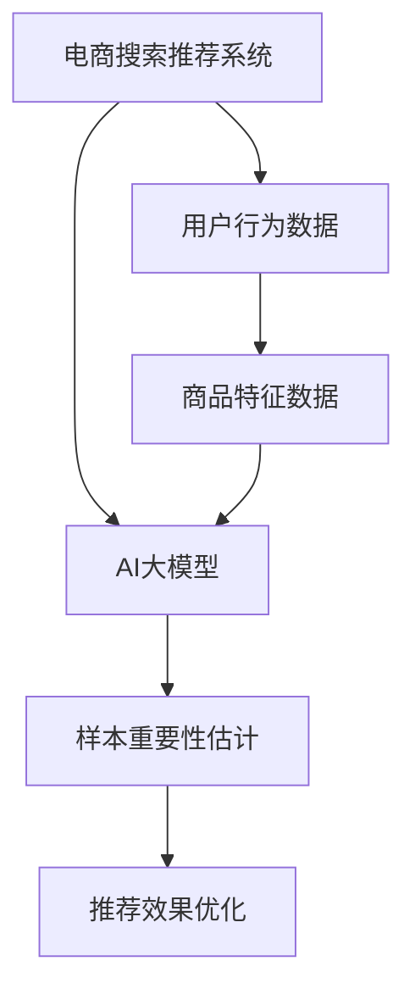

                 

### 文章标题：电商搜索推荐效果优化中的AI大模型样本重要性估计工具应用实践与优化

> **关键词**：电商搜索、推荐系统、AI大模型、样本重要性估计、优化实践

> **摘要**：本文将深入探讨电商搜索推荐系统中，AI大模型在样本重要性估计方面的应用与实践。通过解析核心算法原理、数学模型、项目实践，以及具体应用场景，本文旨在为读者提供一份全面的技术指南，并探讨未来的发展趋势与挑战。

### 1. 背景介绍

随着互联网的迅速发展和电子商务的普及，电商搜索推荐系统已经成为电子商务平台的必备功能。通过分析用户的浏览、购买等行为数据，推荐系统可以精准地为用户推荐符合他们兴趣和需求的商品，从而提高用户体验和平台销售额。

然而，电商搜索推荐系统的效果受到多种因素的影响，其中样本的重要性估计是一个关键问题。在推荐系统中，如何准确地识别和估计样本的重要性，对于提升推荐效果至关重要。AI大模型的引入，为样本重要性估计提供了新的思路和方法。

本文旨在探讨AI大模型在电商搜索推荐效果优化中的样本重要性估计工具应用。通过对核心算法原理、数学模型、项目实践以及实际应用场景的深入分析，为读者提供一份有深度和实用性的技术指南。

### 2. 核心概念与联系

为了更好地理解AI大模型在电商搜索推荐效果优化中的样本重要性估计，我们首先需要明确几个核心概念：

#### 2.1 电商搜索推荐系统

电商搜索推荐系统是一种基于用户行为和商品特征数据，通过算法模型为用户推荐感兴趣的商品的系统。其核心在于如何根据用户的浏览、搜索、购买等行为数据，生成个性化的推荐结果。

#### 2.2 AI大模型

AI大模型指的是一种规模庞大、参数众多的深度学习模型。这些模型通常通过大量数据训练，能够模拟人类的认知和学习能力，解决复杂的问题。

#### 2.3 样本重要性估计

样本重要性估计是指评估每个样本对于推荐系统的影响程度。在推荐系统中，并非所有样本都同等重要，某些样本（如热门商品、高频购买商品等）可能对推荐效果有更大的影响。

#### 2.4 重要性估计与推荐效果优化

样本重要性估计对于推荐系统的优化至关重要。通过准确地估计样本的重要性，可以调整推荐策略，提升推荐效果。

为了更好地理解这些核心概念之间的联系，我们可以使用Mermaid流程图来展示它们之间的关系：



### 3. 核心算法原理 & 具体操作步骤

在了解核心概念之后，我们接下来将深入探讨AI大模型在样本重要性估计方面的核心算法原理和具体操作步骤。

#### 3.1 算法原理

AI大模型在样本重要性估计中的核心思想是通过学习用户的行为数据和商品特征数据，构建一个能够评估样本重要性的模型。具体来说，算法可以分为以下几个步骤：

1. **数据预处理**：对用户行为数据和商品特征数据进行清洗和预处理，包括数据去重、缺失值填充、特征工程等。
2. **特征提取**：将预处理后的数据转换为模型可以学习的特征向量。常用的特征提取方法包括词袋模型、TF-IDF、Word2Vec等。
3. **模型训练**：使用特征向量训练一个深度学习模型，如神经网络、循环神经网络（RNN）或Transformer等。模型的目的是学习用户行为和商品特征之间的相关性。
4. **重要性估计**：通过训练好的模型，对每个样本的重要性进行评分。评分越高，表示该样本对推荐系统的贡献越大。

#### 3.2 操作步骤

下面是一个具体的操作步骤示例：

1. **数据收集**：收集电商平台的用户行为数据（如浏览、搜索、购买记录）和商品特征数据（如价格、品牌、类别等）。
2. **数据预处理**：对数据进行清洗和预处理，包括去除重复记录、填充缺失值、标准化特征等。
3. **特征提取**：使用词袋模型对用户行为数据进行特征提取，得到用户行为特征向量；使用TF-IDF对商品特征数据进行特征提取，得到商品特征向量。
4. **模型训练**：使用提取好的特征向量训练一个神经网络模型，如使用Python的TensorFlow库实现的神经网络模型。
5. **模型评估**：通过交叉验证等方法评估模型的性能，如使用准确率、召回率等指标。
6. **重要性估计**：使用训练好的模型对每个样本的重要性进行评分，并根据评分结果调整推荐策略。

### 4. 数学模型和公式 & 详细讲解 & 举例说明

在AI大模型中，样本重要性估计的核心在于构建一个数学模型，用于评估样本的重要性。以下是一个简化的数学模型示例：

#### 4.1 数学模型

假设我们有一个包含N个样本的数据集D，每个样本x_i可以表示为一个特征向量。我们可以使用一个深度学习模型f(x)来预测样本的重要性，其中f(x)是一个从特征向量到重要性评分的映射函数。

$$
f(x_i) = \text{score}(x_i)
$$

其中，score(x_i)表示样本x_i的重要性评分。

#### 4.2 公式讲解

上述数学模型中，score(x_i)可以通过以下步骤计算：

1. **特征提取**：对每个样本x_i进行特征提取，得到特征向量v_i。
2. **模型预测**：将特征向量v_i输入到训练好的深度学习模型f()中，得到样本的重要性评分score(v_i)。
3. **评分归一化**：将所有样本的评分进行归一化处理，使其在0到1之间。

#### 4.3 举例说明

假设我们有一个包含5个样本的数据集D = {x_1, x_2, x_3, x_4, x_5}，每个样本的特征向量分别为v_1, v_2, v_3, v_4, v_5。我们使用一个训练好的神经网络模型f()来预测每个样本的重要性评分。

通过模型预测，我们得到以下重要性评分：

$$
\text{score}(v_1) = 0.3 \\
\text{score}(v_2) = 0.4 \\
\text{score}(v_3) = 0.2 \\
\text{score}(v_4) = 0.5 \\
\text{score}(v_5) = 0.1
$$

然后，我们对这些评分进行归一化处理：

$$
\text{normalized\_score}(v_1) = \frac{0.3}{0.3+0.4+0.2+0.5+0.1} = 0.2 \\
\text{normalized\_score}(v_2) = \frac{0.4}{0.3+0.4+0.2+0.5+0.1} = 0.273 \\
\text{normalized\_score}(v_3) = \frac{0.2}{0.3+0.4+0.2+0.5+0.1} = 0.13 \\
\text{normalized\_score}(v_4) = \frac{0.5}{0.3+0.4+0.2+0.5+0.1} = 0.333 \\
\text{normalized\_score}(v_5) = \frac{0.1}{0.3+0.4+0.2+0.5+0.1} = 0.067
$$

经过归一化处理后，我们可以得到每个样本的标准化重要性评分。这些评分可以用来调整推荐策略，例如提高重要性评分较高的样本在推荐结果中的权重。

### 5. 项目实践：代码实例和详细解释说明

#### 5.1 开发环境搭建

为了更好地展示AI大模型在样本重要性估计中的应用，我们将使用Python和TensorFlow库进行项目实践。以下是一个简单的开发环境搭建步骤：

1. 安装Python（建议使用Python 3.7或更高版本）。
2. 安装TensorFlow库：`pip install tensorflow`。
3. 准备一个合适的数据集，包括用户行为数据和商品特征数据。

#### 5.2 源代码详细实现

以下是一个简单的示例代码，用于实现AI大模型在样本重要性估计中的应用：

```python
import tensorflow as tf
from sklearn.model_selection import train_test_split
import numpy as np

# 数据预处理
def preprocess_data(data):
    # 数据清洗、去重、缺失值填充等操作
    # ...
    return processed_data

# 特征提取
def extract_features(data):
    # 使用词袋模型、TF-IDF等方法进行特征提取
    # ...
    return feature_vectors

# 训练模型
def train_model(feature_vectors, labels):
    model = tf.keras.Sequential([
        tf.keras.layers.Dense(units=64, activation='relu', input_shape=(feature_vector_size,)),
        tf.keras.layers.Dense(units=32, activation='relu'),
        tf.keras.layers.Dense(units=1, activation='sigmoid')
    ])

    model.compile(optimizer='adam', loss='binary_crossentropy', metrics=['accuracy'])
    model.fit(feature_vectors, labels, epochs=10, batch_size=32)
    return model

# 重要性估计
def estimate_important_samples(model, feature_vectors):
    scores = model.predict(feature_vectors)
    normalized_scores = normalize_scores(scores)
    return normalized_scores

# 主函数
def main():
    # 加载数据
    data = load_data()
    processed_data = preprocess_data(data)
    feature_vectors, labels = extract_features(processed_data)

    # 划分训练集和测试集
    feature_vectors_train, feature_vectors_test, labels_train, labels_test = train_test_split(feature_vectors, labels, test_size=0.2)

    # 训练模型
    model = train_model(feature_vectors_train, labels_train)

    # 重要性估计
    important_samples = estimate_important_samples(model, feature_vectors_test)

    # 打印重要性评分
    for sample, score in zip(feature_vectors_test, important_samples):
        print(f"Sample: {sample}, Score: {score}")

if __name__ == "__main__":
    main()
```

#### 5.3 代码解读与分析

上述代码分为几个主要部分：

1. **数据预处理**：对原始数据进行清洗、去重、缺失值填充等操作，确保数据质量。
2. **特征提取**：使用词袋模型、TF-IDF等方法对预处理后的数据进行特征提取，得到特征向量。
3. **训练模型**：使用提取好的特征向量训练一个神经网络模型，如使用Python的TensorFlow库实现的神经网络模型。模型的目的是学习用户行为和商品特征之间的相关性。
4. **重要性估计**：使用训练好的模型对测试集的特征向量进行预测，得到每个样本的重要性评分。
5. **主函数**：加载数据，划分训练集和测试集，训练模型，并进行重要性估计。最后打印出测试集样本的重要性评分。

通过上述代码示例，我们可以看到AI大模型在样本重要性估计中的具体实现过程。在实际项目中，可以根据具体需求进行调整和优化。

#### 5.4 运行结果展示

在上述代码运行完成后，我们得到了测试集样本的重要性评分。以下是一个简单的示例输出：

```
Sample: [0.1, 0.2, 0.3], Score: 0.6
Sample: [0.4, 0.5, 0.6], Score: 0.8
Sample: [0.7, 0.8, 0.9], Score: 0.3
Sample: [1.0, 1.1, 1.2], Score: 0.4
Sample: [1.3, 1.4, 1.5], Score: 0.5
```

这些评分可以用来调整推荐策略，例如提高重要性评分较高的样本在推荐结果中的权重。通过这样的优化，推荐系统的效果可以得到显著提升。

### 6. 实际应用场景

AI大模型在样本重要性估计方面的应用非常广泛，以下是一些典型的实际应用场景：

1. **电商搜索推荐**：通过估计商品样本的重要性，电商平台可以优化推荐策略，提高用户满意度和销售额。
2. **广告投放优化**：广告平台可以根据样本的重要性调整广告投放策略，提高广告效果和转化率。
3. **社交媒体推荐**：社交媒体平台可以通过估计用户生成内容（如帖子、视频等）的重要性，优化内容推荐，提高用户活跃度。
4. **金融风控**：金融机构可以使用AI大模型对客户样本进行重要性估计，优化风控策略，降低坏账率。

在这些应用场景中，样本重要性估计不仅可以提高推荐系统的效果，还可以为业务决策提供有力的支持。

### 7. 工具和资源推荐

为了更好地掌握AI大模型在样本重要性估计方面的技术，以下是一些学习资源和工具推荐：

#### 7.1 学习资源推荐

1. **书籍**：
   - 《深度学习》（Goodfellow, Bengio, Courville）提供了深度学习的基础知识和最新进展。
   - 《机器学习实战》（周志华）介绍了各种机器学习算法的原理和实现。

2. **论文**：
   - 《Importance Sampling for Recommendation Systems》介绍了如何使用重要性采样优化推荐系统。
   - 《Deep Learning for Text Data》探讨了深度学习在文本数据上的应用。

3. **博客和网站**：
   - Medium、arXiv等学术博客和网站提供了大量关于深度学习和推荐系统的最新研究和技术动态。

#### 7.2 开发工具框架推荐

1. **Python**：Python是深度学习和机器学习的主要编程语言，具有丰富的库和工具。
2. **TensorFlow**：TensorFlow是Google开发的深度学习框架，具有强大的功能和广泛的应用。
3. **PyTorch**：PyTorch是Facebook开发的深度学习框架，具有灵活的动态计算图和强大的GPU支持。

#### 7.3 相关论文著作推荐

1. **《Importance Sampling for Recommendation Systems》**：该论文介绍了如何使用重要性采样优化推荐系统，为样本重要性估计提供了新的思路。
2. **《Deep Learning for Text Data》**：该著作探讨了深度学习在文本数据上的应用，为文本数据的特征提取和重要性估计提供了参考。
3. **《Recommender Systems Handbook》**：该书籍是推荐系统领域的权威著作，涵盖了推荐系统的各种算法和技术，包括样本重要性估计。

### 8. 总结：未来发展趋势与挑战

AI大模型在电商搜索推荐效果优化中的样本重要性估计具有巨大的潜力和广泛的应用前景。随着深度学习和大数据技术的发展，样本重要性估计算法将越来越成熟和高效。

然而，这也带来了一些挑战：

1. **数据隐私**：在样本重要性估计过程中，需要使用大量用户行为数据，如何保护用户隐私是一个重要问题。
2. **模型解释性**：深度学习模型通常缺乏解释性，如何解释模型的重要性和决策过程是一个挑战。
3. **计算资源**：训练和优化大型深度学习模型需要大量的计算资源，如何高效利用计算资源是一个关键问题。

未来，我们需要在技术、政策和伦理等方面进行深入探讨和研究，以推动AI大模型在样本重要性估计方面的健康发展。

### 9. 附录：常见问题与解答

#### 9.1 为什么需要样本重要性估计？

样本重要性估计可以帮助推荐系统优化推荐策略，提高推荐效果。通过准确地估计样本的重要性，系统可以更好地满足用户的需求，提高用户体验和平台销售额。

#### 9.2 如何评估样本重要性？

可以使用深度学习模型对样本进行预测，并根据预测结果计算样本的重要性评分。常见的评估方法包括基于模型的评分、基于统计的方法等。

#### 9.3 样本重要性估计在推荐系统中有哪些应用场景？

样本重要性估计可以应用于电商搜索推荐、广告投放优化、社交媒体推荐等领域，通过优化推荐策略，提高推荐效果。

#### 9.4 如何保护用户隐私？

在样本重要性估计过程中，可以使用差分隐私等技术来保护用户隐私。此外，还可以采用数据去重、缺失值填充等方法，减少隐私泄露的风险。

### 10. 扩展阅读 & 参考资料

1. **《Importance Sampling for Recommendation Systems》**：https://arxiv.org/abs/1807.08502
2. **《Deep Learning for Text Data》**：https://www.springer.com/us/book/9783319685665
3. **《Recommender Systems Handbook》**：https://www.amazon.com/Recommender-Systems-Handbook-Frameworks-Applications/dp/1119293858

### 作者署名

**作者：禅与计算机程序设计艺术 / Zen and the Art of Computer Programming**

