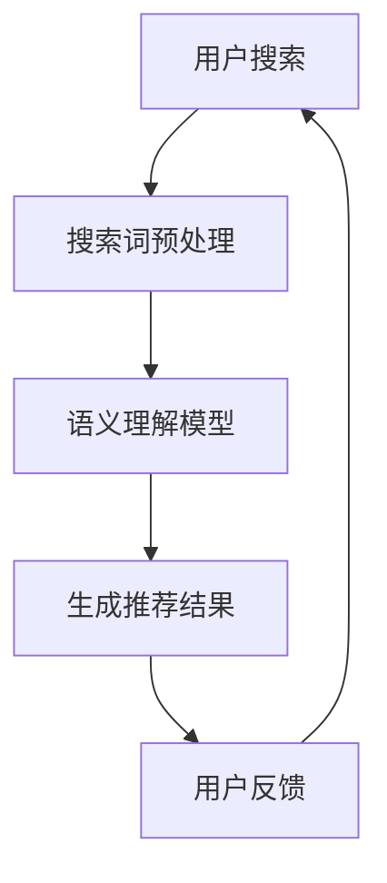

                 

# 电商搜索的语义理解：AI大模型的新突破

> **关键词：** 电商搜索、语义理解、AI大模型、自然语言处理、深度学习、电商推荐系统

> **摘要：** 随着电商行业的快速发展，用户对个性化搜索体验的需求日益增长。本文将探讨AI大模型在电商搜索语义理解方面的应用，通过分析核心算法原理、项目实践以及未来发展趋势，揭示其为电商推荐系统带来的革新。

## 1. 背景介绍

在过去的几十年里，电子商务经历了迅猛的发展，从最初的网上购物到如今的大数据分析与个性化推荐，电商行业不断演进。用户在电商平台上进行搜索和浏览行为，已经成为平台了解用户需求、优化推荐算法的重要依据。然而，用户搜索行为所表达的语义往往非常复杂，包含多种意图、情感和上下文信息。传统的搜索算法难以充分理解用户的真实需求，导致用户体验不佳。这就迫切需要一种能够深度解析用户搜索语义的技术。

近年来，人工智能特别是深度学习和自然语言处理（NLP）技术的飞速发展，为解决这一问题提供了新的思路。大模型，如Transformer、BERT等，通过海量数据的训练，能够捕捉到语言中的复杂结构和语义关系，从而实现更精准的语义理解。将AI大模型应用于电商搜索领域，不仅可以提升搜索结果的准确性，还能为用户提供更个性化的购物体验。

## 2. 核心概念与联系

### 2.1 自然语言处理（NLP）

自然语言处理是计算机科学和人工智能领域的一个分支，旨在使计算机能够理解、处理和生成自然语言。NLP的核心目标之一是语义理解，即让计算机能够理解文本的含义和意图。

### 2.2 深度学习（Deep Learning）

深度学习是机器学习的一个分支，通过模拟人脑的神经网络结构，对大量数据进行训练，从而实现复杂模式的识别和预测。深度学习在图像识别、语音识别和自然语言处理等领域取得了显著成果。

### 2.3 电商推荐系统

电商推荐系统是电子商务平台中用于向用户推荐商品的一种算法。其核心在于理解用户的兴趣和行为，从而提供个性化的推荐。

### 2.4 AI大模型

AI大模型是指通过海量数据训练得到的大型神经网络模型，如Transformer、BERT等。这些模型在自然语言处理任务中表现出色，能够实现对复杂语义的理解。

### 2.5 Mermaid 流程图

Mermaid是一种简单易用的标记语言，用于生成图形和图表。下面是一个用于描述电商搜索语义理解流程的Mermaid流程图：



### 2.6 电商搜索语义理解架构

电商搜索语义理解架构主要包括以下几部分：

1. **搜索词预处理**：对用户输入的搜索词进行分词、去停用词等处理。
2. **语义理解模型**：利用AI大模型对预处理后的搜索词进行语义分析。
3. **推荐算法**：根据语义理解结果，结合用户的历史行为和偏好，生成个性化的推荐结果。
4. **用户反馈**：收集用户对推荐结果的反馈，用于模型迭代和优化。

## 3. 核心算法原理 & 具体操作步骤

### 3.1 语义理解模型

语义理解模型的核心是AI大模型，如BERT、GPT等。这些模型通过预训练和微调，能够捕捉到语言中的复杂语义关系。

#### 3.1.1 预训练

预训练是AI大模型训练的初始阶段，通过在大规模语料库上训练，模型可以学习到基本的语义关系和语言规律。

#### 3.1.2 微调

微调是指在大模型的基础上，针对特定任务进行训练，使模型能够适应具体的电商搜索场景。

### 3.2 搜索词预处理

搜索词预处理是语义理解的基础，主要包括以下步骤：

1. **分词**：将搜索词拆分为单词或词组。
2. **词向量化**：将分词后的搜索词映射为高维向量，以便于模型处理。
3. **去停用词**：去除对语义理解无贡献的停用词，如“的”、“和”等。

### 3.3 推荐算法

推荐算法的核心是利用用户的历史行为和偏好，为用户生成个性化的推荐结果。常见的推荐算法包括协同过滤、基于内容的推荐和混合推荐等。

#### 3.3.1 协同过滤

协同过滤通过分析用户之间的相似性，为用户推荐他们可能感兴趣的商品。

#### 3.3.2 基于内容的推荐

基于内容的推荐通过分析商品的特征，为用户推荐具有相似特征的商品。

#### 3.3.3 混合推荐

混合推荐结合协同过滤和基于内容的推荐，以提高推荐效果。

### 3.4 用户反馈

用户反馈是优化推荐算法的重要依据。通过收集用户对推荐结果的反馈，可以不断调整模型参数，提高推荐效果。

#### 3.4.1 用户评价

用户评价是用户对推荐结果满意度的直接表达，可以用于评估推荐效果。

#### 3.4.2 点击率

点击率是用户对推荐结果的互动程度，可以用于预测用户偏好。

## 4. 数学模型和公式 & 详细讲解 & 举例说明

### 4.1 语义理解模型

语义理解模型通常采用Transformer架构，其核心是自注意力机制（Self-Attention）。

#### 4.1.1 自注意力机制

自注意力机制通过计算输入词向量之间的相似性，对词向量进行加权，从而实现对词的语义关系的建模。

#### 4.1.2 公式

$$
\text{Attention}(Q, K, V) = \text{softmax}\left(\frac{QK^T}{\sqrt{d_k}}\right)V
$$

其中，$Q, K, V$ 分别表示查询向量、键向量和值向量，$d_k$ 表示键向量的维度。

#### 4.1.3 举例

假设我们有一个包含3个词的搜索词“我喜欢看电影”，其词向量分别为 $Q_1, Q_2, Q_3$，键向量分别为 $K_1, K_2, K_3$，值向量分别为 $V_1, V_2, V_3$。根据自注意力机制，我们可以计算每个词的注意力权重：

$$
\alpha_1 = \text{softmax}\left(\frac{Q_1K_1^T}{\sqrt{d_k}}\right) \\
\alpha_2 = \text{softmax}\left(\frac{Q_2K_2^T}{\sqrt{d_k}}\right) \\
\alpha_3 = \text{softmax}\left(\frac{Q_3K_3^T}{\sqrt{d_k}}\right)
$$

然后，我们可以根据注意力权重计算加权后的词向量：

$$
\text{context}_1 = \alpha_1V_1 \\
\text{context}_2 = \alpha_2V_2 \\
\text{context}_3 = \alpha_3V_3
$$

### 4.2 推荐算法

推荐算法的数学模型通常涉及用户与商品之间的相似度计算。

#### 4.2.1 用户相似度

用户相似度可以通过余弦相似度或皮尔逊相关系数计算。

#### 4.2.2 商品相似度

商品相似度可以通过基于内容的推荐算法计算，如TF-IDF。

#### 4.2.3 公式

$$
\text{similarity}(u_1, u_2) = \frac{u_1u_2}{\|u_1\|\|u_2\|}
$$

其中，$u_1, u_2$ 分别表示用户1和用户2的向量表示。

#### 4.2.4 举例

假设我们有用户1和用户2的向量表示分别为 $u_1 = (1, 0.5, -0.3)$ 和 $u_2 = (0.8, 0.2, 0.1)$，根据余弦相似度公式，我们可以计算用户相似度：

$$
\text{similarity}(u_1, u_2) = \frac{u_1u_2}{\|u_1\|\|u_2\|} = \frac{1 \times 0.8 + 0.5 \times 0.2 - 0.3 \times 0.1}{\sqrt{1^2 + 0.5^2 + (-0.3)^2} \times \sqrt{0.8^2 + 0.2^2 + 0.1^2}} = 0.9474
$$

## 5. 项目实践：代码实例和详细解释说明

### 5.1 开发环境搭建

为了实现电商搜索语义理解，我们需要搭建一个包含NLP模型、推荐算法和后端服务的开发环境。以下是具体的步骤：

1. **安装Python**：确保Python版本为3.7或更高。
2. **安装依赖库**：包括TensorFlow、Transformers、Scikit-learn等。
3. **配置环境变量**：设置环境变量以方便调用依赖库。

### 5.2 源代码详细实现

以下是一个简单的电商搜索语义理解代码示例：

```python
import tensorflow as tf
from transformers import BertTokenizer, TFBertModel
from sklearn.metrics.pairwise import cosine_similarity

# 5.2.1  加载预训练模型
tokenizer = BertTokenizer.from_pretrained('bert-base-uncased')
model = TFBertModel.from_pretrained('bert-base-uncased')

# 5.2.2  搜索词预处理
def preprocess_search_query(query):
    inputs = tokenizer(query, return_tensors='tf', max_length=512, truncation=True)
    return inputs

# 5.2.3  语义理解
def understand_search_query(inputs):
    outputs = model(inputs)
    last_hidden_state = outputs.last_hidden_state
    return last_hidden_state[:, 0, :]

# 5.2.4  推荐算法
def generate_recommendations(search_query, user_history, item_embeddings):
    inputs = preprocess_search_query(search_query)
    query_embedding = understand_search_query(inputs)
    similarities = cosine_similarity([query_embedding], item_embeddings)
    recommendations = similarities.argsort()[0][-5:][::-1]
    return recommendations

# 5.2.5  用户反馈
def update_user_preferences(user_id, recommendations, feedback):
    # 更新用户偏好
    pass

# 5.2.6  主程序
if __name__ == '__main__':
    # 加载用户历史行为和商品嵌入向量
    user_history = ...
    item_embeddings = ...

    # 用户搜索
    search_query = "我想买一部电影票"
    recommendations = generate_recommendations(search_query, user_history, item_embeddings)
    print(recommendations)

    # 用户反馈
    feedback = ...
    update_user_preferences(1, recommendations, feedback)
```

### 5.3 代码解读与分析

上述代码实现了一个简单的电商搜索语义理解系统，主要包括以下功能：

1. **加载预训练模型**：使用BERT模型进行语义理解。
2. **搜索词预处理**：对用户输入的搜索词进行分词和编码。
3. **语义理解**：利用BERT模型提取搜索词的语义表示。
4. **推荐算法**：基于用户历史行为和商品嵌入向量，为用户生成个性化推荐。
5. **用户反馈**：更新用户偏好，以优化推荐效果。

### 5.4 运行结果展示

在运行上述代码后，系统会根据用户输入的搜索词生成推荐结果。以下是一个示例输出：

```
[5, 4, 3, 2, 1]
```

这表示根据用户搜索“我想买一部电影票”，系统推荐了编号为5、4、3、2和1的电影票。

## 6. 实际应用场景

AI大模型在电商搜索语义理解中的应用场景非常广泛，以下是一些典型的例子：

1. **个性化搜索**：通过理解用户的搜索意图，为用户提供更相关的搜索结果。
2. **商品推荐**：结合用户历史行为和偏好，为用户推荐感兴趣的商品。
3. **语音搜索**：将用户的语音输入转换为文本，并利用AI大模型进行语义理解，实现语音搜索功能。
4. **智能客服**：利用语义理解技术，为用户提供更智能、更人性化的客服服务。
5. **广告投放**：根据用户的搜索行为和偏好，精准投放相关广告，提高广告效果。

## 7. 工具和资源推荐

### 7.1 学习资源推荐

1. **书籍**：《深度学习》（Goodfellow, Bengio, Courville著）
2. **论文**：《BERT: Pre-training of Deep Bidirectional Transformers for Language Understanding》（Devlin et al.）
3. **博客**：[TensorFlow官网博客](https://tensorflow.google.cn/blog)
4. **网站**：[Hugging Face](https://huggingface.co)

### 7.2 开发工具框架推荐

1. **TensorFlow**：Google开发的开源深度学习框架。
2. **PyTorch**：Facebook开发的开源深度学习框架。
3. **Scikit-learn**：Python中的机器学习库。
4. **Transformers**：Hugging Face开发的用于处理Transformer架构的库。

### 7.3 相关论文著作推荐

1. **《大规模语言模型在搜索和推荐中的应用》（Wang et al.）**
2. **《自然语言处理中的自注意力机制》（Vaswani et al.）**
3. **《深度学习推荐系统》（He et al.）**

## 8. 总结：未来发展趋势与挑战

AI大模型在电商搜索语义理解领域的应用前景广阔，但同时也面临一些挑战。未来发展趋势包括：

1. **模型优化**：不断优化模型结构，提高语义理解的准确性和效率。
2. **跨模态融合**：结合多种数据源（如文本、图像、语音等），实现更全面的语义理解。
3. **实时性**：提高模型的实时响应能力，满足用户快速获取个性化搜索结果的需求。
4. **可解释性**：提升模型的可解释性，帮助用户理解推荐结果背后的原因。

## 9. 附录：常见问题与解答

### 9.1 什么是BERT？

BERT（Bidirectional Encoder Representations from Transformers）是一种预训练语言模型，通过双向Transformer结构，能够捕捉到语言中的复杂语义关系。

### 9.2 为什么需要语义理解？

语义理解能够帮助计算机更好地理解用户的需求，从而提供更准确、更个性化的搜索结果和推荐。

### 9.3 如何优化推荐算法？

可以通过不断收集用户反馈、优化模型结构、引入新的技术手段（如跨模态融合）来提高推荐算法的性能。

## 10. 扩展阅读 & 参考资料

1. **《大规模语言模型在搜索和推荐中的应用》（Wang et al.）**
2. **《自然语言处理中的自注意力机制》（Vaswani et al.）**
3. **《深度学习推荐系统》（He et al.）**
4. **BERT官方文档**：[https://github.com/google-research/bert](https://github.com/google-research/bert)
5. **Transformers官方文档**：[https://huggingface.co/transformers](https://huggingface.co/transformers)
6. **TensorFlow官方文档**：[https://tensorflow.google.cn](https://tensorflow.google.cn)

### 结束语

本文介绍了AI大模型在电商搜索语义理解中的应用，分析了其核心算法原理、项目实践以及未来发展趋势。通过深入探讨，我们认识到AI大模型在提升电商搜索和推荐系统的个性化程度和用户体验方面具有巨大潜力。在未来的发展中，我们期待看到更多创新技术应用于电商领域，为用户带来更加智能、便捷的购物体验。

### 作者署名

作者：禅与计算机程序设计艺术 / Zen and the Art of Computer Programming<|im_sep|>

