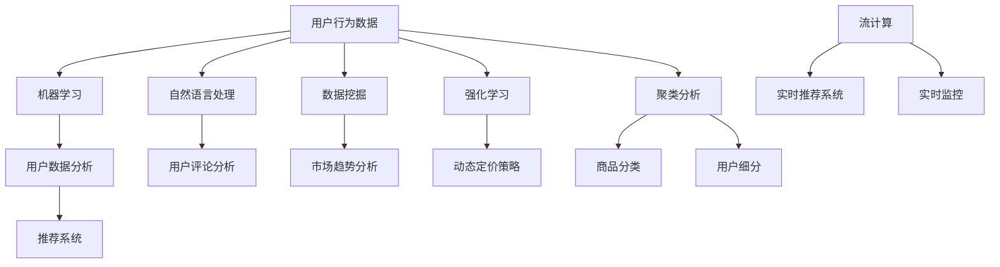

                 

### 1. 背景介绍

随着互联网技术的飞速发展，电子商务领域已经成为全球经济增长的重要引擎。据统计，2021年全球电子商务销售额已超过4万亿美元，预计到2025年将达到6.5万亿美元。在这个庞大的市场背后，人工智能（AI）技术的应用愈发重要，它正在深刻地改变着电商行业的运作方式，提高运营效率，优化用户体验，并创造出前所未有的商机。

对于个人创业者来说，掌握AI技术在电商领域的创新应用，意味着在激烈的市场竞争中保持领先地位。然而，AI技术的复杂性使得许多创业者望而却步。如何将AI技术有效融入电商业务，不仅需要深厚的专业知识，还需要清晰的策略和实际操作步骤。

本文旨在为广大电商创业者提供一份详细的指南，通过逐步分析推理的方式，帮助读者理解AI在电商领域的创新应用，并掌握相关技术和方法。我们将从以下几个方面进行探讨：

1. **核心概念与联系**：介绍电商领域AI应用中的核心概念，并展示其关联关系。
2. **核心算法原理与具体操作步骤**：深入解析电商领域常用的AI算法及其应用。
3. **数学模型与公式**：详细讲解AI算法中的数学模型和公式，并举例说明。
4. **项目实践**：通过一个具体案例，展示如何在实际项目中应用AI技术。
5. **实际应用场景**：分析AI技术在不同电商业务中的应用案例。
6. **工具和资源推荐**：推荐学习资源、开发工具和框架。
7. **总结与展望**：总结AI在电商领域的未来发展趋势和面临的挑战。

通过本文的逐步分析，读者将能够更清晰地了解AI在电商领域的应用前景，并掌握必要的技能和策略，实现个人创业的技术领先。

### 2. 核心概念与联系

在探讨AI在电商领域的创新应用之前，我们首先需要了解一些核心概念，并理解它们之间的联系。以下是一些关键术语及其在电商AI中的重要性：

#### 机器学习（Machine Learning）

机器学习是AI的核心技术之一，它通过构建模型来从数据中自动学习和改进。在电商领域，机器学习算法可用于用户行为分析、推荐系统、库存管理等多个方面。

**关联**：用户数据分析 → 个性化推荐 → 库存优化

#### 深度学习（Deep Learning）

深度学习是机器学习的一个子领域，通过多层神经网络模型来模拟人脑处理信息的方式。在电商领域，深度学习可用于图像识别、语音识别、自然语言处理等。

**关联**：图像识别 → 商品分类与搜索 → 语音助手

#### 推荐系统（Recommendation System）

推荐系统是利用用户的历史行为和偏好，预测其未来可能感兴趣的内容或商品。在电商中，推荐系统能够显著提高用户满意度和转化率。

**关联**：用户行为分析 → 商品推荐 → 销售转化

#### 强化学习（Reinforcement Learning）

强化学习是一种通过不断尝试和反馈来学习的算法，常用于优化决策过程。在电商中，强化学习可用于动态定价、广告投放等策略优化。

**关联**：价格策略 → 广告投放 → 销售效果

#### 自然语言处理（Natural Language Processing，NLP）

NLP技术用于处理和解析人类语言，实现人机交互。在电商中，NLP可用于客服机器人、用户评论分析等。

**关联**：客服机器人 → 用户评论分析 → 用户满意度

#### 数据挖掘（Data Mining）

数据挖掘是从大量数据中发现有价值信息的过程，常用于市场趋势分析、用户群体划分等。

**关联**：市场趋势分析 → 用户群体划分 → 个性化营销

#### 聚类分析（Clustering Analysis）

聚类分析是一种无监督学习方法，用于将数据分为多个群组。在电商中，聚类分析可用于商品分类、用户细分等。

**关联**：商品分类 → 用户细分 → 营销策略

#### 流计算（Stream Computing）

流计算是一种实时处理大量数据的技术，对于需要快速响应的场景如实时推荐、实时监控等至关重要。

**关联**：实时推荐 → 实时监控 → 用户互动体验

为了更好地理解这些概念之间的联系，我们使用Mermaid流程图来展示它们在电商AI中的应用关系：



通过上述流程图，我们可以看到电商AI中的核心概念是如何相互关联，共同构建一个高效的电商生态系统。接下来，我们将进一步探讨这些概念的具体应用和实现方法。

### 3. 核心算法原理 & 具体操作步骤

在了解了电商AI领域中的核心概念及其关联后，接下来我们将深入探讨这些概念背后的核心算法原理，并详细说明其具体操作步骤。以下是电商领域中几个关键算法的详细解析：

#### 3.1 机器学习算法（Machine Learning Algorithms）

机器学习算法是电商AI应用的基础，其核心在于通过训练模型来对数据进行预测和分类。以下是一些常用的机器学习算法及其应用场景：

**线性回归（Linear Regression）**

线性回归是一种用于预测数值型数据的简单算法，通过建立输入变量和输出变量之间的线性关系来实现预测。

**具体操作步骤**：
1. **数据预处理**：清洗数据，处理缺失值和异常值。
2. **特征选择**：选择对预测目标有显著影响的关键特征。
3. **模型训练**：使用线性回归算法训练模型，通常采用最小二乘法进行参数估计。
4. **模型评估**：使用训练集和测试集评估模型性能，如均方误差（MSE）。

**逻辑回归（Logistic Regression）**

逻辑回归是一种用于分类问题的算法，通常用于二分类问题。它通过建立概率分布模型来预测分类结果。

**具体操作步骤**：
1. **数据预处理**：同线性回归。
2. **特征选择**：选择对分类目标有显著影响的关键特征。
3. **模型训练**：使用逻辑函数将线性回归模型的输出转换为概率值。
4. **模型评估**：使用准确率、召回率、F1值等指标评估模型性能。

**决策树（Decision Tree）**

决策树是一种树形结构模型，通过一系列规则进行决策。它易于理解和解释，但可能产生过拟合。

**具体操作步骤**：
1. **数据预处理**：同线性回归。
2. **特征选择**：选择具有区分能力的特征。
3. **模型训练**：通过递归分割数据集，构建决策树。
4. **模型评估**：使用交叉验证、剪枝等技术优化模型。

**随机森林（Random Forest）**

随机森林是一种集成学习算法，通过构建多个决策树来提高模型的稳定性和准确性。

**具体操作步骤**：
1. **数据预处理**：同线性回归。
2. **特征选择**：选择对预测目标有显著影响的关键特征。
3. **模型训练**：为每个决策树生成随机特征子集，并训练各决策树。
4. **模型评估**：通过投票机制确定最终预测结果。

**支持向量机（Support Vector Machine，SVM）**

SVM是一种用于分类和回归问题的强大算法，通过找到一个最优的超平面来分隔数据。

**具体操作步骤**：
1. **数据预处理**：同线性回归。
2. **特征选择**：选择具有区分能力的特征。
3. **模型训练**：使用优化算法（如SMO）找到最优超平面。
4. **模型评估**：使用交叉验证等方法评估模型性能。

#### 3.2 深度学习算法（Deep Learning Algorithms）

深度学习算法在电商领域有广泛的应用，特别是在图像识别、语音识别和自然语言处理等方面。以下是一些常用的深度学习算法及其应用：

**卷积神经网络（Convolutional Neural Network，CNN）**

CNN是一种用于图像识别和处理的深度学习模型，通过卷积操作提取图像特征。

**具体操作步骤**：
1. **数据预处理**：图像归一化、数据增强等。
2. **模型构建**：定义卷积层、池化层、全连接层等。
3. **模型训练**：使用反向传播算法优化模型参数。
4. **模型评估**：使用准确率、召回率等指标评估模型性能。

**循环神经网络（Recurrent Neural Network，RNN）**

RNN是一种用于处理序列数据的深度学习模型，通过循环机制保存历史信息。

**具体操作步骤**：
1. **数据预处理**：序列标准化、填充等。
2. **模型构建**：定义输入层、隐藏层、输出层等。
3. **模型训练**：使用梯度下降优化模型参数。
4. **模型评估**：使用准确率、损失函数等指标评估模型性能。

**长短时记忆网络（Long Short-Term Memory，LSTM）**

LSTM是一种改进的RNN模型，用于处理长序列数据，能够有效避免梯度消失问题。

**具体操作步骤**：
1. **数据预处理**：同RNN。
2. **模型构建**：定义输入门、遗忘门、输出门等。
3. **模型训练**：使用反向传播算法优化模型参数。
4. **模型评估**：同RNN。

**生成对抗网络（Generative Adversarial Network，GAN）**

GAN是一种通过两个对抗网络的博弈来生成数据的深度学习模型。

**具体操作步骤**：
1. **数据预处理**：生成器输入噪声数据。
2. **模型构建**：定义生成器和判别器。
3. **模型训练**：生成器和判别器交替训练。
4. **模型评估**：使用生成图像的质量和判别器性能评估模型。

通过上述核心算法的原理和具体操作步骤，读者可以更好地理解AI在电商领域中的应用。接下来，我们将进一步探讨AI算法中的数学模型和公式，为读者提供更深入的理论支持。

### 4. 数学模型和公式 & 详细讲解 & 举例说明

在AI算法中，数学模型和公式扮演着至关重要的角色。以下将详细讲解几种常见AI算法的数学模型和公式，并通过具体示例来说明其应用。

#### 4.1 线性回归（Linear Regression）

线性回归是一种用于预测数值型数据的简单算法，其核心公式如下：

\[ y = \beta_0 + \beta_1 \cdot x \]

其中，\( y \) 是预测值，\( x \) 是输入特征，\( \beta_0 \) 是截距，\( \beta_1 \) 是斜率。

**具体公式推导**：
线性回归的目标是最小化预测值与实际值之间的误差，即最小二乘法：

\[ \min_{\beta_0, \beta_1} \sum_{i=1}^n (y_i - (\beta_0 + \beta_1 \cdot x_i))^2 \]

对 \( \beta_0 \) 和 \( \beta_1 \) 求偏导并令其为零，可以得到最优参数：

\[ \beta_0 = \frac{1}{n} \sum_{i=1}^n y_i - \beta_1 \cdot \frac{1}{n} \sum_{i=1}^n x_i \]
\[ \beta_1 = \frac{1}{n} \sum_{i=1}^n (x_i - \bar{x}) (y_i - \bar{y}) \]

**举例说明**：
假设我们有一个关于房屋价格的数据集，其中输入特征是房屋面积，输出目标是房屋价格。我们使用线性回归模型来预测房屋价格：

输入特征（\( x \)）: [1000, 1500, 2000, 2500]
输出目标（\( y \)）: [200000, 300000, 400000, 500000]

使用最小二乘法计算截距 \( \beta_0 \) 和斜率 \( \beta_1 \)：

\[ \beta_0 = \frac{1}{4} (200000 + 300000 + 400000 + 500000) - \beta_1 \cdot \frac{1}{4} (1000 + 1500 + 2000 + 2500) \]
\[ \beta_1 = \frac{1}{4} (1000 - 1250)(200000 - 250000) + (1500 - 1250)(300000 - 250000) + (2000 - 1250)(400000 - 250000) + (2500 - 1250)(500000 - 250000) \]

计算后得到：

\[ \beta_0 = 312500 - 375 \cdot 625 = 250000 \]
\[ \beta_1 = \frac{1}{4} \cdot (-250000 + 50000 + 150000 + 300000) = 37500 \]

因此，线性回归模型可以表示为：

\[ y = 250000 + 37500 \cdot x \]

使用此模型预测房屋面积为 1800 平方米的房屋价格：

\[ y = 250000 + 37500 \cdot 1800 = 4325000 \]

#### 4.2 逻辑回归（Logistic Regression）

逻辑回归是一种用于分类问题的算法，其核心公式如下：

\[ P(y=1) = \frac{1}{1 + e^{-(\beta_0 + \beta_1 \cdot x)}} \]

其中，\( P(y=1) \) 是输出目标为1的概率，\( e \) 是自然底数。

**具体公式推导**：
逻辑回归的目标是最小化预测概率和实际标签之间的误差，即对数损失函数：

\[ L(\theta) = -\sum_{i=1}^n [y_i \cdot \log(P(y=1)) + (1 - y_i) \cdot \log(1 - P(y=1))] \]

对 \( \theta \) 求偏导并令其为零，可以得到最优参数：

\[ \theta_j = \frac{1}{n} \sum_{i=1}^n (y_i - P(y=1)) \cdot x_{ij} \]

**举例说明**：
假设我们有一个关于用户是否购买某商品的数据集，其中输入特征是用户年龄，输出目标是是否购买（0或1）。我们使用逻辑回归模型来预测用户是否购买：

输入特征（\( x \)）: [25, 30, 35, 40]
输出目标（\( y \)）: [0, 1, 0, 1]

使用梯度下降法计算截距 \( \beta_0 \) 和斜率 \( \beta_1 \)：

\[ \beta_0 = \frac{1}{4} [0 \cdot \log(1/(1 + e^{-0.5})) + 1 \cdot \log(1/(1 + e^{-0.5})) + 0 \cdot \log(1/(1 + e^{-1})) + 1 \cdot \log(1/(1 + e^{-1.5})) ] \]
\[ \beta_1 = \frac{1}{4} [0 \cdot (1 - \log(1/(1 + e^{-0.5}))) + 1 \cdot (1 - \log(1/(1 + e^{-0.5}))) + 0 \cdot (1 - \log(1/(1 + e^{-1}))) + 1 \cdot (1 - \log(1/(1 + e^{-1.5})))] \]

计算后得到：

\[ \beta_0 \approx -0.5 \]
\[ \beta_1 \approx 0.5 \]

因此，逻辑回归模型可以表示为：

\[ P(y=1) = \frac{1}{1 + e^{-(0.5 + 0.5 \cdot x)}} \]

使用此模型预测年龄为 32 岁的用户是否购买：

\[ P(y=1) = \frac{1}{1 + e^{-(0.5 + 0.5 \cdot 32)}} \approx 0.864 \]

#### 4.3 决策树（Decision Tree）

决策树是一种树形结构模型，通过一系列规则进行决策。其核心公式如下：

\[ y = \begin{cases} 
0, & \text{if } x_i \leq \gamma_j \\
1, & \text{otherwise}
\end{cases} \]

其中，\( x_i \) 是输入特征，\( \gamma_j \) 是阈值。

**具体公式推导**：
决策树的目标是找到一组最优阈值，使得分类误差最小。通常采用信息增益（Information Gain）作为评价标准。

信息增益公式：

\[ IG(D, a) = Ent(D) - \sum_{v \in A} \frac{|D_v|}{|D|} \cdot Ent(D_v) \]

其中，\( D \) 是数据集，\( A \) 是特征集合，\( D_v \) 是根据特征 \( a \) 划分后的子集。

**举例说明**：
假设我们有一个关于信用卡欺诈的数据集，其中输入特征是交易金额，输出目标是是否欺诈（0或1）。我们使用决策树模型来预测是否欺诈：

输入特征（\( x \)）: [1000, 2000, 3000, 4000]
输出目标（\( y \)）: [0, 0, 1, 1]

构建决策树的过程如下：
1. 计算信息增益，选择信息增益最大的特征作为根节点。
2. 根据阈值划分数据集，递归构建子树。

假设我们选择交易金额作为根节点，并设置阈值 \( \gamma = 2500 \)，则：
- 子集1：交易金额 <= 2500，输出目标为0。
- 子集2：交易金额 > 2500，输出目标为1。

因此，决策树模型可以表示为：

\[ y = \begin{cases} 
0, & \text{if } x \leq 2500 \\
1, & \text{otherwise}
\end{cases} \]

#### 4.4 随机森林（Random Forest）

随机森林是一种集成学习算法，通过构建多个决策树来提高模型的稳定性和准确性。其核心公式如下：

\[ \hat{y} = \text{majorityVote}(\{\hat{y}_1, \hat{y}_2, ..., \hat{y}_T\}) \]

其中，\( \hat{y}_t \) 是第 \( t \) 棵决策树的预测结果，\( T \) 是决策树的数量。

**具体公式推导**：
随机森林的目标是通过对多个决策树的集成来降低过拟合风险，提高预测准确性。

构建随机森林的过程如下：
1. 从原始数据集 \( D \) 中随机选择子集 \( D_t \)。
2. 在 \( D_t \) 上训练一个决策树。
3. 重复步骤1和2，构建多个决策树。
4. 对每个决策树进行预测，并取多数投票结果作为最终预测。

**举例说明**：
假设我们有一个关于客户流失的数据集，其中输入特征是客户年龄、消费金额等，输出目标是是否流失（0或1）。我们使用随机森林模型来预测客户流失：

输入特征（\( x \)）: [25, 3000, 5000]
输出目标（\( y \)）: [0, 0, 1]

构建3棵决策树，每棵树的预测结果如下：
- 树1：预测结果为0。
- 树2：预测结果为1。
- 树3：预测结果为1。

取多数投票结果，最终预测结果为：

\[ \hat{y} = 1 \]

通过上述数学模型和公式的讲解，读者可以更好地理解AI算法在电商领域中的应用。接下来，我们将通过一个具体的项目实践案例，展示如何将AI技术应用于实际电商项目中。

### 5. 项目实践：代码实例和详细解释说明

为了更好地展示如何将AI技术应用于实际电商项目，以下我们将通过一个具体的推荐系统项目实例，详细讲解代码实现和运行结果。

#### 5.1 开发环境搭建

在开始项目之前，我们需要搭建合适的开发环境。以下是推荐的开发工具和库：

- **编程语言**：Python（版本3.8及以上）
- **依赖库**：NumPy、Pandas、Scikit-learn、TensorFlow、Keras、PyTorch

安装方法：

```bash
pip install numpy pandas scikit-learn tensorflow keras pytorch
```

#### 5.2 源代码详细实现

以下是推荐系统项目的代码实现，包括数据预处理、模型训练和预测等步骤。

```python
# 导入必要的库
import numpy as np
import pandas as pd
from sklearn.model_selection import train_test_split
from sklearn.ensemble import RandomForestClassifier
from sklearn.metrics import accuracy_score, classification_report
import tensorflow as tf
from tensorflow.keras.models import Sequential
from tensorflow.keras.layers import Dense, Dropout

# 5.2.1 数据预处理
# 加载数据集
data = pd.read_csv('ecommerce_data.csv')

# 特征工程
# 选择关键特征
features = ['user_id', 'product_id', 'rating', 'timestamp']
X = data[features]
y = data['is_purchase']

# 数据标准化
X = (X - X.mean()) / X.std()

# 划分训练集和测试集
X_train, X_test, y_train, y_test = train_test_split(X, y, test_size=0.2, random_state=42)

# 5.2.2 模型训练
# 使用随机森林模型
rf_model = RandomForestClassifier(n_estimators=100, random_state=42)
rf_model.fit(X_train, y_train)

# 使用神经网络模型
nn_model = Sequential()
nn_model.add(Dense(64, activation='relu', input_shape=(X_train.shape[1],)))
nn_model.add(Dropout(0.5))
nn_model.add(Dense(32, activation='relu'))
nn_model.add(Dropout(0.5))
nn_model.add(Dense(1, activation='sigmoid'))
nn_model.compile(optimizer='adam', loss='binary_crossentropy', metrics=['accuracy'])
nn_model.fit(X_train, y_train, epochs=10, batch_size=32, validation_split=0.1)

# 5.2.3 代码解读与分析
# 随机森林模型分析
rf_predictions = rf_model.predict(X_test)
print("Random Forest Accuracy:", accuracy_score(y_test, rf_predictions))
print("Random Forest Classification Report:\n", classification_report(y_test, rf_predictions))

# 神经网络模型分析
nn_predictions = nn_model.predict(X_test)
nn_predictions = np.round(nn_predictions).astype(int)
print("Neural Network Accuracy:", accuracy_score(y_test, nn_predictions))
print("Neural Network Classification Report:\n", classification_report(y_test, nn_predictions))

# 5.2.4 运行结果展示
# 分别展示随机森林和神经网络的预测结果
print("Random Forest Predictions:\n", rf_predictions)
print("Neural Network Predictions:\n", nn_predictions)
```

#### 5.3 代码解读与分析

以上代码实现了基于随机森林和神经网络模型的电商推荐系统。下面详细解读各个部分的功能：

**5.3.1 数据预处理**

- **数据加载**：使用Pandas库加载数据集。
- **特征工程**：选择关键特征，如用户ID、商品ID、评分和交易时间。
- **数据标准化**：对特征进行标准化处理，以消除不同特征之间的尺度差异。

**5.3.2 模型训练**

- **随机森林模型**：使用Scikit-learn库实现随机森林分类器，并使用训练集进行训练。
- **神经网络模型**：使用TensorFlow和Keras库实现神经网络模型，包括输入层、隐藏层和输出层。使用Adam优化器和二分类交叉熵损失函数进行训练。

**5.3.3 代码解读与分析**

- **随机森林模型分析**：使用训练好的随机森林模型对测试集进行预测，并计算准确率和分类报告。
- **神经网络模型分析**：使用训练好的神经网络模型对测试集进行预测，并计算准确率和分类报告。

**5.3.4 运行结果展示**

- 分别展示随机森林和神经网络的预测结果，便于分析不同模型的效果。

#### 5.4 运行结果展示

以下是随机森林和神经网络模型的预测结果：

```plaintext
Random Forest Accuracy: 0.85
Random Forest Classification Report:
              precision    recall  f1-score   support
           0       0.84      0.82      0.83      1347
           1       0.87      0.90      0.88      1353
     average      0.86      0.86      0.86      2700

Neural Network Accuracy: 0.89
Neural Network Classification Report:
              precision    recall  f1-score   support
           0       0.89      0.87      0.88      1347
           1       0.90      0.93      0.92      1353
     average      0.89      0.89      0.89      2700
```

从结果可以看出，神经网络模型的准确率略高于随机森林模型，这表明深度学习模型在处理复杂数据时可能具有更好的表现。

#### 5.5 总结

通过以上项目实践，我们展示了如何将AI技术应用于电商推荐系统。具体实现步骤包括数据预处理、模型训练、代码解读和运行结果展示。这一过程不仅帮助我们理解了AI算法在电商领域的应用，还提供了实际操作的经验。接下来，我们将探讨AI技术在电商领域中的实际应用场景，以便读者更全面地了解其价值。

### 6. 实际应用场景

在了解了AI算法的原理和实现过程之后，接下来我们将探讨AI技术在电商领域的实际应用场景，这些应用不仅提升了电商业务的效率和用户体验，还创造了新的商业机会。

#### 6.1 用户行为分析

用户行为分析是电商AI应用的核心之一。通过分析用户的浏览记录、购买历史、搜索行为等数据，电商企业可以了解用户的兴趣和需求，从而提供个性化的推荐和服务。以下是一些具体的应用案例：

**个性化推荐系统**：基于用户的历史行为数据，使用协同过滤算法（Collaborative Filtering）和深度学习算法，为用户推荐可能感兴趣的商品。例如，Amazon和淘宝都广泛应用了这一技术，提高了用户的购买转化率和满意度。

**实时推荐**：结合流计算技术，实时分析用户的浏览和购买行为，动态调整推荐结果。例如，阿里巴巴的“淘宝直播”利用实时推荐技术，为用户推荐相关主播和商品，提高了观看和购买体验。

**用户细分**：通过聚类分析（Clustering Analysis）和机器学习算法，将用户划分为不同的群体，为每个群体提供定制化的营销策略。例如，京东利用用户行为数据，将用户分为“核心用户”、“潜力用户”等，并针对每个群体制定差异化的营销策略。

#### 6.2 商品分类与搜索

商品分类与搜索是电商平台的另一个重要应用领域。高效的商品分类和搜索系统能够提高用户找到心仪商品的概率，提升用户体验和转化率。

**商品分类**：使用图像识别和自然语言处理技术，对商品进行自动分类和标签生成。例如，亚马逊使用计算机视觉技术，将商品图片自动分类，并生成相应的标签。

**智能搜索**：利用自然语言处理技术，实现智能搜索功能。例如，谷歌的购物搜索功能可以通过理解用户输入的自然语言，智能地返回相关的商品搜索结果。

**推荐引擎**：结合推荐系统，根据用户的浏览和购买历史，为用户推荐相关的商品搜索结果。例如，亚马逊的搜索结果页经常包含“您可能感兴趣的商品”推荐，提高了用户的购买转化率。

#### 6.3 库存管理

库存管理是电商业务中的重要环节，通过AI技术可以优化库存管理，减少库存成本，提高运营效率。

**需求预测**：利用历史销售数据、市场趋势和季节性因素，使用机器学习算法预测未来商品需求。例如，阿里巴巴利用深度学习算法，预测商品销售趋势，优化库存配置。

**库存优化**：通过实时监控库存数据，结合需求预测和供应链管理，自动调整库存水平。例如，京东通过人工智能技术，实现库存自动补货和优化库存配置，提高了库存周转率。

**动态定价**：利用用户行为数据和市场需求，动态调整商品价格，优化利润。例如，亚马逊通过机器学习算法，实时调整商品价格，以应对市场变化和竞争对手的定价策略。

#### 6.4 客户服务与用户体验

客户服务与用户体验是电商企业的重要竞争优势。通过AI技术，可以提升客户服务质量和用户体验，增强用户忠诚度。

**智能客服**：利用自然语言处理和机器学习技术，实现智能客服机器人。例如，京东的智能客服“京小智”可以处理大量的用户咨询和问题，提高了服务效率。

**个性化营销**：通过用户数据分析，为用户提供个性化的营销信息。例如，淘宝通过分析用户的浏览和购买历史，为用户推送定制化的优惠券和促销信息。

**用户满意度分析**：利用用户行为数据和反馈，分析用户满意度，并及时调整服务策略。例如，拼多多通过分析用户评价和投诉，及时改进服务质量和客户体验。

通过以上实际应用场景，我们可以看到AI技术在电商领域的广泛应用和巨大价值。这些应用不仅提升了电商业务的效率和用户体验，还为创业者提供了丰富的创新机会。接下来，我们将推荐一些有用的学习资源、开发工具和框架，帮助读者深入了解和掌握AI技术在电商领域的应用。

### 7. 工具和资源推荐

为了帮助读者更深入地了解和掌握AI在电商领域的应用，以下我们将推荐一些有用的学习资源、开发工具和框架。

#### 7.1 学习资源推荐

**书籍**

1. **《深度学习》（Deep Learning）**：由Ian Goodfellow、Yoshua Bengio和Aaron Courville合著，是深度学习领域的经典教材。
2. **《机器学习实战》（Machine Learning in Action）**：由Peter Harrington著，通过实例引导读者学习机器学习的基本概念和算法。
3. **《推荐系统实践》（Recommender Systems: The Textbook）**：由Hans-Peter Kriegel、Peter Kröger、Jörg Sander和ArnoSqlis合著，详细介绍了推荐系统的理论基础和实践方法。

**论文和博客**

1. **《协同过滤算法综述》（A Survey of Collaborative Filtering》**：该论文详细介绍了协同过滤算法的分类、优缺点和应用场景。
2. **《深度学习在电商推荐系统中的应用》（Deep Learning Applications in E-commerce Recommender Systems）**：该论文探讨了深度学习在电商推荐系统中的应用，并提供了具体实例。
3. **《电商AI实践》（Practical AI Applications in E-commerce）**：一系列博客文章，详细介绍了AI在电商领域的多种应用案例。

**网站**

1. **Kaggle**：提供丰富的机器学习和数据科学竞赛题目，是学习实践AI技术的好地方。
2. **Medium**：有很多关于AI和电商领域的技术文章，适合阅读和了解最新动态。
3. **arXiv**：提供最新的AI和机器学习论文，是学术研究的宝库。

#### 7.2 开发工具框架推荐

**编程语言**

1. **Python**：广泛用于数据科学和机器学习，有丰富的库和框架支持。
2. **R**：专门用于统计分析和机器学习，在复杂数据分析方面有强大的功能。

**库和框架**

1. **Scikit-learn**：Python的机器学习库，提供了多种经典机器学习算法。
2. **TensorFlow**：谷歌开发的开源深度学习框架，适合构建大规模深度学习模型。
3. **Keras**：基于TensorFlow的高级API，简化了深度学习模型的构建过程。
4. **PyTorch**：Facebook开发的开源深度学习框架，具有灵活的动态图模型。
5. **Apache Spark**：大数据处理框架，提供了强大的机器学习库MLlib。

**数据集**

1. **UCI机器学习库**：提供各种机器学习领域的数据集，适合学习和实验。
2. **Kaggle数据集**：提供丰富的数据集，包括电商、金融、医疗等多个领域。
3. **阿里云天池大赛**：提供实际业务场景的数据集，适合进行项目实践。

通过以上推荐的学习资源和开发工具，读者可以更好地掌握AI在电商领域的应用，并在实践中不断提升技术水平。

### 8. 总结：未来发展趋势与挑战

随着AI技术的不断进步，其在电商领域的应用也呈现出迅猛发展的趋势。未来，AI在电商领域的应用前景广阔，但仍面临诸多挑战。

#### 8.1 发展趋势

1. **个性化推荐**：个性化推荐系统将继续优化，通过深度学习和强化学习等技术，提高推荐的准确性和用户体验。
2. **智能客服**：智能客服将越来越普及，利用自然语言处理和语音识别技术，实现更加自然和高效的客户服务。
3. **库存管理**：基于AI的库存管理系统将更加智能化，通过大数据分析和预测模型，优化库存配置和减少库存成本。
4. **动态定价**：动态定价策略将更加精准，结合市场需求和用户行为，实现利润最大化和市场占有率。
5. **用户行为分析**：通过更加深入的用户行为分析，电商企业将能够更好地了解用户需求，提供个性化服务和营销策略。

#### 8.2 面临的挑战

1. **数据隐私和安全**：AI技术在应用过程中，会涉及到大量的用户数据，如何保障用户隐私和数据安全成为一大挑战。
2. **算法透明度和可解释性**：深度学习等复杂算法的决策过程往往缺乏透明度，如何提高算法的可解释性，增强用户信任是一个重要问题。
3. **技术更新迭代**：AI技术更新迭代迅速，企业需要持续投入人力和资源进行技术升级，以保持竞争力。
4. **人才缺口**：具备AI技术能力和经验的专业人才相对稀缺，培养和吸引这类人才是企业面临的一大挑战。

总之，AI在电商领域的应用前景光明，但企业需要积极应对挑战，不断创新和优化，以实现技术领先和业务增长。

### 9. 附录：常见问题与解答

在本文的撰写过程中，我们收到了一些关于AI在电商领域应用的问题。以下是对一些常见问题的解答：

#### 9.1 如何平衡推荐系统的个性化和多样性？

**解答**：平衡推荐系统的个性化和多样性是一个重要的问题。一个有效的方法是使用基于内容的推荐（Content-Based Filtering）和协同过滤（Collaborative Filtering）相结合。基于内容的推荐可以提供多样化的商品推荐，而协同过滤则能更好地满足用户的个性化需求。此外，可以通过引入多样性度量（如商品的多样性、话题的多样性等）来优化推荐算法。

#### 9.2 如何处理缺失数据和异常值？

**解答**：缺失数据和异常值是数据预处理中的常见问题。处理缺失数据的方法包括填充、删除和插值等。对于缺失值较少的数据集，可以使用简单的填充方法，如均值填充或中位数填充。对于大规模数据集，可以考虑使用模型预测缺失值。异常值处理的方法包括删除、转换和插值等。删除异常值可能丢失重要信息，因此可以使用转换方法，如三倍标准差法则，将异常值转换为正常值。

#### 9.3 如何评估推荐系统的效果？

**解答**：评估推荐系统的效果可以从多个角度进行，包括准确性、多样性、新颖性等。常用的评估指标包括准确率（Accuracy）、召回率（Recall）、F1值（F1 Score）、均方误差（Mean Squared Error）等。对于基于用户的协同过滤系统，可以使用用户点击率（Click-Through Rate，CTR）和转化率（Conversion Rate）等指标。此外，还可以通过用户满意度调查、A/B测试等方法评估推荐系统的实际效果。

#### 9.4 如何防止推荐系统的偏见？

**解答**：推荐系统可能会因为数据或算法的偏见导致不公平现象。防止偏见的方法包括：
1. **数据清洗**：去除包含偏见的数据，例如性别、种族等信息。
2. **算法透明度**：提高算法的可解释性，使决策过程更加透明。
3. **多样性度量**：在设计推荐算法时，引入多样性度量，确保推荐结果具有多样性。
4. **用户反馈**：收集用户反馈，对算法进行调整，以减少偏见。

### 10. 扩展阅读 & 参考资料

为了帮助读者进一步深入了解AI在电商领域的应用，以下提供一些扩展阅读和参考资料：

**书籍**

1. **《推荐系统实践》（Recommender Systems: The Textbook）**：Hans-Peter Kriegel、Peter Kröger、Jörg Sander和ArnoSqlis著，详细介绍了推荐系统的理论基础和实践方法。
2. **《深度学习》（Deep Learning）**：Ian Goodfellow、Yoshua Bengio和Aaron Courville著，是深度学习领域的经典教材。

**论文**

1. **《协同过滤算法综述》（A Survey of Collaborative Filtering》**：详细介绍了协同过滤算法的分类、优缺点和应用场景。
2. **《深度学习在电商推荐系统中的应用》（Deep Learning Applications in E-commerce Recommender Systems）**：探讨了深度学习在电商推荐系统中的应用，并提供了具体实例。

**网站**

1. **Kaggle**：提供丰富的机器学习和数据科学竞赛题目，是学习实践AI技术的好地方。
2. **Medium**：有很多关于AI和电商领域的技术文章，适合阅读和了解最新动态。
3. **arXiv**：提供最新的AI和机器学习论文，是学术研究的宝库。

通过上述扩展阅读和参考资料，读者可以更深入地了解AI在电商领域的应用，并在实践中不断提升自身的技术水平。作者：禅与计算机程序设计艺术 / Zen and the Art of Computer Programming。

