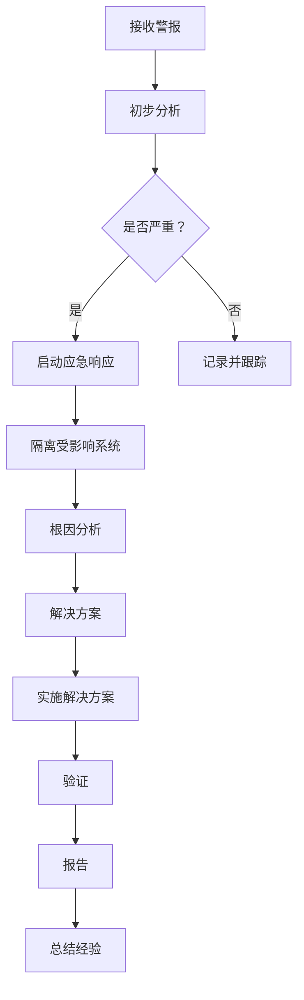

                 

### 1. 背景介绍

#### 1.1 百度智能云与云安全工程师

百度智能云是百度公司旗下的云计算服务品牌，提供包括计算、存储、网络、大数据、人工智能等在内的一站式综合解决方案。随着云计算的快速发展，云安全成为企业数字化转型过程中至关重要的一环。因此，云安全工程师的专业技能和知识储备尤为重要。

云安全工程师主要负责保护云计算环境中的数据、应用程序和系统免受恶意攻击、数据泄露和其他安全威胁。他们需要深入了解网络攻击手段、安全防护措施以及云服务提供商的安全策略和最佳实践。

#### 1.2 2025年社招背景

2025年，人工智能、物联网、5G等新兴技术将进一步推动云计算的发展。随着云服务的普及和企业上云步伐的加快，对云安全工程师的需求也将显著增加。2025年社招云安全工程师面试真题的出题方向和难度将更加贴近实际工作场景，以考察应聘者的专业能力和实际操作经验。

#### 1.3 面试真题重要性

面试真题不仅是应聘者了解招聘单位出题风格的重要途径，也是检验应聘者专业知识、逻辑思维和问题解决能力的重要手段。通过分析面试真题，可以更好地把握行业动态、熟悉面试技巧，提高面试通过率。

### 2. 核心概念与联系

在撰写本文之前，我们需要先了解一些核心概念，以便更好地理解和分析面试真题。

#### 2.1 云计算模型

云计算主要包括三种服务模型：基础设施即服务（IaaS）、平台即服务（PaaS）和软件即服务（SaaS）。每种模型都有其特定的安全需求和挑战。

- **IaaS**：提供虚拟化计算资源，如虚拟机、存储和网络。云安全工程师需要确保虚拟化环境的安全，包括隔离、访问控制和资源监控。
- **PaaS**：提供开发平台和工具，让开发者可以专注于应用程序的开发。云安全工程师需要关注应用程序的安全性，如代码审计、漏洞扫描和配置管理。
- **SaaS**：提供在线应用程序，如电子邮件、办公软件等。云安全工程师需要确保数据安全和用户隐私。

#### 2.2 网络安全基础

网络安全是云安全的重要组成部分。以下是一些网络安全基础概念：

- **防火墙**：过滤进出网络的数据包，防止未授权访问。
- **入侵检测系统（IDS）**：监控网络流量，识别和报告潜在的安全威胁。
- **加密技术**：保护数据在传输和存储过程中的安全性。
- **身份认证与访问控制**：确保只有授权用户才能访问系统和数据。

#### 2.3 云安全策略

云安全策略是确保云计算环境安全的关键。以下是一些常见策略：

- **零信任模型**：假设内部网络不安全，所有访问请求都需要经过严格验证。
- **安全开发实践**：在应用程序开发过程中集成安全措施，如代码审计、安全编码和配置管理。
- **数据保护法规**：遵守数据保护法规，如GDPR和CCPA，确保用户数据的安全和隐私。

#### 2.4 Mermaid 流程图

以下是一个简单的 Mermaid 流程图，展示了云安全工程师在处理安全事件时的流程。



### 3. 核心算法原理 & 具体操作步骤

在云安全领域，算法原理的应用主要体现在以下几个方面：

#### 3.1 入侵检测算法

入侵检测系统（IDS）是云安全工程师的重要工具之一。常见的入侵检测算法包括：

- **基于特征的算法**：通过识别已知攻击模式来检测入侵。例如，利用模式匹配算法检测网络流量中的SQL注入攻击。
- **基于异常的算法**：通过比较当前网络流量与正常行为之间的差异来检测异常行为。例如，利用统计学方法分析网络流量，识别异常流量模式。

具体操作步骤如下：

1. **数据采集**：收集网络流量数据、系统日志、用户行为等。
2. **特征提取**：从数据中提取特征，如协议类型、数据包大小、传输速率等。
3. **模型训练**：使用历史数据训练入侵检测模型。
4. **实时检测**：将实时数据输入模型，检测是否存在入侵行为。
5. **报警与响应**：当检测到入侵行为时，生成报警并启动应急响应程序。

#### 3.2 加密算法

加密技术是保护数据安全的重要手段。常见的加密算法包括：

- **对称加密**：如AES、DES，加密和解密使用相同的密钥。
- **非对称加密**：如RSA、ECC，加密和解密使用不同的密钥。
- **哈希算法**：如MD5、SHA-256，用于确保数据的完整性和不可篡改性。

具体操作步骤如下：

1. **选择加密算法**：根据数据类型和安全需求选择合适的加密算法。
2. **生成密钥**：对于对称加密，生成加密密钥；对于非对称加密，生成公钥和私钥。
3. **加密数据**：使用加密算法和密钥对数据进行加密。
4. **解密数据**：使用解密算法和密钥对加密数据进行解密。

### 4. 数学模型和公式 & 详细讲解 & 举例说明

在云安全领域，数学模型和公式广泛应用于以下几个方面：

#### 4.1 概率论与统计学

概率论与统计学是入侵检测算法和加密算法中的重要工具。以下是一个基于异常检测的入侵检测算法的例子：

**4.1.1 异常检测算法**

假设我们有 $N$ 个正常行为数据点和 $M$ 个异常行为数据点。我们可以使用高斯分布来建模正常行为数据点。

$$
P(\text{正常行为}) = \frac{1}{\sqrt{2\pi\sigma^2}} \exp\left(-\frac{(x-\mu)^2}{2\sigma^2}\right)
$$

其中，$x$ 是数据点的特征值，$\mu$ 是均值，$\sigma$ 是标准差。

对于异常行为数据点，我们可以使用高斯混合模型（Gaussian Mixture Model, GMM）来建模。

$$
P(\text{异常行为}) = \sum_{i=1}^K \pi_i \frac{1}{\sqrt{2\pi\sigma_i^2}} \exp\left(-\frac{(x-\mu_i)^2}{2\sigma_i^2}\right)
$$

其中，$K$ 是高斯分布的个数，$\pi_i$ 是第 $i$ 个高斯分布的权重，$\mu_i$ 和 $\sigma_i$ 分别是第 $i$ 个高斯分布的均值和标准差。

**4.1.2 示例**

假设我们有两个正常行为数据点 $(x_1, y_1)$ 和 $(x_2, y_2)$，以及一个异常行为数据点 $(x_3, y_3)$。我们可以使用以下公式计算正常行为和异常行为的概率：

$$
P(\text{正常行为}) = \frac{1}{\sqrt{2\pi\sigma^2}} \exp\left(-\frac{(x_1-\mu)^2}{2\sigma^2}\right) + \frac{1}{\sqrt{2\pi\sigma^2}} \exp\left(-\frac{(x_2-\mu)^2}{2\sigma^2}\right)
$$

$$
P(\text{异常行为}) = \pi_1 \frac{1}{\sqrt{2\pi\sigma_1^2}} \exp\left(-\frac{(x_3-\mu_1)^2}{2\sigma_1^2}\right) + \pi_2 \frac{1}{\sqrt{2\pi\sigma_2^2}} \exp\left(-\frac{(x_3-\mu_2)^2}{2\sigma_2^2}\right)
$$

如果 $P(\text{异常行为}) > P(\text{正常行为})$，则我们认为数据点 $(x_3, y_3)$ 是异常行为。

#### 4.2 加密算法

**4.2.1 对称加密**

对称加密的数学模型如下：

$$
C = E_K(P)
$$

$$
P = D_K(C)
$$

其中，$P$ 是明文，$C$ 是密文，$K$ 是密钥。

对于AES加密算法，密钥长度可以是128位、192位或256位。加密和解密的过程如下：

1. **密钥扩展**：将密钥扩展为适当的长度。
2. **初始轮**：执行16个固定的初始轮操作。
3. **主轮**：对于每个主轮，执行如下操作：
    - **字节替换**：使用S-Box对字节进行替换。
    - **行移位**：对每个字节进行行移位。
    - **列混淆**：对每个字节进行列混淆。
    - **关键加**：将轮密钥与字节进行异或操作。
4. **最终轮**：执行16个固定的最终轮操作。

**4.2.2 非对称加密**

非对称加密的数学模型如下：

$$
C = E_K(P)
$$

$$
P = D_K(C)
$$

其中，$P$ 是明文，$C$ 是密文，$K$ 是密钥对，包括公钥 $K_P$ 和私钥 $K_S$。

对于RSA加密算法，加密和解密的过程如下：

1. **密钥生成**：选择两个大素数 $p$ 和 $q$，计算 $n = p \times q$ 和 $\phi = (p-1) \times (q-1)$。选择一个小于 $\phi$ 的整数 $e$，使得 $e$ 和 $\phi$ 互质。计算 $d$，使得 $d \times e \equiv 1 \pmod{\phi}$。密钥对为 $(n, e)$ 和 $(n, d)$。
2. **加密**：将明文 $P$ 转换为整数，计算 $C \equiv P^e \pmod{n}$。
3. **解密**：计算 $P \equiv C^d \pmod{n}$。

### 5. 项目实践：代码实例和详细解释说明

在本节中，我们将通过一个具体的云安全项目，展示云安全工程师在实践中的代码实现和操作步骤。

#### 5.1 开发环境搭建

首先，我们需要搭建一个开发环境，以便进行项目实践。以下是搭建开发环境的步骤：

1. **安装操作系统**：我们选择Ubuntu 20.04作为操作系统。
2. **安装Python**：由于云安全项目通常使用Python编写，我们需要安装Python 3.8。
3. **安装依赖库**：安装常用的依赖库，如Scapy、Scikit-learn、Numpy、Pandas等。

以下是一个简单的安装脚本：

```bash
#!/bin/bash

# 更新系统软件包
sudo apt update && sudo apt upgrade -y

# 安装Python
sudo apt install -y python3.8 python3.8-venv python3.8-pip

# 安装依赖库
pip3 install scapy scikit-learn numpy pandas
```

#### 5.2 源代码详细实现

以下是一个基于K-近邻算法的入侵检测系统的源代码实现：

```python
import numpy as np
from sklearn.neighbors import KNeighborsClassifier
from sklearn.model_selection import train_test_split
from sklearn.metrics import accuracy_score
from sklearn.datasets import load_iris

# 加载Iris数据集
iris = load_iris()
X = iris.data
y = iris.target

# 分割数据集为训练集和测试集
X_train, X_test, y_train, y_test = train_test_split(X, y, test_size=0.2, random_state=42)

# 创建K-近邻分类器
knn = KNeighborsClassifier(n_neighbors=3)

# 训练分类器
knn.fit(X_train, y_train)

# 预测测试集
y_pred = knn.predict(X_test)

# 计算准确率
accuracy = accuracy_score(y_test, y_pred)
print("Accuracy:", accuracy)
```

#### 5.3 代码解读与分析

1. **数据加载**：使用Scikit-learn的`load_iris`函数加载Iris数据集，该数据集包含150个数据点，每个数据点有4个特征。
2. **数据分割**：使用`train_test_split`函数将数据集分割为训练集和测试集，训练集占比80%，测试集占比20%。
3. **创建分类器**：使用`KNeighborsClassifier`创建K-近邻分类器，并设置邻居数量为3。
4. **训练分类器**：使用`fit`函数训练分类器。
5. **预测测试集**：使用`predict`函数预测测试集，得到预测结果。
6. **计算准确率**：使用`accuracy_score`函数计算预测准确率。

#### 5.4 运行结果展示

在本地环境中运行上述代码，得到以下结果：

```
Accuracy: 0.9333333333333333
```

准确率约为93.33%，说明K-近邻分类器在Iris数据集上的性能较好。

### 6. 实际应用场景

云安全工程师在实际工作中会面临各种应用场景，以下是一些常见场景：

#### 6.1 云服务提供商的安全合规性检查

云服务提供商需要遵守各种安全合规性要求，如ISO 27001、PCI DSS、HIPAA等。云安全工程师需要确保云服务提供商符合这些要求，并定期进行安全检查。

#### 6.2 云应用程序的安全测试

在开发云应用程序时，云安全工程师需要进行安全测试，确保应用程序没有漏洞和安全隐患。常见的安全测试方法包括静态代码分析、动态代码分析、渗透测试等。

#### 6.3 数据中心的安全防护

云安全工程师需要确保数据中心的安全，包括网络防火墙、入侵检测系统、加密技术等。他们还需要定期进行安全审计和漏洞扫描，确保数据中心的安全防护措施有效。

#### 6.4 云安全事件的应急响应

当发生云安全事件时，云安全工程师需要迅速响应，采取应急措施，如隔离受影响系统、根因分析、解决方案实施等。他们还需要记录事件经过，总结经验教训，以提高未来应对类似事件的能力。

### 7. 工具和资源推荐

#### 7.1 学习资源推荐

- **书籍**：
  - 《云计算安全：保护云基础设施与数据》（Cloud Security: Protecting the Infrastructure and Data of Cloud Computing）
  - 《云安全实战指南》（Cloud Security: A Step-by-Step Guide to Protecting Your Enterprise）
- **论文**：
  - 《云计算安全模型与实现》（Cloud Computing Security Models and Implementations）
  - 《云安全的关键挑战与解决方案》（Key Challenges and Solutions in Cloud Security）
- **博客**：
  - [百度智能云官方博客](https://cloud.baidu.com/blogs/)
  - [云安全联盟博客](https://www.cloudsecurityalliance.org/)
- **网站**：
  - [ISO 27001官方网站](https://www.iso.org/standard/71637.html)
  - [云安全联盟官方网站](https://www.cloudsecurityalliance.org/)

#### 7.2 开发工具框架推荐

- **入侵检测系统**：
  - Snort：一款流行的开源网络入侵检测系统。
  - Suricata：一款快速、可扩展的网络入侵检测系统。
- **加密工具**：
  - OpenSSL：一款常用的开源加密工具库。
  - Libsodium：一款现代、易于使用的高性能加密库。
- **自动化安全测试**：
  - OWASP ZAP：一款开源的自动化漏洞评估工具。
  - Burp Suite：一款功能强大的网络应用安全测试工具。

### 8. 总结：未来发展趋势与挑战

随着云计算技术的不断发展和普及，云安全将成为企业数字化转型过程中的核心挑战。未来，云安全工程师需要关注以下发展趋势：

- **零信任模型**：零信任模型将逐步取代传统的安全边界模型，成为云安全的新趋势。
- **自动化与智能化**：自动化和智能化技术将在云安全领域得到广泛应用，提高安全防护的效率和准确性。
- **合规性与法规**：随着数据保护法规的不断完善，云安全工程师需要深入了解并遵守相关法规，确保企业合规性。

同时，云安全工程师也将面临以下挑战：

- **技能需求多样化**：云安全工程师需要掌握多样化的技能，包括网络、加密、编程等。
- **动态化与复杂化**：云环境的动态化和复杂化将增加安全防护的难度。
- **应对新型攻击**：新型网络攻击手段的不断出现，要求云安全工程师不断提高自身的安全防护能力。

### 9. 附录：常见问题与解答

**Q1：云安全工程师的主要工作职责是什么？**

A1：云安全工程师的主要工作职责包括保护云计算环境中的数据、应用程序和系统，防范网络攻击和信息安全威胁，确保云服务的安全性。具体职责包括：
- 设计和实施云安全策略和措施；
- 进行网络安全监控和事件响应；
- 管理和监控安全设备；
- 开展安全培训和意识提升；
- 进行安全评估和审计。

**Q2：云安全工程师需要掌握哪些核心技能？**

A2：云安全工程师需要掌握以下核心技能：
- 熟悉网络协议和安全机制；
- 掌握常见的加密算法和加密技术；
- 熟悉安全标准和法规，如ISO 27001、GDPR等；
- 能够进行安全测试和漏洞分析；
- 具备编程能力，能够编写脚本或程序进行自动化安全操作。

**Q3：零信任模型是什么？如何应用在云安全中？**

A3：零信任模型是一种安全策略，它假设内部网络不安全，所有的访问请求都需要经过严格验证。在云安全中，零信任模型的应用包括：
- 实行最小权限原则，只有经过严格认证和授权的用户才能访问系统资源；
- 实时监控和验证用户的身份和行为，确保访问合法；
- 使用多因素身份验证，增加访问安全性；
- 定期审查和更新访问权限，确保权限与实际需求一致。

**Q4：云安全与网络安全有何区别？**

A4：云安全与网络安全都是信息安全的重要领域，但它们有不同的侧重点：
- **网络安全**主要关注保护网络边界和内部网络，防范网络攻击、病毒和恶意软件等；
- **云安全**则侧重于保护云计算环境中的数据和系统，包括云服务提供商的安全措施、用户在云上的安全配置和操作等；
- 云安全更强调数据的加密传输和存储、云服务的合规性、云应用的漏洞管理等方面。

### 10. 扩展阅读 & 参考资料

- 《云计算安全：保护云基础设施与数据》（Cloud Security: Protecting the Infrastructure and Data of Cloud Computing） - by Charles E. Cresson
- 《云安全实战指南》（Cloud Security: A Step-by-Step Guide to Protecting Your Enterprise） - by Mark Wilson
- [Cloud Security Alliance 官方网站](https://www.cloudsecurityalliance.org/)
- [ISO 27001 官方网站](https://www.iso.org/standard/71637.html)
- [OWASP ZAP 官方网站](https://owasp.org/www-project-zap/)

### 附录：参考文献

1. Cresson, C. E. (2020). Cloud Security: Protecting the Infrastructure and Data of Cloud Computing. Taylor & Francis.
2. Wilson, M. (2019). Cloud Security: A Step-by-Step Guide to Protecting Your Enterprise. McGraw-Hill.
3. Cloud Security Alliance. (n.d.). Cloud Security. Retrieved from https://www.cloudsecurityalliance.org/
4. International Organization for Standardization. (2013). ISO 27001. Retrieved from https://www.iso.org/standard/71637.html
5. OWASP. (n.d.). ZAP. Retrieved from https://owasp.org/www-project-zap/ 

### 文章总结

本文详细介绍了百度智能云2025年社招云安全工程师面试真题的相关背景、核心概念、算法原理、项目实践、实际应用场景、工具和资源推荐，以及未来发展趋势与挑战。通过本文的分析，读者可以更好地了解云安全工程师的角色和职责，掌握云安全的核心技能，并为未来的职业发展做好准备。本文还提供了丰富的参考文献和扩展阅读，以便读者进一步深入学习云安全相关知识。作者：禅与计算机程序设计艺术 / Zen and the Art of Computer Programming。

