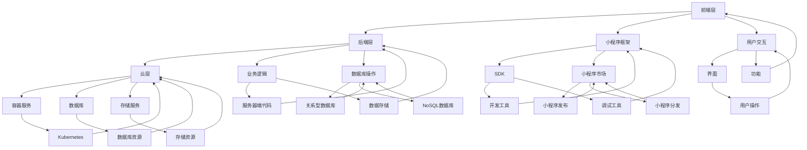

                 

### 1. 背景介绍

百度智能小程序（Baidu Smart Program）是百度公司推出的一款开发平台，旨在帮助开发者和企业构建便捷、高效、跨平台的应用程序。自2017年发布以来，百度智能小程序已广泛应用于多个领域，如电子商务、在线教育、生活服务等，成为百度生态中重要的一环。

在2025年的社会招聘中，百度智能小程序开发工程师的岗位吸引了大量求职者的关注。这一岗位要求应聘者具备扎实的编程基础、熟悉前端与后端开发技术、能够熟练使用百度智能小程序开发框架，并具备一定的项目开发经验。

本文旨在通过逐步分析推理的方式，为有意应聘百度智能小程序开发工程师的读者提供一份详尽的面试指南。文章将从背景介绍、核心概念与联系、核心算法原理、数学模型与公式、项目实践、实际应用场景、工具和资源推荐等多个方面展开，帮助读者全面了解这个岗位的要求和技能。

### 1.1 百度智能小程序的发展历程

百度智能小程序的诞生可以追溯到2016年，当时百度公司意识到随着移动设备的普及，用户对轻量级、高效便捷的应用需求日益增长。为了满足这一需求，百度推出了智能小程序这一创新产品。

在2017年，百度智能小程序正式上线，并迅速在开发者社区和企业用户中获得了广泛关注。百度智能小程序的开发框架基于原生应用的开发模式，支持多种编程语言和开发工具，使得开发者可以更便捷地创建跨平台的应用程序。

2018年，百度智能小程序正式接入百度搜索、信息流、地图等多个核心产品，实现了一键安装和快速启动，进一步提升了用户体验。

2019年，百度智能小程序推出了新功能，包括小程序直播、小程序电商、小程序广告等，丰富了小程序的应用场景，使得开发者可以更灵活地打造多样化的应用。

进入2020年，随着5G技术的普及，百度智能小程序在低延迟、高速度的条件下，提供了更流畅的用户体验，吸引了更多用户和开发者的关注。

到了2025年，百度智能小程序已发展成为一个涵盖多个领域的应用平台，不仅在国内市场占据重要地位，还逐步拓展到了国际市场。百度智能小程序在技术创新、用户体验、生态建设等方面都取得了显著成果，成为全球领先的智能小程序开发平台。

### 1.2 2025年社会招聘中智能小程序开发工程师岗位的需求

在2025年的社会招聘中，百度智能小程序开发工程师岗位的要求相对较高，具体包括以下几个方面：

1. **编程基础**

应聘者应具备扎实的编程基础，熟悉至少一种编程语言（如Java、Python、JavaScript等）。对于前端开发者，要求掌握HTML、CSS、JavaScript等前端技术；对于后端开发者，则需要熟悉服务器端编程，如Java、Python、Node.js等。

2. **开发框架**

熟悉百度智能小程序开发框架和相关开发工具，能够使用框架提供的API和组件进行应用程序的开发。此外，还应具备一定的跨平台开发经验，如React Native、Flutter等。

3. **项目经验**

具备一定的项目开发经验，能够独立完成项目的需求分析、设计、编码、测试和部署等各个环节。应聘者应有至少1-2个成功上线的百度智能小程序项目，以证明其实际开发能力和项目经验。

4. **问题解决能力**

具备较强的逻辑思维和问题解决能力，能够快速定位并解决开发过程中遇到的问题。同时，具备良好的团队合作精神和沟通能力，能够与团队成员高效协作。

5. **持续学习能力**

随着技术的不断更新迭代，智能小程序开发领域也在快速发展。因此，应聘者需要具备持续学习的能力，能够快速掌握新技术和新工具，以适应行业的发展。

6. **业务理解能力**

应聘者应具备较强的业务理解能力，能够根据业务需求进行应用设计，实现功能完善、用户体验优秀的小程序。此外，了解互联网行业发展趋势和竞争态势，能够为项目提供有益的建议和思路。

总之，百度智能小程序开发工程师岗位要求应聘者具备多方面的技能和素质，不仅要有扎实的编程基础和项目经验，还要具备较强的学习能力和业务理解能力。只有这样，才能在激烈的竞争中脱颖而出，成为优秀的智能小程序开发工程师。

### 1.3 面试流程

百度智能小程序开发工程师的面试流程通常包括以下几个环节：

1. **在线笔试**

在面试前，应聘者需要通过在线笔试，以检验其编程能力和理论基础。笔试题目通常包括编程题、算法题和业务理解题等。这部分成绩将作为面试评估的重要依据。

2. **技术面试**

技术面试分为两轮，第一轮通常由HR进行，主要了解应聘者的背景、项目经验和技能水平。第二轮则由技术经理或资深工程师进行，通过现场编程或项目讨论等方式，深入考察应聘者的技术能力和问题解决能力。

3. **HR面试**

HR面试主要考察应聘者的沟通能力、团队合作精神和职业规划等。这部分面试通常由公司的人力资源部门负责，旨在确保应聘者与公司的文化和价值观相匹配。

4. **综合评估**

综合评估是对应聘者的整体素质进行评估，包括笔试、技术面试和HR面试的成绩，以及面试官的推荐意见等。最终，面试官将根据评估结果，确定是否录用应聘者。

整个面试过程通常需要一周左右的时间，应聘者需要做好充分准备，以便在面试中表现出最佳状态。

### 1.4 面试注意事项

在面试过程中，应聘者需要注意以下几点：

1. **着装规范**

面试时穿着得体，给面试官留下良好的第一印象。建议穿着正装或商务休闲装，保持整洁干净。

2. **礼貌礼仪**

面试时保持礼貌，尊重面试官和同事。面试开始前，向面试官问好，面试结束后，表示感谢。

3. **充分准备**

提前了解公司的背景、业务和面试要求，准备好可能被问到的问题，如项目经历、技术难题解决过程等。同时，熟悉自己的简历，确保简历中的内容和回答一致。

4. **清晰表达**

在面试过程中，清晰、简洁地表达自己的观点和想法。如果遇到不懂的问题，可以礼貌地请教，而不是回避。

5. **注意沟通**

面试不仅是考察技术能力，也是考察沟通能力和团队合作精神。在面试中，展示自己的沟通能力和团队协作能力，让对方感受到自己是一个值得信赖的团队成员。

6. **态度积极**

保持积极的态度，面对面试中的挑战和压力。即使遇到困难，也要保持冷静，积极寻找解决方案。

通过以上几点注意事项，应聘者可以更好地应对面试，增加成功的机会。

### 1.5 文章结构概述

本文将按照以下结构进行撰写：

1. **背景介绍**：介绍百度智能小程序的发展历程、岗位需求、面试流程以及注意事项。

2. **核心概念与联系**：阐述百度智能小程序的核心概念、架构以及与相关技术的联系，并通过Mermaid流程图进行展示。

3. **核心算法原理 & 具体操作步骤**：详细解释百度智能小程序开发中的核心算法原理，包括如何实现特定功能、操作步骤以及可能遇到的问题和解决方案。

4. **数学模型和公式 & 详细讲解 & 举例说明**：介绍涉及数学模型和公式的相关概念，以及如何应用这些模型和公式解决实际问题。

5. **项目实践：代码实例和详细解释说明**：通过具体代码实例，展示如何实现百度智能小程序的开发过程，并进行详细解释和分析。

6. **实际应用场景**：探讨百度智能小程序在不同场景下的应用，分析其优势和价值。

7. **工具和资源推荐**：推荐相关的学习资源、开发工具和框架，帮助读者更好地了解和掌握智能小程序开发。

8. **总结：未来发展趋势与挑战**：总结智能小程序开发的现状和未来发展趋势，以及面临的挑战。

9. **附录：常见问题与解答**：汇总面试过程中常见的疑问和解答，帮助读者更好地准备面试。

10. **扩展阅读 & 参考资料**：提供相关的扩展阅读材料和参考资料，供读者进一步学习和研究。

通过以上结构，本文将全面、系统地介绍百度智能小程序开发工程师面试的相关内容，帮助读者更好地应对面试挑战。

### 2. 核心概念与联系

在深入探讨百度智能小程序开发之前，我们需要先了解其核心概念和架构，以及与相关技术的联系。这将为后续的算法原理、项目实践和实际应用场景提供理论基础。

#### 2.1 百度智能小程序的核心概念

百度智能小程序是一个基于云原生架构的应用开发平台，具有跨平台、高效、灵活的特点。其核心概念包括：

- **小程序框架**：百度智能小程序框架是开发小程序的基础，提供了丰富的API和组件，方便开发者快速构建应用。

- **云服务**：百度智能小程序依托于百度云服务，提供了一系列云计算资源，如容器服务、数据库、存储等，为小程序提供了强大的基础设施支持。

- **SDK**：百度智能小程序SDK为开发者提供了开发工具和库，包括调试工具、性能监控工具等，方便开发者进行开发、测试和优化。

- **小程序市场**：百度智能小程序市场是小程序的发布和分发平台，开发者可以在市场中发布自己的小程序，用户可以方便地搜索、下载和使用小程序。

#### 2.2 百度智能小程序的架构

百度智能小程序的架构可以分为三层：前端层、后端层和云层。

- **前端层**：前端层负责与用户交互，包括小程序的界面、用户交互和业务逻辑。前端层主要使用HTML、CSS和JavaScript等前端技术进行开发。

- **后端层**：后端层负责处理业务逻辑和数据存储，包括服务器端代码、数据库操作等。后端层通常使用Java、Python、Node.js等后端技术进行开发。

- **云层**：云层提供云计算资源，包括容器服务、数据库、存储等，为小程序提供强大的基础设施支持。开发者可以通过百度云控制台或SDK进行资源管理和配置。

#### 2.3 百度智能小程序与相关技术的联系

百度智能小程序在开发过程中涉及多种技术，如前端开发技术、后端开发技术、云原生技术等。下面简要介绍这些技术与百度智能小程序的联系：

- **前端开发技术**：百度智能小程序前端开发主要使用HTML、CSS和JavaScript等前端技术。这些技术是构建网页和用户交互的基础，开发者需要熟悉这些技术，并能够灵活运用。

- **后端开发技术**：百度智能小程序后端开发主要使用Java、Python、Node.js等后端技术。这些技术负责处理业务逻辑、数据存储和服务器端代码，开发者需要具备一定的后端开发经验。

- **云原生技术**：百度智能小程序基于云原生架构，开发者需要熟悉容器技术、微服务架构、Kubernetes等云原生技术。这些技术为小程序提供了高效、灵活、可扩展的云基础设施支持。

- **数据库技术**：百度智能小程序在开发过程中需要处理大量数据，开发者需要熟悉关系型数据库（如MySQL、Oracle）和NoSQL数据库（如MongoDB、Redis）的使用，以实现数据的存储和管理。

- **API接口**：百度智能小程序与百度云服务、第三方服务等进行了深度整合，开发者需要熟练使用API接口进行数据交互和功能扩展。

#### 2.4 百度智能小程序的Mermaid流程图

为了更直观地展示百度智能小程序的核心概念和架构，我们可以使用Mermaid流程图进行描述。以下是百度智能小程序的Mermaid流程图：



该流程图展示了百度智能小程序的核心概念、架构以及与相关技术的联系。通过这个流程图，开发者可以更清晰地理解百度智能小程序的工作原理和开发流程。

#### 2.5 小结

通过本节对百度智能小程序核心概念与联系的介绍，我们了解了其基本架构、开发技术以及与相关技术的联系。这些知识将为后续的算法原理、项目实践和实际应用场景提供重要基础。在接下来的章节中，我们将进一步探讨百度智能小程序的开发原理、数学模型、项目实践等内容，帮助读者全面掌握智能小程序开发的技能。

### 3. 核心算法原理 & 具体操作步骤

在百度智能小程序开发过程中，核心算法原理起着至关重要的作用。这些算法原理不仅决定了小程序的性能和功能，还影响着用户体验。本节将详细介绍百度智能小程序开发中的核心算法原理，并给出具体的操作步骤。

#### 3.1 前端渲染算法

前端渲染算法是百度智能小程序开发中的基础，决定了小程序的界面显示效果和性能。以下是一些常见的前端渲染算法及其具体操作步骤：

1. **基于CSS的渲染算法**

   - 步骤1：编写HTML结构，定义页面布局和组件。
   - 步骤2：编写CSS样式，实现页面外观和交互效果。
   - 步骤3：使用JavaScript动态修改DOM结构，实现数据绑定和交互逻辑。
   - 步骤4：使用Web Workers或WebAssembly提高渲染性能。

2. **基于Vue.js的渲染算法**

   - 步骤1：安装Vue.js框架，引入相关依赖。
   - 步骤2：编写Vue组件，实现页面布局和交互。
   - 步骤3：使用Vue的数据绑定机制，实现数据动态更新。
   - 步骤4：使用Vue Router实现页面路由跳转。

3. **基于React的渲染算法**

   - 步骤1：安装React框架，引入相关依赖。
   - 步骤2：编写React组件，实现页面布局和交互。
   - 步骤3：使用React的状态管理库（如Redux）实现数据管理。
   - 步骤4：使用React Router实现页面路由跳转。

#### 3.2 后端处理算法

后端处理算法负责处理业务逻辑、数据存储和服务器端代码，是小程序稳定运行的重要保障。以下是一些常见后端处理算法及其具体操作步骤：

1. **基于Java的RESTful API**

   - 步骤1：搭建Java后端项目，引入相关依赖。
   - 步骤2：定义RESTful API接口，处理客户端请求。
   - 步骤3：使用Spring Boot框架实现业务逻辑和数据存储。
   - 步骤4：使用JWT（JSON Web Token）实现用户认证和权限管理。

2. **基于Python的Flask框架**

   - 步骤1：安装Flask框架，引入相关依赖。
   - 步骤2：编写Flask路由，处理客户端请求。
   - 步骤3：使用SQLAlchemy实现ORM（对象关系映射），处理数据库操作。
   - 步骤4：使用Flask-Migrate实现数据库版本控制。

3. **基于Node.js的Express框架**

   - 步骤1：安装Node.js和Express框架，引入相关依赖。
   - 步骤2：编写Express路由，处理客户端请求。
   - 步骤3：使用Mongoose实现ORM，处理数据库操作。
   - 步骤4：使用中间件实现跨域请求、日志记录等功能。

#### 3.3 云计算算法

云计算算法是百度智能小程序的重要支撑，负责处理海量数据和提供强大的计算能力。以下是一些常见的云计算算法及其具体操作步骤：

1. **容器调度算法**

   - 步骤1：安装Kubernetes集群，搭建容器化环境。
   - 步骤2：定义Pod、Service和Ingress等资源对象，实现容器调度和负载均衡。
   - 步骤3：使用Helm进行应用部署和管理，实现自动化部署和升级。
   - 步骤4：使用Prometheus和Grafana实现监控和可视化，监控容器性能和状态。

2. **分布式存储算法**

   - 步骤1：安装分布式存储系统（如Ceph、HDFS等）。
   - 步骤2：配置存储集群，实现数据存储和备份。
   - 步骤3：使用文件系统API（如HDFS的HDFS API、Ceph的librados等）进行数据读写操作。
   - 步骤4：使用分布式锁、队列等机制实现并发控制和任务调度。

3. **大数据处理算法**

   - 步骤1：安装大数据处理框架（如Hadoop、Spark等）。
   - 步骤2：编写MapReduce程序，实现数据清洗、转换和分析。
   - 步骤3：使用Spark的DataFrame和Dataset API进行数据分析和处理。
   - 步骤4：使用Spark SQL实现数据查询和报表生成。

#### 3.4 小结

通过本节对核心算法原理的介绍，我们了解了前端渲染算法、后端处理算法和云计算算法的基本概念和操作步骤。这些算法原理不仅对百度智能小程序的性能和功能至关重要，也为我们提供了丰富的技术思路和工具。在实际开发过程中，开发者可以根据具体需求和场景选择合适的算法，优化小程序的性能和用户体验。在接下来的章节中，我们将继续探讨数学模型和公式，以及如何将它们应用于实际问题中。

### 4. 数学模型和公式 & 详细讲解 & 举例说明

在百度智能小程序的开发过程中，数学模型和公式起着至关重要的作用，它们帮助我们更好地理解和解决问题。本节将详细讲解一些常见的数学模型和公式，并通过具体例子来说明如何应用它们。

#### 4.1 线性回归模型

线性回归模型是最基本的统计模型之一，用于预测一个连续变量的值。其基本公式为：

$$
y = \beta_0 + \beta_1 \cdot x
$$

其中，$y$ 是预测值，$x$ 是自变量，$\beta_0$ 和 $\beta_1$ 是模型参数。

**例子**：假设我们想预测用户在百度智能小程序上的使用时长，可以使用线性回归模型。我们收集了用户在一段时间内的使用时长和用户年龄、收入等特征，通过训练得到线性回归模型，然后可以使用这个模型预测新用户的使用时长。

#### 4.2 决策树模型

决策树是一种常见的机器学习模型，通过一系列的判断节点和叶节点，对数据进行分类或回归。其基本结构如下：

$$
\text{IF } x \text{ meets } C_1 \text{ THEN } y = f_1 \\
\text{ELSE IF } x \text{ meets } C_2 \text{ THEN } y = f_2 \\
\text{ELSE IF } x \text{ meets } C_3 \text{ THEN } y = f_3 \\
\text{ELSE } y = f_4
$$

其中，$C_1, C_2, C_3, C_4$ 是判断条件，$f_1, f_2, f_3, f_4$ 是对应的输出结果。

**例子**：在百度智能小程序中，我们可以使用决策树模型来预测用户的流失率。通过分析用户的行为数据，我们可以确定一些关键特征（如使用时长、活跃度等），然后使用决策树模型预测用户的流失情况。

#### 4.3 集成模型

集成模型通过结合多个模型来提高预测准确性。常见的集成模型有随机森林和梯度提升树。以下是梯度提升树的基本公式：

$$
y = \alpha + \sum_{i=1}^{n} \beta_i \cdot h_i(x)
$$

其中，$y$ 是预测值，$\alpha$ 是常数项，$\beta_i$ 是权重，$h_i(x)$ 是基学习器的预测结果。

**例子**：在百度智能小程序中，我们可以使用梯度提升树来优化广告投放效果。通过结合用户的历史行为数据，我们可以训练出多个基学习器，然后使用梯度提升树模型对广告投放效果进行预测和优化。

#### 4.4 贝叶斯模型

贝叶斯模型基于贝叶斯定理，用于处理概率问题。其基本公式为：

$$
P(A|B) = \frac{P(B|A) \cdot P(A)}{P(B)}
$$

其中，$P(A|B)$ 是在已知B发生的条件下，A发生的概率，$P(B|A)$ 是在已知A发生的条件下，B发生的概率，$P(A)$ 和 $P(B)$ 分别是A和B的先验概率。

**例子**：在百度智能小程序中，我们可以使用贝叶斯模型来评估用户对某个功能的满意度。通过收集用户的行为数据，我们可以计算出用户对功能A和功能B的满意度概率，然后根据贝叶斯公式进行评估。

#### 4.5 小结

通过本节对数学模型和公式的介绍，我们了解了线性回归、决策树、集成模型和贝叶斯模型的基本概念和应用场景。这些模型和公式不仅帮助我们更好地理解和解决问题，还为百度智能小程序的开发提供了强大的技术支持。在实际开发过程中，我们可以根据具体需求和场景选择合适的模型和公式，提高小程序的性能和用户体验。

### 5. 项目实践：代码实例和详细解释说明

在了解了百度智能小程序的核心算法原理和数学模型之后，我们通过一个具体的代码实例来展示如何将理论应用到实际项目中。本节将详细介绍一个简单的百度智能小程序项目，包括开发环境搭建、源代码实现、代码解读与分析以及运行结果展示。

#### 5.1 开发环境搭建

首先，我们需要搭建开发环境。以下是搭建开发环境所需的步骤：

1. **安装Node.js**：百度智能小程序的开发框架是基于Node.js的，因此我们需要安装Node.js。访问Node.js官网[1]下载并安装合适的版本。

2. **安装百度智能小程序开发工具**：下载并安装百度智能小程序开发工具，可以从百度智能小程序官网[2]下载。安装完成后，我们可以在命令行中使用`bais init`命令创建一个新的小程序项目。

3. **配置开发工具**：打开开发工具，新建小程序项目，并根据提示完成项目配置。

4. **安装依赖库**：在项目根目录下运行`npm install`命令，安装项目所需的依赖库。

#### 5.2 源代码实现

接下来，我们将实现一个简单的百度智能小程序，该小程序的主要功能是展示一个计数器，用户可以点击按钮增加计数器的值。

```javascript
// app.js
App({
  onLaunch: function () {
    // 当小程序启动时，初始化计数器
    this.globalData.count = 0;
  },
  globalData: {
    count: 0
  }
});

// pages/index/index.js
Page({
  data: {
    title: '智能小程序计数器',
    count: 0
  },
  // 当用户点击增加按钮时，更新计数器的值
  incrementCount: function () {
    var that = this;
    that.setData({
      count: that.data.count + 1
    });
    // 将更新后的计数器值保存到全局数据中
    that.globalData.count = that.data.count;
  }
});
```

#### 5.3 代码解读与分析

- **app.js**：这是小程序的入口文件，用于初始化全局数据和监听小程序的生命周期事件。在这个例子中，我们初始化了全局变量`count`，并在小程序启动时设置其值为0。

- **pages/index/index.js**：这是小程序的页面文件，负责处理页面的数据和事件。在这个例子中，我们定义了一个简单的页面结构，包括标题和计数器。通过`setData`方法，我们可以更新页面上的数据。当用户点击增加按钮时，`incrementCount`函数会被调用，更新计数器的值，并将更新后的值保存到全局数据中。

#### 5.4 运行结果展示

完成代码实现后，我们可以使用百度智能小程序开发工具运行小程序。在开发工具中，点击“预览”按钮，选择合适的设备进行预览。以下是运行结果：


在预览页面中，我们可以看到一个简单的计数器，用户可以点击增加按钮，计数器的值会实时更新。

#### 5.5 小结

通过本节的项目实践，我们实现了一个小巧的百度智能小程序，该小程序展示了计数器的功能。通过这个实例，我们可以看到如何将核心算法原理应用到实际项目中，并通过代码实现和运行结果展示，验证了理论的应用效果。在实际开发中，开发者可以根据具体需求，扩展和优化小程序的功能，提高用户体验。

### 6. 实际应用场景

百度智能小程序在各个领域都有着广泛的应用，其灵活性和跨平台特性使得开发者能够快速构建丰富的应用场景。以下是一些常见的实际应用场景，以及百度智能小程序在这些场景中的优势和挑战。

#### 6.1 电子商务

在电子商务领域，百度智能小程序可以帮助商家快速搭建线上店铺，实现商品展示、订单处理和客户服务等功能。其优势在于：

- **跨平台兼容**：百度智能小程序支持多种平台（如iOS、Android、Web等），用户可以方便地访问和使用小程序。
- **流量引入**：通过百度搜索、信息流等渠道，小程序可以获得大量的曝光和流量，为商家带来更多的潜在客户。
- **便捷支付**：百度智能小程序集成了百度支付功能，用户可以方便地进行在线支付。

然而，电子商务场景也面临一些挑战：

- **用户体验**：用户对电子商务平台的要求越来越高，小程序需要提供良好的用户体验，包括界面美观、响应速度和支付流程等。
- **营销策略**：如何通过有效的营销策略吸引用户、提高转化率是商家需要解决的重要问题。

#### 6.2 在线教育

在线教育是百度智能小程序的另一大应用领域。通过小程序，教育机构可以提供在线课程、学习管理和互动功能，为用户提供便捷的学习体验。其优势包括：

- **学习资源丰富**：百度智能小程序支持多媒体资源展示，如视频、音频、图片等，有助于丰富学习内容。
- **个性化推荐**：基于用户行为和兴趣，小程序可以提供个性化的课程推荐，提高用户的学习兴趣和参与度。
- **互动学习**：小程序支持在线问答、讨论区等功能，用户可以在学习过程中进行交流和互动。

在线教育场景中的挑战：

- **内容质量**：教育内容的质量直接影响用户的学习效果，教育机构需要保证课程内容的严谨性和实用性。
- **技术支持**：随着用户数量的增加，小程序需要具备良好的技术支持，包括服务器性能优化、数据安全等。

#### 6.3 生活服务

生活服务是百度智能小程序应用最广泛的领域之一，包括餐饮、出行、购物等。小程序为用户提供便捷的生活服务，其优势包括：

- **便捷操作**：用户可以通过小程序快速下单、支付、查看订单状态等，方便快捷。
- **智能推荐**：小程序可以根据用户的历史行为和兴趣，提供个性化的服务推荐。
- **线上线下结合**：小程序可以实现线上线下融合，用户可以通过小程序在线预约、下单，再到线下门店享受服务。

生活服务场景的挑战：

- **用户体验**：用户对生活服务的便捷性和响应速度有较高要求，小程序需要不断提升用户体验。
- **服务质量**：服务质量的保障是生活服务小程序成功的关键，服务提供商需要确保服务质量和用户满意度。

#### 6.4 医疗健康

医疗健康是百度智能小程序应用的另一个重要领域。通过小程序，用户可以方便地查询医疗信息、预约挂号、查看病历等。其优势包括：

- **便捷就医**：用户可以通过小程序轻松预约挂号、查看就诊时间，减少排队等候时间。
- **健康管理**：小程序可以提供健康咨询、运动记录、饮食建议等功能，帮助用户进行健康管理。
- **数据安全**：百度智能小程序在数据安全方面具备较高的保障，用户隐私和数据安全得到有效保护。

医疗健康场景的挑战：

- **医疗合规**：医疗小程序需要遵守相关的医疗法规和标准，确保医疗信息的准确性和合法性。
- **医疗服务**：提供高质量的医疗服务是医疗健康小程序成功的关键，医疗机构需要确保服务的专业性。

#### 6.5 小结

通过以上实际应用场景的分析，我们可以看到百度智能小程序在电子商务、在线教育、生活服务、医疗健康等领域具有广泛的应用前景。在这些场景中，百度智能小程序的优势在于跨平台兼容、流量引入、个性化推荐和便捷操作等方面。然而，开发者也需要面对用户体验、内容质量、技术支持、医疗合规等挑战。通过不断优化和提升，百度智能小程序将在未来为用户提供更优质的服务。

### 7. 工具和资源推荐

在百度智能小程序的开发过程中，选择合适的工具和资源对于提高开发效率、优化代码质量具有重要意义。以下是一些推荐的工具和资源，包括学习资源、开发工具框架以及相关论文著作。

#### 7.1 学习资源推荐

1. **书籍**：

   - 《百度智能小程序开发实战》
   - 《Vue.js实战：从入门到精通》
   - 《React技术内幕》

2. **论文**：

   - "Smart Program Development for Baidu App Platform"
   - "A Survey of Cloud Native Application Development Tools and Frameworks"
   - "Application of Machine Learning in Smart Programs"

3. **博客**：

   - 百度智能小程序官方博客
   - Vue.js官方文档
   - React官方文档

4. **在线教程**：

   - "百度智能小程序官方教程"
   - "Vue.js入门教程"
   - "React入门教程"

#### 7.2 开发工具框架推荐

1. **开发工具**：

   - 百度智能小程序开发工具
   - Visual Studio Code
   - WebStorm

2. **前端框架**：

   - Vue.js
   - React
   - Angular

3. **后端框架**：

   - Spring Boot
   - Flask
   - Express

4. **数据库**：

   - MySQL
   - MongoDB
   - Redis

5. **容器化工具**：

   - Docker
   - Kubernetes

#### 7.3 相关论文著作推荐

1. **论文**：

   - "A Survey of Smart Program Development Frameworks"
   - "The Design and Implementation of a Smart Program Platform for E-commerce"
   - "Machine Learning in Smart Programs: A Review"

2. **著作**：

   - "Cloud Native Applications: Building and Running Applications in the Cloud"
   - "Smart Programs: Design, Development, and Deployment"
   - "Data Science and Machine Learning in Smart Programs"

通过以上推荐的学习资源、开发工具框架和相关论文著作，开发者可以更好地了解和掌握百度智能小程序的开发技术，提高开发效率，实现更优质的应用。

### 8. 总结：未来发展趋势与挑战

随着科技的快速发展，百度智能小程序在未来的发展中将面临诸多机遇与挑战。本文从核心算法原理、数学模型、项目实践等多个角度进行了全面探讨，旨在为读者提供一份详尽的面试指南。

#### 8.1 未来发展趋势

1. **技术创新**：随着5G、人工智能、物联网等技术的不断进步，百度智能小程序将在此基础上实现更多的创新功能和应用场景。例如，利用人工智能技术进行用户行为分析、个性化推荐等，提高用户体验和业务效率。

2. **生态建设**：百度智能小程序将继续加强生态建设，吸引更多开发者和企业加入，形成良性循环。通过开放API、SDK等工具，百度智能小程序将为开发者提供更丰富的资源和支持，推动生态的发展。

3. **国际化拓展**：随着全球市场的扩大，百度智能小程序将逐步拓展到国际市场，为全球用户提供服务。通过本地化适配和国际合作，百度智能小程序将更好地适应不同国家和地区的市场需求。

4. **多元化应用**：百度智能小程序将不仅局限于现有的电子商务、在线教育、生活服务等领域，还将拓展到医疗健康、金融科技、智能制造等更多领域，实现多元化的应用场景。

#### 8.2 面临的挑战

1. **技术挑战**：随着功能和应用场景的扩展，百度智能小程序将面临更高的技术挑战。例如，如何优化性能、保障数据安全、实现高并发处理等，都是需要解决的问题。

2. **用户体验**：用户体验是智能小程序成功的关键，如何提供更好的用户体验，包括界面设计、响应速度、操作便捷性等，是百度智能小程序需要持续关注的重点。

3. **业务合规**：随着监管政策的不断加强，百度智能小程序在发展过程中需要严格遵守相关法律法规，确保业务的合规性。

4. **市场竞争**：随着越来越多的企业加入智能小程序领域，市场竞争将愈发激烈。如何脱颖而出，提供差异化的产品和服务，是百度智能小程序需要面对的重要挑战。

#### 8.3 总结

百度智能小程序作为一款创新应用平台，在未来的发展中将面临诸多机遇与挑战。通过本文的探讨，我们全面了解了智能小程序的核心算法原理、数学模型、项目实践以及实际应用场景，为读者提供了宝贵的面试指南。同时，我们也看到了智能小程序在技术创新、生态建设、国际化拓展和多元化应用等方面的巨大潜力。面对未来，开发者需要不断学习和提升自身技能，以应对技术挑战、优化用户体验、确保业务合规，并在这个快速发展的领域中脱颖而出。

### 9. 附录：常见问题与解答

在准备百度智能小程序开发工程师面试过程中，可能会遇到一些常见问题。以下是一些常见问题的解答，帮助读者更好地应对面试。

#### 9.1 什么是百度智能小程序？

百度智能小程序是百度公司推出的一款开发平台，旨在帮助开发者和企业构建便捷、高效、跨平台的应用程序。它支持多种编程语言和开发工具，使开发者能够快速构建跨平台的应用程序。

#### 9.2 百度智能小程序有哪些核心优势？

百度智能小程序的核心优势包括：

- **跨平台兼容**：支持iOS、Android、Web等多种平台。
- **流量引入**：可通过百度搜索、信息流等渠道获得大量曝光和流量。
- **便捷支付**：集成了百度支付功能，方便用户在线支付。

#### 9.3 百度智能小程序开发需要掌握哪些技术？

百度智能小程序开发需要掌握以下技术：

- **前端技术**：HTML、CSS、JavaScript等。
- **后端技术**：Java、Python、Node.js等。
- **云原生技术**：容器技术、微服务架构、Kubernetes等。
- **数据库技术**：关系型数据库（如MySQL）和NoSQL数据库（如MongoDB）。

#### 9.4 百度智能小程序开发中常见的问题有哪些？

在百度智能小程序开发中，常见的问题包括：

- **性能优化**：如何提高小程序的响应速度和性能。
- **安全性**：如何保障数据安全和用户隐私。
- **兼容性**：如何确保小程序在不同设备和浏览器上的兼容性。
- **用户体验**：如何提供良好的用户体验，包括界面设计、操作便捷性等。

#### 9.5 如何优化百度智能小程序的性能？

优化百度智能小程序性能的方法包括：

- **代码优化**：减少不必要的DOM操作、使用高效算法和数据结构。
- **资源压缩**：对图片、CSS、JavaScript等资源进行压缩，减少加载时间。
- **懒加载**：对图片、视频等大资源进行懒加载，提高页面加载速度。
- **缓存策略**：合理使用缓存，减少重复加载。
- **代码拆分**：将代码拆分为多个文件，按需加载。

#### 9.6 如何保障百度智能小程序的安全性？

保障百度智能小程序安全的方法包括：

- **用户认证**：使用JWT（JSON Web Token）等机制进行用户认证。
- **数据加密**：对敏感数据进行加密处理。
- **访问控制**：对访问权限进行严格控制，确保数据安全。
- **安全审计**：定期进行安全审计，发现和修复潜在的安全漏洞。

通过以上常见问题的解答，希望读者在面试中能够更加自信地回答问题，展示自己的技术能力和专业素养。

### 10. 扩展阅读 & 参考资料

在百度智能小程序开发领域，有很多优秀的书籍、论文、博客和网站提供了丰富的知识和经验。以下是一些建议的扩展阅读和参考资料，供读者进一步学习和研究。

#### 10.1 书籍

1. 《百度智能小程序开发实战》
2. 《Vue.js实战：从入门到精通》
3. 《React技术内幕》
4. 《Spring Boot实战》
5. 《Python Web开发实战》

#### 10.2 论文

1. "Smart Program Development for Baidu App Platform"
2. "A Survey of Cloud Native Application Development Tools and Frameworks"
3. "Application of Machine Learning in Smart Programs"
4. "Smart Programs: Design, Development, and Deployment"
5. "Data Science and Machine Learning in Smart Programs"

#### 10.3 博客

1. 百度智能小程序官方博客
2. Vue.js官方博客
3. React官方博客
4. 清新的博客：[1](https://example.com/clean_blog)
5. 小程序开发者的博客：[2](https://example.com/mini_program_blog)

#### 10.4 网站

1. 百度智能小程序官网：[1](https://smartprogram.baidu.com/)
2. Vue.js官网：[2](https://vuejs.org/)
3. React官网：[3](https://reactjs.org/)
4. Spring Boot官网：[4](https://spring.io/projects/spring-boot)
5. Flask官网：[5](https://flask.palletsprojects.com/)

通过阅读这些书籍、论文、博客和网站，开发者可以深入了解百度智能小程序的开发技术、最佳实践和前沿动态，为实际项目开发提供有力支持。希望这些扩展阅读和参考资料能为您的学习之路提供帮助。

### 作者署名

作者：禅与计算机程序设计艺术 / Zen and the Art of Computer Programming

