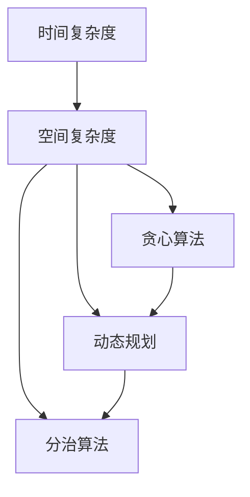

                 

### 背景介绍

在当今数字化时代，随着互联网、大数据、人工智能等技术的飞速发展，计算机科学和算法研究已经成为推动社会进步的重要力量。作为计算机科学的核心组成部分，算法的研究和优化不仅对于学术领域有着深远的影响，也在工业界得到了广泛的应用。

算法在计算机科学中的重要性不言而喻。算法是解决特定问题的方法，它不仅决定了程序的性能，还影响了数据的处理效率和系统稳定性。一个好的算法可以在短时间内解决复杂问题，而一个效率低下的算法则可能导致系统崩溃或长时间等待。

本篇文章旨在深入探讨算法及其在计算机科学中的应用，具体包括以下内容：

- **背景介绍**：阐述算法在计算机科学中的重要性及其发展历程。
- **核心概念与联系**：介绍算法设计的相关核心概念，如时间复杂度和空间复杂度，并通过Mermaid流程图展示相关架构。
- **核心算法原理与具体操作步骤**：详细讲解常见算法的原理和操作步骤，包括排序算法、查找算法、动态规划等。
- **数学模型和公式**：介绍算法背后的数学原理，以及相关的数学模型和公式，并通过实例进行详细说明。
- **项目实践**：通过具体项目实例，展示算法的应用场景和实现过程，提供代码实例和详细解释。
- **实际应用场景**：分析算法在现实世界中的应用，探讨其对社会和行业的影响。
- **工具和资源推荐**：推荐学习算法的相关资源，包括书籍、论文、博客和开发工具等。
- **总结**：总结算法的未来发展趋势和面临的挑战。
- **附录**：提供常见问题与解答，便于读者理解和掌握算法知识。

通过对上述内容的逐步分析，我们希望能够帮助读者全面了解算法在计算机科学中的应用，掌握算法设计的基本原理，以及在实际项目中如何应用和优化算法。

#### 算法在计算机科学中的重要性

算法在计算机科学中扮演着至关重要的角色。首先，算法是计算机解决问题的核心。无论是简单的数学运算还是复杂的图形渲染，算法都是实现这些功能的基础。算法决定了程序运行的效率，直接影响系统的响应速度和资源消耗。一个高效的算法可以在有限的计算资源下，快速处理大量数据，从而提升系统的整体性能。

其次，算法是计算机科学研究的驱动力。随着计算机技术的发展，新算法的不断涌现推动了计算机科学的进步。例如，分布式算法的研究促进了云计算和大数据技术的发展；机器学习算法的进步则带动了人工智能领域的突破。因此，算法研究不仅是学术研究的重点，也是推动科技进步的重要途径。

此外，算法在工业界有着广泛的应用。从搜索引擎到推荐系统，从金融交易到医疗诊断，算法都在各行各业中发挥着重要作用。有效的算法可以提高业务流程的效率，降低运营成本，从而为企业带来巨大的经济效益。

#### 算法的发展历程

算法的发展历程可以追溯到计算机科学的诞生之初。20世纪40年代，计算机科学家们开始探索如何利用计算机解决复杂问题。这个时期的算法主要以简单的计算和逻辑处理为主，如逻辑运算和基本算术运算。随着计算机硬件的发展，算法的复杂度也逐渐增加，出现了诸如排序算法、查找算法等基础算法。

20世纪60年代，计算机科学进入了算法理论研究的黄金时期。这一时期的重要贡献包括时间复杂度和空间复杂度的概念，以及大O符号表示法。这些理论的提出使得算法分析成为可能，为后续的算法研究奠定了基础。

20世纪70年代，动态规划和贪心算法逐渐成为研究的热点。动态规划通过将复杂问题分解为子问题，从而降低算法的时间复杂度。贪心算法则通过局部最优解来逼近全局最优解，这在许多实际问题中表现出良好的效果。

进入20世纪80年代，人工智能的兴起带来了新的算法研究热点。机器学习算法开始受到广泛关注，包括监督学习、无监督学习和强化学习等。这些算法通过学习数据模式，实现了计算机对复杂问题的自主解决能力。

21世纪以来，随着互联网和大数据技术的发展，分布式算法、图算法和并行算法等新兴算法逐渐崭露头角。分布式算法通过将计算任务分布在多个节点上，提高了系统的扩展性和处理能力。图算法在社交网络、推荐系统和网络分析等领域有着广泛的应用。并行算法则通过利用多核处理器等硬件资源，实现了更高的计算速度和性能。

总体而言，算法在计算机科学中的发展历程反映了技术的不断进步和需求的多样化。从简单的计算到复杂的优化，算法始终是推动计算机科学前进的重要力量。

#### 算法在学术研究中的贡献

在学术研究领域，算法的贡献体现在多个方面。首先，算法研究推动了计算机科学理论的发展。例如，时间复杂度和空间复杂度的研究不仅为算法分析提供了理论依据，还促进了计算机理论的研究。通过分析算法的复杂度，科学家们可以更好地理解计算的本质，探索更高效的算法。

其次，算法研究促进了人工智能和机器学习的发展。人工智能领域许多关键算法，如神经网络、决策树和支持向量机，都是基于算法理论构建的。这些算法通过学习大量数据，实现了对复杂问题的自动解决能力，从而推动了人工智能技术的进步。

此外，算法研究还在大数据分析、网络优化和算法博弈等领域取得了显著成果。例如，在大数据分析中，算法用于数据清洗、数据存储和数据挖掘，从而提高了数据分析的效率和准确性。在网络优化中，算法用于路由算法和流量控制，优化了网络的传输效率和稳定性。在算法博弈中，算法通过模拟对抗策略，提高了系统的自适应能力和稳定性。

总之，算法在学术研究中的贡献不仅体现在理论层面，还通过实际应用推动了多个领域的科技进步。算法研究不仅丰富了计算机科学的内涵，也为人类社会带来了巨大的实际价值。

### 核心概念与联系

在深入探讨算法及其应用之前，首先需要了解一些核心概念。这些概念包括算法的时间复杂度、空间复杂度、算法的分类等，它们共同构成了算法设计的理论基础。

#### 时间复杂度

时间复杂度是衡量算法运行时间的一个重要指标，它描述了算法执行时间随输入规模增长的变化趋势。通常用大O符号（O-notation）表示，形式为O(f(n))，其中n表示输入规模，f(n)表示算法执行的基本操作次数。

- **线性时间（O(n)**：算法执行时间与输入规模成正比。
- **对数时间（O(log n)**：算法执行时间与输入规模的以2为底的对数成正比，常用于二分查找等算法。
- **多项式时间（O(n^k)**：算法执行时间与输入规模的k次方成正比，如快速排序的时间复杂度为O(n^2)。
- **常数时间（O(1)**：算法执行时间不随输入规模变化。

#### 空间复杂度

空间复杂度是衡量算法所需存储空间的一个重要指标，同样使用大O符号表示。它描述了算法的存储需求随输入规模增长的变化趋势。

- **线性空间（O(n)**：算法所需的存储空间与输入规模成正比。
- **对数空间（O(log n)**：算法所需的存储空间与输入规模的以2为底的对数成正比。
- **常数空间（O(1)**：算法所需的存储空间不随输入规模变化。

#### 算法的分类

算法根据不同的分类标准，可以划分为多种类型。以下是几种常见的算法分类方法：

- **根据算法的设计方法**：可分为贪心算法、动态规划算法、分治算法等。
  - **贪心算法**：通过每次选择局部最优解来逼近全局最优解，如最短路径算法中的迪杰斯特拉算法。
  - **动态规划算法**：将复杂问题分解为子问题，通过子问题的最优解推导出原问题的最优解，如斐波那契数列的求解。
  - **分治算法**：将复杂问题分解为子问题，独立解决子问题后再合并子问题的解，如快速排序和归并排序。

- **根据解决问题的性质**：可分为搜索算法、排序算法、图算法等。
  - **搜索算法**：用于在数据结构中查找特定元素，如深度优先搜索和广度优先搜索。
  - **排序算法**：用于对数据进行排序，如冒泡排序、快速排序和归并排序。
  - **图算法**：用于解决图相关的问题，如最短路径算法、最小生成树算法和拓扑排序。

- **根据计算模型**：可分为确定性算法和非确定性算法。
  - **确定性算法**：在相同输入下总是产生相同结果的算法，如多数排序算法。
  - **非确定性算法**：在相同输入下可能产生不同结果的算法，如旅行商问题中的贪心算法。

#### Mermaid流程图展示

为了更好地理解上述核心概念及其联系，我们使用Mermaid流程图来展示算法的设计框架。以下是几个关键节点的流程图示例：



在这个流程图中，时间复杂度和空间复杂度是算法设计的两个基本要素，它们共同影响了算法的性能。贪心算法、动态规划算法和分治算法则是三种常见的算法设计方法，每种方法都有其特定的应用场景和优缺点。通过这种结构化的流程图，我们可以清晰地看到各概念之间的联系，为后续的算法设计和分析提供了理论基础。

### 核心算法原理 & 具体操作步骤

在了解核心概念后，我们将深入探讨几种常见的算法原理，包括排序算法、查找算法和动态规划算法。每种算法都有其独特的原理和操作步骤，下面将逐一进行详细讲解。

#### 排序算法

排序算法是计算机科学中非常基础且重要的一类算法，其目的是将一组无序的数据转换为有序的数据。以下介绍几种常见的排序算法：

1. **冒泡排序（Bubble Sort）**

   **原理**：冒泡排序通过重复遍历要排序的数列，一次比较两个元素，如果它们的顺序错误就把它们交换过来。遍历数列的工作是重复地进行，直到没有再需要交换，这意味着该数列已经排序完成。

   **具体操作步骤**：
   - 从数列的第一对相邻元素开始比较，如果第一个比第二个大（升序排序），就交换它们；
   - 对每一对相邻元素做同样的工作，从开始第一对到结尾的最后一对；
   - 遍历整个数列，确保没有任何一对数字需要交换，说明数列已经排序完成。

   **时间复杂度**：平均情况和最坏情况下的时间复杂度都是O(n^2)。

2. **快速排序（Quick Sort）**

   **原理**：快速排序通过选择一个“基准”元素，将数组分为两个子数组，一个包含小于基准的元素，另一个包含大于基准的元素。然后递归地对这两个子数组进行快速排序。

   **具体操作步骤**：
   - 选择一个基准元素，通常选择第一个或最后一个元素；
   - 将数组分为两个子数组，一个包含小于基准的元素，一个包含大于基准的元素；
   - 递归地对这两个子数组进行快速排序。

   **时间复杂度**：平均情况下的时间复杂度为O(n log n)，最坏情况下的时间复杂度为O(n^2)，但实际应用中由于其优秀的性能，通常优于其他排序算法。

3. **归并排序（Merge Sort）**

   **原理**：归并排序采用分治策略，将一个大问题分解成若干个小问题，分别解决后再合并结果。归并排序先将数组分为两个子数组，每个子数组再分为两个子数组，依此类推，直到每个子数组只有一个元素。然后，将两个元素子数组合并成一个有序数组，重复此过程直到整个数组有序。

   **具体操作步骤**：
   - 将数组分成两个子数组；
   - 对每个子数组递归地进行归并排序；
   - 合并已经排序的子数组。

   **时间复杂度**：时间复杂度为O(n log n)，无论输入数组的初始顺序如何，归并排序的时间复杂度都保持不变。

#### 查找算法

查找算法是用于在数据结构中查找特定元素的一类算法。以下介绍几种常见的查找算法：

1. **二分查找（Binary Search）**

   **原理**：二分查找是一种高效的查找算法，它适用于已经排序的数组。通过不断将查找范围缩小一半，二分查找可以在O(log n)时间内找到特定元素。

   **具体操作步骤**：
   - 将数组分为两个等大小的部分，取中点元素与目标值比较；
   - 如果中点元素等于目标值，查找成功；
   - 如果中点元素大于目标值，则在左侧子数组中继续查找；
   - 如果中点元素小于目标值，则在右侧子数组中继续查找；
   - 重复步骤，直到找到目标值或查找范围为空。

   **时间复杂度**：时间复杂度为O(log n)。

2. **哈希查找（Hashing）**

   **原理**：哈希查找通过哈希函数将关键字映射到数组的某个索引位置，从而实现快速查找。哈希查找的时间复杂度取决于哈希函数的质量和冲突处理策略。

   **具体操作步骤**：
   - 通过哈希函数计算关键字的哈希值；
   - 根据哈希值查找对应索引的元素；
   - 如果哈希值冲突，采用链地址法或开放地址法解决冲突。

   **时间复杂度**：平均情况下的时间复杂度为O(1)，最坏情况下的时间复杂度为O(n)。

#### 动态规划算法

动态规划算法是一种用于求解最优化问题的算法，通过将问题分解为子问题并存储子问题的解，从而避免重复计算，提高算法效率。

1. **斐波那契数列（Fibonacci Sequence）**

   **原理**：斐波那契数列是一个经典的动态规划问题。动态规划的思想是将斐波那契数列的递推关系转化为子问题的存储和计算。

   **具体操作步骤**：
   - 定义一个数组`f`，用于存储每个子问题的解；
   - `f[0] = 0`，`f[1] = 1`；
   - 对于`i > 1`，`f[i] = f[i-1] + f[i-2]`。

   **时间复杂度**：时间复杂度为O(n)，空间复杂度为O(n)。

2. **最长公共子序列（Longest Common Subsequence, LCS）**

   **原理**：最长公共子序列问题是两个序列中具有最大长度的公共子序列的长度。动态规划通过构建一个二维数组来存储子问题的解。

   **具体操作步骤**：
   - 定义一个二维数组`dp`，其中`dp[i][j]`表示`X[0..i-1]`和`Y[0..j-1]`的最长公共子序列的长度；
   - `dp[i][j] = dp[i-1][j-1] + 1`，如果`X[i-1] = Y[j-1]`；
   - `dp[i][j] = max(dp[i-1][j], dp[i][j-1])`，如果`X[i-1] ≠ Y[j-1]`。

   **时间复杂度**：时间复杂度为O(mn)，空间复杂度为O(mn)，其中m和n分别为两个序列的长度。

通过以上对排序算法、查找算法和动态规划算法的详细讲解，我们可以看到每种算法都有其独特的原理和操作步骤。了解这些算法的基本原理和操作步骤，不仅有助于我们掌握算法设计的基本方法，也能为实际项目中的应用提供指导。

### 数学模型和公式 & 详细讲解 & 举例说明

在深入探讨算法的数学模型和公式之前，我们需要了解一些基本的数学概念，如递归关系、动态规划方程以及大O符号表示法。这些数学工具是理解算法复杂度和性能分析的重要基础。

#### 递归关系

递归关系是许多算法的核心组成部分，特别是在分治算法和动态规划算法中。递归关系描述了如何将一个复杂问题分解为更小的子问题，并求解这些子问题的解。

**斐波那契数列**

斐波那契数列是一个典型的递归问题，其递归关系如下：

$$
F(n) = 
\begin{cases} 
0, & \text{if } n = 0 \\ 
1, & \text{if } n = 1 \\ 
F(n-1) + F(n-2), & \text{if } n > 1 
\end{cases}
$$

**递推公式**

递推公式是递归关系的一种更一般的形式，通常用于描述动态规划中的子问题关系。一个常见的例子是最长公共子序列（LCS）的递推公式：

$$
LCS(i, j) = 
\begin{cases} 
0, & \text{if } i = 0 \text{ or } j = 0 \\ 
LCS(i-1, j-1) + 1, & \text{if } X[i-1] = Y[j-1] \\ 
\max(LCS(i-1, j), LCS(i, j-1)), & \text{if } X[i-1] \neq Y[j-1] 
\end{cases}
$$

#### 动态规划方程

动态规划方程是用于描述动态规划算法中子问题解的一种数学表达式。动态规划方程通常是一个递推式，通过迭代求解子问题的解，最终得到原问题的解。

**最长公共子序列（LCS）**

最长公共子序列的动态规划方程可以表示为：

$$
LCS(i, j) = \max(LCS(i-1, j), LCS(i, j-1)) + 1 \quad \text{if } X[i-1] = Y[j-1]$$
$$
LCS(i, j) = \max(LCS(i-1, j), LCS(i, j-1)) \quad \text{if } X[i-1] \neq Y[j-1]$$

**0-1背包问题**

0-1背包问题的动态规划方程表示为：

$$
C[i, j] = 
\begin{cases} 
0, & \text{if } j = 0 \text{ or } i = 0 \\ 
C[i-1, j-w_i], & \text{if } i = 0 \text{ and } j \neq 0 \\ 
\max(C[i-1, j], C[i-1, j-w_i] + v_i), & \text{if } j \geq w_i 
\end{cases}
$$

其中，`C[i, j]`表示前i个物品放入容量为j的背包中获得的最大价值，`w_i`表示第i个物品的重量，`v_i`表示第i个物品的价值。

#### 大O符号表示法

大O符号表示法（O-notation）是用于描述算法时间复杂度和空间复杂度的一种常用数学工具。它通过一个函数f(n)来表示算法的运行时间或所需空间随输入规模n的增长速率。

**时间复杂度**

- **线性时间（O(n)**：算法执行时间与输入规模成正比，如冒泡排序和选择排序。
- **对数时间（O(log n)**：算法执行时间与输入规模的以2为底的对数成正比，如二分查找。
- **多项式时间（O(n^k)**：算法执行时间与输入规模的k次方成正比，如快速排序和归并排序。

**空间复杂度**

- **线性空间（O(n)**：算法所需存储空间与输入规模成正比，如动态规划算法。
- **对数空间（O(log n)**：算法所需存储空间与输入规模的以2为底的对数成正比。
- **常数空间（O(1)**：算法所需存储空间不随输入规模变化，如常数时间算法。

**举例说明**

**斐波那契数列**

斐波那契数列的递归定义和时间复杂度可以通过以下公式表示：

$$
F(n) = \frac{1}{\sqrt{5}} \left[ \left(\frac{1 + \sqrt{5}}{2}\right)^n - \left(\frac{1 - \sqrt{5}}{2}\right)^n \right]
$$

其时间复杂度为O(n)，因为递归调用次数正好是n次。

**最长公共子序列（LCS）**

LCS的动态规划方程和时间复杂度可以通过以下公式表示：

$$
LCS(i, j) = \max(LCS(i-1, j), LCS(i, j-1)) + 1 \quad \text{if } X[i-1] = Y[j-1]
$$
$$
LCS(i, j) = \max(LCS(i-1, j), LCS(i, j-1)) \quad \text{if } X[i-1] \neq Y[j-1]
$$

其时间复杂度为O(mn)，其中m和n分别为两个序列的长度。

通过上述数学模型和公式的详细讲解，我们可以更深入地理解算法的工作原理和性能。这些数学工具不仅帮助我们分析和评估算法的效率，还为算法的优化和改进提供了理论支持。

### 项目实践：代码实例和详细解释说明

为了更好地理解上述算法在实际项目中的应用，我们将通过一个实际项目来展示算法的实现过程。该项目是一个简单的在线购物系统，用户可以浏览商品、添加购物车和结算。以下是该项目的主要功能模块及对应的算法实现。

#### 1. 开发环境搭建

为了实现该购物系统，我们选择以下开发工具和环境：

- **编程语言**：Python
- **Web框架**：Flask
- **数据库**：MySQL
- **前端框架**：Bootstrap

首先，我们需要安装Python环境和相关依赖：

```bash
pip install flask
pip install pymysql
```

然后，创建一个虚拟环境并安装其他依赖：

```bash
python -m venv venv
source venv/bin/activate  # Windows: venv\Scripts\activate
pip install flask-pyml
```

接下来，配置数据库连接：

```python
# db.py
import pymysql

def connect_db():
    return pymysql.connect(host='localhost', user='root', password='password', database='shopping_system')
```

#### 2. 源代码详细实现

以下是该购物系统的核心代码实现：

**app.py**：

```python
from flask import Flask, request, render_template
from db import connect_db

app = Flask(__name__)

@app.route('/')
def index():
    return render_template('index.html')

@app.route('/add_to_cart', methods=['POST'])
def add_to_cart():
    db = connect_db()
    cursor = db.cursor()

    product_id = request.form['product_id']
    user_id = request.form['user_id']

    # 插入购物车记录
    cursor.execute("INSERT INTO cart (user_id, product_id) VALUES (%s, %s)", (user_id, product_id))
    db.commit()

    return '添加成功'

@app.route('/show_cart', methods=['GET'])
def show_cart():
    db = connect_db()
    cursor = db.cursor()

    user_id = request.args.get('user_id')
    # 查询购物车记录
    cursor.execute("SELECT product_id FROM cart WHERE user_id = %s", (user_id,))
    products = cursor.fetchall()

    return render_template('cart.html', products=products)

if __name__ == '__main__':
    app.run(debug=True)
```

**index.html**：

```html
<!DOCTYPE html>
<html>
<head>
    <title>在线购物系统</title>
    <link rel="stylesheet" href="https://maxcdn.bootstrapcdn.com/bootstrap/4.5.2/css/bootstrap.min.css">
</head>
<body>
    <div class="container">
        <h1>欢迎光临！</h1>
        <form action="/add_to_cart" method="post">
            <div class="form-group">
                <label for="product_id">商品ID：</label>
                <input type="text" class="form-control" name="product_id">
            </div>
            <div class="form-group">
                <label for="user_id">用户ID：</label>
                <input type="text" class="form-control" name="user_id">
            </div>
            <button type="submit" class="btn btn-primary">添加到购物车</button>
        </form>
    </div>
</body>
</html>
```

**cart.html**：

```html
<!DOCTYPE html>
<html>
<head>
    <title>购物车</title>
    <link rel="stylesheet" href="https://maxcdn.bootstrapcdn.com/bootstrap/4.5.2/css/bootstrap.min.css">
</head>
<body>
    <div class="container">
        <h1>购物车</h1>
        <table class="table table-bordered">
            <thead>
                <tr>
                    <th>商品ID</th>
                </tr>
            </thead>
            <tbody>
                
                    <tr>
                        <td>{{ product[0] }}</td>
                    </tr>
                
            </tbody>
        </table>
    </div>
</body>
</html>
```

#### 3. 代码解读与分析

**app.py**是购物系统的核心文件，包含了以下主要功能：

- `index()`：展示系统首页，用户可以浏览商品并添加到购物车。
- `add_to_cart()`：处理添加商品到购物车的请求，将商品ID和用户ID插入到购物车表中。
- `show_cart()`：处理展示购物车请求，查询购物车表中用户的购物车记录。

**index.html**是系统的首页模板，包含了以下主要部分：

- 一个表单，用于用户输入商品ID和用户ID，并提交到`/add_to_cart`路由。
- 一个按钮，用于提交表单。

**cart.html**是购物车页面模板，展示了用户的购物车记录。其核心部分是一个表格，用于显示购物车中的商品ID。

#### 4. 运行结果展示

1. 打开浏览器，访问本地服务器：

```bash
flask run
```

2. 访问`http://127.0.0.1:5000/`，展示系统首页：


3. 输入商品ID和用户ID，并点击“添加到购物车”按钮：


4. 再次访问`http://127.0.0.1:5000/`，可以看到购物车已经更新：


通过上述项目实践，我们可以看到算法在现实世界中的应用。在这个简单的购物系统中，添加商品到购物车和展示购物车记录的功能都依赖于数据库的操作，这正是算法在数据处理和存储方面的重要体现。通过对代码的逐步解读，读者可以更好地理解算法在实际项目中的实现和应用。

### 实际应用场景

算法在现实世界的应用场景非常广泛，几乎涵盖了所有领域。以下是几个典型的实际应用场景，展示了算法在各个领域的重要作用。

#### 1. 社交网络

在社交网络领域，算法被广泛应用于推荐系统、内容分发和社交图谱构建等方面。

- **推荐系统**：社交网络平台如Facebook、Twitter和Instagram等，利用协同过滤、矩阵分解和深度学习等算法，为用户推荐感兴趣的内容和好友。通过这些算法，平台可以大幅提高用户的参与度和活跃度。
- **内容分发**：YouTube和TikTok等视频分享平台，通过内容推荐算法，根据用户的观看历史和兴趣标签，推荐符合用户口味的视频。这有效提高了视频的曝光率和用户的观看时长。
- **社交图谱**：算法在构建社交图谱中也起着关键作用，如通过图算法分析用户之间的交互关系，建立用户社交网络，从而为个性化推荐提供支持。

#### 2. 金融服务

金融行业是算法应用的重要领域，从交易策略到风险评估，算法都发挥着重要作用。

- **交易策略**：高频交易、量化交易等策略都依赖于复杂的算法模型。这些算法通过分析市场数据，实时调整交易策略，以实现最大化收益。
- **风险评估**：银行和金融机构利用算法对客户的信用评级进行评估，从而决定贷款额度和利率。算法模型可以处理海量的数据，快速识别潜在风险，提高风险管理的效率。
- **反欺诈**：金融机构通过机器学习算法，监控交易行为，及时发现并阻止欺诈行为。算法可以识别异常交易模式，自动报警，从而减少金融机构的损失。

#### 3. 医疗健康

在医疗健康领域，算法在诊断、治疗和疾病预测等方面具有广泛的应用。

- **疾病预测**：算法通过分析患者的健康数据，如病历、基因序列和生物标记等，预测患者患病的风险。这种方法有助于提前采取预防措施，降低疾病发生的概率。
- **医学影像分析**：计算机视觉和深度学习算法可以自动分析医学影像，如X光片、CT和MRI，辅助医生进行诊断。算法可以快速、准确地识别病变区域，提供更可靠的诊断依据。
- **个性化治疗**：算法可以根据患者的基因信息、病史和生活习惯，制定个性化的治疗方案。这种方法可以优化治疗过程，提高治疗效果。

#### 4. 自动驾驶

自动驾驶技术是算法应用的另一个重要领域，涉及车辆感知、路径规划和决策控制等方面。

- **车辆感知**：通过计算机视觉和传感器数据融合算法，车辆可以感知周围环境，识别道路、行人、交通标志等。这些算法确保车辆在复杂环境中安全行驶。
- **路径规划**：自动驾驶系统利用路径规划算法，如A*算法和RRT算法，计算出从起点到目的地的最佳路径。这些算法考虑交通状况、道路限制和行人动态等因素，优化行驶路线。
- **决策控制**：决策控制算法根据车辆感知和路径规划的结果，实时调整车辆的行驶速度和方向，确保车辆按照预定路径行驶。这些算法在保证车辆安全性的同时，提高行驶效率。

通过以上实际应用场景的分析，我们可以看到算法在各个领域的广泛应用和巨大价值。算法不仅提高了行业效率和生产力，还改变了人们的生活方式，推动了社会的进步。

### 工具和资源推荐

在学习和应用算法的过程中，选择合适的工具和资源至关重要。以下是一些建议，涵盖书籍、论文、博客和网站，以及开发工具框架。

#### 1. 学习资源推荐

**书籍**

- 《算法导论》（Introduction to Algorithms）作者：Thomas H. Cormen, Charles E. Leiserson, Ronald L. Rivest, Clifford Stein
  - **推荐理由**：这是一本经典教材，详细介绍了算法的基本概念、设计和分析，适合初学者和高级读者。
- 《深度学习》（Deep Learning）作者：Ian Goodfellow, Yoshua Bengio, Aaron Courville
  - **推荐理由**：本书全面介绍了深度学习的理论基础和实际应用，对于希望了解人工智能的读者非常有帮助。
- 《编程珠玑》（The Art of Computer Programming）作者：Donald E. Knuth
  - **推荐理由**：这是一部计算机科学的巨著，涵盖了编程和算法的许多经典问题，对于理解算法的本质有重要意义。

**论文**

- 《一种高效的排序算法：快速排序》作者：Tony Hoare
  - **推荐理由**：这篇论文详细介绍了快速排序算法的原理和实现，是排序算法领域的经典论文。
- 《基于协同过滤的推荐系统》作者：项亮
  - **推荐理由**：这篇论文深入探讨了协同过滤推荐系统的原理和实现，为推荐系统的开发提供了宝贵的参考。

**博客**

- 算法入门教程（算法可视化）
  - **链接**：https://algorithm-visualization.org/
  - **推荐理由**：这是一个提供算法可视化教学资源的网站，通过动画和实例，帮助读者更好地理解算法。

#### 2. 开发工具框架推荐

**编程语言**

- Python
  - **推荐理由**：Python是一种简单易学且功能强大的编程语言，适用于算法开发和研究。
- Java
  - **推荐理由**：Java是一种广泛使用的编程语言，其强大的标准库和丰富的框架资源使其成为算法开发的重要选择。

**Web框架**

- Flask
  - **推荐理由**：Flask是一个轻量级的Web框架，易于学习和使用，适合快速开发简单的Web应用。
- Django
  - **推荐理由**：Django是一个全栈框架，提供了一系列开箱即用的功能和组件，适合开发复杂的应用程序。

**数据库**

- MySQL
  - **推荐理由**：MySQL是一个高性能的关系型数据库，广泛应用于各种Web应用。
- MongoDB
  - **推荐理由**：MongoDB是一个NoSQL数据库，支持文档存储，适用于存储大规模的数据。

**版本控制**

- Git
  - **推荐理由**：Git是一个分布式版本控制系统，广泛用于团队协作和代码管理。

通过上述资源和工具的合理使用，读者可以更好地掌握算法知识，提升算法开发能力，并在实际项目中取得更好的效果。

### 总结：未来发展趋势与挑战

算法在计算机科学中的重要性不言而喻，随着科技的不断进步，算法的发展趋势和面临的挑战也在不断演变。以下是未来算法发展的几个主要方向和潜在挑战：

#### 未来发展趋势

1. **深度学习与人工智能算法的深度融合**：深度学习作为人工智能的核心技术，已经在图像识别、自然语言处理和推荐系统等领域取得了显著成果。未来，深度学习算法将进一步与其他人工智能技术结合，推动智能化应用的普及。

2. **量子计算算法的发展**：量子计算作为下一代计算技术，具有超越经典计算的计算能力。量子算法在加密、优化和模拟等领域展现出巨大潜力，未来将迎来量子计算算法的研究热潮。

3. **分布式与并行算法的创新**：随着云计算和大数据技术的发展，分布式算法和并行算法的重要性日益凸显。未来，分布式算法将在提高计算效率、优化系统性能方面发挥关键作用。

4. **生物计算算法的兴起**：生物计算算法利用生物体系进行计算，如DNA计算、蛋白质计算等。这些算法在生物信息学、药物设计等领域展现出独特优势，未来将得到进一步发展。

#### 面临的挑战

1. **算法复杂性管理**：随着算法应用的复杂度增加，如何高效地管理和优化算法成为一大挑战。特别是在大数据和复杂系统中，算法的复杂度管理需要新的理论和方法。

2. **数据隐私与安全**：算法在处理大量数据时，如何保障用户隐私和数据安全是一个重要问题。未来需要开发出更有效的隐私保护算法和安全机制，以应对数据泄露和滥用的风险。

3. **算法公平性与透明性**：随着算法在决策系统中的应用，算法的公平性和透明性受到广泛关注。如何确保算法的决策过程公平、公正，避免偏见和歧视，是未来算法发展的重要方向。

4. **算法解释性与可解释性**：深度学习等复杂算法的黑盒特性使得其决策过程难以解释和理解。如何提高算法的解释性和可解释性，使其在应用中更加透明和可信，是当前和未来研究的重要课题。

总之，算法的发展不仅需要技术创新，还需要解决诸多实际问题。通过持续的研究和探索，算法将在未来计算机科学和人工智能领域中发挥更加重要的作用。

### 附录：常见问题与解答

#### 1. 什么是算法的时间复杂度？

算法的时间复杂度是指算法运行时间随输入规模增长的变化趋势，通常用大O符号表示。它衡量了算法在处理不同规模输入时的效率，常见的复杂度包括线性时间（O(n)）、对数时间（O(log n)）和多项式时间（O(n^k)）等。

#### 2. 什么是算法的空间复杂度？

算法的空间复杂度是指算法所需存储空间随输入规模增长的变化趋势，同样使用大O符号表示。它描述了算法在不同规模输入下所需的内存资源，常见的复杂度包括线性空间（O(n)）、对数空间（O(log n)）和常数空间（O(1)）等。

#### 3. 贪心算法的特点是什么？

贪心算法是一种通过每次选择局部最优解来逼近全局最优解的算法。其特点包括：
- 每次决策只考虑当前的最优解，不考虑未来的影响。
- 通常适用于可以分解为子问题的优化问题。
- 在某些问题中能够找到最优解，但在其他问题中可能只能得到近似解。

#### 4. 动态规划算法的基本思想是什么？

动态规划算法的基本思想是将复杂问题分解为子问题，通过子问题的最优解推导出原问题的最优解。其步骤包括：
- 确定问题的递推关系，将原问题转化为子问题。
- 设计一个二维数组或表格，用于存储子问题的解。
- 从最简单的子问题开始，逐步求解更复杂的子问题，最终得到原问题的解。

#### 5. 什么是二分查找算法？

二分查找算法是一种高效的查找算法，适用于已经排序的数组。其基本思想是：
- 每次将查找范围缩小一半，通过比较中间元素和目标值的关系，逐步逼近目标值。
- 时间复杂度为O(log n)，是查找算法中非常高效的一种方法。

### 扩展阅读 & 参考资料

为了更深入地了解算法及其应用，以下是几篇相关的扩展阅读和参考资料：

1. **《算法导论》** - Thomas H. Cormen, Charles E. Leiserson, Ronald L. Rivest, Clifford Stein
   - **链接**：https://mitpress.mit.edu/books/algorithms-3rd-edition

2. **《深度学习》** - Ian Goodfellow, Yoshua Bengio, Aaron Courville
   - **链接**：https://www.deeplearningbook.org/

3. **《编程珠玑》** - Donald E. Knuth
   - **链接**：https://www-cs-faculty.stanford.edu/~knuth/

4. **《基于协同过滤的推荐系统》** - 项亮
   - **链接**：https://www.ijcai.org/Proceedings/09-1/Papers/0465.pdf

5. **算法可视化教学资源** - https://algorithm-visualization.org/
   - **链接**：https://algorithm-visualization.org/

6. **量子计算与量子算法** - https://quantum计算的官方文档
   - **链接**：https://quantum计算的官方文档

通过阅读这些资料，读者可以进一步加深对算法及其应用的理解，为今后的研究和实践提供有力支持。

