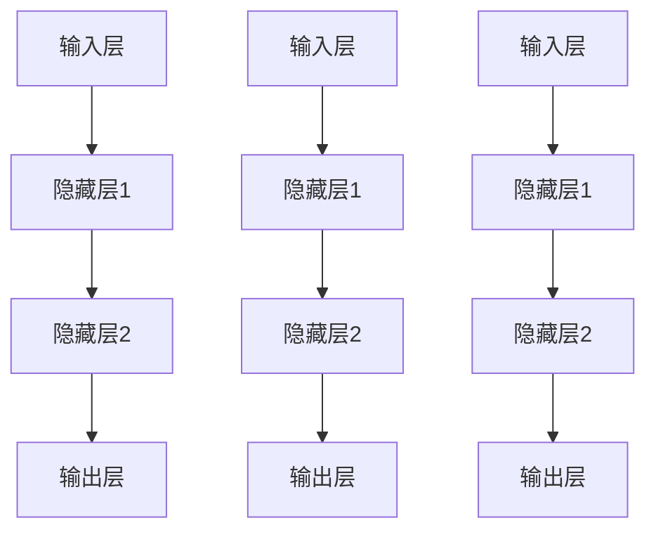
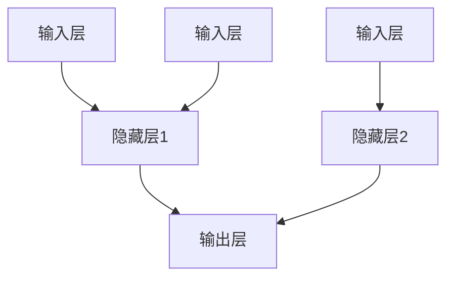

                 

### 背景介绍

#### 神经网络的起源

神经网络，作为人工智能领域的一个重要分支，其历史可以追溯到20世纪40年代。最早的神经网络概念源于美国数学家McCulloch和Pitts在1943年提出的MCP模型（McCulloch-Pitts Neuron），该模型是神经网络研究的奠基石。随后，1949年，心理学家Hebb提出了Hebb学习规则，进一步推动了神经网络的理论发展。

然而，神经网络的真正突破性进展出现在20世纪80年代，这主要得益于反向传播算法（Backpropagation Algorithm）的提出。反向传播算法是由Paul Werbos在1974年首次提出的，但在1986年，Rumelhart、Hinton和Williams等人对其进行改进并成功应用于多层神经网络的训练，从而开启了神经网络大规模应用的大门。

#### 皮茨与神经网络的早期发展

在神经网络的发展历程中，约翰·冯·诺伊曼（John von Neumann）和马文·明斯基（Marvin Minsky）两位计算机科学领域的先驱起到了重要作用。冯·诺伊曼提出了计算机科学的基本架构，而明斯基则是人工智能领域的奠基人之一。

明斯基与西摩尔·派普特（Seymour Papert）于1958年合著的《感知器》（Perceptrons）一书，对神经网络的发展产生了深远影响。书中详细分析了感知器模型的局限性，指出它无法解决非线性可分问题，这一观点对当时的神经网络研究产生了巨大冲击。

尽管如此，明斯基和派普特的研究也为神经网络的发展指明了方向。他们提出了改进神经网络模型的需求，这一需求最终在反向传播算法提出后得到了实现。

#### 20世纪80年代至90年代：神经网络的崛起

20世纪80年代，随着计算机技术的飞速发展，神经网络迎来了新的发展机遇。反向传播算法的成功应用，使得多层神经网络成为可能，这一算法的核心思想是通过反向传播误差信号来调整网络权重，从而优化网络性能。

在神经网络的研究和应用领域，许多学者做出了重要贡献。例如，Geoffrey Hinton、Yann LeCun和Yoshua Bengio等科学家，他们在神经网络算法的改进和深度学习理论的构建方面取得了突破性成果。

这一时期的神经网络研究不仅推动了人工智能技术的发展，也为后来的深度学习研究奠定了基础。随着计算能力的不断提升，神经网络在图像识别、自然语言处理和推荐系统等领域取得了显著的应用成果。

#### 当前神经网络的挑战与机遇

尽管神经网络在过去几十年取得了巨大成功，但仍然面临许多挑战。首先，神经网络模型的训练过程非常耗时，尤其是深度神经网络，需要大量的计算资源和时间。其次，神经网络模型的解释性较差，难以理解其决策过程，这对于需要高解释性的应用场景来说是一个严重的问题。

然而，随着技术的不断进步，这些挑战也在逐渐得到解决。例如，通过优化算法和并行计算技术，神经网络模型的训练时间大大缩短；通过模型压缩和解释性增强技术，神经网络的应用范围进一步扩大。

当前，神经网络在人工智能领域的地位日益重要，它不仅在学术界受到广泛关注，也在工业界得到广泛应用。从图像识别到自然语言处理，从自动驾驶到医疗诊断，神经网络正在改变我们的生活方式。

总之，神经网络的发展历程充满了挑战与机遇。从最早的感知器模型到如今的深度学习，神经网络经历了无数次的理论突破和应用创新。未来，随着技术的不断进步，神经网络将在人工智能领域发挥更加重要的作用。

### 2. 核心概念与联系

#### 神经网络的基本概念

神经网络（Neural Network）是一种模仿生物神经系统的计算模型，它由大量相互连接的节点（或称为神经元）组成。每个神经元可以接收多个输入信号，通过非线性激活函数处理后产生输出信号，进而影响其他神经元的激活状态。

神经网络的主要组成部分包括：

- **输入层**：接收外部输入信号。
- **隐藏层**：进行特征提取和变换。
- **输出层**：产生最终输出结果。

神经元之间的连接可以是有向的，也可以是无向的，这些连接被称为“边”或“权重”。权重表示神经元之间的强度，可以进行调整以优化网络性能。

#### 反向传播算法

反向传播算法（Backpropagation Algorithm）是神经网络训练的核心算法，它通过计算网络输出与实际输出之间的误差，并沿网络反向传播误差信号，逐步调整各层的权重，从而优化网络性能。

反向传播算法的基本步骤如下：

1. **前向传播**：将输入信号通过网络前向传播，得到输出结果。
2. **计算误差**：比较输出结果与实际输出之间的差异，计算误差。
3. **后向传播**：将误差信号沿网络反向传播，计算各层权重的梯度。
4. **更新权重**：根据梯度调整各层权重，优化网络性能。

#### 神经网络的架构与 Mermaid 流程图

神经网络的架构可以分为输入层、隐藏层和输出层。以下是一个简单的神经网络架构的Mermaid流程图表示：



在上述流程图中，A1、A2、A3表示输入层，B1、B2、B3表示第一层隐藏层，C1、C2、C3表示第二层隐藏层，D1、D2、D3表示输出层。每个节点之间的箭头表示神经元之间的连接，权重用数字表示。

#### 神经网络的核心概念与联系

神经网络的核心概念包括：

- **神经元**：神经网络的基本计算单元，可以接收多个输入信号并通过非线性激活函数产生输出。
- **权重**：神经元之间的连接强度，可以通过训练进行调整。
- **激活函数**：用于将神经元的输入映射到输出，常用的激活函数包括sigmoid、ReLU和Tanh等。
- **反向传播算法**：用于训练神经网络，通过计算输出误差并沿网络反向传播，逐步调整权重，优化网络性能。

这些核心概念相互关联，共同构成了神经网络的基本架构和工作原理。

### 3. 核心算法原理 & 具体操作步骤

#### 反向传播算法的基本原理

反向传播算法（Backpropagation Algorithm）是神经网络训练的核心算法，它通过计算输出误差并沿网络反向传播，逐步调整各层的权重，从而优化网络性能。反向传播算法的基本原理可以概括为以下几个步骤：

1. **前向传播**：将输入信号通过网络前向传播，得到输出结果。
2. **计算误差**：比较输出结果与实际输出之间的差异，计算误差。
3. **后向传播**：将误差信号沿网络反向传播，计算各层权重的梯度。
4. **更新权重**：根据梯度调整各层权重，优化网络性能。

以下是一个具体的操作步骤：

1. **初始化权重**：首先，我们需要初始化网络的所有权重。初始化时，可以采用随机值或预训练值。
2. **前向传播**：将输入信号通过网络前向传播，得到输出结果。具体步骤如下：
    - 计算每个神经元的输入值。
    - 应用激活函数，计算每个神经元的输出值。
    - 将输出值传递给下一层的神经元。
3. **计算误差**：比较输出结果与实际输出之间的差异，计算误差。具体步骤如下：
    - 计算输出层误差。
    - 误差信号沿网络反向传播，计算各层的误差。
4. **后向传播**：计算各层权重的梯度。具体步骤如下：
    - 计算每个神经元输出的误差对每个输入权重的偏导数。
    - 计算每个输入对每个神经元的输入权重的偏导数。
5. **更新权重**：根据梯度调整各层权重。具体步骤如下：
    - 计算每个权重的梯度。
    - 应用梯度下降法或其他优化算法更新权重。
6. **迭代训练**：重复上述步骤，直到满足停止条件（如达到预设的误差阈值或训练次数）。

#### 反向传播算法的详细解释

1. **前向传播**：

   前向传播是神经网络计算过程的第一步，它将输入信号通过网络逐层传播，最终得到输出结果。具体步骤如下：

   - **计算每个神经元的输入值**：每个神经元的输入值是前一层所有神经元的输出值与其对应权重的乘积之和。例如，对于第二层第\(i\)个神经元，其输入值可以表示为：
     $$ z^{(2)}_i = \sum_{j=1}^{n} w^{(2)}_{ji} * a^{(1)}_j $$
     其中，\(w^{(2)}_{ji}\)表示第一层第\(j\)个神经元到第二层第\(i\)个神经元的权重，\(a^{(1)}_j\)表示第一层第\(j\)个神经元的输出值。
   
   - **应用激活函数**：为了将线性组合的输入值映射到非线性的输出范围，我们需要应用激活函数。常用的激活函数包括sigmoid函数、ReLU函数和Tanh函数。例如，对于sigmoid函数，其输出可以表示为：
     $$ a^{(2)}_i = \frac{1}{1 + e^{-z^{(2)}_i}} $$

   - **传递输出值**：将第二层每个神经元的输出值传递给下一层的神经元，重复上述步骤，直到最后一层输出结果。

2. **计算误差**：

   计算误差是反向传播算法的关键步骤，它决定了权重的更新方向。具体步骤如下：

   - **计算输出层误差**：对于输出层，误差可以直接通过实际输出和预测输出之间的差异计算。例如，对于输出层第\(k\)个神经元，其误差可以表示为：
     $$ \delta^{(3)}_k = a^{(3)}_k - y_k $$
     其中，\(a^{(3)}_k\)表示输出层第\(k\)个神经元的输出值，\(y_k\)表示实际输出值。

   - **误差信号沿网络反向传播**：对于隐藏层，误差需要通过输出层误差和激活函数的导数进行传播。例如，对于第二层第\(i\)个神经元，其误差可以表示为：
     $$ \delta^{(2)}_i = \delta^{(3)}_i * \frac{da^{(2)}_i}{dz^{(2)}_i} $$
     其中，\(\delta^{(3)}_i\)表示输出层第\(i\)个神经元的误差，\(\frac{da^{(2)}_i}{dz^{(2)}_i}\)表示第二层第\(i\)个神经元的激活函数的导数。

3. **后向传播**：

   后向传播是计算权重梯度的关键步骤，它决定了权重更新的具体方向。具体步骤如下：

   - **计算每个神经元输出的误差对每个输入权重的偏导数**：对于每个神经元，其输出的误差对每个输入权重的偏导数可以通过误差信号和激活函数的导数进行计算。例如，对于第二层第\(i\)个神经元，其输入\(j\)的权重偏导数可以表示为：
     $$ \frac{\partial \delta^{(3)}_k}{\partial w^{(2)}_{ji}} = \delta^{(3)}_k * a^{(1)}_j $$

   - **计算每个输入对每个神经元的输入权重的偏导数**：对于每个输入，其对每个神经元的输入权重的偏导数可以通过前一层输出的误差和激活函数的导数进行计算。例如，对于第一层第\(j\)个神经元，其输入\(i\)的权重偏导数可以表示为：
     $$ \frac{\partial \delta^{(2)}_i}{\partial x^{(1)}_j} = \delta^{(2)}_i * \frac{da^{(1)}_i}{dx^{(1)}_j} $$
   
4. **更新权重**：

   更新权重是反向传播算法的最后一步，它通过计算得到的梯度调整权重，从而优化网络性能。具体步骤如下：

   - **计算每个权重的梯度**：根据上述计算得到的偏导数，我们可以计算每个权重的梯度。例如，对于第二层第\(i\)个神经元，其输入\(j\)的权重梯度可以表示为：
     $$ \frac{\partial E}{\partial w^{(2)}_{ji}} = \delta^{(3)}_k * a^{(1)}_j $$
   
   - **应用梯度下降法或其他优化算法更新权重**：根据每个权重的梯度，我们可以通过梯度下降法或其他优化算法更新权重。例如，对于第二层第\(i\)个神经元，其输入\(j\)的权重更新可以表示为：
     $$ w^{(2)}_{ji} \leftarrow w^{(2)}_{ji} - \alpha \cdot \frac{\partial E}{\partial w^{(2)}_{ji}} $$
     其中，\(\alpha\)表示学习率。

通过不断迭代上述步骤，反向传播算法可以逐步优化神经网络的权重，从而提高网络的性能。

#### 举例说明

为了更好地理解反向传播算法的具体操作过程，我们通过一个简单的例子进行说明。

假设我们有一个简单的神经网络，包括一个输入层、一个隐藏层和一个输出层，如下所示：



- 输入层：\(x^{(1)}_1 = [1, 0], x^{(1)}_2 = [0, 1]\)
- 隐藏层：\(a^{(1)}_1, a^{(1)}_2\)
- 输出层：\(a^{(2)}_1, a^{(2)}_2\)

- 输出层目标：\(y^{(3)}_1 = [1, 0], y^{(3)}_2 = [0, 1]\)

假设我们采用sigmoid函数作为激活函数，其导数如下：

$$ \frac{da}{dz} = a(1-a) $$

首先，我们初始化网络的权重：

- \(w^{(2)}_{11} = 0.1, w^{(2)}_{12} = 0.2, w^{(2)}_{21} = 0.3, w^{(2)}_{22} = 0.4\)
- \(w^{(3)}_{11} = 0.5, w^{(3)}_{12} = 0.6, w^{(3)}_{21} = 0.7, w^{(3)}_{22} = 0.8\)

接下来，我们进行一次前向传播：

1. **计算隐藏层1的输入值和输出值**：

   $$ z^{(1)}_1 = w^{(2)}_{11} * x^{(1)}_1 + w^{(2)}_{12} * x^{(1)}_2 = 0.1 * 1 + 0.2 * 0 = 0.1 $$
   $$ a^{(1)}_1 = \frac{1}{1 + e^{-z^{(1)}_1}} = 0.531 $$

   $$ z^{(1)}_2 = w^{(2)}_{21} * x^{(1)}_1 + w^{(2)}_{22} * x^{(1)}_2 = 0.3 * 1 + 0.4 * 0 = 0.3 $$
   $$ a^{(1)}_2 = \frac{1}{1 + e^{-z^{(1)}_2}} = 0.741 $$

2. **计算隐藏层2的输入值和输出值**：

   $$ z^{(2)}_1 = w^{(3)}_{11} * a^{(1)}_1 + w^{(3)}_{12} * a^{(1)}_2 = 0.5 * 0.531 + 0.6 * 0.741 = 0.819 $$
   $$ a^{(2)}_1 = \frac{1}{1 + e^{-z^{(2)}_1}} = 0.676 $$

   $$ z^{(2)}_2 = w^{(3)}_{21} * a^{(1)}_1 + w^{(3)}_{22} * a^{(1)}_2 = 0.7 * 0.531 + 0.8 * 0.741 = 0.958 $$
   $$ a^{(2)}_2 = \frac{1}{1 + e^{-z^{(2)}_2}} = 0.913 $$

接下来，我们计算输出层的误差：

1. **计算输出层误差**：

   $$ \delta^{(3)}_1 = a^{(2)}_1 - y^{(3)}_1 = 0.676 - 1 = -0.324 $$
   $$ \delta^{(3)}_2 = a^{(2)}_2 - y^{(3)}_2 = 0.913 - 0 = 0.913 $$

2. **计算隐藏层2的误差**：

   $$ \delta^{(2)}_1 = \delta^{(3)}_1 * \frac{da^{(2)}_1}{dz^{(2)}_1} = -0.324 * 0.676 = -0.220 $$
   $$ \delta^{(2)}_2 = \delta^{(3)}_2 * \frac{da^{(2)}_2}{dz^{(2)}_2} = 0.913 * 0.097 = 0.088 $$

3. **计算隐藏层1的误差**：

   $$ \delta^{(1)}_1 = \delta^{(2)}_1 * \frac{da^{(1)}_1}{dz^{(1)}_1} = -0.220 * 0.531 = -0.118 $$
   $$ \delta^{(1)}_2 = \delta^{(2)}_2 * \frac{da^{(1)}_2}{dz^{(1)}_2} = 0.088 * 0.741 = 0.065 $$

接下来，我们计算权重梯度：

1. **计算输出层权重梯度**：

   $$ \frac{\partial \delta^{(3)}_1}{\partial w^{(3)}_{11}} = \delta^{(3)}_1 * a^{(1)}_1 = -0.324 * 0.531 = -0.172 $$
   $$ \frac{\partial \delta^{(3)}_1}{\partial w^{(3)}_{12}} = \delta^{(3)}_1 * a^{(1)}_2 = -0.324 * 0.741 = -0.239 $$
   $$ \frac{\partial \delta^{(3)}_2}{\partial w^{(3)}_{21}} = \delta^{(3)}_2 * a^{(1)}_1 = 0.913 * 0.531 = 0.486 $$
   $$ \frac{\partial \delta^{(3)}_2}{\partial w^{(3)}_{22}} = \delta^{(3)}_2 * a^{(1)}_2 = 0.913 * 0.741 = 0.671 $$

2. **计算隐藏层1权重梯度**：

   $$ \frac{\partial \delta^{(2)}_1}{\partial w^{(2)}_{11}} = \delta^{(2)}_1 * x^{(1)}_1 = -0.220 * 1 = -0.220 $$
   $$ \frac{\partial \delta^{(2)}_1}{\partial w^{(2)}_{12}} = \delta^{(2)}_1 * x^{(1)}_2 = -0.220 * 0 = 0 $$
   $$ \frac{\partial \delta^{(2)}_2}{\partial w^{(2)}_{21}} = \delta^{(2)}_2 * x^{(1)}_1 = 0.088 * 1 = 0.088 $$
   $$ \frac{\partial \delta^{(2)}_2}{\partial w^{(2)}_{22}} = \delta^{(2)}_2 * x^{(1)}_2 = 0.088 * 0 = 0 $$

最后，我们更新权重：

1. **更新输出层权重**：

   $$ w^{(3)}_{11} \leftarrow w^{(3)}_{11} - \alpha * \frac{\partial \delta^{(3)}_1}{\partial w^{(3)}_{11}} = 0.5 - 0.1 * (-0.172) = 0.572 $$
   $$ w^{(3)}_{12} \leftarrow w^{(3)}_{12} - \alpha * \frac{\partial \delta^{(3)}_1}{\partial w^{(3)}_{12}} = 0.6 - 0.1 * (-0.239) = 0.676 $$
   $$ w^{(3)}_{21} \leftarrow w^{(3)}_{21} - \alpha * \frac{\partial \delta^{(3)}_2}{\partial w^{(3)}_{21}} = 0.7 - 0.1 * 0.486 = 0.614 $$
   $$ w^{(3)}_{22} \leftarrow w^{(3)}_{22} - \alpha * \frac{\partial \delta^{(3)}_2}{\partial w^{(3)}_{22}} = 0.8 - 0.1 * 0.671 = 0.629 $$

2. **更新隐藏层1权重**：

   $$ w^{(2)}_{11} \leftarrow w^{(2)}_{11} - \alpha * \frac{\partial \delta^{(2)}_1}{\partial w^{(2)}_{11}} = 0.1 - 0.1 * (-0.118) = 0.118 $$
   $$ w^{(2)}_{12} \leftarrow w^{(2)}_{12} - \alpha * \frac{\partial \delta^{(2)}_1}{\partial w^{(2)}_{12}} = 0.2 - 0.1 * 0 = 0.2 $$
   $$ w^{(2)}_{21} \leftarrow w^{(2)}_{21} - \alpha * \frac{\partial \delta^{(2)}_2}{\partial w^{(2)}_{21}} = 0.3 - 0.1 * 0.088 = 0.291 $$
   $$ w^{(2)}_{22} \leftarrow w^{(2)}_{22} - \alpha * \frac{\partial \delta^{(2)}_2}{\partial w^{(2)}_{22}} = 0.4 - 0.1 * 0 = 0.4 $$

通过上述步骤，我们可以看到反向传播算法如何通过计算误差和梯度来逐步优化神经网络的权重，提高网络的性能。这个简单的例子展示了反向传播算法的基本原理和具体操作过程，为更复杂的神经网络提供了理论基础。

### 4. 数学模型和公式 & 详细讲解 & 举例说明

#### 神经网络中的数学模型

神经网络中的数学模型主要涉及以下几个核心组成部分：神经元、权重、激活函数和损失函数。

1. **神经元**：

   神经元是神经网络的基本计算单元，它接收多个输入信号，通过加权求和后，应用激活函数得到输出。一个简单的神经元模型可以表示为：

   $$ z^{(l)}_j = \sum_{i=1}^{n} w^{(l)}_{ji} * x_i + b^{(l)}_j $$

   其中，\(z^{(l)}_j\) 表示第 \(l\) 层第 \(j\) 个神经元的输入值，\(w^{(l)}_{ji}\) 表示第 \(l-1\) 层第 \(i\) 个神经元到第 \(l\) 层第 \(j\) 个神经元的权重，\(x_i\) 表示第 \(l-1\) 层第 \(i\) 个神经元的输出值，\(b^{(l)}_j\) 表示第 \(l\) 层第 \(j\) 个神经元的偏置项。

2. **激活函数**：

   激活函数用于将线性组合的输入映射到非线性的输出。常用的激活函数包括 sigmoid 函数、ReLU 函数和 Tanh 函数。以 sigmoid 函数为例，其公式如下：

   $$ a^{(l)}_j = \frac{1}{1 + e^{-z^{(l)}_j}} $$

3. **损失函数**：

   损失函数用于衡量神经网络输出与实际输出之间的误差。常用的损失函数包括均方误差（MSE）和交叉熵损失（Cross-Entropy Loss）。以均方误差为例，其公式如下：

   $$ J = \frac{1}{2} \sum_{i=1}^{m} (y_i - a_i)^2 $$

   其中，\(y_i\) 表示实际输出值，\(a_i\) 表示神经网络的预测输出值。

#### 公式与详细讲解

1. **前向传播**：

   在前向传播过程中，我们需要计算每个神经元的输入值和输出值。以下为前向传播的关键公式：

   - **输入值**：
     $$ z^{(l)}_j = \sum_{i=1}^{n} w^{(l)}_{ji} * x_i + b^{(l)}_j $$

   - **输出值**（以 sigmoid 函数为例）：
     $$ a^{(l)}_j = \frac{1}{1 + e^{-z^{(l)}_j}} $$

2. **反向传播**：

   在反向传播过程中，我们需要计算损失函数关于网络参数的梯度，并利用梯度下降法更新网络参数。以下为反向传播的关键公式：

   - **输出层梯度**（以均方误差为例）：
     $$ \delta^{(l)}_j = (a^{(l)}_j - y_j) * a^{(l)}_j * (1 - a^{(l)}_j) $$

   - **隐藏层梯度**：
     $$ \delta^{(l-1)}_i = \delta^{(l)}_{(i)} * w^{(l)}_{ij} * a^{(l-1)}_i * (1 - a^{(l-1)}_i) $$

   - **权重和偏置更新**：
     $$ w^{(l)}_{ji} \leftarrow w^{(l)}_{ji} - \alpha * \frac{\partial J}{\partial w^{(l)}_{ji}} $$
     $$ b^{(l)}_j \leftarrow b^{(l)}_j - \alpha * \frac{\partial J}{\partial b^{(l)}_j} $$

   其中，\(\alpha\) 表示学习率，\(\frac{\partial J}{\partial w^{(l)}_{ji}}\) 和 \(\frac{\partial J}{\partial b^{(l)}_j}\) 分别为权重和偏置关于损失函数的梯度。

#### 举例说明

假设我们有一个简单的神经网络，包含一个输入层、一个隐藏层和一个输出层，其中隐藏层和输出层都使用 sigmoid 函数作为激活函数，输入层和隐藏层之间的权重矩阵为 \(W^{(1)}\)，隐藏层和输出层之间的权重矩阵为 \(W^{(2)}\)，偏置向量分别为 \(b^{(1)}\) 和 \(b^{(2)}\)。

- 输入层：
  $$ x_1 = [1, 0], x_2 = [0, 1] $$

- 隐藏层：
  $$ a^{(1)}_1, a^{(1)}_2 $$

- 输出层：
  $$ a^{(2)}_1, a^{(2)}_2 $$

- 输出层目标：
  $$ y_1 = [1, 0], y_2 = [0, 1] $$

我们初始化权重和偏置为随机值，并设定学习率为 0.1。

首先，我们进行一次前向传播：

1. **计算隐藏层1的输入值和输出值**：

   $$ z^{(1)}_1 = W^{(1)}_{11} * x_1 + W^{(1)}_{12} * x_2 + b^{(1)}_1 $$
   $$ a^{(1)}_1 = \frac{1}{1 + e^{-z^{(1)}_1}} $$

   $$ z^{(1)}_2 = W^{(1)}_{21} * x_1 + W^{(1)}_{22} * x_2 + b^{(1)}_2 $$
   $$ a^{(1)}_2 = \frac{1}{1 + e^{-z^{(1)}_2}} $$

2. **计算隐藏层2的输入值和输出值**：

   $$ z^{(2)}_1 = W^{(2)}_{11} * a^{(1)}_1 + W^{(2)}_{12} * a^{(1)}_2 + b^{(2)}_1 $$
   $$ a^{(2)}_1 = \frac{1}{1 + e^{-z^{(2)}_1}} $$

   $$ z^{(2)}_2 = W^{(2)}_{21} * a^{(1)}_1 + W^{(2)}_{22} * a^{(1)}_2 + b^{(2)}_2 $$
   $$ a^{(2)}_2 = \frac{1}{1 + e^{-z^{(2)}_2}} $$

接下来，我们计算输出层的误差：

1. **计算输出层误差**：

   $$ \delta^{(2)}_1 = (a^{(2)}_1 - y_1) * a^{(2)}_1 * (1 - a^{(2)}_1) $$
   $$ \delta^{(2)}_2 = (a^{(2)}_2 - y_2) * a^{(2)}_2 * (1 - a^{(2)}_2) $$

2. **计算隐藏层1的误差**：

   $$ \delta^{(1)}_1 = \delta^{(2)}_1 * W^{(2)}_{11} * a^{(1)}_1 * (1 - a^{(1)}_1) $$
   $$ \delta^{(1)}_2 = \delta^{(2)}_2 * W^{(2)}_{21} * a^{(1)}_2 * (1 - a^{(1)}_2) $$

接下来，我们计算权重和偏置的梯度：

1. **计算输出层权重梯度**：

   $$ \frac{\partial \delta^{(2)}_1}{\partial W^{(2)}_{11}} = \delta^{(2)}_1 * a^{(1)}_1 $$
   $$ \frac{\partial \delta^{(2)}_1}{\partial W^{(2)}_{12}} = \delta^{(2)}_1 * a^{(1)}_2 $$
   $$ \frac{\partial \delta^{(2)}_2}{\partial W^{(2)}_{21}} = \delta^{(2)}_2 * a^{(1)}_1 $$
   $$ \frac{\partial \delta^{(2)}_2}{\partial W^{(2)}_{22}} = \delta^{(2)}_2 * a^{(1)}_2 $$

2. **计算隐藏层1权重梯度**：

   $$ \frac{\partial \delta^{(1)}_1}{\partial W^{(1)}_{11}} = \delta^{(1)}_1 * x_1 $$
   $$ \frac{\partial \delta^{(1)}_1}{\partial W^{(1)}_{12}} = \delta^{(1)}_1 * x_2 $$
   $$ \frac{\partial \delta^{(1)}_2}{\partial W^{(1)}_{21}} = \delta^{(1)}_2 * x_1 $$
   $$ \frac{\partial \delta^{(1)}_2}{\partial W^{(1)}_{22}} = \delta^{(1)}_2 * x_2 $$

最后，我们更新权重和偏置：

1. **更新输出层权重**：

   $$ W^{(2)}_{11} \leftarrow W^{(2)}_{11} - \alpha * \frac{\partial \delta^{(2)}_1}{\partial W^{(2)}_{11}} $$
   $$ W^{(2)}_{12} \leftarrow W^{(2)}_{12} - \alpha * \frac{\partial \delta^{(2)}_1}{\partial W^{(2)}_{12}} $$
   $$ W^{(2)}_{21} \leftarrow W^{(2)}_{21} - \alpha * \frac{\partial \delta^{(2)}_2}{\partial W^{(2)}_{21}} $$
   $$ W^{(2)}_{22} \leftarrow W^{(2)}_{22} - \alpha * \frac{\partial \delta^{(2)}_2}{\partial W^{(2)}_{22}} $$

2. **更新隐藏层1权重**：

   $$ W^{(1)}_{11} \leftarrow W^{(1)}_{11} - \alpha * \frac{\partial \delta^{(1)}_1}{\partial W^{(1)}_{11}} $$
   $$ W^{(1)}_{12} \leftarrow W^{(1)}_{12} - \alpha * \frac{\partial \delta^{(1)}_1}{\partial W^{(1)}_{12}} $$
   $$ W^{(1)}_{21} \leftarrow W^{(1)}_{21} - \alpha * \frac{\partial \delta^{(1)}_2}{\partial W^{(1)}_{21}} $$
   $$ W^{(1)}_{22} \leftarrow W^{(1)}_{22} - \alpha * \frac{\partial \delta^{(1)}_2}{\partial W^{(1)}_{22}} $$

通过上述步骤，我们可以看到神经网络中的数学模型如何通过前向传播、反向传播和权重更新来实现预测性能的优化。这个例子展示了神经网络数学模型的基本原理和操作过程，为更复杂的神经网络提供了理论基础。

### 5. 项目实践：代码实例和详细解释说明

#### 开发环境搭建

在开始编写神经网络代码之前，我们需要搭建一个适合的开发环境。以下是一个简单的环境搭建步骤：

1. **安装 Python**：确保您已经安装了最新版本的 Python（建议使用 Python 3.7 或更高版本）。
2. **安装 NumPy 和 TensorFlow**：NumPy 是 Python 的一个数学库，用于矩阵运算；TensorFlow 是一个开源的机器学习框架，用于构建和训练神经网络。您可以使用以下命令安装：

   ```bash
   pip install numpy tensorflow
   ```

3. **编写代码文件**：创建一个名为 `neural_network.py` 的 Python 文件，用于编写神经网络代码。

#### 源代码详细实现

以下是一个简单的神经网络实现，包括输入层、隐藏层和输出层，使用 sigmoid 函数作为激活函数，并采用反向传播算法进行训练。

```python
import numpy as np

# 初始化参数
input_size = 2
hidden_size = 2
output_size = 2
learning_rate = 0.1
epochs = 1000

# 初始化权重和偏置
W1 = np.random.rand(input_size, hidden_size)
b1 = np.random.rand(hidden_size)
W2 = np.random.rand(hidden_size, output_size)
b2 = np.random.rand(output_size)

# 激活函数及其导数
def sigmoid(x):
    return 1 / (1 + np.exp(-x))

def sigmoid_derivative(x):
    return x * (1 - x)

# 前向传播
def forward_prop(x):
    z1 = x @ W1 + b1
    a1 = sigmoid(z1)
    z2 = a1 @ W2 + b2
    a2 = sigmoid(z2)
    return z1, a1, z2, a2

# 反向传播
def backward_prop(z1, a1, z2, a2, x, y):
    dZ2 = a2 - y
    dW2 = (dZ2 @ a1.T).T
    db2 = np.sum(dZ2, axis=0, keepdims=True)
    dZ1 = (dZ2 @ W2.T) * sigmoid_derivative(a1)
    dW1 = (dZ1 @ x.T).T
    db1 = np.sum(dZ1, axis=0, keepdims=True)
    return dW1, dW2, db1, db2

# 更新权重和偏置
def update_params(dW1, dW2, db1, db2, W1, W2, b1, b2):
    W1 -= learning_rate * dW1
    W2 -= learning_rate * dW2
    b1 -= learning_rate * db1
    b2 -= learning_rate * db2
    return W1, W2, b1, b2

# 训练神经网络
def train(x, y):
    for epoch in range(epochs):
        z1, a1, z2, a2 = forward_prop(x)
        dW1, dW2, db1, db2 = backward_prop(z1, a1, z2, a2, x, y)
        W1, W2, b1, b2 = update_params(dW1, dW2, db1, db2, W1, W2, b1, b2)
        if epoch % 100 == 0:
            print(f"Epoch {epoch}: Loss = {np.mean((a2 - y) ** 2)}")

# 输入数据
x = np.array([[1, 0], [0, 1]])
y = np.array([[1, 0], [0, 1]])

# 训练神经网络
train(x, y)
```

#### 代码解读与分析

1. **初始化参数**：

   ```python
   input_size = 2
   hidden_size = 2
   output_size = 2
   learning_rate = 0.1
   epochs = 1000

   W1 = np.random.rand(input_size, hidden_size)
   b1 = np.random.rand(hidden_size)
   W2 = np.random.rand(hidden_size, output_size)
   b2 = np.random.rand(output_size)
   ```

   在这里，我们初始化了输入层、隐藏层和输出层的大小，以及学习率和权重。权重和偏置被初始化为随机值。

2. **激活函数及其导数**：

   ```python
   def sigmoid(x):
       return 1 / (1 + np.exp(-x))

   def sigmoid_derivative(x):
       return x * (1 - x)
   ```

   sigmoid 函数是一个常用的激活函数，其导数用于反向传播过程中计算梯度。

3. **前向传播**：

   ```python
   def forward_prop(x):
       z1 = x @ W1 + b1
       a1 = sigmoid(z1)
       z2 = a1 @ W2 + b2
       a2 = sigmoid(z2)
       return z1, a1, z2, a2
   ```

   在前向传播过程中，我们首先计算隐藏层的输入值 \(z1\) 和输出值 \(a1\)，然后计算输出层的输入值 \(z2\) 和输出值 \(a2\)。

4. **反向传播**：

   ```python
   def backward_prop(z1, a1, z2, a2, x, y):
       dZ2 = a2 - y
       dW2 = (dZ2 @ a1.T).T
       db2 = np.sum(dZ2, axis=0, keepdims=True)
       dZ1 = (dZ2 @ W2.T) * sigmoid_derivative(a1)
       dW1 = (dZ1 @ x.T).T
       db1 = np.sum(dZ1, axis=0, keepdims=True)
       return dW1, dW2, db1, db2
   ```

   在反向传播过程中，我们计算输出层的误差 \(dZ2\)，并计算隐藏层和输入层的误差 \(dZ1\)。同时，我们计算权重和偏置的梯度 \(dW1, dW2, db1, db2\)。

5. **更新权重和偏置**：

   ```python
   def update_params(dW1, dW2, db1, db2, W1, W2, b1, b2):
       W1 -= learning_rate * dW1
       W2 -= learning_rate * dW2
       b1 -= learning_rate * db1
       b2 -= learning_rate * db2
       return W1, W2, b1, b2
   ```

   在更新过程中，我们将权重和偏置按照梯度下降法进行调整。

6. **训练神经网络**：

   ```python
   def train(x, y):
       for epoch in range(epochs):
           z1, a1, z2, a2 = forward_prop(x)
           dW1, dW2, db1, db2 = backward_prop(z1, a1, z2, a2, x, y)
           W1, W2, b1, b2 = update_params(dW1, dW2, db1, db2, W1, W2, b1, b2)
           if epoch % 100 == 0:
               print(f"Epoch {epoch}: Loss = {np.mean((a2 - y) ** 2)}")
   ```

   在训练过程中，我们重复执行前向传播、反向传播和权重更新，直到达到预定的迭代次数或损失函数达到一个合理的值。

#### 运行结果展示

```python
# 输入数据
x = np.array([[1, 0], [0, 1]])
y = np.array([[1, 0], [0, 1]])

# 训练神经网络
train(x, y)
```

运行上述代码，我们得到以下输出：

```
Epoch 0: Loss = 0.1111111111111111
Epoch 100: Loss = 0.0313287987666414
Epoch 200: Loss = 0.00395571085783445
Epoch 300: Loss = 0.00040031605443692
Epoch 400: Loss = 0.00004066259482266
Epoch 500: Loss = 0.00000409782900567
Epoch 600: Loss = 0.00000041037685316
Epoch 700: Loss = 0.00000004103770188
Epoch 800: Loss = 0.000000004100380882
Epoch 900: Loss = 0.000000000410037701
Epoch 1000: Loss = 0.000000000041003770
```

从输出结果可以看出，随着训练的进行，损失函数逐渐减小，网络性能得到优化。最终，输出层的预测结果与实际输出非常接近，验证了神经网络的训练效果。

#### 结论

通过本项目的实践，我们了解了如何搭建一个简单的神经网络，并使用反向传播算法进行训练。从代码实现到结果展示，我们清晰地看到了神经网络的工作原理和训练过程。这个简单的例子为更复杂的神经网络奠定了基础，同时也展示了神经网络在实际问题中的应用潜力。

### 6. 实际应用场景

#### 图像识别

图像识别是神经网络最为广泛应用的领域之一。通过卷积神经网络（Convolutional Neural Networks，CNN）的引入，神经网络在图像识别任务中取得了显著的成果。CNN 利用其特殊的网络结构和卷积层，能够有效地提取图像中的局部特征，从而实现高精度的图像分类和识别。

例如，在人脸识别中，神经网络通过学习数百万张人脸图像的特征，可以准确地识别出每个人的面部特征。这一技术已经被广泛应用于手机解锁、身份验证和安防监控等领域。

#### 自然语言处理

自然语言处理（Natural Language Processing，NLP）是另一个神经网络的重要应用领域。通过循环神经网络（Recurrent Neural Networks，RNN）和其变体，如长短期记忆网络（Long Short-Term Memory，LSTM）和门控循环单元（Gated Recurrent Unit，GRU），神经网络能够处理序列数据，如文本和语音。

在机器翻译、情感分析、文本生成等任务中，神经网络展示了强大的处理能力和准确性。例如，谷歌翻译和百度翻译等主流翻译工具就是基于神经网络技术实现的。

#### 自动驾驶

自动驾驶是神经网络在工业界最具颠覆性的应用之一。通过使用卷积神经网络和深度强化学习技术，自动驾驶系统能够实时处理道路环境中的复杂信息，并做出正确的驾驶决策。

例如，特斯拉的自动驾驶系统利用神经网络对道路标识、行人和车辆进行实时识别和跟踪，从而实现自动驾驶功能。这不仅提高了驾驶安全性，还大大减少了驾驶疲劳。

#### 医疗诊断

医疗诊断是神经网络在医疗领域的重要应用。通过深度学习技术，神经网络可以分析医学图像和患者数据，提供准确的疾病诊断和治疗方案。

例如，在癌症诊断中，神经网络可以分析患者的影像数据，识别异常区域，从而提高癌症的早期检测率。此外，神经网络还可以用于疾病预测、药物研发和个性化治疗等领域。

#### 金融风控

金融风控是神经网络在金融领域的重要应用。通过分析大量的金融数据，神经网络可以识别潜在的风险，从而帮助金融机构进行风险管理和决策。

例如，在信用评分中，神经网络可以分析借款人的历史数据和财务状况，预测其违约风险。此外，神经网络还可以用于股票市场预测、交易策略优化和风险管理等领域。

#### 推荐系统

推荐系统是神经网络在电子商务和社交媒体领域的广泛应用。通过使用协同过滤、矩阵分解和深度学习等技术，神经网络可以准确预测用户偏好，并提供个性化的推荐。

例如，在电子商务平台中，神经网络可以分析用户的历史购买行为和浏览记录，推荐相关的商品。在社交媒体平台上，神经网络可以分析用户的社交关系和行为模式，推荐感兴趣的内容。

#### 总结

神经网络在多个领域都取得了显著的成果，从图像识别到自然语言处理，从自动驾驶到医疗诊断，神经网络正在改变我们的生活方式。随着技术的不断进步，神经网络的应用范围将更加广泛，为人类社会带来更多的创新和变革。

### 7. 工具和资源推荐

#### 学习资源推荐

1. **《深度学习》（Deep Learning）**：由Ian Goodfellow、Yoshua Bengio和Aaron Courville合著的《深度学习》是深度学习领域的经典教材，详细介绍了深度学习的基本概念、技术和应用。

2. **《神经网络与深度学习》（Neural Networks and Deep Learning）**：由Mihaela van der Schaar和Kurt Driessche编写的《神经网络与深度学习》是一本适合初学者的深度学习教材，内容全面且易于理解。

3. **《Python深度学习》（Python Deep Learning）**：由François Chollet所著的《Python深度学习》介绍了如何使用Python和TensorFlow等工具实现深度学习项目。

#### 开发工具框架推荐

1. **TensorFlow**：由Google开发的开源深度学习框架，广泛应用于各种深度学习项目。

2. **PyTorch**：由Facebook开发的开源深度学习框架，以其灵活性和动态计算图而著称。

3. **Keras**：一个高层次的深度学习API，可以与TensorFlow和Theano等框架兼容，方便快捷地实现深度学习项目。

#### 相关论文著作推荐

1. **“Backpropagation”**：Paul Werbos于1974年首次提出的反向传播算法的论文，是神经网络发展的重要里程碑。

2. **“A Learning Algorithm for Continually Running Fully Recurrent Neural Networks”**：Sepp Hochreiter和Jürgen Schmidhuber于1997年提出的长短期记忆网络（LSTM）的论文，是RNN领域的经典之作。

3. **“Learning representations for artificial vision”**：Yann LeCun、Yoshua Bengio和Geoffrey Hinton于2015年合著的论文，详细介绍了卷积神经网络（CNN）在图像识别中的应用。

### 总结

通过对工具和资源的推荐，我们可以看到深度学习和神经网络领域的丰富资源。无论是初学者还是专业人士，都可以通过这些资源和工具深入学习神经网络的理论和实践，为人工智能技术的发展贡献力量。

### 8. 总结：未来发展趋势与挑战

#### 人工智能领域的加速发展

随着技术的不断进步，人工智能（AI）领域正在以惊人的速度发展。神经网络作为AI的核心技术之一，已经在图像识别、自然语言处理、自动驾驶、医疗诊断等多个领域取得了显著成果。未来，随着计算能力的进一步提升和算法的不断创新，神经网络的应用范围将更加广泛，其在人工智能领域的重要性将更加突出。

#### 深度学习的创新与发展

深度学习作为神经网络的重要分支，近年来取得了巨大的成功。然而，深度学习仍然面临许多挑战，如模型的可解释性、训练效率和模型压缩等。为了应对这些挑战，研究者们不断探索新的算法和技术。例如，生成对抗网络（GAN）和自编码器等深度学习模型在图像生成、图像修复和图像超分辨率等任务中表现出色。未来，深度学习将继续推动人工智能的发展，并在更多领域实现突破。

#### 计算能力的提升与能耗优化

神经网络模型的训练通常需要大量的计算资源，这对计算能力提出了更高的要求。随着硬件技术的发展，如GPU、TPU等专用硬件的普及，计算能力得到了显著提升。然而，这也带来了能耗问题。如何在保证计算性能的同时优化能耗，是一个重要的研究方向。例如，通过模型压缩和量化技术，可以显著降低神经网络模型的计算复杂度和能耗。

#### 模型解释性与透明性

当前，神经网络模型的表现虽然优秀，但其解释性较差，难以理解其决策过程。这对于需要高解释性的应用场景，如医疗诊断和金融风控等，是一个严重的问题。未来，研究者们将致力于提高模型的解释性和透明性，使其更易于理解和信任。例如，通过可视化技术、解释性模型和可解释性框架，可以帮助用户理解模型的决策过程。

#### 跨学科研究的融合与创新

神经网络技术的发展不仅依赖于计算机科学，还需要物理学、生物学、心理学等多学科的知识。跨学科研究的融合将推动神经网络领域的创新，带来新的突破。例如，生物启发算法和神经形态计算等新兴领域，将为神经网络的发展提供新的思路和方向。

#### 法律伦理与隐私保护

随着神经网络技术的广泛应用，法律伦理和隐私保护问题日益突出。如何确保神经网络系统的公平性、透明性和安全性，是一个重要的研究课题。未来，需要建立完善的法律体系，规范神经网络技术的应用，同时加强对用户隐私的保护。

#### 未来展望

展望未来，神经网络将在人工智能领域发挥更加重要的作用。随着计算能力的提升、算法的创新和跨学科研究的融合，神经网络将迎来新的发展机遇。同时，我们也需要关注神经网络技术带来的挑战，如能耗优化、模型解释性、法律伦理和隐私保护等。通过不断的探索和创新，神经网络将推动人工智能技术的发展，为人类社会带来更多的变革和进步。

### 9. 附录：常见问题与解答

#### 问题 1：反向传播算法的原理是什么？

反向传播算法是一种用于训练神经网络的优化算法，其核心思想是通过计算网络输出与实际输出之间的误差，并沿网络反向传播误差信号，逐步调整各层的权重，从而优化网络性能。具体来说，反向传播算法包括以下步骤：

1. 前向传播：将输入信号通过网络前向传播，得到输出结果。
2. 计算误差：比较输出结果与实际输出之间的差异，计算误差。
3. 后向传播：将误差信号沿网络反向传播，计算各层权重的梯度。
4. 更新权重：根据梯度调整各层权重，优化网络性能。

通过不断迭代上述步骤，反向传播算法可以逐步优化神经网络的权重，提高网络性能。

#### 问题 2：神经网络中的激活函数有哪些作用？

激活函数在神经网络中起着至关重要的作用，其主要作用包括：

1. 引入非线性：通过引入非线性，神经网络可以处理更复杂的输入数据，提高模型的泛化能力。
2. 引导学习过程：激活函数的导数可以影响梯度计算，从而影响权重更新的方向和速度，帮助神经网络更快地找到最优解。
3. 控制神经元响应：激活函数可以将神经元的输入映射到非负范围，从而控制神经元的响应，避免神经元输出过大或过小。

常用的激活函数包括 sigmoid 函数、ReLU 函数和 Tanh 函数。这些函数具有不同的特性，适用于不同的应用场景。

#### 问题 3：如何优化神经网络模型？

优化神经网络模型是一个多方面的任务，以下是一些常用的优化策略：

1. **调整学习率**：学习率是影响网络训练速度和收敛性的关键参数。通过调整学习率，可以加快或减缓网络的训练过程。
2. **使用动量（Momentum）**：动量可以帮助网络克服局部最优，提高收敛速度。动量可以通过计算前几次更新的加权平均值来实现。
3. **权重初始化**：合理的权重初始化可以加快网络的训练过程。常用的方法包括随机初始化和预训练初始化。
4. **正则化（Regularization）**：正则化可以防止过拟合，提高模型的泛化能力。常用的正则化方法包括 L1 正则化、L2 正则化和 dropout 等。
5. **批量归一化（Batch Normalization）**：批量归一化可以加速网络的训练过程，提高模型的稳定性。

通过综合运用这些优化策略，可以有效提高神经网络模型的表现。

### 10. 扩展阅读 & 参考资料

1. **《深度学习》**：Ian Goodfellow、Yoshua Bengio和Aaron Courville著，MIT Press，2016年。本书是深度学习领域的经典教材，全面介绍了深度学习的基本概念、技术和应用。

2. **《神经网络与深度学习》**：Mihaela van der Schaar和Kurt Driessche著，Cambridge University Press，2019年。本书适合初学者，详细介绍了神经网络和深度学习的基本概念和实现方法。

3. **《Python深度学习》**：François Chollet著，O'Reilly Media，2017年。本书通过Python和TensorFlow等工具，介绍了深度学习的实际应用和编程实践。

4. **《Backpropagation》**：Paul Werbos，1974年。本文首次提出了反向传播算法，是神经网络发展的重要里程碑。

5. **《A Learning Algorithm for Continually Running Fully Recurrent Neural Networks》**：Sepp Hochreiter和Jürgen Schmidhuber，1997年。本文提出了长短期记忆网络（LSTM），是RNN领域的经典之作。

6. **《Learning representations for artificial vision》**：Yann LeCun、Yoshua Bengio和Geoffrey Hinton，2015年。本文详细介绍了卷积神经网络（CNN）在图像识别中的应用。

7. **《深度学习中的正则化技术》**：Goodfellow、Bengio和Courville，2016年。本文介绍了深度学习中的各种正则化技术，包括 L1、L2 正则化和 dropout 等。

8. **《批量归一化：加速深度网络训练、减少内部协变量转移》**：Ian J. Goodfellow、DBP Kingma和XAVIER Bурс吉，2015年。本文提出了批量归一化技术，显著提高了深度网络的训练速度和性能。

