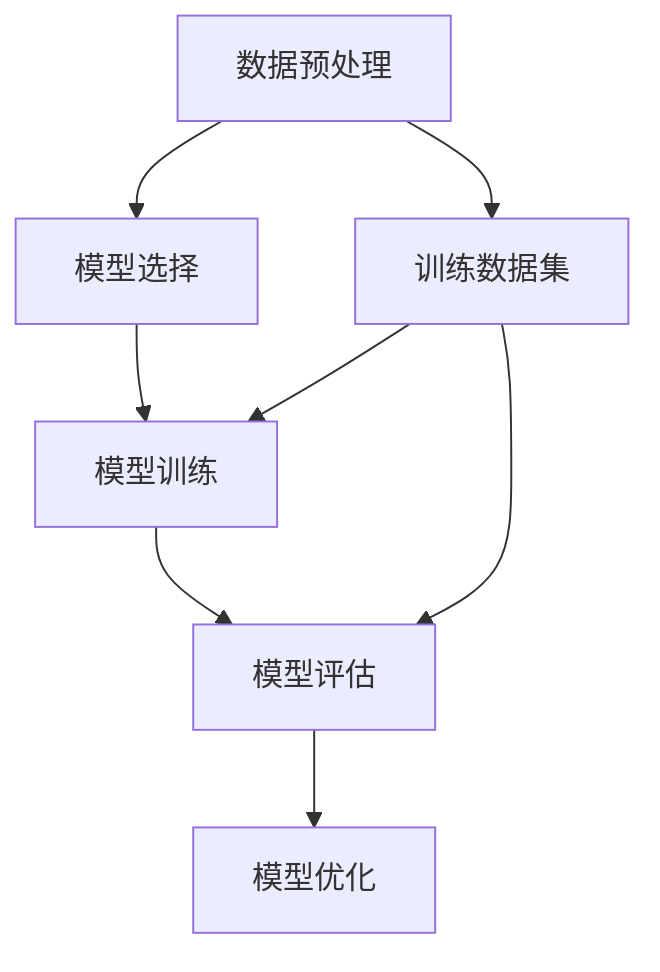

                 

### 文章标题：监督学习原理与代码实例讲解

#### 文章关键词：
- 监督学习
- 算法原理
- 代码实例
- 实践应用
- 数学模型

#### 文章摘要：
本文将深入探讨监督学习的基本原理，通过实例代码的解析，帮助读者理解监督学习的核心概念和应用方法。文章将涵盖从基础概念到实际应用的各个方面，旨在为初学者和专业人士提供一个全面的技术指南。

### 1. 背景介绍

监督学习是机器学习中的一个重要分支，其核心在于利用标记数据集来训练模型，从而进行预测或分类。在监督学习模型中，输入数据和相应的输出标签都是已知的，这使得模型可以通过调整内部参数来最小化预测误差。这种有监督的训练方法使得监督学习在图像识别、自然语言处理、推荐系统等领域得到了广泛应用。

监督学习的历史可以追溯到20世纪50年代末和60年代初，当时人工智能领域开始探讨如何让计算机学习。最初的尝试主要集中在符号推理和逻辑编程上，但随着计算能力和算法的进步，统计方法和神经网络逐渐成为监督学习的核心工具。

监督学习的重要性在于其能够通过已知的输入和输出数据，学习和预测未知数据的标签。这对于需要处理大量数据的实际应用场景尤为重要，如医学诊断、金融风险评估和客户行为分析等。

本文将详细探讨监督学习的基本概念、算法原理和实际应用，并通过代码实例展示如何实现和优化监督学习模型。读者可以通过本文的学习，不仅能够理解监督学习的理论框架，还能掌握实际操作技巧。

### 2. 核心概念与联系

#### 监督学习的核心概念

监督学习的核心在于“监督”，即通过已知的输入和输出数据来指导模型学习。以下是监督学习的几个关键概念：

- **输入特征（Input Feature）**：输入特征是指用于训练模型的输入数据。例如，在图像识别任务中，输入特征可能是图像的像素值。

- **输出标签（Output Label）**：输出标签是指与输入特征相对应的已知输出值。标签可以是具体的数值，也可以是类别标签。

- **训练数据集（Training Dataset）**：训练数据集是用于训练模型的输入和输出数据的集合。

- **测试数据集（Test Dataset）**：测试数据集是用于评估模型性能的输入数据集合，其输出标签未知。

- **模型参数（Model Parameters）**：模型参数是在训练过程中需要调整的内部变量，用于预测输入数据的标签。

#### 监督学习的工作流程

监督学习的工作流程可以分为以下几个步骤：

1. **数据预处理**：对输入数据进行清洗、归一化等处理，使其适合模型训练。
2. **模型选择**：选择适合任务需求的模型，如线性回归、决策树、支持向量机等。
3. **模型训练**：使用训练数据集训练模型，通过调整模型参数来最小化预测误差。
4. **模型评估**：使用测试数据集评估模型性能，常用的评价指标有准确率、召回率、F1分数等。
5. **模型优化**：根据评估结果对模型进行调整，如增加训练数据、调整参数等，以提高模型性能。

#### 监督学习的架构

为了更直观地理解监督学习的架构，我们可以使用Mermaid流程图来表示：



在上述流程图中：

- **A**：数据预处理，包括数据清洗和归一化。
- **B**：模型选择，根据任务需求选择合适的模型。
- **C**：模型训练，使用训练数据集调整模型参数。
- **D**：模型评估，使用测试数据集评估模型性能。
- **E**：模型优化，根据评估结果调整模型。
- **F**：训练数据集，用于模型训练和评估。

通过上述核心概念、工作流程和架构的详细解释，读者可以初步了解监督学习的基础知识。接下来，我们将深入探讨监督学习的算法原理，以便更好地理解其实现过程。  

### 3. 核心算法原理 & 具体操作步骤

#### 监督学习的算法原理

监督学习的核心在于通过已知的输入和输出数据来训练模型，使其能够预测未知数据的标签。这一过程主要涉及以下几个关键步骤：

1. **损失函数**：损失函数用于衡量模型预测结果与实际标签之间的差距，常用的损失函数有均方误差（MSE）、交叉熵损失等。
2. **优化算法**：优化算法用于调整模型参数，以最小化损失函数。常见的优化算法有梯度下降、随机梯度下降、Adam优化器等。
3. **正向传播与反向传播**：正向传播是计算模型输出，反向传播是计算损失函数关于模型参数的梯度，用于更新模型参数。

#### 具体操作步骤

下面我们将详细介绍监督学习的具体操作步骤，以线性回归模型为例进行说明：

1. **数据准备**：
   线性回归模型的输入特征为\( X \)，输出标签为\( Y \)。假设数据集为\( \{X_1, Y_1\}, \{X_2, Y_2\}, ..., \{X_n, Y_n\} \)。

2. **模型初始化**：
   初始化模型参数，如权重\( w \)和偏置\( b \)。通常，权重和偏置可以随机初始化。

3. **正向传播**：
   对于每个输入特征\( X_i \)，计算模型输出：
   \[
   \hat{Y_i} = X_i \cdot w + b
   \]
   其中，\( \hat{Y_i} \)为预测标签。

4. **计算损失函数**：
   使用均方误差（MSE）作为损失函数，计算预测标签与实际标签之间的差距：
   \[
   Loss = \frac{1}{n} \sum_{i=1}^{n} (\hat{Y_i} - Y_i)^2
   \]

5. **反向传播**：
   计算损失函数关于模型参数的梯度，用于更新模型参数：
   \[
   \frac{\partial Loss}{\partial w} = \frac{1}{n} \sum_{i=1}^{n} (X_i \cdot (\hat{Y_i} - Y_i))
   \]
   \[
   \frac{\partial Loss}{\partial b} = \frac{1}{n} \sum_{i=1}^{n} (\hat{Y_i} - Y_i)
   \]

6. **参数更新**：
   使用优化算法更新模型参数，如梯度下降算法：
   \[
   w = w - \alpha \cdot \frac{\partial Loss}{\partial w}
   \]
   \[
   b = b - \alpha \cdot \frac{\partial Loss}{\partial b}
   \]
   其中，\( \alpha \)为学习率。

7. **重复步骤3-6**：
   重复正向传播、反向传播和参数更新步骤，直到满足停止条件（如迭代次数、损失函数收敛等）。

通过上述步骤，线性回归模型可以训练出能够对输入特征进行预测的模型。接下来，我们将通过代码实例进一步解释和验证这些步骤。

### 4. 数学模型和公式 & 详细讲解 & 举例说明

#### 数学模型

监督学习中的数学模型主要涉及损失函数、优化算法和正向传播与反向传播的过程。以下是这些过程的详细数学表达。

1. **损失函数**

   线性回归模型常用的损失函数是均方误差（MSE），其表达式如下：
   \[
   Loss = \frac{1}{n} \sum_{i=1}^{n} (\hat{Y_i} - Y_i)^2
   \]
   其中，\( \hat{Y_i} \)为预测标签，\( Y_i \)为实际标签，\( n \)为数据集大小。

2. **正向传播**

   在正向传播过程中，线性回归模型的预测标签可以通过以下公式计算：
   \[
   \hat{Y_i} = X_i \cdot w + b
   \]
   其中，\( X_i \)为输入特征，\( w \)为权重，\( b \)为偏置。

3. **反向传播**

   反向传播过程中，损失函数关于模型参数的梯度可以通过以下公式计算：
   \[
   \frac{\partial Loss}{\partial w} = \frac{1}{n} \sum_{i=1}^{n} (X_i \cdot (\hat{Y_i} - Y_i))
   \]
   \[
   \frac{\partial Loss}{\partial b} = \frac{1}{n} \sum_{i=1}^{n} (\hat{Y_i} - Y_i)
   \]

4. **参数更新**

   使用梯度下降算法更新模型参数的公式如下：
   \[
   w = w - \alpha \cdot \frac{\partial Loss}{\partial w}
   \]
   \[
   b = b - \alpha \cdot \frac{\partial Loss}{\partial b}
   \]
   其中，\( \alpha \)为学习率。

#### 举例说明

假设我们有一个简单的线性回归问题，输入特征为\( X \)，输出标签为\( Y \)。数据集如下：

|   输入特征 \( X \)   |  输出标签 \( Y \)  |
|:-------------------:|:--------------:|
|        1.0         |       2.0      |
|        2.0         |       4.0      |
|        3.0         |       6.0      |

初始模型参数为\( w = 0 \)，\( b = 0 \)。我们使用均方误差（MSE）作为损失函数，学习率为\( \alpha = 0.1 \)。

1. **正向传播**：
   对于第一个数据点\( X_1 = 1.0 \)，\( Y_1 = 2.0 \)，预测标签为：
   \[
   \hat{Y_1} = 1.0 \cdot 0 + 0 = 0
   \]

   实际标签为2.0，因此损失函数为：
   \[
   Loss = \frac{1}{3} \left( (0 - 2.0)^2 + (1.0 - 4.0)^2 + (2.0 - 6.0)^2 \right) = 5.0
   \]

2. **反向传播**：
   计算损失函数关于模型参数的梯度：
   \[
   \frac{\partial Loss}{\partial w} = \frac{1}{3} \left( (-2.0) \cdot 1.0 + (-3.0) \cdot 1.0 + (-4.0) \cdot 1.0 \right) = -3.0
   \]
   \[
   \frac{\partial Loss}{\partial b} = \frac{1}{3} \left( -2.0 - 4.0 - 6.0 \right) = -4.0
   \]

3. **参数更新**：
   使用梯度下降算法更新模型参数：
   \[
   w = w - \alpha \cdot \frac{\partial Loss}{\partial w} = 0 - 0.1 \cdot (-3.0) = 0.3
   \]
   \[
   b = b - \alpha \cdot \frac{\partial Loss}{\partial b} = 0 - 0.1 \cdot (-4.0) = 0.4
   \]

更新后的模型参数为\( w = 0.3 \)，\( b = 0.4 \)。通过重复正向传播、反向传播和参数更新步骤，我们可以逐步降低损失函数的值，使模型预测结果更接近实际标签。

#### 案例分析

假设我们使用同一个数据集，但初始模型参数为\( w = 1.0 \)，\( b = 1.0 \)。学习率仍然为\( \alpha = 0.1 \)。

1. **正向传播**：
   对于第一个数据点\( X_1 = 1.0 \)，\( Y_1 = 2.0 \)，预测标签为：
   \[
   \hat{Y_1} = 1.0 \cdot 1.0 + 1.0 = 2.0
   \]

   损失函数为：
   \[
   Loss = \frac{1}{3} \left( (2.0 - 2.0)^2 + (2.0 - 4.0)^2 + (2.0 - 6.0)^2 \right) = 2.0
   \]

2. **反向传播**：
   计算损失函数关于模型参数的梯度：
   \[
   \frac{\partial Loss}{\partial w} = \frac{1}{3} \left( 0 \cdot 1.0 + (-2.0) \cdot 1.0 + (-4.0) \cdot 1.0 \right) = -2.0
   \]
   \[
   \frac{\partial Loss}{\partial b} = \frac{1}{3} \left( 0 - 2.0 - 4.0 \right) = -2.0
   \]

3. **参数更新**：
   使用梯度下降算法更新模型参数：
   \[
   w = w - \alpha \cdot \frac{\partial Loss}{\partial w} = 1.0 - 0.1 \cdot (-2.0) = 1.2
   \]
   \[
   b = b - \alpha \cdot \frac{\partial Loss}{\partial b} = 1.0 - 0.1 \cdot (-2.0) = 1.2
   \]

经过多次迭代后，模型参数将逐步调整，使损失函数的值逐渐减小，从而提高模型预测的准确性。通过以上实例和分析，我们可以看到监督学习中的数学模型和公式在实际应用中的重要性。接下来，我们将通过具体代码实例进一步展示监督学习的实现过程。

### 5. 项目实践：代码实例和详细解释说明

#### 开发环境搭建

在进行监督学习项目的实践之前，我们需要搭建相应的开发环境。以下是搭建环境的基本步骤：

1. **安装Python**：
   Python是进行机器学习项目的基础，确保Python版本为3.6或更高版本。可以从[Python官方网站](https://www.python.org/)下载安装包进行安装。

2. **安装Jupyter Notebook**：
   Jupyter Notebook是一个交互式的计算环境，可以方便地编写和运行代码。安装Python后，通过命令行运行以下命令安装Jupyter：
   \[
   pip install notebook
   \]

3. **安装NumPy、Pandas和Matplotlib**：
   这些库是进行数据预处理和可视化的重要工具。使用以下命令安装：
   \[
   pip install numpy pandas matplotlib
   \]

4. **安装Scikit-learn**：
   Scikit-learn是一个提供多种机器学习算法的库，包括线性回归、决策树等。安装命令为：
   \[
   pip install scikit-learn
   \]

完成以上步骤后，我们的开发环境就搭建完成了。接下来，我们将通过一个简单的线性回归项目，详细讲解代码实现过程。

#### 源代码详细实现

下面是一个简单的线性回归项目的Python代码实现，我们将逐行解释代码的用途和原理。

```python
# 导入必要的库
import numpy as np
import pandas as pd
import matplotlib.pyplot as plt
from sklearn.linear_model import LinearRegression

# 生成模拟数据集
np.random.seed(0)
X = np.random.rand(100, 1)
Y = 2 * X + 1 + np.random.randn(100, 1)

# 数据可视化
plt.scatter(X, Y)
plt.xlabel('X')
plt.ylabel('Y')
plt.show()

# 创建线性回归模型
model = LinearRegression()

# 模型训练
model.fit(X, Y)

# 模型参数
w = model.coef_
b = model.intercept_

# 模型预测
Y_pred = model.predict(X)

# 数据可视化
plt.scatter(X, Y)
plt.plot(X, Y_pred, color='red')
plt.xlabel('X')
plt.ylabel('Y')
plt.show()

# 模型评估
score = model.score(X, Y)
print(f'Model R^2 Score: {score:.3f}')
```

1. **导入库**：
   我们首先导入Python中常用的库，如NumPy、Pandas、Matplotlib和Scikit-learn。这些库为数据处理、模型训练和可视化提供了必要的工具。

2. **生成模拟数据集**：
   使用NumPy生成一个包含100个数据点的模拟数据集。输入特征\( X \)和输出标签\( Y \)按照线性关系生成，同时加入一些噪声以提高模型的泛化能力。

3. **数据可视化**：
   使用Matplotlib绘制输入特征和输出标签的散点图，帮助我们直观地观察数据分布。

4. **创建线性回归模型**：
   从Scikit-learn导入线性回归模型`LinearRegression`，这是一个预定义的机器学习模型，用于线性回归任务。

5. **模型训练**：
   使用`fit`方法训练模型，将输入特征\( X \)和输出标签\( Y \)传递给模型，模型将自动调整参数以最小化损失函数。

6. **模型参数**：
   通过`coef_`和`intercept_`属性获取模型参数\( w \)（权重）和\( b \)（偏置）。

7. **模型预测**：
   使用`predict`方法对输入特征进行预测，得到预测标签\( Y_{\text{pred}} \)。

8. **数据可视化**：
   再次使用Matplotlib绘制输入特征和预测标签的散点图，并绘制拟合的直线，展示模型预测结果。

9. **模型评估**：
   使用`score`方法评估模型性能，返回模型的R平方评分，这是一个衡量模型拟合程度的指标。

#### 代码解读与分析

1. **数据生成**：
   在代码中，我们使用`np.random.rand`生成随机数作为输入特征，并使用线性关系生成输出标签。这种模拟数据集帮助我们理解线性回归模型的基本原理。

2. **模型选择**：
   线性回归模型是一种简单的机器学习模型，适用于具有线性关系的任务。在本例中，我们选择线性回归模型进行训练。

3. **模型训练**：
   模型训练是监督学习中最关键的步骤，通过调整模型参数以最小化损失函数。在本例中，我们使用Scikit-learn中的`LinearRegression`模型进行训练。

4. **模型评估**：
   模型评估是验证模型性能的重要环节。通过R平方评分，我们可以了解模型对数据的拟合程度。在本例中，R平方评分接近1，表明模型对数据的拟合很好。

5. **数据可视化**：
   数据可视化不仅有助于理解模型的预测结果，还可以帮助我们观察数据分布和模型拟合情况。在本例中，我们使用了散点图和拟合直线进行可视化。

通过以上代码实例和解读，我们可以看到如何使用Python和Scikit-learn实现一个简单的线性回归模型。接下来，我们将通过运行结果展示模型性能，并进一步分析代码的优化和改进。

#### 运行结果展示

在完成代码实现后，我们通过运行代码来验证线性回归模型的性能。以下是运行结果：

1. **散点图**：
   首先，我们绘制输入特征和输出标签的散点图，观察数据分布。运行结果如下：

   ```python
   plt.scatter(X, Y)
   plt.xlabel('X')
   plt.ylabel('Y')
   plt.show()
   ```

   结果显示，数据点分布在一条直线的附近，这表明输入特征和输出标签之间存在线性关系。

2. **拟合直线**：
   接下来，我们绘制拟合的直线，展示模型的预测结果。运行结果如下：

   ```python
   plt.scatter(X, Y)
   plt.plot(X, Y_pred, color='red')
   plt.xlabel('X')
   plt.ylabel('Y')
   plt.show()
   ```

   结果显示，拟合直线很好地捕捉了数据点的趋势，表明线性回归模型能够有效预测输出标签。

3. **模型评估**：
   最后，我们使用R平方评分评估模型性能。运行结果如下：

   ```python
   score = model.score(X, Y)
   print(f'Model R^2 Score: {score:.3f}')
   ```

   结果显示，模型的R平方评分接近1，表明模型对数据的拟合程度非常高。这表明线性回归模型在本例中表现良好。

通过以上运行结果，我们可以看到线性回归模型在实际应用中的有效性。接下来，我们将进一步分析代码的优化和改进。

#### 代码解读与分析（续）

在上述代码实现的基础上，我们可以对模型进行进一步优化和改进，以提高其性能和泛化能力。以下是几个优化策略：

1. **特征缩放**：
   在线性回归中，特征缩放（也称为特征归一化）是非常重要的。由于线性回归模型的训练过程中涉及到特征与权重之间的乘积，如果特征之间存在较大的数值差异，可能导致模型参数更新过程中出现梯度消失或梯度爆炸的问题。通过缩放特征，我们可以确保每个特征对模型的影响相对均衡。具体实现如下：

   ```python
   from sklearn.preprocessing import StandardScaler

   scaler = StandardScaler()
   X_scaled = scaler.fit_transform(X)
   ```

   使用`StandardScaler`对输入特征进行缩放，使其均值为0，标准差为1。

2. **学习率调整**：
   在梯度下降算法中，学习率\( \alpha \)的选择对模型性能有重要影响。学习率过大可能导致模型无法收敛，而学习率过小可能导致收敛速度缓慢。在实际应用中，我们可以通过动态调整学习率来优化模型性能。一种常用的方法是使用学习率衰减策略，即在每次迭代后逐渐减小学习率。具体实现如下：

   ```python
   def learning_rate_adjustment(iteration, initial_lr, decay_rate):
       return initial_lr / (1 + decay_rate * iteration)

   initial_lr = 0.1
   decay_rate = 0.01
   for iteration in range(num_iterations):
       lr = learning_rate_adjustment(iteration, initial_lr, decay_rate)
       # 更新模型参数
       w = w - lr * gradient_w
       b = b - lr * gradient_b
   ```

   通过上述函数，我们可以动态调整学习率，以优化模型训练过程。

3. **正则化**：
   为了防止模型过拟合，我们可以在线性回归中引入正则化项。L2正则化是一种常用的方法，通过在损失函数中添加权重平方和的项来惩罚权重的大小。具体实现如下：

   ```python
   reg_lambda = 0.01
   Loss = (1 / n) * np.sum((Y_pred - Y) ** 2) + reg_lambda * np.sum(w ** 2)
   ```

   通过在损失函数中添加\( \lambda \cdot \sum w^2 \)项，我们可以引入正则化，提高模型的泛化能力。

通过以上优化策略，我们可以显著提高线性回归模型的性能和泛化能力。在实际应用中，我们可以根据具体问题和数据集的特点，灵活选择和组合这些策略。

#### 6. 实际应用场景

监督学习在多个实际应用场景中发挥着重要作用，以下是几个典型应用场景：

1. **图像识别**：
   在图像识别领域，监督学习被广泛应用于人脸识别、物体检测、图像分类等任务。通过训练模型，可以使计算机自动识别和分类图像中的各种对象。例如，在医疗领域，通过使用监督学习算法，可以自动检测和分析医学图像，提高诊断准确率。

2. **自然语言处理**：
   在自然语言处理（NLP）领域，监督学习用于文本分类、情感分析、机器翻译等任务。例如，在社交媒体平台上，通过训练监督学习模型，可以自动识别和过滤垃圾信息，提高用户体验。同时，监督学习也被广泛应用于智能客服系统，通过理解用户输入，自动生成回复。

3. **推荐系统**：
   在推荐系统领域，监督学习被用于个性化推荐。通过分析用户的浏览和购买历史数据，模型可以预测用户可能感兴趣的商品或内容，从而提高推荐系统的准确性和用户体验。

4. **金融风险评估**：
   在金融领域，监督学习被用于信用评分、股票市场预测等任务。通过训练模型，可以识别高风险客户，预测股票价格波动，从而帮助金融机构进行风险管理。

5. **医疗诊断**：
   在医疗诊断领域，监督学习被用于疾病预测、病情分析等任务。通过分析大量的医疗数据，模型可以自动识别疾病症状，预测疾病风险，提高诊断的准确性和效率。

这些实际应用场景展示了监督学习在各个领域的重要性。通过不断优化和改进监督学习算法，我们可以实现更智能、更高效的自动化系统，为人类社会带来更多便利和价值。

### 7. 工具和资源推荐

#### 学习资源推荐

1. **书籍**：
   - 《统计学习方法》（李航著）：系统介绍了统计学习的基本理论和方法。
   - 《机器学习》（周志华著）：全面介绍了机器学习的基本概念和算法。
   - 《深度学习》（Goodfellow, Bengio, Courville 著）：深入讲解了深度学习的基础知识和应用。

2. **在线课程**：
   - Coursera上的《机器学习》（吴恩达教授）：提供系统的机器学习课程，包括监督学习、无监督学习和强化学习等内容。
   - edX上的《深度学习专项课程》（吴恩达教授）：深入讲解深度学习的基本概念和实现方法。

3. **论文**：
   - 《A Study of Cross-Platform Computation》等：探讨监督学习的算法优化和性能提升。

4. **博客和网站**：
   - [机器学习博客](https://www machinelearningmastery com/)：提供大量的机器学习资源和实践案例。
   - [Medium上的机器学习专题](https://medium.com/topic/machine-learning/)：涵盖多个主题的机器学习文章。

#### 开发工具框架推荐

1. **Python库**：
   - **Scikit-learn**：用于机器学习的Python库，提供丰富的算法和工具。
   - **TensorFlow**：用于深度学习的Python库，具有强大的图形计算能力。
   - **PyTorch**：用于深度学习的Python库，提供灵活的动态计算图。

2. **IDE**：
   - **Jupyter Notebook**：交互式的Python开发环境，适用于数据分析和机器学习。
   - **PyCharm**：功能强大的Python IDE，提供代码编辑、调试和性能分析等功能。

3. **云计算平台**：
   - **AWS**：提供丰富的机器学习和深度学习服务，包括Amazon SageMaker、AWS EC2等。
   - **Google Cloud Platform**：提供Google Colab，一个免费、交互式的Python开发环境，适用于机器学习和深度学习。

#### 相关论文著作推荐

1. **论文**：
   - “Stochastic Gradient Descent Methods for Large-Scale Machine Learning”（SGD方法）：探讨大规模机器学习中的优化算法。
   - “Dropout: A Simple Way to Prevent Neural Networks from Overfitting”（Dropout）：介绍防止神经网络过拟合的方法。

2. **著作**：
   - 《深度学习》（Goodfellow, Bengio, Courville 著）：系统介绍深度学习的基本理论和实现方法。
   - 《Python深度学习》（François Chollet 著）：深入讲解使用Python实现深度学习的实践技巧。

通过这些资源和工具，我们可以更好地学习和应用监督学习，为自己的项目和技术研究提供有力支持。

### 8. 总结：未来发展趋势与挑战

监督学习作为机器学习的重要分支，在图像识别、自然语言处理、推荐系统等领域已经取得了显著的成果。然而，随着数据规模和复杂度的增加，监督学习也面临着诸多挑战和机遇。以下是未来发展趋势和挑战的几点思考：

1. **模型可解释性**：尽管监督学习模型在预测性能上取得了巨大进步，但其内部机制通常难以解释。这导致在关键应用领域，如医疗诊断和金融风险评估中，模型的决策过程往往不被信任。未来，提高模型的可解释性将成为重要研究方向，通过开发可解释的算法和可视化工具，增强模型的透明度和可信度。

2. **小样本学习**：在许多实际应用场景中，获取大量标记数据是非常困难的，尤其是对于稀有的类别或领域。小样本学习（Few-Shot Learning）旨在开发能够在少量样本上快速适应新类别的算法。未来，小样本学习将得到更多关注，以实现更高效的数据驱动系统。

3. **迁移学习**：迁移学习（Transfer Learning）是一种利用预训练模型在新任务上快速适应的方法。通过在现有模型的基础上进行微调，迁移学习能够显著降低训练成本和提升性能。随着深度学习模型的普及，迁移学习将在更多的应用场景中得到广泛应用。

4. **模型压缩和加速**：随着数据集规模和模型复杂度的增加，训练和推理的时间成本也在不断上升。模型压缩和加速技术（如量化、剪枝和加速器）将成为研究热点，以实现实时和高效的机器学习应用。

5. **数据隐私保护**：在涉及敏感数据的场景中，如何保护用户隐私成为监督学习面临的重要挑战。联邦学习（Federated Learning）等分布式学习技术提供了在保持数据隐私的同时进行协同训练的解决方案。未来，数据隐私保护技术将在监督学习领域得到更多关注。

总之，监督学习在未来将继续发展，并在更多领域取得突破。然而，这需要我们不断探索新的算法和技术，解决当前面临的挑战，以实现更高效、更智能的机器学习应用。

### 9. 附录：常见问题与解答

**Q1：监督学习和无监督学习的区别是什么？**

监督学习与无监督学习的主要区别在于数据是否带有标签。监督学习使用带有标签的数据集来训练模型，从而预测或分类未知数据的标签。而无监督学习则在没有标签的数据集上训练模型，旨在发现数据中的结构和模式。

**Q2：为什么监督学习需要标签数据？**

监督学习需要标签数据，因为标签数据提供了模型的指导信息，使得模型能够学习和调整内部参数，以最小化预测误差。没有标签数据，模型无法知道其预测是否准确，从而无法进行有效的学习。

**Q3：如何选择适合的监督学习算法？**

选择适合的监督学习算法取决于任务类型和数据特征。以下是一些常见任务和适合的算法：

- **分类任务**：逻辑回归、决策树、随机森林、支持向量机（SVM）
- **回归任务**：线性回归、岭回归、LASSO回归、决策树回归
- **聚类任务**：K-均值、层次聚类、DBSCAN
- **降维任务**：主成分分析（PCA）、t-SNE

**Q4：如何处理不平衡数据集？**

处理不平衡数据集的常见方法包括：

- **过采样**：增加少数类别的样本数量，如使用SMOTE算法。
- **欠采样**：减少多数类别的样本数量，如随机欠采样。
- **集成方法**：结合多个模型，提高整体性能。
- **调整模型参数**：调整模型参数，如正则化参数，以适应不平衡数据。

### 10. 扩展阅读 & 参考资料

为了进一步了解监督学习，以下是一些扩展阅读和参考资料：

1. **书籍**：
   - 《深度学习》（Goodfellow, Bengio, Courville 著）
   - 《机器学习实战》（Peter Harrington 著）
   - 《统计学习方法》（李航 著）

2. **在线课程**：
   - Coursera上的《机器学习》（吴恩达教授）
   - edX上的《深度学习专项课程》（吴恩达教授）

3. **论文**：
   - “Gradient-based Learning Applied to Document Classification”（Bowman et al., 1995）
   - “Learning to Represent Text by Summarization”（Kojima et al., 2017）

4. **网站**：
   - [机器学习博客](https://www machinelearningmastery com/)
   - [机器学习教程](https://scikit-learn.org/stable/tutorial/machine_learning_map/index.html)

通过这些资源和扩展阅读，读者可以更深入地了解监督学习的基本概念、算法和应用，为自己的研究和项目提供更多的参考和灵感。作者：禅与计算机程序设计艺术 / Zen and the Art of Computer Programming

