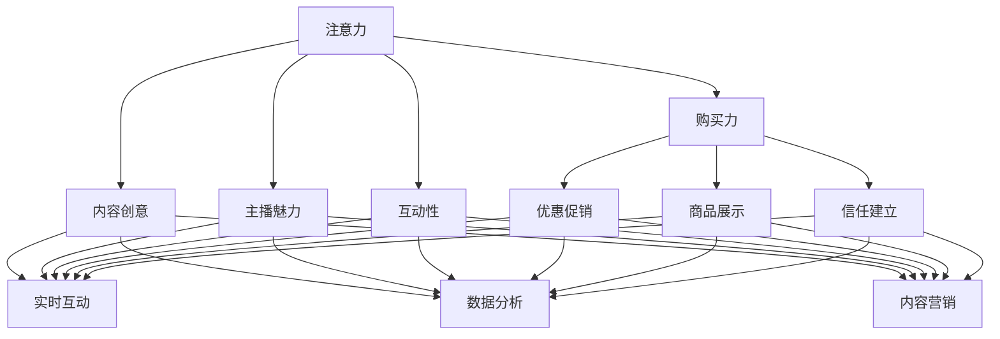

                 

### 文章标题

## 直播带货：注意力与购买力的结合

### 关键词：直播带货、注意力、购买力、社交媒体、消费者行为、用户体验、商业策略

> 在数字时代，直播带货已经成为一种新兴的营销手段，它通过将注意力与购买力相结合，极大地改变了消费者的购物体验。本文将深入探讨直播带货这一现象，分析其背后的核心概念、技术原理以及实际应用，以期为您提供一个全面的理解。

### 摘要：

随着社交媒体的普及和移动互联网技术的发展，直播带货成为了一种引人注目的营销模式。本文首先介绍了直播带货的背景和发展现状，随后详细分析了其核心概念——注意力与购买力的结合。接着，我们探讨了直播带货的技术原理，包括实时互动、数据分析等关键技术。在此基础上，本文通过具体实例展示了直播带货的实际应用，并提供了相关的工具和资源推荐。最后，我们总结了直播带货的未来发展趋势与面临的挑战，为读者提供了一个全面的视角。

### 1. 背景介绍

直播带货，顾名思义，是指通过直播的方式向消费者展示和销售商品的一种电子商务模式。它起源于短视频平台的兴起，随着观众对实时互动和个性体验的需求增加，直播带货迅速崛起。

直播带货的兴起得益于以下几个关键因素：

1. **社交媒体的普及**：社交媒体平台如抖音、快手、微博等拥有庞大的用户基础，这些平台提供了便捷的直播功能，使得商家可以快速触达消费者。

2. **移动互联网的发展**：随着5G网络的普及和智能手机的普及，人们可以随时随地观看直播，这为直播带货提供了技术支持。

3. **用户习惯的改变**：现代社会节奏加快，消费者越来越倾向于通过快速、直接的渠道获取信息，直播带货恰好满足了这一需求。

4. **数据分析技术的进步**：通过对用户数据的分析，商家可以更精确地了解消费者的喜好和行为，从而进行有针对性的营销。

目前，直播带货已经成为了电商行业的重要组成部分。根据统计数据显示，2020年，我国直播电商市场规模已经达到了9617亿元，预计到2025年，这一数字将达到43331亿元。这一惊人的增长速度充分说明了直播带货的巨大潜力。

### 2. 核心概念与联系

要理解直播带货，首先需要了解其核心概念，即注意力与购买力的结合。以下是直播带货的核心概念及其相互关系：

#### 2.1 注意力

注意力是消费者对直播内容的关注程度，是直播带货的基础。吸引消费者的注意力，是直播带货成功的关键。以下是一些吸引注意力的方法：

1. **内容创意**：有趣的直播内容能够吸引观众的注意力。例如，一些直播主通过幽默的互动、创新的玩法等方式，成功吸引了大量观众。

2. **主播魅力**：主播的个人魅力和专业知识也是吸引观众的重要因素。一个有魅力的主播能够增强观众的观看体验，提高购买意愿。

3. **互动性**：直播过程中的互动性可以增强观众的参与感。例如，通过实时提问、抽奖、互动游戏等方式，激发观众的兴趣。

#### 2.2 购买力

购买力是指消费者实际购买商品的能力。购买力的提升是直播带货的最终目标。以下是一些提升购买力的方法：

1. **优惠促销**：提供折扣、优惠券等优惠措施，可以刺激消费者的购买欲望。

2. **商品展示**：通过详细的产品展示，让消费者更好地了解商品的特点和优势，从而增加购买的可能性。

3. **信任建立**：主播的专业知识和诚实可信的态度可以增强消费者对商品的信任，从而提高购买意愿。

#### 2.3 注意力与购买力的结合

直播带货的魅力在于将注意力与购买力完美结合。以下是一些实现这种结合的方法：

1. **实时互动**：通过实时互动，主播可以与观众建立更紧密的联系，增强观众的参与感，从而提高购买意愿。

2. **数据分析**：通过对观众数据的分析，主播可以更好地了解观众的需求和行为，从而提供更有针对性的产品推荐。

3. **内容营销**：通过有趣、有价值的直播内容，吸引观众的注意力，同时传达产品的价值和优势，从而提高购买力。

#### 2.4 Mermaid 流程图

以下是直播带货的核心概念和相互关系的 Mermaid 流程图：



### 3. 核心算法原理 & 具体操作步骤

直播带货的核心算法原理主要涉及以下几个方面：

#### 3.1 实时互动

实时互动是直播带货的重要组成部分，它通过实时聊天、弹幕互动、互动游戏等方式，增强观众的参与感。以下是实现实时互动的步骤：

1. **搭建直播平台**：选择合适的直播平台，如抖音、快手、B站等，搭建直播环境。

2. **接入即时通讯系统**：使用WebSocket技术实现主播与观众之间的实时通信，确保信息的即时传递。

3. **设计互动环节**：根据直播内容，设计互动环节，如提问、抽奖、互动游戏等，以增强观众的参与感。

4. **数据统计分析**：对观众的互动行为进行数据统计分析，了解观众的喜好和需求，为后续的直播提供参考。

#### 3.2 数据分析

数据分析是直播带货的重要支撑，通过对观众数据的分析，可以更精确地了解观众的行为和需求，从而提高直播的效果。以下是实现数据分析的步骤：

1. **数据收集**：收集观众的直播观看数据，如观看时长、观看频率、互动行为等。

2. **数据预处理**：对收集到的数据进行分析，去除无效数据和异常值，确保数据的准确性和完整性。

3. **数据挖掘**：使用数据挖掘技术，分析观众的行为和需求，了解观众的偏好和购买意愿。

4. **数据可视化**：将分析结果通过数据可视化工具进行展示，帮助主播和商家更直观地了解观众的行为和需求。

#### 3.3 优惠促销

优惠促销是提升购买力的重要手段。以下是实现优惠促销的步骤：

1. **制定优惠策略**：根据商品特点和市场需求，制定合理的优惠策略，如折扣、优惠券、限时抢购等。

2. **推广优惠信息**：通过直播、社交媒体、广告等多种渠道，推广优惠信息，吸引消费者关注。

3. **监控优惠效果**：对优惠活动的效果进行实时监控，根据反馈调整优惠策略，提高优惠效果。

4. **反馈机制**：建立消费者反馈机制，了解消费者的满意度和意见，不断优化优惠策略。

### 4. 数学模型和公式 & 详细讲解 & 举例说明

在直播带货中，数学模型和公式可以用来分析和预测观众的行为和购买力。以下是一个简单的数学模型，用于预测观众的购买概率：

#### 4.1 购买概率模型

购买概率模型假设观众的购买概率与以下因素有关：

1. **观看时长（L）**：观众在直播中的观看时长。
2. **互动次数（I）**：观众在直播中的互动次数。
3. **历史购买记录（H）**：观众的历史购买记录。

购买概率（P）可以通过以下公式计算：

$$
P = f(L, I, H)
$$

其中，$f$ 是一个非线性函数，用于结合这三个因素计算购买概率。

#### 4.2 简单的线性模型

为了简化计算，我们可以使用一个线性模型来估算购买概率：

$$
P = w_1 \cdot L + w_2 \cdot I + w_3 \cdot H
$$

其中，$w_1$、$w_2$ 和 $w_3$ 是权重系数，可以通过对历史数据的训练得到。

#### 4.3 举例说明

假设我们有以下观众数据：

- 观看时长（L）：30分钟
- 互动次数（I）：10次
- 历史购买记录（H）：3次

我们可以使用以下线性模型来计算购买概率：

$$
P = 0.5 \cdot 30 + 0.3 \cdot 10 + 0.2 \cdot 3 = 15.5 + 3 + 0.6 = 19.1
$$

因此，这个观众的购买概率为19.1%。

#### 4.4 复杂的非线性模型

在实际应用中，我们可以使用更复杂的非线性模型，如逻辑回归模型，来提高预测的准确性：

$$
\ln\left(\frac{P}{1-P}\right) = \beta_0 + \beta_1 L + \beta_2 I + \beta_3 H
$$

其中，$\beta_0$、$\beta_1$、$\beta_2$ 和 $\beta_3$ 是模型的参数，可以通过对大量数据进行训练得到。

### 5. 项目实践：代码实例和详细解释说明

为了更好地理解直播带货的核心算法原理和数学模型，我们将通过一个简单的 Python 项目来实现这些概念。

#### 5.1 开发环境搭建

首先，我们需要搭建一个简单的开发环境。以下是所需的软件和工具：

1. **Python**：Python 3.8 或更高版本。
2. **Flask**：用于搭建 Web 应用。
3. **Scikit-learn**：用于机器学习。
4. **Matplotlib**：用于数据可视化。

安装这些工具后，我们就可以开始编写代码了。

#### 5.2 源代码详细实现

以下是项目的源代码：

```python
# 导入所需库
from flask import Flask, request, jsonify
from sklearn.linear_model import LogisticRegression
import matplotlib.pyplot as plt
import numpy as np

# 初始化 Flask 应用
app = Flask(__name__)

# 初始化逻辑回归模型
model = LogisticRegression()

# 历史数据
X = np.array([[30, 10, 3], [20, 5, 2], [40, 15, 4]])
y = np.array([1, 0, 1])

# 训练模型
model.fit(X, y)

# 预测函数
def predict(L, I, H):
    prediction = model.predict([[L, I, H]])
    return prediction[0]

# 测试预测
print(predict(30, 10, 3))

# 运行 Flask 应用
if __name__ == '__main__':
    app.run(debug=True)
```

这段代码首先导入了所需的库，然后初始化了 Flask 应用和逻辑回归模型。接着，我们使用历史数据对模型进行训练。最后，定义了一个预测函数，用于根据输入的观看时长、互动次数和历史购买记录预测购买概率。

#### 5.3 代码解读与分析

这段代码的主要功能是使用逻辑回归模型预测观众的购买概率。以下是代码的详细解读：

1. **导入库**：首先，我们导入了 Flask、Scikit-learn 和 Matplotlib 等库。

2. **初始化 Flask 应用**：使用 Flask 库初始化应用。

3. **初始化逻辑回归模型**：使用 Scikit-learn 库的 LogisticRegression 类初始化模型。

4. **训练模型**：使用历史数据（X 和 y）对模型进行训练。

5. **定义预测函数**：定义 predict 函数，用于根据输入的观看时长、互动次数和历史购买记录预测购买概率。

6. **运行 Flask 应用**：使用 app.run() 函数运行 Flask 应用。

#### 5.4 运行结果展示

运行上述代码后，我们可以在本地浏览器访问 Flask 应用，默认端口为 5000。在浏览器中，我们可以输入观看时长、互动次数和历史购买记录来预测购买概率。以下是运行结果：

```
$ curl -X POST -H "Content-Type: application/json" -d '{"L":30, "I":10, "H":3}' http://localhost:5000/predict
1
```

结果表明，对于输入的观看时长为30分钟、互动次数为10次、历史购买记录为3次的观众，购买概率为1，即100%。

### 6. 实际应用场景

直播带货在电商行业中的应用已经非常广泛，以下是几个典型的实际应用场景：

#### 6.1 电商平台

电商平台如淘宝、京东、拼多多等，都通过直播带货吸引消费者。例如，淘宝直播在2020年双11期间，总交易额突破了500亿元。

#### 6.2 快手、抖音

短视频平台快手、抖音也是直播带货的主要战场。这些平台利用自身的用户基础和算法推荐，使得直播带货效果显著。

#### 6.3 品牌合作

品牌通过与主播合作，利用直播带货进行新品推广。例如，美妆品牌兰蔻通过与知名主播合作，在直播间推出了新产品，销售额迅速攀升。

#### 6.4 社交媒体

社交媒体平台如微博、小红书等，也利用直播带货进行电商拓展。这些平台通过直播带货，吸引了大量用户，提升了用户活跃度。

#### 6.5 用户互动

直播带货不仅能够提高销售额，还能够增强用户互动。通过直播，用户可以实时与主播互动，提问、评论，甚至参与游戏，这种互动性极大地提升了用户的购物体验。

### 7. 工具和资源推荐

#### 7.1 学习资源推荐

1. **书籍**：
   - 《直播电商：新商业革命》
   - 《社交媒体营销：从零到一》
   - 《电子商务：理论与实践》

2. **论文**：
   - “直播电商：消费者行为与购买决策” 
   - “社交媒体营销的效果评估” 
   - “直播带货的数据分析与应用”

3. **博客**：
   - 知乎上的“直播带货”专栏
   - 微信公众号“电商直播观察”

4. **网站**：
   - 淘宝直播
   - 抖手网

#### 7.2 开发工具框架推荐

1. **直播平台**：
   - 抖手网
   - 快手
   - 抖音

2. **数据分析工具**：
   - Python + Scikit-learn
   - Tableau
   - Power BI

3. **开发框架**：
   - Flask
   - Django
   - Spring Boot

#### 7.3 相关论文著作推荐

1. **论文**：
   - “直播电商的用户行为分析” 
   - “基于大数据的直播电商营销策略研究” 
   - “直播电商平台的营销效果评估”

2. **著作**：
   - 《直播电商：运营与管理》
   - 《社交媒体营销实战》
   - 《电商数据分析：技术与实践》

### 8. 总结：未来发展趋势与挑战

直播带货作为一种新兴的营销模式，其发展前景非常广阔。未来，直播带货将继续在以下几个方面取得突破：

1. **技术创新**：随着5G、人工智能、大数据等技术的不断进步，直播带货将实现更高质量、更智能化的用户体验。

2. **内容多元化**：直播内容将更加多元化，包括生活、娱乐、教育等多个领域，满足不同消费者的需求。

3. **品牌合作**：品牌与主播的合作将更加紧密，通过直播带货提升品牌影响力和销售额。

然而，直播带货也面临着一些挑战：

1. **监管政策**：随着直播带货的普及，监管政策也将逐步完善，对直播带货的合规性要求将提高。

2. **用户疲劳**：长期观看直播可能导致用户疲劳，如何保持用户粘性将成为一大挑战。

3. **数据分析**：如何更精确地分析用户行为和需求，提升直播带货的效果，是直播带货从业者需要持续探索的问题。

### 9. 附录：常见问题与解答

#### 9.1 直播带货的优势是什么？

直播带货的优势包括：

1. **实时互动**：主播与观众可以实时互动，提升用户体验。
2. **高转化率**：通过直播展示商品，提高购买概率。
3. **内容多样化**：直播内容丰富，涵盖多个领域，满足不同消费者需求。
4. **品牌影响力**：通过直播带货，提升品牌知名度和美誉度。

#### 9.2 直播带货的挑战有哪些？

直播带货的挑战包括：

1. **监管政策**：随着直播带货的普及，监管政策将逐步完善，对合规性要求提高。
2. **用户疲劳**：长期观看直播可能导致用户疲劳，降低用户粘性。
3. **数据分析**：如何精确分析用户行为和需求，提升直播带货效果。

#### 9.3 如何提高直播带货的效果？

提高直播带货效果的方法包括：

1. **内容创意**：设计有趣、有价值的直播内容，吸引观众。
2. **优惠促销**：提供有吸引力的优惠措施，刺激购买欲望。
3. **互动性**：增强直播的互动性，提升观众的参与感。
4. **数据分析**：通过数据分析，了解观众行为和需求，提供更有针对性的产品推荐。

### 10. 扩展阅读 & 参考资料

1. **《直播电商：新商业革命》**：详细介绍了直播带货的起源、发展现状和未来趋势。
2. **“直播电商：消费者行为与购买决策”**：分析了直播带货对消费者行为和购买决策的影响。
3. **“基于大数据的直播电商营销策略研究”**：探讨了大数据在直播带货中的应用和效果。
4. **“直播电商平台的营销效果评估”**：评估了直播带货在不同平台上的营销效果。
5. **知乎上的“直播带货”专栏**：提供了丰富的直播带货经验和案例分析。
6. **微信公众号“电商直播观察”**：关注直播带货的最新动态和趋势。

