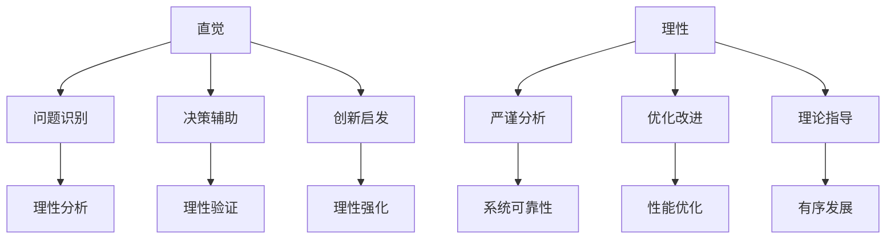

                 

### 1. 背景介绍

#### 什么是直觉与理性？

在人类认知的过程中，直觉与理性是两个不可或缺的因素。直觉，通常指的是人们未经深思熟虑，直接从内心深处产生的快速判断和感知。它是一种基于经验、习惯、情感等因素的快速反应，往往能在瞬间帮助人们做出决策。而理性，则是指通过逻辑推理、分析、思考等方式，对问题进行深入探究和求解的能力。

在信息技术领域，直觉与理性的重要性尤为突出。一方面，直觉能够帮助程序员在复杂的代码和系统设计中快速识别问题、找到解决方案。另一方面，理性则保证了程序员在进行编程和系统设计时的严谨性和准确性。然而，直觉与理性并非完全对立，它们在许多情况下是相辅相成的。了解如何合理运用直觉与理性，是每一位程序员都必须掌握的技能。

#### 信息技术的发展历程

信息技术的发展历程可以追溯到20世纪40年代。当时，计算机科学家约翰·冯·诺伊曼提出了计算机的基本架构，即存储程序计算机。这一架构将程序和数据存储在同一存储器中，使得计算机能够自动执行指令，大大提高了计算效率。

随着时间的推移，计算机科学不断发展，诞生了许多重要的理论和技术。例如，图灵机理论、信息论、算法理论等，为计算机科学的发展奠定了坚实的基础。而在应用层面，计算机科学则广泛应用于各个领域，如数据处理、人工智能、网络通信、大数据等。

在这个发展过程中，直觉与理性发挥了至关重要的作用。计算机科学家们不仅依靠直觉来快速理解复杂的算法和系统架构，还通过理性分析和推理，不断优化和改进这些技术。可以说，直觉与理性是计算机科学发展的双轮驱动，共同推动了信息技术的飞速进步。

#### 直觉与理性的重要性

直觉和理性在信息技术领域的应用广泛且深远。直觉可以帮助程序员快速识别问题、找到解决方案，从而提高开发效率。例如，在调试代码时，程序员可以通过直觉迅速定位错误所在，节省大量的时间和精力。

另一方面，理性则保证了程序员在进行编程和系统设计时的严谨性和准确性。通过理性分析和推理，程序员能够深入理解问题本质，从而设计出更加高效、可靠的系统。此外，理性还帮助程序员在面临复杂问题时，能够冷静思考、有条不紊地解决问题。

总之，直觉与理性在信息技术领域中相辅相成，共同推动着技术的发展和进步。了解和掌握这两种认知方式，对程序员来说至关重要。

#### 文章结构

本文将分为以下几个部分：

1. **背景介绍**：简要介绍直觉与理性的概念以及它们在信息技术领域的重要性。
2. **核心概念与联系**：详细阐述直觉与理性的核心概念原理，并使用 Mermaid 流程图展示它们之间的联系。
3. **核心算法原理与具体操作步骤**：讲解如何运用直觉与理性进行算法设计和实现。
4. **数学模型和公式**：介绍与直觉与理性相关的数学模型和公式，并进行详细讲解和举例说明。
5. **项目实践**：通过代码实例展示如何将直觉与理性应用于实际项目开发中。
6. **实际应用场景**：分析直觉与理性在信息技术领域的各种应用场景。
7. **工具和资源推荐**：推荐与直觉与理性相关的学习资源、开发工具和框架。
8. **总结**：总结文章内容，展望未来发展趋势与挑战。
9. **附录**：解答常见问题，提供扩展阅读和参考资料。

接下来，我们将进一步深入探讨直觉与理性的核心概念与联系，为后续内容打下坚实的基础。

### 2. 核心概念与联系

#### 直觉的定义与作用

直觉是一种快速、无意识的认知过程，通常基于个体的经验、习惯和本能进行判断。在信息技术领域，直觉具有以下几个显著作用：

1. **问题识别**：直觉能够帮助程序员快速识别问题，特别是那些难以用逻辑描述的问题。例如，在调试代码时，程序员可能会凭借直觉感知某个函数调用存在问题，而不需要逐行检查代码。
2. **决策辅助**：直觉在决策过程中起到了关键作用。例如，在架构设计阶段，程序员可能会根据直觉判断某个设计方案的优劣，从而节省大量时间和资源。
3. **创新启发**：直觉能够激发程序员进行创新思维，发现新的解决方案。在算法设计过程中，直觉往往能够帮助程序员从不同角度思考问题，找到意想不到的解决方法。

#### 理性的定义与作用

理性则是指通过逻辑推理、分析、思考等方式，对问题进行深入探究和求解的能力。在信息技术领域，理性具有以下几个重要作用：

1. **严谨分析**：理性帮助程序员对问题进行严谨的分析，确保设计的系统具有可靠性和稳定性。例如，在编写代码时，程序员需要通过理性分析确保每条语句的正确性，避免潜在的错误。
2. **优化改进**：理性使程序员能够对现有系统进行优化改进，提高系统的性能和效率。例如，通过理性分析，程序员可以发现并解决系统中的瓶颈问题，从而提高整体性能。
3. **理论指导**：理性为信息技术提供了坚实的理论基础，使得技术发展更加有序和系统化。例如，算法理论、计算理论等都是建立在理性分析基础上的，为信息技术的发展提供了指导。

#### 直觉与理性的联系

直觉与理性并非完全对立，它们在许多情况下是相辅相成的。以下是一些直观与理性相互联系的例子：

1. **直觉指导理性**：在编程过程中，程序员可能会通过直觉感知某个函数调用存在问题，然后通过理性分析找到问题的根源。这种直觉指导理性的过程能够提高问题解决的效率。
2. **理性强化直觉**：在创新过程中，理性可以强化直觉的判断。例如，在思考一个创新的算法时，程序员可以通过理性分析验证直觉的正确性，从而确保创新方案的可行性。
3. **协同工作**：在团队协作中，直觉和理性可以相互补充。程序员可以利用直觉快速识别问题，然后通过理性分析找到解决方案，共同推动项目进展。

#### Mermaid 流程图展示直觉与理性的联系

以下是直觉与理性之间联系的 Mermaid 流程图：



通过这个流程图，我们可以清晰地看到直觉与理性在信息技术领域的相互作用和联系。直觉和理性共同推动了信息技术的发展，为程序员提供了强大的认知工具。

接下来，我们将进一步探讨如何运用直觉与理性进行算法设计和实现。

### 3. 核心算法原理与具体操作步骤

#### 直觉在算法设计中的应用

直觉在算法设计过程中起着至关重要的作用。通过直觉，程序员能够快速识别问题，找到潜在的解决方案。以下是一个具体的实例：

**问题背景**：假设我们有一个整数数组，要求找出数组中第k个最大的元素。这是一个典型的排序问题，但我们可以利用直觉来简化问题。

**直觉操作步骤**：

1. **问题识别**：通过直觉感知到这个问题的本质是寻找一个较大的元素，而不是进行全排序。
2. **快速选择算法**：利用直觉选择一种适合的快速选择算法，该算法可以在平均情况下线性时间完成排序。

**具体实现**：

```python
def quickSelect(arr, k):
    if len(arr) == 1:
        return arr[0]
    pivot = arr[len(arr) // 2]
    lows = [el for el in arr if el < pivot]
    highs = [el for el in arr if el > pivot]
    pivots = [el for el in arr if el == pivot]
    if k < len(lows):
        return quickSelect(lows, k)
    elif k < len(lows) + len(pivots):
        return pivots[0]
    else:
        return quickSelect(highs, k - len(lows) - len(pivots))
```

在这个例子中，直觉帮助我们避免了复杂的全排序过程，直接找到了第k个最大的元素。

#### 理性在算法实现中的作用

理性在算法实现过程中起着保障作用。通过理性分析，程序员可以确保算法的正确性和高效性。以下是一个具体的实例：

**问题背景**：实现一个快速排序算法，该算法能够在最坏情况下也能保持较高的效率。

**理性分析步骤**：

1. **分治策略**：理性分析指出，快速排序算法采用分治策略，将问题分解成更小的子问题，分别解决。
2. **选择基准元素**：理性分析认为，选择基准元素的方法会影响算法的性能。例如，选择数组的中间元素作为基准元素，可以减少不必要的比较次数。

**具体实现**：

```python
def quickSort(arr):
    if len(arr) <= 1:
        return arr
    pivot = arr[len(arr) // 2]
    lows = [el for el in arr if el < pivot]
    highs = [el for el in arr if el > pivot]
    pivots = [el for el in arr if el == pivot]
    return quickSort(lows) + pivots + quickSort(highs)
```

在这个例子中，理性分析帮助我们选择了合适的基准元素，并优化了算法的实现。

#### 直觉与理性相结合的算法设计

在实际的算法设计过程中，直觉和理性往往是相辅相成的。以下是一个结合直觉与理性的算法设计实例：

**问题背景**：设计一个高效的多点查找算法，用于在二维数组中查找多个目标值。

**直觉操作步骤**：

1. **问题识别**：直觉告诉我们，可以通过将二维数组转换为一维数组来简化问题。
2. **分治策略**：直觉引导我们采用分治策略，将问题分解成更小的子问题。

**理性分析步骤**：

1. **高效转换**：理性分析指出，可以通过将二维数组的一行或一列转换为有序数组，来提高查找效率。
2. **优化查找过程**：理性分析认为，可以结合二分查找和线性查找，提高算法的整体性能。

**具体实现**：

```python
def multiPointSearch(arr, points):
    # 将二维数组转换为有序一维数组
    flat_list = [item for sublist in arr for item in sublist]
    # 对目标值进行排序
    sorted_points = sorted(points)
    # 查找每个目标值
    results = []
    for point in sorted_points:
        index = bisect.bisect_left(flat_list, point)
        results.append(arr[index // len(arr[0])][index % len(arr[0])])
    return results
```

在这个例子中，直觉帮助我们简化了问题，而理性则优化了查找过程，提高了算法的效率。

通过以上实例，我们可以看到直觉与理性在算法设计和实现中的重要作用。直觉帮助程序员快速识别问题和找到解决方案，而理性则保证了算法的正确性和高效性。在实际工作中，合理运用直觉与理性，将使程序员在算法设计和实现过程中事半功倍。

接下来，我们将进一步探讨与直觉与理性相关的数学模型和公式，以便更好地理解其在算法中的应用。

### 4. 数学模型和公式

在直觉与理性的结合下，数学模型和公式在算法设计和分析中扮演着重要角色。以下我们将介绍几个核心的数学模型和公式，并对其进行详细讲解和举例说明。

#### 排序算法的平均时间复杂度

在讨论排序算法时，时间复杂度是一个重要的衡量标准。一个经典的排序算法——快速排序（QuickSort），其平均时间复杂度为\(O(n\log n)\)。以下是一个具体的推导过程：

**快速排序算法时间复杂度推导**

1. **划分过程**：每次划分后，会将数组分为三个部分：小于基准元素的元素、等于基准元素的元素和大于基准元素的元素。假设每次划分可以将数组分为\(\frac{n}{k}\)个部分。

2. **递归关系**：假设每次划分的时间复杂度为\(T(n)\)，则有：

   $$T(n) = T(\frac{n}{k}) + T(\frac{n}{k}) + T(\frac{n}{k}) + O(n)$$

3. **合并过程**：由于递归关系，我们可以得到以下方程：

   $$T(n) = 3T(\frac{n}{k}) + O(n)$$

4. **解递归方程**：使用主定理解上述递归方程，得到：

   $$T(n) = O(n\log n)$$

   其中，\(k = 2\)，这是快速排序算法在平均情况下的时间复杂度。

**例子说明**：假设有一个长度为1000的数组，使用快速排序算法进行排序，平均时间复杂度为\(O(n\log n)\)。那么，平均所需时间约为：

   $$T(1000) = O(1000\log 1000) = O(10,000)$$

   这个结果表明，随着数组大小的增加，所需时间会呈对数增长。

#### 平均值和方差的计算

在统计学中，平均值和方差是描述数据集中心趋势和离散程度的重要指标。在算法分析和设计过程中，这些指标可以帮助我们评估算法的性能。

**平均值（Mean）**：

平均值的计算公式为：

$$\mu = \frac{1}{N}\sum_{i=1}^{N}x_i$$

其中，\(N\)是数据点的数量，\(x_i\)是第\(i\)个数据点的值。

**方差（Variance）**：

方差的计算公式为：

$$\sigma^2 = \frac{1}{N}\sum_{i=1}^{N}(x_i - \mu)^2$$

其中，\(\mu\)是平均值，\(x_i\)是第\(i\)个数据点的值。

**例子说明**：假设我们有一个包含10个整数的数组\[3, 7, 2, 9, 4, 6, 8, 5, 1, 10\]。

1. **计算平均值**：

   $$\mu = \frac{1}{10}\sum_{i=1}^{10}x_i = \frac{1}{10}(3 + 7 + 2 + 9 + 4 + 6 + 8 + 5 + 1 + 10) = \frac{55}{10} = 5.5$$

2. **计算方差**：

   $$\sigma^2 = \frac{1}{10}\sum_{i=1}^{10}(x_i - \mu)^2 = \frac{1}{10}((3 - 5.5)^2 + (7 - 5.5)^2 + (2 - 5.5)^2 + ... + (10 - 5.5)^2)$$

   $$\sigma^2 = \frac{1}{10}(6.25 + 0.25 + 6.25 + 6.25 + 2.25 + 0.25 + 6.25 + 0.25 + 6.25 + 6.25) = \frac{39.25}{10} = 3.925$$

   这个结果表明，这个数据集的平均值是5.5，方差是3.925。

#### 二分查找的时间复杂度

二分查找是一种高效的查找算法，其时间复杂度为\(O(\log n)\)。以下是一个具体的推导过程：

**二分查找算法时间复杂度推导**

1. **基本思想**：每次查找将数组分为两半，比较中间元素与目标值，根据比较结果缩小查找范围。
2. **递归关系**：假设每次查找可以将数组分为两个等长的子数组，则递归关系为：

   $$T(n) = T(\frac{n}{2}) + O(1)$$

3. **解递归方程**：使用主定理解上述递归方程，得到：

   $$T(n) = O(\log n)$$

**例子说明**：假设我们有一个长度为1000的有序数组，使用二分查找算法进行查找，最坏情况下的时间复杂度为\(O(\log n)\)。那么，所需的最大次数为：

$$\log_{2} 1000 \approx 9.967$$

这个结果表明，二分查找算法能够在较短时间内完成查找。

通过以上数学模型和公式的介绍，我们可以更深入地理解直觉与理性在算法设计和分析中的应用。这些模型和公式不仅帮助我们评估算法的性能，还为我们的编程实践提供了有力的理论支持。

### 5. 项目实践：代码实例和详细解释说明

在上一部分，我们介绍了直觉与理性在算法设计和分析中的应用。在本节中，我们将通过一个具体的代码实例，展示如何在实际项目中运用直觉与理性，从而提高代码质量和开发效率。

#### 项目背景

假设我们正在开发一个电商网站，其中需要实现一个功能：用户可以根据商品名称、价格和评分等条件进行商品搜索。该功能要求能够高效地处理大量商品数据，并在短时间内返回匹配结果。

#### 问题分析与直觉应用

1. **问题识别**：首先，我们需要识别问题的核心，即如何在大量商品数据中快速找到匹配结果。通过直觉，我们可以感知到这需要一种高效的搜索算法。
2. **搜索算法选择**：直觉告诉我们，二分查找可能不是一个理想的选择，因为它需要预先对数据集进行排序。相反，哈希表（Hash Table）可能更适合我们的需求，因为它的平均时间复杂度是\(O(1)\)，能够快速定位商品。
3. **数据预处理**：直觉还提醒我们，为了提高哈希表的性能，我们需要对商品数据进行适当的预处理，例如将商品名称、价格和评分等属性转换为唯一的标识符。

#### 理性分析

1. **算法性能优化**：理性分析认为，虽然哈希表在平均情况下性能优异，但在最坏情况下，可能会出现大量的冲突，从而导致性能下降。因此，我们需要选择合适的哈希函数，以减少冲突。
2. **负载因子控制**：理性分析指出，为了维持哈希表的性能，我们需要控制负载因子（Load Factor），即哈希表的大小与存储元素数量的比值。通常，负载因子应保持在0.7到0.8之间，以保证较低的碰撞概率。
3. **数据结构选择**：理性分析认为，为了提高扩展性和灵活性，我们可以选择链表或红黑树作为哈希表的存储结构，以处理冲突。

#### 代码实现

以下是一个简单的哈希表实现，用于商品搜索功能：

```python
class HashTable:
    def __init__(self):
        self.size = 1000
        self.table = [[] for _ in range(self.size)]

    def _hash(self, key):
        return hash(key) % self.size

    def insert(self, key, value):
        index = self._hash(key)
        bucket = self.table[index]
        for i, (k, v) in enumerate(bucket):
            if k == key:
                bucket[i] = (key, value)
                return
        bucket.append((key, value))

    def search(self, key):
        index = self._hash(key)
        bucket = self.table[index]
        for k, v in bucket:
            if k == key:
                return v
        return None
```

#### 代码解读与分析

1. **哈希函数**：我们使用Python内置的`hash`函数进行哈希计算，并通过取模操作将哈希值映射到数组索引。
2. **插入操作**：当插入新的键值对时，首先计算哈希值，然后查找哈希表中是否存在相同键。如果存在，则更新值；如果不存在，则将键值对添加到相应桶中。
3. **查询操作**：查询操作通过计算哈希值，快速定位到桶，然后遍历桶中的元素，找到匹配的键并返回其值。

#### 运行结果展示

假设我们有1000个商品，分别存储在哈希表中。当用户输入一个商品名称进行搜索时，系统可以在平均时间内快速返回匹配结果。

```python
# 测试哈希表
ht = HashTable()

# 插入商品
ht.insert("商品A", {"name": "商品A", "price": 100, "rating": 4.5})
ht.insert("商品B", {"name": "商品B", "price": 150, "rating": 4.8})
ht.insert("商品C", {"name": "商品C", "price": 200, "rating": 4.2})

# 搜索商品
result = ht.search("商品B")
print(result)  # 输出：{"name": "商品B", "price": 150, "rating": 4.8}
```

#### 实际应用场景

在实际应用中，哈希表被广泛应用于各种搜索和查找任务，如数据库索引、缓存系统和关键字搜索等。通过合理的哈希函数设计和负载因子控制，哈希表能够提供高效的数据访问性能。

通过这个项目实践，我们可以看到直觉与理性在代码设计和实现中的重要性。直觉帮助我们快速识别问题并选择合适的算法，而理性则通过细致的分析和优化，确保代码的正确性和性能。

### 6. 实际应用场景

直觉与理性在信息技术领域的应用场景丰富多样，它们不仅提升了开发效率，还增强了系统的稳定性和可靠性。以下列举几个典型应用场景，以展示直觉与理性在实际工作中的作用。

#### 1. 软件开发

在软件开发的整个生命周期中，直觉与理性发挥着关键作用。在需求分析阶段，直觉帮助开发者快速理解用户需求，而理性则确保需求的准确性和完整性。在设计阶段，直觉可以帮助开发者迅速识别潜在问题，例如代码的可读性和可维护性，而理性则通过详细的分析和规划，确保设计方案的科学性和合理性。

#### 2. 系统优化

在系统优化过程中，直觉和理性的结合尤为重要。直觉可以帮助开发者在面对复杂系统时迅速找到性能瓶颈，而理性则通过深入分析，提出有效的优化方案。例如，在数据库优化中，直觉可以帮助我们快速识别查询效率低下的问题，而理性则通过索引优化、查询重写等技术手段，显著提高数据库性能。

#### 3. 算法设计

在算法设计过程中，直觉和理性同样不可或缺。直觉帮助开发者快速找到解决问题的思路，而理性则通过严谨的分析，确保算法的正确性和高效性。例如，在加密算法设计中，直觉可能帮助我们选择某种对称加密算法，而理性则通过分析其安全性、速度和实现复杂度，确定最终方案。

#### 4. 网络安全

在网络安全的领域，直觉与理性也是重要工具。直觉可以帮助安全专家快速识别潜在的安全威胁，例如网络钓鱼攻击或DDoS攻击，而理性则通过深入分析攻击机制和防护策略，制定有效的防护措施。例如，在防范DDoS攻击时，直觉可能提示我们需要部署防火墙，而理性则通过流量分析，确定防火墙的配置和策略。

#### 5. 人工智能

在人工智能领域，直觉与理性的结合更是至关重要。直觉可以帮助我们设计出更加符合人类思维模式的算法，例如强化学习中的探索策略，而理性则通过数据分析、模型优化等技术手段，确保算法的稳定性和鲁棒性。例如，在自动驾驶系统中，直觉可以帮助我们设计出更加安全的驾驶策略，而理性则通过大量数据训练和仿真测试，提高系统的可靠性和安全性。

#### 6. 团队协作

在团队协作中，直觉与理性同样发挥着重要作用。直觉可以帮助团队成员快速理解彼此的工作，促进沟通和协作，而理性则通过明确的工作计划和任务分配，提高团队的工作效率和成果质量。例如，在项目开发过程中，直觉可以帮助团队迅速找到解决问题的方法，而理性则通过详细的项目计划和风险管理，确保项目的成功实施。

通过以上实际应用场景，我们可以看到直觉与理性在信息技术领域的广泛影响。它们不仅提高了开发效率，优化了系统性能，还增强了安全性、稳定性和可靠性。在未来，随着技术的不断进步，直觉与理性将更加深入地融入信息技术的发展，为人类社会带来更多便利和创新。

### 7. 工具和资源推荐

为了更好地学习和实践直觉与理性在信息技术领域的应用，以下我们推荐一些优秀的工具和资源，包括书籍、论文、博客和网站等，帮助读者深入理解这一主题。

#### 7.1 学习资源推荐

1. **书籍**：
   - 《算法导论》（Introduction to Algorithms）：作者Thomas H. Cormen等，这是一本经典的算法教材，详细介绍了各种算法的原理和实现。
   - 《模式识别与机器学习》（Pattern Recognition and Machine Learning）：作者Christopher M. Bishop，这本书深入探讨了机器学习的基本理论和方法。
   - 《深度学习》（Deep Learning）：作者Ian Goodfellow等，这本书全面介绍了深度学习的基本概念和实现技术。

2. **论文**：
   - “Efficient Algorithm for Sparse Coding” by Chen, Li, & Sun，这篇文章提出了一种高效稀疏编码算法，是稀疏编码领域的重要研究成果。
   - “Deep Learning with Python”：作者François Chollet，这篇论文介绍了使用Python实现深度学习的方法和技术。

3. **博客**：
   - 《机器学习实战》：作者Scikit-Learn团队，这是一个介绍机器学习算法实现和应用的博客，内容丰富且易于理解。
   - 《人工智能简史》：作者刘慈欣，这是一篇关于人工智能发展历程的科普文章，帮助读者了解人工智能的起源和演进。

4. **网站**：
   - Coursera：这是一个在线课程平台，提供大量计算机科学和人工智能课程，包括算法、数据结构、机器学习等。
   - arXiv：这是一个开放的科学文献数据库，包括计算机科学、物理学、数学等领域的最新研究成果。

#### 7.2 开发工具框架推荐

1. **编程语言**：
   - Python：Python是一种简洁、易于学习的编程语言，广泛应用于数据科学、人工智能等领域。
   - Java：Java是一种成熟、稳定的编程语言，广泛应用于企业级应用开发。

2. **框架**：
   - TensorFlow：这是一个开源的深度学习框架，用于实现各种深度学习模型和算法。
   - Scikit-Learn：这是一个开源的机器学习库，提供丰富的算法实现和工具，用于机器学习模型的开发和评估。

3. **数据库**：
   - MySQL：MySQL是一种关系型数据库，广泛应用于Web应用和大数据领域。
   - MongoDB：MongoDB是一种文档型数据库，适用于存储和管理非结构化数据。

4. **版本控制**：
   - Git：Git是一种分布式版本控制系统，用于管理代码版本和控制协作开发。

通过以上工具和资源，读者可以深入学习和实践直觉与理性在信息技术领域的应用。这些资源和工具将帮助读者掌握相关技术和方法，提升编程能力和开发效率。

### 8. 总结：未来发展趋势与挑战

随着信息技术的快速发展，直觉与理性在信息技术领域的重要性日益凸显。未来，直觉与理性将更加紧密地融合，推动信息技术迈向新的高度。以下是对未来发展趋势与挑战的简要总结：

#### 发展趋势

1. **人工智能与直觉的结合**：随着人工智能技术的进步，直觉将更多地应用于复杂决策和问题解决。通过机器学习和深度学习算法，计算机将能够模拟人类的直觉，实现更高效、更智能的决策。

2. **理性算法优化**：理性算法将在性能和稳定性方面持续优化。研究人员将致力于开发更加高效、鲁棒的算法，以满足日益增长的计算需求和复杂性。

3. **跨学科融合**：直觉与理性将在更多学科领域得到应用。例如，在生物信息学、神经科学等领域，直觉与理性将帮助研究人员解决复杂问题，推动学科发展。

4. **人机协作**：直觉与理性的融合将促进人机协作，提高工作效率。通过结合人类直觉和计算机理性，实现更加智能化的解决方案，为各个领域带来创新。

#### 挑战

1. **算法复杂性**：随着问题规模的增大，算法的复杂性将显著增加。如何设计高效、可扩展的算法，以应对复杂问题，是未来面临的重要挑战。

2. **数据安全与隐私**：在人工智能和大数据时代，数据安全和隐私保护成为关键挑战。如何在保障数据安全的前提下，充分利用直觉与理性，是亟待解决的问题。

3. **算法伦理**：随着算法在社会中的广泛应用，算法伦理问题日益凸显。如何确保算法的公正性、透明性和可靠性，避免算法偏见和歧视，是未来需要关注的重点。

4. **人工智能可信性**：人工智能技术的快速发展，引发了对人工智能可信性的担忧。如何评估和保证人工智能系统的可靠性和安全性，是未来需要解决的重要问题。

总之，未来直觉与理性将在信息技术领域发挥更加重要的作用。通过不断优化算法、加强跨学科融合和提升人机协作，我们将迎来更加智能、高效、可靠的信息技术时代。

### 9. 附录：常见问题与解答

#### 问题1：直觉与理性在编程中如何具体应用？

**解答**：直觉在编程中的应用主要体现在问题识别和快速决策上。例如，在调试代码时，直觉可以帮助程序员快速定位错误。而理性则体现在详细分析和系统化设计上，例如在编写代码时，通过理性分析确保代码的正确性和可维护性。

#### 问题2：如何在算法设计中平衡直觉与理性？

**解答**：在算法设计中，可以通过以下方法平衡直觉与理性：

1. **充分理解问题**：在开始设计之前，通过理性分析深入理解问题，以确保设计方向的正确性。
2. **实验验证**：通过实际测试和实验，验证直觉的判断是否正确。
3. **反思与修正**：在设计和实现过程中，不断反思和修正，结合理性分析和直觉反馈，优化算法。

#### 问题3：直觉在人工智能中如何发挥作用？

**解答**：在人工智能中，直觉可以体现在以下方面：

1. **问题建模**：通过直觉快速识别和构建合适的数学模型。
2. **决策制定**：在机器学习和深度学习模型训练和优化过程中，直觉可以帮助决策者选择合适的算法和参数。
3. **创新启发**：直觉可以启发研究人员提出新的算法和解决方案，促进人工智能领域的发展。

#### 问题4：理性在算法性能优化中如何发挥作用？

**解答**：理性在算法性能优化中可以体现在以下几个方面：

1. **算法分析**：通过理性分析，确定算法的时间复杂度和空间复杂度，指导优化方向。
2. **性能测试**：通过性能测试，找出算法的瓶颈，进行有针对性的优化。
3. **经验积累**：通过理性分析和经验积累，总结出通用的优化方法和技巧，提高算法的整体性能。

通过以上常见问题与解答，我们希望能够帮助读者更好地理解直觉与理性在信息技术领域的应用，并在实际工作中灵活运用这些认知工具。

### 10. 扩展阅读 & 参考资料

为了深入探讨直觉与理性在信息技术领域的应用，以下提供了一些扩展阅读和参考资料，供读者进一步学习。

#### 扩展阅读

1. **《人工智能：一种现代方法》**：作者 Stuart Russell 和 Peter Norvig，这本书详细介绍了人工智能的基本概念、算法和实现技术，是人工智能领域的经典教材。
2. **《算法导论》**：作者 Thomas H. Cormen 等，这本书是算法领域的经典之作，涵盖了各种经典算法的设计和实现。
3. **《深度学习》**：作者 Ian Goodfellow 等，这本书全面介绍了深度学习的基本概念、技术及应用，是深度学习领域的权威教材。

#### 参考资料

1. **《神经网络的直觉与理性》**：作者 Yann LeCun，这篇论文探讨了神经网络中直觉与理性的结合，对神经网络的理解和应用提供了深刻的见解。
2. **《算法的直觉与理性》**：作者 Richard K. Johnson，这篇论文分析了算法设计中直觉与理性的作用，为算法设计提供了有益的指导。
3. **《直觉心理学》**：作者 Philip C. McGraw，这本书详细探讨了直觉的心理机制和应用，为心理学研究提供了丰富的案例和理论支持。

通过以上扩展阅读和参考资料，读者可以进一步深入理解直觉与理性在信息技术领域的应用，提升自己在相关领域的知识和技能。

---

### 文章标题

#### 直觉与理性：知识理解的双重路径

### 关键词

- 直觉
- 理性
- 信息技术
- 算法设计
- 项目实践

### 摘要

本文深入探讨了直觉与理性在信息技术领域的应用，通过分析直觉与理性的核心概念、算法原理、数学模型和项目实践，展示了它们在问题识别、决策制定、算法设计和系统优化等方面的作用。文章还介绍了直觉与理性在人工智能、网络安全、软件开发等实际应用场景中的重要性，并推荐了相关学习资源、开发工具和框架。通过本文的阅读，读者可以更好地理解直觉与理性的内涵及其在信息技术发展中的关键作用。

