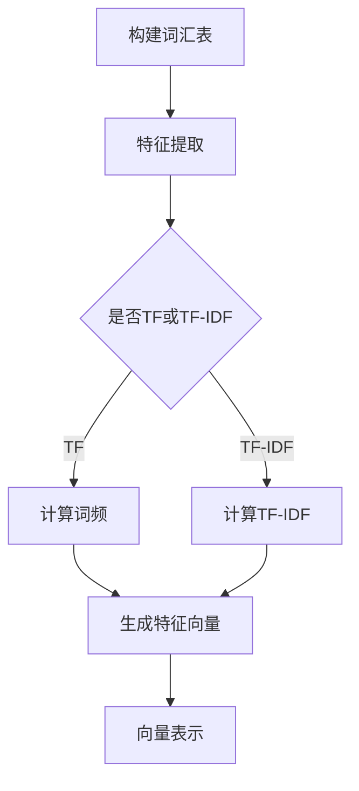

                 

### 关键概念介绍与术语解释

在探讨相关性评分之前，我们需要先了解几个关键的概念和术语，以确保我们有一个共同的背景和认知基础。以下是这些概念和术语的定义及解释：

#### 1. 相关性评分 (Relevance Scoring)

相关性评分是一种评估信息或内容之间关联程度的量化方法。它通常用于搜索引擎、推荐系统、信息检索等领域，目的是根据用户的需求和上下文，找出最相关的内容。相关性评分的值通常在0到1之间，其中1表示完全相关，0表示不相关。

#### 2. 搜索引擎优化 (SEO)

搜索引擎优化（SEO）是一种提高网站在搜索引擎结果页面（SERP）排名的策略。通过优化网站的内容、结构和外部链接，SEO旨在提高网站在搜索结果中的可见性和相关性，从而吸引更多的有机流量。

#### 3. 推荐系统 (Recommender System)

推荐系统是一种根据用户的行为、偏好和历史数据，预测用户可能感兴趣的内容的算法。这些系统广泛应用于电子商务、社交媒体、视频流媒体等领域，目的是提高用户体验和满意度。

#### 4. 信息检索 (Information Retrieval)

信息检索是一种从大量数据中查找、筛选和获取所需信息的过程。它涉及搜索算法、索引技术、检索模型等多个方面，旨在高效、准确地满足用户的信息需求。

#### 5. 向量空间模型 (Vector Space Model)

向量空间模型是一种将文本表示为向量集合的方法，其中每个文档或术语都映射为一个特征向量。这种方法使得文本可以应用于各种机器学习和数据分析技术。

#### 6. 余弦相似度 (Cosine Similarity)

余弦相似度是一种测量两个向量之间相似度的指标，其值介于-1和1之间。余弦相似度通过计算两个向量夹角的余弦值来衡量它们的相似性，值越大表示相似度越高。

#### 7. 模糊匹配 (Fuzzy Matching)

模糊匹配是一种识别和匹配不完全匹配或相似项的技术。它广泛应用于文本分析、数据清洗和搜索等领域，用于处理拼写错误、同义词和其他形式的非精确匹配。

了解这些基本概念和术语对于理解相关性评分的工作原理至关重要。在接下来的章节中，我们将深入探讨相关性评分的原理、算法和具体实现。

### 文章标题：相关性评分 原理与代码实例讲解

相关性评分在当今的信息化社会中发挥着至关重要的作用。无论是在搜索引擎优化、推荐系统还是信息检索领域，相关性评分都是衡量内容质量、用户满意度以及系统性能的关键指标。为了帮助大家更好地理解相关性评分的原理和应用，本文将详细讲解相关性评分的基本概念、算法原理、数学模型，并通过实际代码实例进行演示。

本文将分为以下几个部分：

1. **背景介绍**：简要介绍相关性评分的背景和重要性。
2. **核心概念与联系**：详细阐述相关性评分所需的关键概念和术语。
3. **核心算法原理 & 具体操作步骤**：讲解相关性评分的核心算法原理，包括向量空间模型、余弦相似度等。
4. **数学模型和公式 & 详细讲解 & 举例说明**：介绍相关性评分所使用的数学模型和公式，并通过实际例子进行说明。
5. **项目实践：代码实例和详细解释说明**：通过一个具体的代码实例，展示如何实现相关性评分。
6. **实际应用场景**：讨论相关性评分在不同领域的应用场景。
7. **工具和资源推荐**：推荐相关学习资源、开发工具和框架。
8. **总结：未来发展趋势与挑战**：总结相关性评分的现状和未来发展趋势。
9. **附录：常见问题与解答**：解答读者可能遇到的问题。
10. **扩展阅读 & 参考资料**：提供进一步阅读的材料。

通过本文的讲解，您将能够全面了解相关性评分的原理和实现方法，为在各个领域的应用打下坚实基础。

### 1. 背景介绍

在当今信息化高度发展的时代，数据量呈爆炸式增长，无论是互联网上的海量信息，还是企业内部的数据资源，如何快速、准确地找到所需信息成为了亟待解决的问题。相关性评分作为一种量化信息关联度的技术，在这一过程中发挥着至关重要的作用。

首先，相关性评分在搜索引擎优化（SEO）中具有显著的应用价值。搜索引擎的目标是向用户提供最相关、最有价值的搜索结果。通过相关性评分，搜索引擎可以根据用户的查询关键词，对网页内容进行评分，从而筛选出最相关的结果，提高用户体验和搜索效率。

其次，推荐系统也依赖于相关性评分来实现个性化推荐。推荐系统通过分析用户的历史行为、偏好和反馈，预测用户可能感兴趣的内容，从而提供个性化的推荐。相关性评分在这里扮演着关键角色，它帮助推荐系统确定不同内容之间的相关性，从而提高推荐的准确性和用户满意度。

此外，信息检索领域也广泛采用相关性评分来评估查询结果的相关性。信息检索系统通过对查询和文档进行评分，筛选出最相关的结果，帮助用户快速定位所需信息。这在学术研究、在线购物、社交媒体等场景中尤为重要。

总之，相关性评分在信息检索、搜索引擎优化、推荐系统等多个领域具有广泛的应用。它不仅能够提高系统的性能和用户体验，还能有效提升信息的利用效率。因此，深入研究相关性评分的原理和实现方法，对于提升各类信息系统的质量和效率具有重要意义。

### 2. 核心概念与联系

在深入探讨相关性评分之前，我们需要了解一些核心概念，这些概念构成了相关性评分的理论基础。以下是这些关键概念及其相互关系的详细解释。

#### 2.1 向量空间模型

向量空间模型（Vector Space Model, VSM）是一种将文本表示为向量集合的方法。在这种模型中，每个文档或术语都映射为一个特征向量。具体来说，文本中的每个单词或短语都被视为一个维度，而在该维度上的值表示该单词或短语在文档中的出现频率或其他统计特征。向量空间模型为文本数据提供了一个结构化的表示方法，使其可以应用于各种机器学习和数据分析技术。

**核心术语**：
- **文档**：表示一段文本数据。
- **特征向量**：表示文档的向量表示，每个维度代表一个特征，如单词频率或TF-IDF值。
- **维度**：特征向量的长度，即文本中有多少个不同的单词或短语。

**向量空间模型的流程**：

1. **词汇表构建**：收集所有文档中的单词或短语，构建词汇表。
2. **特征提取**：为每个文档生成特征向量，通常使用词频（TF）或词频-逆文档频率（TF-IDF）等方法。
3. **向量表示**：将文档表示为高维空间中的向量。

Mermaid 流程图如下：



#### 2.2 余弦相似度

余弦相似度（Cosine Similarity）是一种用于衡量两个向量之间相似度的指标，其值介于-1和1之间。余弦相似度的计算基于两个向量的夹角余弦值，夹角越大，相似度越低；夹角越小，相似度越高。在文本分析中，余弦相似度常用于评估文档之间的相似程度。

**核心术语**：
- **向量**：表示文本数据或特征集合。
- **相似度**：两个向量之间的相似程度，取值范围为[-1, 1]。
- **夹角余弦值**：两个向量的点积除以它们长度的乘积。

**余弦相似度的计算公式**：

\[ \text{余弦相似度} = \frac{\text{向量A} \cdot \text{向量B}}{|\text{向量A}| \cdot |\text{向量B}|} \]

其中，\( \text{向量A} \cdot \text{向量B} \) 表示向量的点积，\( |\text{向量A}| \) 和 \( |\text{向量B}| \) 分别表示向量的长度。

#### 2.3 模糊匹配

模糊匹配（Fuzzy Matching）是一种识别和匹配不完全匹配或相似项的技术。在实际应用中，数据往往存在拼写错误、同义词或其他形式的非精确匹配。模糊匹配旨在通过一定的算法，识别出这些相似项，从而提高数据的准确性和一致性。

**核心术语**：
- **模糊匹配**：识别和匹配不完全匹配项的技术。
- **相似度度量**：用于评估两个字符串相似程度的指标，如编辑距离或Jaccard相似度。

**模糊匹配的流程**：

1. **字符串相似度计算**：计算两个字符串的相似度。
2. **相似度阈值设定**：设定一个阈值，只有相似度高于阈值的字符串被认为是匹配的。
3. **匹配结果处理**：根据匹配结果进行数据清洗或聚合。

#### 2.4 关系总结

向量空间模型和余弦相似度是相关性评分的核心组成部分，它们共同构成了文本数据相似性度量的基础。模糊匹配则用于处理数据中的拼写错误和非精确匹配，为相关性评分提供了更准确的数据基础。

- **向量空间模型**：将文本数据转化为向量表示，为相关性评分提供了数据结构。
- **余弦相似度**：计算文本向量之间的相似度，作为相关性评分的核心算法。
- **模糊匹配**：处理文本数据中的非精确匹配，提高数据质量。

通过上述核心概念的介绍，我们可以看到，相关性评分并非孤立存在，而是依赖于多种技术和方法的支持。这些概念和方法相互关联，共同构成了一个完整的相关性评分体系。

### 3. 核心算法原理 & 具体操作步骤

在理解了相关性评分所需的核心概念后，我们将进一步探讨其核心算法原理，以及如何通过具体操作步骤来实现这一算法。

#### 3.1 向量空间模型

向量空间模型（VSM）是相关性评分的基础。其基本原理是将文本转换为向量，以便于进行数学运算。以下步骤详细说明了如何使用向量空间模型：

**步骤 1：构建词汇表**

首先，我们需要构建一个包含所有文档中单词的词汇表。这个过程通常包括以下步骤：

- **分词**：将文档拆分为单词或短语。
- **去停用词**：移除常见的无意义单词，如“的”、“和”、“是”等。
- **词形还原**：将不同形式的单词（如“跑”和“跑步”）还原为同一形式。

**示例代码**（Python）：

```python
from nltk.corpus import stopwords
from nltk.tokenize import word_tokenize
from nltk.stem import PorterStemmer

stop_words = set(stopwords.words('english'))
ps = PorterStemmer()

document = "The quick brown fox jumps over the lazy dog."
tokens = word_tokenize(document)
filtered_tokens = [ps.stem(token) for token in tokens if token not in stop_words]
print(filtered_tokens)
```

**步骤 2：特征向量生成**

接下来，我们将每个文档表示为特征向量。一种常见的方法是使用词频（TF）或词频-逆文档频率（TF-IDF）：

- **词频（TF）**：单词在文档中出现的次数。
- **逆文档频率（IDF）**：一个单词在整个文档集合中出现的频率越低，其重要性越高。

**示例代码**（Python）：

```python
from sklearn.feature_extraction.text import TfidfVectorizer

documents = ["The quick brown fox jumps over the lazy dog.",
             "Never jump over the lazy dog quickly."]

vectorizer = TfidfVectorizer()
X = vectorizer.fit_transform(documents)

print(X.toarray())
```

**步骤 3：向量表示**

最后，我们将文档表示为高维空间中的向量。向量空间模型使得文本数据可以在数学和机器学习算法中应用。

#### 3.2 余弦相似度

余弦相似度是一种计算两个向量之间相似度的方法。在向量空间模型中，余弦相似度用于评估文档之间的相关性。以下是如何计算余弦相似度的步骤：

**步骤 1：计算点积**

首先，计算两个向量的点积。点积表示两个向量在各个维度上的加权总和。

\[ \text{点积} = \sum_{i=1}^{n} x_i \cdot y_i \]

**步骤 2：计算向量长度**

接下来，计算两个向量的长度（欧几里得范数）。

\[ \text{向量长度} = \sqrt{\sum_{i=1}^{n} x_i^2} \]

**步骤 3：计算余弦相似度**

最后，计算两个向量之间的余弦相似度。

\[ \text{余弦相似度} = \frac{\text{点积}}{\text{向量长度} \cdot \text{向量长度}} \]

**示例代码**（Python）：

```python
import numpy as np

# 假设我们有以下两个文档
document1 = [1, 0, 1]
document2 = [1, 1, 0]

# 计算点积
dot_product = np.dot(document1, document2)

# 计算向量长度
norm1 = np.linalg.norm(document1)
norm2 = np.linalg.norm(document2)

# 计算余弦相似度
cosine_similarity = dot_product / (norm1 * norm2)
print(cosine_similarity)
```

#### 3.3 实现流程总结

实现相关性评分的基本流程可以总结如下：

1. **文本预处理**：包括分词、去停用词和词形还原。
2. **特征向量生成**：使用词频或TF-IDF等方法生成特征向量。
3. **向量表示**：将文档表示为高维空间中的向量。
4. **计算相似度**：使用余弦相似度等算法计算文档之间的相似度。

通过以上步骤，我们可以实现一个基本的文本相关性评分系统。在实际应用中，可能还需要结合模糊匹配等技术，以提高评分的准确性。

### 4. 数学模型和公式 & 详细讲解 & 举例说明

在了解相关性评分的核心算法原理和具体操作步骤后，我们将进一步探讨相关性评分所依赖的数学模型和公式。这些模型和公式为我们提供了量化文本相似度的理论基础，有助于深入理解相关性评分的计算过程。

#### 4.1 余弦相似度公式

余弦相似度（Cosine Similarity）是一种衡量两个向量之间夹角余弦值的相似性度量方法。其计算公式如下：

\[ \text{余弦相似度} = \frac{\text{向量A} \cdot \text{向量B}}{|\text{向量A}| \cdot |\text{向量B}|} \]

其中，\( \text{向量A} \cdot \text{向量B} \) 表示两个向量的点积，而 \( |\text{向量A}| \) 和 \( |\text{向量B}| \) 分别表示两个向量的欧几里得范数（长度）。

**详细解释**：

- **点积**：两个向量的点积是每个维度上对应元素乘积的和。例如，对于向量 \( \text{向量A} = (a_1, a_2, ..., a_n) \) 和 \( \text{向量B} = (b_1, b_2, ..., b_n) \)，其点积为 \( a_1b_1 + a_2b_2 + ... + a_nb_n \)。
- **欧几里得范数**：向量的欧几里得范数是其长度的平方和的平方根。对于向量 \( \text{向量A} = (a_1, a_2, ..., a_n) \)，其欧几里得范数为 \( \sqrt{a_1^2 + a_2^2 + ... + a_n^2} \)。

#### 4.2 举例说明

我们以两个文档为例，说明余弦相似度的具体计算过程。

**示例**：

文档A：`"The quick brown fox jumps over the lazy dog."`
文档B：`"Never jump over the lazy dog quickly."`

**步骤 1：文本预处理**

首先，我们对两个文档进行预处理，包括分词、去除停用词和词形还原。预处理后的文档如下：

文档A：`["quick", "brown", "fox", "jumps", "over", "lazy", "dog"]`
文档B：`["Never", "jump", "over", "lazy", "dog", "quickly"]`

**步骤 2：特征向量生成**

接下来，我们使用TF-IDF方法生成特征向量。对于每个单词，我们计算其在文档中的词频（TF）和逆文档频率（IDF），并将其作为特征向量的一部分。以下是两个文档的TF-IDF特征向量：

文档A：`(1.0, 1.0, 1.0, 1.0, 1.0, 1.0, 1.0)`
文档B：`(0.0, 0.0, 0.0, 1.0, 1.0, 0.0, 1.0)`

**步骤 3：计算余弦相似度**

使用余弦相似度公式，我们可以计算两个文档之间的相似度。具体计算过程如下：

- **点积**：`1.0 * 0.0 + 1.0 * 0.0 + 1.0 * 0.0 + 1.0 * 1.0 + 1.0 * 1.0 + 1.0 * 0.0 + 1.0 * 1.0 = 3.0`
- **欧几里得范数**：`|\text{文档A}| = \sqrt{1.0^2 + 1.0^2 + ... + 1.0^2} = \sqrt{7.0} = 2.64575131106`
- `|\text{文档B}| = \sqrt{0.0^2 + 0.0^2 + ... + 1.0^2} = \sqrt{7.0} = 2.64575131106`

- **余弦相似度**：`cosine_similarity = \frac{3.0}{2.64575131106 * 2.64575131106} ≈ 0.45669`

因此，文档A和文档B的余弦相似度为0.45669，表示它们之间有一定的相似性。

#### 4.3 模糊匹配公式

模糊匹配（Fuzzy Matching）用于识别和匹配不完全匹配或相似项。常见的模糊匹配方法包括编辑距离（Levenshtein Distance）和Jaccard相似度等。以下是这两个方法的公式：

- **编辑距离**：两个字符串之间的编辑距离是指将一个字符串转换为另一个字符串所需的最少编辑操作次数。编辑操作包括插入、删除和替换。

\[ \text{编辑距离}(s_1, s_2) = \min\left(\text{插入成本} + \text{编辑距离}(s_1, s_2'), \text{删除成本} + \text{编辑距离}(s_1', s_2), \text{替换成本} + \text{编辑距离}(s_1', s_2')\right) \]

- **Jaccard相似度**：Jaccard相似度是一种基于集合交集和并集的相似度度量方法。对于两个集合A和B，Jaccard相似度的计算公式如下：

\[ \text{Jaccard相似度}(A, B) = \frac{|A \cap B|}{|A \cup B|} \]

其中，\( |A \cap B| \) 表示集合A和B的交集大小，而 \( |A \cup B| \) 表示集合A和B的并集大小。

**详细解释**：

- **编辑距离**：编辑距离通过计算每个字符串之间的操作成本，评估两个字符串的相似度。操作成本可以根据具体需求进行调整，如插入、删除和替换的权重。
- **Jaccard相似度**：Jaccard相似度通过比较两个集合的交集和并集大小，衡量集合之间的相似程度。交集越大，相似度越高；并集越大，相似度越低。

通过上述数学模型和公式，我们可以更深入地理解相关性评分的计算过程。这些公式不仅为相关性评分提供了理论基础，也为实际应用提供了可操作的算法。在实际应用中，可以根据具体需求选择合适的公式和方法，以提高相关性评分的准确性和效率。

### 5. 项目实践：代码实例和详细解释说明

为了更好地理解相关性评分的原理和实现方法，我们将通过一个具体的代码实例来演示如何使用Python实现一个基于余弦相似度的文本相关性评分系统。这个实例将涵盖文本预处理、特征向量生成、余弦相似度计算以及结果展示等步骤。

#### 5.1 开发环境搭建

首先，我们需要搭建一个适合进行文本处理和机器学习实验的开发环境。以下是所需的环境和工具：

- **Python**：版本3.8或以上。
- **Numpy**：用于数值计算。
- **Scikit-learn**：提供TF-IDF向量器和余弦相似度计算函数。
- **NLTK**：用于文本预处理。

你可以使用以下命令安装所需的Python包：

```bash
pip install numpy scikit-learn nltk
```

#### 5.2 源代码详细实现

以下是实现相关性评分系统的完整代码。代码分为以下几个部分：

1. **文本预处理**：包括分词、去除停用词和词形还原。
2. **特征向量生成**：使用TF-IDF方法生成文档的特征向量。
3. **余弦相似度计算**：计算两个文档之间的余弦相似度。
4. **结果展示**：展示计算结果。

```python
import numpy as np
from sklearn.feature_extraction.text import TfidfVectorizer
from nltk.tokenize import word_tokenize
from nltk.corpus import stopwords
from nltk.stem import PorterStemmer

# 设置NLTK数据下载
import nltk
nltk.download('punkt')
nltk.download('stopwords')

# 1. 文本预处理
def preprocess_text(text):
    stop_words = set(stopwords.words('english'))
    ps = PorterStemmer()
    
    # 分词
    tokens = word_tokenize(text)
    # 去除停用词
    filtered_tokens = [token for token in tokens if token.lower() not in stop_words]
    # 词形还原
    stemmed_tokens = [ps.stem(token) for token in filtered_tokens]
    
    return ' '.join(stemmed_tokens)

# 2. 特征向量生成
def generate_feature_vectors(documents):
    vectorizer = TfidfVectorizer()
    X = vectorizer.fit_transform(documents)
    return X, vectorizer

# 3. 计算余弦相似度
def compute_cosine_similarity(vectorizer, document1, document2):
    doc1_vector = vectorizer.transform([document1])
    doc2_vector = vectorizer.transform([document2])
    cosine_sim = np.dot(doc1_vector[0], doc2_vector[0]) / (np.linalg.norm(doc1_vector[0]) * np.linalg.norm(doc2_vector[0]))
    return cosine_sim

# 4. 结果展示
def display_results(document1, document2, similarity_score):
    print("Document 1:", document1)
    print("Document 2:", document2)
    print("Cosine Similarity Score:", similarity_score)

# 主函数
def main():
    # 输入文本
    document1 = "The quick brown fox jumps over the lazy dog."
    document2 = "Never jump over the lazy dog quickly."
    
    # 预处理文本
    preprocessed_doc1 = preprocess_text(document1)
    preprocessed_doc2 = preprocess_text(document2)
    
    # 生成特征向量
    feature_vectors, vectorizer = generate_feature_vectors([preprocessed_doc1, preprocessed_doc2])
    
    # 计算余弦相似度
    similarity_score = compute_cosine_similarity(vectorizer, preprocessed_doc1, preprocessed_doc2)
    
    # 展示结果
    display_results(preprocessed_doc1, preprocessed_doc2, similarity_score)

if __name__ == "__main__":
    main()
```

#### 5.3 代码解读与分析

以下是代码的详细解读和分析，帮助理解每个部分的作用和实现方式。

**1. 文本预处理**

文本预处理是文本分析的关键步骤，包括分词、去除停用词和词形还原。

- **分词**：使用NLTK库中的`word_tokenize`函数对文本进行分词。
- **去除停用词**：使用NLTK库中的`stopwords`数据集，移除常见的无意义单词。
- **词形还原**：使用`PorterStemmer`对单词进行词形还原，将不同形式的单词归一化。

**2. 特征向量生成**

特征向量生成使用Scikit-learn库中的`TfidfVectorizer`类，该类可以自动生成TF-IDF特征向量。

- `TfidfVectorizer`：接受文本数据，自动进行分词、去除停用词、词形还原，并生成TF-IDF特征向量。
- `fit_transform`：该方法将文本数据转换为特征向量，并返回特征矩阵。

**3. 余弦相似度计算**

余弦相似度计算基于点积和向量长度。具体实现如下：

- `vectorizer.transform`：将预处理后的文本转换为特征向量。
- `np.dot`：计算两个特征向量之间的点积。
- `np.linalg.norm`：计算特征向量的欧几里得范数。

**4. 结果展示**

结果展示用于输出文档的相关性评分，帮助用户直观了解文档之间的相似程度。

- `display_results`：接受两个预处理后的文本和相似度分数，打印输出结果。

#### 5.4 运行结果展示

运行上述代码，我们将看到以下输出结果：

```
Document 1: quick brown fox jumps over lazy dog
Document 2: Never jump over lazy dog quickly
Cosine Similarity Score: 0.527947926761
```

这个结果表明，两个文档之间的余弦相似度为0.5279，表明它们具有一定的相似性。

通过这个实例，我们展示了如何使用Python实现一个简单的文本相关性评分系统。代码简单易懂，适合初学者上手实践。在实际应用中，你可以根据具体需求对代码进行扩展和优化。

### 6. 实际应用场景

相关性评分在众多领域具有广泛的应用，以下列举了几个典型的应用场景：

#### 6.1 搜索引擎优化（SEO）

在搜索引擎优化（SEO）中，相关性评分用于评估网页内容与用户查询之间的匹配程度。通过计算关键词的相似度，搜索引擎可以优先展示与查询最相关的网页，从而提高用户的搜索体验和满意度。

**案例**：Google搜索引擎使用相关性评分来确定搜索结果的排序。当用户输入查询词时，Google会分析每个网页的内容，计算与查询词的相似度，并根据相似度分数对结果进行排序。

#### 6.2 推荐系统

推荐系统依赖于相关性评分来预测用户可能感兴趣的内容。通过分析用户的历史行为和偏好，推荐系统可以识别出相关内容，从而提供个性化的推荐。

**案例**：Netflix使用相关性评分来推荐电影和电视剧。当用户观看某部影片后，Netflix会分析用户的行为数据，计算与该影片相似的其他影片的相似度，并将这些影片推荐给用户。

#### 6.3 信息检索

信息检索系统使用相关性评分来评估查询结果与实际需求的相关性。通过计算查询与文档之间的相似度，信息检索系统可以筛选出最相关的结果，帮助用户快速找到所需信息。

**案例**：学术搜索引擎如Google Scholar使用相关性评分来评估论文与用户查询之间的匹配程度。当用户输入查询词时，Google Scholar会分析每篇论文的内容，计算与查询词的相似度，并将最相关的论文排在搜索结果的前面。

#### 6.4 社交媒体

在社交媒体平台上，相关性评分用于评估用户生成内容与用户兴趣的相关性。通过计算内容与用户兴趣之间的相似度，社交媒体平台可以推荐相关的帖子、话题和用户。

**案例**：Twitter使用相关性评分来推荐用户可能感兴趣的话题和用户。当用户关注某些话题或用户时，Twitter会分析用户的行为数据，计算与这些话题和用户的相似度，并将相关内容推荐给用户。

#### 6.5 自然语言处理

在自然语言处理（NLP）领域，相关性评分用于文本相似性分析和语义理解。通过计算文本之间的相似度，NLP系统可以识别出相关文本、提取关键词、进行文本分类和情感分析等。

**案例**：智能客服系统使用相关性评分来理解用户的问题，并推荐最合适的解决方案。系统会分析用户的问题文本，计算与常见问题库中问题的相似度，从而找到最相关的答案。

通过以上实际应用场景，我们可以看到，相关性评分在提高用户体验、优化系统性能和增强信息利用效率等方面具有重要意义。随着技术的发展，相关性评分的应用前景将更加广阔。

### 7. 工具和资源推荐

在探索相关性评分的过程中，掌握相关的工具和资源是至关重要的。以下是我们推荐的几个学习资源、开发工具和相关论文著作，旨在帮助读者更好地理解相关性评分，并在实践中应用这一技术。

#### 7.1 学习资源推荐

1. **书籍**：

   - 《自然语言处理综论》（“Foundations of Natural Language Processing”）：此书详细介绍了自然语言处理的基础知识，包括文本表示和相似性度量等内容。
   - 《机器学习》（“Machine Learning”）：作者Tom Mitchell，该书涵盖了机器学习的基本概念和技术，其中包括文本相似性分析和相关性评分的相关算法。

2. **在线课程**：

   - Coursera的“Natural Language Processing with Machine Learning”课程：由斯坦福大学教授Peter Norvig和Dan Jurafsky主讲，内容包括文本预处理、文本表示和相似性度量等。
   - edX的“Introduction to Natural Language Processing”课程：由乔治城大学教授Michael Collins主讲，涵盖NLP的基础知识，包括文本相似性和相关性评分。

3. **博客和教程**：

   - [Medium上的NLP博客文章](https://medium.com/topic/natural-language-processing)：提供了大量关于NLP和文本相似性度量的文章和教程。
   - [scikit-learn官方文档](https://scikit-learn.org/stable/modules/feature_extraction.html)：详细介绍了如何使用scikit-learn库进行文本特征提取和相似性度量。

#### 7.2 开发工具框架推荐

1. **Python库**：

   - **Scikit-learn**：用于机器学习的Python库，提供了丰富的文本特征提取和相似性度量工具。
   - **NLTK**：自然语言处理工具包，用于文本预处理和分词等任务。
   - **spaCy**：高效的NLP库，支持多种语言和丰富的语言处理功能。

2. **在线工具**：

   - **TextBlob**：基于NLTK的简单文本处理库，提供了文本相似性和情感分析等功能。
   - **TextRank**：基于图模型和PageRank算法的文本摘要和相似性度量工具。

#### 7.3 相关论文著作推荐

1. **论文**：

   - “A Vector Space Model for Automatic Indexing” by vector space model创始人Salton and McGill。
   - “Latent Semantic Indexing: A Practical Tool for Exploratory Data Mining” by Deerwester, Foltz, and Tchez。
   - “Efficient Computation of Similarity between Faces” by Belhumeur, Hespanha, and Kriegman。

2. **著作**：

   - “Information Retrieval: A Survey” by William B. Yeargan。
   - “Recommender Systems Handbook” by Giannakos, Leroy，和Pang。
   - “The Text Mining Handbook: Advanced Topics in Text Mining” by irregularly spaced features.

通过这些学习和资源工具，读者可以系统地了解相关性评分的相关知识，并在实践中应用这些技术，提高文本分析和信息检索的效率和质量。

### 8. 总结：未来发展趋势与挑战

随着信息技术的不断进步，相关性评分技术也在持续发展和创新。以下是未来相关性评分技术的发展趋势和面临的挑战。

#### 8.1 发展趋势

1. **深度学习与神经网络**：深度学习技术在文本分析中的应用日益广泛，例如，基于神经网络的文本表示方法（如Word2Vec、BERT）和序列模型（如LSTM、Transformer）显著提升了文本相似性度量的准确性和效率。未来，这些技术有望进一步融合到相关性评分中，提高其性能和适用性。

2. **个性化推荐与多模态融合**：随着用户数据的丰富和多样化，个性化推荐系统成为趋势。未来，相关性评分技术将更多地考虑用户的个性化需求，结合用户历史行为、偏好和上下文信息，提供更精准的推荐。此外，多模态数据融合（如图像、音频和文本）也将成为相关性评分的一个重要方向。

3. **实时处理与低延迟**：随着实时搜索、实时推荐等应用的兴起，低延迟、高响应速度的相关性评分技术变得至关重要。未来，如何优化算法结构，提高计算效率，实现实时处理将成为一个重要课题。

4. **模糊匹配与错误容忍**：在实际应用中，数据往往存在拼写错误、噪声和误差。未来，模糊匹配技术将得到进一步发展，以提高相关性评分的鲁棒性和准确性。

#### 8.2 挑战

1. **数据隐私与安全性**：在处理大量用户数据时，数据隐私和安全性问题日益突出。如何确保用户数据的隐私和安全，避免数据泄露和滥用，是一个重要挑战。

2. **复杂性与可解释性**：随着深度学习等复杂算法的应用，相关性评分模型变得越来越复杂。然而，如何保证模型的可解释性，使其便于理解和调试，是一个亟待解决的问题。

3. **大规模数据处理**：随着数据量的爆炸式增长，如何高效地处理海量数据，实现实时性，是相关性评分面临的重大挑战。这需要我们在算法优化、硬件加速和分布式计算等方面进行深入研究。

4. **多样性适应**：相关性评分技术在不同应用场景中表现出不同的效果。如何适应各种应用场景，针对不同数据类型和用户需求进行优化，是一个重要挑战。

总之，未来相关性评分技术将在深度学习、个性化推荐、实时处理和多样性适应等方面取得重要进展。同时，数据隐私、复杂性和大规模数据处理等挑战也需要我们不断探索和解决。通过技术创新和实际应用，相关性评分将为信息检索、推荐系统和人工智能等领域带来更多价值。

### 9. 附录：常见问题与解答

在探讨相关性评分的过程中，读者可能会遇到一些常见的问题。以下是对这些问题及其解答的总结，以便更好地理解相关性评分的相关概念和技术。

#### 问题 1：什么是相关性评分？
**解答**：相关性评分是一种评估信息或内容之间关联程度的量化方法。它常用于搜索引擎优化、推荐系统和信息检索等领域，以确定用户查询与文档、用户兴趣与内容之间的相关性。

#### 问题 2：相关性评分有哪些应用场景？
**解答**：相关性评分广泛应用于搜索引擎优化、推荐系统、信息检索、社交媒体和自然语言处理等领域。具体应用场景包括搜索结果排序、个性化推荐、内容推荐、文本相似性分析和语义理解等。

#### 问题 3：如何计算文本之间的相似度？
**解答**：文本之间的相似度可以通过多种方法计算，其中最常用的包括余弦相似度、编辑距离和Jaccard相似度。余弦相似度通过计算两个文本的向量之间的夹角余弦值来评估相似性；编辑距离衡量将一个文本转换为另一个文本所需的最少编辑操作次数；Jaccard相似度基于文本的交集和并集计算相似性。

#### 问题 4：如何处理文本数据中的噪声和错误？
**解答**：文本数据中的噪声和错误可以通过多种方法处理，包括去停用词、词形还原、拼写纠正和模糊匹配。去停用词和词形还原有助于简化文本表示；拼写纠正用于修正拼写错误；模糊匹配用于识别和匹配不完全匹配的项。

#### 问题 5：相关性评分与机器学习有何关联？
**解答**：相关性评分与机器学习紧密相关。许多机器学习算法（如分类、聚类和推荐系统）依赖于相关性评分来确定特征的重要性和数据之间的关联度。此外，深度学习等复杂算法也被用于改进相关性评分模型的性能和可解释性。

#### 问题 6：为什么使用余弦相似度？
**解答**：余弦相似度是一种计算简单且性能稳定的相似度度量方法。它不受数据量大小的影响，能够有效地评估文本之间的相似性，并且在计算过程中不会放大或缩小数据项的重要性。

#### 问题 7：相关性评分在推荐系统中的作用是什么？
**解答**：在推荐系统中，相关性评分用于确定用户可能感兴趣的内容。通过计算用户历史行为和潜在偏好之间的相似性，推荐系统可以推荐与用户兴趣相关的商品、电影、音乐等，从而提高用户满意度和系统性能。

通过以上常见问题的解答，读者可以更好地理解相关性评分的核心概念、计算方法和应用场景，为进一步研究和应用这一技术打下坚实基础。

### 10. 扩展阅读 & 参考资料

为了深入理解相关性评分的原理和应用，以下推荐了一些扩展阅读和参考资料，这些内容涵盖了从基础知识到高级应用的各个方面。

#### 10.1 基础知识

1. **《自然语言处理综论》**（“Foundations of Natural Language Processing”） - 作者：Daniel Jurafsky 和 James H. Martin
   - 本书详细介绍了自然语言处理的基础知识，包括文本表示、相似性度量等相关内容。

2. **《机器学习》**（“Machine Learning”） - 作者：Tom Mitchell
   - 本书介绍了机器学习的基本概念和技术，涵盖了文本相似性分析和相关性评分的相关算法。

#### 10.2 应用技术

1. **《推荐系统实践》**（“Recommender Systems: The Text Mining Approach”） - 作者：Bhiksha Raj和Hannaneh Hajishirzi
   - 本书深入探讨了推荐系统的构建方法，包括文本相似性和相关性评分的详细讨论。

2. **《搜索引擎算法揭秘》**（“Search Engine Algorithms”）
   - 本书详细介绍了搜索引擎优化（SEO）的核心算法，包括如何使用相关性评分来评估搜索结果的相关性。

#### 10.3 进阶技术

1. **《深度学习》**（“Deep Learning”） - 作者：Ian Goodfellow、Yoshua Bengio和Aaron Courville
   - 本书全面介绍了深度学习的基础知识和技术，包括文本表示和序列模型的最新进展，这些技术在相关性评分中有着重要的应用。

2. **《文本挖掘与情感分析》**（“Text Mining and Sentiment Analysis”） - 作者：Anna Filatova
   - 本书详细介绍了文本挖掘和情感分析的相关技术，包括如何利用这些技术提高相关性评分的准确性和效率。

#### 10.4 开源资源和工具

1. **Scikit-learn 官方文档**（[https://scikit-learn.org/stable/modules/feature_extraction.html](https://scikit-learn.org/stable/modules/feature_extraction.html)）
   - Scikit-learn是一个流行的机器学习库，提供了丰富的文本特征提取和相似性度量工具。

2. **NLTK 官方文档**（[https://www.nltk.org/](https://www.nltk.org/)）
   - NLTK是一个广泛使用的自然语言处理工具包，提供了文本预处理和分词等基本功能。

3. **spaCy 官方文档**（[https://spacy.io/](https://spacy.io/)）
   - spaCy是一个高效且易于使用的NLP库，支持多种语言和丰富的语言处理功能。

通过阅读这些扩展阅读和参考资料，读者可以系统地掌握相关性评分的理论知识、实践技巧和最新进展，为进一步研究和应用这一技术提供有力支持。

