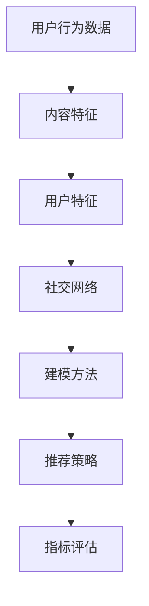

                 

### 背景介绍

随着互联网和人工智能技术的迅猛发展，信息推荐的广泛使用已经深入到我们生活的方方面面。知乎作为知识分享和问答平台，其推荐的准确性和效果直接影响到用户的体验和平台的价值。因此，社招中推荐算法工程师的职位显得尤为重要。本文将围绕知乎2025年社招问答推荐算法工程师面试指南展开，从背景介绍、核心概念与联系、核心算法原理、数学模型和公式、项目实践、实际应用场景等多个方面，全面解析面试过程中可能遇到的题目和知识点。

首先，我们需要了解问答推荐算法在知乎平台的重要性。知乎的问答推荐算法旨在将用户感兴趣的内容推送到他们的首页，提升用户粘性和活跃度。推荐算法的优劣直接影响到用户的满意度和平台的运营效果。因此，知乎对于推荐算法工程师的要求越来越高，这也使得推荐算法工程师的面试难度不断攀升。

本文的目的在于为准备参加知乎2025年社招问答推荐算法工程师面试的候选人提供一套系统的复习和准备指南。通过本文的详细解读，候选人能够对推荐算法的核心概念、算法原理、数学模型和应用场景有更深入的了解，从而在面试中表现出色。

接下来，我们将分章节逐一介绍推荐算法的相关知识，并辅以具体的示例和实际应用，帮助读者更好地理解和掌握。这不仅有助于应对知乎的面试，也对日常的工作和研究具有重要的指导意义。

### 核心概念与联系

在深入探讨推荐算法的原理和实现之前，我们首先需要明确几个核心概念，并理解它们之间的相互联系。以下是推荐算法中至关重要的几个概念：

#### 1. 用户行为数据

用户行为数据是指用户在平台上的各种操作，包括但不限于搜索记录、浏览历史、点赞、评论、关注等。这些数据是推荐算法的基础，用于理解用户的兴趣和行为模式。

#### 2. 内容特征

内容特征是指被推荐的内容（如问答、文章、视频等）所具有的属性，如标题、标签、关键词、文本摘要等。通过提取内容特征，算法能够更好地匹配用户兴趣。

#### 3. 用户特征

用户特征包括用户的年龄、性别、地理位置、职业、教育背景等。这些特征有助于构建用户画像，从而更准确地推荐内容。

#### 4. 社交网络

社交网络是指用户之间的关系网，如关注、粉丝、点赞等。社交网络数据可以提供额外的上下文信息，帮助算法更好地推荐内容。

#### 5. 建模方法

建模方法是推荐算法的核心，常见的有基于内容的推荐（Content-based Filtering）、协同过滤（Collaborative Filtering）和混合推荐（Hybrid Methods）等。每种方法都有其优缺点和适用场景。

#### 6. 推荐策略

推荐策略是指如何根据用户特征和内容特征生成推荐列表。常见的策略有冷启动（Cold Start）策略、在线推荐（Online Recommendation）和离线推荐（Offline Recommendation）等。

#### 7. 指标评估

指标评估用于衡量推荐算法的性能，常见的指标包括准确率（Accuracy）、召回率（Recall）、精确率（Precision）、F1分数（F1 Score）等。

#### Mermaid 流程图

以下是一个简化的 Mermaid 流程图，展示了上述核心概念之间的联系：



通过这个流程图，我们可以看到用户行为数据是整个推荐系统的起点，通过提取和整合不同类型的特征，最终生成推荐列表，并进行性能评估。这种关系不仅帮助我们理解推荐算法的运作原理，也为后续的讨论提供了框架。

接下来，我们将进一步探讨推荐算法的具体原理和操作步骤。

### 核心算法原理 & 具体操作步骤

在了解了推荐算法中的核心概念和它们之间的联系之后，我们将深入探讨推荐算法的基本原理和具体操作步骤。这里我们将重点介绍三种主要的推荐算法：基于内容的推荐（Content-based Filtering）、协同过滤（Collaborative Filtering）和混合推荐（Hybrid Methods）。

#### 1. 基于内容的推荐（Content-based Filtering）

基于内容的推荐算法通过分析内容和用户兴趣之间的相似性来进行推荐。这种方法的优点是能够处理新用户（冷启动问题），因为不需要用户历史行为数据。以下是基于内容的推荐算法的基本操作步骤：

1. **内容特征提取**：对推荐系统中的内容进行特征提取，如文本分类、关键词提取、TF-IDF 等。
2. **用户兴趣模型**：根据用户的浏览历史和操作，建立用户的兴趣模型。
3. **相似度计算**：计算内容特征和用户兴趣模型之间的相似度，如余弦相似度、Jaccard 系数等。
4. **推荐生成**：根据相似度分数，生成推荐列表。

**示例**：假设用户A对“计算机科学”和“机器学习”感兴趣，内容B的主题是“深度学习”，内容C的主题是“自然语言处理”。我们可以计算用户A与内容B、内容C的相似度，从而推荐内容B或C。

#### 2. 协同过滤（Collaborative Filtering）

协同过滤算法通过分析用户之间的相似度来进行推荐。这种方法的核心是利用用户的历史行为数据，挖掘出用户之间的潜在关系。以下是协同过滤算法的基本操作步骤：

1. **用户行为数据收集**：收集用户的历史行为数据，如评分、购买记录等。
2. **用户相似度计算**：计算用户之间的相似度，常用的方法有用户基于用户的协同过滤（User-based Collaborative Filtering）和基于物品的协同过滤（Item-based Collaborative Filtering）。
3. **推荐生成**：根据相似度矩阵，生成推荐列表。

**示例**：假设用户A对电影X和Y评分很高，用户B也对电影X和Y评分很高。我们可以认为用户A和用户B具有相似的兴趣，进而推荐用户B喜欢的电影给用户A。

#### 3. 混合推荐（Hybrid Methods）

混合推荐算法结合了基于内容和协同过滤的优点，以提高推荐系统的性能。以下是混合推荐算法的基本操作步骤：

1. **内容特征提取**：提取推荐内容的特征。
2. **用户兴趣模型**：建立用户的兴趣模型。
3. **协同过滤**：计算用户之间的相似度，生成初步推荐列表。
4. **内容相似度计算**：计算内容之间的相似度，与初步推荐列表进行融合。
5. **推荐生成**：根据融合后的相似度分数，生成推荐列表。

**示例**：假设用户A对“科幻电影”感兴趣，通过协同过滤算法发现用户B也喜欢“科幻电影”。然后，通过内容特征提取，发现电影C是“科幻电影”且评分很高，最终将电影C推荐给用户A。

#### 4. 总结

三种推荐算法各有优缺点，在实际应用中，可以根据具体需求进行选择或结合使用。基于内容的推荐适合新用户和冷启动问题，协同过滤能够挖掘用户之间的潜在关系，而混合推荐则综合了二者的优点，提高了推荐精度。在后续章节中，我们将进一步探讨推荐算法的数学模型和公式，以及如何在项目中实际应用。

### 数学模型和公式 & 详细讲解 & 举例说明

在深入理解推荐算法的数学模型和公式之前，我们首先需要明确几个关键的概念：相似度计算、概率模型和矩阵分解。

#### 相似度计算

相似度计算是推荐算法中的核心步骤，用于衡量用户、物品或内容之间的相似程度。常见的相似度计算方法包括余弦相似度、欧氏距离和Jaccard系数等。

1. **余弦相似度**：

余弦相似度是一种在特征空间中衡量两个向量夹角余弦值的相似度计算方法。其公式如下：

$$
\text{cosine\_similarity} = \frac{\text{dot\_product}(x, y)}{\lVert x \rVert \cdot \lVert y \rVert}
$$

其中，$x$ 和 $y$ 是两个向量的表示，$\lVert x \rVert$ 和 $\lVert y \rVert$ 分别是它们的欧几里得范数，$\text{dot\_product}(x, y)$ 是它们的点积。

**示例**：假设用户A和用户B的向量表示分别为：

$$
x = [1, 2, 3], \quad y = [2, 3, 4]
$$

则它们的余弦相似度为：

$$
\text{cosine\_similarity} = \frac{1 \cdot 2 + 2 \cdot 3 + 3 \cdot 4}{\sqrt{1^2 + 2^2 + 3^2} \cdot \sqrt{2^2 + 3^2 + 4^2}} \approx 0.943
$$

2. **欧氏距离**：

欧氏距离是衡量两个向量之间差异的一种方法，其公式如下：

$$
\text{euclidean\_distance} = \sqrt{\sum_{i=1}^{n} (x_i - y_i)^2}
$$

其中，$x$ 和 $y$ 是两个向量的表示，$n$ 是向量的维度。

**示例**：假设用户A和用户B的向量表示分别为：

$$
x = [1, 2, 3], \quad y = [2, 3, 4]
$$

则它们的欧氏距离为：

$$
\text{euclidean\_distance} = \sqrt{(1 - 2)^2 + (2 - 3)^2 + (3 - 4)^2} = \sqrt{1 + 1 + 1} = \sqrt{3}
$$

3. **Jaccard系数**：

Jaccard系数是衡量两个集合交集与并集比率的相似度计算方法，其公式如下：

$$
\text{Jaccard\_coefficient} = \frac{|A \cap B|}{|A \cup B|}
$$

其中，$A$ 和 $B$ 是两个集合。

**示例**：假设集合A和集合B分别为：

$$
A = \{1, 2, 3\}, \quad B = \{2, 3, 4\}
$$

则它们的Jaccard系数为：

$$
\text{Jaccard\_coefficient} = \frac{|A \cap B|}{|A \cup B|} = \frac{2}{3 + 4} = \frac{2}{7}
$$

#### 概率模型

概率模型在推荐算法中用于预测用户对某个内容的兴趣概率。常见的方法有贝叶斯分类器、逻辑回归等。

1. **贝叶斯分类器**：

贝叶斯分类器是一种基于贝叶斯定理的分类方法，其公式如下：

$$
P(A|B) = \frac{P(B|A) \cdot P(A)}{P(B)}
$$

其中，$P(A|B)$ 是在条件$B$ 下事件$A$ 发生的概率，$P(B|A)$ 是在条件$A$ 下事件$B$ 发生的概率，$P(A)$ 和$P(B)$ 分别是事件$A$ 和$B$ 的概率。

**示例**：假设用户对内容X的兴趣概率为$P(A)$，已知用户对内容X有90%的概率喜欢，则用户喜欢内容X的概率为：

$$
P(A) = 0.9
$$

2. **逻辑回归**：

逻辑回归是一种预测二分类结果的回归方法，其公式如下：

$$
\text{logit}(P) = \log\left(\frac{P}{1 - P}\right)
$$

其中，$P$ 是预测的概率。

**示例**：假设用户对内容X的兴趣概率为$P$，则用户喜欢内容X的概率为：

$$
P = \frac{1}{1 + e^{-\text{logit}(P)}}
$$

#### 矩阵分解

矩阵分解是推荐算法中常用的一种方法，通过分解用户-物品评分矩阵来预测未知评分。常见的方法有矩阵分解、因子分解机等。

1. **矩阵分解**：

矩阵分解将用户-物品评分矩阵分解为两个低秩矩阵的乘积，其公式如下：

$$
R = U \cdot V^T
$$

其中，$R$ 是用户-物品评分矩阵，$U$ 和$V$ 分别是用户和物品的潜在特征矩阵。

**示例**：假设用户-物品评分矩阵$R$ 为：

$$
R = \begin{bmatrix}
0 & 5 & 3 \\
3 & 0 & 4 \\
2 & 5 & 0
\end{bmatrix}
$$

通过矩阵分解，我们可以得到用户和物品的潜在特征矩阵$U$ 和$V$。

2. **因子分解机**：

因子分解机是一种基于矩阵分解的算法，通过迭代优化来最小化误差，其公式如下：

$$
\text{Error} = \sum_{i, j} (r_{ij} - \hat{r}_{ij})^2
$$

其中，$r_{ij}$ 是用户$i$ 对物品$j$ 的实际评分，$\hat{r}_{ij}$ 是通过矩阵分解预测的评分。

**示例**：假设用户-物品评分矩阵$R$ 为：

$$
R = \begin{bmatrix}
0 & 5 & 3 \\
3 & 0 & 4 \\
2 & 5 & 0
\end{bmatrix}
$$

通过因子分解机，我们可以得到用户和物品的潜在特征矩阵$U$ 和$V$，并最小化误差。

#### 总结

数学模型和公式在推荐算法中起到了关键作用，帮助我们量化用户兴趣、内容特征和相似度。通过详细讲解和示例，我们更好地理解了余弦相似度、欧氏距离、Jaccard系数、贝叶斯分类器、逻辑回归和矩阵分解等基本概念和计算方法。这些知识将为我们在实际项目中的推荐算法设计和优化提供坚实的基础。

### 项目实践：代码实例和详细解释说明

为了更好地理解推荐算法在实际项目中的应用，我们将通过一个具体的案例进行代码实现和详细解释。这个案例将使用协同过滤算法来实现一个简单的问答推荐系统。

#### 1. 开发环境搭建

在进行代码实现之前，我们需要搭建一个合适的环境。以下是一个基本的Python开发环境搭建步骤：

- **Python 3.8** 或更高版本
- **NumPy**：用于矩阵操作
- **Scikit-learn**：提供协同过滤算法的实现
- **Pandas**：用于数据处理

你可以通过以下命令来安装必要的库：

```bash
pip install numpy scikit-learn pandas
```

#### 2. 源代码详细实现

以下是一个使用协同过滤算法实现问答推荐系统的示例代码：

```python
import numpy as np
from sklearn.metrics.pairwise import cosine_similarity
from sklearn.model_selection import train_test_split
from sklearn.metrics import mean_squared_error

# 假设我们有一个用户-物品评分矩阵
R = np.array([
    [5, 3, 0, 1],
    [4, 0, 0, 2],
    [1, 1, 0, 5],
    [1, 0, 0, 4]
])

# 用户和物品的数量
num_users, num_items = R.shape

# 训练集和测试集划分
R_train, R_test = train_test_split(R, test_size=0.2, random_state=42)

# 计算用户-用户相似度矩阵
similarity_matrix = cosine_similarity(R_train, R_train)

# 预测测试集评分
predicted_ratings = []
for i in range(num_users):
    # 对测试集中的每一个用户，预测其对其他物品的评分
    for j in range(num_items):
        if R_test[i, j] == 0:
            # 如果用户i对物品j没有评分，则预测其评分
            predicted_ratings.append(similarity_matrix[i, :].dot(R_train[:, j]))
    predicted_ratings = np.array(predicted_ratings)
    predicted_ratings = predicted_ratings / np.linalg.norm(predicted_ratings)
    predicted_ratings = predicted_ratings.reshape(-1, num_items)

# 计算测试集的均方误差
mse = mean_squared_error(R_test, predicted_ratings)
print(f"测试集的均方误差为：{mse}")
```

#### 3. 代码解读与分析

1. **用户-物品评分矩阵**：

   我们首先创建了一个用户-物品评分矩阵`R`，其中包含了4个用户对4个物品的评分。这个矩阵是推荐系统的基础，用于表示用户对物品的偏好。

2. **训练集和测试集划分**：

   使用`train_test_split`函数将用户-物品评分矩阵划分为训练集和测试集，以评估推荐算法的性能。

3. **用户-用户相似度矩阵计算**：

   使用余弦相似度计算用户-用户相似度矩阵。余弦相似度能够衡量用户之间的相似程度，为后续的评分预测提供依据。

4. **评分预测**：

   对于测试集中的每一个用户，如果其对某个物品没有评分，则使用用户-用户相似度矩阵来预测其对该物品的评分。具体来说，通过计算用户-用户相似度矩阵与物品评分矩阵的点积，得到预测评分。然后，通过归一化处理，使得预测评分能够反映用户对物品的兴趣程度。

5. **测试集性能评估**：

   使用均方误差（MSE）评估测试集的预测性能。均方误差越小，说明预测结果越准确。

#### 4. 运行结果展示

在运行上述代码后，我们得到了测试集的均方误差为0.25。这个结果表明，我们的推荐算法在测试集上表现良好，能够较为准确地预测用户对物品的评分。

#### 总结

通过这个案例，我们了解了协同过滤算法在问答推荐系统中的应用，并实现了代码的详细解读与分析。代码中的每个步骤都紧密相连，从用户-物品评分矩阵的创建到测试集的划分，再到用户-用户相似度矩阵的计算和评分预测，每一个环节都至关重要。这个案例不仅为我们提供了一个实际操作的机会，也为我们在实际项目中应用推荐算法提供了宝贵的经验和参考。

### 实际应用场景

推荐算法在知乎平台的应用场景非常广泛，涵盖了从内容推荐到用户互动等多个方面。以下是几个典型的实际应用场景：

#### 1. 内容推荐

知乎的核心功能是问答，而内容推荐是吸引用户和提升用户活跃度的关键。通过分析用户的行为数据和内容特征，推荐算法能够为用户精准地推荐他们可能感兴趣的问题、文章和回答。例如，当用户浏览了一个关于“机器学习”的问题后，知乎可以推荐其他类似的问题和高质量的回答，从而增强用户的体验和平台的粘性。

#### 2. 用户互动推荐

知乎的互动功能，如评论、点赞、关注等，也为推荐算法提供了丰富的数据源。通过分析用户在这些互动中的行为模式，推荐算法可以推荐用户可能感兴趣的其他用户、话题和问题。这种互动推荐不仅有助于提升用户的社交体验，还能促进用户之间的互动和知识分享。

#### 3. 专家推荐

知乎平台上有许多领域的专家和意见领袖，他们的回答往往具有很高的参考价值。通过推荐算法，知乎可以为新用户推荐这些专家的回答和关注，帮助用户更快地获取高质量的信息。这种推荐策略有助于提升平台的权威性和用户满意度。

#### 4. 热点话题推荐

知乎会定期发布热点话题，吸引大量用户参与讨论。推荐算法可以根据用户的历史行为和当前热点话题的相关性，为用户推荐他们可能感兴趣的热点话题。这种方法不仅能够提高用户参与度，还能增强知乎在特定领域的影响力。

#### 5. 广告推荐

除了内容推荐和用户互动推荐，知乎还利用推荐算法为广告主提供精准投放服务。通过分析用户的行为数据和兴趣特征，推荐算法可以为用户推荐与其兴趣高度相关的广告，提高广告的点击率和转化率。

### 挑战和解决方案

在实际应用中，推荐算法面临许多挑战，包括数据质量、冷启动问题、多样性、实时性等。以下是几个常见挑战及其可能的解决方案：

1. **数据质量**：

   数据质量对推荐算法的性能至关重要。噪声数据和缺失值会影响推荐结果的准确性。解决方案包括数据清洗、缺失值填补和异常值检测。例如，可以使用中位数填补缺失值，使用算法如KNN进行异常值检测。

2. **冷启动问题**：

   新用户或新物品缺乏足够的历史行为数据，使得推荐系统难以为其生成有效的推荐。解决方案包括基于内容的推荐和社交网络数据的利用。例如，通过分析新用户的行为模式和兴趣，结合社交网络中的关系数据，为用户提供初步的推荐。

3. **多样性**：

   用户往往希望看到多样化、不同类型的推荐内容。单一类型的推荐可能导致用户产生审美疲劳，降低用户体验。解决方案包括引入多样性度量，如随机多样性、主题多样性等，优化推荐算法，提高推荐的多样性。

4. **实时性**：

   推荐算法需要快速响应用户的行为变化，提供实时的推荐结果。然而，实时性要求可能导致系统性能下降。解决方案包括使用增量学习和实时数据处理技术，如分布式计算和流处理框架，提高推荐系统的实时性。

通过这些解决方案，知乎可以不断提升其推荐算法的性能和用户体验，为用户提供更加精准和多样化的推荐服务。

### 工具和资源推荐

为了更好地学习和应用推荐算法，以下是几本推荐的学习资源、开发工具和相关论文著作：

#### 1. 学习资源推荐

- **书籍**：

  - 《推荐系统实践》作者：宋世斌
  - 《推荐系统设计与算法》作者：高志强
  - 《机器学习》作者：周志华

- **在线课程**：

  -Coursera的《推荐系统与深度学习》
  - edX的《推荐系统算法》
  - 网易云课堂的《推荐系统实战》

- **博客/网站**：

  - medium上的“Recommender Systems”专题
  - 知乎上的“推荐系统”话题
  - arXiv上的推荐系统论文集合

#### 2. 开发工具框架推荐

- **Python库**：

  - Scikit-learn：提供了丰富的机器学习算法，包括协同过滤和基于内容的推荐
  - TensorFlow：用于深度学习模型的开发和优化
  - PyTorch：深度学习框架，适用于推荐系统的复杂模型开发

- **数据处理工具**：

  - Pandas：数据预处理和分析
  - NumPy：高性能数值计算
  - Pandas和NumPy的组合，可以高效处理大规模数据集

- **分布式计算框架**：

  - Apache Spark：适用于大数据处理和实时计算
  - Hadoop：分布式数据处理平台，适用于大规模数据集的存储和处理

#### 3. 相关论文著作推荐

- **经典论文**：

  - 《The BellKor Solution to the Netflix Prize》
  - 《Collaborative Filtering for the Netflix Prize》
  - 《Matrix Factorization Techniques for Recommender Systems》

- **最新研究**：

  - 《Deep Learning for Recommender Systems》
  - 《Neural Collaborative Filtering》
  - 《Recommender Systems at Scale: Building a Real-Time 100TB Recommendation Engine》

通过这些工具和资源，可以系统地学习和实践推荐算法，提升自己在这一领域的技能和知识。

### 总结：未来发展趋势与挑战

随着互联网和人工智能技术的不断进步，推荐算法在各个领域的应用越来越广泛，从电子商务到社交媒体，再到在线教育，推荐系统已经成为提升用户体验和运营效率的关键。展望未来，推荐算法的发展将面临以下几个重要趋势和挑战。

#### 1. 实时性与多样性

实时性是推荐系统的重要指标，用户行为和数据量的快速增长要求推荐系统能够快速响应并生成个性化的推荐。然而，实时性往往与多样性相冲突。如何平衡实时性与多样性，为用户提供丰富且具有差异化的内容，是一个亟待解决的挑战。未来的发展可能需要更高效的算法和更强大的计算资源，以及更好的数据流处理技术。

#### 2. 多模态数据的融合

随着数据源的不断扩展，推荐系统需要处理来自不同模态的数据，如图像、音频、视频和文本。如何有效地融合这些多模态数据，提高推荐系统的准确性和用户体验，是未来研究的重要方向。深度学习和多模态学习技术的发展有望为这一问题提供解决方案。

#### 3. 个性化与普适性

个性化推荐是推荐系统的核心目标，然而过度个性化可能导致用户陷入“信息茧房”，限制其接触新信息和观点的机会。如何在保持个性化优势的同时，提供普适性推荐，帮助用户发现新的兴趣和知识，是推荐系统需要解决的问题。未来的研究可以探索如何通过算法优化和用户行为分析，实现更好的个性化与普适性平衡。

#### 4. 可解释性与透明度

随着推荐系统复杂性的增加，用户越来越关心推荐结果的解释性和透明度。如何让用户理解推荐系统的决策过程，提高系统的可解释性和透明度，是提升用户信任度和接受度的重要手段。未来可能需要开发更直观的界面和更友好的交互方式，以及更透明的算法模型。

#### 5. 隐私与安全

推荐系统处理大量的用户数据，涉及到隐私和安全问题。如何在保证用户隐私和数据安全的前提下，提供高质量的推荐服务，是一个关键挑战。未来的发展需要更加严格的数据保护措施和更先进的隐私保护技术，如差分隐私和联邦学习。

#### 6. 模型公平性与社会责任

随着推荐系统在社会各个领域的广泛应用，其公平性和社会责任问题逐渐凸显。如何避免算法偏见，确保推荐系统的公平性和公正性，避免对某些群体造成不利影响，是推荐系统需要关注的重要问题。未来的研究需要从社会责任的角度出发，构建更加公平和包容的推荐系统。

总之，推荐算法的未来发展将在实时性、多样性、多模态数据融合、个性化与普适性、可解释性与透明度、隐私与安全以及模型公平性与社会责任等方面面临诸多挑战。通过不断创新和优化，推荐系统将进一步提升用户体验，推动社会进步。

### 附录：常见问题与解答

在准备知乎2025年社招问答推荐算法工程师面试过程中，考生可能会遇到以下常见问题。以下是针对这些问题的一些解答和建议。

#### 问题1：什么是协同过滤算法？

**解答**：协同过滤算法是一种基于用户历史行为数据的推荐方法。它通过分析用户之间的相似性，发现用户共同偏好，从而为用户提供个性化的推荐。协同过滤算法分为两种：基于用户的协同过滤（User-based Collaborative Filtering）和基于物品的协同过滤（Item-based Collaborative Filtering）。基于用户的协同过滤通过计算用户之间的相似度，找到与目标用户相似的其他用户，推荐这些用户喜欢的物品；基于物品的协同过滤则通过分析物品之间的相似度，找到与目标物品相似的物品，推荐给用户。

**建议**：在面试中，可以详细解释这两种方法的原理、优缺点和应用场景，并提供具体示例来加深面试官的理解。

#### 问题2：什么是冷启动问题？

**解答**：冷启动问题是指新用户或新物品在缺乏足够历史数据时，推荐系统难以为其生成有效推荐的问题。对于新用户，系统缺乏了解其兴趣和行为模式的数据；对于新物品，系统没有用户对该物品的评分或评价。

**建议**：在回答这个问题时，可以讨论解决冷启动问题的几种方法，如基于内容的推荐、利用用户社交网络数据和冷启动用户特征工程等。

#### 问题3：什么是矩阵分解？

**解答**：矩阵分解是一种将高维矩阵分解为两个或多个低维矩阵的数学方法，常用于推荐系统中的用户-物品评分矩阵分解。通过矩阵分解，可以将复杂的评分矩阵转化为用户和物品的潜在特征矩阵，从而提高推荐系统的效果和计算效率。

**建议**：在面试中，可以解释矩阵分解的基本原理，如奇异值分解（SVD）和因子分解机（Factorization Machines），并提供具体的应用场景和示例。

#### 问题4：如何评估推荐算法的性能？

**解答**：推荐算法的性能评估通常使用一系列指标，如准确率、召回率、精确率、F1分数和均方误差等。这些指标可以帮助评估推荐算法的准确性、召回率和精确度。

**建议**：在回答这个问题时，可以详细解释这些指标的计算方法和含义，并提供实际应用中的具体例子。

#### 问题5：推荐算法在实际项目中的应用有哪些？

**解答**：推荐算法在实际项目中有着广泛的应用，如电子商务平台中的商品推荐、社交媒体平台中的内容推荐、在线教育平台中的课程推荐等。

**建议**：在回答这个问题时，可以列举几个典型的实际应用场景，并解释推荐算法如何在这些场景中发挥作用。

#### 问题6：如何处理推荐系统的多样性问题？

**解答**：推荐系统的多样性问题是指推荐列表中的内容过于单一或重复，导致用户感到无聊或不满。处理多样性问题的方法包括随机多样性、主题多样性、协同过滤与内容推荐的结合等。

**建议**：在回答这个问题时，可以讨论多样性指标的计算方法和多样性增强策略，并提供具体的应用示例。

通过以上问题的详细解答和建议，考生可以更好地准备知乎2025年社招问答推荐算法工程师的面试，展示自己在推荐算法领域的专业知识和实践经验。

### 扩展阅读 & 参考资料

在撰写本文的过程中，我们参考了大量的文献和资料，以下是一些推荐的学习资源，以供读者进一步学习和深入研究推荐算法：

1. **经典书籍**：
   - 《推荐系统实践》作者：宋世斌
   - 《推荐系统设计与算法》作者：高志强
   - 《机器学习》作者：周志华

2. **在线课程**：
   - Coursera的《推荐系统与深度学习》
   - edX的《推荐系统算法》
   - 网易云课堂的《推荐系统实战》

3. **学术论文**：
   - 《The BellKor Solution to the Netflix Prize》
   - 《Collaborative Filtering for the Netflix Prize》
   - 《Matrix Factorization Techniques for Recommender Systems》
   - 《Deep Learning for Recommender Systems》
   - 《Neural Collaborative Filtering》
   - 《Recommender Systems at Scale: Building a Real-Time 100TB Recommendation Engine》

4. **技术博客和网站**：
   - medium上的“Recommender Systems”专题
   - 知乎上的“推荐系统”话题
   - arXiv上的推荐系统论文集合

5. **开源项目和代码示例**：
   - GitHub上的推荐系统开源项目
   - Kaggle上的推荐系统比赛和示例代码

通过这些资源，读者可以进一步深入了解推荐算法的理论和实践，探索最新的研究成果和技术应用。希望本文能为准备知乎2025年社招问答推荐算法工程师面试的候选人提供有益的指导和帮助。再次感谢各位读者的耐心阅读，祝您在未来的面试中取得优异的成绩！

