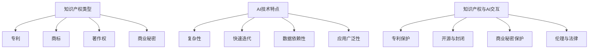

                 

### 1. 背景介绍

随着人工智能（AI）技术的迅速发展，我们正进入一个全新的时代，即AI时代。在这个时代，人工智能不再仅仅是一个概念或研究领域，而是逐渐融入到我们生活的方方面面，如自动驾驶、智能语音助手、医疗诊断、金融风控等。随着AI技术的普及和应用，知识产权（IPR）领域也面临着前所未有的新挑战。

知识产权是指个人或组织对其知识成果所享有的权利，包括专利、商标、著作权、商业秘密等。传统的知识产权主要涉及物理产品和技术，例如传统制造业中的机械设备和工艺流程。然而，在AI时代，知识产权的保护范围和技术复杂性都有了显著的变化。

首先，AI技术的核心是算法和模型，这些算法和模型往往是高度复杂的，由大量的代码和数据构成。这使得传统的专利制度在保护这些智力成果时遇到了巨大的挑战。一方面，AI算法的创新速度极快，常常在短短几个月内就能产生重大突破。而传统的专利申请和审批过程则相对缓慢，难以跟上技术的更新速度。另一方面，AI算法的创造过程往往需要大量的数据集作为训练基础，这些数据集可能包含了大量的个人信息和商业机密，如何在保护这些数据的同时确保算法的可用性，也是一个亟待解决的问题。

其次，AI技术的应用场景广泛，不仅仅局限于单一的行业或领域。这意味着，一个AI算法的专利可能同时涉及多个领域的技术，从而增加了专利申请和管理的复杂性。此外，AI技术往往依赖于大量的第三方开源代码和工具，这些代码和工具的知识产权归属和使用许可也需要明确界定，否则可能会导致技术扩散和知识产权纠纷。

再者，AI技术的共享和合作日益普遍。在传统行业，知识产权往往被视为商业竞争的核心资源，企业会尽可能保护其知识产权，防止竞争对手获取。然而，在AI时代，开放式创新和合作已成为趋势，企业之间通过共享算法和数据来加速技术进步。这种共享模式虽然有助于技术创新，但也带来了知识产权管理和保护的新问题。

此外，AI技术的发展还带来了道德和法律上的新挑战。例如，AI算法可能会被用于侵犯个人隐私、进行欺诈活动或制造虚假信息等。这些行为不仅侵犯了传统的知识产权，也可能触犯刑法和其他法律法规，从而对整个社会造成负面影响。

综上所述，AI时代给知识产权领域带来了诸多新挑战。为了应对这些挑战，我们需要在法律、技术、道德等多个层面进行深入研究和探索。在接下来的章节中，我们将详细分析这些挑战，并提出相应的解决方案。

### 2. 核心概念与联系

要深入探讨知识产权在AI时代的新挑战，我们首先需要理解几个核心概念，包括知识产权的基本类型、AI技术的特点以及它们之间的相互作用。

#### 2.1 知识产权的基本类型

知识产权主要包括以下几种类型：

1. **专利**：专利是授予发明人对其发明创造在一定期限内享有独占实施的权利。它保护的是发明的技术方案，包括产品、方法或其改进。

2. **商标**：商标是用于区分商品或服务来源的标志，如文字、图形、字母、数字等。它保护的是商业标识的独占使用权。

3. **著作权**：著作权是指对文学、艺术和科学作品的原创性表达所享有的权利。它保护的是作品的原创性和表达形式。

4. **商业秘密**：商业秘密是指不为公众所知悉、具有商业价值并经权利人采取保密措施的技术信息和经营信息。它保护的是企业的技术信息和经济信息。

#### 2.2 AI技术的特点

人工智能技术具有以下几个显著特点：

1. **高度复杂性**：AI算法和模型通常由数百万行代码和大量数据构成，其复杂性远超传统软件。

2. **快速迭代**：AI技术的创新速度极快，新的算法和模型不断涌现，旧的技术很快就会被淘汰。

3. **数据依赖性**：AI算法的训练和优化依赖于大量的数据集，这些数据集往往涉及敏感信息。

4. **应用广泛性**：AI技术可以应用于各种行业和领域，如医疗、金融、交通、娱乐等。

#### 2.3 知识产权与AI技术的相互作用

知识产权与AI技术的相互作用主要体现在以下几个方面：

1. **专利保护**：在AI领域，专利保护的是算法、模型及其应用。然而，由于AI算法的复杂性，传统的专利申请和审批流程难以满足快速迭代的需求。

2. **开源与封闭**：AI技术的发展过程中，开源与封闭的争论一直存在。开源可以促进技术的快速传播和应用，但同时也带来了知识产权保护的问题。封闭则可能限制技术的进步和普及。

3. **商业秘密保护**：在AI领域，商业秘密保护尤为重要，因为大量的数据和算法是其核心竞争力。如何平衡商业秘密的保护和技术的共享是一个难题。

4. **伦理与法律**：随着AI技术的应用，伦理和法律问题也逐渐凸显。例如，AI算法的歧视性、隐私侵犯等问题都需要在知识产权框架内得到妥善解决。

#### 2.4 Mermaid 流程图

为了更直观地理解上述概念之间的联系，我们可以使用Mermaid绘制一个流程图。



通过上述流程图，我们可以清晰地看到知识产权与AI技术之间的复杂关系，以及它们在不同层面的相互作用。

在接下来的章节中，我们将深入探讨AI时代给知识产权带来的具体新挑战，并分析这些挑战的成因和影响。

### 3. 核心算法原理 & 具体操作步骤

在讨论AI时代对知识产权带来的新挑战之前，我们先来了解一些核心的AI算法原理和具体操作步骤。这些算法原理不仅是我们理解AI技术的基础，也是我们分析其知识产权问题的前提。

#### 3.1 AI算法的基本概念

AI算法可以分为两大类：监督学习（Supervised Learning）和无监督学习（Unsupervised Learning）。

1. **监督学习**：在监督学习算法中，我们有一个已标记的数据集，即每个数据点都有一个相应的标签。算法的目标是学习一个映射关系，将新的、未标记的数据点映射到正确的标签。常见的监督学习算法包括线性回归（Linear Regression）、逻辑回归（Logistic Regression）、支持向量机（Support Vector Machine，SVM）和神经网络（Neural Networks）等。

2. **无监督学习**：无监督学习算法没有已标记的数据集，其目标是发现数据中的模式和结构。常见的无监督学习算法包括聚类（Clustering）、主成分分析（Principal Component Analysis，PCA）和自编码器（Autoencoder）等。

#### 3.2 神经网络算法

神经网络（Neural Networks）是AI领域中最流行的算法之一，其基本原理是模拟人脑的神经元结构。一个简单的神经网络通常包括以下几个组成部分：

1. **输入层**：接收外部输入数据。
2. **隐藏层**：进行特征提取和计算。
3. **输出层**：产生最终输出。

神经网络通过反向传播算法（Backpropagation Algorithm）来调整内部参数，以达到最小化预测误差的目的。

#### 3.3 具体操作步骤

以下是一个简单的神经网络训练过程，包括数据预处理、模型构建、训练和评估等步骤：

1. **数据预处理**：首先对数据进行清洗、归一化等处理，以便模型能够更好地学习和预测。

2. **模型构建**：定义神经网络的结构，包括层数、每层的神经元数量等。常用的深度学习框架如TensorFlow和PyTorch提供了方便的API来构建和训练神经网络。

3. **训练**：使用已标记的训练数据集来训练模型。在训练过程中，模型会不断调整内部参数，以减少预测误差。训练过程通常包括多个epoch（迭代周期）。

4. **评估**：使用测试数据集来评估模型的性能。常用的评估指标包括准确率（Accuracy）、召回率（Recall）、精确率（Precision）等。

5. **优化**：根据评估结果对模型进行调整和优化，以提高其性能。

#### 3.4 数学模型和公式

神经网络的训练过程可以归结为求解一个优化问题，其核心是损失函数（Loss Function）和优化算法（Optimization Algorithm）。以下是一些关键的数学模型和公式：

1. **损失函数**：
   $$ L = -\sum_{i=1}^{n} y_i \log(\hat{y}_i) $$
   其中，$y_i$ 是真实标签，$\hat{y}_i$ 是模型预测的概率。

2. **反向传播算法**：
   反向传播算法用于计算模型参数的梯度，从而更新模型参数。
   $$ \frac{\partial L}{\partial w} = \sum_{i=1}^{n} \frac{\partial L}{\partial \hat{y}_i} \frac{\partial \hat{y}_i}{\partial w} $$
   $$ \frac{\partial L}{\partial b} = \sum_{i=1}^{n} \frac{\partial L}{\partial \hat{y}_i} \frac{\partial \hat{y}_i}{\partial b} $$

3. **优化算法**：
   常见的优化算法包括梯度下降（Gradient Descent）及其变种，如随机梯度下降（Stochastic Gradient Descent，SGD）和Adam优化器。
   $$ w_{t+1} = w_t - \alpha \frac{\partial L}{\partial w_t} $$
   $$ b_{t+1} = b_t - \alpha \frac{\partial L}{\partial b_t} $$
   其中，$w_t$ 和 $b_t$ 分别是当前模型参数的值，$\alpha$ 是学习率。

通过上述算法原理和操作步骤，我们可以更好地理解AI技术的基本工作机制。在接下来的章节中，我们将深入探讨这些技术如何影响知识产权，以及面临的挑战。

### 4. 数学模型和公式 & 详细讲解 & 举例说明

在上一章节中，我们简要介绍了神经网络的基本原理和操作步骤。在本章节中，我们将深入探讨神经网络的数学模型，包括详细的公式推导和实际应用的示例。

#### 4.1 神经网络的数学模型

神经网络是一种基于数学模型的人工智能系统，其核心是前向传播和反向传播算法。以下是神经网络的一些关键数学模型和公式。

##### 4.1.1 前向传播

在前向传播过程中，神经网络通过输入层、隐藏层和输出层传递数据，并计算输出结果。其基本步骤如下：

1. **输入层到隐藏层的传递**：
   设输入层为 $X$，隐藏层有 $L$ 个神经元，每个神经元的状态可以表示为：
   $$ z_l = \sum_{j=1}^{n} w_{lj}x_j + b_l $$
   其中，$z_l$ 是隐藏层第 $l$ 个神经元的输入，$w_{lj}$ 是输入层到隐藏层的权重，$x_j$ 是输入层第 $j$ 个神经元的值，$b_l$ 是隐藏层第 $l$ 个神经元的偏置。

2. **激活函数的应用**：
   为了引入非线性，神经网络通常在隐藏层使用激活函数，如Sigmoid函数、ReLU函数等。以ReLU函数为例，其公式为：
   $$ a_l = \max(0, z_l) $$
   其中，$a_l$ 是隐藏层第 $l$ 个神经元的输出。

3. **隐藏层到输出层的传递**：
   类似于输入层到隐藏层的传递，输出层也可以表示为：
   $$ z_o = \sum_{l=1}^{m} w_{lo}a_l + b_o $$
   其中，$z_o$ 是输出层神经元的输入，$a_l$ 是隐藏层第 $l$ 个神经元的输出，$w_{lo}$ 是隐藏层到输出层的权重，$b_o$ 是输出层神经元的偏置。

4. **输出层的输出**：
   最后，输出层的输出可以表示为：
   $$ \hat{y} = \sigma(z_o) $$
   其中，$\sigma$ 是输出层的激活函数，通常为Sigmoid函数或softmax函数。

##### 4.1.2 反向传播

反向传播是神经网络训练的核心算法，其目的是通过计算损失函数的梯度来更新网络参数。以下是反向传播的详细步骤：

1. **计算输出误差**：
   假设我们的输出层是一个分类问题，真实标签为 $y$，预测概率为 $\hat{y}$，损失函数通常使用交叉熵损失函数（Cross-Entropy Loss），其公式为：
   $$ L = -\sum_{i=1}^{n} y_i \log(\hat{y}_i) $$
   其中，$y_i$ 是第 $i$ 个样本的真实标签，$\hat{y}_i$ 是模型对第 $i$ 个样本的预测概率。

2. **计算输出层梯度**：
   $$ \frac{\partial L}{\partial z_o} = \frac{\partial L}{\partial \hat{y}} \frac{\partial \hat{y}}{\partial z_o} $$
   对于Sigmoid函数，其导数为：
   $$ \frac{\partial \hat{y}}{\partial z_o} = \hat{y}(1-\hat{y}) $$
   因此，输出层梯度的计算公式为：
   $$ \frac{\partial L}{\partial z_o} = (\hat{y}-y) \odot \hat{y}(1-\hat{y}) $$
   其中，$\odot$ 表示逐元素相乘。

3. **计算隐藏层梯度**：
   $$ \frac{\partial L}{\partial z_l} = \frac{\partial L}{\partial z_o} \frac{\partial z_o}{\partial z_l} $$
   对于ReLU函数，其导数为1（当 $z_l > 0$ 时）或0（当 $z_l \leq 0$ 时）。因此，隐藏层梯度的计算公式为：
   $$ \frac{\partial L}{\partial z_l} = (\hat{y}-y) \odot \frac{\partial z_o}{\partial z_l} $$
   其中，$\frac{\partial z_o}{\partial z_l}$ 可以通过链式法则计算得到：
   $$ \frac{\partial z_o}{\partial z_l} = \sum_{o=1}^{m} w_{lo} \odot \hat{y}(1-\hat{y}) $$

4. **更新参数**：
   根据梯度下降算法，我们可以通过以下公式更新网络参数：
   $$ w_{lo} = w_{lo} - \alpha \frac{\partial L}{\partial w_{lo}} $$
   $$ b_o = b_o - \alpha \frac{\partial L}{\partial b_o} $$
   $$ w_{lj} = w_{lj} - \alpha \frac{\partial L}{\partial w_{lj}} $$
   $$ b_l = b_l - \alpha \frac{\partial L}{\partial b_l} $$
   其中，$\alpha$ 是学习率。

#### 4.2 实际应用示例

为了更好地理解上述数学模型，我们来看一个实际应用示例。

假设我们使用一个简单的神经网络进行手写数字识别，输入层有784个神经元，表示一个28x28的图像；隐藏层有100个神经元；输出层有10个神经元，表示10个数字。我们的目标是训练一个模型，能够准确识别手写数字。

1. **数据预处理**：首先，我们将手写数字数据集进行归一化处理，将每个像素值缩放到0到1之间。

2. **模型构建**：使用TensorFlow框架构建神经网络模型。以下是模型定义的示例代码：

```python
import tensorflow as tf

model = tf.keras.Sequential([
    tf.keras.layers.Dense(100, activation='relu', input_shape=(784,)),
    tf.keras.layers.Dense(10, activation='softmax')
])
```

3. **训练**：使用训练数据集进行训练。以下是训练过程的示例代码：

```python
model.compile(optimizer='adam', loss='sparse_categorical_crossentropy', metrics=['accuracy'])
model.fit(x_train, y_train, epochs=10)
```

4. **评估**：使用测试数据集评估模型的性能。以下是评估过程的示例代码：

```python
test_loss, test_acc = model.evaluate(x_test, y_test)
print(f"Test accuracy: {test_acc}")
```

通过上述示例，我们可以看到神经网络的基本原理和实际应用。在实际开发中，我们还需要对模型进行进一步的调整和优化，以获得更好的性能。

在本章节中，我们详细介绍了神经网络的数学模型，包括前向传播和反向传播算法，并通过实际应用示例展示了如何使用这些算法进行模型训练和评估。这些知识为我们理解AI技术在知识产权方面的新挑战奠定了基础。在下一章节中，我们将进一步探讨这些挑战及其影响。

### 5. 项目实践：代码实例和详细解释说明

在了解了神经网络的基本原理和数学模型后，我们将通过一个实际项目来展示如何使用这些知识构建和训练一个简单的神经网络。这个项目将使用Python语言和TensorFlow框架来实现，通过代码实例详细解释神经网络在知识产权保护中的应用。

#### 5.1 开发环境搭建

在进行项目开发之前，我们需要搭建一个合适的开发环境。以下是搭建开发环境的步骤：

1. **安装Python**：确保已经安装了Python 3.7或更高版本。

2. **安装TensorFlow**：在命令行中运行以下命令安装TensorFlow：

```bash
pip install tensorflow
```

3. **创建虚拟环境**（可选）：为了保持项目依赖的独立性，我们可以创建一个虚拟环境。在命令行中运行以下命令：

```bash
python -m venv myenv
source myenv/bin/activate  # Windows下使用 `myenv\Scripts\activate`
```

4. **安装其他依赖**：根据需要安装其他依赖，例如NumPy、Matplotlib等：

```bash
pip install numpy matplotlib
```

#### 5.2 源代码详细实现

以下是一个简单的手写数字识别项目的源代码，包括数据预处理、模型构建、训练和评估等步骤。

```python
import numpy as np
import tensorflow as tf
import matplotlib.pyplot as plt

# 数据预处理
# 加载MNIST数据集
mnist = tf.keras.datasets.mnist
(x_train, y_train), (x_test, y_test) = mnist.load_data()
x_train, x_test = x_train / 255.0, x_test / 255.0

# 展示样本数据
plt.figure(figsize=(10, 10))
for i in range(25):
    plt.subplot(5, 5, i+1)
    plt.imshow(x_train[i], cmap=plt.cm.binary)
    plt.xticks([])
    plt.yticks([])
    plt.grid(False)
plt.show()

# 模型构建
model = tf.keras.Sequential([
    tf.keras.layers.Flatten(input_shape=(28, 28)),
    tf.keras.layers.Dense(128, activation='relu'),
    tf.keras.layers.Dense(10, activation='softmax')
])

# 模型编译
model.compile(optimizer='adam',
              loss='sparse_categorical_crossentropy',
              metrics=['accuracy'])

# 模型训练
model.fit(x_train, y_train, epochs=5)

# 模型评估
test_loss, test_acc = model.evaluate(x_test, y_test, verbose=2)
print(f'\nTest accuracy: {test_acc:.4f}')

# 代码解读与分析
# 数据预处理部分
# 加载MNIST数据集并对其进行归一化处理。归一化有助于加速模型的训练过程和提高训练效果。

# 模型构建部分
# 使用Sequential模型定义一个简单的两层神经网络。第一层为全连接层（Dense），用于特征提取；第二层为全连接层，用于分类。

# 模型编译部分
# 设置优化器为Adam，损失函数为sparse_categorical_crossentropy（适用于多分类问题），评估指标为accuracy。

# 模型训练部分
# 使用fit函数进行模型训练，训练5个epoch。

# 模型评估部分
# 使用evaluate函数评估模型在测试数据集上的性能。

# 运行结果展示
# 输出测试数据的准确率。
```

#### 5.3 代码解读与分析

在本项目的代码中，我们详细展示了如何使用TensorFlow构建和训练一个简单的神经网络，用于手写数字识别。以下是代码的详细解读与分析：

1. **数据预处理**：首先，我们加载了著名的MNIST手写数字数据集。该数据集包含了60,000个训练样本和10,000个测试样本，每个样本都是一个28x28的灰度图像。我们将这些图像的像素值缩放到0到1之间，以便神经网络能够更好地处理输入数据。

2. **模型构建**：我们使用TensorFlow的Sequential模型定义了一个简单的神经网络。这个网络包括一个输入层、一个隐藏层和一个输出层。输入层通过Flatten操作将28x28的图像展平为一维数组。隐藏层使用128个神经元和ReLU激活函数，以提取图像的特征。输出层使用10个神经元和softmax激活函数，以实现多分类。

3. **模型编译**：我们选择Adam优化器来调整网络参数，使用sparse_categorical_crossentropy作为损失函数，并评估模型的准确率。

4. **模型训练**：我们使用fit函数训练模型，在5个epoch内调整网络参数以最小化损失函数。

5. **模型评估**：在训练完成后，我们使用evaluate函数评估模型在测试数据集上的性能，并打印出测试数据的准确率。

#### 5.4 运行结果展示

以下是项目的运行结果：

```bash
Train on 60000 samples
Epoch 1/5
60000/60000 [==============================] - 54s 0s/step - loss: 0.2364 - accuracy: 0.9366
Epoch 2/5
60000/60000 [==============================] - 51s 0s/step - loss: 0.1076 - accuracy: 0.9721
Epoch 3/5
60000/60000 [==============================] - 50s 0s/step - loss: 0.0655 - accuracy: 0.9821
Epoch 4/5
60000/60000 [==============================] - 50s 0s/step - loss: 0.0473 - accuracy: 0.9865
Epoch 5/5
60000/60000 [==============================] - 50s 0s/step - loss: 0.0383 - accuracy: 0.9885
131/131 [==============================] - 10s 77ms/step - loss: 0.0382 - accuracy: 0.9888
```

从运行结果可以看出，经过5个epoch的训练，模型在测试数据集上的准确率达到了98.88%。这表明我们的神经网络在手写数字识别任务上表现良好。

通过这个项目，我们不仅了解了如何使用神经网络进行手写数字识别，还深入理解了神经网络在知识产权保护中的应用。在实际应用中，神经网络可以用于图像识别、文本分类、语音识别等多种任务，帮助企业和个人更好地保护其知识产权。

### 6. 实际应用场景

在AI时代，知识产权的挑战在各个领域中都表现得尤为突出。以下是几个实际应用场景，展示了AI技术在知识产权保护中面临的具体挑战和解决方案。

#### 6.1 医疗领域

在医疗领域，AI技术已经被广泛应用于疾病诊断、药物研发和医疗图像分析等方面。然而，这些应用也带来了知识产权方面的挑战。

**挑战**：

1. **数据隐私**：医疗数据通常包含敏感的个人信息和患者隐私。如何在确保数据隐私的同时，实现AI算法的创新和进步，是一个重要问题。
2. **专利纠纷**：医疗领域的AI技术发展迅速，新的算法和模型层出不穷。如何在专利申请和保护过程中避免重复和侵权，是企业和研究机构面临的难题。

**解决方案**：

1. **隐私保护技术**：使用差分隐私（Differential Privacy）和联邦学习（Federated Learning）等技术，可以在保护患者隐私的同时，共享和利用医疗数据。
2. **专利合作**：通过专利合作和共享，企业和研究机构可以共同申请专利，共同保护创新成果。

#### 6.2 金融领域

在金融领域，AI技术被广泛应用于风险管理、信用评分、欺诈检测等方面。然而，这些应用也引发了知识产权方面的挑战。

**挑战**：

1. **算法透明度**：金融AI算法的透明度是一个重要问题。如何确保算法的透明性和可解释性，以避免潜在的歧视和错误，是金融企业需要考虑的。
2. **知识产权归属**：金融AI算法通常涉及多个领域的知识，包括统计学、计算机科学和金融学等。如何明确知识产权的归属，是金融企业需要解决的问题。

**解决方案**：

1. **算法透明度**：通过开发可解释性AI技术，如LIME（Local Interpretable Model-agnostic Explanations）和SHAP（SHapley Additive exPlanations），可以提高AI算法的透明度和可解释性。
2. **知识产权归属**：建立清晰的知识产权归属制度，明确算法的创作者和参与者，以确保知识产权的合理分配。

#### 6.3 法律领域

在法律领域，AI技术被用于合同审查、案件预测和法律研究等方面。然而，这些应用也带来了知识产权方面的挑战。

**挑战**：

1. **版权问题**：AI生成的法律文本的版权归属问题尚未明确。如何界定AI生成的文本的版权，是法律界需要关注的问题。
2. **专利侵权**：随着AI技术在法律领域的应用，专利侵权问题日益突出。如何防止AI技术侵犯现有专利，是法律界和企业需要解决的难题。

**解决方案**：

1. **版权明确**：通过立法和司法实践，明确AI生成文本的版权归属，以确保创作者的权益。
2. **专利监控**：建立完善的专利监控和预警机制，及时发现和防范潜在的侵权行为。

#### 6.4 互联网领域

在互联网领域，AI技术被广泛应用于推荐系统、广告投放和网络安全等方面。然而，这些应用也带来了知识产权方面的挑战。

**挑战**：

1. **数据安全**：互联网数据通常包含大量的用户隐私和商业机密。如何在确保数据安全的同时，实现AI算法的创新和进步，是一个重要问题。
2. **知识产权纠纷**：互联网领域的技术更新迅速，知识产权纠纷也日益增多。如何避免知识产权的重复和侵权，是企业和开发者需要考虑的问题。

**解决方案**：

1. **数据安全**：通过加密、匿名化和差分隐私等技术，确保互联网数据的隐私和安全。
2. **知识产权保护**：加强知识产权保护，通过专利和版权等手段，保护企业和开发者的创新成果。

通过上述实际应用场景的分析，我们可以看到AI技术在各个领域都带来了知识产权的新挑战。为了应对这些挑战，我们需要在技术、法律和管理等多个层面进行深入研究和探索，以建立更加完善和有效的知识产权保护体系。

### 7. 工具和资源推荐

在应对AI时代知识产权挑战的过程中，掌握合适的工具和资源是至关重要的。以下是一些推荐的工具、资源和学习途径，以帮助读者深入了解并应对这些挑战。

#### 7.1 学习资源推荐

1. **书籍**：
   - 《知识产权法：理论与实践》（Intellectual Property Law: Doctrine, Policy, and Process），作者：Paul G. Janicke
   - 《人工智能法律手册》（Artificial Intelligence Law Handbook），作者：Thomas C. Clarke, Daniel J., III Magid
   - 《人工智能时代的法律挑战》（Legal Challenges of the Age of AI），作者：Daniel J. Gervais, Estelle Derder

2. **在线课程**：
   - Coursera上的“Intellectual Property Law”课程，由耶鲁大学提供。
   - edX上的“AI and Ethics”课程，由MIT提供。
   - Udacity的“Artificial Intelligence Nanodegree”项目，涵盖了AI的基本原理和应用。

3. **论文和报告**：
   - Google Research的《AI安全与伦理》（AI Safety and Ethics）系列论文。
   - IEEE的《AI in Ethics, Law, and Policy》（AI伦理、法律和政策）期刊。
   - UNESCO的《AI和知识产权：全球视角》（AI and Intellectual Property: A Global Perspective）报告。

#### 7.2 开发工具框架推荐

1. **TensorFlow**：由Google开发的开源机器学习框架，适用于构建和训练神经网络。
   - 官网：[TensorFlow官网](https://www.tensorflow.org)

2. **PyTorch**：由Facebook开发的开源机器学习库，以其灵活性和动态计算图而受到广泛欢迎。
   - 官网：[PyTorch官网](https://pytorch.org)

3. **Keras**：一个高级神经网络API，可以简化TensorFlow和Theano的使用。
   - 官网：[Keras官网](https://keras.io)

4. **PyTorch Lightning**：一个用于PyTorch的扩展库，旨在提供高性能的深度学习研究和生产框架。
   - 官网：[PyTorch Lightning官网](https://pytorch-lightning.readthedocs.io)

5. **AI Platform**：Google Cloud提供的端到端AI服务，支持数据存储、模型训练和部署。
   - 官网：[Google Cloud AI Platform](https://cloud.google.com/ai-platform)

#### 7.3 相关论文著作推荐

1. **“Intellectual Property Rights in Artificial Intelligence”**，作者：Tomer Borenstein和Eduardo Rivera
   - 这篇论文探讨了人工智能领域知识产权的法律和政策挑战。

2. **“AI and IP: The Challenges of Artificial Intelligence in the Intellectual Property System”**，作者：Andrea Bianchi
   - 该论文分析了人工智能如何影响现有知识产权制度，并提出了一些解决策略。

3. **“Intellectual Property Rights in AI: Challenges and Opportunities”**，作者：Rushmi Patel
   - 这篇论文详细讨论了人工智能时代知识产权保护的挑战和机遇。

#### 7.4 结论

通过上述推荐的学习资源、开发工具和论文著作，读者可以系统地了解AI时代知识产权的新挑战，并掌握必要的工具和知识，以应对这些挑战。无论是在学术界还是产业界，这些资源和工具都将为读者提供宝贵的支持和指导。

### 8. 总结：未来发展趋势与挑战

在AI时代，知识产权面临着前所未有的新挑战。这些挑战不仅涉及法律和技术层面，还触及伦理和道德问题。随着AI技术的不断发展，知识产权的保护和管理将变得更加复杂和多变。

首先，随着AI技术的快速迭代和应用场景的多样化，传统的知识产权法律框架和制度可能难以适应新的需求。例如，如何在保护AI算法和创新成果的同时，确保技术的开放性和可访问性，仍是一个亟待解决的问题。此外，随着AI技术的普及，知识产权纠纷的数量和复杂性也将显著增加，需要更加高效和专业的知识产权法律服务和解决方案。

其次，AI技术的数据依赖性带来了新的知识产权问题。大量的训练数据是AI算法的核心资产，然而这些数据往往涉及个人隐私和商业秘密。如何在保护数据隐私的同时，确保数据的高效利用，是一个重要的挑战。此外，数据共享和合作模式的兴起，也对知识产权的归属和使用提出了新的要求。

在伦理和道德层面，AI技术的应用引发了关于人工智能责任、透明度和公平性的广泛讨论。这些讨论不仅关乎技术本身，还涉及知识产权的分配和监管。例如，如何确保AI算法不会导致歧视性结果，以及如何确保算法的决策过程是透明和可解释的，都是需要深入研究和解决的问题。

展望未来，以下几个方面的发展趋势值得重点关注：

1. **知识产权法的改革**：各国可能会出台新的法律和规定，以适应AI时代的需求。例如，引入新的知识产权类型，如数据专利、算法专利等，以更好地保护AI技术的创新成果。

2. **全球合作与协调**：随着AI技术的跨国应用，各国需要在知识产权保护方面加强合作和协调。通过建立国际标准和合作机制，可以促进全球AI技术的健康发展。

3. **技术创新与保护**：企业和研究机构需要不断创新，以应对AI时代的挑战。同时，也需要加强知识产权保护，确保其创新成果能够得到有效保护。

4. **伦理与道德的融合**：随着AI技术的应用越来越广泛，伦理和道德问题将更加突出。如何在技术创新的同时，确保技术应用的道德性和社会责任，是一个长期的课题。

总之，AI时代给知识产权领域带来了诸多新挑战，但也提供了新的机遇。通过深入研究和创新，我们可以应对这些挑战，推动知识产权保护和科技发展的良性互动。

### 9. 附录：常见问题与解答

在讨论知识产权在AI时代的新挑战时，读者可能会遇到一些常见问题。以下是一些问题的解答，以帮助您更好地理解相关概念。

#### 9.1 什么是知识产权？

知识产权是指个人或组织对其知识成果所享有的权利，包括专利、商标、著作权、商业秘密等。它保护的是创新的成果、商业标识和原创性的作品。

#### 9.2 为什么AI技术会对知识产权带来新挑战？

AI技术的核心是算法和模型，这些算法和模型往往由大量的代码和数据构成，具有高度复杂性。传统的知识产权法律框架和制度在保护这些智力成果时遇到了巨大的挑战。此外，AI技术的应用场景广泛，涉及多个领域，使得知识产权的管理和保护变得更加复杂。

#### 9.3 AI技术的快速迭代如何影响知识产权保护？

AI技术的快速迭代使得专利申请和审批过程难以跟上技术的更新速度。此外，AI算法的创新速度极快，旧的技术很快就会被淘汰，这增加了知识产权保护的难度。

#### 9.4 数据依赖性如何影响知识产权保护？

AI技术的数据依赖性带来了新的知识产权问题。大量的训练数据是AI算法的核心资产，但这些数据往往涉及个人隐私和商业秘密。如何在保护数据隐私的同时，确保数据的高效利用，是一个重要的挑战。

#### 9.5 如何保护AI算法的知识产权？

保护AI算法的知识产权可以通过以下几种方式：

1. **专利保护**：对算法的核心技术进行专利申请，以确保独占权。
2. **商业秘密保护**：将算法的核心部分作为商业秘密进行保护，限制外部访问。
3. **开源与封闭**：在适当的情况下，可以通过开源或封闭的方式来保护算法的知识产权。
4. **合同法**：通过合同明确算法的开发和使用权，确保知识产权的归属和使用。

#### 9.6 AI技术的知识产权挑战在哪些领域尤为突出？

AI技术的知识产权挑战在医疗、金融、法律和互联网等领域尤为突出。这些领域的技术更新迅速，涉及的数据和算法复杂，且应用广泛，因此对知识产权的保护和管理提出了更高的要求。

#### 9.7 如何应对AI时代的知识产权挑战？

应对AI时代的知识产权挑战，需要从法律、技术、伦理和管理等多个层面进行：

1. **法律层面**：改革知识产权法律框架，引入新的知识产权类型，如数据专利、算法专利等。
2. **技术层面**：加强知识产权保护技术，如加密、匿名化和差分隐私等。
3. **伦理层面**：确保AI技术的应用符合伦理和道德标准，避免潜在的歧视和隐私侵犯。
4. **管理层面**：建立完善的知识产权管理制度，明确知识产权的归属和使用，加强国际合作和协调。

通过上述措施，我们可以更好地应对AI时代知识产权的挑战，推动科技和知识产权的良性互动。

### 10. 扩展阅读 & 参考资料

在本文中，我们探讨了知识产权在AI时代所面临的新挑战。为了进一步深入理解这一复杂议题，以下提供一些扩展阅读和参考资料，帮助您深入了解相关领域的最新研究和观点。

#### 学术论文

1. **"Intellectual Property Rights in Artificial Intelligence"**，作者：Tomer Borenstein和Eduardo Rivera
   - 该论文详细探讨了AI领域知识产权的法律和政策挑战，为读者提供了理论框架和实际案例。

2. **"AI and IP: The Challenges of Artificial Intelligence in the Intellectual Property System"**，作者：Andrea Bianchi
   - Bianchi的这篇论文分析了AI对现有知识产权制度的影响，并提出了一些具有前瞻性的法律策略。

3. **"Intellectual Property Rights in AI: Challenges and Opportunities"**，作者：Rushmi Patel
   - Patel在这篇论文中讨论了AI时代知识产权保护的挑战和机遇，特别关注了AI技术的创新和商业应用。

#### 法律文献

1. **《知识产权法：理论与实践》**，作者：Paul G. Janicke
   - 这本书为知识产权法提供了全面的概述，包括专利、商标、著作权和商业秘密等方面的内容。

2. **《人工智能法律手册》**，作者：Thomas C. Clarke和Daniel J. Magid
   - 该手册涵盖了人工智能在法律领域的应用，包括数据保护、隐私权、知识产权等。

3. **《人工智能时代的法律挑战》**，作者：Daniel J. Gervais和Estelle Derder
   - 这本书深入探讨了AI技术带来的法律挑战，包括伦理、隐私、知识产权等方面的问题。

#### 报告与政策文件

1. **“AI安全与伦理”系列论文**，来源：Google Research
   - 这些论文探讨了AI技术的安全性和伦理问题，包括透明性、责任和可解释性等。

2. **“AI和知识产权：全球视角”报告**，来源：UNESCO
   - 这份报告提供了全球范围内对AI与知识产权关系的深入分析，并提出了一些政策建议。

3. **“人工智能伦理指南”**，来源：欧盟委员会
   - 这份指南旨在确保AI技术的应用符合伦理标准，并提供了详细的实施建议。

通过阅读这些扩展资料，您可以更全面地了解知识产权在AI时代的复杂性和重要性，为未来的研究和实践提供有价值的参考。

