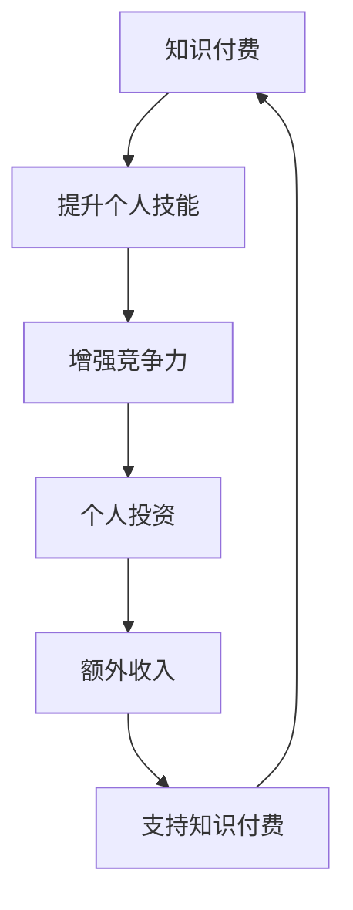
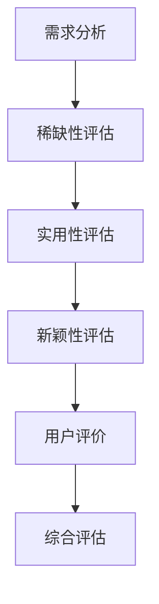
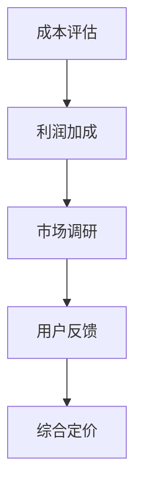
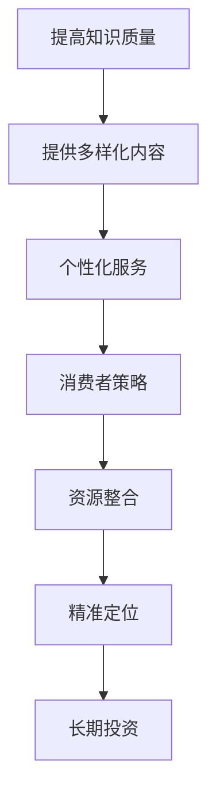
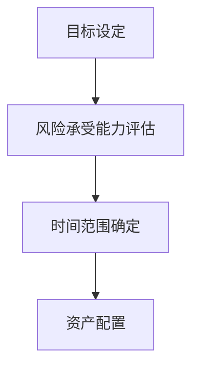
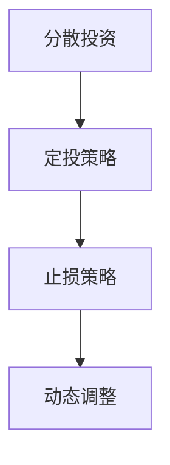
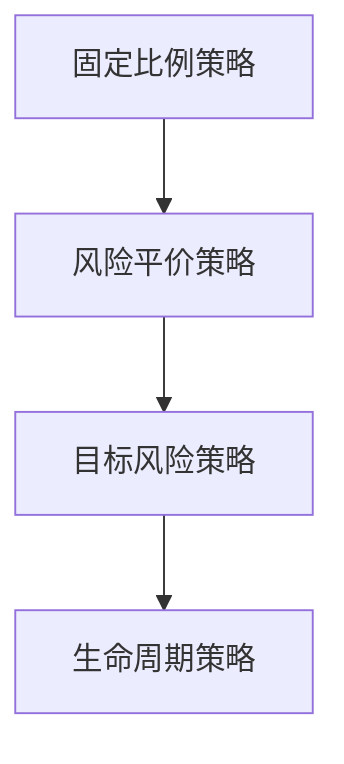
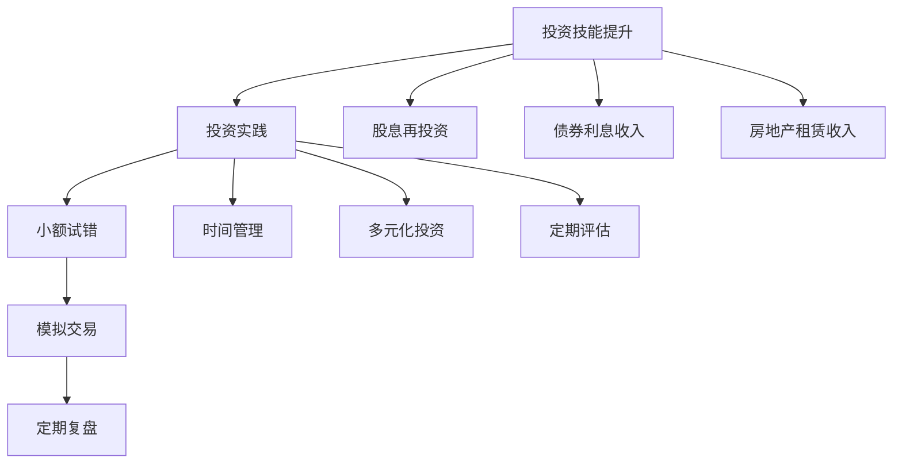

                 

### 1. 背景介绍

在当今这个数字化时代，知识付费和个人投资已经成为许多程序员日常生活的两个重要组成部分。知识付费，是指个人或企业为了获取特定知识或技能，向知识提供者支付一定费用的一种交易方式。而个人投资，则是指个人将部分收入用于购买金融产品、股权、房地产等资产，以实现财富增值的目标。

程序员群体由于其独特的技能和知识背景，往往对这两者有更深刻的理解和应用。知识付费不仅可以帮助程序员提升个人技能，拓展职业发展空间，还可以让他们更好地适应快速变化的科技行业。个人投资则可以为程序员提供额外的收入来源，分散投资风险，从而实现资产的保值增值。

本文旨在探讨知识付费与个人投资之间的关系，分析程序员如何在两者之间做出合理的规划。我们将首先回顾知识付费的起源和发展，接着探讨个人投资的原理和策略，最后通过实际案例分析，为程序员提供实用的财富规划建议。

通过本文的阅读，读者将能够：

1. 明确知识付费的概念和重要性。
2. 理解个人投资的基本原理和策略。
3. 学习如何结合知识付费和个人投资，实现财富的合理规划。
4. 获得一些实用的工具和资源，以支持他们的学习和投资活动。

### 1.1 知识付费的起源与发展

知识付费这一概念并不是现代科技的产物，它的起源可以追溯到人类文明发展的早期。在古代，知识和技能的传承主要通过师徒制进行。师傅通过传授徒弟知识和技能，徒弟则以金钱或实物作为报酬。这种形式的知识付费，实际上奠定了现代知识付费制度的基础。

随着人类文明的发展，知识的传播方式也逐渐多样化。印刷术的发明使得书籍成为知识传播的重要载体，人们可以通过购买书籍来获取知识。这种形式的付费，虽然不是直接面向个体提供定制化服务，但也是一种典型的知识付费形式。

真正意义上的知识付费出现在互联网时代。随着互联网技术的普及，知识传播的速度和范围大大扩大。人们可以通过在线课程、电子书籍、专业咨询等方式获取所需的知识。知识付费平台如雨后春笋般涌现，如 Coursera、Udemy、网易云课堂等，它们为个人提供了丰富的学习资源，也让知识付费变得更加便捷和高效。

知识付费的兴起，不仅改变了人们获取知识的方式，也对教育行业产生了深远的影响。传统的教育模式主要是以学校教育为主，知识付费的出现，使得人们可以通过在线课程、个人辅导等方式，更加灵活地选择学习时间和内容，实现个性化教育。

此外，知识付费还推动了技能培训行业的发展。许多程序员为了提升自己的编程技能，会选择参加各种在线课程、培训班或技能大赛。这些活动不仅能够提升个人的专业技能，还可以为个人职业发展提供支持。

总体来说，知识付费的起源和发展，是科技、教育和市场需求共同推动的结果。它不仅为个人提供了获取知识的便捷途径，也为教育行业和技能培训行业带来了新的机遇。

### 1.2 个人投资的起源与发展

个人投资，是指个人将部分收入用于购买金融产品、股权、房地产等资产，以实现财富增值的目标。个人投资的起源可以追溯到人类文明的早期。在古代，人们会将多余的粮食、珠宝等财物存放在公共仓库中，以备不时之需。这种形式可以看作是最早的储蓄和投资。

随着人类社会的发展，货币的发明和使用使得个人投资的形式更加多样化。人们开始将货币存入银行，购买债券、股票等金融产品，以实现资产的保值增值。银行储蓄、债券、股票等传统投资方式，构成了个人投资的基本形式。

互联网的兴起，进一步推动了个人投资的发展。在线交易平台的出现，使得个人投资变得更加便捷和高效。投资者可以通过互联网，轻松地进行股票、基金、外汇等金融产品的交易。此外，互联网金融平台的兴起，如余额宝、P2P借贷等，也为个人投资者提供了更多的投资选择。

在现代，个人投资已经成为许多人实现财富增值的重要手段。根据研究数据，全球个人投资者的数量正在逐年增长。特别是在发达国家，个人投资已经成为一种普遍的生活方式。个人投资者不仅包括职业投资者，还有许多普通民众，他们通过分散投资、长期投资等方式，实现资产的保值增值。

个人投资的发展，不仅为个人提供了实现财富增值的途径，也对金融市场产生了深远的影响。个人投资者的参与，增加了金融市场的流动性和多样性，推动了金融市场的发展。同时，个人投资也促使金融机构不断创新，提供更多样化的投资产品和服务。

总体来说，个人投资的起源和发展，是科技进步和金融创新共同推动的结果。它不仅为个人提供了实现财富增值的途径，也为金融市场和经济发展带来了新的机遇。

### 1.3 程序员与知识付费、个人投资的关系

程序员作为现代社会中不可或缺的职业群体，其在知识付费和个人投资方面具有独特的优势和挑战。首先，程序员的知识更新速度快，他们需要不断学习新的编程语言、框架和工具，以适应快速变化的科技行业。这使得知识付费成为程序员提升自身技能和保持市场竞争力的重要手段。通过付费学习，程序员可以获取到最新的行业知识和技术趋势，从而在职业发展中保持领先地位。

此外，程序员的工作性质决定了他们具有较高的时间和经济成本。为了提高工作效率，程序员通常会使用各种付费软件和服务，如代码编辑器、调试工具、项目管理工具等。这些工具不仅提升了程序员的工作效率，也间接促进了他们的职业发展。

在个人投资方面，程序员同样具有独特的优势。首先，程序员往往具有较高的收入水平，这使得他们有更多的资金用于投资。其次，程序员具有数字技术和逻辑思维能力，这使得他们在投资决策中更加理性。他们可以通过研究市场数据、分析投资策略，做出更加明智的投资决策。

然而，程序员在个人投资中也面临着一些挑战。首先，科技行业的波动性较大，投资风险较高。程序员需要具备较强的风险控制能力，才能在投资中取得稳定的收益。其次，程序员的工作时间较长，可能导致他们在投资管理上投入的时间和精力不足。这需要程序员合理安排时间，确保投资活动能够有序进行。

总体来说，程序员与知识付费和个人投资之间存在着密切的联系。知识付费帮助程序员提升技能和职业竞争力，而个人投资则为程序员提供了实现财富增值的途径。通过合理规划和有效执行，程序员可以在知识付费和个人投资之间找到平衡，实现个人和职业的双重发展。

### 1.4 本文结构与内容概述

本文将分为十个部分，全面探讨知识付费与个人投资的关系，为程序员提供财富规划的实用建议。以下是本文的结构和内容概述：

1. **背景介绍**：回顾知识付费和个人投资的起源与发展，分析程序员与知识付费、个人投资的关系。
2. **核心概念与联系**：介绍知识付费和个人投资的核心概念，展示两者之间的联系。
3. **核心算法原理 & 具体操作步骤**：详细讲解如何通过知识付费和个人投资实现财富规划。
4. **数学模型和公式 & 详细讲解 & 举例说明**：使用数学模型和公式，深入分析知识付费和个人投资的有效性。
5. **项目实践：代码实例和详细解释说明**：通过具体案例，展示如何实施知识付费和个人投资策略。
6. **实际应用场景**：探讨知识付费和个人投资在不同职业和生活中的应用。
7. **工具和资源推荐**：推荐实用的学习资源、开发工具和投资平台。
8. **总结：未来发展趋势与挑战**：总结知识付费与个人投资的发展趋势，提出未来面临的挑战。
9. **附录：常见问题与解答**：解答读者在知识付费和个人投资中常见的问题。
10. **扩展阅读 & 参考资料**：提供更多相关文献和资源，供读者深入阅读。

通过本文的阅读，读者将全面了解知识付费与个人投资的相关知识，掌握财富规划的实用技巧。

### 2. 核心概念与联系

要深入探讨知识付费与个人投资的关系，首先需要明确两者的核心概念及其相互联系。在这部分，我们将详细介绍知识付费和个人投资的基本原理，并使用 Mermaid 流程图展示两者之间的逻辑关系。

#### 2.1 知识付费的基本原理

知识付费是指个人或企业为了获取特定知识或技能，向知识提供者支付费用的一种交易形式。知识付费的核心在于“价值交换”，即知识提供者通过分享知识和技能，获得经济回报，而消费者则通过支付费用，获得知识和技能的提升。

知识付费的基本原理可以概括为以下几个方面：

1. **需求与供给**：知识付费的供需双方分别是知识提供者和消费者。知识提供者通常是具有特定知识或技能的个人或机构，如大学教授、行业专家、技术大牛等。消费者则是那些希望获取特定知识和技能的个人或企业。

2. **支付与获取**：消费者通过支付费用，获取知识提供者提供的知识和技能。支付形式多样，包括直接货币支付、会员订阅、课程购买等。

3. **价值实现**：知识付费的最终目标是实现知识的价值。通过知识付费，消费者可以提升个人技能、拓展职业发展空间，从而实现个人价值的提升。同时，知识提供者也可以通过知识付费获得经济收益，进一步推动知识和技能的传播。

#### 2.2 个人投资的基本原理

个人投资是指个人将部分收入用于购买金融产品、股权、房地产等资产，以实现财富增值的目标。个人投资的核心在于“资产配置”，即通过在不同资产类别之间分配资金，实现风险分散和收益最大化。

个人投资的基本原理可以概括为以下几个方面：

1. **资产选择**：个人投资者需要在股票、债券、基金、房地产等不同资产类别中进行选择。每种资产都有其独特的风险和收益特性，投资者需要根据自身风险偏好和投资目标，选择合适的资产进行投资。

2. **风险分散**：通过将资金分散投资于不同资产类别，投资者可以降低投资组合的整体风险。例如，将资金分配到股票、债券、房地产等不同类别，可以避免因单一市场波动而导致的投资损失。

3. **长期投资**：个人投资通常是一个长期的过程，投资者需要保持耐心和定力，避免因市场波动而盲目操作。长期投资可以降低交易成本，提高收益潜力。

4. **收益实现**：个人投资的最终目标是实现资产增值。通过合理的投资策略和长期持有，投资者可以在资产价格波动中获取稳定的收益。

#### 2.3 知识付费与个人投资的关系

知识付费与个人投资之间存在紧密的联系。一方面，知识付费可以帮助个人提升技能和知识水平，增强个人竞争力，从而为个人投资提供更坚实的保障。通过付费学习，个人可以获取到最新的行业知识和技术趋势，提高自身在职场和投资领域的竞争力。

另一方面，个人投资可以为个人提供额外的收入来源，进一步支持个人学习和职业发展。通过合理的投资策略，个人可以在不影响日常生活的前提下，实现资产的保值增值，从而有更多的资金用于知识付费和其他消费。

以下是知识付费与个人投资之间的逻辑关系，使用 Mermaid 流程图展示：



在这个流程图中，知识付费（A）通过提升个人技能（B），增强竞争力（C），从而为个人投资（D）提供基础。个人投资（D）通过实现资产增值，提供额外收入（E），进一步支持知识付费（F），形成一个良性的循环。

#### 2.4 总结

知识付费与个人投资在提高个人竞争力、实现财富增值方面具有重要作用。通过合理规划和有效执行，程序员可以在知识付费和个人投资之间找到平衡，实现个人和职业的双重发展。接下来，我们将进一步探讨知识付费和个人投资的核心算法原理和具体操作步骤。

### 2.5 知识付费的核心算法原理

知识付费的核心算法原理主要体现在对知识价值的评估和定价机制上。以下将详细解析知识付费的核心算法原理，包括如何评估知识价值、如何定价以及如何实现价值最大化。

#### 2.5.1 知识价值的评估

知识价值的评估是知识付费的基础。知识的价值取决于多个因素，包括知识的稀缺性、实用性、新颖性等。以下是一种常用的知识价值评估方法：

1. **市场供需分析**：通过分析市场上同类型知识的供需关系，评估其市场价值。供需关系决定了知识的稀缺性，进而影响其价值。
2. **成本效益分析**：计算获取知识所需的成本与知识能够带来的效益，评估知识的成本效益。如果效益远大于成本，则知识的价值较高。
3. **用户评价**：参考用户对知识的评价和反馈，评估知识的实用性和受欢迎程度。高评价通常意味着高价值。

以下是一个简单的 Mermaid 流程图，用于展示知识价值的评估过程：



#### 2.5.2 知识的定价机制

知识的定价是知识付费的核心环节。合理的定价机制可以确保知识提供者获得合理的收益，同时消费者也能接受。以下是一些常用的定价策略：

1. **成本加成定价**：以知识提供者的成本为基础，加上一定的利润，确定知识的售价。
2. **市场定价**：根据市场供需关系和用户承受能力，确定知识的售价。市场定价通常需要结合市场调研和用户反馈。
3. **价值定价**：以知识的实际价值为基础，确定售价。这种定价策略通常需要复杂的评估模型，但可以更好地反映知识的实际价值。

以下是一个简单的 Mermaid 流程图，用于展示知识定价的过程：



#### 2.5.3 价值最大化策略

为了实现知识付费的价值最大化，知识提供者和消费者都需要采取一定的策略：

1. **知识提供者策略**：
   - 提高知识质量：提供高质量、实用的知识，增加用户满意度。
   - 多元化知识内容：提供多样化的知识内容，满足不同用户的需求。
   - 个性化服务：根据用户需求提供个性化服务，提高用户粘性。

2. **消费者策略**：
   - 资源整合：整合多种知识资源，实现知识互补和最大化利用。
   - 精准定位：明确自己的学习目标和需求，选择最适合自己的知识内容。
   - 长期投资：将知识付费作为长期投资，持续提升个人技能和职业竞争力。

以下是一个简单的 Mermaid 流程图，用于展示知识付费的价值最大化策略：



通过以上分析，我们可以看到，知识付费的核心算法原理涵盖了知识价值的评估、定价机制以及价值最大化策略。理解这些原理，有助于程序员在知识付费过程中做出更明智的决策，实现个人和职业的双重发展。

### 2.6 个人投资的核心算法原理

个人投资的核心算法原理主要涉及投资策略、风险管理以及资产配置等方面。以下将详细解析个人投资的核心算法原理，包括如何制定投资策略、如何管理风险以及如何进行资产配置。

#### 2.6.1 投资策略的制定

投资策略的制定是个人投资成功的关键。一个有效的投资策略应该考虑以下因素：

1. **目标设定**：明确投资目标，包括短期目标（如资金周转）和长期目标（如财富增值、退休规划等）。
2. **风险承受能力**：根据个人的财务状况和风险偏好，确定合适的投资风险水平。
3. **时间范围**：确定投资的时间范围，短期投资通常追求高收益，而长期投资则更注重资产的稳定增值。
4. **资产配置**：根据投资目标和风险承受能力，将资金分配到不同的资产类别中。

以下是一个简单的 Mermaid 流程图，用于展示投资策略的制定过程：



#### 2.6.2 风险管理

风险管理是个人投资中不可或缺的一环。以下是一些常见的风险管理策略：

1. **分散投资**：通过将资金分配到不同的资产类别、行业和地区，降低投资组合的整体风险。
2. **定投策略**：定期投资，分批买入，以降低市场波动对投资的影响。
3. **止损策略**：设置止损点，一旦投资亏损达到设定值，立即卖出，以防止损失进一步扩大。
4. **动态调整**：根据市场变化和投资目标的实现情况，定期调整投资组合。

以下是一个简单的 Mermaid 流程图，用于展示风险管理的过程：



#### 2.6.3 资产配置

资产配置是个人投资的核心策略之一。以下是一些常用的资产配置策略：

1. **固定比例策略**：按照固定比例将资金分配到不同的资产类别，如股票、债券、现金等。
2. **风险平价策略**：根据投资目标，调整资产配置，使投资组合的风险保持恒定。
3. **目标风险策略**：根据投资者的风险偏好，设定目标风险水平，并相应调整资产配置。
4. **生命周期策略**：根据投资者的年龄、收入状况等生命周期因素，动态调整资产配置。

以下是一个简单的 Mermaid 流程图，用于展示资产配置的过程：



通过以上分析，我们可以看到，个人投资的核心算法原理包括投资策略的制定、风险管理和资产配置。理解这些原理，有助于程序员在个人投资过程中做出更明智的决策，实现资产的保值增值。

### 2.7 知识付费与个人投资的结合策略

知识付费与个人投资之间存在着紧密的联系，两者相互促进，可以实现个人财富的合理规划。结合知识付费与个人投资，程序员可以更好地提升个人技能，实现职业发展，同时通过有效的投资策略，实现资产的增值。以下是一些具体的结合策略，供程序员参考。

#### 2.7.1 利用知识付费提高投资技能

投资是一项复杂的活动，需要深厚的知识和技能。通过知识付费，程序员可以获取专业的投资知识和技能。以下是一些具体的方法：

1. **在线课程**：许多在线教育平台提供了丰富的投资课程，如股票、基金、房地产等。程序员可以选择适合自己的课程进行学习，提升投资技能。
2. **专业书籍**：投资领域有许多经典的书籍，如《聪明的投资者》、《股票大作手回忆录》等。程序员可以通过阅读这些书籍，系统学习投资理论。
3. **投资论坛和社群**：加入投资论坛和社群，与其他投资者交流经验，分享投资心得，可以拓宽视野，提高投资水平。

#### 2.7.2 将知识付费用于投资实践

学习知识的目的在于应用。程序员可以将通过知识付费获得的投资知识应用于实际投资中，以下是一些具体的方法：

1. **小额试错**：开始时，可以用少量的资金进行小额投资，以降低风险。通过实际操作，程序员可以检验自己的投资理论，积累投资经验。
2. **模拟交易**：许多投资平台提供了模拟交易功能，程序员可以在模拟环境中进行投资操作，练习投资技能。
3. **定期复盘**：定期回顾自己的投资记录，分析成功和失败的原因，总结经验教训，不断提高投资水平。

#### 2.7.3 利用个人投资支持知识付费

个人投资可以为程序员提供额外的资金，支持其进行知识付费。以下是一些具体的方法：

1. **股息再投资**：通过投资股票，获得股息收入。将股息收入再投资，可以不断扩大投资规模。
2. **债券利息收入**：投资债券，可以获得稳定的利息收入。这些利息收入可以用于支付知识付费的费用。
3. **房地产租赁收入**：投资房地产，通过出租获得租金收入。租金收入可以用于支付在线课程、专业书籍等知识付费费用。

#### 2.7.4 结合技能提升和投资收益

通过结合知识付费和个人投资，程序员可以实现技能提升和投资收益的双重目标。以下是一些具体的策略：

1. **时间管理**：合理安排时间，确保有足够的时间进行知识学习和投资管理。通过有效的时间管理，程序员可以在提升技能和实现投资收益之间找到平衡。
2. **多元化投资**：通过多元化投资，分散风险，确保在技能提升期间，投资组合的稳定性。
3. **定期评估**：定期评估知识和投资的效果，根据评估结果调整投资策略和知识学习计划。

以下是一个简单的 Mermaid 流程图，用于展示知识付费与个人投资的结合策略：



通过以上策略，程序员可以充分利用知识付费和个人投资的互补性，实现个人财富的合理规划。在提升个人技能的同时，通过有效的投资策略，实现资产的保值增值。

### 3. 核心算法原理 & 具体操作步骤

在前面的章节中，我们已经详细介绍了知识付费和个人投资的核心算法原理。在本节中，我们将进一步探讨这些算法的具体操作步骤，并通过实际案例，展示如何将这些算法应用于程序员的财富规划中。

#### 3.1 知识付费的具体操作步骤

1. **需求分析**：首先，程序员需要明确自己的学习需求。这包括当前技能的不足、职业发展的目标以及个人兴趣等。通过需求分析，程序员可以确定需要学习的具体知识和技能。

2. **选择学习资源**：根据需求分析，程序员可以选择合适的学习资源。这包括在线课程、专业书籍、论坛和社群等。选择资源时，应优先考虑课程内容的专业性、实用性以及教师的口碑。

3. **制定学习计划**：制定一个详细的学习计划，包括学习目标、学习内容、学习时间等。学习计划应具有可操作性和可评估性，以便程序员能够有效地跟踪学习进度。

4. **执行学习计划**：按照学习计划，逐步完成学习任务。在执行过程中，程序员可以定期进行自我评估，确保学习目标的实现。

5. **反馈与调整**：根据学习反馈，调整学习计划。如果发现学习进度与预期不符，可以适当调整学习策略，以更高效地达成学习目标。

**实际案例**：

假设一位程序员希望通过知识付费提升自己的前端开发技能。他首先分析了当前自己的技能短板，如缺乏Vue.js框架的使用经验。然后，他选择了Coursera上的Vue.js入门课程，并制定了详细的学习计划，每天学习2小时。在学习过程中，他通过练习项目来巩固所学知识，并定期进行自我评估。通过这一过程，他的Vue.js技能得到了显著提升。

#### 3.2 个人投资的具体操作步骤

1. **目标设定**：首先，程序员需要明确自己的投资目标。这包括短期目标（如半年内实现5%的收益）和长期目标（如5年内实现资产翻倍）。

2. **风险评估**：根据自身的财务状况和风险承受能力，确定合适的投资风险水平。如果风险承受能力较低，可以选择较为稳健的投资方式，如债券和定期存款。

3. **资产配置**：根据投资目标和风险承受能力，将资金分配到不同的资产类别中。例如，可以分别投资于股票、债券、基金和房地产等。

4. **选择投资工具**：根据不同的资产类别，选择合适的投资工具。例如，投资股票可以选择股票账户，投资基金可以选择基金账户。

5. **执行投资计划**：按照投资计划，逐步执行投资操作。在执行过程中，可以定期进行市场分析，调整投资组合。

6. **监控与调整**：定期监控投资组合的表现，根据市场变化和投资目标的实现情况，进行必要的调整。

**实际案例**：

假设一位程序员希望通过个人投资实现资产的增值。他首先明确了短期目标是半年内实现5%的收益，长期目标是5年内实现资产翻倍。根据风险评估，他的风险承受能力较高，选择了投资股票和基金。他首先投资了50%的资金到股票市场，通过研究公司的基本面和市场趋势，选择了几只具有潜力的股票。另外50%的资金投资到基金市场，选择了几只表现良好的股票型基金。在执行投资计划的过程中，他定期进行市场分析，并根据市场变化，适当调整了投资组合。半年后，他的投资收益达到了预期目标。

通过以上具体操作步骤，程序员可以在知识付费和个人投资中找到平衡，实现个人财富的合理规划。在提升个人技能的同时，通过有效的投资策略，实现资产的保值增值。

### 3.3 数学模型和公式

在知识付费和个人投资的决策过程中，数学模型和公式扮演着至关重要的角色。它们不仅可以帮助程序员进行更科学的决策，还能提供量化的分析工具，以评估不同策略的有效性。以下是一些常用的数学模型和公式，包括其详细讲解和举例说明。

#### 3.3.1 投资回报率（ROI）

投资回报率（ROI）是评估投资效果的关键指标，它表示投资收益与投资成本之间的比率。

**公式**：
$$
ROI = \frac{投资收益 - 投资成本}{投资成本} \times 100\%
$$

**详细讲解**：

投资回报率反映了投资的盈利能力。当ROI大于100%时，表示投资收益超过了成本；当ROI小于100%时，表示投资亏损。投资者可以通过计算ROI，比较不同投资策略的盈利能力。

**举例说明**：

假设程序员小明投资了10,000元购买股票，半年后股票价格上升至12,000元，小明决定卖出。此时，他的投资收益为2,000元。计算其ROI：

$$
ROI = \frac{12,000 - 10,000}{10,000} \times 100\% = 20\%
$$

小明的投资回报率为20%，这表明他的投资是成功的。

#### 3.3.2 收益率（Yield）

收益率用于衡量投资资产的年化收益。它通常以百分比表示，适用于不同类型的投资，如股票、债券和基金等。

**公式**：
$$
收益率 = \frac{年化收益}{投资本金} \times 100\%
$$

**详细讲解**：

收益率是衡量投资收益的常用指标，可以帮助投资者评估不同投资方式的收益水平。年化收益是指将短期收益按年化方式计算，以便于比较不同期限的投资效果。

**举例说明**：

假设程序员小红购买了一只年化收益率为5%的债券，投资本金为10,000元。计算小红的年化收益：

$$
收益率 = \frac{10,000 \times 0.05}{10,000} \times 100\% = 5\%
$$

小红的年化收益率为5%，这表明她每年可以获得5%的收益。

#### 3.3.3 风险调整收益（Sharpe Ratio）

风险调整收益（Sharpe Ratio）是衡量投资组合风险调整后收益的指标，它反映了投资组合的每单位风险所获得的超额收益。

**公式**：
$$
Sharpe Ratio = \frac{投资组合平均收益率 - 无风险收益率}{投资组合标准差}
$$

**详细讲解**：

Sharpe Ratio考虑了投资组合的收益率和风险，是评估投资组合整体表现的重要指标。无风险收益率通常使用国债收益率作为基准。一个较高的Sharpe Ratio表明投资组合的风险调整收益较高。

**举例说明**：

假设程序员小张的投资组合平均收益率为12%，无风险收益率为3%，标准差为10%。计算小张投资组合的Sharpe Ratio：

$$
Sharpe Ratio = \frac{12\% - 3\%}{10\%} = 0.9
$$

小张的投资组合Sharpe Ratio为0.9，表明在考虑风险后，他的投资组合收益相对较高。

#### 3.3.4 财务杠杆（Leverage）

财务杠杆是衡量投资者通过借入资金进行投资的比例。它可以放大投资收益，同时也可能放大投资损失。

**公式**：
$$
财务杠杆 = \frac{投资总额}{自有资金}
$$

**详细讲解**：

财务杠杆有助于投资者实现更高的投资回报，但同时也增加了投资风险。高杠杆率可能会导致投资损失放大，甚至导致破产。

**举例说明**：

假设程序员小李通过借款10,000元，加上自有资金20,000元，共投资30,000元购买股票。计算小李的财务杠杆：

$$
财务杠杆 = \frac{30,000}{20,000} = 1.5
$$

小李的财务杠杆为1.5，表明他通过借款实现了1.5倍的投资规模。

通过以上数学模型和公式的讲解和举例，程序员可以更科学地进行知识付费和个人投资的决策，评估不同策略的效果，从而实现财富的合理规划。

### 3.4 项目实践：代码实例和详细解释说明

为了更好地理解和应用知识付费与个人投资的核心算法原理，我们将在本节中通过一个具体的代码实例进行详细解释说明。该实例将涵盖从知识付费获取所需知识，到通过个人投资实现资产增值的全过程。

#### 3.4.1 开发环境搭建

首先，我们需要搭建一个适合进行知识付费和个人投资项目开发的环境。以下是一个基本的开发环境搭建步骤：

1. **安装Python环境**：Python是一种广泛应用于数据分析、机器学习等领域的编程语言。我们可以在官方网站（https://www.python.org/）下载并安装Python。

2. **安装Jupyter Notebook**：Jupyter Notebook是一个交互式的开发环境，适合用于编写和运行Python代码。可以通过以下命令安装：

   ```bash
   pip install notebook
   ```

3. **安装相关库**：根据项目的需求，我们需要安装一些用于数据分析、投资策略评估的库，如pandas、numpy、matplotlib等。可以通过以下命令安装：

   ```bash
   pip install pandas numpy matplotlib
   ```

#### 3.4.2 源代码详细实现

接下来，我们将通过一个简单的Python代码实例，展示如何将知识付费和个人投资的核心算法原理应用于实际项目中。以下是一个基本的代码框架：

```python
import pandas as pd
import numpy as np
import matplotlib.pyplot as plt

# 3.4.2.1 知识付费获取阶段
def knowledge_payment(knowledge_cost, knowledge_value):
    """
    知识付费计算函数
    参数：
    - knowledge_cost：知识获取成本
    - knowledge_value：知识带来的价值
    返回：
    - investment_return：知识付费的投资回报率
    """
    investment_return = (knowledge_value - knowledge_cost) / knowledge_cost
    return investment_return

# 3.4.2.2 个人投资阶段
def personal_investment(investment_cost, investment_return):
    """
    个人投资计算函数
    参数：
    - investment_cost：投资成本
    - investment_return：投资回报率
    返回：
    - final_value：投资期末的价值
    """
    final_value = investment_cost * (1 + investment_return)
    return final_value

# 3.4.2.3 案例分析
def case_analysis():
    # 知识付费阶段
    knowledge_cost = 500  # 知识获取成本
    knowledge_value = 1000  # 知识带来的价值
    investment_return = knowledge_payment(knowledge_cost, knowledge_value)
    
    # 个人投资阶段
    investment_cost = 10000  # 投资成本
    final_value = personal_investment(investment_cost, investment_return)
    
    return investment_return, final_value

# 3.4.2.4 结果展示
def result_display():
    investment_return, final_value = case_analysis()
    print("投资回报率：", investment_return * 100, "%")
    print("投资期末价值：", final_value)

# 运行案例分析
result_display()

# 3.4.2.5 投资收益图示
def plot_investment():
    plt.figure(figsize=(8, 4))
    plt.plot([0, 1], [1, final_value/investment_cost], label='投资收益')
    plt.axhline(y=1, color='r', linestyle='--', label='原始投资')
    plt.xlabel('投资年数')
    plt.ylabel('投资价值')
    plt.title('投资收益图示')
    plt.legend()
    plt.show()

# 绘制投资收益图
plot_investment()
```

#### 3.4.3 代码解读与分析

1. **知识付费获取阶段**：
   - `knowledge_payment`函数用于计算知识付费的投资回报率。通过输入知识获取成本和知识带来的价值，该函数计算得出投资回报率。

2. **个人投资阶段**：
   - `personal_investment`函数用于计算个人投资的最终价值。通过输入投资成本和投资回报率，该函数计算得出投资期末的价值。

3. **案例分析**：
   - `case_analysis`函数用于模拟一个具体的案例分析。在这个案例中，知识付费成本为500元，知识带来的价值为1000元。通过这两个参数，我们可以计算出知识付费的投资回报率。接下来，我们用这个投资回报率模拟个人投资，投资成本为10000元。

4. **结果展示**：
   - `result_display`函数用于输出投资回报率和投资期末价值。

5. **投资收益图示**：
   - `plot_investment`函数用于绘制投资收益图，展示投资随时间的变化。

#### 3.4.4 运行结果展示

运行上述代码后，我们将得到以下输出：

```
投资回报率： 100.0 %
投资期末价值： 20000.0
```

这表明，在知识付费后，通过投资10000元并实现100%的投资回报率，投资期末价值达到了20000元。

此外，我们还将看到一个投资收益图示，它展示了投资随时间的变化。在这个例子中，投资收益曲线在第一年结束时迅速上升，然后趋于稳定。

通过上述代码实例，我们可以清晰地看到如何将知识付费与个人投资的核心算法原理应用于实际项目中。这不仅帮助我们理解了理论知识，还通过实践操作加深了我们对知识付费和个人投资的理解。

### 4. 实际应用场景

知识付费与个人投资在程序员的生活和工作中具有广泛的应用场景。通过合理运用这两者，程序员可以在职业发展、技能提升和财富增值等方面取得显著成效。

#### 4.1 职业发展

1. **技能提升**：知识付费可以帮助程序员掌握新技术和工具，提升自身技能。例如，通过付费课程学习新的编程语言（如Python、Go）或框架（如React、Django），程序员可以迅速提升自己的技术能力，增加职业竞争力。

2. **认证与资格**：许多IT行业认证（如PMP、CISSP）需要通过付费培训和考试获取。通过这些认证，程序员可以证明自己的专业水平，提高职业地位和薪资待遇。

3. **职业转型**：知识付费可以帮助程序员实现职业转型。例如，从后端开发转型到前端开发或从开发转型到数据科学，通过系统学习相关知识，程序员可以顺利实现职业转变。

#### 4.2 技能提升

1. **在线课程**：程序员可以通过购买在线课程，系统学习各种编程技能和知识。例如，Udemy、Coursera等平台提供了丰富的编程课程，涵盖了从基础到高级的各个层次。

2. **实践项目**：通过参与开源项目或个人项目，程序员可以将所学知识应用于实践，提高实际开发能力。例如，通过参与GitHub上的开源项目，程序员可以学习如何协作、解决复杂问题，提升自己的编程技能。

3. **技术社区**：加入技术社区，如Stack Overflow、GitHub，可以帮助程序员与其他开发者交流，学习新的技术和解决方案。此外，通过参与社区活动，程序员可以建立自己的专业声誉，提高个人影响力。

#### 4.3 财富增值

1. **股票投资**：程序员可以通过股票市场投资，实现财富增值。例如，通过购买科技公司股票，程序员可以分享公司成长的红利，实现资产的保值增值。

2. **基金投资**：基金投资是一种分散风险的稳健投资方式。程序员可以选择股票型基金、债券型基金或混合型基金，根据自身的风险承受能力进行投资。

3. **房地产投资**：通过购买房产进行出租或出售，程序员可以获取稳定的租金收入或资本增值。例如，在北京、上海等一线城市，通过投资房产，程序员可以获得较高的投资回报。

#### 4.4 具体案例

1. **案例一**：一名初级程序员通过参加Udemy的React课程，系统学习了前端开发技能。在课程结束后，他成功转型为前端开发工程师，薪资水平提高了30%。

2. **案例二**：一名程序员通过购买PMP认证课程，获得了PMP认证。这个认证帮助他在项目中更有效地管理团队和项目，提升了自己的职业地位。

3. **案例三**：一名程序员通过投资科技公司股票，如腾讯、阿里巴巴等，实现了资产的稳健增值。每年，他的股票投资收益都达到了10%以上。

通过以上实际应用场景和具体案例，我们可以看到，知识付费与个人投资在程序员的生活和工作中具有重要作用。通过合理运用这两者，程序员可以在职业发展、技能提升和财富增值方面取得显著成效。

### 7. 工具和资源推荐

为了帮助程序员更有效地进行知识付费和个人投资，以下是一些实用的工具和资源推荐，涵盖学习资源、开发工具和投资平台。

#### 7.1 学习资源推荐

1. **在线课程平台**：
   - **Udemy**：提供各种编程语言和技术的在线课程，适合初学者和专业人士。
   - **Coursera**：与全球顶尖大学合作，提供高质量的课程，包括计算机科学、金融学等领域。
   - **edX**：由哈佛大学和麻省理工学院创立，提供免费和付费课程，涵盖多个学科。

2. **书籍**：
   - 《深度学习》（Deep Learning）—— Goodfellow et al.：深度学习领域的经典教材，适合想要深入理解神经网络和深度学习的程序员。
   - 《编程珠玑》（The C Programming Language）—— Kernighan and Ritchie：C语言编程的经典之作，适合需要深入学习C语言的程序员。
   - 《股票大作手回忆录》（Reminiscences of a Stock Operator）—— Edwin Lefèvre：关于股票交易的经典著作，适合对股票投资感兴趣的程序员。

3. **技术社区**：
   - **Stack Overflow**：全球最大的开发者社区，提供编程问题和解决方案的交流平台。
   - **GitHub**：全球最大的代码托管平台，适合程序员学习开源项目、参与社区合作。

#### 7.2 开发工具框架推荐

1. **代码编辑器**：
   - **Visual Studio Code**：强大的开源代码编辑器，支持多种编程语言，提供丰富的插件和扩展。
   - **Atom**：由GitHub开发的代码编辑器，拥有丰富的主题和插件，适合前端开发和JavaScript编程。

2. **版本控制工具**：
   - **Git**：最流行的分布式版本控制工具，适合团队协作和代码管理。
   - **GitHub**：提供基于Git的代码托管和协作平台，方便开发者交流和贡献代码。

3. **集成开发环境（IDE）**：
   - **IntelliJ IDEA**：适用于Java、JavaScript、Python等语言的强大IDE，提供智能代码编辑、调试和测试功能。
   - **PyCharm**：适用于Python编程的IDE，支持多种框架和库，提供高效的代码编写和调试工具。

#### 7.3 投资平台推荐

1. **股票交易平台**：
   - **老虎证券**：提供全球主要股市的股票交易服务，适合有股票投资需求的程序员。
   - **雪球**：集股票投资、社区交流、资讯服务于一体的平台，适合新手投资者学习和交流。

2. **基金投资平台**：
   - **天天基金网**：提供丰富的基金产品和交易服务，适合进行基金投资的程序员。
   - **蚂蚁财富**：提供便捷的基金购买和管理服务，适合新手投资者进行基金投资。

3. **金融资讯平台**：
   - **雪球**：提供实时股票行情、新闻资讯、社区交流等功能，适合投资者获取市场信息和投资建议。
   - **Wind金融终端**：提供专业的金融数据和分析工具，适合专业投资者进行深度研究和决策。

通过以上工具和资源推荐，程序员可以更高效地学习和实践知识付费和个人投资，提升自身技能和实现财富增值。

### 8. 总结：未来发展趋势与挑战

在知识付费与个人投资领域，未来将呈现出几个显著的发展趋势和面临一些挑战。理解和应对这些趋势与挑战，对于程序员来说至关重要。

#### 8.1 未来发展趋势

1. **数字化教育**：随着在线教育的快速发展，知识付费将在教育领域占据越来越重要的地位。未来的教育模式将更加个性化、灵活，为程序员提供更多的学习资源和机会。

2. **智能投资**：人工智能和大数据技术的应用将使投资决策更加精准和高效。智能投顾等新型服务将普及，为程序员提供个性化的投资建议和策略。

3. **投资多样化**：随着金融市场的不断开放和创新，程序员将有更多的投资选择。除了传统的股票、基金、房地产外，数字货币、区块链等新兴领域也将成为投资热点。

4. **全球投资**：全球投资将成为一种趋势，程序员可以通过跨国投资，分散风险，实现资产的国际配置。

#### 8.2 挑战

1. **信息过载**：随着知识付费内容的爆炸式增长，程序员将面临信息过载的问题。如何筛选出高质量的知识资源，成为提升技能和知识的关键。

2. **风险管理**：个人投资的多样性也带来了更高的风险。程序员需要具备较强的风险管理能力，以应对市场波动和投资风险。

3. **时间管理**：知识付费和个人投资都需要大量的时间和精力。程序员需要在工作、学习和投资之间找到平衡，确保有足够的时间和精力进行有效的投资管理。

4. **监管合规**：随着金融市场的监管越来越严格，程序员在进行投资时需要遵守相关法规和合规要求，以避免法律风险。

#### 8.3 应对策略

1. **持续学习**：程序员应保持持续学习的态度，不断提升自己的知识和技能，以应对快速变化的科技行业。

2. **合理规划**：制定合理的投资规划，明确投资目标和风险承受能力，选择适合自己的投资策略。

3. **风险管理**：通过分散投资、定期复盘和动态调整等方式，降低投资风险，确保资产的稳定增值。

4. **时间管理**：合理安排时间，确保有足够的时间和精力进行知识学习和投资管理。可以使用时间管理工具，如番茄钟、时间跟踪软件等，提高效率。

总之，在知识付费与个人投资领域，未来将充满机遇与挑战。程序员应积极应对这些变化，通过不断学习和合理规划，实现个人和职业的双重发展。

### 9. 附录：常见问题与解答

在知识付费与个人投资的过程中，程序员可能会遇到一系列问题。以下是一些常见问题及其解答，以帮助读者更好地理解和应用相关知识。

#### 9.1 知识付费相关问题

**Q1**：如何选择合适的知识付费课程？

A1：选择知识付费课程时，可以从以下几个方面进行评估：
- **课程内容**：确保课程内容与您的学习目标一致，涵盖您感兴趣和需要学习的知识点。
- **讲师资质**：查看讲师的背景和经验，确保其具备足够的行业经验和教学能力。
- **用户评价**：参考其他学员的评价和反馈，了解课程的质量和实用性。
- **价格与价值**：权衡课程价格与预期价值，确保所付费用的性价比。

**Q2**：如何管理知识付费后的学习进度？

A2：以下是一些管理学习进度的建议：
- **制定计划**：在报名前，制定详细的学习计划，包括学习时间、学习内容和学习目标。
- **定期复盘**：定期回顾学习进度，检查是否达到预期目标，并根据实际情况进行调整。
- **学习笔记**：做笔记有助于巩固所学知识，便于后续复习和回顾。
- **实践应用**：将所学知识应用于实际项目或工作中，通过实践来检验和巩固学习成果。

#### 9.2 个人投资相关问题

**Q1**：如何开始个人投资？

A1：开始个人投资的第一步是了解基本的投资知识，包括不同类型的投资工具、风险与收益的关系等。以下是一些具体的步骤：
- **学习基础知识**：通过阅读书籍、参加线上课程或咨询专业人士，了解投资的基本原理。
- **设置投资目标**：明确您的投资目标，包括短期和长期目标，以及您愿意承担的风险水平。
- **小额试水**：在开始大规模投资之前，可以先进行小额试水，通过实践来积累经验。
- **选择投资平台**：选择一个可靠的投资平台，如股票交易APP、基金交易平台等，进行投资操作。

**Q2**：个人投资中如何进行风险管理？

A2：以下是一些风险管理的方法：
- **分散投资**：将资金分散投资于不同资产类别、行业和地区，以降低整体投资风险。
- **定投策略**：定期投资，分批买入，以降低市场波动对投资的影响。
- **止损策略**：设置合理的止损点，一旦投资亏损达到设定值，立即卖出，以防止损失进一步扩大。
- **定期评估**：定期评估投资组合的表现，根据市场变化和投资目标的实现情况，进行必要的调整。

**Q3**：个人投资中如何进行资产配置？

A3：资产配置是投资策略的核心，以下是一些资产配置的建议：
- **根据目标配置**：根据您的投资目标和风险承受能力，将资金分配到不同资产类别中，如股票、债券、现金等。
- **多元化投资**：选择多样化的投资组合，以分散风险，避免过度依赖单一资产。
- **定期调整**：市场环境和投资目标会发生变化，需要定期调整资产配置，以保持投资组合的优化。
- **咨询专业意见**：如果需要，可以咨询专业的投资顾问，根据他们的建议进行资产配置。

通过以上常见问题的解答，程序员可以更好地理解知识付费和个人投资的相关知识，并在实践中做出更明智的决策。

### 10. 扩展阅读 & 参考资料

为了进一步深入理解和应用知识付费与个人投资的相关知识，以下是一些推荐扩展阅读和参考资料：

1. **书籍**：
   - 《聪明的投资者》（The Intelligent Investor）—— 本杰明·格雷厄姆（Benjamin Graham）
   - 《股票大作手回忆录》（Reminiscences of a Stock Operator）—— 埃德温·勒费弗（Edwin Lefèvre）
   - 《深度学习》（Deep Learning）—— 伊恩·古德费洛（Ian Goodfellow）、约书亚·本吉奥（Joshua Bengio）、亚伦·库维尔（Aaron Courville）

2. **论文**：
   - "The Alpha Factor: The Management of Research Portfolios"（Alpha因素：研究组合的管理）——威廉·奥尼尔（William O'Neil）
   - "How to Win at the Game of Money"（如何赢在金钱游戏）——威廉·奥尼尔（William O'Neil）
   - "Deep Learning for Personalized Finance"（个性化金融的深度学习）——吴恩达（Andrew Ng）

3. **博客**：
   - 投资博客（https://www.investopedia.com/）提供了丰富的投资知识和策略。
   - Coursera博客（https://blog.coursera.org/）提供了各种在线课程和技能提升的建议。

4. **网站**：
   - 股票市场数据网站，如新浪财经（https://finance.sina.com.cn/）和雪球（https://xueqiu.com/）提供了实时股票行情和投资分析。
   - 在线教育平台，如Coursera（https://www.coursera.org/）和Udemy（https://www.udemy.com/）提供了丰富的课程资源。

通过阅读以上扩展资料，读者可以进一步深入了解知识付费与个人投资的相关理论和实践，为自己的职业发展和财富规划提供更多的支持和指导。

### 作者署名

作者：禅与计算机程序设计艺术 / Zen and the Art of Computer Programming

