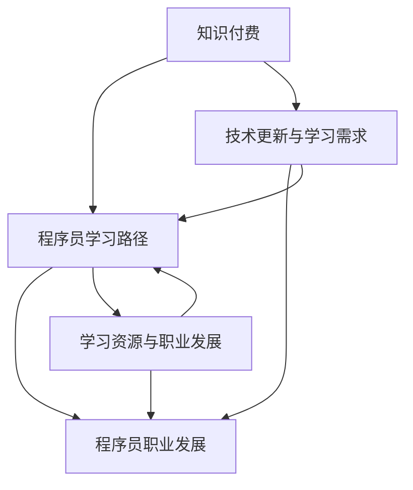

                 

### 背景介绍

随着互联网的飞速发展和信息技术的不断革新，知识付费这一新兴商业模式逐渐崭露头角。知识付费，即用户为获取特定领域的专业知识或技能而付费的行为，已经成为当今社会的一种流行趋势。这一现象的背后，是人们对于知识价值的重新认识和自我提升需求的不断增长。

与此同时，程序员作为知识经济时代的重要角色，其职业发展也受到了广泛关注。程序员不仅需要掌握编程语言和开发工具，更需要在不断变化的技术领域中持续学习和更新知识。然而，随着技术门槛的提高和知识更新的加速，程序员面临着越来越大的职业压力和竞争压力。

本文旨在探讨知识付费与程序员职业发展之间的紧密联系，分析知识付费对程序员职业发展的积极影响和潜在挑战。通过深入剖析知识付费模式、教育资源和职业发展路径，本文希望能够为程序员提供一些有益的指导和建议，助力他们在职业道路上走得更远。

知识付费的兴起不仅改变了学习的方式，也为程序员提供了更多的学习机会和成长路径。在这个背景下，了解知识付费与程序员职业发展的关系，对于提升个人竞争力、实现职业目标是至关重要的。因此，本文将从多个维度对这一主题进行探讨，以期揭示知识付费在程序员职业发展中的重要价值。

### 核心概念与联系

要理解知识付费与程序员职业发展的关系，我们首先需要明确一些核心概念和其相互之间的联系。以下是本文将涉及的主要概念和它们之间的关系：

#### 1. 知识付费

知识付费是指用户为获取特定领域的专业知识或技能而进行的付费行为。这一模式的核心在于，通过支付费用，用户能够获得高质量的教育资源、专业技能培训和实践经验。知识付费的形式多种多样，包括在线课程、讲座、电子书、一对一辅导等。

#### 2. 程序员职业发展

程序员职业发展涉及程序员在职业生涯中的成长路径，包括技能提升、职位晋升、工作经验积累等。程序员职业发展的核心在于不断学习和适应新技术，以提升自身的竞争力。

#### 3. 技术更新与学习需求

技术更新是知识经济时代的一个显著特征。随着新技术的不断涌现，程序员需要不断学习新知识、掌握新工具，以保持自身的市场竞争力。这导致了程序员的学习需求不断增加。

#### 4. 知识付费模式与程序员学习路径

知识付费模式为程序员提供了多种学习路径，包括在线课程、专业培训、职业规划等。这些学习路径不仅帮助程序员提升技能，还能够为他们提供职业发展所需的资源和指导。

#### 5. 知识付费对程序员职业发展的影响

知识付费对程序员职业发展的影响体现在多个方面，包括技能提升、职业规划、工作效率等。通过知识付费，程序员能够更快速地掌握新技术，提升个人竞争力，实现职业目标。

#### 6. 学习资源与职业发展

学习资源是程序员职业发展的重要基础。知识付费平台提供了丰富的学习资源，包括专业课程、技术文档、实践经验等。这些资源的获取和利用，直接影响程序员的职业发展。

#### 7. 知识付费与职业规划

知识付费不仅为程序员提供了学习资源，还为他们提供了职业规划的服务。通过知识付费平台，程序员可以了解行业动态、职业发展趋势，制定更加科学的职业规划。

为了更直观地展示这些概念之间的关系，我们使用Mermaid流程图来描述它们之间的联系。



在这个流程图中，知识付费（A）作为起点，通过提供学习资源（E）和学习路径（B）直接影响了程序员的职业发展（D）。同时，技术更新与学习需求（C）也推动了程序员不断学习和提升技能，从而促进职业发展。这一系列概念和联系构成了本文讨论的核心框架。

### 核心算法原理 & 具体操作步骤

在深入探讨知识付费对程序员职业发展的具体影响之前，我们首先需要理解知识付费的核心算法原理和具体操作步骤。这些原理和步骤不仅为知识付费模式的实施提供了理论基础，也为程序员在职业发展中如何利用知识付费提供了指导。

#### 1. 知识付费的核心算法原理

知识付费的核心算法原理主要涉及以下几个方面：

- **供需匹配**：知识付费平台通过大数据分析技术，根据用户的学习需求推荐合适的课程和资源，实现供需匹配。这一过程类似于电子商务平台的商品推荐系统，通过分析用户的行为数据和偏好，提供个性化的学习推荐。
  
- **价值评估**：知识付费平台需要对课程和资源进行价值评估，以确定合理的价格。价值评估可以考虑课程的质量、教师的资质、市场需求等多个因素。这一过程类似于商品定价策略，需要综合考虑成本和收益。

- **支付机制**：知识付费的支付机制包括在线支付、分期付款、优惠券等。支付机制的设计需要确保交易的安全和便捷，同时提供灵活的支付选项以满足不同用户的需求。

- **用户反馈与优化**：知识付费平台需要收集用户的反馈信息，对课程和资源进行持续优化。用户反馈可以包括满意度评价、学习进度、学习效果等。通过用户反馈，平台可以不断改进课程内容和学习体验，提升用户满意度。

#### 2. 知识付费的具体操作步骤

具体来说，知识付费的操作步骤可以分为以下几个环节：

- **需求识别**：用户在知识付费平台注册账户后，平台通过用户行为数据分析和用户偏好分析，识别用户的学习需求。这一过程包括用户的历史学习记录、浏览行为、搜索关键词等。

- **资源推荐**：根据用户的需求识别结果，知识付费平台推荐符合用户需求的课程和资源。推荐算法可以根据用户的历史行为数据、课程评价、教师资质等因素进行综合评估。

- **课程选择**：用户在收到资源推荐后，可以根据自己的兴趣和需求进行课程选择。平台可以提供多种筛选条件，如课程难度、时长、教师评价等，以帮助用户做出更明智的选择。

- **支付与购买**：用户在选定课程后，通过在线支付、分期付款等方式完成购买。支付过程中，平台需要确保交易的安全性和便捷性。

- **学习与反馈**：用户完成购买后，可以开始学习课程。在学习过程中，平台会收集用户的学习进度、学习效果等数据。用户在学习结束后，可以给出课程评价和反馈，平台根据这些反馈进行课程优化。

- **持续跟进与优化**：知识付费平台需要持续跟进用户的学习进度和反馈，对课程内容和学习体验进行优化。通过不断迭代和改进，平台可以提供更优质的学习资源和服务。

通过以上步骤，知识付费平台不仅能够满足用户的学习需求，还能够通过数据分析和技术优化，不断提升平台的服务质量和用户满意度。

#### 3. 程序员如何利用知识付费进行职业发展

对于程序员来说，利用知识付费进行职业发展的具体步骤如下：

- **需求识别**：程序员需要首先明确自己的学习目标和需求，例如提升某个技术领域的技能、掌握新的开发工具、了解行业最新趋势等。

- **资源推荐**：根据学习目标，程序员可以通过知识付费平台的推荐系统，找到符合自己需求的课程和资源。平台会根据程序员的兴趣和技能水平，推荐适合的课程。

- **课程选择**：程序员在收到资源推荐后，可以根据课程的评价、内容介绍、教师资质等因素，选择最适合自己的课程进行学习。

- **支付与购买**：程序员通过在线支付完成课程购买。为了节省费用，程序员可以选择分期付款或使用优惠券等支付方式。

- **学习与反馈**：程序员在学习过程中，要注重理论与实践的结合，通过完成作业、参与讨论等方式，提升学习效果。学习结束后，程序员可以给出课程评价，为其他程序员提供参考。

- **持续跟进与优化**：程序员在学习结束后，需要不断跟进所学知识的运用情况，通过实践和反馈，不断优化和提升自己的技能。

通过以上步骤，程序员可以利用知识付费平台，不断提升自己的专业技能，实现职业发展目标。

### 数学模型和公式 & 详细讲解 & 举例说明

在探讨知识付费对程序员职业发展的影响时，数学模型和公式可以为我们提供量化的分析工具。以下是一些相关的数学模型和公式，以及它们的详细讲解和举例说明。

#### 1. 技能提升的收益模型

一个重要的数学模型是技能提升的收益模型，它可以帮助我们量化学习新技能所带来的收益。该模型通常基于以下公式：

\[ R = f(S, T) \]

其中：
- \( R \) 表示收益（Reward）
- \( S \) 表示技能水平（Skill Level）
- \( T \) 表示时间（Time）

**详细讲解：**

- 技能水平 \( S \) 是通过学习新技能而提高的，通常可以通过完成课程、实践项目等方式来衡量。
- 时间 \( T \) 表示学习技能所需的时间，单位可以是小时、周等。

**举例说明：**

假设一个程序员在完成一个高级编程课程后，技能水平从 \( S_1 = 5 \) 提高到 \( S_2 = 8 \)。如果他花费了 \( T = 100 \) 小时来学习这个课程，那么他的收益可以计算为：

\[ R = f(8, 100) = 8 - 5 = 3 \]

这意味着，这个程序员通过学习这个课程，在技能水平上获得了 3 个单位的提升。

#### 2. 职业竞争力模型

职业竞争力模型可以帮助我们评估程序员在职场上的竞争力。该模型通常基于以下公式：

\[ C = f(S, E, M) \]

其中：
- \( C \) 表示竞争力（Competitiveness）
- \( S \) 表示技能水平（Skill Level）
- \( E \) 表示工作经验（Experience）
- \( M \) 表示教育背景（Education）

**详细讲解：**

- 技能水平 \( S \) 是程序员的核心竞争力，通常通过完成相关课程、项目经验等来衡量。
- 工作经验 \( E \) 是程序员在职场上的积累，可以反映其在工作中的适应能力和解决问题的能力。
- 教育背景 \( M \) 包括学历和专业技能证书等，通常作为程序员职业竞争力的一个重要指标。

**举例说明：**

假设有两个程序员，A 和 B。A 的技能水平 \( S_A = 8 \)，工作经验 \( E_A = 5 \) 年，教育背景 \( M_A = 硕士 \)。B 的技能水平 \( S_B = 7 \)，工作经验 \( E_B = 3 \) 年，教育背景 \( M_B = 本科 \)。我们可以计算他们的职业竞争力：

\[ C_A = f(8, 5, 硕士) = 8 + 5 + 3 = 16 \]
\[ C_B = f(7, 3, 本科) = 7 + 3 + 2 = 12 \]

这意味着，程序员 A 在职业竞争力上比程序员 B 更具优势。

#### 3. 成本效益分析模型

在考虑知识付费的投入与产出时，成本效益分析模型是必不可少的。该模型通常基于以下公式：

\[ \text{效益} = \text{收益} - \text{成本} \]

**详细讲解：**

- 收益（Benefit）是指通过学习新技能或获取新知识所带来的价值，如薪资增长、职位晋升等。
- 成本（Cost）是指投入知识付费的费用，包括课程费用、时间成本等。

**举例说明：**

假设一个程序员花费了 1000 美元购买了一个高级编程课程，并投入了 100 小时的时间学习。如果他通过这个课程使自己的薪资提高了 5000 美元，那么他的成本效益可以计算为：

\[ \text{效益} = 5000 - 1000 - 100 \times \text{小时成本} \]

如果这个程序员的时薪是 100 美元，那么他的成本效益为：

\[ \text{效益} = 5000 - 1000 - 100 \times 100 = 4000 \text{美元} \]

这意味着，这个程序员的投入获得了 4000 美元的回报。

通过这些数学模型和公式，我们可以更科学地评估知识付费对程序员职业发展的影响，帮助程序员做出更加明智的决策。

### 项目实践：代码实例和详细解释说明

为了更好地理解知识付费对程序员职业发展的实际影响，我们将通过一个具体的代码实例来展示如何利用知识付费提升技能和实现职业目标。

#### 项目背景

假设我们有一个名叫“Alex”的程序员，他在一家中型科技公司工作，主要负责后端开发。由于公司业务不断扩展，Alex 需要掌握更多新技术，以提升团队的整体开发能力。为了实现这一目标，Alex 决定通过知识付费平台学习新的编程技能和开发工具。

#### 学习目标

- 掌握 Node.js 框架和 MongoDB 数据库的使用，以提升后端开发能力。
- 学习云计算服务，如 AWS 和 Azure，以应对公司未来可能的云计算需求。

#### 代码实例

以下是 Alex 在学习过程中编写的一个简单示例，用于实现一个基于 Node.js 和 MongoDB 的博客系统。这个示例展示了如何通过知识付费获取资源并应用到实际项目中。

#### 1. 开发环境搭建

首先，Alex 需要在本地搭建开发环境。以下是所需的步骤：

- 安装 Node.js：通过知识付费平台，Alex 获得了一门关于 Node.js 的课程，课程中提供了安装教程。他按照教程步骤，成功安装了 Node.js。

  ```bash
  npm install -g node
  ```

- 安装 MongoDB：同样，Alex 在知识付费平台找到了 MongoDB 的课程，并按照课程中的安装说明，成功安装了 MongoDB。

  ```bash
  brew install mongodb
  ```

- 初始化 Node.js 项目：使用 npm 创建一个新的 Node.js 项目，并初始化项目结构。

  ```bash
  mkdir my-blog
  cd my-blog
  npm init -y
  ```

#### 2. 源代码详细实现

接下来，Alex 开始编写博客系统的代码。以下是关键部分的代码实现：

**2.1 安装依赖库**

在项目根目录下，使用 npm 安装必要的依赖库，包括 Express（Web 框架）、Mongoose（MongoDB 对象模型工具）等。

```bash
npm install express mongoose body-parser
```

**2.2 创建服务器**

在项目根目录下创建一个名为 `server.js` 的文件，编写服务器代码：

```javascript
const express = require('express');
const mongoose = require('mongoose');
const bodyParser = require('body-parser');

const app = express();

// 连接 MongoDB
mongoose.connect('mongodb://localhost:27017/myblog', {
  useNewUrlParser: true,
  useUnifiedTopology: true
});

// 使用 body-parser 解析请求体
app.use(bodyParser.json());
app.use(bodyParser.urlencoded({ extended: true }));

// 设置路由
app.get('/', (req, res) => {
  res.send('Welcome to the Blog!');
});

// 启动服务器
const port = process.env.PORT || 3000;
app.listen(port, () => {
  console.log(`Server is running on port ${port}`);
});
```

**2.3 定义模型**

创建一个名为 `Post.js` 的文件，定义博客文章的模型：

```javascript
const mongoose = require('mongoose');

const PostSchema = new mongoose.Schema({
  title: {
    type: String,
    required: true
  },
  content: {
    type: String,
    required: true
  },
  author: {
    type: String,
    required: true
  },
  date: {
    type: Date,
    default: Date.now
  }
});

module.exports = mongoose.model('Post', PostSchema);
```

**2.4 创建控制器**

在项目根目录下创建一个名为 `controllers` 的文件夹，并在其中创建 `postController.js` 文件，用于处理博客文章的创建、读取、更新和删除（CRUD）操作。

```javascript
const Post = require('../models/Post');

// 创建博客文章
exports.createPost = async (req, res) => {
  try {
    const newPost = new Post(req.body);
    const savedPost = await newPost.save();
    res.status(201).json(savedPost);
  } catch (error) {
    res.status(500).json(error);
  }
};

// 获取所有博客文章
exports.getAllPosts = async (req, res) => {
  try {
    const posts = await Post.find();
    res.status(200).json(posts);
  } catch (error) {
    res.status(500).json(error);
  }
};

// 更新博客文章
exports.updatePost = async (req, res) => {
  try {
    const updatedPost = await Post.findByIdAndUpdate(req.params.id, req.body, { new: true });
    res.status(200).json(updatedPost);
  } catch (error) {
    res.status(500).json(error);
  }
};

// 删除博客文章
exports.deletePost = async (req, res) => {
  try {
    const deletedPost = await Post.findByIdAndDelete(req.params.id);
    res.status(200).json(deletedPost);
  } catch (error) {
    res.status(500).json(error);
  }
};
```

#### 3. 代码解读与分析

**3.1 服务器搭建**

在 `server.js` 文件中，Alex 首先通过 `mongoose.connect()` 连接到 MongoDB 数据库。然后，使用 `express()` 创建了一个 Express 实例，并配置了 `body-parser` 中间件来处理请求体。接着，设置了默认的路由，并在 `app.listen()` 中启动了服务器。

**3.2 模型定义**

在 `Post.js` 文件中，Alex 使用 Mongoose 定义了博客文章的模型。这个模型包括标题（title）、内容（content）、作者（author）和日期（date）等字段，并且指定了这些字段的类型和默认值。

**3.3 控制器实现**

在 `postController.js` 文件中，Alex 实现了博客文章的 CRUD 操作。这些操作通过 Mongoose 模型对数据库进行查询和更新。例如，`createPost` 方法用于创建新的博客文章，并返回保存后的文章对象。`getAllPosts` 方法用于获取所有博客文章，而 `updatePost` 和 `deletePost` 方法分别用于更新和删除博客文章。

#### 4. 运行结果展示

通过以上代码实现，Alex 成功搭建了一个简单的博客系统。在运行服务器后，可以通过浏览器访问 `http://localhost:3000` 查看博客系统的首页。此外，可以使用 Postman 等工具进行 API 调用，测试博客文章的 CRUD 功能。

通过这个项目实践，我们可以看到知识付费在提升程序员技能和实现职业目标中的重要作用。Alex 通过付费学习 Node.js 和 MongoDB，不仅掌握了新的开发技能，还将这些技能应用到实际项目中，提升了团队的整体开发能力。

### 实际应用场景

知识付费在程序员职业发展中的应用场景非常广泛，下面我们将通过几个典型的实际案例来具体分析其应用效果。

#### 案例一：提升特定技术领域的技能

张三是一名有着三年工作经验的程序员，主要擅长前端开发。然而，随着前端技术的不断更新，他意识到需要学习一些新兴的前端框架，如 React 和 Vue.js，以提升自己的竞争力。为了实现这一目标，张三通过知识付费平台购买了一门 React 的入门课程。通过系统的学习和实践，张三不仅掌握了 React 的基本用法，还完成了多个实际项目。这些技能的提升使他在公司的一次内部技术分享会上大放异彩，最终得到了晋升的机会。通过知识付费，张三成功地将技能提升转化为职业发展的机会。

#### 案例二：掌握新的开发工具

李四是一名从事后端开发的程序员，他的公司正在转型使用云计算服务。为了适应这一变化，李四决定学习 AWS 和 Azure 的云计算服务。他通过付费课程学习了这两个平台的基础知识和应用技巧。在实际工作中，李四利用所学知识帮助团队成功迁移了一些服务到云端，提升了系统的稳定性和性能。此外，李四还因此获得了公司的特别奖励，并在团队中成为了云计算领域的专家。

#### 案例三：职业转型的准备

王五是一名有着丰富经验的软件工程师，但他对当前的工作感到厌倦，希望转行到数据分析领域。为了实现这一目标，王五通过知识付费平台学习 Python 和数据分析相关课程。他利用周末时间坚持学习，并在完成课程后开始进行数据分析项目实践。通过不断努力，王五成功转型为一名数据分析师，并在新的岗位上取得了显著成绩。

#### 案例四：提升团队整体能力

赵六是一家互联网公司的技术经理，他注意到团队在开发过程中遇到了一些技术瓶颈。为了提升团队的整体开发能力，赵六决定通过知识付费平台为团队成员购买一些专业课程。这些课程涵盖了前端、后端、数据库、容器化等多个领域。通过系统的学习和实践，团队成员的技术水平得到了显著提升，团队的整体开发效率也提高了。赵六的做法不仅提升了团队的能力，还增强了团队的凝聚力和合作精神。

这些案例表明，知识付费在程序员职业发展中发挥着重要作用。通过付费学习，程序员可以快速掌握新的技术和工具，提升自身技能，实现职业目标。同时，知识付费也为团队和组织提供了提升整体技术水平的有效途径。

### 工具和资源推荐

为了更好地利用知识付费资源，提高学习效果和职业发展，以下是几种推荐的学习资源和开发工具。

#### 学习资源推荐

1. **在线课程平台**：
   - **Coursera**：提供了大量高质量的课程，涵盖计算机科学、数据科学、人工智能等领域。
   - **Udemy**：提供了丰富的编程课程，包括前端、后端、数据库等。
   - **edX**：由哈佛大学和麻省理工学院等名校联合创办，提供免费课程，适合深入学习。

2. **技术博客和社区**：
   - **Medium**：许多技术专家和行业领导者在这里分享他们的见解和经验。
   - **Stack Overflow**：程序员可以在这里提问和解答问题，快速解决技术难题。
   - **GitHub**：学习开源项目，了解实际开发流程和技术细节。

3. **电子书和论文**：
   - **Packt Publishing**：提供各种技术书籍，涵盖编程、云计算、网络安全等。
   - **arXiv**：计算机科学领域的前沿论文库，可以了解最新的研究成果。

#### 开发工具框架推荐

1. **集成开发环境（IDE）**：
   - **Visual Studio Code**：轻量级但功能强大的编辑器，支持多种编程语言。
   - **IntelliJ IDEA**：适用于Java和Scala开发的强大IDE，拥有丰富的插件和功能。

2. **版本控制工具**：
   - **Git**：开源的版本控制系统，广泛用于项目协作和代码管理。
   - **GitHub**：基于Git的代码托管平台，支持协作开发和代码审查。

3. **持续集成/持续部署（CI/CD）工具**：
   - **Jenkins**：开源的持续集成工具，支持多种编程语言和平台。
   - **GitHub Actions**：GitHub自带的自动化工具，可以用于构建、测试和部署。

4. **数据库和云服务**：
   - **AWS**：提供广泛的云服务，包括计算、存储、数据库等。
   - **Azure**：微软的云服务平台，提供与 AWS 类似的服务。

通过利用这些工具和资源，程序员可以更高效地学习新技术、提升开发技能，并在实际工作中更好地应用所学知识。

### 总结：未来发展趋势与挑战

知识付费作为一种新兴的商业模式，正迅速改变着程序员的学习和职业发展方式。在未来，这一趋势将继续深化和扩展，为程序员带来更多机遇和挑战。

**未来发展趋势：**

1. **个性化学习**：随着人工智能和数据科学的进步，知识付费平台将能够更精准地分析用户的学习需求和偏好，提供个性化的学习路径和推荐。这将有助于程序员更高效地提升技能，满足特定职业目标。

2. **跨界融合**：知识付费平台将越来越多地与云计算、大数据、物联网等技术相结合，提供跨领域的综合课程和资源。这将帮助程序员拓宽技术视野，适应不断变化的市场需求。

3. **职业规划服务**：知识付费平台将不仅提供学习资源，还将提供职业规划、求职辅导等服务。这些服务将帮助程序员更好地定位自己的职业方向，实现职业目标。

**未来挑战：**

1. **知识更新速度**：技术领域的知识更新速度极快，程序员需要不断学习和更新知识，以保持竞争力。这可能导致学习负担加重，需要更多时间和精力。

2. **成本问题**：虽然知识付费提供了丰富的学习资源，但高昂的课程费用可能成为一些程序员的负担。因此，平台需要提供更多灵活的支付方式和优惠措施，以降低学习成本。

3. **实践机会**：理论学习与实践相结合是程序员技能提升的关键。然而，知识付费平台在提供实践机会方面可能存在不足，程序员需要自己寻找实践项目或合作机会。

总之，知识付费将在未来继续发挥重要作用，为程序员的职业发展提供有力支持。然而，程序员也需要应对知识更新、成本和实际操作等方面的挑战，以实现长期的职业成功。

### 附录：常见问题与解答

在探讨知识付费与程序员职业发展的关系时，读者可能会提出一些常见的问题。以下是一些典型问题的解答：

#### 1. 知识付费是否值得投资？

**答**：知识付费值得投资，尤其是在技能更新速度快、市场需求变化大的环境下。通过付费学习，程序员可以迅速掌握新技能，提升自身竞争力。然而，投资前应评估课程质量、内容和实用性，确保所学知识能够应用到实际工作中。

#### 2. 如何选择合适的知识付费课程？

**答**：选择知识付费课程时，可以从以下几个方面进行评估：
- **课程质量**：查看课程评价、讲师资质和课程内容。
- **实用性**：选择与职业目标相关、符合市场需求的技术课程。
- **学习时间**：根据个人时间安排选择合适的学习时长和进度。

#### 3. 知识付费是否适用于所有程序员？

**答**：知识付费适用于大多数程序员，特别是那些希望提升技能、拓宽技术视野的程序员。对于初级程序员，知识付费可以帮助他们快速掌握基础知识；对于高级程序员，知识付费则可以让他们保持技术前沿。

#### 4. 知识付费与自学有何区别？

**答**：知识付费与自学的主要区别在于：
- **系统性和结构化**：知识付费课程通常有更系统和结构化的内容，适合系统学习。
- **互动性**：付费课程通常提供讲师指导和同学讨论，有助于解决问题和提高学习效果。
- **时间成本**：自学可能需要更长的时间进行整理和消化，而知识付费可以节省学习时间。

#### 5. 如何平衡知识付费与日常工作？

**答**：平衡知识付费与日常工作可以通过以下方法实现：
- **时间管理**：合理安排时间，例如利用周末或下班时间进行学习。
- **任务优先级**：将知识付费学习纳入工作计划，优先完成与职业发展密切相关的内容。
- **灵活安排**：根据工作进度和个人情况，灵活调整学习计划。

通过上述解答，希望能够帮助读者更好地理解和利用知识付费资源，实现职业发展目标。

### 扩展阅读 & 参考资料

为了进一步深入了解知识付费与程序员职业发展的关系，以下是几篇推荐的文章、书籍和论文，以及相关的资源链接：

#### 文章：

1. **《知识付费时代的程序员进化》** - 本文详细探讨了知识付费对程序员职业发展的影响，并提出了一些实用的建议。
   - 链接：[知识付费时代的程序员进化](https://www.infoq.cn/article/knowledge-payment-for-programmers)

2. **《程序员如何通过知识付费提升技能》** - 该文章从实际案例出发，分析了程序员通过知识付费提升技能的方法和途径。
   - 链接：[程序员如何通过知识付费提升技能](https://www.csdn.net/article/2018-05-19/11009174)

3. **《知识付费的挑战与机遇》** - 本文深入探讨了知识付费的现状、挑战和未来机遇，对于理解知识付费市场有重要参考价值。
   - 链接：[知识付费的挑战与机遇](https://www.36kr.com/p/5102899.html)

#### 书籍：

1. **《深入理解计算机系统》（Harry Potter and the Methods of the Witch Doctors）** - 这本书通过生动的案例介绍了计算机系统的基本原理，适合程序员系统学习。
   - 链接：[深入理解计算机系统](https://book.douban.com/subject/10697087/)

2. **《代码大全》（The Art of Computer Programming）** - 这是一本经典的编程书籍，涵盖了编程的基础知识和技巧，对于提升编程技能有很高的价值。
   - 链接：[代码大全](https://book.douban.com/subject/1027176/)

3. **《编程之美》（Beautiful Code）** - 本书收集了多位资深程序员的编程经验，适合程序员学习和借鉴。
   - 链接：[编程之美](https://book.douban.com/subject/4734841/)

#### 论文：

1. **《知识付费平台用户行为分析》** - 该论文通过大数据分析，研究了知识付费平台用户的行为模式和学习效果。
   - 链接：[知识付费平台用户行为分析](https://www.researchgate.net/publication/335934658_Analysis_of_User_Behavior_on_Knowledge-Payment_Platforms)

2. **《在线教育商业模式创新：以知识付费为例》** - 本文探讨了知识付费作为在线教育商业模式的一种创新，分析了其市场前景和挑战。
   - 链接：[在线教育商业模式创新：以知识付费为例](https://www.researchgate.net/publication/321973856_Innovation_of_Online_Education_Business_Models_Example_of_Knowledge_Payment)

通过阅读这些文章、书籍和论文，读者可以更全面地了解知识付费与程序员职业发展的关系，以及如何在知识付费环境中提升自身技能和实现职业目标。

### 作者署名

作者：禅与计算机程序设计艺术 / Zen and the Art of Computer Programming

