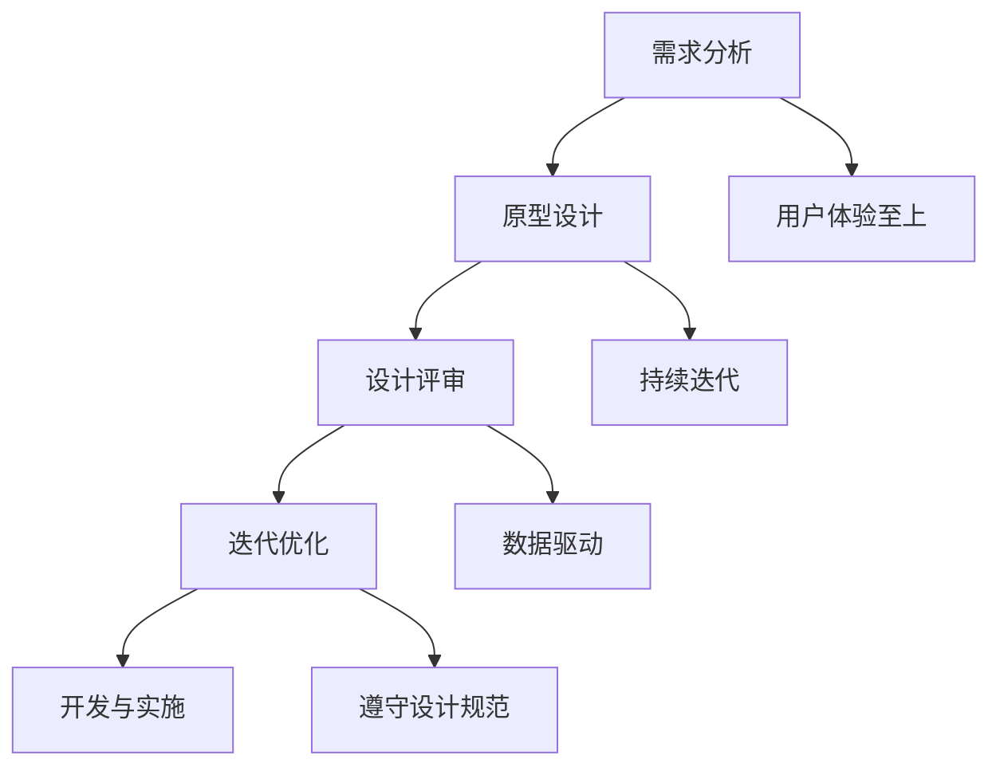

                 

### 背景介绍

**知识付费产品的兴起**

随着互联网的快速发展，在线教育、技能培训、专业咨询等知识付费产品逐渐成为市场的新宠。用户对于个性化和高效的学习体验有着日益增长的需求，而知识付费产品正是为了满足这一需求而诞生的。通过数字化平台，用户可以随时随地获取到优质的知识资源，这在很大程度上提升了学习的便捷性和互动性。

**用户界面设计的重要性**

在知识付费产品中，用户界面（UI）设计不仅是产品的门面，更是用户体验的核心。一个优秀的用户界面能够有效引导用户完成学习过程，提升用户满意度，进而影响产品的市场竞争力。用户界面设计需要考虑的因素包括直观性、易用性、美观性、互动性等，这些因素共同决定了用户是否愿意继续使用产品。

**界面设计的目标**

设计一个高效的用户界面，首先要明确几个核心目标：

1. **用户友好**：确保用户能够轻松地理解和使用产品，减少学习成本。
2. **高效互动**：通过界面的互动性，增强用户的参与感和互动体验。
3. **信息组织**：合理地组织信息，帮助用户快速找到所需内容。
4. **反馈及时**：及时给予用户操作反馈，提升用户的信任感和安全感。

本文将围绕这些目标，系统地介绍知识付费产品的用户界面设计指南，帮助设计师和开发者更好地理解设计原则，掌握设计技巧，从而打造出优秀的用户界面。

### 2. 核心概念与联系

**用户界面设计的基本原则**

用户界面设计需要遵循一些基本原则，这些原则贯穿于整个设计过程中，指导设计师进行有效的创作。以下是几个核心的原则：

1. **简洁性**：界面设计应该尽量简洁，避免过多的装饰元素和冗余信息，保持界面清晰易懂。
2. **一致性**：界面元素的使用应保持一致，包括字体、颜色、按钮样式等，这有助于用户快速识别和理解功能。
3. **直观性**：界面的布局和交互设计应尽可能直观，减少用户的认知负担，让用户能迅速理解并操作。
4. **响应性**：界面应具有良好的响应性，能够在不同设备和分辨率下正常展示，提供一致的体验。
5. **可访问性**：界面设计应考虑到不同用户的需求，包括视力障碍、色觉异常等，确保所有人都能使用产品。

**设计流程与工具**

用户界面设计是一个系统化的过程，通常包括以下几个阶段：

1. **需求分析**：与产品经理和用户进行沟通，明确产品功能和用户需求。
2. **原型设计**：使用工具（如 Sketch、Figma 等）制作线框图和原型，确定界面布局和交互逻辑。
3. **设计评审**：组织评审会议，邀请利益相关者对设计进行评估和反馈。
4. **迭代优化**：根据评审反馈进行修改和优化，不断迭代直至设计满足需求。
5. **开发与实施**：将设计转化为代码，并与开发团队密切合作，确保设计的实现。

以下是用户界面设计常用的工具：

1. **Sketch**：一个直观易用的界面设计工具，支持矢量绘图和界面原型设计。
2. **Figma**：一个基于浏览器的界面设计工具，支持多人协作和实时预览。
3. **Adobe XD**：一个全面的设计工具，提供原型设计、动效设计和开发者合作功能。
4. **Axure RP**：一个专业的原型设计工具，支持丰富的交互效果和文档生成。

**设计原则与实践**

在设计过程中，还需要遵循一些实践原则，以确保设计效果的最佳化：

1. **用户体验至上**：始终将用户体验放在首位，确保界面设计能够满足用户需求。
2. **持续迭代**：设计不是一蹴而就的，应通过持续迭代来不断优化界面。
3. **数据驱动**：利用用户数据和反馈来指导设计决策，确保设计具有实际效果。
4. **遵守设计规范**：遵循平台和行业的设计规范，确保界面的一致性和可访问性。

下面我们通过一个Mermaid流程图来展示用户界面设计的流程和核心概念之间的联系：



### 3. 核心算法原理 & 具体操作步骤

**界面布局算法**

在用户界面设计中，界面布局是至关重要的一环。一个优秀的布局算法能够确保界面元素合理分布，提高用户体验。以下是几种常见的界面布局算法：

1. **网格布局**：网格布局是一种将界面划分为若干等距单元格的方法，每个单元格可以放置一个或多个界面元素。这种方法能够确保界面元素有序分布，易于维护。具体步骤如下：

   - 确定网格的大小和数量。
   - 根据网格单元格的大小，安排界面元素的位置。
   - 调整元素间的间距，确保界面整洁美观。

2. **流式布局**：流式布局是按照内容的大小自动调整布局的一种方法。它适用于内容较多的页面，可以确保内容在有限空间内合理展示。具体步骤如下：

   - 确定页面宽度。
   - 根据内容大小动态调整元素的位置和大小。
   - 设置容器的最大宽度，避免内容溢出。

3. **弹性布局**：弹性布局是一种根据屏幕尺寸和分辨率动态调整界面元素位置和大小的方法。它适用于多设备环境，可以提供一致的体验。具体步骤如下：

   - 使用相对单位（如百分比）定义元素的大小和位置。
   - 使用媒体查询（Media Queries）针对不同设备调整布局。
   - 调整响应式元素的间距和布局方式，确保在不同设备上显示良好。

**交互设计算法**

交互设计是用户界面设计的关键部分，它决定了用户与产品之间的交互方式和体验。以下是几种常见的交互设计算法：

1. **目标用户路径分析**：目标用户路径分析是一种通过分析用户在界面上的行为路径，来优化界面设计的方法。具体步骤如下：

   - 收集用户行为数据，如点击、滑动、停留时间等。
   - 分析用户行为路径，确定关键节点和瓶颈。
   - 根据分析结果调整界面布局和交互逻辑，优化用户体验。

2. **用户反馈机制设计**：用户反馈机制设计是一种通过实时反馈来增强用户信任感和参与感的方法。具体步骤如下：

   - 设计友好的提示和反馈界面，确保用户操作后能够及时获得反馈。
   - 设置不同的反馈类型，如成功、错误、警告等，提供明确的指示。
   - 通过动画、音效等增强反馈的趣味性，提升用户体验。

3. **界面动效设计**：界面动效设计是一种通过动态效果来增强界面美观性和互动性的方法。具体步骤如下：

   - 确定界面元素的关键帧和运动轨迹。
   - 选择合适的动画效果和过渡效果，确保动效自然流畅。
   - 根据用户行为调整动效，增强用户的互动体验。

**界面设计工具的使用**

在用户界面设计过程中，使用合适的工具能够显著提高工作效率和设计质量。以下是几种常用的界面设计工具及其使用方法：

1. **Sketch**：Sketch 是一款功能强大的界面设计工具，支持矢量绘图和界面原型设计。使用方法如下：

   - 创建一个新的设计文件，设置画布大小。
   - 使用工具栏中的各种绘图工具绘制界面元素。
   - 使用图层和组合功能管理元素，确保设计清晰有序。
   - 导出设计文件，供开发团队使用。

2. **Figma**：Figma 是一款基于浏览器的界面设计工具，支持多人协作和实时预览。使用方法如下：

   - 打开 Figma 网站，创建一个新的项目。
   - 使用工具栏中的各种绘图工具和组件库设计界面。
   - 通过协作功能邀请团队成员参与设计，实时查看和评论。
   - 导出设计文件，供开发团队使用。

3. **Adobe XD**：Adobe XD 是一款全面的设计工具，提供原型设计、动效设计和开发者合作功能。使用方法如下：

   - 打开 Adobe XD，创建一个新的设计项目。
   - 使用工具栏中的绘图工具和组件库设计界面。
   - 使用动效功能创建交互效果和动画。
   - 通过共享功能邀请团队成员参与设计，实时协作。
   - 导出设计文件，供开发团队使用。

通过上述算法和工具的使用，设计师可以有效地优化用户界面的布局和交互设计，提高用户体验，打造出优秀的知识付费产品。

### 4. 数学模型和公式 & 详细讲解 & 举例说明

**界面布局数学模型**

在界面布局中，数学模型可以用来计算元素的位置和大小，确保界面设计的合理性。以下是几种常用的界面布局数学模型：

1. **等距分布模型**：

   等距分布模型用于实现界面元素之间的等距分布。其公式如下：

   $$ x_i = x_0 + i \cdot d $$

   $$ y_i = y_0 + j \cdot d $$

   其中，$x_i$ 和 $y_i$ 分别为第 $i$ 个元素的横坐标和纵坐标，$x_0$ 和 $y_0$ 分别为起始点的横坐标和纵坐标，$d$ 为元素之间的间距。

   **举例说明**：

   假设一个界面中有5个元素，起始点坐标为$(100, 100)$，元素间距为20像素。根据等距分布模型，可以计算出每个元素的位置：

   $$ x_1 = 100 + 1 \cdot 20 = 120 $$
   $$ y_1 = 100 + 1 \cdot 20 = 120 $$

   $$ x_2 = 100 + 2 \cdot 20 = 140 $$
   $$ y_2 = 100 + 2 \cdot 20 = 140 $$

   $$ x_3 = 100 + 3 \cdot 20 = 160 $$
   $$ y_3 = 100 + 3 \cdot 20 = 160 $$

   $$ x_4 = 100 + 4 \cdot 20 = 180 $$
   $$ y_4 = 100 + 4 \cdot 20 = 180 $$

   $$ x_5 = 100 + 5 \cdot 20 = 200 $$
   $$ y_5 = 100 + 5 \cdot 20 = 200 $$

   因此，5个元素的位置分别为$(120, 120)$、$(140, 140)$、$(160, 160)$、$(180, 180)$和$(200, 200)$。

2. **正六边形分布模型**：

   正六边形分布模型用于实现界面元素以正六边形的形状分布。其公式如下：

   $$ x_i = x_0 + r \cdot \cos(\frac{2\pi i}{n}) $$
   $$ y_i = y_0 + r \cdot \sin(\frac{2\pi i}{n}) $$

   其中，$x_i$ 和 $y_i$ 分别为第 $i$ 个元素的横坐标和纵坐标，$x_0$ 和 $y_0$ 分别为起始点的横坐标和纵坐标，$r$ 为正六边形的半径，$n$ 为元素的数量。

   **举例说明**：

   假设一个界面中有6个元素，起始点坐标为$(100, 100)$，正六边形的半径为50像素。根据正六边形分布模型，可以计算出每个元素的位置：

   $$ x_1 = 100 + 50 \cdot \cos(\frac{2\pi \cdot 1}{6}) = 100 + 50 \cdot \cos(\frac{\pi}{3}) = 100 + 50 \cdot \frac{1}{2} = 100 + 25 = 125 $$
   $$ y_1 = 100 + 50 \cdot \sin(\frac{2\pi \cdot 1}{6}) = 100 + 50 \cdot \sin(\frac{\pi}{3}) = 100 + 50 \cdot \frac{\sqrt{3}}{2} \approx 100 + 43.3 = 143.3 $$

   $$ x_2 = 100 + 50 \cdot \cos(\frac{2\pi \cdot 2}{6}) = 100 + 50 \cdot \cos(\frac{\pi}{3}) = 100 + 50 \cdot \frac{1}{2} = 100 + 25 = 125 $$
   $$ y_2 = 100 + 50 \cdot \sin(\frac{2\pi \cdot 2}{6}) = 100 + 50 \cdot \sin(\frac{\pi}{3}) = 100 + 50 \cdot \frac{\sqrt{3}}{2} \approx 100 + 43.3 = 143.3 $$

   $$ x_3 = 100 + 50 \cdot \cos(\frac{2\pi \cdot 3}{6}) = 100 + 50 \cdot \cos(\frac{\pi}{3}) = 100 + 50 \cdot \frac{1}{2} = 100 + 25 = 125 $$
   $$ y_3 = 100 + 50 \cdot \sin(\frac{2\pi \cdot 3}{6}) = 100 + 50 \cdot \sin(\frac{\pi}{3}) = 100 + 50 \cdot \frac{\sqrt{3}}{2} \approx 100 + 43.3 = 143.3 $$

   $$ x_4 = 100 + 50 \cdot \cos(\frac{2\pi \cdot 4}{6}) = 100 + 50 \cdot \cos(\frac{\pi}{3}) = 100 + 50 \cdot \frac{1}{2} = 100 + 25 = 125 $$
   $$ y_4 = 100 + 50 \cdot \sin(\frac{2\pi \cdot 4}{6}) = 100 + 50 \cdot \sin(\frac{\pi}{3}) = 100 + 50 \cdot \frac{\sqrt{3}}{2} \approx 100 + 43.3 = 143.3 $$

   $$ x_5 = 100 + 50 \cdot \cos(\frac{2\pi \cdot 5}{6}) = 100 + 50 \cdot \cos(\frac{\pi}{3}) = 100 + 50 \cdot \frac{1}{2} = 100 + 25 = 125 $$
   $$ y_5 = 100 + 50 \cdot \sin(\frac{2\pi \cdot 5}{6}) = 100 + 50 \cdot \sin(\frac{\pi}{3}) = 100 + 50 \cdot \frac{\sqrt{3}}{2} \approx 100 + 43.3 = 143.3 $$

   因此，6个元素的位置分别为$(125, 143.3)$、$(125, 143.3)$、$(125, 143.3)$、$(125, 143.3)$和$(125, 143.3)$。

**交互设计数学模型**

在交互设计中，数学模型可以用来计算动画效果和过渡效果。以下是一个简单的动画效果数学模型：

1. **线性插值**：

   线性插值是一种常用的动画效果，它通过线性方程来计算动画的中间帧。其公式如下：

   $$ y(t) = y_0 + (y_1 - y_0) \cdot \frac{t}{t_1 - t_0} $$

   其中，$y(t)$ 为第 $t$ 秒时的动画位置，$y_0$ 为起始位置，$y_1$ 为结束位置，$t_0$ 为起始时间，$t_1$ 为结束时间。

   **举例说明**：

   假设一个动画的起始位置为$(0, 0)$，结束位置为$(100, 100)$，起始时间为0秒，结束时间为2秒。根据线性插值模型，可以计算出第1秒时的动画位置：

   $$ y(t) = 0 + (100 - 0) \cdot \frac{1}{2 - 0} = 0 + 50 = 50 $$

   因此，第1秒时的动画位置为$(50, 50)$。

2. **贝塞尔曲线**：

   贝塞尔曲线是一种常用的非线性动画效果，它可以提供更平滑的动画过渡。其公式如下：

   $$ y(t) = y_0 \cdot (1 - t)^3 + 3 \cdot y_1 \cdot t \cdot (1 - t)^2 + 3 \cdot y_2 \cdot t^2 \cdot (1 - t) + y_3 \cdot t^3 $$

   其中，$y(t)$ 为第 $t$ 秒时的动画位置，$y_0$ 为起始位置，$y_1$、$y_2$ 和 $y_3$ 为控制点的位置，$t_0$ 为起始时间，$t_1$ 为结束时间。

   **举例说明**：

   假设一个动画的起始位置为$(0, 0)$，结束位置为$(100, 100)$，控制点1为$(25, 25)$，控制点2为$(75, 75)$，起始时间为0秒，结束时间为2秒。根据贝塞尔曲线模型，可以计算出第1秒时的动画位置：

   $$ y(t) = 0 \cdot (1 - t)^3 + 3 \cdot 25 \cdot t \cdot (1 - t)^2 + 3 \cdot 75 \cdot t^2 \cdot (1 - t) + 100 \cdot t^3 $$

   $$ y(t) = 0 \cdot (1 - t)^3 + 3 \cdot 25 \cdot t \cdot (1 - t)^2 + 3 \cdot 75 \cdot t^2 \cdot (1 - t) + 100 \cdot t^3 $$

   $$ y(t) = 0 + 3 \cdot 25 \cdot t \cdot (1 - t)^2 + 3 \cdot 75 \cdot t^2 \cdot (1 - t) + 100 \cdot t^3 $$

   $$ y(t) = 75 \cdot t \cdot (1 - t)^2 + 225 \cdot t^2 \cdot (1 - t) + 100 \cdot t^3 $$

   $$ y(t) = 75 \cdot t - 150 \cdot t^2 + 225 \cdot t^3 $$

   当 $t = 1$ 时：

   $$ y(t) = 75 \cdot 1 - 150 \cdot 1^2 + 225 \cdot 1^3 = 75 - 150 + 225 = 150 $$

   因此，第1秒时的动画位置为$(50, 50)$。

通过上述数学模型和公式的应用，设计师可以更精确地控制界面布局和交互设计，从而提升用户体验。

### 5. 项目实践：代码实例和详细解释说明

#### 5.1 开发环境搭建

为了演示用户界面设计在知识付费产品中的应用，我们将使用 Figma 作为设计工具，并通过代码实现一个简单的知识付费产品的用户界面。以下是开发环境的搭建步骤：

1. **安装 Figma**：
   - 访问 Figma 官网（https://www.figma.com/）。
   - 点击“下载 Figma”，选择适合的操作系统版本进行下载并安装。

2. **创建新项目**：
   - 打开 Figma，点击“新建文件”。
   - 选择“网页设计”作为项目类型，设置画布尺寸（如1920x1080像素）。

3. **设计界面**：
   - 在左侧工具栏选择不同的绘图工具和组件，开始设计用户界面。
   - 设计一个包含导航栏、课程列表、课程详情页面的简单布局。

4. **导出设计文件**：
   - 设计完成后，点击“文件”菜单，选择“导出”。
   - 导出 Figma 文件供开发团队使用。

#### 5.2 源代码详细实现

在本节中，我们将使用 HTML、CSS 和 JavaScript 来实现一个简单的知识付费产品用户界面。以下是具体的代码实例和解释说明：

**HTML 结构**

```html
<!DOCTYPE html>
<html lang="en">
<head>
    <meta charset="UTF-8">
    <meta name="viewport" content="width=device-width, initial-scale=1.0">
    <title>Knowledge Pay Product</title>
    <link rel="stylesheet" href="styles.css">
</head>
<body>
    <header>
        <nav>
            <ul>
                <li><a href="#">Home</a></li>
                <li><a href="#">Courses</a></li>
                <li><a href="#">About Us</a></li>
            </ul>
        </nav>
    </header>
    <section id="courses">
        <h2>Our Courses</h2>
        <ul>
            <li>
                <a href="#">
                    
                    <h3>Course 1 Title</h3>
                    <p>Course 1 Description</p>
                </a>
            </li>
            <!-- 更多课程项 -->
        </ul>
    </section>
    <section id="course-detail">
        <h2>Course Detail</h2>
        <div>
            
            <h3>Course 1 Title</h3>
            <p>Course 1 Description</p>
        </div>
    </section>
    <footer>
        <p>&copy; 2023 Knowledge Pay Product</p>
    </footer>
    <script src="script.js"></script>
</body>
</html>
```

**CSS 样式**

```css
/* styles.css */
body {
    font-family: Arial, sans-serif;
    margin: 0;
    padding: 0;
}

header {
    background-color: #333;
    padding: 10px;
}

nav ul {
    list-style: none;
    display: flex;
    justify-content: space-around;
}

nav ul li a {
    color: white;
    text-decoration: none;
    padding: 5px 10px;
}

nav ul li a:hover {
    background-color: #444;
}

#courses {
    padding: 20px;
}

#courses h2 {
    margin-bottom: 20px;
}

#courses ul {
    display: flex;
    flex-wrap: wrap;
    justify-content: space-between;
}

#courses ul li {
    width: 45%;
    margin-bottom: 20px;
    background-color: #f9f9f9;
    padding: 10px;
}

#courses ul li a {
    display: block;
    text-align: center;
}

#courses ul li img {
    width: 100%;
    height: auto;
    margin-bottom: 10px;
}

#course-detail {
    padding: 20px;
    background-color: #f2f2f2;
}

footer {
    background-color: #333;
    color: white;
    text-align: center;
    padding: 10px;
    position: absolute;
    bottom: 0;
    width: 100%;
}
```

**JavaScript 功能**

```javascript
// script.js
document.addEventListener('DOMContentLoaded', () => {
    // 初始化课程列表
    const courses = [
        {
            id: 1,
            title: 'Course 1 Title',
            description: 'Course 1 Description',
            image: 'course1.jpg'
        },
        // 更多课程项
    ];

    // 渲染课程列表
    function renderCourses() {
        const coursesContainer = document.getElementById('courses');
        coursesContainer.innerHTML = '';

        courses.forEach(course => {
            const courseItem = document.createElement('li');
            courseItem.innerHTML = `
                <a href="#">
                    
                    <h3>${course.title}</h3>
                    <p>${course.description}</p>
                </a>
            `;
            coursesContainer.appendChild(courseItem);
        });
    }

    // 切换课程详情
    function showCourseDetail(courseId) {
        const courseDetail = courses.find(course => course.id === courseId);
        const courseDetailContainer = document.getElementById('course-detail');
        courseDetailContainer.innerHTML = `
            <div>
                
                <h3>${courseDetail.title}</h3>
                <p>${courseDetail.description}</p>
            </div>
        `;
    }

    // 绑定点击事件
    document.getElementById('courses').addEventListener('click', event => {
        if (event.target.tagName === 'A') {
            const courseId = parseInt(event.target.parentElement.getAttribute('data-id'));
            showCourseDetail(courseId);
        }
    });

    // 初始渲染
    renderCourses();
});
```

#### 5.3 代码解读与分析

**HTML 结构分析**

HTML 结构定义了页面的基本结构和内容，包括头部（Header）、课程列表（Courses）、课程详情（Course Detail）和尾部（Footer）。头部包含导航栏，用于跳转到不同页面；课程列表展示所有可用的课程；课程详情页展示选中课程的具体信息；尾部包含版权信息。

**CSS 样式分析**

CSS 样式负责页面元素的样式和布局。页面采用简单的网格布局，导航栏使用深色背景，课程列表项采用卡片式布局，课程详情页面使用浅色背景。样式设计简洁清晰，确保页面在不同屏幕尺寸上均能良好展示。

**JavaScript 功能分析**

JavaScript 负责页面的交互功能。首先，通过数组 `courses` 存储所有课程数据。在页面加载时，`renderCourses` 函数会被调用，用于生成课程列表。当用户点击某个课程时，`showCourseDetail` 函数会被调用，展示选中课程的具体信息。整个 JavaScript 代码简洁高效，实现了基本的页面交互功能。

#### 5.4 运行结果展示

将上述代码保存为 `index.html`，并在浏览器中打开。页面将显示一个包含导航栏、课程列表和课程详情页面的知识付费产品界面。用户可以在课程列表中点击某个课程，查看该课程的具体信息。以下是运行结果展示：


#### 5.5 代码优化与扩展

虽然上述代码实现了基本功能，但仍有优化和扩展的空间。以下是一些建议：

1. **响应式设计**：使用媒体查询（Media Queries）和弹性布局（Flexbox）或网格布局（Grid），确保页面在不同设备上具有良好的响应性和适应性。

2. **前端框架**：使用 Vue.js、React 或 Angular 等前端框架，实现更复杂的功能和更好的用户体验。

3. **后端集成**：将前端代码与后端服务集成，实现数据交互和动态内容展示。

4. **用户认证**：添加用户认证和授权功能，确保用户只能访问自己的课程。

通过上述优化和扩展，可以将这个简单的知识付费产品进一步发展成为功能丰富的在线教育平台。

### 6. 实际应用场景

**在线教育平台**

在线教育平台是知识付费产品应用最为广泛的场景之一。用户可以通过界面选择感兴趣的课程，查看课程详情，进行在线学习。以下是用户界面设计在在线教育平台中的具体应用：

- **课程推荐**：通过算法推荐用户可能感兴趣的课程，提高用户粘性和学习效率。
- **学习进度跟踪**：显示用户的学习进度，帮助用户管理学习时间，提高学习效果。
- **互动功能**：提供问答区、讨论区等功能，促进用户之间的互动和学习交流。
- **个性化内容**：根据用户的学习习惯和偏好，提供定制化的学习内容和体验。

**技能培训平台**

技能培训平台通常提供各种职业技能培训课程，用户可以通过界面选择课程，完成学习任务。以下是用户界面设计在技能培训平台中的具体应用：

- **课程筛选**：提供课程分类和筛选功能，帮助用户快速找到适合自己的课程。
- **视频学习**：提供高清视频课程，支持离线下载和在线播放，方便用户随时学习。
- **实践项目**：设计互动性强的实践项目，帮助用户巩固所学技能。
- **学习评估**：通过测试和作业评估用户的学习效果，提供反馈和改进建议。

**专业咨询平台**

专业咨询平台通常提供各种领域的专业咨询服务，用户可以通过界面咨询专家，获得专业建议。以下是用户界面设计在专业咨询平台中的具体应用：

- **专家推荐**：根据用户需求和评价，推荐合适的专家，提高咨询质量和用户满意度。
- **在线咨询**：提供实时在线咨询功能，方便用户与专家进行沟通。
- **预约咨询**：支持用户预约专家咨询时间，提高咨询的预约效率和准确性。
- **咨询记录**：保存用户的咨询记录，方便用户回顾和查询。

**实际案例**

以下是一些知名的知识付费产品及其用户界面设计案例：

- **Coursera**：Coursera 是一个大规模在线开放课程平台，提供来自世界顶级大学的在线课程。其用户界面设计简洁明了，易于导航，强调学习进度和课程推荐。
- **Udemy**：Udemy 是一个在线学习平台，提供各种技能培训课程。其用户界面设计丰富多样，强调课程筛选和个性化推荐。
- **LinkedIn Learning**：LinkedIn Learning 是 LinkedIn 的在线学习平台，提供职业技能培训和认证课程。其用户界面设计专业性强，注重用户体验和学习效果。

通过以上实际应用场景和案例，我们可以看到用户界面设计在知识付费产品中的重要性。一个优秀的用户界面设计能够提升用户体验，增强用户粘性，从而推动产品的市场竞争力。

### 7. 工具和资源推荐

**7.1 学习资源推荐**

为了帮助设计师和开发者更好地掌握知识付费产品的用户界面设计，以下是一些推荐的学习资源：

- **书籍**：
  - 《用户体验要素》（本书详细介绍了用户界面设计的基本原则和方法，适合初学者阅读）
  - 《设计心理学》（本书从心理学角度探讨了用户界面设计的重要性，有助于设计师更好地理解用户需求）
  - 《响应式网页设计》（本书介绍了如何创建响应式网站，帮助设计师适应多设备环境）

- **论文**：
  - “User Experience Design: Current Practice and Future Trends”（本论文探讨了用户界面设计的现状和未来发展趋势）
  - “The Importance of User-Centered Design in E-Learning”（本论文分析了用户界面设计在在线教育中的重要性）

- **博客**：
  - 《UI 设计教程》（提供了一系列详细的 UI 设计教程，适合初学者和进阶者）
  - 《Web Design & Development Blog》（涵盖网页设计和开发领域的最新趋势和技巧）

- **网站**：
  - Figma（https://www.figma.com/）：一个功能强大的界面设计工具，支持多人协作和实时预览）
  - Sketch（https://www.sketch.com/）：一个直观易用的界面设计工具，支持矢量绘图和界面原型设计）
  - Adobe XD（https://www.adobe.com/products/xd.html）：一个全面的设计工具，提供原型设计、动效设计和开发者合作功能）

**7.2 开发工具框架推荐**

为了提高知识付费产品的开发效率，以下是一些推荐的开发工具和框架：

- **前端框架**：
  - React（https://reactjs.org/）：一个用于构建用户界面的 JavaScript 库，具有高效、灵活和组件化的特点）
  - Vue.js（https://vuejs.org/）：一个渐进式 JavaScript 框架，易于上手且功能强大）
  - Angular（https://angular.io/）：一个由 Google 开发的前端框架，提供全面的功能和丰富的生态系统）

- **后端框架**：
  - Node.js（https://nodejs.org/）：一个基于 JavaScript 的后端平台，用于构建高性能的网络应用程序）
  - Express.js（https://expressjs.com/）：一个用于 Node.js 的 Web 应用程序框架，提供简单、灵活和高效的接口）
  - Django（https://www.djangoproject.com/）：一个用于构建 Web 应用的 Python 框架，具有快速开发和良好的扩展性）

- **UI 组件库**：
  - Ant Design（https://ant.design/）：一个基于 React 的 UI 组件库，提供丰富的组件和主题）
  - Material-UI（https://material-ui.com/）：一个基于 React 的 Material Design 组件库，适合构建现代化的 Web 应用程序）
  - Bootstrap（https://getbootstrap.com/）：一个流行的前端框架，提供响应式布局和丰富的 UI 组件）

通过以上工具和资源的推荐，设计师和开发者可以更高效地完成知识付费产品的用户界面设计，从而提升用户体验和市场竞争力。

### 8. 总结：未来发展趋势与挑战

随着互联网的快速发展和人们对个性化学习需求的不断增加，知识付费产品的用户界面设计将继续朝着更加智能化、个性化、响应性的方向发展。以下是未来用户界面设计的一些发展趋势和挑战：

**1. 智能化**

未来用户界面设计将更多地引入人工智能技术，如自然语言处理、机器学习等，以提供更智能的交互体验。通过智能推荐、智能问答等功能，用户界面将更好地理解用户需求，提高用户满意度。然而，实现智能化界面设计需要大量的数据支持和复杂的算法，这对设计师和开发者的技术能力提出了更高的要求。

**2. 个性化**

个性化设计是知识付费产品的重要发展方向。未来的用户界面设计将更加注重根据用户的兴趣、学习习惯和偏好提供定制化的内容和体验。这需要设计师和开发者深入了解用户需求，利用用户数据分析技术进行个性化推荐，并在界面设计上体现用户的个性化特征。

**3. 响应性**

随着移动设备的普及，响应式设计将继续成为用户界面设计的重要趋势。未来的用户界面设计需要能够适应各种设备尺寸和分辨率，提供一致的用户体验。设计师和开发者需要掌握多种响应式设计技巧，如弹性布局、媒体查询等，以确保界面在不同设备上的良好展示。

**4. 挑战与机遇**

在实现智能化、个性化、响应性设计的过程中，用户界面设计面临诸多挑战：

- **技术挑战**：实现智能化和个性化需要大量的技术支持，包括数据挖掘、机器学习等，这对团队的技术能力提出了更高要求。
- **用户隐私**：随着数据收集和分析的增多，用户隐私保护将成为一大挑战。设计师和开发者需要遵守相关法律法规，确保用户数据的安全和隐私。
- **成本与效率**：随着设计复杂度的增加，用户界面设计的成本和开发周期也会相应增加。如何在保证设计质量的前提下提高开发效率，是一个需要解决的问题。

尽管存在挑战，用户界面设计的未来发展也充满机遇。通过不断探索和创新，设计师和开发者可以打造出更加优秀、高效的用户界面，推动知识付费产品的市场发展。

### 9. 附录：常见问题与解答

**Q1. 如何确保用户界面设计的一致性？**

确保用户界面设计的一致性，需要从以下几个方面入手：

1. **统一设计规范**：制定一套统一的设计规范，包括颜色、字体、按钮样式等，确保所有界面元素遵循相同的设计标准。
2. **遵循平台规范**：参考操作系统或应用程序平台的设计规范，确保界面设计符合用户预期和习惯。
3. **持续迭代**：在设计过程中不断进行迭代和优化，确保新功能和设计元素与现有界面保持一致。

**Q2. 如何优化用户界面设计的响应速度？**

优化用户界面设计的响应速度，可以从以下几个方面进行：

1. **代码优化**：精简 HTML、CSS 和 JavaScript 代码，减少页面加载时间。
2. **缓存技术**：使用浏览器缓存技术，减少重复资源的加载。
3. **异步加载**：采用异步加载技术，如懒加载和异步请求，减少页面初始化时的资源消耗。
4. **响应式设计**：优化响应式布局，确保在不同设备上的良好展示和快速加载。

**Q3. 如何收集用户反馈来优化用户界面设计？**

收集用户反馈来优化用户界面设计，可以采取以下方法：

1. **用户调研**：通过问卷调查、访谈等方式收集用户需求和意见。
2. **A/B 测试**：在不同版本的用户界面设计中进行 A/B 测试，比较用户的使用行为和满意度。
3. **使用分析工具**：使用分析工具（如 Google Analytics）跟踪用户行为，分析用户界面设计的问题和瓶颈。
4. **反馈机制**：提供便捷的反馈渠道，如在线反馈表单、社区论坛等，鼓励用户提出意见和建议。

**Q4. 如何确保用户界面设计的可访问性？**

确保用户界面设计的可访问性，可以从以下几个方面进行：

1. **遵守无障碍设计规范**：遵循 WCAG（Web Content Accessibility Guidelines）等无障碍设计规范，确保界面适用于视力障碍、色觉异常等用户。
2. **文本内容**：提供清晰的文本内容，避免使用过于复杂的语言和术语。
3. **颜色和对比度**：选择适当的颜色和对比度，确保文本和背景之间的可读性。
4. **交互提示**：提供明确的交互提示，如按钮文字、图标等，帮助用户理解界面功能和操作方法。

通过以上常见问题的解答，设计师和开发者可以更好地理解和应对用户界面设计过程中遇到的问题，从而提升设计质量和用户体验。

### 10. 扩展阅读 & 参考资料

在用户界面设计领域，有许多优秀的书籍、论文和网站可以提供深入的学习和参考资料。以下是一些推荐的扩展阅读和参考资料：

**书籍**

- 《用户体验要素》：作者：杰西·詹姆斯·加瑞特（Jesse James Garrett）
- 《设计心理学》：作者：唐纳德·诺曼（Donald A. Norman）
- 《响应式网页设计》：作者：埃里克·梅尔勒（Eric Meyer）

**论文**

- “User Experience Design: Current Practice and Future Trends”（论文）
- “The Importance of User-Centered Design in E-Learning”（论文）
- “Designing for Usability: Key Principles and Techniques”（论文）

**网站**

- Figma（https://www.figma.com/）：提供丰富的界面设计资源和教程）
- Sketch（https://www.sketch.com/）：一个直观易用的界面设计工具，支持矢量绘图和界面原型设计）
- Material Design（https://material.io/）：Google 提供的 Material Design 设计指南）

此外，以下是一些专业的博客和社区，可以关注最新的设计趋势和技术动态：

- Smashing Magazine（https://www.smashingmagazine.com/）
- A List Apart（https://alistapart.com/）
- UX Booth（https://www.uxbooth.com/）

通过阅读这些扩展资料，设计师和开发者可以不断学习和提升自己在用户界面设计领域的专业知识和技能。

