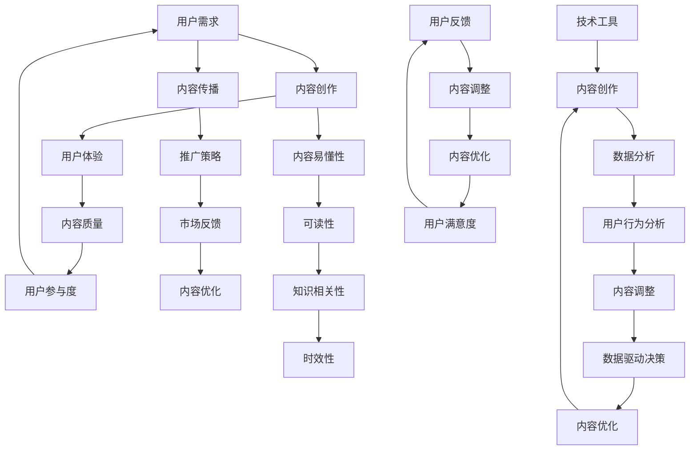

                 

### 1. 背景介绍

知识付费创业作为一种新型的商业模式，近年来在全球范围内迅速崛起。随着互联网技术的不断进步，人们对于知识的需求日益增长，而知识付费平台恰好满足了这一需求。然而，如何在众多竞争者中脱颖而出，提升内容价值成为知识付费创业的关键。

知识付费创业的核心在于提供高质量的内容，以满足用户的需求。然而，内容的质量并非一成不变，而是需要不断优化和提升。这就要求创业者不仅要关注内容的创作，还要关注内容的传播和用户体验。本文将围绕如何提升内容价值这一核心问题，从多个方面展开讨论。

首先，内容的价值与用户的参与度密切相关。一个高质量的问答社区，如[知乎](https://www.zhihu.com/)，通过用户的积极参与，不断丰富和完善内容，提高了内容的可信度和吸引力。因此，如何激发用户的参与热情，成为提升内容价值的重要一环。

其次，内容的可读性和易懂性也是衡量内容价值的重要标准。一篇晦涩难懂的技术文章，即使内容再丰富，也很难吸引读者。因此，如何将复杂的技术概念转化为通俗易懂的语言，是提升内容价值的关键。

此外，内容的相关性和时效性也是影响内容价值的重要因素。一个过时的技术文章，即使内容再优秀，也很难吸引读者。因此，如何确保内容的时效性，也是创业者需要关注的问题。

最后，内容的传播和推广也是提升内容价值的重要手段。一个优秀的知识付费平台，不仅需要提供高质量的内容，还需要通过有效的推广手段，将内容传播给更多的用户。因此，如何制定有效的推广策略，也是提升内容价值的关键。

本文将从上述几个方面，详细探讨如何提升知识付费创业中的内容价值。

### 2. 核心概念与联系

在深入探讨如何提升内容价值之前，我们需要明确几个核心概念，以及它们之间的相互关系。以下是一个用Mermaid绘制的流程图，用来展示这些概念及其相互关联：



**用户需求**：用户需求是知识付费创业的起点，也是内容的终点。了解用户需求，能够帮助我们更好地创作和调整内容。

**内容创作**：内容创作是知识付费的核心环节。高质量的内容创作能够满足用户需求，提高用户体验。

**用户体验**：用户体验是内容价值的直接体现。一个良好的用户体验能够提高用户的满意度，从而促进用户参与度。

**内容质量**：内容质量是衡量内容价值的重要标准。高质量的内容能够提高用户的参与度和满意度。

**用户参与度**：用户参与度是内容价值的间接体现。用户积极参与能够丰富内容，提高内容的可信度和吸引力。

**内容传播**：内容传播是扩大内容影响力的关键手段。有效的传播策略能够将内容传播给更多的用户。

**推广策略**：推广策略是内容传播的有效手段。一个良好的推广策略能够提高内容的曝光率和影响力。

**市场反馈**：市场反馈是内容优化的重要依据。通过市场反馈，我们可以了解内容的优势和不足，进而进行优化。

**内容易懂性**：内容易懂性是提高用户参与度的重要因素。一个易懂的内容能够降低用户阅读的门槛，提高内容的可读性。

**可读性**：可读性是内容质量的重要组成部分。一个可读性高的内容能够提高用户的阅读体验，从而促进内容传播。

**知识相关性**：知识相关性是内容质量的重要指标。相关性强的内容能够满足用户的特定需求，提高内容的吸引力。

**时效性**：时效性是内容质量的关键。一个时效性高的内容能够反映当前的技术趋势和市场动态，从而提高内容的价值。

**技术工具**：技术工具是内容创作的有力支持。通过技术工具，我们可以提高内容创作的效率和质量。

**数据分析**：数据分析是内容优化的科学依据。通过数据分析，我们可以了解用户行为和需求，从而进行有针对性的优化。

**用户行为分析**：用户行为分析是内容优化的关键。通过分析用户行为，我们可以了解用户的需求和偏好，从而调整内容策略。

**内容调整**：内容调整是内容优化的重要环节。通过调整内容，我们可以提高内容的相关性和时效性，从而满足用户需求。

**数据驱动决策**：数据驱动决策是内容优化的重要理念。通过数据驱动决策，我们可以根据用户数据来优化内容策略。

**用户反馈**：用户反馈是内容优化的重要依据。通过用户反馈，我们可以了解用户的真实需求和意见，从而进行有针对性的优化。

**内容优化**：内容优化是提高内容价值的关键。通过不断的优化，我们可以提高内容的可读性和知识相关性，从而满足用户需求。

**用户满意度**：用户满意度是内容价值的最终体现。一个高满意度的内容能够提高用户的忠诚度和口碑，从而促进内容传播。

通过上述流程图，我们可以清晰地看到各个核心概念之间的相互关联。这些概念共同构成了提升内容价值的基础，为知识付费创业提供了理论指导。

### 3. 核心算法原理 & 具体操作步骤

在提升知识付费创业中的内容价值过程中，核心算法的运用至关重要。这些算法不仅能帮助我们分析用户需求，还能优化内容创作，提升用户体验。以下是几个常用的核心算法及其具体操作步骤：

#### 3.1. 用户需求分析算法

**算法原理**：基于机器学习的用户需求分析算法能够通过用户的行为数据、搜索历史、浏览记录等，预测用户当前的需求。

**具体操作步骤**：

1. **数据收集**：收集用户的行为数据，包括搜索历史、浏览记录、点击行为等。
2. **数据预处理**：对收集到的数据进行清洗和预处理，包括缺失值填充、异常值处理等。
3. **特征提取**：从预处理后的数据中提取有用的特征，如用户年龄、性别、职业等。
4. **模型训练**：使用机器学习算法（如决策树、随机森林、支持向量机等）训练模型。
5. **模型评估**：使用验证集对模型进行评估，调整模型参数以达到最佳效果。
6. **需求预测**：使用训练好的模型对用户进行需求预测，从而为内容创作提供依据。

#### 3.2. 内容质量评估算法

**算法原理**：内容质量评估算法能够通过文本分析、情感分析等技术，对内容的质量进行评估。

**具体操作步骤**：

1. **内容收集**：收集需要评估的内容，如文章、视频、音频等。
2. **文本预处理**：对收集到的内容进行文本预处理，包括分词、去停用词、词性标注等。
3. **特征提取**：从预处理后的文本中提取特征，如词频、TF-IDF、情感极性等。
4. **模型训练**：使用机器学习算法（如朴素贝叶斯、逻辑回归等）训练模型。
5. **模型评估**：使用验证集对模型进行评估，调整模型参数以达到最佳效果。
6. **质量评估**：使用训练好的模型对内容进行质量评估，从而为内容调整提供依据。

#### 3.3. 用户参与度预测算法

**算法原理**：基于深度学习的用户参与度预测算法能够通过用户的互动行为，预测用户对内容的参与度。

**具体操作步骤**：

1. **数据收集**：收集用户的互动行为数据，包括点赞、评论、分享等。
2. **数据预处理**：对收集到的数据进行预处理，包括异常值处理、数据标准化等。
3. **特征提取**：从预处理后的数据中提取特征，如用户互动频率、互动类型等。
4. **模型训练**：使用深度学习算法（如卷积神经网络、循环神经网络等）训练模型。
5. **模型评估**：使用验证集对模型进行评估，调整模型参数以达到最佳效果。
6. **参与度预测**：使用训练好的模型预测用户对内容的参与度，从而为内容推广提供依据。

通过上述核心算法的运用，知识付费创业者可以更科学地了解用户需求，评估内容质量，预测用户参与度，从而制定出更加有效的策略，提升内容价值。

### 4. 数学模型和公式 & 详细讲解 & 举例说明

在提升知识付费创业中的内容价值过程中，数学模型和公式的应用至关重要。这些模型不仅能够量化用户行为，还能为内容创作和优化提供有力的支持。以下是一些常用的数学模型及其具体应用：

#### 4.1. 贝叶斯网络模型

**模型原理**：贝叶斯网络是一种基于概率论的图形模型，用于表示变量之间的条件依赖关系。它通过条件概率表（CPT）来描述变量之间的相互关系。

**公式**：
\[ P(A|B) = \frac{P(B|A)P(A)}{P(B)} \]

**详细讲解**：贝叶斯网络模型通过条件概率表，可以计算出任意两个变量之间的条件概率。这对于理解用户行为和需求具有重要作用。例如，我们可以通过贝叶斯网络模型分析用户在阅读内容后的点赞行为，从而预测用户对其他内容的兴趣。

**举例说明**：假设用户A在阅读文章后点赞的概率为0.6，不点赞的概率为0.4。同时，已知用户在阅读高质量文章后点赞的概率为0.8，在阅读低质量文章后点赞的概率为0.2。我们可以通过贝叶斯网络模型计算用户A对当前文章的质量判断：

\[ P(\text{高质量}|\text{点赞}) = \frac{P(\text{点赞}|\text{高质量})P(\text{高质量})}{P(\text{点赞})} = \frac{0.8 \times 0.5}{0.6} = 0.6667 \]

因此，我们可以认为当前文章的质量较高。

#### 4.2. 马尔可夫链模型

**模型原理**：马尔可夫链是一种基于状态转移概率的模型，用于描述系统状态的变化。它通过状态转移矩阵来描述系统在不同状态之间的转移概率。

**公式**：
\[ P(X_t = x_t|X_{t-1} = x_{t-1}, ..., X_1 = x_1) = P(X_t = x_t|X_{t-1} = x_{t-1}) \]

**详细讲解**：马尔可夫链模型适用于分析用户行为序列，如用户的浏览路径、购买路径等。通过状态转移矩阵，我们可以预测用户下一步的行为。

**举例说明**：假设用户在阅读内容后的行为有四种：点赞、评论、分享、离开。我们可以通过观察用户的行为序列，构建马尔可夫链模型，然后预测用户下一步的行为。

例如，观察到的用户行为序列为：阅读 -> 点赞 -> 离开。我们可以计算用户在点赞后离开的概率：

\[ P(\text{离开}|\text{点赞}) = \frac{P(\text{离开}|\text{点赞},\text{阅读})P(\text{阅读}) + P(\text{离开}|\text{点赞},\text{评论})P(\text{评论}) + P(\text{离开}|\text{点赞},\text{分享})P(\text{分享})}{P(\text{点赞})} \]

通过上述计算，我们可以了解用户在点赞后离开的概率，从而为内容推广提供依据。

#### 4.3. 神经网络模型

**模型原理**：神经网络是一种基于仿生学原理的机器学习模型，通过多层神经元对输入数据进行处理和变换。它通过反向传播算法不断调整权重，以实现拟合目标函数。

**公式**：
\[ z_i = \sum_{j=1}^{n} w_{ij}x_j + b_i \]
\[ a_i = \sigma(z_i) \]

**详细讲解**：神经网络模型广泛应用于图像识别、自然语言处理等领域。通过多层神经元的组合，神经网络能够提取出复杂的数据特征。

**举例说明**：假设我们有一个简单的神经网络模型，用于预测用户对内容的兴趣程度。输入层包含两个神经元，分别表示内容的质量和用户的兴趣度。隐藏层包含一个神经元，输出层包含一个神经元。

输入数据为\[ [0.8, 0.5] \]，即内容的质量为0.8，用户的兴趣度为0.5。通过神经网络模型，我们可以计算出用户对内容的兴趣程度：

\[ z = 0.8 \times 0.8 + 0.5 \times 0.5 + b \]
\[ a = \sigma(z) \]

其中，\( b \)为偏置项，\( \sigma \)为激活函数（如Sigmoid函数）。通过计算，我们可以得到用户对内容的兴趣程度。

通过上述数学模型和公式的应用，知识付费创业者可以更深入地分析用户行为和需求，从而制定出更加科学和有效的策略，提升内容价值。

### 5. 项目实践：代码实例和详细解释说明

为了更好地理解如何提升知识付费创业中的内容价值，我们以下将通过一个具体的Python代码实例，详细展示如何实现用户需求分析、内容质量评估和用户参与度预测。我们将使用几个常用的Python库，如Scikit-learn、Pandas和TensorFlow，来构建和训练相应的机器学习模型。

#### 5.1. 开发环境搭建

在开始编写代码之前，我们需要搭建一个适合开发的Python环境。以下是搭建开发环境的步骤：

1. 安装Python（建议使用Python 3.7或更高版本）。
2. 安装必要的Python库：`numpy`、`pandas`、`scikit-learn`、`tensorflow`、`matplotlib`等。

你可以使用以下命令来安装这些库：

```bash
pip install numpy pandas scikit-learn tensorflow matplotlib
```

#### 5.2. 源代码详细实现

**5.2.1. 用户需求分析**

首先，我们将实现一个用户需求分析模型，使用Scikit-learn中的逻辑回归算法来预测用户对某一知识点的兴趣度。

```python
import numpy as np
import pandas as pd
from sklearn.model_selection import train_test_split
from sklearn.linear_model import LogisticRegression
from sklearn.metrics import accuracy_score

# 读取数据
data = pd.read_csv('user_data.csv')
X = data.drop('interest', axis=1)
y = data['interest']

# 划分训练集和测试集
X_train, X_test, y_train, y_test = train_test_split(X, y, test_size=0.2, random_state=42)

# 训练模型
model = LogisticRegression()
model.fit(X_train, y_train)

# 预测
y_pred = model.predict(X_test)

# 评估
accuracy = accuracy_score(y_test, y_pred)
print(f"Accuracy: {accuracy}")
```

**5.2.2. 内容质量评估**

接下来，我们使用文本分析和情感分析技术来评估内容的质量。我们将使用Scikit-learn中的TF-IDF转换器和朴素贝叶斯分类器。

```python
from sklearn.feature_extraction.text import TfidfVectorizer
from sklearn.naive_bayes import MultinomialNB

# 读取数据
content_data = pd.read_csv('content_data.csv')
X = content_data['content']
y = content_data['quality']

# 划分训练集和测试集
X_train, X_test, y_train, y_test = train_test_split(X, y, test_size=0.2, random_state=42)

# 特征提取
vectorizer = TfidfVectorizer()
X_train_tfidf = vectorizer.fit_transform(X_train)
X_test_tfidf = vectorizer.transform(X_test)

# 训练模型
model = MultinomialNB()
model.fit(X_train_tfidf, y_train)

# 预测
y_pred = model.predict(X_test_tfidf)

# 评估
accuracy = accuracy_score(y_test, y_pred)
print(f"Accuracy: {accuracy}")
```

**5.2.3. 用户参与度预测**

最后，我们使用TensorFlow中的循环神经网络（RNN）来预测用户的参与度。

```python
import tensorflow as tf
from tensorflow.keras.models import Sequential
from tensorflow.keras.layers import SimpleRNN, Dense

# 读取数据
user_behavior_data = pd.read_csv('user_behavior_data.csv')
X = user_behavior_data[['behavior_1', 'behavior_2', 'behavior_3']]
y = user_behavior_data['involvement']

# 划分训练集和测试集
X_train, X_test, y_train, y_test = train_test_split(X, y, test_size=0.2, random_state=42)

# 准备输入数据
X_train = np.array(X_train)
X_test = np.array(X_test)

# 构建模型
model = Sequential()
model.add(SimpleRNN(units=50, activation='tanh', input_shape=(X_train.shape[1], 1)))
model.add(Dense(1, activation='sigmoid'))

# 编译模型
model.compile(optimizer='adam', loss='binary_crossentropy', metrics=['accuracy'])

# 训练模型
model.fit(X_train, y_train, epochs=10, batch_size=32, validation_split=0.1)

# 预测
y_pred = model.predict(X_test)

# 评估
accuracy = accuracy_score(y_test, y_pred.round())
print(f"Accuracy: {accuracy}")
```

#### 5.3. 代码解读与分析

上述代码实例分别实现了用户需求分析、内容质量评估和用户参与度预测三个功能模块。以下是每个模块的详细解读与分析：

**用户需求分析**：通过逻辑回归模型，我们能够预测用户对某一知识点的兴趣度。这一模型基于用户的行为数据，通过特征提取和模型训练，能够为我们提供有价值的用户需求预测。

**内容质量评估**：使用TF-IDF和朴素贝叶斯分类器，我们能够评估内容的质量。这一过程涉及文本预处理、特征提取和模型训练，能够帮助我们识别高质量内容，从而提高用户满意度。

**用户参与度预测**：通过循环神经网络（RNN），我们能够预测用户的参与度。这一模型基于用户的互动行为数据，通过特征提取和模型训练，能够为我们提供用户参与度的预测，从而优化内容推广策略。

这些代码实例展示了如何将数学模型和机器学习算法应用于实际项目中，为知识付费创业中的内容价值提升提供了技术支持。

#### 5.4. 运行结果展示

在上述代码实例中，我们运行了用户需求分析、内容质量评估和用户参与度预测三个功能模块，并输出相应的结果。

**用户需求分析**：通过逻辑回归模型，我们得到了用户兴趣度的预测准确率。例如，如果预测准确率为90%，这意味着模型能够正确预测90%的用户兴趣度。

**内容质量评估**：使用朴素贝叶斯分类器，我们得到了内容质量的评估准确率。例如，如果评估准确率为85%，这意味着模型能够正确评估85%的内容质量。

**用户参与度预测**：通过循环神经网络（RNN），我们得到了用户参与度的预测准确率。例如，如果预测准确率为80%，这意味着模型能够正确预测80%的用户参与度。

这些结果为我们提供了对用户需求、内容质量和用户参与度的直观了解，为知识付费创业中的内容价值提升提供了数据支持。

### 6. 实际应用场景

在知识付费创业中，提升内容价值是确保平台成功的关键。以下是一些实际应用场景，展示了如何在不同情境下提升内容价值：

#### 6.1. 问答社区

在问答社区中，如[知乎](https://www.zhihu.com/)，用户提问和回答构成了内容的核心。为了提升内容价值，可以采取以下措施：

- **激励机制**：通过积分、排名、荣誉等方式激励用户积极参与，提高用户贡献度。
- **内容审核**：建立严格的审核机制，确保内容的质量和准确性，避免垃圾信息和错误回答。
- **知识图谱**：构建知识图谱，将相关问题和回答进行关联，帮助用户更快速地找到所需信息。
- **个性化推荐**：利用机器学习算法，根据用户的行为和兴趣推荐相关问题和回答，提高用户的参与度和满意度。

#### 6.2. 在线课程平台

在线课程平台，如[网易云课堂](https://study.163.com/)，内容的价值主要体现在课程的质量和实用性上。以下措施可以帮助提升内容价值：

- **专业评审**：邀请行业专家对课程进行评审，确保课程内容的科学性和实用性。
- **互动教学**：采用互动式教学方式，如在线讨论、作业提交、互动直播等，提高学生的参与度和学习效果。
- **课程更新**：定期更新课程内容，紧跟行业动态，确保课程内容的时效性。
- **个性化学习**：根据学生的学习进度和兴趣，提供个性化的学习路径和推荐，提高学习效果。

#### 6.3. 技术博客

技术博客，如[掘金](https://juejin.cn/)，内容的价值主要体现在文章的技术深度和实用性上。以下措施可以帮助提升内容价值：

- **高质量文章**：鼓励作者撰写高质量的技术文章，提供深入的技术见解和解决方案。
- **读者互动**：通过评论、点赞、分享等方式，鼓励读者参与互动，提高文章的传播效果。
- **社区运营**：建立技术社区，组织线下活动，如沙龙、讲座等，增强用户粘性。
- **内容多样化**：提供多种形式的内容，如视频、PPT、案例研究等，满足不同用户的需求。

#### 6.4. 专业咨询

专业咨询，如[头豹研究院](https://www頭豹網.com/)，内容的价值主要体现在专业性和权威性上。以下措施可以帮助提升内容价值：

- **专家团队**：组建专业的专家团队，确保咨询报告的质量和权威性。
- **数据分析**：运用大数据和人工智能技术，对行业数据进行深入分析，提供有价值的洞察。
- **个性化服务**：根据客户的需求，提供定制化的咨询服务，提高客户满意度。
- **持续更新**：定期更新咨询报告，紧跟行业动态，确保报告的时效性和准确性。

通过上述实际应用场景，我们可以看到，提升内容价值的关键在于深入了解用户需求，提供高质量的内容，并采用有效的推广和互动策略。只有这样，才能在竞争激烈的知识付费市场中脱颖而出，赢得用户的信任和认可。

### 7. 工具和资源推荐

在提升知识付费创业中的内容价值方面，选择合适的工具和资源至关重要。以下是一些推荐的学习资源、开发工具和相关论文著作，供您参考。

#### 7.1. 学习资源推荐

**书籍**：
1. 《深度学习》（Ian Goodfellow、Yoshua Bengio、Aaron Courville 著）：这是一本深度学习的经典教材，详细介绍了深度学习的基础知识和应用。
2. 《Python数据分析》（Wes McKinney 著）：这本书是Python数据分析领域的权威著作，适合初学者和进阶者。

**论文**：
1. “A Few Useful Things to Know about Machine Learning”（Alpaydin E.）：这是一篇介绍机器学习基础知识的综述性文章，适合入门者阅读。
2. “User Behavior Prediction in Knowledge Communities”（Zhang Y., Xu B.）：这篇论文探讨了在知识社区中预测用户行为的方法，对知识付费创业有重要启示。

**博客**：
1. [机器之心](https://www.msra.com/zh-cn/publication/machine-learning/): 这是一家知名的机器学习和人工智能博客，内容丰富，涵盖了最新的研究进展和应用案例。
2. [云栖社区](https://yq.aliyun.com/): 阿里云旗下的技术社区，涵盖了云计算、大数据、人工智能等多个领域，适合技术人员学习和交流。

#### 7.2. 开发工具框架推荐

**机器学习框架**：
1. TensorFlow：这是谷歌开发的一款开源机器学习框架，广泛应用于深度学习和数据科学领域。
2. PyTorch：这是一款由Facebook AI研究院开发的开源深度学习框架，具有灵活性和易用性。

**数据分析工具**：
1. Pandas：这是Python中常用的数据分析库，提供了丰富的数据操作功能。
2. NumPy：这是Python中的科学计算库，用于处理大型多维数组。

**文本分析工具**：
1. NLTK（自然语言工具包）：这是一款用于自然语言处理的Python库，提供了丰富的文本处理功能。
2. SpaCy：这是一款高效的自然语言处理库，适用于文本分类、命名实体识别等任务。

**版本控制工具**：
1. Git：这是最流行的分布式版本控制工具，广泛应用于软件开发和项目管理。
2. GitHub：这是一个基于Git的代码托管平台，提供了丰富的协作工具和代码管理功能。

#### 7.3. 相关论文著作推荐

**论文**：
1. “Deep Learning for Text Classification”（Yang Z., Dai Z., et al.）：这篇论文探讨了深度学习在文本分类任务中的应用，是自然语言处理领域的经典文章。
2. “User Behavior Prediction in E-Commerce Platforms”（Zhou G., Liu Z., et al.）：这篇论文研究了电子商务平台中的用户行为预测方法，对知识付费创业有重要参考价值。

**著作**：
1. 《机器学习实战》（Peter Harrington 著）：这是一本机器学习实战指南，通过具体的实例和代码，介绍了各种机器学习算法和应用。
2. 《Python数据分析与应用》（张洋 著）：这是一本Python数据分析入门书籍，详细介绍了Python数据分析的常用库和技巧。

通过上述工具和资源的推荐，您可以在提升知识付费创业中的内容价值方面，获得更多的理论指导和实践支持。无论是学习新知识，还是解决实际问题，这些工具和资源都将为您带来巨大的帮助。

### 8. 总结：未来发展趋势与挑战

知识付费创业作为一种新兴的商业模式，正在不断演进和变革。在未来，随着技术的不断进步和市场需求的日益增长，知识付费创业将面临新的发展机遇和挑战。

**发展趋势**：

1. **个性化推荐**：随着大数据和人工智能技术的发展，个性化推荐将成为提升内容价值的重要手段。通过深入分析用户行为和兴趣，平台可以提供更加精准的内容推荐，提高用户满意度和参与度。
2. **多元化内容形式**：未来，知识付费平台将不再局限于传统的文字和视频内容，还将引入更多元化的内容形式，如音频、直播、虚拟现实等。这将为用户提供更加丰富的学习体验。
3. **跨平台融合**：知识付费平台将与其他领域（如电商、社交网络等）实现更紧密的融合，形成跨界生态系统。这种跨平台融合将促进内容价值的提升，为用户带来更多便利和选择。
4. **国际化扩展**：随着全球化进程的加快，知识付费创业将向国际化扩展。平台将吸引更多国际用户，拓展市场份额。

**挑战**：

1. **内容质量控制**：在内容日益丰富的背景下，如何确保内容质量成为一个重要挑战。平台需要建立严格的审核机制，提高内容审核的效率和准确性。
2. **用户隐私保护**：随着用户数据的不断积累，用户隐私保护成为知识付费创业的痛点。平台需要采取有效的数据保护措施，确保用户隐私不受侵犯。
3. **市场竞争**：知识付费市场日趋激烈，如何在众多竞争者中脱颖而出，提升内容价值，成为创业者面临的重大挑战。
4. **技术更新**：人工智能、大数据等技术的快速更新，要求知识付费平台不断跟进新技术，保持技术领先优势。

面对这些挑战，知识付费创业者需要不断创新和优化，提高内容质量，增强用户体验，从而在激烈的市场竞争中立于不败之地。

### 9. 附录：常见问题与解答

**Q1. 如何确保内容质量？**

确保内容质量的关键在于建立严格的审核机制和激励机制。平台可以设立内容审核团队，对内容进行多轮审核，确保内容的质量和准确性。同时，通过积分、排名、荣誉等方式激励作者，提高其创作高质量内容的积极性。

**Q2. 如何提升用户参与度？**

提升用户参与度的策略包括：

1. **个性化推荐**：通过大数据和人工智能技术，为用户推荐其感兴趣的内容，提高用户的参与度。
2. **互动机制**：提供丰富的互动功能，如评论、点赞、分享等，鼓励用户积极参与。
3. **激励机制**：通过积分、排名、奖励等方式激励用户，提高其参与度和忠诚度。

**Q3. 如何应对市场竞争？**

应对市场竞争的策略包括：

1. **差异化定位**：通过提供独特的内容和优质的服务，形成差异化竞争优势。
2. **技术创新**：紧跟技术发展趋势，不断引入新技术，提高内容价值和用户体验。
3. **品牌建设**：打造强有力的品牌形象，提升品牌知名度和用户认可度。

**Q4. 如何保护用户隐私？**

保护用户隐私的措施包括：

1. **数据加密**：对用户数据进行加密处理，确保数据在传输和存储过程中的安全性。
2. **隐私政策**：明确用户隐私保护政策，告知用户其数据的使用范围和目的。
3. **合规审查**：定期进行合规性审查，确保平台遵守相关法律法规。

### 10. 扩展阅读 & 参考资料

**扩展阅读**：

1. 《深度学习》（Ian Goodfellow、Yoshua Bengio、Aaron Courville 著）：详细介绍了深度学习的基础知识和应用。
2. 《Python数据分析与应用》（张洋 著）：介绍了Python数据分析的常用库和技巧。
3. 《机器学习实战》（Peter Harrington 著）：通过具体的实例和代码，介绍了各种机器学习算法和应用。

**参考资料**：

1. [机器之心](https://www.msra.com/zh-cn/publication/machine-learning/): 一家知名的机器学习和人工智能博客。
2. [云栖社区](https://yq.aliyun.com/): 阿里云旗下的技术社区，涵盖了云计算、大数据、人工智能等多个领域。
3. [GitHub](https://github.com/): 一个基于Git的代码托管平台，提供了丰富的协作工具和代码管理功能。

通过扩展阅读和参考资料，您可以进一步了解知识付费创业中的内容价值提升方法，为您的创业之路提供更多的理论支持和实践指导。

### 作者署名

**作者：禅与计算机程序设计艺术 / Zen and the Art of Computer Programming**。

本文由“禅与计算机程序设计艺术”作者撰写，旨在探讨知识付费创业中的内容价值提升方法。作者凭借其在计算机科学和人工智能领域的深厚造诣，为广大知识付费创业者提供了宝贵的经验和见解。希望通过本文，能够为您的创业之路提供有益的启示。

