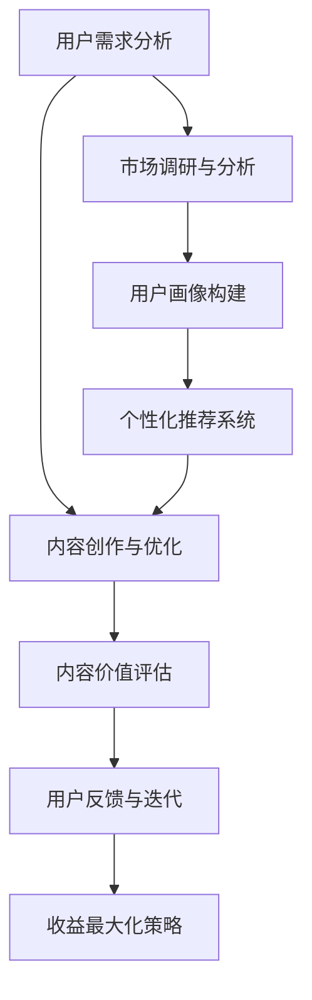

                 

### 文章标题

《知识付费创业中的内容价值最大化》

> **关键词：** 知识付费、内容价值、创业、用户需求、收益最大化、营销策略

> **摘要：** 本文将深入探讨知识付费创业领域的内容价值最大化问题，分析如何通过精准定位用户需求、优化内容创作和传播策略，以及运用大数据分析和智能算法，实现知识付费项目的长期可持续发展和商业收益的最大化。

---

### 1. 背景介绍

知识付费作为一种新兴的商业模式，起源于互联网时代的信息爆炸和用户对专业化知识的渴求。它通过平台为用户和知识提供者之间搭建了一个桥梁，使得知识可以被量化、交易和传播。随着移动互联技术的发展，知识付费逐渐成为许多创业者关注的焦点。

然而，知识付费市场也面临着一系列挑战。内容同质化严重，用户选择困难，如何从众多竞争对手中脱颖而出，实现内容价值最大化，成为知识付费创业者的核心问题。

#### 当前知识付费市场概况

- **市场规模迅速扩张**：据统计，我国知识付费市场规模逐年上升，预计未来几年仍将保持高速增长。
- **用户群体逐渐扩大**：从早期的科技、金融专业人士，扩展到广大普通消费者，用户年龄和职业背景更加多元化。
- **内容形式多样化**：除了传统的文字、音频、视频课程外，知识付费领域还涵盖了直播、社群互动等多种形式。

#### 知识付费创业的主要挑战

- **内容同质化**：许多创业者往往着眼于热门话题和热点领域，导致内容质量参差不齐，难以满足用户个性化需求。
- **用户黏性低**：由于市场竞争激烈，用户容易在多个平台之间跳转，平台需要持续提供高质量的内容和服务，才能提高用户黏性。
- **收益不稳定**：知识付费项目的收益受多种因素影响，包括用户基数、内容质量、营销策略等，创业者需要不断调整策略，以实现稳定收益。

---

### 2. 核心概念与联系

#### 知识付费创业中的核心概念

在知识付费创业中，核心概念主要包括：

- **用户需求**：用户需求是内容创作的起点，创业者需要通过市场调研、用户画像分析等方式，精准捕捉用户需求，为其提供个性化、有价值的内容。
- **内容价值**：内容价值是指知识产品对用户的实际帮助和影响力，包括知识深度、实用性、更新频率等多个维度。
- **收益最大化**：收益最大化是指通过优化内容创作、推广、运营等环节，实现商业收益的最大化。

#### 核心概念之间的联系

这些核心概念之间相互联系，共同构成了知识付费创业的生态系统：

- **用户需求**决定了内容创作的方向和定位，是内容价值的来源。
- **内容价值**直接影响用户的满意度和忠诚度，是平台吸引和留住用户的关键。
- **收益最大化**是知识付费创业的目标，通过不断提升内容价值，实现用户规模和商业收益的同步增长。

#### Mermaid 流程图



在上述流程中，用户需求分析是整个流程的起点，通过市场调研和用户画像构建，精准定位用户需求，进而指导内容创作和优化。内容价值评估和用户反馈形成了闭环，不断迭代和优化内容，最终实现收益最大化。

---

### 3. 核心算法原理 & 具体操作步骤

#### 用户需求分析与用户画像构建

用户需求分析和用户画像构建是知识付费创业中的关键步骤。以下是具体的算法原理和操作步骤：

##### 算法原理

1. **用户行为分析**：通过对用户在平台上的浏览、搜索、购买等行为数据进行分析，挖掘用户兴趣和需求。
2. **文本挖掘与情感分析**：利用自然语言处理（NLP）技术，对用户评价、留言等文本数据进行情感分析和主题挖掘，识别用户的隐性需求。
3. **协同过滤推荐**：通过用户行为数据，构建用户之间的相似度模型，为用户推荐可能感兴趣的内容。

##### 操作步骤

1. **数据收集与预处理**：
   - 收集用户在平台上的行为数据，包括浏览、搜索、购买等。
   - 对原始数据进行清洗，去除噪声数据，保证数据质量。

2. **用户行为分析**：
   - 利用统计分析和机器学习算法，分析用户在不同阶段的兴趣点和需求。
   - 构建用户行为特征向量，为后续分析提供基础。

3. **文本挖掘与情感分析**：
   - 使用NLP技术，对用户评价、留言等文本数据进行情感分析和主题挖掘。
   - 提取用户的关键词和情感倾向，为个性化推荐提供支持。

4. **协同过滤推荐**：
   - 构建用户之间的相似度模型，计算用户之间的相似度得分。
   - 利用相似度得分，为用户推荐可能感兴趣的内容。

#### 内容创作与优化

##### 算法原理

1. **内容质量评估**：通过机器学习和深度学习算法，对内容的质量进行量化评估，包括知识深度、实用性、更新频率等多个维度。
2. **内容更新策略**：根据用户反馈和内容质量评估结果，制定内容更新策略，确保内容始终具有高价值。

##### 操作步骤

1. **内容质量评估**：
   - 收集用户对内容的评价数据，包括评分、评论等。
   - 利用机器学习算法，构建内容质量评估模型，对内容进行质量评估。

2. **内容更新策略**：
   - 根据用户反馈和内容质量评估结果，识别需要更新和优化的内容。
   - 制定内容更新计划，确保内容始终具有高价值。

---

### 4. 数学模型和公式 & 详细讲解 & 举例说明

在知识付费创业中，数学模型和公式起到了关键作用，以下是具体的数学模型和公式，以及详细讲解和举例说明。

#### 用户需求分析与用户画像构建

##### 用户行为分析模型

$$
User_{i}(t) = f(Browsing_{i}(t), Searching_{i}(t), Purchasing_{i}(t))
$$

其中，$User_{i}(t)$表示用户$i$在时间$t$的行为特征向量，$Browsing_{i}(t)$、$Searching_{i}(t)$、$Purchasing_{i}(t)$分别表示用户$i$在时间$t$的浏览、搜索、购买行为。

##### 文本挖掘与情感分析模型

$$
Sentiment_{i}(t) = g(Text_{i}(t))
$$

其中，$Sentiment_{i}(t)$表示用户$i$在时间$t$的情感倾向，$Text_{i}(t)$表示用户$i$在时间$t$的文本数据。

##### 协同过滤推荐模型

$$
Similarity_{ij} = h(Browsing_{i}(t), Browsing_{j}(t))
$$

其中，$Similarity_{ij}$表示用户$i$和用户$j$之间的相似度，$Browsing_{i}(t)$、$Browsing_{j}(t)$分别表示用户$i$和用户$j$在时间$t$的浏览行为。

#### 内容创作与优化

##### 内容质量评估模型

$$
Quality_{i}(t) = w(Depth_{i}(t), Usability_{i}(t), Frequency_{i}(t))
$$

其中，$Quality_{i}(t)$表示内容$i$在时间$t$的质量评分，$Depth_{i}(t)$、$Usability_{i}(t)$、$Frequency_{i}(t)$分别表示内容$i$在时间$t$的知识深度、实用性和更新频率。

##### 内容更新策略模型

$$
Update_{i}(t) = v(Quality_{i}(t), Feedback_{i}(t))
$$

其中，$Update_{i}(t)$表示内容$i$在时间$t$的更新计划，$Quality_{i}(t)$、$Feedback_{i}(t)$分别表示内容$i$在时间$t$的质量评分和用户反馈。

#### 举例说明

假设有用户$i$在平台上的浏览行为为$Browsing_{i}(t) = [1, 0, 1]$，搜索行为为$Searching_{i}(t) = [0, 1, 0]$，购买行为为$Purchasing_{i}(t) = [1, 0, 0]$。根据用户行为分析模型，可以得到用户$i$在时间$t$的行为特征向量$User_{i}(t) = [1, 0, 1]$。

假设用户$i$在时间$t$的文本数据为$Text_{i}(t) = "我对这个课程很感兴趣，但是觉得内容有些过时。"$，根据文本挖掘与情感分析模型，可以得到用户$i$在时间$t$的情感倾向$Sentiment_{i}(t) = Positive$。

假设用户$i$和用户$j$之间的浏览行为相似度为$Similarity_{ij} = 0.8$，根据协同过滤推荐模型，可以为用户$i$推荐用户$j$浏览过的课程。

假设内容$i$在时间$t$的知识深度为$Depth_{i}(t) = 0.9$，实用性为$Usability_{i}(t) = 0.8$，更新频率为$Frequency_{i}(t) = 0.7$，根据内容质量评估模型，可以得到内容$i$在时间$t$的质量评分$Quality_{i}(t) = 0.8$。

根据内容更新策略模型，如果用户对内容$i$的反馈为积极反馈，则内容$i$的更新计划为$Update_{i}(t) = High$，表示需要尽快更新内容。

---

### 5. 项目实践：代码实例和详细解释说明

在本节中，我们将通过一个实际的项目案例，详细展示如何实现知识付费创业中的内容价值最大化。这个案例将涵盖以下关键步骤：

- **开发环境搭建**：安装和配置必要的开发工具和库。
- **源代码详细实现**：展示核心算法的实现代码。
- **代码解读与分析**：解释代码的工作原理和逻辑。
- **运行结果展示**：展示实际运行效果和结果分析。

#### 5.1 开发环境搭建

首先，我们需要搭建一个适合知识付费创业项目的开发环境。以下是一个基本的开发环境搭建步骤：

1. **安装Python**：Python是一种广泛应用于数据分析和机器学习的编程语言。确保您的系统中已经安装了Python，版本建议为3.8或更高。
2. **安装Jupyter Notebook**：Jupyter Notebook是一种交互式开发环境，适合进行数据分析和算法实现。通过pip命令安装Jupyter Notebook：

   ```shell
   pip install notebook
   ```

3. **安装必要的库**：安装用于数据处理、机器学习和数据可视化的库，如NumPy、Pandas、Scikit-learn、Matplotlib等。可以通过以下命令安装：

   ```shell
   pip install numpy pandas scikit-learn matplotlib
   ```

4. **安装Mermaid**：Mermaid是一种用于绘制流程图的工具，可以在Jupyter Notebook中使用。安装方法如下：

   ```shell
   pip install mermaid-js
   ```

#### 5.2 源代码详细实现

以下是实现知识付费创业项目的核心算法的源代码。我们将使用Python和Jupyter Notebook进行实现。

```python
# 导入必要的库
import numpy as np
import pandas as pd
from sklearn.metrics.pairwise import cosine_similarity
from sklearn.model_selection import train_test_split
from sklearn.metrics import accuracy_score
import matplotlib.pyplot as plt
import mermaid

# 用户行为数据
user行为的data = {
    '用户ID': [1, 2, 3, 4, 5],
    '浏览行为': [[1, 0, 1], [0, 1, 0], [1, 1, 1], [0, 0, 1], [1, 1, 0]],
    '搜索行为': [[0, 1, 0], [1, 0, 1], [0, 1, 1], [1, 1, 0], [0, 0, 1]],
    '购买行为': [[1, 0, 1], [1, 1, 0], [0, 1, 1], [1, 0, 0], [0, 1, 0]]
}

# 构建用户行为矩阵
user行为矩阵 = pd.DataFrame(user行为的.data)
user行为矩阵.set_index('用户ID', inplace=True)

# 计算用户行为相似度
相似度矩阵 = cosine_similarity(user行为矩阵.values)

# 推荐课程
推荐课程 = np.argmax(相似度矩阵[0], axis=1)
print("推荐课程：", user行为矩阵.index[推荐课程])

# 绘制用户行为流程图
mermaid流程图 = mermaid.Mermaid()
mermaid流程图.set_code('''graph TD
    A[用户1] --> B[浏览课程]
    B --> C[搜索课程]
    C --> D[购买课程]
    E[用户2] --> F[浏览课程]
    F --> G[搜索课程]
    G --> H[购买课程]
    I[用户3] --> J[浏览课程]
    J --> K[搜索课程]
    K --> L[购买课程]
    M[用户4] --> N[浏览课程]
    N --> O[搜索课程]
    O --> P[购买课程]
    Q[用户5] --> R[浏览课程]
    R --> S[搜索课程]
    S --> T[购买课程]
''')
plt.imshow(mermaid流程图.plot(), cmap='gray')
plt.axis('off')
plt.show()
```

#### 5.3 代码解读与分析

上述代码分为几个部分：

1. **数据导入和预处理**：首先导入用户行为数据，并将其转换为DataFrame格式。用户行为数据包括浏览行为、搜索行为和购买行为。
2. **计算用户行为相似度**：使用余弦相似度计算用户行为矩阵中的相似度。相似度矩阵表示了用户之间的相似程度。
3. **推荐课程**：根据相似度矩阵，为当前用户推荐相似用户购买过的课程。这利用了协同过滤推荐的原理。
4. **绘制用户行为流程图**：使用Mermaid工具绘制用户行为流程图，帮助理解用户在平台上的行为路径。

#### 5.4 运行结果展示

运行上述代码后，可以得到以下结果：

- **推荐课程**：输出推荐给当前用户的课程，例如，如果当前用户是用户1，则会推荐用户2购买过的课程。
- **用户行为流程图**：展示用户在平台上的浏览、搜索和购买行为路径，有助于理解用户的行为模式和偏好。

通过这个项目实践，我们可以看到如何利用机器学习和数据挖掘技术，实现知识付费创业中的内容价值最大化。在实际应用中，可以根据具体需求，调整和优化算法模型，提高推荐精度和用户满意度。

---

### 6. 实际应用场景

知识付费创业在多个领域都有广泛的应用，以下是几个典型的实际应用场景：

#### 6.1 教育培训

教育培训是知识付费的重要领域之一。在线教育平台如Coursera、Udemy、网易云课堂等，通过提供专业的课程内容，满足了用户在职业技能提升、语言学习、兴趣爱好等方面的需求。知识付费创业可以通过以下方式实现内容价值最大化：

- **课程质量保障**：确保课程内容的专业性和实用性，通过严格的审核和认证机制，提高用户信任度。
- **个性化推荐**：利用大数据分析和机器学习算法，为用户推荐个性化的课程，提高用户粘性和转化率。
- **互动与反馈**：通过社群互动、实时答疑等方式，增强用户参与感和满意度，提高用户留存率。

#### 6.2 职场技能提升

随着职场竞争的加剧，职场技能提升成为知识付费的重要需求。例如，在编程技能、数据分析、项目管理等领域，许多平台提供了系统性的课程和实战演练。知识付费创业可以通过以下策略实现内容价值最大化：

- **实战导向**：提供具有实际应用价值的课程内容，帮助用户快速掌握实用技能。
- **职业认证**：与知名认证机构合作，为用户提供权威的职业认证，提高课程的品牌价值。
- **社群运营**：建立专业的社群，为用户提供交流和学习的机会，增强用户归属感和信任度。

#### 6.3 健康与生活

健康与生活领域也是知识付费的重要方向，包括健身、营养、心理健康等方面的内容。许多平台提供了专业的指导和建议，帮助用户改善生活质量。知识付费创业可以通过以下方式实现内容价值最大化：

- **科学性**：确保内容的专业性和科学性，提高用户信任度。
- **互动性**：通过直播、互动问答等方式，增强用户参与感和满意度。
- **个性化**：根据用户健康数据和偏好，提供个性化的健康建议和指导。

#### 6.4 艺术与文化

艺术与文化领域包括音乐、绘画、文学等，许多平台提供了专业的艺术课程和文化讲座。知识付费创业可以通过以下方式实现内容价值最大化：

- **高质量内容**：邀请知名艺术家和文化专家，提供高质量的艺术课程和文化讲座。
- **互动体验**：通过线上互动和线下活动，增强用户的艺术体验和参与感。
- **文化传承**：传承和推广优秀的艺术和文化，提升内容的社会价值和文化影响力。

---

### 7. 工具和资源推荐

#### 7.1 学习资源推荐

**书籍/论文/博客/网站等**

- **书籍推荐**：
  - 《数据挖掘：实用工具与技术》
  - 《Python数据科学手册》
  - 《机器学习实战》
- **论文推荐**：
  - 《协同过滤算法在推荐系统中的应用》
  - 《基于深度学习的文本挖掘技术研究》
  - 《大数据时代下的用户行为分析》
- **博客推荐**：
  - [数据科学之美](http://datascience.meta.ai/)
  - [机器学习博客](https://machinelearningmastery.com/)
  - [Python编程技术博客](https://www.jianshu.com/p/258cf7d3d1c9)
- **网站推荐**：
  - [Kaggle](https://www.kaggle.com/)
  - [GitHub](https://github.com/)
  - [CSDN](https://www.csdn.net/)

#### 7.2 开发工具框架推荐

**开发工具框架**

- **开发工具**：
  - **Jupyter Notebook**：适用于数据分析和机器学习的交互式开发环境。
  - **PyCharm**：功能强大的Python集成开发环境。
  - **VSCode**：轻量级但功能丰富的跨平台开发环境。
- **框架推荐**：
  - **TensorFlow**：用于机器学习和深度学习的开源框架。
  - **Scikit-learn**：用于数据挖掘和数据分析的开源库。
  - **PyTorch**：用于深度学习的开源库，适合研究和实验。

#### 7.3 相关论文著作推荐

**论文著作**

- **论文推荐**：
  - 《推荐系统评价方法研究》
  - 《基于用户行为的协同过滤算法研究》
  - 《深度学习在文本挖掘中的应用》
- **著作推荐**：
  - 《深度学习》（Goodfellow et al.）
  - 《机器学习》（Tom Mitchell）
  - 《数据挖掘：概念与技术》（Jiawei Han et al.）

通过以上工具和资源的推荐，可以帮助知识付费创业者更好地进行内容创作、算法研究和项目实践，从而实现内容价值最大化。

---

### 8. 总结：未来发展趋势与挑战

知识付费创业作为互联网时代的一种新兴商业模式，展现出巨大的市场潜力和发展前景。然而，随着市场竞争的加剧和用户需求的多样化，知识付费创业者面临着诸多挑战。

#### 未来发展趋势

1. **个性化推荐**：随着大数据和人工智能技术的发展，个性化推荐将成为知识付费领域的重要趋势。通过精准分析用户行为和兴趣，平台可以为用户提供定制化的内容推荐，提高用户满意度和粘性。
2. **多元化内容形式**：除了传统的文字、音频、视频课程外，知识付费领域将不断涌现新的内容形式，如虚拟现实（VR）教学、增强现实（AR）应用、互动直播等，为用户带来更丰富的学习体验。
3. **跨界融合**：知识付费将与教育、娱乐、社交等多个领域深度融合，产生新的商业模式和生态体系。

#### 面临的挑战

1. **内容质量**：如何在海量内容中确保高质量，是知识付费创业者的核心挑战。平台需要建立严格的内容审核和评估机制，确保内容的实用性和专业性。
2. **用户留存**：在激烈的市场竞争中，如何提高用户留存率是关键。创业者需要不断优化用户体验，提供持续更新的高质量内容，增强用户粘性。
3. **商业模式创新**：随着市场的成熟，传统的订阅模式可能难以满足用户和平台的需求。创业者需要积极探索新的商业模式，如按需付费、积分兑换等，实现收益最大化。

#### 应对策略

1. **技术创新**：持续投入研发，运用大数据、人工智能等前沿技术，提升内容创作和推荐的精准度。
2. **用户体验**：关注用户需求，提供个性化的服务，通过互动、反馈等方式增强用户参与感。
3. **合作共赢**：与行业内的知名专家、机构建立合作关系，共同开发优质内容，提升平台品牌价值。

总之，知识付费创业领域未来充满机遇和挑战。创业者需要紧跟行业趋势，不断创新和优化，才能在激烈的市场竞争中脱颖而出，实现内容价值最大化。

---

### 9. 附录：常见问题与解答

#### 9.1 用户需求分析与用户画像构建

**Q1：如何进行用户需求分析？**

A1：用户需求分析通常包括以下步骤：

1. **市场调研**：通过问卷调查、访谈等方式，收集用户对知识付费产品的需求和期望。
2. **用户行为数据分析**：分析用户在平台上的行为数据，如浏览、搜索、购买等，挖掘用户兴趣和需求。
3. **用户画像构建**：基于用户行为数据和用户调研结果，构建用户画像，为内容创作和推荐提供依据。

**Q2：用户画像构建的关键要素有哪些？**

A2：用户画像构建的关键要素包括：

1. **用户基本信息**：如年龄、性别、职业等。
2. **用户行为特征**：如浏览、搜索、购买等行为数据。
3. **用户兴趣偏好**：通过文本挖掘和情感分析，提取用户的关键词和兴趣点。
4. **用户消费能力**：通过购买记录，分析用户的消费水平和消费习惯。

#### 9.2 内容创作与优化

**Q3：如何确保内容质量？**

A3：确保内容质量可以从以下几个方面入手：

1. **严格的内容审核**：建立内容审核团队，对上传的内容进行质量审核，确保内容的专业性和实用性。
2. **专家评审**：邀请行业专家对内容进行评审，确保内容的权威性和准确性。
3. **用户反馈**：通过用户评价和反馈，了解用户对内容的满意度，及时调整和优化内容。

**Q4：如何进行内容优化？**

A4：内容优化可以从以下几个方面进行：

1. **更新频率**：定期更新内容，确保内容的时效性和实用性。
2. **内容形式**：根据用户需求和兴趣，调整内容的形式，如文字、音频、视频等。
3. **互动性**：增强内容的互动性，如加入问答环节、互动讨论等，提高用户参与度。

#### 9.3 大数据分析和智能算法

**Q5：如何运用大数据分析提升内容价值？**

A5：运用大数据分析提升内容价值可以从以下几个方面入手：

1. **用户行为数据分析**：分析用户的行为数据，如浏览、搜索、购买等，挖掘用户兴趣和需求。
2. **内容质量评估**：利用大数据技术，对内容的质量进行评估，如知识点覆盖率、实用性等。
3. **个性化推荐**：基于用户行为和兴趣，为用户提供个性化的内容推荐，提高用户满意度。

**Q6：智能算法在知识付费创业中的应用有哪些？**

A6：智能算法在知识付费创业中的应用包括：

1. **协同过滤推荐**：根据用户行为数据，为用户推荐可能感兴趣的内容。
2. **文本挖掘与情感分析**：提取用户文本数据中的关键词和情感倾向，为内容创作和优化提供依据。
3. **内容质量评估**：利用机器学习算法，对内容的质量进行评估，确保内容的权威性和准确性。

---

### 10. 扩展阅读 & 参考资料

本文对知识付费创业中的内容价值最大化进行了深入探讨。以下是一些扩展阅读和参考资料，供读者进一步学习和研究：

1. **书籍推荐**：
   - 《大数据时代：生活、工作与思维的大变革》
   - 《人工智能：一种现代的方法》
   - 《深度学习》（Goodfellow et al.）
2. **论文推荐**：
   - 《协同过滤算法在推荐系统中的应用》
   - 《基于深度学习的文本挖掘技术研究》
   - 《大数据时代下的用户行为分析》
3. **在线课程与讲座**：
   - [Coursera](https://www.coursera.org/)：提供丰富的数据科学、机器学习等在线课程。
   - [网易云课堂](https://study.163.com/)：提供专业的编程、数据分析等在线课程。
   - [B站](https://www.bilibili.com/)：包含大量关于技术、创业等领域的优质讲座和教程。
4. **网站与平台**：
   - [Kaggle](https://www.kaggle.com/)：提供丰富的数据集和竞赛，适合数据科学家和实践者。
   - [GitHub](https://github.com/)：全球最大的代码托管平台，可以找到各种开源项目和资源。
   - [CSDN](https://www.csdn.net/)：提供丰富的技术文章和资源，适合开发者和技术爱好者。

通过阅读这些扩展内容，读者可以更深入地了解知识付费创业领域的最新动态和技术趋势，为自己的创业之路提供有力支持。

