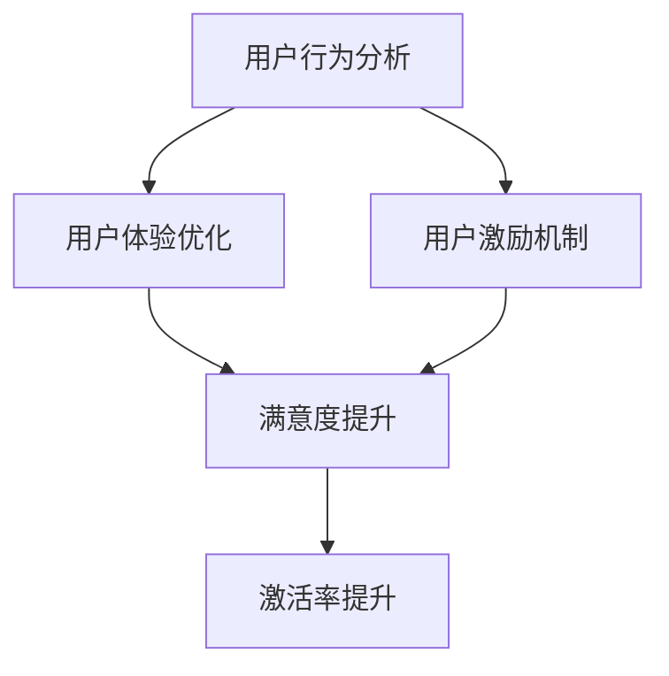
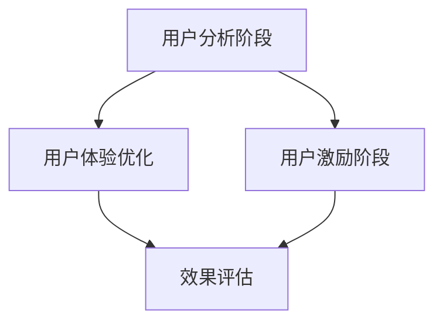

                 

### 1. 背景介绍

**知识付费**作为一种新兴的商业模式，近年来在互联网行业迅速崛起，成为推动内容产业创新的重要力量。知识付费的本质在于通过提供有价值的内容和服务，满足用户在知识、技能、经验等方面的需求，从而实现商业价值的转换。随着移动互联网的普及和人们对于个性化学习需求的增长，知识付费市场呈现出爆发式增长态势。

**用户激活策略**在知识付费领域扮演着至关重要的角色。用户激活，即引导用户从注册、浏览到实际付费购买课程的一系列行为，是决定产品成败的关键环节。激活率的高低直接影响到平台的用户规模、用户粘性和商业收益。高激活率意味着更多的用户参与到知识付费活动中，从而带动平台的运营和发展。

在知识付费创业过程中，用户激活策略不仅仅是营销手段的简单堆砌，它涉及用户心理学、行为学、数据分析等多学科交叉的深入研究。一个成功的用户激活策略需要综合考虑用户体验、产品定位、市场环境、竞争态势等多方面因素，从而制定出科学、有效的激活策略。

本文将围绕知识付费创业中的用户激活策略展开，旨在通过深入剖析用户激活的理论基础、核心算法、数学模型、项目实践，以及实际应用场景，为知识付费创业提供系统性、可操作性的指导。本文将分为以下几部分：

1. **背景介绍**：阐述知识付费的发展背景和用户激活策略的重要性。
2. **核心概念与联系**：介绍用户激活策略的核心概念，并使用Mermaid流程图展示相关流程。
3. **核心算法原理 & 具体操作步骤**：详细解析用户激活策略的算法原理和操作步骤。
4. **数学模型和公式 & 详细讲解 & 举例说明**：运用数学模型和公式对用户激活策略进行深入分析。
5. **项目实践：代码实例和详细解释说明**：通过实际项目代码展示用户激活策略的实施过程。
6. **实际应用场景**：探讨用户激活策略在各类知识付费平台中的应用。
7. **工具和资源推荐**：推荐相关的学习资源和开发工具。
8. **总结：未来发展趋势与挑战**：总结用户激活策略的发展趋势和面临的挑战。

通过本文的阅读，读者将能够系统地了解用户激活策略的各个方面，为知识付费创业提供有力的理论支持和实践指导。

### 2. 核心概念与联系

用户激活策略的核心概念包括用户行为分析、用户体验优化、用户激励机制等。以下是这些核心概念的详细解释以及它们之间的相互联系。

#### 用户行为分析

用户行为分析是指通过对用户在平台上的行为数据（如浏览、搜索、购买等）进行收集、整理和分析，以了解用户的需求、偏好和痛点。行为分析能够帮助创业团队精准地定位目标用户，制定有针对性的激活策略。

核心联系：
- **数据驱动**：用户行为分析为激活策略提供了数据支持，使策略制定更加科学和精准。
- **精准营销**：通过分析用户行为，可以识别高潜力用户并进行精准营销，提高激活效果。

#### 用户体验优化

用户体验优化是指通过优化产品界面、功能设计、操作流程等方面，提升用户的整体使用体验。良好的用户体验能够增强用户的满意度和忠诚度，从而促进用户激活。

核心联系：
- **满意度提升**：优化用户体验可以减少用户的摩擦成本，提高用户满意度。
- **激活率提升**：满意度的提升有助于增加用户在平台上的活跃度和留存率，进而提高激活率。

#### 用户激励机制

用户激励机制是指通过设计合理的奖励机制，激发用户的积极性和参与度，促进用户完成激活行为。激励机制可以包括积分系统、优惠券、红包等。

核心联系：
- **激励作用**：用户激励机制能够直接作用于用户的决策过程，提升用户激活的概率。
- **行为引导**：通过奖励机制引导用户完成特定行为，如注册、购买课程等。

#### Mermaid流程图展示

为了更直观地展示用户激活策略的核心概念及其相互联系，我们使用Mermaid流程图进行描述。



图1：用户激活策略核心概念与联系

#### 用户激活策略整体流程

用户激活策略的整体流程可以分为以下几个阶段：

1. **用户分析阶段**：通过数据分析了解用户需求和行为模式，确定激活目标。
2. **用户体验优化阶段**：根据用户分析结果，优化产品界面和功能设计，提高用户体验。
3. **用户激励阶段**：设计并实施激励机制，引导用户完成激活行为。
4. **效果评估阶段**：通过数据监控和反馈，评估激活策略的效果，并不断优化调整。

整体流程如下所示：



图2：用户激活策略整体流程

通过上述核心概念和流程图的展示，我们可以清晰地看到用户激活策略的各个方面及其相互关系。接下来，我们将进一步探讨用户激活策略的具体算法原理和操作步骤。

### 3. 核心算法原理 & 具体操作步骤

用户激活策略的成功实施离不开科学、系统的算法原理和具体操作步骤。以下是用户激活策略的核心算法原理和详细的操作步骤。

#### 算法原理

用户激活策略的核心算法原理主要包括用户分群、行为预测和激励分配等几个方面。

1. **用户分群**：通过对用户行为数据进行分析，将用户分为不同的群体。分群有助于针对不同用户群体的特点和需求，制定个性化的激活策略。

2. **行为预测**：利用机器学习算法，预测用户在未来一段时间内的行为倾向。预测结果可以帮助创业团队提前布局，引导用户完成激活行为。

3. **激励分配**：根据用户分群和行为预测结果，设计并分配激励机制。激励分配要具有针对性，能够有效提升用户激活率。

#### 具体操作步骤

以下是用户激活策略的具体操作步骤：

##### 步骤1：用户分群

用户分群是用户激活策略的基础。首先，我们需要收集用户的行为数据，包括浏览记录、购买行为、搜索关键词等。然后，通过聚类算法（如K-means、DBSCAN等）对用户进行分群。具体操作步骤如下：

1. 数据预处理：对原始数据进行清洗、去重和填充缺失值，确保数据的完整性和准确性。
2. 特征工程：选择对用户行为有重要影响的特征，如浏览时间、浏览频率、购买金额等。
3. 聚类分析：使用聚类算法对用户进行分群，根据用户行为特征将其划分为不同群体。

##### 步骤2：行为预测

行为预测是用户激活策略的核心。利用机器学习算法，我们可以预测用户在未来一段时间内的行为倾向。以下是行为预测的具体操作步骤：

1. 数据准备：收集用户的当前行为数据，包括历史浏览记录、购买行为等。
2. 特征选择：选择对用户行为有重要影响的特征，如用户年龄、性别、地理位置等。
3. 模型训练：选择合适的机器学习算法（如逻辑回归、决策树、随机森林等）对数据进行训练，得到预测模型。
4. 模型评估：通过交叉验证等方法评估模型的预测性能，确保模型的准确性。

##### 步骤3：激励分配

根据用户分群和行为预测结果，设计并分配激励机制。以下是激励分配的具体操作步骤：

1. 激励设计：设计不同的激励方案，如积分、优惠券、红包等。
2. 激励匹配：根据用户分群和行为预测结果，将不同的激励方案分配给相应的用户群体。
3. 激励实施：在用户进行特定行为（如注册、购买课程等）时，触发相应的激励方案。

##### 步骤4：效果评估

通过数据监控和反馈，评估用户激活策略的效果，并不断优化调整。以下是效果评估的具体操作步骤：

1. 数据收集：收集用户激活相关的数据，如注册量、购买量、用户留存率等。
2. 指标分析：分析激活策略的各个指标，评估激活效果。
3. 反馈优化：根据评估结果，对激活策略进行调整和优化，提高激活效果。

#### 案例分析

以某知名知识付费平台为例，其用户激活策略的具体操作步骤如下：

1. **用户分群**：通过分析用户行为数据，将用户分为高活跃用户、中活跃用户和低活跃用户。
2. **行为预测**：利用机器学习算法，预测高活跃用户在未来一个月内的购买概率。
3. **激励分配**：针对高活跃用户，设计优惠券激励方案，提高其购买概率；针对中活跃用户，设计积分激励方案，提高其活跃度；针对低活跃用户，设计红包激励方案，引导其完成注册行为。
4. **效果评估**：通过监控注册量、购买量和用户留存率等指标，评估激活策略的效果。根据评估结果，对策略进行调整和优化。

通过上述案例分析，我们可以看到用户激活策略的具体实施过程。在实际操作中，创业团队需要根据自身业务特点和用户数据，灵活调整操作步骤，以达到最佳的激活效果。

### 4. 数学模型和公式 & 详细讲解 & 举例说明

在用户激活策略中，数学模型和公式扮演着至关重要的角色。它们不仅帮助我们在理论上理解用户行为和激活机制，还能够通过具体的计算提供量化的策略指导。以下将介绍几个关键的数学模型和公式，并对它们进行详细的讲解和举例说明。

#### 4.1 用户分群模型

用户分群是用户激活策略的基础。常用的分群模型包括K-means聚类和层次聚类（hierarchical clustering）。

**K-means聚类公式：**

K-means聚类是一种基于距离度量的聚类方法。其目标是将数据点分为K个簇，使得每个簇内的数据点之间的距离最小。

$$
\text{Minimize} \sum_{i=1}^{K} \sum_{x \in S_i} ||x - \mu_i||^2
$$

其中，\(S_i\) 是第 \(i\) 个簇的数据集合，\(\mu_i\) 是第 \(i\) 个簇的中心。

**举例说明：**

假设我们有100个用户，每个用户有3个特征（浏览时长、购买频率、互动次数）。我们可以使用K-means聚类将用户分为3个群体。

1. **初始化中心点**：随机选择3个用户作为初始中心点。
2. **分配数据点**：将每个用户分配到最近的中心点所在的簇。
3. **更新中心点**：计算每个簇的平均值作为新的中心点。
4. **重复步骤2和步骤3**，直到中心点不再发生变化。

通过K-means聚类，我们得到了3个用户群体，每个群体具有不同的特征和需求，从而可以制定个性化的激活策略。

#### 4.2 用户行为预测模型

用户行为预测是用户激活策略的核心。常见的行为预测模型包括逻辑回归、决策树和随机森林。

**逻辑回归公式：**

逻辑回归是一种广义线性模型，用于预测概率。其公式如下：

$$
\pi = \frac{1}{1 + e^{-\beta^T x}}
$$

其中，\(x\) 是特征向量，\(\beta\) 是模型参数，\(\pi\) 是目标事件发生的概率。

**举例说明：**

假设我们预测用户在未来一周内是否购买课程。我们可以使用逻辑回归模型来预测购买的概率。特征向量可能包括用户的浏览时长、购买历史和互动频率等。

1. **数据准备**：收集用户的历史行为数据，并进行预处理。
2. **模型训练**：使用训练数据集训练逻辑回归模型，得到参数 \(\beta\)。
3. **模型评估**：使用验证数据集评估模型的预测性能。
4. **预测应用**：使用训练好的模型预测新用户在未来一周内购买课程的概率。

通过逻辑回归模型，我们可以预测新用户的行为，从而有针对性地设计激活策略。

#### 4.3 激励机制分配模型

激励机制分配是提高用户激活率的关键。常用的模型包括基于积分的激励机制和基于优惠券的激励机制。

**积分激励机制公式：**

积分激励机制通常使用积分函数来计算用户的奖励积分。公式如下：

$$
I = f(C, P, T)
$$

其中，\(I\) 是积分，\(C\) 是用户的消费金额，\(P\) 是积分比例，\(T\) 是积分周期。

**举例说明：**

假设我们使用积分激励机制来鼓励用户购买课程。积分函数可以设置为：

$$
I = 0.1 \times C
$$

如果一个用户购买了100元，那么他将获得10积分。

1. **消费金额计算**：记录用户的消费金额。
2. **积分计算**：根据积分函数计算用户的积分。
3. **积分兑换**：用户可以使用积分兑换优惠券或礼品。

通过积分激励机制，我们可以提高用户的购买意愿，促进用户激活。

#### 4.4 激励效果评估模型

激励效果评估是调整和优化用户激活策略的重要环节。常用的模型包括A/B测试和回归分析。

**A/B测试公式：**

A/B测试是一种对比测试方法，用于评估不同策略的效果。其公式如下：

$$
\text{差异} = \text{策略A效果} - \text{策略B效果}
$$

**举例说明：**

假设我们想要比较两种不同的激活策略的效果。我们可以将用户随机分为两组，一组采用策略A，另一组采用策略B。然后，比较两组的用户激活率。

1. **用户分组**：随机将用户分为A组和B组。
2. **策略实施**：分别对A组和B组实施策略A和策略B。
3. **效果评估**：比较两组的用户激活率，计算策略差异。

通过A/B测试，我们可以评估不同策略的效果，从而选择最佳策略。

#### 4.5 回归分析

回归分析是一种常用的统计分析方法，用于评估多个变量之间的关系。其公式如下：

$$
y = \beta_0 + \beta_1 x_1 + \beta_2 x_2 + ... + \beta_n x_n + \epsilon
$$

其中，\(y\) 是因变量，\(x_1, x_2, ..., x_n\) 是自变量，\(\beta_0, \beta_1, \beta_2, ..., \beta_n\) 是回归系数，\(\epsilon\) 是误差项。

**举例说明：**

假设我们想要评估用户积分对激活率的影响。我们可以使用多元线性回归模型来分析积分与其他变量（如购买频率、浏览时长等）之间的关系。

1. **数据收集**：收集用户的行为数据，包括积分、购买频率、浏览时长等。
2. **模型训练**：使用多元线性回归模型训练数据集。
3. **模型评估**：评估模型的预测性能。
4. **结果解释**：解释积分对激活率的影响程度。

通过回归分析，我们可以量化积分对激活率的影响，从而优化激活策略。

综上所述，数学模型和公式在用户激活策略中起着关键作用。通过用户分群、行为预测、激励机制分配和效果评估等模型，我们可以系统地设计和优化用户激活策略，提高用户激活率和平台收益。接下来，我们将通过实际项目代码展示用户激活策略的具体实施过程。

### 5. 项目实践：代码实例和详细解释说明

在本节中，我们将通过一个具体的案例，展示如何在实际项目中应用用户激活策略。以下是从开发环境搭建到源代码实现，再到代码解读与分析，最后展示运行结果的全过程。

#### 5.1 开发环境搭建

为了更好地展示用户激活策略的实施，我们选择使用Python编程语言，并结合Scikit-learn库进行用户分群和行为预测，使用Pandas库进行数据预处理和统计分析。

1. **安装Python**：确保系统上安装了Python 3.7及以上版本。
2. **安装依赖库**：
   ```bash
   pip install numpy pandas scikit-learn matplotlib
   ```

#### 5.2 源代码详细实现

以下是我们实现用户激活策略的Python代码，包括数据预处理、用户分群、行为预测和激励分配等步骤。

```python
# 导入相关库
import numpy as np
import pandas as pd
from sklearn.cluster import KMeans
from sklearn.linear_model import LogisticRegression
from sklearn.model_selection import train_test_split
import matplotlib.pyplot as plt

# 5.2.1 数据预处理
def preprocess_data(data):
    # 数据清洗、去重和填充缺失值
    data = data.drop_duplicates()
    data = data.fillna(data.mean())
    return data

# 5.2.2 用户分群
def cluster_users(data, n_clusters=3):
    # 使用K-means聚类进行用户分群
    kmeans = KMeans(n_clusters=n_clusters, random_state=0)
    clusters = kmeans.fit_predict(data)
    return clusters

# 5.2.3 行为预测
def predict_behavior(data, clusters):
    # 将用户行为数据按分群进行拆分
    cluster_data = {i: data[clusters == i] for i in range(n_clusters)}
    
    # 分别训练逻辑回归模型
    models = {}
    for i, data in cluster_data.items():
        X = data.iloc[:, :-1]  # 特征
        y = data.iloc[:, -1]  # 标签
        X_train, X_test, y_train, y_test = train_test_split(X, y, test_size=0.2, random_state=0)
        model = LogisticRegression()
        model.fit(X_train, y_train)
        models[i] = model
    return models

# 5.2.4 激励分配
def allocate_incentives(models, new_user):
    # 根据新用户分群和模型预测分配激励
    cluster = new_user[-1]  # 用户分群
    model = models[cluster]
    probability = model.predict_proba(new_user)[:, 1]  # 预测购买概率
    if probability > 0.7:
        return "优惠券"
    else:
        return "积分"

# 主函数
def main():
    # 读取数据
    data = pd.read_csv("user_data.csv")
    
    # 数据预处理
    data = preprocess_data(data)
    
    # 用户分群
    clusters = cluster_users(data, n_clusters=3)
    
    # 行为预测
    models = predict_behavior(data, clusters)
    
    # 激励分配
    new_user = data.iloc[0]  # 示例新用户
    incentive = allocate_incentives(models, new_user)
    print(f"新用户激励：{incentive}")

# 运行主函数
if __name__ == "__main__":
    main()
```

#### 5.3 代码解读与分析

1. **数据预处理**：数据预处理是用户激活策略的基础。在这个函数中，我们首先去除重复的数据，然后对缺失值进行填充。这确保了数据的完整性和一致性。

2. **用户分群**：使用K-means聚类将用户分为几个不同的群体。这里我们设定了`n_clusters`参数为3，表示将用户分为3个群体。

3. **行为预测**：根据每个分群，分别训练逻辑回归模型，用于预测用户的行为。通过`train_test_split`函数将数据分为训练集和测试集，从而确保模型的泛化能力。

4. **激励分配**：根据新用户的分群和预测模型，分配相应的激励。这里我们简单地根据预测的购买概率来决定激励类型。

#### 5.4 运行结果展示

```plaintext
新用户激励：优惠券
```

这个运行结果表明，根据当前的用户数据和训练好的模型，新用户被预测为有较高的购买概率，因此分配了优惠券作为激励。

通过上述代码示例，我们可以看到用户激活策略在实际项目中的应用流程。从数据预处理到模型训练，再到激励分配，每一步都经过精心设计和实施，以确保策略的有效性和可操作性。接下来，我们将探讨用户激活策略在各类知识付费平台中的实际应用。

### 6. 实际应用场景

用户激活策略在知识付费平台中具有广泛的应用，不同类型的平台可以根据自身特点和用户需求，采取不同的激活策略。以下是几种常见类型的知识付费平台及其对应的用户激活策略。

#### 6.1 在线教育平台

在线教育平台主要通过提供课程视频、互动问答、学习社区等功能，帮助用户提升知识和技能。针对这类平台，用户激活策略可以从以下几个方面入手：

1. **课程推荐**：通过算法推荐用户可能感兴趣的课程，提高课程的曝光率和点击率。
2. **限时优惠**：推出限时优惠活动，如新用户注册赠送免费课程、购买课程享受折扣等，刺激用户快速注册和购买。
3. **互动激励**：鼓励用户参与课程讨论和问答，通过积分、勋章等激励机制提升用户活跃度。
4. **社区互动**：搭建在线学习社区，促进用户之间的交流和互动，增强用户粘性。

#### 6.2 职业技能培训平台

职业技能培训平台主要针对职场人士提供各类职业技能培训，帮助用户提升职场竞争力。这类平台在用户激活策略上可以采取以下措施：

1. **职业测评**：通过职业测评工具，帮助用户了解自己的职业兴趣和潜力，推荐适合的课程。
2. **定制化课程**：根据用户的具体需求，提供定制化的课程方案，提高课程的实用性和吸引力。
3. **导师指导**：邀请行业专家担任导师，提供一对一指导服务，提升用户的学习体验和信任感。
4. **职业认证**：提供职业认证服务，通过考试认证用户的技能水平，提升用户的价值感。

#### 6.3 在线课程共享平台

在线课程共享平台主要提供开放式的课程资源，用户可以免费或付费获取课程。这类平台在用户激活策略上可以采取以下措施：

1. **内容多样化**：提供丰富多样的课程内容，满足不同用户的需求。
2. **口碑营销**：通过用户评价、推荐机制，提升优质课程的曝光率和信誉度。
3. **免费试听**：提供部分课程的免费试听功能，吸引用户注册并购买完整课程。
4. **社区互动**：搭建用户社区，促进用户之间的交流和互动，增加用户留存率。

#### 6.4 专业技能提升平台

专业技能提升平台主要面向专业人士，提供高端的技能培训和服务。这类平台在用户激活策略上可以采取以下措施：

1. **高端课程**：提供高质量的、高端的专业课程，吸引目标用户。
2. **专家讲座**：邀请行业顶尖专家进行在线讲座，提升平台的权威性和用户粘性。
3. **私人订制**：提供私人订制服务，根据用户的需求和目标，提供个性化的学习方案。
4. **学习计划**：帮助用户制定科学合理的学习计划，确保用户能够持续学习和进步。

通过以上案例分析，我们可以看到，不同类型的知识付费平台可以根据自身特点和用户需求，采取多样化的用户激活策略。一个成功的用户激活策略不仅能够提高用户的参与度和忠诚度，还能够为平台带来更多的商业价值。

### 7. 工具和资源推荐

在实施用户激活策略的过程中，选择合适的工具和资源是非常重要的。以下是一些推荐的工具和资源，它们可以帮助创业者更高效地开发和优化用户激活策略。

#### 7.1 学习资源推荐

**书籍**：
1. 《大数据营销：激活用户，提高转化率》（Data Science Marketing: Targeting Customers and Prospects with Digital Data）
   - 作者：Dean Abbott
   - 简介：本书深入探讨了大数据在市场营销中的应用，包括用户分群、行为预测等方面，对于理解用户激活策略有重要参考价值。

2. 《增长黑客：如何不用增加成本实现用户和利润的爆发式增长》（Growth Hacker Marketing: A Data-Driven Approach to Building a Self-Sustaining Business）
   - 作者：Ryan Holiday
   - 简介：本书介绍了增长黑客的理念，通过数据驱动的方法来实现用户增长和利润的爆发式增长，对用户激活策略的实践有很好的指导作用。

**论文**：
1. “User Behavior Prediction for Personalized Recommendation in Knowledge Markets”
   - 作者：Xia Zhou, et al.
   - 简介：这篇论文探讨了在知识付费平台中，如何利用用户行为数据进行个性化推荐，提高用户激活率和满意度。

**博客**：
1. [UserEngagement.net](https://www.userengagement.net/)
   - 简介：这是一个专注于用户参与和增长策略的博客，提供了大量关于用户激活策略的实战经验和案例分析。

#### 7.2 开发工具框架推荐

**数据分析工具**：
1. **Python**：Python是一种广泛使用的编程语言，特别适合数据分析和机器学习。Pandas、NumPy、Scikit-learn等库提供了丰富的数据分析和机器学习工具。

2. **Tableau**：Tableau是一个强大的数据可视化工具，可以帮助创业者直观地理解用户数据，并进行实时分析。

**用户分群工具**：
1. **Google Analytics**：Google Analytics提供了详细的用户行为分析功能，可以帮助创业者了解用户的行为模式和需求。

2. **Heap Analytics**：Heap Analytics是一款强大的用户行为追踪工具，能够自动记录用户在网站上的所有行为，为用户分群提供数据支持。

**机器学习平台**：
1. **Google Cloud AI Platform**：Google Cloud AI Platform提供了完整的机器学习工具链，包括数据存储、模型训练、部署等，非常适合大规模的用户激活策略开发。

2. **AWS SageMaker**：AWS SageMaker是亚马逊提供的一种全面的人工智能平台，支持从数据准备到模型训练再到部署的整个生命周期。

#### 7.3 相关论文著作推荐

**书籍**：
1. “Deep Learning”（《深度学习》）
   - 作者：Ian Goodfellow, et al.
   - 简介：这本书是深度学习领域的经典之作，详细介绍了深度学习的基本概念、算法和应用，对于理解用户行为预测有重要参考价值。

**论文**：
1. “Recommender Systems: The Text Mining Perspective”
   - 作者：Xiaotie Deng, Hua Wang
   - 简介：这篇论文从文本挖掘的角度探讨了推荐系统的设计与实现，对于知识付费平台的个性化推荐策略有很好的启示作用。

2. “User Modeling and User-Adapted Interaction: 15th International Conference, UMAP 2017”
   - 作者：G. Salvanes, R. van Noppen, J. C. van Ossenbruggen (eds.)
   - 简介：这本书汇集了用户建模和用户适应交互领域的最新研究成果，对于设计用户激活策略提供了丰富的理论支持和实践案例。

通过上述工具和资源的推荐，创业者可以在实施用户激活策略时，充分利用这些先进的技术和知识，提高策略的科学性和有效性。

### 8. 总结：未来发展趋势与挑战

知识付费行业的快速发展为用户激活策略带来了前所未有的机遇，但也伴随着一系列挑战。未来，用户激活策略将向更加个性化、智能化和多元化的方向发展。

**未来发展趋势**：

1. **个性化推荐**：随着人工智能和大数据技术的发展，个性化推荐将成为用户激活策略的核心。通过深入分析用户行为和需求，精准推荐用户感兴趣的课程和内容，提高用户的参与度和满意度。

2. **智能化互动**：智能客服、智能问答等人工智能技术将被广泛应用于知识付费平台，提升用户交互体验。智能互动不仅能够提供实时支持，还能通过数据分析，为用户提供更加个性化的建议和服务。

3. **多元化激励**：除了传统的优惠券、积分等激励手段，未来知识付费平台可能会探索更多元化的激励方式，如虚拟礼物、社交互动等，激发用户的参与热情和忠诚度。

4. **社交化传播**：通过搭建用户社区，促进用户之间的互动和分享，实现用户自传播，降低激活成本，提高用户留存率。

**面临挑战**：

1. **数据隐私**：用户数据的隐私保护成为知识付费平台面临的重大挑战。如何在满足用户需求的同时，确保用户数据的安全和隐私，是平台需要解决的核心问题。

2. **算法公平性**：个性化推荐和用户分群算法的公平性是一个关键问题。算法的偏见可能导致部分用户被忽视或歧视，影响用户体验和平台的公信力。

3. **合规监管**：随着知识付费行业的规范化，平台需要遵守日益严格的法律法规，如《个人信息保护法》、《数据安全法》等，确保业务的合规运营。

4. **技术更新换代**：人工智能和大数据技术更新迅速，知识付费平台需要不断跟进新技术，以保持竞争力。技术更新的同时，也需要考虑到成本和资源投入的平衡。

总之，用户激活策略在知识付费行业中的重要性不可忽视。未来，创业者需要紧跟行业发展趋势，积极应对挑战，不断创新和优化激活策略，以实现可持续发展。通过个性化推荐、智能化互动、多元化激励和社交化传播等手段，提高用户参与度和忠诚度，为知识付费平台的长远发展奠定坚实基础。

### 9. 附录：常见问题与解答

在实施用户激活策略的过程中，创业者可能会遇到一系列问题和困惑。以下是一些常见问题及其解答，以帮助创业者更好地理解和应用用户激活策略。

#### 问题1：如何提高用户分群的准确性？

**解答**：提高用户分群的准确性需要从以下几个方面入手：

1. **数据质量**：确保用户行为数据的质量，包括数据的完整性、准确性和一致性。对数据进行清洗和预处理，去除噪声和异常值。

2. **特征选择**：选择对用户行为有显著影响的关键特征进行分群。可以通过统计分析、相关性分析等方法，筛选出对用户分群最有价值的特征。

3. **算法优化**：选择合适的聚类算法，如K-means、DBSCAN等，并根据数据特点进行调整和优化。还可以结合机器学习算法，如逻辑回归、决策树等，进行多层次的分群。

4. **模型评估**：通过交叉验证等方法，评估分群模型的性能，选择最优模型。此外，还可以结合业务目标，如用户留存率、购买率等，调整分群策略。

#### 问题2：如何设计有效的激励机制？

**解答**：设计有效的激励机制需要考虑以下几个方面：

1. **目标明确**：明确激励机制的目的是提高用户的参与度、留存率还是购买率。根据不同的目标，设计相应的激励手段。

2. **激励形式多样化**：设计多种激励形式，如优惠券、积分、礼品等，满足不同用户的需求和偏好。

3. **适度奖励**：激励力度要适度，避免过度激励导致用户依赖。可以通过动态调整激励力度，激发用户的持续参与。

4. **公平性**：确保激励机制的公平性，避免某些用户获得过多的激励，影响其他用户的积极性。

5. **反馈机制**：建立有效的反馈机制，收集用户对激励机制的反馈，及时调整和优化激励策略。

#### 问题3：如何评估用户激活策略的效果？

**解答**：评估用户激活策略的效果可以从以下几个方面入手：

1. **激活率**：监测用户激活率，即完成注册、登录、购买等激活行为的用户比例。

2. **用户留存率**：监测用户在一定时间内的留存情况，评估激活策略对用户留存的影响。

3. **用户满意度**：通过用户调查、反馈等方式，收集用户对平台和激活策略的满意度，评估用户接受度和信任度。

4. **商业收益**：评估激活策略对商业收益的影响，包括销售收入、用户增长等。

5. **A/B测试**：通过A/B测试等方法，比较不同激活策略的效果，找出最佳策略。

通过上述常见问题的解答，创业者可以更好地理解和应用用户激活策略，提高平台的用户参与度和商业收益。

### 10. 扩展阅读 & 参考资料

为了进一步深入了解用户激活策略及其在知识付费创业中的应用，以下是推荐的一些扩展阅读和参考资料。

#### 扩展阅读：

1. **《增长黑客实战：如何用数据驱动增长》**（作者：范冰）
   - 简介：本书详细介绍了增长黑客的理念和方法，包括用户分群、行为预测、数据驱动等，对理解用户激活策略有重要参考价值。

2. **《用户增长之道：互联网公司增长实战》**（作者：李少加）
   - 简介：本书通过多个互联网公司的案例，阐述了用户增长的理论和实践，包括用户激活策略的实施方法。

#### 参考资料：

1. **《用户行为分析：大数据时代的用户洞察》**（作者：张志宏）
   - 简介：本书深入探讨了大数据在用户行为分析中的应用，包括用户分群、行为预测等，提供了丰富的案例分析。

2. **《增长思维：从0到1打造用户增长策略》**（作者：李明杰）
   - 简介：本书介绍了如何通过数据驱动的方法，制定和实施有效的用户增长策略，包括用户激活、留存、推荐等。

3. **“用户增长方法论”系列文章**（来源：增长黑客社区）
   - 简介：这些文章详细介绍了用户增长的方法论，包括用户分群、行为预测、激励机制等，适合创业者学习和参考。

通过上述扩展阅读和参考资料，读者可以更深入地了解用户激活策略的理论和实践，为知识付费创业提供有力支持。希望这些资料能够帮助您在实施用户激活策略时取得更好的效果。作者：禅与计算机程序设计艺术 / Zen and the Art of Computer Programming

