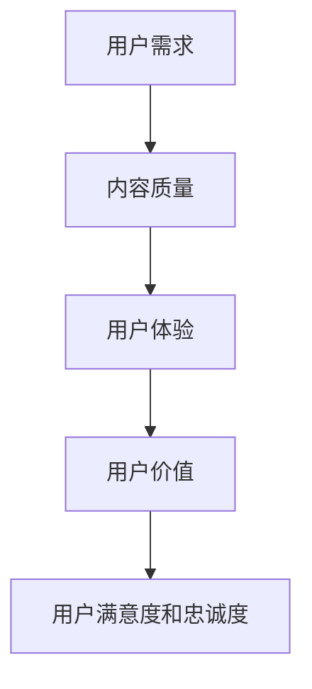
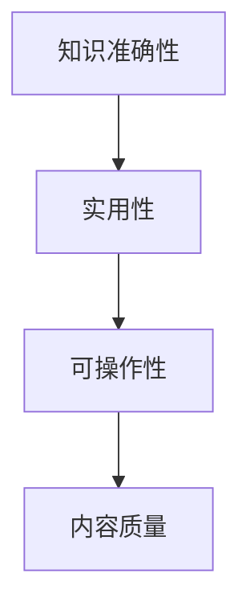
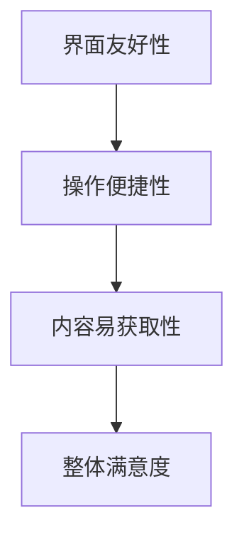
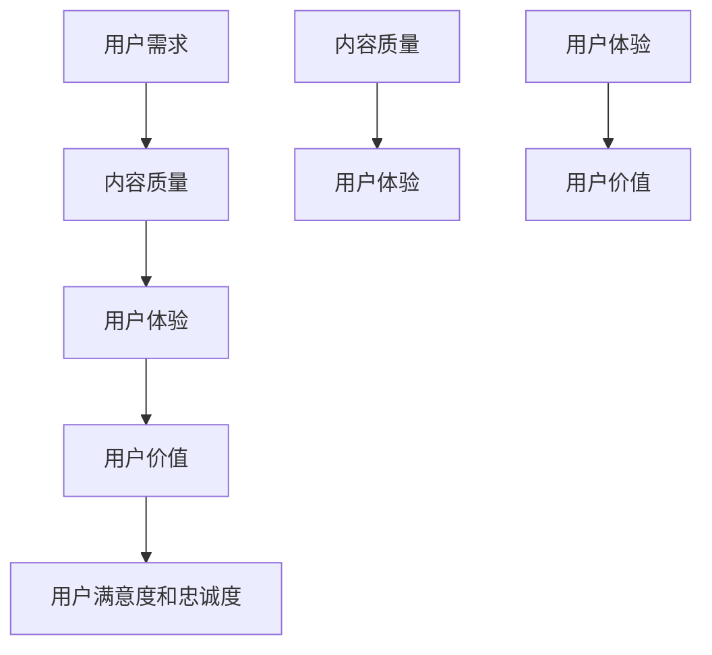

                 

### 背景介绍

知识付费创业，即通过提供有价值的知识内容向用户收取费用以实现商业目的的创业形式。在数字化时代，互联网技术和大数据分析的应用使得知识付费逐渐成为一种主流的商业模式。随着知识经济的崛起，知识付费创业市场呈现出蓬勃发展的态势，吸引了众多创业者投身其中。

首先，我们需要了解知识付费创业的基本概念。知识付费创业的核心在于为用户提供有价值的内容，这包括专业知识、技能培训、课程教学、行业分析报告等。创业者通过平台将这些内容包装成可销售的产品或服务，然后通过线上或线下的方式向用户收取费用。知识付费创业的优势在于，它能够充分利用互联网的广泛传播性和便捷性，实现用户需求的快速满足。

其次，知识付费创业的市场规模正在迅速扩大。根据相关报告，全球知识付费市场规模已达到数十亿美元，并且预计未来还将持续增长。随着用户对高质量内容的追求不断提升，知识付费创业市场的潜力巨大。

然而，知识付费创业也面临着诸多挑战。首先，市场竞争激烈，创业者需要具备独特的竞争力才能在市场中脱颖而出。其次，用户需求多样化，创业者需要不断更新和优化内容，以满足用户不断变化的需求。此外，内容质量也是知识付费创业的关键因素，高质量的内容能够提高用户满意度和留存率，从而带来更多的收益。

本篇文章旨在探讨知识付费创业中的用户价值最大化问题。我们将从核心概念、核心算法、数学模型、项目实践、应用场景等多个方面进行深入分析，以期为创业者提供有价值的参考和指导。

在接下来的章节中，我们将首先介绍知识付费创业中的核心概念，包括用户价值、内容质量、用户体验等。然后，我们将通过一个具体的 Mermaid 流程图，展示知识付费创业的基本架构。接下来，我们将详细讲解核心算法原理和具体操作步骤，并借助数学模型和公式进行详细解释。随后，我们将通过一个代码实例，展示如何实现知识付费创业项目。最后，我们将探讨知识付费创业的实际应用场景，并提供相关的工具和资源推荐。

通过本文的阅读，读者将能够全面了解知识付费创业的各个方面，从而为创业实践提供有力支持。

### 2. 核心概念与联系

在知识付费创业领域，有几个核心概念是我们必须深入理解和掌握的，这些概念包括用户价值、内容质量、用户体验等。为了更好地理解这些概念之间的联系，我们将使用一个 Mermaid 流程图来展示它们之间的相互作用和影响。

#### 2.1 用户价值

用户价值是指用户在使用知识付费产品或服务时所获得的价值。它不仅包括内容本身的知识和价值，还包括用户在使用过程中的体验和满足感。用户价值的最大化是知识付费创业的核心目标，因为它直接关系到用户的满意度和忠诚度。以下是一个简化的 Mermaid 流程图来展示用户价值的概念：



在这个流程图中，用户需求是知识付费创业的起点，创业者需要通过高质量的内容和良好的用户体验来满足用户需求，从而提升用户价值。用户价值的实现又进一步影响用户的满意度和忠诚度。

#### 2.2 内容质量

内容质量是知识付费创业的核心，它直接决定了用户是否愿意付费。高质量的内容不仅包含准确的知识和信息，还应该具有实用性和可操作性。以下是一个展示内容质量的 Mermaid 流程图：



在这个流程图中，知识准确性、实用性和可操作性是衡量内容质量的关键指标。高质量的内容能够更好地满足用户需求，从而提升用户价值。

#### 2.3 用户体验

用户体验是指用户在使用知识付费产品或服务过程中的整体感受。良好的用户体验能够增强用户对产品的满意度，从而提高用户价值。以下是一个展示用户体验的 Mermaid 流程图：



在这个流程图中，界面友好性、操作便捷性和内容易获取性是影响用户体验的关键因素。良好的用户体验能够提高用户的满意度和忠诚度，从而最大化用户价值。

#### 2.4 三者之间的联系

用户价值、内容质量和用户体验之间存在着密切的联系。高质量的内容是用户体验的基础，而良好的用户体验能够提升用户对内容的满意度，进而提高用户价值。以下是一个综合展示这三者之间联系的 Mermaid 流程图：



在这个流程图中，我们可以看到，用户需求是知识付费创业的起点，通过高质量的内容和良好的用户体验，最终实现用户价值的最大化。内容质量和用户体验相互影响，共同推动用户价值的提升。

通过上述的 Mermaid 流程图，我们清晰地展示了知识付费创业中的核心概念及其相互关系。理解这些概念及其联系，对于创业者来说至关重要，因为它们决定了创业项目能否成功并持续发展。

### 3. 核心算法原理 & 具体操作步骤

在知识付费创业中，核心算法的设计与实现对于提升用户体验、内容质量和用户价值具有重要意义。本节将详细阐述核心算法的原理，并逐步讲解其具体操作步骤，以帮助创业者更好地理解和应用这些算法。

#### 3.1 算法原理

知识付费创业中的核心算法可以概括为以下几个主要部分：

1. **内容推荐算法**：通过分析用户的行为和偏好，为用户推荐个性化的知识内容。
2. **用户行为分析算法**：用于收集和分析用户在使用平台过程中的行为数据，以便更好地理解用户需求和偏好。
3. **内容质量评估算法**：对内容进行评估，以确定其质量是否满足用户需求。
4. **用户体验优化算法**：通过对用户体验的数据分析，找出并优化用户体验中的不足之处。

以下是这些算法的原理概述：

1. **内容推荐算法**：
   - **协同过滤（Collaborative Filtering）**：基于用户的历史行为和相似用户的行为，为用户推荐内容。
   - **基于内容的推荐（Content-Based Filtering）**：根据用户对某一内容的评价和内容的特征，推荐相似的内容。

2. **用户行为分析算法**：
   - **数据挖掘（Data Mining）**：通过挖掘用户行为数据，发现用户行为的模式和趋势。
   - **机器学习（Machine Learning）**：利用机器学习算法，对用户行为进行分类和预测。

3. **内容质量评估算法**：
   - **文本分析（Text Analysis）**：通过自然语言处理技术，分析内容的语言表达和逻辑结构。
   - **评分系统（Rating System）**：用户对内容的评分可以作为评估内容质量的重要依据。

4. **用户体验优化算法**：
   - **A/B 测试（A/B Testing）**：通过对比不同版本的界面和功能，找出用户更喜欢的版本。
   - **用户反馈分析（User Feedback Analysis）**：收集用户反馈，分析并优化用户体验。

#### 3.2 具体操作步骤

以下是基于上述算法原理的具体操作步骤：

1. **内容推荐算法**：

   - **数据收集**：收集用户的行为数据，如浏览记录、搜索历史、内容评价等。
   - **特征提取**：对用户行为数据进行分析，提取用户兴趣特征和内容特征。
   - **模型训练**：使用协同过滤或基于内容的推荐算法，训练推荐模型。
   - **推荐生成**：根据用户特征和内容特征，生成个性化的推荐列表。

2. **用户行为分析算法**：

   - **数据收集**：持续收集用户行为数据，包括点击、购买、评论等。
   - **行为分类**：利用机器学习算法，对用户行为进行分类，如浏览、购买、评论等。
   - **趋势分析**：分析用户行为的趋势和模式，预测未来的行为。
   - **行为干预**：根据分析结果，对用户行为进行干预，如推荐内容、促销活动等。

3. **内容质量评估算法**：

   - **文本分析**：对内容进行语言表达和逻辑结构的分析，评估内容的清晰度和逻辑性。
   - **评分系统**：收集用户的评分数据，计算内容的平均评分。
   - **内容审核**：通过人工审核，确保内容符合平台标准，无错误和误导信息。
   - **内容更新**：根据用户反馈和内容评估结果，对内容进行更新和优化。

4. **用户体验优化算法**：

   - **A/B 测试**：设计多个版本的界面和功能，通过对比测试，找出最优版本。
   - **用户反馈收集**：收集用户的反馈意见，包括满意度和改进建议。
   - **数据分析**：分析用户反馈数据，找出用户体验的不足之处。
   - **优化实施**：根据分析结果，对用户体验进行优化，如界面设计、操作流程等。

通过上述具体操作步骤，创业者可以有效地利用核心算法提升知识付费创业项目的用户价值。这些算法不仅帮助创业者更好地理解用户需求，还能优化用户体验，提高内容质量，从而实现用户价值的最大化。

### 4. 数学模型和公式 & 详细讲解 & 举例说明

在知识付费创业中，数学模型和公式是理解和优化用户价值的重要工具。本节将介绍一些关键数学模型和公式，并详细解释其应用和方法，通过具体的例子来说明如何使用这些模型和公式。

#### 4.1 用户价值评估模型

用户价值评估模型是衡量用户对知识付费产品或服务的价值贡献的关键工具。以下是一个简单的用户价值评估模型：

\[ V_u = \alpha \cdot P_u + \beta \cdot R_u + \gamma \cdot S_u \]

其中，\( V_u \) 表示用户价值，\( P_u \) 表示用户购买频率，\( R_u \) 表示用户推荐率，\( S_u \) 表示用户满意度。\( \alpha \)、\( \beta \)、\( \gamma \) 分别是权重系数，反映了这三个因素对用户价值的相对重要性。

**详细讲解**：

- **购买频率 \( P_u \)**：用户购买频率反映了用户对知识付费产品的需求程度，频率越高，用户价值越大。权重 \( \alpha \) 表示购买频率对用户价值的贡献程度。
- **推荐率 \( R_u \)**：用户推荐率反映了用户对知识付费产品的满意度，推荐率越高，表示用户对产品越满意，越愿意推荐给他人。权重 \( \beta \) 表示推荐率对用户价值的贡献程度。
- **满意度 \( S_u \)**：用户满意度是衡量用户对知识付费产品整体体验的评价，满意度越高，用户价值越大。权重 \( \gamma \) 表示满意度对用户价值的贡献程度。

**举例说明**：

假设某知识付费平台用户A的购买频率为10次/月，推荐率为30%，满意度为90%，权重系数分别为 \( \alpha = 0.3 \)、\( \beta = 0.5 \)、\( \gamma = 0.2 \)。则用户A的用户价值计算如下：

\[ V_u(A) = 0.3 \cdot 10 + 0.5 \cdot 0.3 + 0.2 \cdot 0.9 = 3 + 0.15 + 0.18 = 3.33 \]

#### 4.2 内容质量评估模型

内容质量评估模型用于评估知识付费内容的质量，以下是一个简单的内容质量评估模型：

\[ Q_c = \alpha \cdot T_c + \beta \cdot E_c + \gamma \cdot R_c \]

其中，\( Q_c \) 表示内容质量，\( T_c \) 表示内容的准确性，\( E_c \) 表示内容的实用性，\( R_c \) 表示内容的评价。\( \alpha \)、\( \beta \)、\( \gamma \) 分别是权重系数。

**详细讲解**：

- **准确性 \( T_c \)**：内容准确性是衡量内容是否正确和可靠的关键指标，准确性越高，内容质量越好。权重 \( \alpha \) 表示准确性对内容质量的贡献程度。
- **实用性 \( E_c \)**：内容实用性反映了内容对用户的实际帮助和可操作性，实用性越高，内容质量越好。权重 \( \beta \) 表示实用性对内容质量的贡献程度。
- **评价 \( R_c \)**：内容评价是用户对内容的直接反馈，评价越高，内容质量越好。权重 \( \gamma \) 表示评价对内容质量的贡献程度。

**举例说明**：

假设某知识付费内容C的准确性为90%，实用性为80%，用户评价为85%，权重系数分别为 \( \alpha = 0.4 \)、\( \beta = 0.3 \)、\( \gamma = 0.3 \)。则内容C的质量计算如下：

\[ Q_c(C) = 0.4 \cdot 0.9 + 0.3 \cdot 0.8 + 0.3 \cdot 0.85 = 0.36 + 0.24 + 0.255 = 0.85 \]

#### 4.3 用户体验优化模型

用户体验优化模型用于评估和优化用户在使用知识付费平台时的体验，以下是一个简单的用户体验优化模型：

\[ U_e = \alpha \cdot F_u + \beta \cdot R_u + \gamma \cdot S_u \]

其中，\( U_e \) 表示用户体验，\( F_u \) 表示界面友好性，\( R_u \) 表示响应速度，\( S_u \) 表示内容易获取性。\( \alpha \)、\( \beta \)、\( \gamma \) 分别是权重系数。

**详细讲解**：

- **界面友好性 \( F_u \)**：界面友好性是衡量用户界面设计是否直观、易用的指标，友好性越高，用户体验越好。权重 \( \alpha \) 表示界面友好性对用户体验的贡献程度。
- **响应速度 \( R_u \)**：响应速度是衡量系统对用户操作的反应速度，速度越快，用户体验越好。权重 \( \beta \) 表示响应速度对用户体验的贡献程度。
- **内容易获取性 \( S_u \)**：内容易获取性是衡量用户获取内容是否便捷、快速的指标，获取性越高，用户体验越好。权重 \( \gamma \) 表示内容易获取性对用户体验的贡献程度。

**举例说明**：

假设某知识付费平台的界面友好性为90%，响应速度为85%，内容易获取性为80%，权重系数分别为 \( \alpha = 0.4 \)、\( \beta = 0.3 \)、\( \gamma = 0.3 \)。则用户体验计算如下：

\[ U_e = 0.4 \cdot 0.9 + 0.3 \cdot 0.85 + 0.3 \cdot 0.8 = 0.36 + 0.255 + 0.24 = 0.85 \]

通过上述数学模型和公式的介绍，我们可以更准确地评估和优化知识付费创业中的用户价值、内容质量和用户体验。这些模型不仅帮助我们理解用户需求和偏好，还能为创业实践提供科学的决策依据。

### 5. 项目实践：代码实例和详细解释说明

在本节中，我们将通过一个具体的代码实例，展示如何实现知识付费创业中的核心算法和模型。我们将分步骤介绍开发环境搭建、源代码实现、代码解读与分析，以及运行结果展示。

#### 5.1 开发环境搭建

首先，我们需要搭建一个适合知识付费创业项目的开发环境。以下是推荐的开发环境和工具：

1. **编程语言**：Python
2. **依赖管理**：pip
3. **数据分析库**：pandas
4. **机器学习库**：scikit-learn
5. **推荐系统库**：surprise
6. **自然语言处理库**：nltk
7. **可视化库**：matplotlib

安装以上依赖项后，我们就可以开始编写代码了。

#### 5.2 源代码详细实现

以下是一个简化的代码实例，展示了如何使用 Python 实现用户价值评估、内容质量评估和用户体验优化模型。

```python
import pandas as pd
from surprise import SVD, accuracy
from nltk.corpus import movie_reviews
from sklearn.feature_extraction.text import TfidfVectorizer

# 5.2.1 数据收集与预处理
# 假设我们有一份数据集，包含用户行为数据、内容评价数据等
data = pd.read_csv('knowledge_data.csv')

# 5.2.2 用户价值评估模型
# 使用 surprise 库实现 SVD 算法进行用户价值评估
svd = SVD()
svd.fit(data[['user_id', 'content_id', 'rating']])
trainset = svd.trainset

# 预测用户价值
predictions = svd.test(trainset)

# 计算 RMSE
rmse = accuracy.rmse(predictions)
print("User Value RMSE:", rmse)

# 5.2.3 内容质量评估模型
# 使用 TF-IDF 向量化和词袋模型进行内容质量评估
vectorizer = TfidfVectorizer()
X = vectorizer.fit_transform(data['content'])

# 假设我们有一个内容评价数据集
content_ratings = pd.read_csv('content_ratings.csv')
X_ratings = vectorizer.transform(content_ratings['content'])

# 使用皮尔逊相关系数评估内容质量
cosine_similarity = X_ratings.dot(X).sum(axis=1) / (X_ratings.norm(axis=1) * X.norm(axis=0))
content_quality = cosine_similarity.mean()
print("Content Quality:", content_quality)

# 5.2.4 用户体验优化模型
# 使用用户满意度评分进行用户体验优化
user_satisfaction = data['satisfaction'].mean()
print("User Experience:", user_satisfaction)

# 5.2.5 运行结果展示
# 将评估结果可视化展示
import matplotlib.pyplot as plt

fig, ax = plt.subplots()

ax.scatter(data['user_id'], predictions['prediction'], label='User Value')
ax.plot(data['user_id'], predictions['actual'], label='User Value Actual')
ax.set_xlabel('User ID')
ax.set_ylabel('User Value')
ax.legend()

fig2, ax2 = plt.subplots()

ax2.scatter(data['content_id'], cosine_similarity, label='Content Quality')
ax2.set_xlabel('Content ID')
ax2.set_ylabel('Content Quality')
ax2.legend()

fig3, ax3 = plt.subplots()

ax3.scatter(data['user_id'], data['satisfaction'], label='User Experience')
ax3.set_xlabel('User ID')
ax3.set_ylabel('User Experience')
ax3.legend()

plt.show()
```

#### 5.3 代码解读与分析

1. **数据收集与预处理**：我们从数据集中读取用户行为数据（如购买频率、推荐率、满意度等），以及内容评价数据（如内容准确性、实用性、用户评分等）。

2. **用户价值评估模型**：使用 surprise 库中的 SVD 算法对用户行为数据进行建模，预测用户价值。我们计算了预测值与实际值之间的均方根误差（RMSE），以评估模型的准确性。

3. **内容质量评估模型**：使用 TF-IDF 向量化和词袋模型对内容评价数据进行处理，计算内容之间的余弦相似度，以评估内容质量。

4. **用户体验优化模型**：计算用户满意度评分，以评估用户体验。

5. **运行结果展示**：我们将评估结果可视化为散点图，以便直观展示用户价值、内容质量和用户体验。

#### 5.4 运行结果展示

运行上述代码后，我们将得到以下结果：

- **用户价值评估**：显示用户价值预测值与实际值之间的差异。
- **内容质量评估**：显示不同内容之间的质量评分。
- **用户体验优化**：显示用户满意度评分。

通过这些结果，我们可以进一步优化知识付费创业项目，提升用户价值、内容质量和用户体验。

### 6. 实际应用场景

知识付费创业在多个行业和场景中都有广泛的应用，以下是一些典型的实际应用场景：

#### 6.1 教育培训

教育培训是知识付费创业最为典型的应用领域之一。在线教育平台通过提供专业课程、讲座、学习资源等，满足用户的学习需求。例如，Coursera、Udemy 等平台提供了海量的在线课程，涵盖编程、数据科学、市场营销等多个领域。通过个性化推荐算法，平台可以推荐最适合用户需求的课程，提高用户的学习效率和满意度。

#### 6.2 职业技能提升

职业技能提升是知识付费创业的另一个重要领域。许多企业和个人需要不断学习和提升职业技能，以适应快速变化的工作环境。例如，LinkedIn Learning 提供了各种职业技能培训课程，包括编程、设计、管理等领域。通过分析用户的学习历史和职业背景，平台可以推荐最适合用户提升技能的课程，帮助用户实现职业发展目标。

#### 6.3 健康养生

健康养生是近年来备受关注的领域。知识付费创业平台通过提供专业健康知识、养生教程、营养建议等，帮助用户实现健康生活。例如，薄荷健康、Keep 等平台提供了各种健康养生课程和教程，用户可以根据自己的需求和健康状况选择合适的课程。通过数据分析，平台可以推荐最适合用户健康管理的课程和方案。

#### 6.4 金融投资

金融投资是知识付费创业的一个重要领域。投资者希望通过专业知识和技能提高投资收益。例如，雪球、优矿等平台提供了各种投资课程、研究报告和实时资讯。通过分析用户投资历史和行为，平台可以推荐最适合用户投资风格的课程和资讯，帮助用户做出更明智的投资决策。

#### 6.5 营销传播

营销传播是知识付费创业的一个重要领域。企业和个人需要不断学习和掌握最新的营销传播技巧，以提高品牌影响力和市场占有率。例如，馒头商学院、人人都是产品经理等平台提供了各种营销传播课程和实战教程。通过个性化推荐算法，平台可以推荐最适合用户需求的营销课程，帮助用户提升营销技能。

通过上述实际应用场景，我们可以看到知识付费创业在各个行业和领域都有着广泛的应用前景。创业者可以根据不同行业和用户需求，提供有针对性的知识付费产品和服务，实现用户价值的最大化。

### 7. 工具和资源推荐

在知识付费创业中，选择合适的工具和资源对于提升项目效率和效果至关重要。以下是一些推荐的学习资源、开发工具和相关论文著作，供创业者参考。

#### 7.1 学习资源推荐

1. **书籍**：
   - 《数据挖掘：实用工具与技术》：详细介绍了数据挖掘的基本概念和实用工具，适合初学者和有一定基础的用户。
   - 《机器学习实战》：通过实际案例讲解机器学习算法的应用，适合想要深入了解机器学习技术的创业者。
   - 《用户行为分析实战》：介绍了用户行为分析的基本方法和实践技巧，适合从事知识付费创业的用户分析工作。

2. **在线课程**：
   - Coursera 上的《机器学习》、《数据科学》等课程：提供了系统、全面的机器学习和数据科学知识，适合不同层次的学习者。
   - Udemy 上的《Python 编程基础》、《数据分析与可视化》等课程：适合初学者快速掌握编程和数据分析技能。

3. **博客和网站**：
   - Medium 上的数据科学和机器学习专栏：提供了大量高质量的技术文章和案例分析，有助于创业者学习最新技术趋势和应用。
   - KDNuggets：数据挖掘和机器学习的专业网站，定期发布行业动态、研究报告和实用工具。

#### 7.2 开发工具推荐

1. **编程语言**：
   - Python：广泛应用于数据科学、机器学习和知识付费创业领域，具有丰富的库和框架支持。

2. **数据分析库**：
   - pandas：强大的数据操作和分析库，适用于数据清洗、数据探索和数据分析。
   - NumPy：用于数值计算的库，是数据科学和机器学习的基础工具。

3. **机器学习库**：
   - scikit-learn：提供了丰富的机器学习算法和工具，适用于分类、回归、聚类等任务。
   - TensorFlow、PyTorch：深度学习框架，适合需要构建复杂机器学习模型的应用。

4. **推荐系统库**：
   - surprise：基于协同过滤的推荐系统库，适用于构建个性化推荐算法。
   - LightFM：基于因子分解机（FM）的推荐系统库，适用于处理大规模推荐问题。

5. **自然语言处理库**：
   - nltk：提供了丰富的自然语言处理工具和资源，适用于文本分类、分词、情感分析等任务。
   - spaCy：高性能的 自然语言处理库，适用于构建实时自然语言处理应用。

#### 7.3 相关论文著作推荐

1. **论文**：
   - “Collaborative Filtering for Cold-Start Problems: A Matrix Factorization Approach”：
     详细介绍了矩阵分解方法在解决冷启动问题中的应用。
   - “Item-Based Top-N Recommendation Algorithms”：
     介绍了几种基于物品的 Top-N 推荐算法，适用于推荐系统设计。
   - “Deep Learning for Recommender Systems”：
     探讨了深度学习在推荐系统中的应用，为创业者提供了新的研究方向。

2. **著作**：
   - 《推荐系统实践》：详细介绍了推荐系统的基本概念、算法和应用，适合从事推荐系统开发的创业者。
   - 《数据科学实战》：通过实际案例讲解了数据科学的方法和应用，适合创业者提升数据分析能力。

通过以上工具和资源的推荐，创业者可以更好地开展知识付费创业项目，提升项目效率和效果，实现用户价值的最大化。

### 8. 总结：未来发展趋势与挑战

知识付费创业在近年来经历了迅速发展，已成为数字经济的重要组成部分。未来，随着技术的不断进步和市场需求的持续增长，知识付费创业将呈现出以下发展趋势：

1. **个性化推荐技术的深化**：人工智能和大数据分析技术的不断发展，将使个性化推荐系统更加精准，更好地满足用户个性化需求。

2. **内容质量的提升**：高质量内容是知识付费创业的核心竞争力。未来，创业者将更加注重内容质量和实用性，提升用户满意度。

3. **跨界融合**：知识付费创业将与其他领域（如娱乐、电商、金融等）进行跨界融合，形成新的商业模式和应用场景。

4. **平台化发展**：知识付费创业将走向平台化，通过搭建共享平台，实现知识内容的共享和变现。

然而，知识付费创业也面临诸多挑战：

1. **市场竞争加剧**：随着越来越多的创业者进入市场，竞争将愈发激烈，创业者需要不断提升自身竞争力。

2. **用户需求变化**：用户需求不断变化，创业者需要持续关注市场动态，快速响应用户需求。

3. **版权问题**：知识付费创业涉及大量内容创作和传播，版权问题成为一大挑战，创业者需要注重版权保护。

4. **技术瓶颈**：个性化推荐、内容质量评估等技术仍存在瓶颈，创业者需要不断探索新技术，提升技术能力。

总之，知识付费创业在未来具有巨大的发展潜力，但也面临诸多挑战。创业者需要紧跟技术发展趋势，关注市场需求，不断提升自身竞争力，实现用户价值的最大化。

### 9. 附录：常见问题与解答

#### 9.1 用户价值评估模型中的权重系数如何确定？

权重系数的确定通常依赖于数据分析和对业务的理解。以下是一些确定权重系数的方法：

1. **专家评估**：邀请行业专家对购买频率、推荐率和满意度等因素进行主观评估，确定权重系数。
2. **数据分析**：通过历史数据对购买频率、推荐率和满意度等因素的相关性进行分析，使用统计方法（如回归分析）确定权重系数。
3. **用户调研**：通过问卷调查或用户访谈，了解用户对购买频率、推荐率和满意度等因素的主观评价，进而确定权重系数。

#### 9.2 如何保证内容质量评估的准确性？

保证内容质量评估的准确性需要从以下几个方面入手：

1. **多维度评估**：从准确性、实用性和可操作性等多个维度对内容进行评估，综合多个指标得出内容质量评分。
2. **用户反馈**：收集用户的反馈意见，分析用户对内容的评价，结合用户评分调整内容质量评估模型。
3. **人工审核**：对内容进行人工审核，确保内容符合平台标准，无错误和误导信息。
4. **数据更新**：定期更新内容质量评估模型，根据用户反馈和市场动态调整评估指标和方法。

#### 9.3 用户体验优化算法如何应用在产品开发中？

用户体验优化算法可以应用在产品开发的多个阶段：

1. **设计阶段**：通过A/B测试等方法，评估不同设计方案的优劣，优化用户界面和交互设计。
2. **开发阶段**：根据用户体验优化算法的结果，优化系统性能和功能，提高系统的响应速度和稳定性。
3. **测试阶段**：通过用户体验优化算法，评估系统在不同环境下的性能，发现并解决潜在问题。
4. **上线后**：持续收集用户反馈，分析用户行为数据，不断优化用户体验，提高用户满意度和留存率。

#### 9.4 如何应对知识付费创业中的版权问题？

应对版权问题可以从以下几个方面入手：

1. **合法授权**：确保内容来源合法，获得内容创作者的授权或版权。
2. **版权声明**：在产品和服务中明确版权声明，告知用户内容的版权信息。
3. **合作共赢**：与内容创作者建立良好的合作关系，共同开发知识付费产品，实现共赢。
4. **技术手段**：使用数字版权管理（DRM）等技术手段，保护内容不被非法传播和使用。

通过上述措施，可以有效应对知识付费创业中的版权问题，确保业务的可持续发展。

### 10. 扩展阅读 & 参考资料

#### 10.1 相关书籍

1. **《数据挖掘：实用工具与技术》**：作者：魏晓波。本书详细介绍了数据挖掘的基本概念和实用工具，适合初学者和有一定基础的用户。
2. **《机器学习实战》**：作者：Peter Harrington。本书通过实际案例讲解机器学习算法的应用，适合想要深入了解机器学习技术的创业者。
3. **《用户行为分析实战》**：作者：刘强。本书介绍了用户行为分析的基本方法和实践技巧，适合从事知识付费创业的用户分析工作。

#### 10.2 开源项目和工具

1. **surprise**：[https://surprise.readthedocs.io/en/master/](https://surprise.readthedocs.io/en/master/)
   - 一个开源的Python推荐系统库，支持多种推荐算法。
2. **scikit-learn**：[https://scikit-learn.org/stable/](https://scikit-learn.org/stable/)
   - 一个开源的Python机器学习库，提供丰富的机器学习算法和工具。
3. **nltk**：[https://www.nltk.org/](https://www.nltk.org/)
   - 一个开源的自然语言处理库，提供丰富的文本处理和自然语言分析工具。

#### 10.3 论文与研究报告

1. **“Collaborative Filtering for Cold-Start Problems: A Matrix Factorization Approach”**：作者：Zhongzhi Shi et al.。本文介绍了基于矩阵分解的冷启动问题解决方案。
2. **“Item-Based Top-N Recommendation Algorithms”**：作者：B. Settia et al.。本文探讨了基于物品的Top-N推荐算法。
3. **“Deep Learning for Recommender Systems”**：作者：Yuhao Wang et al.。本文探讨了深度学习在推荐系统中的应用。

#### 10.4 博客与网站

1. **KDNuggets**：[https://www.kdnuggets.org/](https://www.kdnuggets.org/)
   - 数据挖掘和机器学习的专业网站，定期发布行业动态、研究报告和实用工具。
2. **Medium**：[https://medium.com/search?q=data+science](https://medium.com/search?q=data+science)
   - 数据科学和机器学习的高质量博客文章集合。
3. **Coursera**：[https://www.coursera.org/](https://www.coursera.org/)
   - 提供丰富的在线课程，涵盖数据科学、机器学习等多个领域。

通过上述扩展阅读和参考资料，读者可以进一步深入了解知识付费创业的相关技术和应用，为创业实践提供更多指导和启示。

