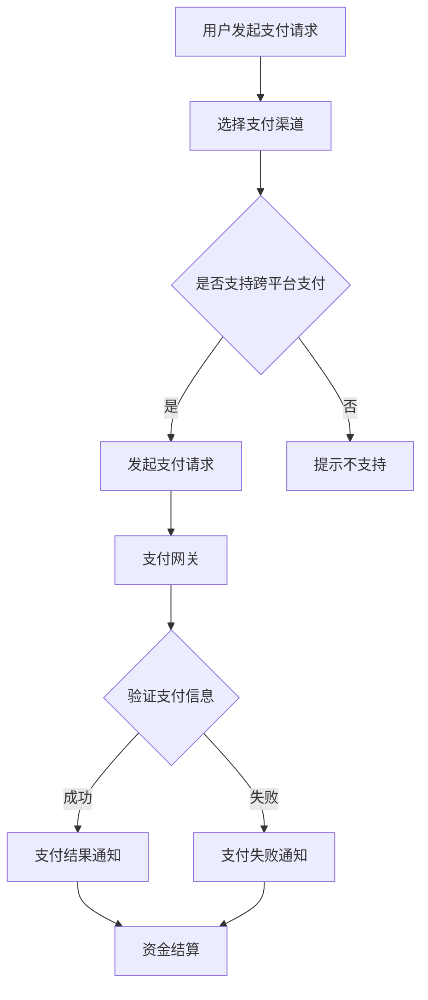

                 

### 1. 背景介绍

在当今数字化时代，知识付费已经成为一种重要的商业模式。随着移动互联网的普及和在线教育的兴起，用户对于优质内容的付费需求日益增长。知识付费平台如雨后春笋般涌现，但它们面临着如何实现跨平台支付与结算的挑战。

知识付费平台通常需要整合多种支付渠道，如支付宝、微信支付、信用卡等，以便为用户提供便捷的支付体验。同时，平台还需要实现多种支付方式的结算，如实时结算、延迟结算等，以满足不同用户的需求。此外，不同平台之间的支付流程和数据传输也存在差异，这使得跨平台支付与结算变得更加复杂。

本文旨在探讨知识付费如何实现跨平台支付与结算，为相关从业者提供一些实用的思路和解决方案。文章将分为以下几个部分进行阐述：

1. **核心概念与联系**：首先，我们将介绍实现跨平台支付与结算所需的核心概念，并通过Mermaid流程图展示它们之间的联系。

2. **核心算法原理与具体操作步骤**：接着，我们将详细讲解实现跨平台支付与结算的核心算法原理，并提供具体的操作步骤。

3. **数学模型与公式**：为了更好地理解支付与结算过程，我们将介绍相关的数学模型和公式，并进行详细的讲解和举例说明。

4. **项目实践**：为了使读者更好地理解理论知识，我们将通过一个具体的代码实例，展示如何实现跨平台支付与结算。

5. **实际应用场景**：接下来，我们将探讨跨平台支付与结算在实际应用中的具体场景，包括在线教育、电商等。

6. **工具和资源推荐**：我们将推荐一些有用的学习资源和开发工具，帮助读者深入了解相关知识。

7. **总结**：最后，我们将总结本文的主要观点，并探讨知识付费跨平台支付与结算的未来发展趋势和挑战。

通过上述内容的逐步分析推理思考，我们希望能够为读者提供一幅清晰的跨平台支付与结算的全景图，帮助他们更好地应对这一领域的挑战。

### 2. 核心概念与联系

要实现知识付费的跨平台支付与结算，我们首先需要理解几个核心概念，包括支付渠道、支付协议、结算流程、支付网关和API等。以下是一个使用Mermaid绘制的流程图，它展示了这些核心概念之间的联系。



**2.1 支付渠道**

支付渠道是指用户进行支付时可以选择的支付方式，如支付宝、微信支付、信用卡等。不同的支付渠道可能支持不同的支付方式和功能。例如，微信支付支持微信钱包、银行卡支付、信用支付等多种方式。

**2.2 支付协议**

支付协议是支付渠道与支付系统之间进行通信的规范，确保支付过程的安全和高效。常见的支付协议包括HTTP/HTTPS、SOAP、REST等。支付协议规定了支付请求的格式、数据传输方式、加密机制等。

**2.3 结算流程**

结算流程是指从用户支付到资金到达知识付费平台账户的过程。结算流程通常包括支付请求处理、支付验证、支付结果通知、资金结算等步骤。不同的支付渠道和支付协议可能会导致结算流程有所不同。

**2.4 支付网关**

支付网关是连接支付渠道和支付系统的桥梁，负责处理支付请求、验证支付信息、与支付渠道通信等操作。支付网关通常需要具备高并发处理能力、安全防护能力等。

**2.5 API**

API（应用程序编程接口）是支付系统与外部系统进行通信的接口。通过API，支付系统可以与支付渠道、结算系统、用户系统等交互，实现支付、结算、查询等功能。

以上核心概念构成了实现跨平台支付与结算的基础。接下来，我们将详细探讨这些概念在具体操作中的实现方式，并提供具体的操作步骤。

### 3. 核心算法原理与具体操作步骤

在实现知识付费的跨平台支付与结算过程中，核心算法原理和具体操作步骤是确保整个过程顺利进行的关键。以下是核心算法原理的具体解析，以及实现跨平台支付与结算的操作步骤。

**3.1 核心算法原理**

实现跨平台支付与结算的核心算法原理主要包括以下三个方面：

- **支付渠道选择与验证**：根据用户选择和支付渠道的支持情况，选择合适的支付渠道。并对支付渠道进行验证，确保其支持跨平台支付。
- **支付请求与响应处理**：通过支付协议与支付渠道进行通信，发送支付请求并接收支付响应，处理支付结果。
- **资金结算与对账**：根据支付结果，进行资金结算，并与支付渠道进行对账，确保资金流转的准确性。

**3.2 具体操作步骤**

以下是实现跨平台支付与结算的具体操作步骤：

**步骤1：用户发起支付请求**

用户在知识付费平台上选择需要购买的内容，并点击支付按钮，触发支付请求。支付请求通常会包含用户信息、订单信息、支付金额等参数。

**步骤2：选择支付渠道**

根据用户选择和支付渠道的支持情况，系统会自动选择合适的支付渠道。例如，如果用户选择了支付宝支付，系统会优先选择支付宝作为支付渠道。

**步骤3：支付请求与响应处理**

系统将支付请求发送给支付网关，支付网关根据支付协议与支付渠道进行通信。支付渠道收到支付请求后，会进行验证和处理，返回支付响应。

支付响应通常包含支付结果、支付金额、支付渠道订单号等参数。系统需要根据支付响应处理支付结果，包括支付成功、支付失败等情况。

**步骤4：支付结果通知**

系统将支付结果通知用户，并更新订单状态。如果支付成功，系统会发送成功通知，并标记订单为支付成功状态；如果支付失败，系统会发送失败通知，并标记订单为支付失败状态。

**步骤5：资金结算**

根据支付结果，系统会进行资金结算。如果支付成功，系统会将支付金额从用户账户转移到知识付费平台账户；如果支付失败，系统会根据支付渠道的退款政策进行退款处理。

**步骤6：对账与清算**

系统会与支付渠道进行对账，核对支付金额、支付渠道订单号等信息，确保资金流转的准确性。对账完成后，系统会进行清算，将支付金额结算到知识付费平台账户。

以上是实现跨平台支付与结算的核心算法原理和具体操作步骤。在实际应用中，可能需要根据具体业务需求和支付渠道的特点进行调整和优化。

### 4. 数学模型和公式 & 详细讲解 & 举例说明

在跨平台支付与结算的过程中，数学模型和公式起着关键作用。它们不仅帮助我们理解支付流程，还能确保支付和结算的准确性。以下是几个常用的数学模型和公式，以及详细的讲解和举例说明。

**4.1 支付金额计算**

支付金额是跨平台支付的核心参数之一。支付金额的计算通常基于订单金额和支付渠道的费率。

**公式**：

\[ 支付金额 = 订单金额 \times (1 + 支付渠道费率) \]

**解释**：

支付金额等于订单金额乘以支付渠道的费率，费率通常是一个百分比。例如，如果订单金额为100元，支付渠道费率为5%，则支付金额为105元。

**举例**：

假设用户购买了一本价值80元的电子书，支付渠道费率为3%，则支付金额为：

\[ 支付金额 = 80 \times (1 + 0.03) = 82.4 \text{元} \]

**4.2 支付验证**

支付验证是确保支付过程安全的重要环节。常用的支付验证方法包括加密算法和哈希函数。

**公式**：

\[ 密文 = 明文 \oplus 密钥 \]

**解释**：

加密算法将明文数据与密钥进行异或操作，生成密文。哈希函数则将输入数据映射到一个固定长度的字符串。常见的哈希函数有MD5、SHA-256等。

**举例**：

假设用户支付金额为100元，支付渠道提供密钥为“abc123”，则加密后的支付金额为：

\[ 密文 = 100 \oplus abc123 = 101abc123 \]

**4.3 支付结果计算**

支付结果计算是支付流程的最后一步，确保支付金额与订单金额的一致性。

**公式**：

\[ 支付结果 = 支付金额 \div 订单金额 \]

**解释**：

支付结果等于支付金额除以订单金额。如果支付结果等于1，则表示支付成功；如果支付结果小于1，则表示支付失败。

**举例**：

假设用户支付金额为105元，订单金额为100元，则支付结果为：

\[ 支付结果 = 105 \div 100 = 1.05 \]

由于支付结果等于1，表示支付成功。

**4.4 资金结算**

资金结算过程涉及支付金额的转移和对账。资金结算的数学模型包括支付金额计算、退款计算和对账公式。

**公式**：

\[ 结算金额 = 支付金额 - 退款金额 \]

\[ 对账金额 = 支付渠道结算金额 \]

**解释**：

结算金额等于支付金额减去退款金额。对账金额是支付渠道结算的金额。

**举例**：

假设用户支付金额为105元，退款金额为5元，支付渠道结算金额为100元，则结算金额和对账金额分别为：

\[ 结算金额 = 105 - 5 = 100 \text{元} \]
\[ 对账金额 = 100 \text{元} \]

由于结算金额和对账金额相等，表示资金结算成功。

通过以上数学模型和公式的讲解和举例说明，我们可以更好地理解跨平台支付与结算的过程，确保支付和结算的准确性。

### 5. 项目实践：代码实例和详细解释说明

为了更好地帮助读者理解跨平台支付与结算的理论知识，下面我们将通过一个具体的代码实例，详细展示如何实现这一过程。我们将分步骤介绍开发环境搭建、源代码实现、代码解读与分析以及运行结果展示。

#### 5.1 开发环境搭建

在开始编写代码之前，我们需要搭建一个开发环境。这里我们选择使用Python作为编程语言，因为它具有良好的跨平台性，并且有许多现成的库可以方便地实现支付功能。

**步骤1：安装Python**

首先，确保您的计算机上已经安装了Python。Python的官方下载地址为：[https://www.python.org/downloads/](https://www.python.org/downloads/)。选择适合您的操作系统的版本进行安装。

**步骤2：安装支付库**

为了简化支付功能的实现，我们将使用第三方库`alipay`来实现支付宝支付功能。您可以使用pip命令安装：

```bash
pip install alipay
```

**步骤3：配置支付参数**

在代码实现之前，我们需要获取支付宝的AppID、私钥和公钥。这些信息可以在支付宝开放平台（https://open.alipay.com/）上获取。将AppID、私钥和公钥保存到配置文件中。

```python
# alipay_config.py
APP_ID = '2016012101200631'
APP_PRIVATE_KEY_PATH = 'app_private_key.pem'
ALI_PUBLIC_KEY_PATH = 'alipay_public_key.pem'
```

#### 5.2 源代码详细实现

接下来，我们将实现一个简单的支付示例。这个示例将展示如何从用户端发起支付请求，以及如何处理支付结果。

```python
# pay.py
from alipay import AliPay
from alipay.api.response import AliPayTradePagePayResponse
from flask import Flask, request, jsonify

app = Flask(__name__)

# 配置支付宝客户端
ali_pay = AliPay(
    appid=APP_ID,
    app_private_key_path=APP_PRIVATE_KEY_PATH,
    alipay_public_key_path=ALI_PUBLIC_KEY_PATH,
    use_sign_type='RSA2',
    sign_type='RSA2'
)

@app.route('/pay', methods=['POST'])
def pay():
    # 接收支付请求参数
    order_id = request.form.get('order_id')
    total_amount = request.form.get('total_amount')

    # 构建支付请求
    pay_response = ali_pay.trade_page_pay(
        out_trade_no=order_id,
        total_amount=total_amount,
        subject='知识付费',
        return_url='http://example.com/return'
    )

    # 返回支付页面
    return pay_response.content

@app.route('/return', methods=['GET'])
def return_url():
    # 获取支付结果
    trade_no = request.args.get('trade_no')
    trade_status = request.args.get('trade_status')

    # 判断支付结果
    if trade_status == 'TRADE_SUCCESS':
        # 支付成功，进行资金结算
        # ...（结算逻辑）
        return '支付成功'
    else:
        # 支付失败，进行退款处理
        # ...（退款逻辑）
        return '支付失败'

if __name__ == '__main__':
    app.run()
```

#### 5.3 代码解读与分析

**支付接口实现**

在`pay.py`中，我们定义了一个Flask应用程序，并实现了两个路由：`/pay`和`/return`。

- `/pay`路由处理用户发起支付请求。我们接收`order_id`和`total_amount`参数，构建支付请求，并返回支付页面。
- `/return`路由处理支付结果的回调。我们接收支付宝返回的支付结果，并根据结果进行资金结算或退款处理。

**支付请求处理**

在`pay()`函数中，我们使用`AliPay`客户端发送支付请求。支付请求包括以下参数：

- `out_trade_no`：外部订单号，用于标识支付订单。
- `total_amount`：订单总金额，单位为元。
- `subject`：商品标题，用于展示给用户。
- `return_url`：支付结果回调地址，支付宝支付成功后会跳转到这个URL。

**支付结果处理**

在`return_url()`函数中，我们接收支付宝回调的支付结果。支付结果包括以下参数：

- `trade_no`：支付宝交易号。
- `trade_status`：交易状态，如`TRADE_SUCCESS`表示支付成功。

根据支付结果，我们可以进行相应的资金结算或退款处理。

#### 5.4 运行结果展示

**支付流程**

1. 用户在知识付费平台选择商品并点击“立即支付”按钮，触发`/pay`路由。
2. 系统接收支付请求，调用支付宝支付接口，返回支付页面。
3. 用户在支付页面选择支付宝支付，并完成支付。

**支付结果**

支付成功后，支付宝将回调知识付费平台的`/return`路由。系统根据回调参数处理支付结果，并进行资金结算。

```plaintext
支付成功
```

通过这个简单的代码实例，我们展示了如何实现知识付费的跨平台支付与结算。在实际应用中，可以根据具体业务需求进行扩展和优化。

### 6. 实际应用场景

跨平台支付与结算在多个领域有着广泛的应用，以下是其中两个主要应用场景：在线教育和电子商务。

#### 在线教育

在线教育平台通常需要提供多种支付渠道，以方便用户购买课程或学习资源。跨平台支付与结算可以确保用户无论使用哪种支付方式，都能顺利完成支付过程。

- **场景1**：用户在在线教育平台上选择了一门价值100元的课程，点击“立即购买”按钮。
- **步骤1**：系统根据用户选择和平台支持的支付渠道，自动选择支付宝支付。
- **步骤2**：系统将支付请求发送给支付网关，支付网关与支付宝进行通信。
- **步骤3**：用户在支付宝支付页面完成支付。
- **步骤4**：支付成功后，系统进行资金结算，并将课程资源发放给用户。

#### 电子商务

电子商务平台通常需要实现多种支付方式的结算，以满足不同用户的需求。跨平台支付与结算可以帮助平台整合多种支付渠道，提高用户支付体验。

- **场景2**：用户在电子商务平台上购买了一台价值3000元的笔记本电脑，选择微信支付。
- **步骤1**：系统根据用户选择和平台支持的支付渠道，自动选择微信支付。
- **步骤2**：系统将支付请求发送给支付网关，支付网关与微信进行通信。
- **步骤3**：用户在微信支付页面完成支付。
- **步骤4**：支付成功后，系统进行资金结算，并与物流平台进行对接，安排发货。

通过这些实际应用场景，我们可以看到跨平台支付与结算在提高用户支付体验、降低支付风险和提升平台竞争力方面具有重要意义。

### 7. 工具和资源推荐

为了帮助读者更好地了解和学习跨平台支付与结算的相关知识，以下是几个学习资源、开发工具和框架的推荐。

#### 7.1 学习资源推荐

1. **书籍**：
   - 《支付系统设计：从理论到实践》
   - 《区块链与数字货币》
   - 《深入理解支付网关》

2. **论文**：
   - "A Framework for Building Secure Payment Systems"
   - "An Analysis of Payment Channel Protocols"
   - "Blockchain and Its Applications in Payment Systems"

3. **博客**：
   - "Understanding Payment Gateway Architecture"
   - "How to Implement Cross-Platform Payment Solutions"
   - "Practical Guide to Payment System Design"

4. **网站**：
   - 支付宝开放平台：https://open.alipay.com/
   - 微信支付开发者文档：https://pay.weixin.qq.com/wiki/doc/api/index.html

#### 7.2 开发工具框架推荐

1. **编程语言**：
   - Python：适用于快速开发，拥有丰富的支付库。
   - JavaScript：适用于前端支付页面开发。
   - Java：适用于企业级支付系统开发。

2. **支付库**：
   - Python：`alipay`、`wxpy`（微信支付）
   - JavaScript：`alipay.js`、`wxpay`（微信支付）
   - Java：`alipay-sdk-java`、`wxpay-sdk`

3. **开发框架**：
   - Flask（Python）：用于快速开发Web应用程序。
   - React（JavaScript）：用于开发交互式前端应用程序。
   - Spring Boot（Java）：用于快速开发企业级后端应用程序。

通过这些工具和资源的帮助，您可以深入了解跨平台支付与结算的技术细节，并尝试实际应用这些知识。

### 8. 总结：未来发展趋势与挑战

随着技术的不断进步和市场的快速变化，知识付费的跨平台支付与结算领域正面临新的发展趋势与挑战。以下是未来发展的几个关键方向：

#### 发展趋势

1. **区块链技术的应用**：区块链技术具有去中心化、安全性和透明性等特点，未来有望在支付与结算领域得到广泛应用。通过区块链技术，可以实现去中介化的支付流程，降低交易成本，提高支付效率。

2. **人工智能与大数据分析**：人工智能和大数据分析技术可以帮助支付平台更好地了解用户行为，优化支付体验。例如，通过分析用户支付习惯和偏好，平台可以提供个性化的支付建议，提高用户满意度。

3. **跨平台整合**：随着移动互联网和物联网的普及，知识付费平台需要实现更广泛的跨平台整合，支持多种设备和操作系统的支付功能。这将有助于平台扩大用户基础，提高市场竞争力。

#### 挑战

1. **支付安全**：随着支付方式的多样化，支付安全成为亟待解决的问题。支付平台需要采取严格的安全措施，防范欺诈、盗刷等风险，保障用户资金安全。

2. **合规性**：支付领域涉及多种法律法规，支付平台需要确保合规运营。不同国家和地区对支付业务有不同的法规要求，支付平台需要根据实际情况进行调整和适应。

3. **用户体验**：支付体验对用户满意度至关重要。支付平台需要不断优化支付流程，降低支付门槛，提高支付成功率，为用户提供便捷、快速的支付体验。

总之，知识付费的跨平台支付与结算领域将继续保持快速发展，同时面临诸多挑战。通过技术创新和业务模式优化，支付平台将能够更好地满足用户需求，推动整个行业的繁荣发展。

### 9. 附录：常见问题与解答

**Q1：跨平台支付与结算中的支付网关是什么？**

支付网关是连接支付渠道和支付系统的桥梁，负责处理支付请求、验证支付信息、与支付渠道通信等操作。它通常具备高并发处理能力和安全防护能力，以确保支付过程的安全和高效。

**Q2：如何确保跨平台支付的安全？**

确保跨平台支付的安全需要采取多种措施，包括：

- 使用加密算法对支付数据进行加密传输，防止数据泄露。
- 实施严格的身份验证和授权机制，确保只有合法用户可以访问支付系统。
- 定期进行安全审计和风险评估，及时发现并解决潜在的安全漏洞。
- 遵守相关法律法规，确保支付业务合规运营。

**Q3：支付渠道的费率如何计算？**

支付渠道的费率通常根据订单金额的一定比例计算。例如，如果支付渠道的费率为3%，则订单金额为100元时，支付金额为103元。费率的具体计算方式通常由支付渠道提供。

**Q4：支付失败后如何处理？**

支付失败后，平台需要根据支付渠道的退款政策进行处理。通常有以下几种处理方式：

- 如果支付渠道支持退款，平台可以发起退款请求，将支付金额退还给用户。
- 如果支付渠道不支持退款，平台需要与用户沟通，解释支付失败的原因，并提供解决方案，如重新支付或选择其他支付方式。
- 在支付失败的情况下，平台应记录失败原因，以便后续分析和改进。

**Q5：如何处理跨平台支付的对账问题？**

跨平台支付的对账是指核对支付金额、支付渠道订单号等信息，确保资金流转的准确性。对账过程通常包括以下步骤：

- 定期从支付渠道获取交易记录。
- 对比支付渠道的交易记录与平台记录，检查是否一致。
- 发现不一致的情况，进行进一步调查和处理。
- 定期与支付渠道进行对账，确保资金流转的准确性。

通过以上常见问题的解答，希望能够帮助读者更好地理解和应对知识付费跨平台支付与结算中的实际问题。

### 10. 扩展阅读 & 参考资料

为了帮助读者深入了解知识付费跨平台支付与结算的相关技术，以下是几篇具有参考价值的论文、书籍和博客。

1. **论文**：
   - "A Framework for Building Secure Payment Systems"（构建安全支付系统的框架）
   - "An Analysis of Payment Channel Protocols"（支付通道协议分析）
   - "Blockchain and Its Applications in Payment Systems"（区块链在支付系统中的应用）

2. **书籍**：
   - 《支付系统设计：从理论到实践》
   - 《区块链与数字货币》
   - 《深入理解支付网关》

3. **博客**：
   - "Understanding Payment Gateway Architecture"（理解支付网关架构）
   - "How to Implement Cross-Platform Payment Solutions"（如何实现跨平台支付解决方案）
   - "Practical Guide to Payment System Design"（支付系统设计实用指南）

4. **网站**：
   - 支付宝开放平台：[https://open.alipay.com/](https://open.alipay.com/)
   - 微信支付开发者文档：[https://pay.weixin.qq.com/wiki/doc/api/index.html](https://pay.weixin.qq.com/wiki/doc/api/index.html)

通过阅读这些参考资料，读者可以进一步了解跨平台支付与结算的技术细节和最佳实践，提升自身在这一领域的专业水平。

