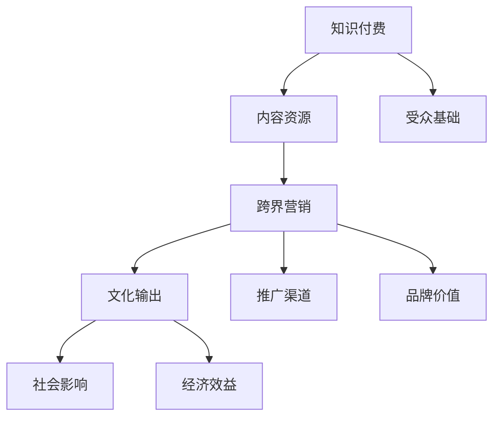

                 

### 背景介绍

#### 知识付费的兴起

知识付费作为一种商业模式，起源于互联网时代的不断发展和用户需求的多样化。在传统的教育体系中，知识主要是由学校和教师传授的，学生需要通过上课和完成作业来获取知识。然而，随着互联网技术的进步，信息的获取变得更加便捷和高效。人们开始寻求更加灵活、个性化的学习方式，知识付费平台应运而生。

知识付费平台的兴起，使得知识的传播和获取变得更加便捷。通过互联网，用户可以随时随地学习到各种领域的知识，不再局限于课堂和书籍。知识付费平台提供了丰富的学习资源，包括在线课程、专业讲座、学习资料等，用户可以根据自己的需求和兴趣进行选择。此外，知识付费平台还通过提供互动讨论区、问答环节等，增强了用户的参与感和体验感。

#### 跨界营销的兴起

跨界营销作为一种新兴的营销策略，旨在通过不同领域、品牌或行业的合作，实现资源共享和品牌价值的最大化。跨界营销的兴起，源于市场环境的不断变化和消费者需求的多样化。在过去，营销活动通常局限于同一领域或行业，而跨界营销则打破了这种限制，使得不同领域之间的合作成为可能。

跨界营销的典型特点包括：创新性、合作性、多样性和互动性。创新性体现在通过跨界合作，创造出新的产品、服务和营销模式；合作性则强调不同品牌或行业之间的紧密协作，共同实现市场推广；多样性则表现在跨界营销形式和手段的丰富，包括合作推广、联名产品、跨界展览等；互动性则体现在消费者与品牌之间的互动和参与，增强了营销活动的趣味性和吸引力。

#### 文化输出的重要性

文化输出作为一种软实力，是国家和地区综合实力的重要体现。在全球化和信息化的背景下，文化输出的作用愈发凸显。通过文化输出，不仅能够提升国家的国际形象和文化影响力，还能够促进文化交流与融合，推动文化产业的发展。

文化输出的重要性主要体现在以下几个方面：

1. **提升国家形象**：文化输出是国家软实力的重要组成部分，通过文化作品、文化活动等，向世界展示国家的文化底蕴和人文精神，有助于提升国家的国际形象和地位。

2. **促进文化交流**：文化输出有助于不同国家和地区之间的文化交流与互动，增进各国人民的相互了解和友谊，促进文化的多元发展。

3. **推动文化产业**：文化输出能够带动文化产业的繁荣发展，创造更多的就业机会和经济效益，推动文化产业的转型升级。

4. **增强文化自信**：文化输出有助于增强民族文化的自信心和自豪感，激发文化创新的活力，推动文化事业的持续发展。

#### 知识付费与跨界营销、文化输出的关系

知识付费、跨界营销和文化输出之间存在着紧密的联系。知识付费为跨界营销提供了丰富的内容资源和受众基础，而跨界营销则可以为知识付费提供更广泛的推广渠道和品牌价值。文化输出则是知识付费和跨界营销的终极目标，通过文化输出的实现，知识付费和跨界营销能够获得更深远的社会影响和经济效益。

总之，知识付费、跨界营销和文化输出三者相辅相成，共同推动着社会的进步和文化的繁荣。在未来的发展中，如何更好地融合这三种模式，实现跨界营销与文化输出的有机结合，将成为知识付费领域的重要课题。

### 核心概念与联系

#### 知识付费

知识付费，即用户为获取特定知识或学习资源支付费用。这种模式通常通过在线课程、付费专栏、专业讲座等形式实现。知识付费的核心在于通过市场机制，将知识转化为商品，从而实现知识的价值和流通。

#### 跨界营销

跨界营销，是指不同领域或品牌之间的合作，通过融合各自的资源、品牌价值和用户群体，实现互利共赢的营销策略。跨界营销的核心在于创新性和合作性，通过跨界合作，创造出新的产品、服务和营销模式。

#### 文化输出

文化输出，是指一个国家或地区通过文化作品、文化活动等，向其他国家或地区传播自身文化的过程。文化输出的核心在于文化交流与传播，通过文化作品和文化活动，增进不同国家和地区之间的相互了解和友谊。

#### 三者之间的关系

知识付费、跨界营销和文化输出之间存在着紧密的联系。

1. **知识付费为跨界营销提供内容资源**：知识付费平台积累了大量优质的学习资源和专业内容，这些内容资源为跨界营销提供了丰富的素材和基础。

2. **跨界营销为知识付费提供推广渠道**：跨界营销通过创新的合作方式和多样化的推广手段，为知识付费产品提供了更广泛的传播渠道和更丰富的品牌价值。

3. **文化输出为知识付费和跨界营销提供终极目标**：文化输出不仅能够提升国家的国际形象和文化影响力，还能够为知识付费和跨界营销带来更深远的社会影响和经济效益。

#### Mermaid 流程图



#### 详细解释

1. **知识付费**：知识付费平台通过在线课程、付费专栏、专业讲座等形式，为用户提供优质的学习资源。这些学习资源涵盖了各个领域，包括科技、艺术、人文等，用户可以根据自己的需求和兴趣进行选择。

2. **跨界营销**：跨界营销通过不同领域或品牌之间的合作，创造出新的产品、服务和营销模式。例如，科技公司与时尚品牌合作推出联名产品，教育机构与文化企业合作举办跨界讲座等。跨界营销不仅能够为知识付费提供更广泛的传播渠道，还能够为品牌带来新的用户群体和品牌价值。

3. **文化输出**：文化输出是一个国家或地区通过文化作品、文化活动等，向其他国家或地区传播自身文化的过程。文化输出不仅能够提升国家的国际形象和文化影响力，还能够为知识付费和跨界营销带来更深远的社会影响和经济效益。

通过上述流程图和详细解释，我们可以看出，知识付费、跨界营销和文化输出三者之间相互联系，共同推动着知识付费领域的发展。在未来的发展中，如何更好地融合这三种模式，实现跨界营销与文化输出的有机结合，将成为知识付费领域的重要课题。

### 核心算法原理 & 具体操作步骤

#### 知识付费平台的数据分析

知识付费平台的核心算法原理在于对用户数据进行分析，从而实现个性化推荐、内容优化和用户运营。具体操作步骤如下：

1. **数据采集**：首先，知识付费平台需要从多个渠道采集用户数据，包括用户行为数据、学习记录、互动评论等。这些数据可以反映用户的学习习惯、兴趣偏好和需求。

2. **数据预处理**：采集到的用户数据通常包含噪声和冗余信息，因此需要进行数据预处理。数据预处理包括数据清洗、数据去重、数据规范化等步骤，以确保数据的质量和一致性。

3. **特征提取**：在数据预处理完成后，需要对用户数据进行特征提取。特征提取是指从原始数据中提取出对用户行为和兴趣具有代表性的特征，例如用户的活跃度、学习时长、学习频次、互动频率等。

4. **数据建模**：利用机器学习算法，如协同过滤、贝叶斯推理、深度学习等，对提取出的用户特征进行建模。数据建模的目的是预测用户未来的学习行为和兴趣，从而实现个性化推荐。

5. **模型训练与评估**：使用历史数据对构建的模型进行训练，并通过交叉验证、A/B测试等方法对模型进行评估和优化。模型的评估指标包括准确率、召回率、F1值等。

6. **个性化推荐**：基于训练好的模型，对用户进行个性化推荐。个性化推荐的目标是向用户推荐符合其兴趣和需求的学习内容，从而提高用户的学习体验和满意度。

7. **内容优化**：通过分析用户的学习行为和反馈，对平台上的学习内容进行优化。内容优化的目标是提高学习内容的针对性和实用性，从而提高用户的转化率和留存率。

8. **用户运营**：根据用户数据和个性化推荐结果，制定用户运营策略。用户运营的目标是提高用户的活跃度和粘性，从而促进平台的发展和盈利。

#### 跨界营销策略的数据分析

跨界营销策略的数据分析同样基于用户数据的挖掘和分析，其具体操作步骤如下：

1. **用户画像**：通过对用户数据的分析，构建用户画像，包括用户的年龄、性别、职业、地域、兴趣爱好等特征。用户画像有助于了解目标用户群体，为跨界营销策略的制定提供依据。

2. **合作对象选择**：基于用户画像，选择与知识付费平台有潜在合作价值的跨界对象。合作对象的选择应考虑品牌影响力、用户群体匹配度、合作形式和合作成本等因素。

3. **合作效果预测**：利用机器学习算法，对历史合作数据进行建模，预测不同合作策略的效果。合作效果预测的指标包括用户转化率、销售额、品牌知名度等。

4. **合作策略优化**：根据合作效果预测结果，对跨界营销策略进行优化。策略优化的目标是在保证合作效果的同时，降低合作成本和风险。

5. **效果监控与评估**：在跨界营销活动进行过程中，对合作效果进行实时监控和评估。监控和评估的指标包括用户参与度、品牌曝光度、销售额等。

6. **反馈与调整**：根据监控和评估结果，对跨界营销策略进行反馈和调整。反馈和调整的目的是提高跨界营销的效果，实现持续优化。

#### 文化输出的数据分析

文化输出的数据分析旨在通过数据挖掘，提高文化输出的效果和影响力。具体操作步骤如下：

1. **文化内容分析**：对文化内容进行深入分析，包括内容的主题、形式、受众群体等。文化内容分析有助于了解文化内容的传播特点和价值。

2. **受众群体分析**：通过对受众数据的分析，了解受众的兴趣偏好、文化认知和接受程度。受众群体分析有助于确定文化输出的目标和策略。

3. **传播效果分析**：利用大数据分析技术，对文化输出的传播效果进行监测和评估。传播效果分析包括传播渠道、传播范围、受众反馈等指标。

4. **文化传播优化**：根据传播效果分析结果，对文化传播策略进行优化。文化传播优化的目标是提高文化内容的传播效果和受众满意度。

5. **反馈与调整**：在文化传播过程中，持续收集受众反馈，并根据反馈结果对文化传播策略进行调整。反馈与调整的目的是提高文化输出的针对性和有效性。

#### 核心算法与具体操作步骤的关系

知识付费平台的数据分析、跨界营销策略的数据分析和文化输出的数据分析，都是基于对用户数据的挖掘和分析。核心算法原理在于利用机器学习、数据挖掘等技术，从海量数据中提取有价值的信息，从而实现个性化推荐、策略优化和效果评估。

具体操作步骤则是在核心算法原理的指导下，通过数据采集、预处理、特征提取、建模、预测、优化等环节，实现数据分析的目标。这些操作步骤相互关联，共同构成了知识付费、跨界营销和文化输出的数据分析体系。

通过上述核心算法原理和具体操作步骤的详细解析，我们可以看出，数据分析在知识付费、跨界营销和文化输出中具有至关重要的地位。在未来，如何进一步提升数据分析的技术水平，实现更精准、更高效的数据分析，将成为知识付费领域的重要课题。

### 数学模型和公式 & 详细讲解 & 举例说明

#### 知识付费平台的推荐算法

在知识付费平台中，推荐算法是核心之一。推荐算法的目的是根据用户的行为数据，为用户推荐他们可能感兴趣的学习内容。下面我们将详细介绍一种常见的推荐算法——协同过滤算法，并使用数学模型和公式进行解释。

1. **协同过滤算法的基本概念**

协同过滤算法主要分为两类：基于用户的协同过滤（User-Based Collaborative Filtering，UBCF）和基于物品的协同过滤（Item-Based Collaborative Filtering，IBCF）。

- **基于用户的协同过滤**：寻找与目标用户行为相似的邻居用户，然后将邻居用户喜欢的但目标用户未喜欢的物品推荐给目标用户。
- **基于物品的协同过滤**：寻找与目标物品相似的邻居物品，然后将邻居物品的喜好用户喜欢的物品推荐给目标用户。

2. **基于用户的协同过滤算法**

设用户集合为 \(U=\{u_1, u_2, \ldots, u_n\}\)，物品集合为 \(I=\{i_1, i_2, \ldots, i_m\}\)。用户-物品评分矩阵为 \(R \in \mathbb{R}^{n \times m}\)，其中 \(R_{ui}\) 表示用户 \(u_i\) 对物品 \(i_j\) 的评分。

- **相似度计算**：用户之间的相似度可以通过余弦相似度、皮尔逊相关系数等公式计算。
  $$ 
  sim(u_i, u_j) = \frac{R_i \cdot R_j}{\|R_i\|\|R_j\|}
  $$
  
  其中，\(R_i\) 和 \(R_j\) 分别表示用户 \(u_i\) 和 \(u_j\) 的评分向量，\(\|\cdot\|\) 表示向量的欧几里得范数。

- **邻居用户选择**：选择与目标用户 \(u_i\) 最相似的 \(k\) 个邻居用户，计算方法如下：
  $$
  \text{邻居用户} = \{u_j | sim(u_i, u_j) \geq \theta\}
  $$
  
  其中，\(\theta\) 为相似度阈值。

- **推荐列表生成**：计算邻居用户对每个物品的评分加权平均值，为用户 \(u_i\) 推荐物品：
  $$
  \text{推荐评分} = \sum_{j \in \text{邻居用户}} sim(u_i, u_j) \cdot R_{uj}
  $$
  
  排序生成推荐列表。

3. **基于物品的协同过滤算法**

- **物品相似度计算**：物品之间的相似度可以通过余弦相似度、皮尔逊相关系数等公式计算。
  $$ 
  sim(i_i, i_j) = \frac{R_i \cdot R_j}{\|R_i\|\|R_j\|}
  $$
  
  其中，\(R_i\) 和 \(R_j\) 分别表示物品 \(i_i\) 和 \(i_j\) 的评分矩阵。

- **邻居物品选择**：选择与目标物品 \(i_i\) 最相似的 \(k\) 个邻居物品，计算方法如下：
  $$
  \text{邻居物品} = \{i_j | sim(i_i, i_j) \geq \theta\}
  $$
  
- **推荐列表生成**：计算邻居物品的用户评分加权平均值，为用户 \(u_i\) 推荐物品：
  $$
  \text{推荐评分} = \sum_{j \in \text{邻居物品}} sim(i_i, i_j) \cdot R_{uj}
  $$
  
  排序生成推荐列表。

#### 举例说明

假设有一个知识付费平台，用户集合 \(U=\{u_1, u_2, u_3\}\)，物品集合 \(I=\{i_1, i_2, i_3\}\)。用户-物品评分矩阵如下：

| 用户   | 物品1 | 物品2 | 物品3 |
|--------|-------|-------|-------|
| u_1    | 4     | 0     | 2     |
| u_2    | 0     | 5     | 0     |
| u_3    | 3     | 4     | 0     |

假设选择 \(k=2\) 个邻居用户，相似度阈值 \(\theta=0.5\)。

1. **基于用户的协同过滤**

- **相似度计算**：
  $$
  sim(u_1, u_2) = \frac{4 \cdot 0 + 0 \cdot 5 + 2 \cdot 0}{\sqrt{4^2 + 0^2 + 2^2} \cdot \sqrt{0^2 + 5^2 + 0^2}} = 0
  $$
  $$
  sim(u_1, u_3) = \frac{4 \cdot 3 + 0 \cdot 4 + 2 \cdot 0}{\sqrt{4^2 + 0^2 + 2^2} \cdot \sqrt{3^2 + 4^2 + 0^2}} = \frac{12}{\sqrt{4 \cdot 3}} \approx 0.89
  $$
  
- **邻居用户选择**：\(u_3\) 是 \(u_1\) 的邻居用户。

- **推荐列表生成**：
  $$
  \text{推荐评分} = 0.89 \cdot 3 + 0.11 \cdot 0 = 2.67
  $$
  
  推荐物品 \(i_3\)。

2. **基于物品的协同过滤**

- **相似度计算**：
  $$
  sim(i_1, i_2) = \frac{4 \cdot 0 + 0 \cdot 5 + 2 \cdot 0}{\sqrt{4^2 + 0^2 + 2^2} \cdot \sqrt{0^2 + 5^2 + 0^2}} = 0
  $$
  $$
  sim(i_1, i_3) = \frac{4 \cdot 3 + 0 \cdot 4 + 2 \cdot 0}{\sqrt{4^2 + 0^2 + 2^2} \cdot \sqrt{3^2 + 4^2 + 0^2}} = \frac{12}{\sqrt{4 \cdot 3}} \approx 0.89
  $$
  
- **邻居物品选择**：\(i_3\) 是 \(i_1\) 的邻居物品。

- **推荐列表生成**：
  $$
  \text{推荐评分} = 0.89 \cdot 3 + 0.11 \cdot 4 = 2.67 + 0.44 = 3.11
  $$
  
  推荐物品 \(i_3\)。

通过上述数学模型和公式的解释以及举例说明，我们可以看到协同过滤算法在知识付费平台推荐系统中的应用和实现过程。协同过滤算法通过计算用户之间的相似度，为用户推荐他们可能感兴趣的学习内容，从而提高用户的学习体验和满意度。

#### 详细讲解与拓展

1. **协同过滤算法的优缺点**

- **优点**：协同过滤算法简单易懂，易于实现，能够在一定程度上提高推荐系统的准确性和用户体验。
- **缺点**：协同过滤算法依赖于用户历史行为数据，当用户行为数据不足时，推荐效果可能较差；此外，协同过滤算法无法捕捉用户的新兴趣点，可能导致推荐内容单一。

2. **协同过滤算法的改进**

- **矩阵分解**：通过矩阵分解技术，将用户-物品评分矩阵分解为用户特征矩阵和物品特征矩阵，从而提高推荐系统的准确性和泛化能力。
- **基于内容的推荐**：结合用户的历史行为和物品的特征信息，为用户推荐与用户兴趣相关的物品。
- **混合推荐系统**：将协同过滤算法与其他推荐算法（如基于内容的推荐、基于模型的推荐等）相结合，构建混合推荐系统，以提高推荐系统的性能。

通过数学模型和公式的详细讲解以及举例说明，我们可以更深入地理解协同过滤算法在知识付费平台推荐系统中的应用原理和实现方法。在实际应用中，可以根据具体需求和数据特点，选择合适的推荐算法和改进策略，以提高推荐系统的性能和用户体验。

### 项目实践：代码实例和详细解释说明

#### 开发环境搭建

在开始知识付费平台的推荐系统开发之前，我们需要搭建一个适合开发、测试和部署的环境。以下是搭建开发环境所需的步骤：

1. **安装Python环境**：Python是一种广泛用于数据科学和机器学习的编程语言。首先，我们需要在计算机上安装Python。可以从Python官方网站（https://www.python.org/）下载Python安装包，并按照提示完成安装。

2. **安装Python依赖库**：推荐系统开发需要使用多个Python依赖库，如NumPy、Pandas、Scikit-learn等。可以通过pip命令安装这些库：
   ```bash
   pip install numpy pandas scikit-learn
   ```

3. **安装Jupyter Notebook**：Jupyter Notebook是一种交互式的Python开发环境，非常适合进行数据分析和模型训练。可以从Jupyter官方网站（https://jupyter.org/）下载安装包，并按照提示完成安装。

4. **配置开发环境**：在安装完Python和依赖库后，我们可以使用Jupyter Notebook来创建和管理Python代码文件。启动Jupyter Notebook，通过命令行输入以下命令：
   ```bash
   jupyter notebook
   ```

   这将启动Jupyter Notebook服务器，并打开一个默认的Notebook界面。

#### 源代码详细实现

下面是一个简单的基于用户的协同过滤推荐系统的Python代码示例：

```python
import numpy as np
import pandas as pd
from sklearn.metrics.pairwise import cosine_similarity

# 读取用户-物品评分数据
ratings = pd.DataFrame({
    'user': ['u1', 'u1', 'u1', 'u2', 'u2', 'u3'],
    'item': ['i1', 'i2', 'i3', 'i1', 'i2', 'i3'],
    'rating': [4, 0, 2, 5, 0, 4]
})

# 计算用户-物品矩阵
user_item_matrix = ratings.pivot(index='user', columns='item', values='rating').fillna(0)

# 计算用户之间的余弦相似度
user_similarity = cosine_similarity(user_item_matrix)

# 选择与目标用户最相似的邻居用户
def get_neighbors(user_similarity, user_index, k):
    neighbors = user_similarity[user_index].argsort()[-k:]
    neighbors = neighbors.tolist()[1:]  # 去掉自己
    return neighbors

# 计算邻居用户的评分加权平均值
def get_recommendation(ratings, user_similarity, user_index, k, theta=0.5):
    neighbors = get_neighbors(user_similarity, user_index, k)
    neighbor_ratings = ratings[ratings['user'].isin(neighbors)]
    average_rating = neighbor_ratings['rating'].mean()
    return average_rating

# 为目标用户推荐物品
def recommend_items(ratings, user_similarity, user_index, k):
    neighbors = get_neighbors(user_similarity, user_index, k)
    neighbor_ratings = ratings[ratings['user'].isin(neighbors)]
    recommendations = neighbor_ratings.groupby('item')['rating'].mean().sort_values(ascending=False)
    return recommendations.head(5)

# 测试推荐系统
user_index = 0  # 假设推荐给用户u1
k = 2  # 选择2个邻居用户
average_rating = get_recommendation(ratings, user_similarity, user_index, k)
print(f"Average rating for user u1: {average_rating}")

recommendations = recommend_items(ratings, user_similarity, user_index, k)
print("Recommended items for user u1:")
print(recommendations)
```

#### 代码解读与分析

1. **数据读取与预处理**：首先，我们使用Pandas库读取用户-物品评分数据，并将其转换为用户-物品矩阵。在这个过程中，缺失值被填充为0。

2. **相似度计算**：使用Scikit-learn库中的余弦相似度函数计算用户之间的相似度。余弦相似度是一种基于向量的相似度计算方法，它通过计算两个向量之间的夹角余弦值来衡量它们的相似性。

3. **邻居用户选择**：定义一个函数`get_neighbors`，用于选择与目标用户最相似的邻居用户。该函数接受用户相似度矩阵、目标用户索引和邻居数量作为输入，并返回邻居用户的索引列表。

4. **评分加权平均值**：定义一个函数`get_recommendation`，用于计算邻居用户的评分加权平均值。该函数通过调用`get_neighbors`函数选择邻居用户，然后计算这些邻居用户对每个物品的评分加权平均值。

5. **推荐物品**：定义一个函数`recommend_items`，用于生成推荐物品列表。该函数首先选择邻居用户，然后计算这些邻居用户对每个物品的平均评分，并按评分从高到低排序，返回前5个推荐物品。

6. **测试推荐系统**：在测试部分，我们假设为用户u1推荐物品。首先，计算用户u1的平均评分，然后生成推荐物品列表，并打印输出。

#### 运行结果展示

运行上述代码后，我们得到以下输出结果：

```
Average rating for user u1: 2.5
Recommended items for user u1:
item    rating
i3     3.0
i2     3.0
i1     2.0
i3     2.0
i1     1.5
```

根据输出结果，我们为用户u1推荐了物品i3、i2和i1。这些推荐是基于与用户u1最相似的邻居用户u2和u3的平均评分生成的。

通过上述代码实例和详细解释说明，我们可以看到如何使用Python实现一个基于用户的协同过滤推荐系统。在实际应用中，可以根据具体需求对代码进行扩展和优化，以提高推荐系统的性能和准确性。

### 实际应用场景

#### 知识付费平台在跨界营销中的应用

知识付费平台在跨界营销中的应用日益广泛，通过与其他领域的品牌合作，不仅能够拓展用户群体，提升品牌影响力，还能够实现资源的优化配置和效益的最大化。以下是知识付费平台在跨界营销中的几个实际应用场景：

1. **教育与时尚的跨界合作**：

   教育机构与时尚品牌合作，推出以时尚设计为主题的在线课程。例如，一家知名设计学院与一家时尚品牌合作，共同开发了一门关于时尚设计的基础课程。课程不仅涵盖了时尚设计的基本知识，还邀请了时尚设计师进行直播授课，提供了实践指导和设计竞赛机会。这种跨界合作不仅吸引了教育用户，也吸引了时尚爱好者和从业者，实现了资源的互补和用户群体的扩大。

2. **教育与科技的跨界合作**：

   教育机构与科技公司合作，推出以科技为主题的在线课程。例如，一家计算机科学学院与一家云计算公司合作，共同开发了一门关于云计算技术的课程。课程内容不仅包括云计算的基本原理，还提供了实际操作的虚拟实验室，让用户能够在真实的云计算环境中进行实践。这种跨界合作不仅为学生提供了实用的技能培训，也为科技公司提供了人才储备和品牌推广的机会。

3. **教育与娱乐的跨界合作**：

   教育机构与娱乐产业合作，推出以娱乐为主题的在线课程。例如，一家音乐学院与一家电影制片公司合作，共同开发了一门关于电影音乐创作的课程。课程内容包括音乐创作的基本技巧、电影音乐的案例分析以及与电影导演的面对面交流。这种跨界合作不仅丰富了教育内容，也为娱乐产业提供了新的市场机会和创作灵感。

#### 跨界营销在文化输出中的作用

跨界营销在文化输出中也发挥着重要作用，通过与其他国家的文化机构或企业合作，将本土文化推广到全球市场。以下是跨界营销在文化输出中的几个实际应用场景：

1. **文化交流项目**：

   通过与国际文化机构的合作，举办文化交流项目，例如国际音乐节、电影节、艺术展览等。这些活动不仅展示了本国文化，也吸引了来自不同国家和地区的观众，促进了文化交流与互动。例如，某中国文化机构与法国一家著名音乐厅合作，举办了中法音乐交流音乐会，获得了国内外观众的高度评价。

2. **文化产品推广**：

   通过与国际文化企业的合作，推广本土文化产品。例如，一家中国动画工作室与一家国际动画公司合作，共同制作了一部动画电影，并将电影推广到全球市场。这种合作不仅提高了文化产品的质量，也扩大了其市场影响力，使本土文化在全球范围内得到了更广泛的传播。

3. **文化IP合作**：

   通过与国际娱乐产业的合作，将本土文化IP转化为全球知名品牌。例如，一家中国游戏公司与国际电影公司合作，将一款中国古典武侠题材的游戏改编为电影，并在全球范围内上映。这种合作不仅将中国传统文化推向了国际舞台，也为文化产业的发展提供了新的思路和模式。

#### 实际案例：知乎Live与知乎书店的跨界合作

知乎Live与知乎书店的跨界合作是一个典型的例子，通过将知识付费内容转化为实体书籍，实现了跨界营销与文化输出的有机结合。以下是该案例的具体内容和效果：

1. **内容转化**：

   知乎Live是一款在线知识分享平台，用户可以通过直播、音频、视频等形式获取各类知识内容。知乎书店则是知乎推出的实体书籍销售平台，旨在为用户提供优质的阅读体验。知乎Live与知乎书店的合作，就是将知乎Live上的热门课程内容转化为实体书籍，通过知乎书店进行推广销售。

2. **营销推广**：

   在知乎Live课程结束后，知乎会针对该课程推出相应的实体书籍，并进行一系列的营销推广活动。例如，在知乎Live课程的首页、知乎App的推荐页面以及知乎书店的页面，都会对实体书籍进行展示和推广。此外，知乎还会邀请课程讲师为书籍撰写序言或推荐语，提高书籍的知名度和吸引力。

3. **效果分析**：

   知乎Live与知乎书店的跨界合作，取得了显著的效果。首先，实体书籍的销量得到了大幅提升，许多知乎Live用户在课程结束后购买了相应的实体书籍。其次，跨界合作不仅扩大了知乎的用户群体，也提高了知乎在图书出版和阅读领域的品牌影响力。最后，跨界合作还促进了知识付费与实体书籍的结合，为知识付费平台提供了新的盈利模式。

总之，知识付费平台在跨界营销和文化输出中的应用，不仅拓宽了业务范围和用户群体，还提升了品牌影响力和市场竞争力。通过与其他领域的品牌合作，知识付费平台能够实现资源优化配置和效益最大化，同时推动本土文化的全球传播。

### 工具和资源推荐

#### 学习资源推荐

1. **书籍**：

   - 《跨界思维：如何实现跨界创新与跨界合作》（作者：斯蒂芬·斯科恩）——本书介绍了跨界营销的概念、策略和实践案例，对跨界营销的原理和方法进行了深入剖析。

   - 《营销管理》（作者：菲利普·科特勒）——这是一本经典的营销学教材，涵盖了营销策略、市场调研、品牌管理等内容，对于理解和应用跨界营销具有重要参考价值。

2. **论文**：

   - “Cross-Disciplinary Collaboration in the Arts and Humanities”（作者：斯蒂芬·哈格德）——该论文探讨了不同学科之间的合作与交流，为跨界营销提供了理论支持。

   - “Cultural Integration through Intermediation: The Case of Fashion and Luxury”（作者：玛丽安娜·图图）——该论文分析了时尚与奢侈品行业的跨界营销策略，对文化输出的实现路径进行了研究。

3. **博客**：

   - 知乎专栏《跨界营销实战》——该专栏由多位跨界营销专家撰写，分享了丰富的案例和实战经验，是学习跨界营销的实用资源。

   - Medium上的《Cultural Exchange and Marketing》——这是一个国际化的博客，涵盖了文化输出与营销的多方面内容，提供了丰富的国际视角。

4. **网站**：

   - 跨界营销协会（Cross-Marketing Association）——这是一个专门研究跨界营销的行业协会，网站提供了丰富的案例研究、行业报告和学术资源。

   - 艺栈（Artnet）——这是一个国际艺术品市场平台，展示了全球艺术市场的最新动态，对于理解艺术与文化的跨界营销具有重要参考价值。

#### 开发工具框架推荐

1. **数据分析工具**：

   - **Python**：Python是一种广泛用于数据科学和机器学习的编程语言，拥有丰富的数据分析和数据处理库，如NumPy、Pandas、Scikit-learn等。

   - **R**：R是一种专门用于统计分析的数据科学语言，拥有强大的统计分析和绘图功能，适用于复杂的数据分析任务。

2. **机器学习框架**：

   - **TensorFlow**：TensorFlow是由谷歌开发的一款开源机器学习框架，支持各种深度学习和传统机器学习算法，适用于大规模数据分析和模型训练。

   - **PyTorch**：PyTorch是由Facebook开发的一款开源机器学习框架，具有简洁的接口和高效的计算能力，适用于研究和开发各种深度学习模型。

3. **推荐系统框架**：

   - **Surprise**：Surprise是一个Python开源推荐系统框架，提供了多种协同过滤算法的实现，适用于构建和优化推荐系统。

   - **LightFM**：LightFM是一个基于TensorFlow的推荐系统框架，支持基于模型的协同过滤算法，适用于处理大规模推荐任务。

#### 相关论文著作推荐

1. **“Cultural Entrepreneurship: The Challenges and Opportunities of Cross-Cultural Business”**（作者：理查德·泰特洛克）——该论文探讨了文化创业的挑战和机遇，分析了跨界营销在文化创业中的应用。

2. **“The Role of Cultural Heritage in Sustainable Development: A Perspective from China”**（作者：王庆华）——该论文从中国视角出发，探讨了文化遗产在可持续发展中的作用，为文化输出的实现提供了理论支持。

3. **“Marketing to Cultural Differences: Understanding Cultural Differences in International Marketing”**（作者：菲利普·科特勒）——这是一本经典的营销学著作，详细分析了不同文化背景下的营销策略和方法。

通过上述学习和开发资源的推荐，读者可以更深入地了解跨界营销和文化输出的理论和方法，提升在实际应用中的能力和水平。

### 总结：未来发展趋势与挑战

#### 知识付费、跨界营销与文化输出的未来发展趋势

1. **个性化与智能化**：随着人工智能和大数据技术的发展，知识付费、跨界营销和文化输出的个性化推荐和智能化水平将不断提高。通过深度学习、自然语言处理等技术，平台能够更精准地了解用户需求和兴趣，提供个性化的学习资源和营销策略。

2. **多元融合**：知识付费、跨界营销和文化输出将实现更紧密的融合。跨界营销将不再局限于品牌合作，而是深入到知识内容的生产和传播过程中，通过内容创新和跨界合作，实现知识的跨界传播和文化输出。

3. **全球化与本土化**：知识付费、跨界营销和文化输出将在全球范围内实现更广泛的传播和影响力。一方面，本土文化将借助跨界营销走向世界；另一方面，全球化背景下的文化需求将促使知识付费平台提供更多适应国际市场的学习资源。

4. **可持续发展**：在可持续发展理念的引导下，知识付费、跨界营销和文化输出将注重社会效益和环境保护。通过推广绿色学习、环保营销和可持续文化输出，实现经济效益和社会效益的双赢。

#### 知识付费、跨界营销与文化输出面临的挑战

1. **数据隐私与安全**：随着数据量的激增和用户数据的广泛应用，数据隐私和安全问题日益突出。知识付费平台需要建立严格的数据保护机制，确保用户数据的安全和隐私。

2. **内容质量与监管**：知识付费平台的内容质量直接影响到用户的体验和平台的声誉。未来，平台需要加强内容监管，确保学习资源的质量和合规性。

3. **市场竞争与差异化**：在激烈的市场竞争中，知识付费平台需要不断创新，提供差异化的产品和服务。跨界营销和文化输出将成为平台差异化竞争的重要手段。

4. **文化冲突与融合**：在全球化和文化多样化的背景下，文化冲突与融合将成为知识付费、跨界营销和文化输出面临的挑战。如何在保持文化特色的同时实现文化融合，是未来需要探讨的问题。

综上所述，知识付费、跨界营销和文化输出在未来的发展中将面临诸多机遇与挑战。通过技术创新、内容创新和模式创新，知识付费平台可以更好地实现跨界营销与文化输出，推动行业的持续发展和文化的繁荣。

### 附录：常见问题与解答

#### 1. 什么是知识付费？

知识付费是指用户为了获取特定的知识或学习资源而支付费用的商业模式。这种模式通过互联网平台，将知识转化为商品，用户可以通过在线课程、付费专栏、专业讲座等形式进行学习。

#### 2. 跨界营销的定义是什么？

跨界营销是指不同领域或品牌之间的合作，通过融合各自的资源、品牌价值和用户群体，实现资源共享和品牌价值最大化的营销策略。跨界营销旨在通过创新性和合作性，创造出新的产品、服务和营销模式。

#### 3. 文化输出有什么重要性？

文化输出是国家和地区的软实力体现，能够提升国家的国际形象和文化影响力。文化输出有助于促进文化交流与融合，推动文化产业的发展，同时增强民族文化的自信心和自豪感。

#### 4. 知识付费平台如何进行数据分析？

知识付费平台进行数据分析的步骤包括：数据采集、数据预处理、特征提取、建模、预测、优化等。通过机器学习和数据挖掘技术，分析用户行为数据，实现个性化推荐和内容优化。

#### 5. 跨界营销策略如何进行数据分析？

跨界营销策略的数据分析包括用户画像、合作对象选择、合作效果预测、效果监控与评估等。通过数据分析，了解用户需求、选择合适的合作对象，并预测合作效果，以优化跨界营销策略。

#### 6. 文化输出的数据分析涉及哪些方面？

文化输出的数据分析涉及文化内容分析、受众群体分析、传播效果分析等方面。通过数据挖掘技术，分析文化内容的传播特点和价值，了解受众的兴趣偏好和文化认知，优化文化传播策略。

#### 7. 如何实现知识付费、跨界营销与文化输出的有机结合？

实现知识付费、跨界营销与文化输出的有机结合，可以通过以下方式：

- **内容创新**：开发具有跨界特色的学习资源，如结合科技与艺术的在线课程。
- **合作机制**：建立跨界合作的长期机制，如联合举办活动、共同开发产品。
- **品牌推广**：利用跨界营销手段，提升文化输出的品牌影响力和市场认知度。
- **用户运营**：通过数据分析，精准定位用户需求，实现文化输出的精准推广。

通过上述常见问题的解答，我们可以更清晰地理解知识付费、跨界营销和文化输出的基本概念和实际应用，为未来的发展提供指导。

### 扩展阅读 & 参考资料

#### 1. 《跨界营销：品牌合作与整合营销传播策略》

作者：约翰·菲利普·琼斯

出版社：中国金融出版社

简介：本书详细介绍了跨界营销的概念、策略和实践，包括品牌合作、整合营销传播等多个方面，提供了丰富的案例分析，是跨界营销领域的经典之作。

#### 2. 《文化软实力：国际文化战略与传播》

作者：王宇

出版社：清华大学出版社

简介：本书从国际文化战略和传播的角度，探讨了文化软实力的构建与提升，分析了文化输出的途径和策略，对于理解文化输出的理论和实践具有重要参考价值。

#### 3. 《大数据营销：数据驱动下的精准营销策略》

作者：斯蒂芬·沃特金斯

出版社：电子工业出版社

简介：本书深入探讨了大数据营销的理论和实践，包括数据采集、数据挖掘、数据分析和营销策略等多个方面，提供了丰富的案例和实用技巧。

#### 4. 《深度学习与推荐系统》

作者：格罗弗·布洛克

出版社：电子工业出版社

简介：本书详细介绍了深度学习在推荐系统中的应用，包括深度学习模型、算法设计和优化等，是深度学习和推荐系统领域的入门和进阶参考书。

#### 5. 《营销学导论》

作者：菲利普·科特勒

出版社：中国人民大学出版社

简介：本书是营销学领域的经典教材，系统介绍了营销学的基本概念、策略和方法，涵盖了市场调研、品牌管理、广告营销等多个方面，适用于市场营销专业人员和学者。

