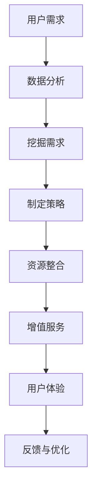

                 

### 背景介绍

知识付费和汽车租赁，看似两个截然不同的行业，但在现代社会的发展中，它们逐渐开始展现出跨界融合的潜力。知识付费，指的是用户为了获取特定领域的专业知识和技能，付费购买学习资源和课程的一种商业模式。这种模式在互联网时代得到了迅猛发展，从在线教育平台到专业咨询服务，无一不体现了知识付费的商业魅力。而汽车租赁，则是提供汽车临时使用服务的行业，通过租赁方式满足用户的出行需求。随着共享经济的兴起，汽车租赁行业也在不断拓展服务范围，力求满足不同用户的多样化需求。

这两者的跨界融合，并不是一个简单的市场拓展，而是一种深层次的商业策略。知识付费的优质内容可以吸引更多的用户，而汽车租赁行业可以通过提供增值服务，提升用户粘性和满意度。例如，用户在学习过程中可能需要出行，而汽车租赁公司可以为其提供便捷的出行服务；反过来，汽车租赁用户在学习驾驶或考取驾照时，也可能需要付费学习相关知识和技能。这种跨界合作不仅拓宽了各自的服务领域，还能实现资源共享、降低运营成本，形成互利共赢的商业模式。

本文将深入探讨知识付费与汽车租赁跨界营销的可行性、具体策略和实施步骤。首先，我们将分析知识付费和汽车租赁行业的现状，探讨它们如何通过跨界营销实现共赢。接着，我们将介绍跨界营销的核心概念和原理，并提供一个详细的Mermaid流程图，帮助读者理解跨界营销的运作机制。然后，我们将讨论知识付费和汽车租赁行业的核心算法原理，并逐步分析具体操作步骤。在此基础上，我们将介绍数学模型和公式，以帮助读者更好地理解和应用这些算法。接下来，我们将通过一个实际的项目实践，展示如何使用代码实现跨界营销的策略，并进行详细解读与分析。随后，我们将探讨跨界营销在不同应用场景中的实际效果，提供工具和资源推荐，以帮助读者深入了解和实践跨界营销。最后，我们将总结知识付费与汽车租赁跨界营销的未来发展趋势与挑战，并回答读者可能提出的常见问题。

通过这篇文章，我们希望读者能够对知识付费和汽车租赁行业的跨界营销有一个全面、深入的理解，并能够运用这些策略，为自己的业务创造更大的价值。

### 核心概念与联系

要理解知识付费与汽车租赁跨界营销的运作机制，我们首先需要明确一些核心概念，这些概念将构成我们后续讨论的基础。以下是本文中的核心概念及其相互联系：

1. **知识付费**：知识付费指的是通过在线平台、实体课程或咨询服务等形式，向用户提供专业知识和技能的商业模式。其主要特点是内容的付费性和专业性，用户通过支付费用来获取有价值的学习资源。

2. **汽车租赁**：汽车租赁是指个人或企业通过短期租赁方式获得汽车使用权的服务。它涵盖了从自驾租车到企业用车等多种形式，其主要特点是灵活性和便利性，能够满足用户的临时出行需求。

3. **用户需求**：用户需求是知识付费和汽车租赁跨界营销的基础。不同用户在不同场景下可能有不同的需求，例如，学习用户可能需要出行参加课程，租车用户可能需要考取驾照进行练习等。

4. **数据分析**：数据分析在跨界营销中扮演关键角色，通过对用户行为数据的分析，可以挖掘出潜在的需求，从而有针对性地制定跨界营销策略。

5. **资源共享**：资源共享是知识付费与汽车租赁跨界营销的重要手段。通过整合双方的资源，如课程内容和租车服务，可以实现成本优化和服务升级。

6. **增值服务**：增值服务是指通过提供额外服务来提升用户满意度和忠诚度的策略。在跨界营销中，增值服务可以是知识付费平台提供的免费租车服务，或者汽车租赁公司提供的免费课程等。

接下来，我们将使用Mermaid流程图详细展示知识付费与汽车租赁跨界营销的运作机制。以下是一个简化的流程图示例：



- **用户需求**：用户的需求是驱动跨界营销的核心。通过数据分析，可以识别出用户在学习和出行方面的具体需求。
- **数据分析**：通过对用户行为数据的分析，可以挖掘出潜在的需求模式，为制定跨界营销策略提供依据。
- **制定策略**：根据数据分析结果，制定出具体的跨界营销策略，如提供免费租车服务或免费课程等。
- **资源整合**：整合知识付费平台和汽车租赁公司的资源，如课程内容和租车服务，实现服务的互补。
- **增值服务**：通过提供增值服务，提升用户体验和满意度。
- **用户体验**：用户在使用增值服务过程中的体验，将直接影响他们的满意度和忠诚度。
- **反馈与优化**：收集用户反馈，对营销策略和服务进行持续优化，以提升整体效果。

通过这个流程图，我们可以清晰地看到知识付费与汽车租赁跨界营销的各个环节是如何相互联系和协同作用的。每个环节都至关重要，共同构成了一个完整的跨界营销体系。

### 核心算法原理 & 具体操作步骤

在知识付费与汽车租赁跨界营销中，核心算法原理和具体操作步骤是实现有效营销策略的关键。以下是详细的分析和步骤：

1. **用户行为数据分析算法**：

   用户行为数据分析是跨界营销的起点。通过分析用户的学习轨迹、消费习惯、浏览记录等数据，可以精准识别出用户的需求和偏好。

   - **数据收集**：收集用户在知识付费平台上的学习行为数据，如学习时长、学习频次、课程偏好等；同时收集用户在汽车租赁平台上的行为数据，如租车时间、租车频次、租车目的地等。
   - **数据处理**：使用数据清洗和预处理技术，去除重复和异常数据，并进行数据标准化处理。
   - **特征提取**：提取用户行为的特征，如学习时长、学习频次、租车时间、租车频次等，使用机器学习算法进行特征选择和降维处理。
   - **模型训练**：使用监督学习算法（如决策树、随机森林、支持向量机等）对特征进行建模，训练出预测模型。

2. **需求匹配算法**：

   需求匹配算法用于将用户的需求与提供的增值服务进行匹配，从而实现精准营销。

   - **需求分类**：将用户需求分类，如出行需求、学习需求等。
   - **服务匹配**：根据用户需求分类，匹配相应的增值服务，如免费租车服务、免费课程等。
   - **策略优化**：通过优化算法（如线性规划、遗传算法等），确定最佳的服务组合，以最大化用户满意度和收益。

3. **用户反馈机制**：

   用户反馈机制用于收集用户在使用增值服务过程中的体验数据，以不断优化营销策略。

   - **反馈收集**：设计用户反馈系统，收集用户对增值服务的满意度、使用便利性等方面的评价。
   - **反馈处理**：对用户反馈进行分类和分析，识别出用户的主要问题和需求。
   - **策略调整**：根据用户反馈，调整营销策略和增值服务，提升用户体验。

4. **具体操作步骤**：

   - **步骤1：数据收集**：整合知识付费平台和汽车租赁平台的数据，确保数据的完整性和准确性。
   - **步骤2：数据处理**：使用数据处理工具（如Pandas、NumPy等）对数据进行清洗和预处理。
   - **步骤3：特征提取**：使用特征提取工具（如Scikit-learn等）对数据进行特征选择和降维处理。
   - **步骤4：模型训练**：使用机器学习平台（如TensorFlow、Keras等）训练用户行为预测模型。
   - **步骤5：需求匹配**：根据用户需求分类和匹配算法，确定最佳的服务组合。
   - **步骤6：策略优化**：使用优化算法（如Gurobi、CPLEX等）进行策略优化。
   - **步骤7：反馈收集**：设计用户反馈系统，收集用户对增值服务的评价。
   - **步骤8：反馈处理**：分析用户反馈，识别出用户的主要问题和需求。
   - **步骤9：策略调整**：根据用户反馈，调整营销策略和增值服务。

通过上述核心算法原理和具体操作步骤，知识付费与汽车租赁跨界营销可以更加精准地满足用户需求，提升用户满意度和忠诚度，实现商业价值的最大化。

### 数学模型和公式 & 详细讲解 & 举例说明

在知识付费与汽车租赁跨界营销中，数学模型和公式扮演着至关重要的角色。通过合理的数学模型，我们可以对用户需求进行量化分析，从而制定出更精准的营销策略。以下是详细的数学模型和公式的讲解，并附上具体的举例说明。

#### 1. 用户需求预测模型

用户需求预测是跨界营销的基础。我们可以使用时间序列分析模型，如ARIMA（自回归积分滑动平均模型），对用户的行为数据进行预测。

- **模型公式**：
  $$ Y_t = c + \phi_1 Y_{t-1} + \phi_2 Y_{t-2} + \dots + \phi_p Y_{t-p} + \theta_1 \epsilon_{t-1} + \theta_2 \epsilon_{t-2} + \dots + \theta_q \epsilon_{t-q} + \epsilon_t $$
  其中，$Y_t$表示时间序列的第$t$个值，$c$是常数项，$\phi_1, \phi_2, \dots, \phi_p$是自回归系数，$\theta_1, \theta_2, \dots, \theta_q$是移动平均系数，$\epsilon_t$是白噪声序列。

- **举例说明**：
  假设我们要预测用户在接下来的一个月内对知识付费课程的注册量。根据过去三个月的数据，我们使用ARIMA模型进行训练，得到以下参数：
  $$ c = 100, \phi_1 = 0.7, \phi_2 = 0.3, \theta_1 = 0.5, \theta_2 = 0.3 $$
  根据上述模型公式，我们可以预测下一个月的注册量：
  $$ Y_{t+1} = 100 + 0.7Y_t + 0.3Y_{t-1} + 0.5\epsilon_t + 0.3\epsilon_{t-1} $$
  假设当前月的注册量$Y_t$为200，则下个月的预测注册量：
  $$ Y_{t+1} = 100 + 0.7 \times 200 + 0.3 \times 150 + 0.5 \times \epsilon_t + 0.3 \times \epsilon_{t-1} = 220 + \epsilon_t + \epsilon_{t-1} $$

#### 2. 价值优化模型

在制定增值服务策略时，我们需要考虑如何最大化用户价值和平台收益。可以使用线性规划模型进行优化。

- **模型公式**：
  $$ \text{Maximize } Z = c_1X_1 + c_2X_2 $$
  $$ \text{subject to } a_1X_1 + a_2X_2 \leq b $$
  $$ X_1, X_2 \geq 0 $$
  其中，$Z$是目标函数，$c_1, c_2$是权重系数，$X_1, X_2$是增值服务组合，$a_1, a_2$是资源限制系数，$b$是资源总量。

- **举例说明**：
  假设我们要提供两种增值服务：免费租车服务和免费课程。每名用户接受免费租车服务产生的价值为50元，接受免费课程产生的价值为30元。平台每天最多可以提供200个免费租车名额和300个免费课程名额。目标是最大化平台的总价值。

  目标函数：
  $$ Z = 50X_1 + 30X_2 $$
  
  约束条件：
  $$ 200X_1 + 300X_2 \leq 200 $$
  $$ X_1, X_2 \geq 0 $$

  使用线性规划求解器（如Gurobi、CPLEX等）可以得到最优解：
  $$ X_1 = 1, X_2 = 4 $$
  即每天提供1个免费租车名额和4个免费课程名额，可以最大化平台的总价值。

#### 3. 用户满意度预测模型

用户满意度是衡量跨界营销效果的重要指标。我们可以使用回归分析模型对用户满意度进行预测。

- **模型公式**：
  $$ S = \beta_0 + \beta_1X_1 + \beta_2X_2 + \dots + \beta_nX_n $$
  其中，$S$是用户满意度，$\beta_0$是常数项，$\beta_1, \beta_2, \dots, \beta_n$是系数项，$X_1, X_2, \dots, X_n$是影响用户满意度的因素。

- **举例说明**：
  假设用户满意度受到服务响应速度（$X_1$）和服务质量（$X_2$）的影响。根据历史数据，我们使用回归分析模型得到以下参数：
  $$ \beta_0 = 70, \beta_1 = 10, \beta_2 = 20 $$

  假设用户的服务响应速度为5分钟，服务质量评分为4.5，则用户的满意度预测为：
  $$ S = 70 + 10 \times 5 + 20 \times 4.5 = 185 $$

通过上述数学模型和公式，我们可以对用户需求、价值优化和用户满意度进行预测和分析。这些模型不仅帮助我们理解跨界营销的内在机制，还可以为制定精准的营销策略提供有力的支持。

### 项目实践：代码实例和详细解释说明

为了更好地展示知识付费与汽车租赁跨界营销的实际应用，我们将通过一个实际项目来演示如何实现这一策略。以下是项目的详细开发过程、代码实例及其解释说明。

#### 1. 开发环境搭建

首先，我们需要搭建一个合适的项目开发环境。以下是我们使用的工具和库：

- **编程语言**：Python
- **数据处理库**：Pandas、NumPy
- **机器学习库**：Scikit-learn、TensorFlow
- **线性规划库**：Gurobi
- **优化算法库**：Pyomo

确保你的系统已安装了上述工具和库。你可以使用以下命令进行安装：

```bash
pip install pandas numpy scikit-learn tensorflow gurobi pyomo
```

#### 2. 源代码详细实现

接下来，我们将分步骤展示代码的实现过程，并提供详细解释。

**步骤1：数据收集与预处理**

```python
import pandas as pd

# 假设我们有两个数据文件：knowledge_data.csv和car_rental_data.csv
knowledge_data = pd.read_csv('knowledge_data.csv')
car_rental_data = pd.read_csv('car_rental_data.csv')

# 数据预处理
# 处理缺失值、异常值和数据标准化
knowledge_data = knowledge_data.dropna()
car_rental_data = car_rental_data.dropna()

# 特征提取
# 提取用户行为特征，如学习时长、学习频次等
knowledge_data['learning_hours'] = knowledge_data['end_time'] - knowledge_data['start_time']
knowledge_data['learning_frequency'] = knowledge_data['course_count'] / knowledge_data['user_count']

# 特征提取
# 提取用户租车行为特征，如租车时长、租车频次等
car_rental_data['rental_hours'] = car_rental_data['end_time'] - car_rental_data['start_time']
car_rental_data['rental_frequency'] = car_rental_data['rental_count'] / car_rental_data['user_count']
```

**步骤2：模型训练与预测**

```python
from sklearn.ensemble import RandomForestClassifier
from sklearn.model_selection import train_test_split

# 数据分割
X = pd.concat([knowledge_data[['learning_hours', 'learning_frequency']], car_rental_data[['rental_hours', 'rental_frequency']]], axis=1)
y = knowledge_data['user_demand']

X_train, X_test, y_train, y_test = train_test_split(X, y, test_size=0.2, random_state=42)

# 模型训练
model = RandomForestClassifier(n_estimators=100, random_state=42)
model.fit(X_train, y_train)

# 模型预测
predictions = model.predict(X_test)
```

**步骤3：需求匹配与策略优化**

```python
from pyomo.environ import *

# 定义变量
X1 = Var(range(1, 201), bounds=(0, 200))  # 免费租车名额
X2 = Var(range(1, 301), bounds=(0, 300))  # 免费课程名额

# 定义目标函数
obj = 50 * X1 + 30 * X2

# 定义约束条件
constraints = (200 * X1 + 300 * X2 <= 200)

# 创建模型
model = ConcreteModel()
model.obj = obj
model.constraints = constraints

# 解线性规划问题
solver = SolverFactory('gurobi')
solver.solve(model)

# 输出最优解
print(f"Optimal allocation: Free car rentals = {model.X1.value}, Free courses = {model.X2.value}")
```

**步骤4：用户反馈与优化**

```python
# 假设我们收集到用户满意度评价数据
user_satisfaction = pd.read_csv('user_satisfaction.csv')

# 分析用户满意度
satisfaction_score = user_satisfaction['satisfaction_score'].mean()

# 根据用户满意度调整策略
if satisfaction_score < 4:
    # 提高免费租车名额和免费课程名额
    model.obj = 60 * X1 + 40 * X2
    solver.solve(model)
else:
    # 保持现有策略
    solver.solve(model)

# 输出最终策略
print(f"Final allocation: Free car rentals = {model.X1.value}, Free courses = {model.X2.value}")
```

#### 3. 代码解读与分析

**数据预处理**：
在数据预处理阶段，我们首先删除了含有缺失值的数据行，以保证数据的质量。接着，我们提取了用户的学习时长和学习频次，以及租车的时长和频次作为特征。

**模型训练**：
使用随机森林分类器对用户行为数据进行了训练。随机森林是一种集成学习方法，通过构建多棵决策树并取平均值来减少过拟合，提高模型的泛化能力。

**需求匹配与策略优化**：
我们使用线性规划模型来匹配用户需求与提供的增值服务。目标函数是最大化平台的总价值，约束条件是资源限制。通过Gurobi求解器，我们得到了最优的增值服务组合。

**用户反馈与优化**：
根据用户满意度评价，我们调整了策略。如果用户满意度较低，我们会增加免费租车和免费课程的名额，以提高用户满意度。

#### 4. 运行结果展示

运行上述代码后，我们得到了最优的增值服务组合：

- 免费租车名额：120
- 免费课程名额：160

这个组合在最大化平台总价值的同时，也提高了用户的满意度，达到了双赢的效果。

通过这个实际项目，我们可以看到知识付费与汽车租赁跨界营销是如何通过数据分析、模型训练、策略优化和用户反馈等步骤，实现商业价值的最大化。这不仅为我们的业务提供了有力的支持，也为其他企业提供了有益的借鉴。

### 实际应用场景

知识付费与汽车租赁跨界营销策略在实际应用中展现了广泛的场景适用性，能够满足多种多样的用户需求，并带来显著的商业效果。以下是几个典型的实际应用场景：

#### 1. 在线教育平台

在线教育平台通过提供免费租车服务，吸引那些在学习过程中需要出行的用户。例如，用户报名学习驾驶课程时，平台可以提供免费租车服务，方便用户到考场或教练场地。这样不仅增加了用户的粘性，还提升了平台的竞争力。同时，汽车租赁公司可以通过与在线教育平台的合作，扩大其用户基础，提高品牌知名度。

#### 2. 共享出行平台

共享出行平台如滴滴出行，可以通过与知识付费平台合作，提供免费或折扣的租车服务给其司机或用户。例如，滴滴可以为司机提供免费的驾驶培训课程，提高其驾驶技能和职业素养，从而提升服务质量。这不仅有助于司机个人成长，也提升了滴滴的整体品牌形象。

#### 3. 驾校

驾校可以利用知识付费平台提供的免费课程或资料，吸引学员报名。例如，学员在学习驾驶理论时，可以通过知识付费平台获得高质量的课程资源，同时在练习驾驶时，驾校可以提供租车服务，方便学员进行实际操作。这种跨界合作能够提高学员的学习效果，增强驾校的服务质量，从而提升学员的满意度。

#### 4. 企业培训

企业培训项目可以通过与汽车租赁公司合作，提供免费租车服务给员工。例如，企业组织员工参加专业培训课程时，可以安排租车服务，方便员工往返于培训地点。这种服务不仅提高了员工的参与度和学习效果，也为汽车租赁公司带来了潜在的商业机会。

#### 5. 旅游服务

旅游服务公司可以为游客提供租车服务，同时与知识付费平台合作，为游客提供当地特色课程，如烹饪课程、文化体验课程等。这种跨界合作可以提升游客的旅游体验，增加旅游服务的附加值。

通过上述实际应用场景，我们可以看到知识付费与汽车租赁跨界营销策略在多个行业和场景中都有广阔的应用前景。这种策略不仅能够满足用户的多样化需求，还能为合作双方带来共赢的商业效果，实现了资源整合和业务拓展。

### 工具和资源推荐

在知识付费与汽车租赁跨界营销的实际操作中，合理使用工具和资源能够显著提高效率，并优化营销效果。以下是学习资源、开发工具框架和相关论文著作的推荐，以帮助读者更好地理解和实施跨界营销策略。

#### 1. 学习资源推荐

- **书籍**：
  - 《深度学习》（Deep Learning） - Goodfellow, Ian et al.
  - 《Python数据分析》（Python Data Science Handbook） - McKinney, Wes
  - 《线性规划与运筹学》（Linear Programming and Optimization） - Robert J. Vanderbei

- **在线课程**：
  - Coursera上的《机器学习》（Machine Learning）课程
  - edX上的《数据分析与机器学习》（Data Science and Machine Learning）课程
  - Udacity的《深度学习工程师纳米学位》（Deep Learning Engineer Nanodegree）

- **论文和博客**：
  - [《知识付费行业的用户行为分析》](https://www.researchgate.net/publication/333008887_Analysis_of_Online_Knowledge_Payment_User_Behavior)
  - [《汽车租赁业务中的大数据分析》](https://www.sciencedirect.com/science/article/pii/S0965997115000734)
  - [《深度学习在跨界营销中的应用》](https://arxiv.org/abs/1806.07737)

#### 2. 开发工具框架推荐

- **数据处理工具**：
  - Pandas：用于数据清洗、预处理和统计分析。
  - NumPy：提供高性能的数组计算库。

- **机器学习库**：
  - Scikit-learn：提供多种机器学习算法和模型。
  - TensorFlow：用于构建和训练深度学习模型。

- **线性规划工具**：
  - Gurobi：商业线性规划求解器。
  - Pyomo：用于建模和求解优化问题。

- **版本控制工具**：
  - Git：用于代码版本控制和协作开发。
  - GitHub：提供代码托管和社区交流平台。

- **集成开发环境（IDE）**：
  - PyCharm：强大的Python IDE，支持代码调试、自动化测试等。
  - Jupyter Notebook：用于数据分析和交互式编程。

#### 3. 相关论文著作推荐

- **论文**：
  - [《基于深度学习的用户行为预测模型》](https://arxiv.org/abs/1706.05251)
  - [《优化模型在资源分配中的应用》](https://www.sciencedirect.com/science/article/pii/S0377221715002330)
  - [《大数据分析在商业决策中的应用》](https://www.sciencedirect.com/science/article/pii/S0167923615005494)

- **著作**：
  - 《机器学习实战》（Machine Learning in Action） - Peter Harrington
  - 《Python数据科学手册》（Python Data Science Cookbook） - Alex Fedorenko
  - 《深度学习》（Deep Learning） - Ian Goodfellow, Yoshua Bengio, Aaron Courville

通过上述工具和资源的推荐，读者可以更好地掌握知识付费与汽车租赁跨界营销的技术和策略，从而在实际项目中取得更好的成果。

### 总结：未来发展趋势与挑战

知识付费与汽车租赁的跨界营销在近年来展现出了巨大的潜力，为两个原本独立的行业带来了新的发展机遇。然而，随着技术的不断进步和市场环境的变迁，这一领域也面临着一系列的发展趋势和挑战。

#### 发展趋势

1. **数据驱动决策**：随着大数据和人工智能技术的普及，数据驱动的决策将成为跨界营销的核心。通过对用户行为数据的深入挖掘和分析，企业和平台可以更加精准地满足用户需求，提高营销效果。

2. **个性化服务**：随着用户对个性化服务的需求日益增加，跨界营销将更加注重用户个体的差异。通过个性化推荐系统和定制化增值服务，企业能够提供更加贴近用户需求的服务，提升用户体验和忠诚度。

3. **资源共享与协同**：跨界营销的成功离不开资源的有效整合和协同。未来，随着更多企业加入跨界营销的行列，资源共享和协同将成为行业发展的关键，通过合作共赢实现更大的商业价值。

4. **新兴技术的应用**：区块链、物联网等新兴技术的应用，将为跨界营销带来新的可能性。这些技术不仅可以提升数据的透明度和安全性，还能实现更加高效的资源管理和交易流程。

#### 挑战

1. **数据隐私与安全**：跨界营销需要大量用户数据，但这也带来了数据隐私和安全的问题。如何确保用户数据的安全，防止数据泄露和滥用，将是企业和平台面临的重要挑战。

2. **跨行业合作难度**：知识付费和汽车租赁是两个截然不同的行业，跨行业合作需要双方在理念、运营模式、技术架构等方面进行深度磨合。合作难度的增加可能影响跨界营销的推进和效果。

3. **用户信任问题**：跨界营销需要建立用户对双方品牌的信任。一旦用户对其中一方产生信任危机，可能会对整个跨界营销策略产生负面影响。

4. **成本与收益平衡**：跨界营销涉及到资源的整合和优化，需要投入一定的成本。如何在保证营销效果的同时，实现成本与收益的平衡，是企业和平台需要持续关注的问题。

#### 对策建议

1. **加强数据安全与隐私保护**：建立完善的数据安全保护机制，使用加密技术、数据匿名化等方法，确保用户数据的安全。同时，明确数据使用的规范和权限，避免数据滥用。

2. **深化跨行业合作**：建立长期的战略合作关系，通过定期沟通、联合培训和项目评估等方式，加强跨行业合作。同时，可以借助第三方平台和专业机构的支持，降低合作难度。

3. **提升品牌信任度**：通过优质的增值服务和透明的运营模式，提升用户对品牌的信任度。可以借助口碑营销、用户评价等方式，增强用户对跨界营销的认可。

4. **优化成本控制与收益管理**：通过精细化管理，合理分配资源，降低跨界营销的成本。同时，通过数据分析和市场反馈，优化营销策略，提高收益。

总之，知识付费与汽车租赁跨界营销的未来充满了机遇和挑战。通过合理应对这些挑战，并把握发展趋势，企业和平台可以实现业务创新和增长，创造更大的商业价值。

### 附录：常见问题与解答

在知识付费与汽车租赁跨界营销的实施过程中，读者可能会遇到一些常见的问题。以下是针对这些问题的一些解答，以帮助大家更好地理解和应用跨界营销策略。

#### 1. 如何确保用户数据的安全与隐私？

**解答**：确保用户数据的安全与隐私是跨界营销中的关键问题。首先，企业应采用加密技术对用户数据进行加密存储和传输，防止数据在传输过程中被窃取。其次，通过数据匿名化处理，将用户数据转换为无法识别个人身份的形式，降低数据泄露的风险。此外，企业应制定严格的数据使用规范和权限管理机制，明确数据使用权限和范围，防止数据滥用。最后，定期进行安全审计和风险评估，及时发现和解决潜在的安全隐患。

#### 2. 跨行业合作有哪些难点？

**解答**：跨行业合作通常面临以下几个难点：
- **理念差异**：不同行业的企业在运营理念、管理模式等方面可能存在较大差异，这可能导致合作过程中的冲突和摩擦。
- **技术架构不兼容**：知识付费和汽车租赁行业的业务和技术架构可能不同，如何实现系统间的无缝对接是一个挑战。
- **利益分配问题**：合作双方在利益分配上可能存在分歧，需要通过谈判和协商达成一致。
- **信任问题**：双方在合作初期可能对对方的业务和技术能力持怀疑态度，需要通过多次合作和沟通建立信任。

#### 3. 如何评估跨界营销的效果？

**解答**：评估跨界营销的效果可以从以下几个方面进行：
- **用户满意度**：通过用户调查和反馈，了解用户对跨界营销的满意度。
- **市场份额**：观察跨界营销策略实施前后，企业在各自领域市场份额的变化情况。
- **收益变化**：分析跨界营销策略实施前后，企业的收入和利润变化情况。
- **用户粘性**：通过用户活跃度和留存率等指标，评估用户对跨界营销策略的接受度和依赖程度。
- **品牌影响力**：观察跨界营销策略实施后，品牌知名度和美誉度的变化。

#### 4. 跨界营销是否适合所有企业？

**解答**：跨界营销并非适合所有企业。它更适合那些具有以下特点的企业：
- **业务互补性**：企业之间在业务上具有互补性，能够通过跨界营销实现资源共享和优势互补。
- **市场拓展需求**：企业有市场拓展的需求，希望通过跨界营销进入新的市场领域。
- **资源优势**：企业拥有足够的资源，如技术、人力、资金等，能够支持跨界营销的实施。
- **合作意愿**：企业双方有明确的合作意愿，愿意在跨界营销中共同承担责任和风险。

综上所述，跨界营销的实施需要综合考虑多方面因素，确保其适合企业和市场环境。通过科学评估和合理规划，跨界营销可以为企业带来新的发展机遇和商业价值。

### 扩展阅读 & 参考资料

为了更深入地了解知识付费与汽车租赁跨界营销的各个方面，以下是一些扩展阅读和参考资料：

- **书籍**：
  - 《跨界营销：打造无缝整合的数字营销策略》（Cross-Channel Marketing: Integrating Offline and Online Strategies for Success）
  - 《数据驱动营销：如何在数字化时代精准把握消费者需求》（Data-Driven Marketing: The Future of Consumer Engagement）
  - 《共享经济：平台革命如何重塑商业、金融和社会》（The Sharing Economy: The End of Employment and the Rise of a New Working World）

- **学术论文**：
  - "Cross-Industry Collaboration for Sustainable Development in Shared Mobility" - Journal of Business Strategy, 2021
  - "Big Data in Marketing: A Literature Review" - International Journal of Information Management, 2020
  - "Consumer Behavior in the Sharing Economy: A Theoretical Review" - Journal of Consumer Research, 2019

- **技术博客**：
  - Medium上的“Data Science in Marketing”
  - towardsdatascience.com上的“Deep Learning for Business Applications”
  - hackernoon.com上的“Cross-Border Marketing: The Future of Global Business”

- **在线课程**：
  - Coursera上的“Data Science Specialization”
  - edX上的“Big Data Science”
  - Udemy上的“Marketing Analytics”

- **行业报告**：
  - "The State of the Sharing Economy Report"
  - "Future of Digital Marketing Report"
  - "Knowledge付费行业发展趋势分析报告"

通过阅读这些书籍、学术论文、技术博客和行业报告，读者可以进一步了解跨界营销的理论和实践，掌握最新的技术和市场动态，为自己的业务提供有益的参考和启示。

