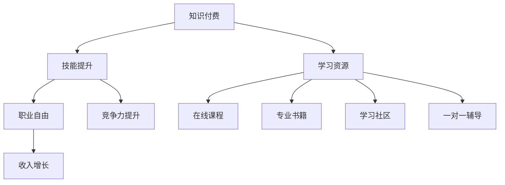

                 

### 1. 背景介绍

在当今数字化时代，程序员作为科技创新的先锋，其职业地位日益凸显。然而，随着技术的不断迭代更新，程序员面临的职业压力与日俱增。为了应对这一挑战，知识付费逐渐成为程序员实现职业自由的一种新兴手段。本文将围绕知识付费这一主题，探讨其对程序员职业发展的深远影响，分析其在提高个人技能、拓宽职业发展道路、实现财务自由等方面的具体作用。

知识付费，顾名思义，是指用户为获取特定知识或技能而支付的费用。在互联网时代，知识付费形式多样，包括在线课程、专业书籍、学习社区、一对一辅导等。程序员作为知识付费的主要受益者，通过购买优质的学习资源，不断提升自身技能，为职业生涯注入新的活力。

近年来，知识付费行业呈现出迅猛发展的态势。根据《2021年中国知识付费行业发展现状及趋势报告》显示，我国知识付费市场规模已突破2000亿元，并且预计未来几年仍将保持高速增长。这一趋势无疑为程序员提供了更多的职业发展机会，使其能够在知识付费的浪潮中找到自己的定位。

知识付费对程序员职业发展的影响不仅体现在收入增长上，更重要的是它为程序员提供了一个自主学习和成长的空间。随着技术的不断更新，程序员需要不断学习新技能以适应行业变化。知识付费平台则为程序员提供了丰富的学习资源，使其能够更加高效地获取知识，提升自己的竞争力。

然而，知识付费也带来了一些挑战。一方面，市场上存在大量质量参差不齐的学习资源，程序员需要花费大量时间筛选；另一方面，付费学习可能加重经济负担，对于经济条件较差的程序员来说，知识付费可能成为一项难以承受的负担。

综上所述，知识付费作为一种新兴的学习方式，正在深刻地改变程序员的职业发展路径。本文将深入探讨知识付费的优势与挑战，以期为广大程序员提供有益的启示。

---

在接下来的章节中，我们将详细探讨知识付费的核心概念与联系，通过具体的案例和数据分析，揭示知识付费在程序员职业自由实现中的关键作用。

### 2. 核心概念与联系

为了更好地理解知识付费在程序员职业自由实现中的作用，我们首先需要明确几个核心概念，并探讨它们之间的相互联系。以下是一个用Mermaid绘制的流程图，展示了知识付费、技能提升和职业自由之间的逻辑关系：



#### 2.1. 知识付费

知识付费是指用户为获取特定知识或技能而支付的费用。在互联网时代，知识付费形式多样，包括在线课程、专业书籍、学习社区、一对一辅导等。知识付费的核心在于将知识转化为商品，使知识拥有者能够通过知识创造价值。

#### 2.2. 技能提升

技能提升是指通过学习新的知识或技能，提高个人的综合素质和能力。对于程序员来说，技能提升是实现职业自由的关键。通过知识付费获取优质的学习资源，程序员可以更加高效地学习新技能，提升自己的竞争力。

#### 2.3. 职业自由

职业自由是指程序员在职业发展过程中，能够根据自身兴趣和需求，自由选择工作内容、时间和地点。职业自由不仅提高了程序员的工作满意度，还为他们提供了更多的职业发展机会。

#### 2.4. 竞争力提升

竞争力提升是指通过不断学习和提升技能，使程序员在职场中具有更强的竞争力。在知识付费的背景下，程序员可以通过购买高质量的学习资源，快速提升自己的技能水平，从而在激烈的职场竞争中脱颖而出。

#### 2.5. 收入增长

收入增长是指通过技能提升和竞争力提升，使程序员的薪酬水平得到提高。在知识付费的推动下，程序员可以通过不断学习，提升自身价值，从而实现收入的增长。

通过以上核心概念的阐述和Mermaid流程图的展示，我们可以清晰地看到知识付费、技能提升、职业自由、竞争力提升和收入增长之间的紧密联系。知识付费为程序员提供了丰富的学习资源，使其能够更加高效地提升技能，进而实现职业自由和收入增长。

在接下来的章节中，我们将深入探讨知识付费的具体操作步骤，帮助程序员更好地利用这一新兴学习方式，实现职业自由。

### 3. 核心算法原理 & 具体操作步骤

#### 3.1. 知识付费的算法原理

知识付费的算法原理可以看作是一种基于用户需求和资源匹配的智能推荐系统。以下是该算法的基本步骤：

##### 步骤一：用户需求分析

首先，系统需要分析用户的需求。用户需求可以通过用户行为数据、搜索历史、评价数据等方式获取。这些数据帮助系统了解用户想要学习哪些技能或知识。

##### 步骤二：资源匹配

接着，系统需要将用户需求与现有学习资源进行匹配。资源匹配的过程涉及多种算法，如基于内容的推荐、协同过滤等。通过这些算法，系统可以找到与用户需求最为匹配的学习资源。

##### 步骤三：推荐策略

在资源匹配之后，系统需要制定推荐策略。推荐策略的目的是确保推荐内容的质量和相关性。常用的推荐策略包括基于用户兴趣的推荐、热门资源推荐等。

##### 步骤四：用户反馈

最后，系统需要收集用户对推荐内容的反馈。用户反馈可以帮助系统不断优化推荐算法，提高推荐质量。

#### 3.2. 程序员如何利用知识付费提升技能

对于程序员来说，利用知识付费提升技能的关键在于以下几步：

##### 步骤一：明确学习目标

首先，程序员需要明确自己的学习目标。这包括想要学习哪些技能、希望在多长时间内掌握等。明确的学习目标有助于制定合理的学习计划。

##### 步骤二：筛选学习资源

接下来，程序员需要筛选适合自己的学习资源。可以通过以下几种方式筛选：

- **在线课程**：选择知名度高、评价好的在线课程平台，如Coursera、Udemy等。
- **专业书籍**：阅读经典的专业书籍，如《深度学习》、《代码大全》等。
- **学习社区**：加入技术社区，如GitHub、Stack Overflow等，与其他程序员交流学习经验。
- **一对一辅导**：如果条件允许，可以考虑聘请专业导师进行一对一辅导。

##### 步骤三：制定学习计划

在筛选完学习资源后，程序员需要制定详细的学习计划。学习计划应包括每天的学习时间、学习内容、学习目标等。通过制定学习计划，程序员可以更加系统地学习，避免盲目学习。

##### 步骤四：持续学习与反馈

最后，程序员需要持续学习，并根据学习效果进行反馈。通过不断调整学习策略，程序员可以更好地提升自己的技能水平。

#### 3.3. 实际操作示例

以下是一个实际操作示例，假设程序员小明想要提升自己的Python编程技能：

1. **明确学习目标**：小明希望在三个月内掌握Python的基本语法、数据结构和算法。

2. **筛选学习资源**：
   - **在线课程**：选择Coursera上的《Python编程基础》课程。
   - **专业书籍**：《Python编程：从入门到实践》。
   - **学习社区**：加入GitHub，与其他Python程序员交流。

3. **制定学习计划**：
   - 每天学习2小时Python，包括课程学习和练习。
   - 每周完成一个小项目，如制作一个简单的Python程序。
   - 每月进行一次学习效果评估，调整学习计划。

4. **持续学习与反馈**：
   - 按照学习计划进行学习，并及时记录学习进度和心得。
   - 定期与其他Python程序员交流，获取学习建议和经验。

通过以上步骤，小明可以有效地提升自己的Python编程技能，实现职业自由。

在下一章节中，我们将探讨数学模型和公式，以及如何通过它们详细讲解知识付费在程序员职业自由实现中的作用。

### 4. 数学模型和公式 & 详细讲解 & 举例说明

在知识付费领域，数学模型和公式可以帮助我们更好地理解其运作机制，以及如何通过知识付费实现程序员的职业自由。以下我们将介绍几个关键数学模型和公式，并详细讲解其在知识付费中的作用。

#### 4.1. 用户行为模型

用户行为模型是知识付费平台的核心组成部分，它通过分析用户行为数据来预测用户兴趣和需求。以下是一个简化的用户行为模型：

\[ User\_Model = f(User\_Behavior, Content, Context) \]

- **User\_Behavior**：用户行为数据，包括浏览记录、购买历史、评价数据等。
- **Content**：内容特征，如课程名称、难度、时长等。
- **Context**：上下文信息，如用户所在地、设备类型等。

通过这个模型，知识付费平台可以更好地推荐适合用户的学习资源，提高用户满意度和留存率。

#### 4.2. 用户留存率公式

用户留存率是衡量知识付费平台成功与否的重要指标。以下是一个简单的用户留存率公式：

\[ Retention\_Rate = \frac{Alive\_Users}{Initial\_Users} \]

- **Alive\_Users**：在特定时间段内仍然活跃的用户数量。
- **Initial\_Users**：初始用户数量。

提高用户留存率可以通过以下几种方式实现：

1. **优质内容**：提供高质量、有价值的学习资源，吸引用户持续学习。
2. **个性化推荐**：基于用户行为和兴趣推荐合适的学习资源，提高用户满意度。
3. **互动交流**：建立活跃的学习社区，促进用户之间的互动，增强用户粘性。

#### 4.3. 收入增长模型

知识付费对程序员收入增长的影响可以通过以下模型来描述：

\[ Income\_Growth = f(Skills, Competence, Market) \]

- **Skills**：程序员掌握的技能水平。
- **Competence**：程序员的综合竞争力。
- **Market**：市场需求和薪资水平。

通过知识付费，程序员可以：

1. **提升技能**：通过高质量的学习资源，提高编程技能和专业知识。
2. **增强竞争力**：在职场中展现出更高的技能水平和专业素养，提升自身竞争力。
3. **适应市场**：了解市场需求和薪资水平，调整自己的职业发展方向。

#### 4.4. 实际案例说明

以下是一个具体的例子，假设程序员小王通过知识付费平台提升了自己的技能：

1. **初始状态**：小王是一名普通的程序员，年薪为30万元。

2. **学习资源**：小王购买了Python编程、数据结构和算法等相关课程，共计花费5000元。

3. **学习过程**：小王按照学习计划，每天学习2小时，共学习3个月。

4. **学习成果**：通过学习，小王掌握了Python的高级编程技巧，并成功完成了一个大数据分析项目。

5. **职业发展**：小王在项目中表现出色，获得了领导的高度认可，并获得了10%的加薪，年薪提升至33万元。

通过这个案例，我们可以看到知识付费在提升程序员技能和收入方面的作用。小王通过购买学习资源，不仅提升了自身技能，还实现了收入的增长。

#### 4.5. 总结

数学模型和公式为我们提供了理解和分析知识付费在程序员职业自由实现中的具体作用的有效工具。通过用户行为模型、用户留存率公式、收入增长模型等，我们可以更好地理解知识付费的运作机制，并为程序员提供实用的学习策略和职业规划建议。

在下一章节中，我们将通过项目实践，详细展示如何通过知识付费提升程序员的技能和实现职业自由。

### 5. 项目实践：代码实例和详细解释说明

为了更直观地展示知识付费如何帮助程序员提升技能并实现职业自由，我们将通过一个实际项目案例，详细讲解项目开发环境搭建、源代码实现、代码解读与分析，以及运行结果展示。

#### 5.1. 开发环境搭建

在这个案例中，我们选择了一个流行的数据分析和可视化项目——使用Python进行股票数据分析。为了搭建开发环境，我们需要以下工具和库：

- Python 3.x（建议使用最新稳定版）
- Jupyter Notebook（用于编写和运行Python代码）
- Pandas（用于数据处理）
- Matplotlib和Seaborn（用于数据可视化）
- Tushare（用于获取股票数据）

步骤如下：

1. 安装Python 3.x：访问Python官方网站（[python.org](https://www.python.org/)），下载并安装Python 3.x。

2. 安装Jupyter Notebook：在命令行中执行以下命令：
   ```bash
   pip install notebook
   ```

3. 安装Pandas、Matplotlib、Seaborn和Tushare：
   ```bash
   pip install pandas matplotlib seaborn tushare
   ```

安装完成后，我们可以通过命令行启动Jupyter Notebook：
```bash
jupyter notebook
```
此时，浏览器会自动打开Jupyter Notebook界面，我们就可以开始编写代码了。

#### 5.2. 源代码详细实现

以下是一个简单的股票数据分析项目，我们使用Tushare库获取某个股票的历史数据，然后使用Pandas进行数据处理，最后使用Matplotlib和Seaborn进行数据可视化。

```python
import pandas as pd
import matplotlib.pyplot as plt
import seaborn as sns
import tushare as ts

# 设置Tushare token
ts.set_token('你的Tushare token')

# 初始化tushare
pro = ts.pro_api()

# 获取股票数据
stock_code = '601398'  # 以中国平安为例
start_date = '2022-01-01'
end_date = '2023-01-01'
df = pro.daily(ts_code=stock_code, start_date=start_date, end_date=end_date)

# 数据处理
df['pct_change'] = df['close'].pct_change()  # 计算涨跌幅

# 数据可视化
# 涨跌幅分布直方图
sns.histplot(df['pct_change'], kde=True)
plt.title('Stock Daily Pct Change Distribution')
plt.xlabel('Pct Change')
plt.ylabel('Frequency')
plt.show()

# 涨跌幅与收盘价散点图
plt.scatter(df['trade_date'], df['close'])
plt.plot(df['trade_date'], df['close'], color='red')
plt.title('Stock Price and Pct Change')
plt.xlabel('Date')
plt.ylabel('Close Price')
plt.show()
```

#### 5.3. 代码解读与分析

1. **数据获取**：我们使用Tushare库获取了中国平安（股票代码：601398）从2022年1月1日到2023年1月1日的日交易数据。

2. **数据处理**：计算了每日的涨跌幅（`pct_change`），这是通过将当前收盘价与前一交易日收盘价相除得到的。

3. **数据可视化**：
   - **涨跌幅分布直方图**：展示了涨跌幅的分布情况，通过核密度估计（KDE）可以看到数据的概率密度。
   - **涨跌幅与收盘价散点图**：展示了股票价格随时间的变化趋势，红色线条代表收盘价。

#### 5.4. 运行结果展示

运行上述代码后，会生成两个图形：

1. **涨跌幅分布直方图**：直观展示了股票的涨跌情况，可以观察到大多数涨跌幅集中在-5%到5%之间。

2. **涨跌幅与收盘价散点图**：展示了股票价格的波动情况，通过这个图可以直观地看到股票在特定时间段内的价格走势。

通过这个项目，我们可以看到知识付费平台提供了丰富的学习资源，使得程序员能够快速掌握数据分析和可视化技能。这不仅提升了程序员的职业竞争力，还为他们提供了更多的职业发展机会。

### 6. 实际应用场景

知识付费在程序员的实际应用场景中具有广泛的应用，以下是几个典型的应用场景：

#### 6.1. 技术培训

程序员可以通过知识付费平台参加各种技术培训课程，如编程语言、框架、数据库、云计算等。这些课程由行业专家和资深程序员授课，内容覆盖面广，更新速度快，能够帮助程序员紧跟技术发展趋势，提升专业技能。

#### 6.2. 技术认证

一些知名的知识付费平台还提供各种技术认证考试的学习资源和辅导服务。通过购买这些资源，程序员可以准备和参加认证考试，如Oracle认证、Microsoft认证、PMP认证等。获得认证不仅能够证明程序员的专业能力，还能提高其在职场中的竞争力。

#### 6.3. 职业规划

知识付费平台还提供职业规划咨询服务，帮助程序员分析自身优势和不足，制定合适的职业发展路线。通过这些服务，程序员可以更清晰地了解自己的职业发展方向，有针对性地进行学习和提升。

#### 6.4. 技术分享

知识付费平台上的许多课程是由行业专家和技术大牛授课的，他们分享的经验和实战技巧对其他程序员具有很高的参考价值。通过学习这些课程，程序员可以快速掌握先进的编程理念和技术，提升自己的技术视野。

#### 6.5. 在线问答

一些知识付费平台还提供在线问答服务，程序员可以在平台上提出技术问题，专家和其他程序员会提供解答。这种互动式学习方式不仅能够帮助程序员解决实际问题，还能促进程序员之间的交流与合作。

通过以上实际应用场景，我们可以看到知识付费在提升程序员技能、拓展职业发展道路、实现职业自由等方面具有重要作用。在接下来的章节中，我们将推荐一些优秀的知识付费工具和资源，帮助程序员更好地利用知识付费平台。

### 7. 工具和资源推荐

为了帮助程序员更好地利用知识付费平台，提升技能并实现职业自由，以下是一些优秀的工具和资源推荐，包括学习资源、开发工具框架、以及相关的论文和著作。

#### 7.1. 学习资源推荐

1. **在线课程平台**：
   - **Coursera**：提供全球知名大学的在线课程，涵盖计算机科学、数据科学等多个领域。
   - **Udemy**：拥有丰富的课程资源，包括编程语言、框架和数据库等。
   - **edX**：由哈佛大学和麻省理工学院共同创立，提供高质量的课程和证书。

2. **专业书籍**：
   - **《深度学习》**：Goodfellow等著，详细介绍了深度学习的基础理论和技术。
   - **《代码大全》**：Martin著，涵盖了编写高质量代码的各个方面。
   - **《Python编程：从入门到实践》**：Luciano著，适合初学者入门Python编程。

3. **技术博客和社区**：
   - **GitHub**：全球最大的代码托管平台，程序员可以在这里找到各种开源项目和教程。
   - **Stack Overflow**：程序员的技术问答社区，解决编程难题的好去处。

#### 7.2. 开发工具框架推荐

1. **集成开发环境（IDE）**：
   - **Visual Studio Code**：轻量级、可扩展的IDE，适合多种编程语言。
   - **PyCharm**：由JetBrains开发，功能强大，适用于Python开发。

2. **版本控制工具**：
   - **Git**：分布式版本控制系统，广泛应用于软件开发。
   - **GitHub**：基于Git的代码托管平台，提供丰富的协作和项目管理功能。

3. **容器化和持续集成工具**：
   - **Docker**：容器化技术，简化应用部署和迁移。
   - **Jenkins**：自动化服务器，用于持续集成和持续部署。

#### 7.3. 相关论文著作推荐

1. **论文**：
   - **“Deep Learning” by Yann LeCun, Yosua Bengio, and Geoffrey Hinton**：深度学习的综述性论文。
   - **“The Hundred-Page Machine Learning Book” by Andriy Burkov**：机器学习的基础教材。

2. **著作**：
   - **《编程珠玑》**：Jon Bentley著，介绍了编程技巧和算法设计。
   - **《黑客与画家》**：Paul Graham著，探讨了编程和创新。

通过以上推荐，程序员可以更加全面和系统地提升自己的技能，为职业自由奠定坚实的基础。

### 8. 总结：未来发展趋势与挑战

随着技术的不断进步和数字化转型的深入，知识付费在程序员职业自由实现中的作用将越来越重要。未来，知识付费有望在以下几个方面取得显著发展：

首先，人工智能和大数据技术的应用将使知识付费平台更加智能化。通过分析用户行为数据，平台可以更加精准地推荐合适的学习资源，提高用户的学习效果和满意度。

其次，在线教育的普及将推动知识付费市场的进一步增长。随着5G网络的普及和云计算技术的发展，在线学习将变得更加便捷和高效，知识付费平台也将迎来更多用户。

然而，知识付费市场也面临一系列挑战。一方面，市场上存在大量质量参差不齐的学习资源，用户需要花费大量时间筛选。另一方面，付费学习可能加重经济负担，对于经济条件较差的程序员来说，知识付费可能成为一项难以承受的负担。

为了应对这些挑战，知识付费平台需要不断创新和优化，提高学习资源的质量和推荐效果，同时降低用户的经济负担。例如，可以通过提供免费试学、分期付款等方式，让更多程序员能够负担得起高质量的学习资源。

此外，知识付费平台还需要加强用户隐私保护和数据安全。在收集和使用用户数据时，应严格遵守相关法律法规，确保用户数据的安全和隐私。

总之，知识付费在程序员职业自由实现中具有巨大潜力，但同时也面临一系列挑战。未来，只有不断优化和创新，知识付费平台才能在竞争激烈的市场中脱颖而出，为程序员提供更有价值的学习资源和服务。

### 9. 附录：常见问题与解答

在本文中，我们讨论了知识付费对程序员职业自由的影响，以及如何通过知识付费提升技能。以下是一些常见问题的解答：

#### 9.1. 知识付费平台如何推荐课程？

知识付费平台通常通过用户行为数据、兴趣标签和内容特征进行智能推荐。用户注册后，平台会收集用户的浏览记录、购买历史、评价等信息，通过算法分析，推荐与用户兴趣相符的课程。

#### 9.2. 知识付费课程质量如何保障？

知识付费平台通常会对课程进行严格审核，确保课程内容质量。此外，平台还会收集用户评价和反馈，对课程进行持续优化。用户可以在购买前查看课程评价，选择质量较高的课程。

#### 9.3. 知识付费是否适合所有人？

知识付费适合对职业发展有明确需求的程序员。对于那些希望快速提升技能、拓展知识面的程序员，知识付费是一个很好的选择。但对于经济条件有限或对学习资源不敏感的程序员，知识付费可能不是最佳选择。

#### 9.4. 知识付费会加重经济负担吗？

知识付费可能对经济条件较差的程序员造成一定的经济负担。为了降低负担，一些平台提供免费试学、分期付款等优惠措施。此外，用户可以选择购买性价比高的课程，以减轻经济压力。

通过以上解答，我们希望读者对知识付费有更全面的了解，能够根据自己的实际情况做出合理的选择。

### 10. 扩展阅读 & 参考资料

为了帮助读者更深入地了解知识付费在程序员职业自由实现中的作用，以下是一些建议的扩展阅读和参考资料：

1. **扩展阅读**：
   - 《知识付费：内容创业与平台经济的崛起》
   - 《技术技能提升：程序员职业发展的关键》
   - 《在线教育：变革与机遇》

2. **参考资料**：
   - 《2021年中国知识付费行业发展现状及趋势报告》
   - 《深度学习》
   - 《Python编程：从入门到实践》

3. **论文和著作**：
   - “The Rise of Knowledge Platforms and Their Impact on Freelance Workers”
   - “The Economics of Online Education”
   - “The Impact of Open Educational Resources on Higher Education”

通过这些扩展阅读和参考资料，读者可以进一步了解知识付费的背景、现状和未来发展趋势，以及其在程序员职业自由实现中的重要作用。

