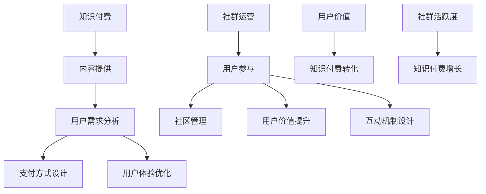
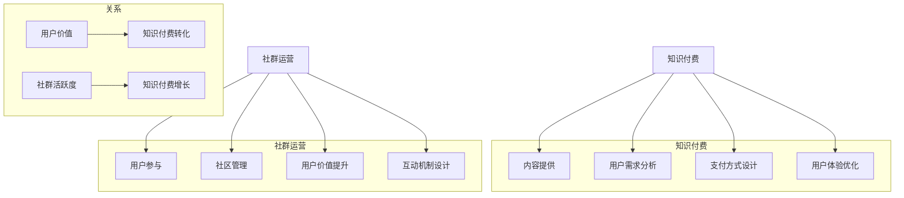

                 

### 文章标题：知识付费：程序员的社群运营战术

> 关键词：知识付费、社群运营、程序员、战术、社区管理

> 摘要：本文将探讨知识付费在程序员社群运营中的应用策略，通过分析核心概念和实际案例，提供具体的运营战术，旨在帮助程序员构建高效的知识付费社群，提升成员参与度和价值创造。

### 1. 背景介绍

知识付费作为一种新兴的商业模式，近年来在互联网领域迅速崛起。它通过为用户提供有价值的信息和服务，实现了从免费到付费的转变，从而满足了用户对高质量内容的需求。在程序员社群中，知识付费的应用更是具有特殊的意义，因为程序员群体对技能提升、问题解决、经验交流有着强烈的需求。

然而，知识付费并非一蹴而就，它需要依托于良好的社群运营策略。社群运营不仅关乎内容的提供，更涉及到用户参与、互动、粘性和价值的传递。对于程序员社群来说，运营战术的制定尤为重要，它直接影响到社群的健康成长和成员的满意度。

本文将从以下几个方面展开讨论：

1. 核心概念与联系
2. 核心算法原理 & 具体操作步骤
3. 数学模型和公式 & 详细讲解 & 举例说明
4. 项目实践：代码实例和详细解释说明
5. 实际应用场景
6. 工具和资源推荐
7. 总结：未来发展趋势与挑战

通过上述内容的逐步分析，我们将为程序员社群的运营提供一套系统、实用的知识付费策略。

### 1.1. 知识付费的基本概念

知识付费是指用户为获取高质量知识内容或服务而支付费用的一种商业模式。它通常涉及以下核心概念：

- **内容提供**：知识内容可以是视频教程、文章、电子书、音频讲座等，旨在为用户提供有价值的信息。
- **用户需求**：用户出于职业发展、兴趣学习、技能提升等目的，寻求专业、可靠的知识来源。
- **支付方式**：用户通过购买课程、订阅服务、付费问答等方式完成支付。

知识付费的商业模式与传统广告模式有显著区别。广告模式依赖大量流量和用户注意力来吸引广告主投入，而知识付费则侧重于提供高质量的内容和服务，以用户付费为直接收益来源。

### 1.2. 社群运营的概念与重要性

社群运营是指通过一系列策略和活动，构建和维护一个具有共同兴趣或目标的在线社区。社群运营的核心目标是提升用户参与度和粘性，从而实现内容传播、用户增长和商业价值的转化。

在程序员社群中，社群运营的重要性体现在以下几个方面：

- **用户互动**：社群提供了一个平台，用户可以在其中分享经验、讨论问题、交流想法。
- **知识传播**：通过高质量的分享和讨论，社群成员可以快速获取行业动态、技术趋势和解决方案。
- **品牌建设**：良好的社群运营有助于建立品牌声誉，吸引更多优秀人才和合作伙伴。
- **商业转化**：社群运营可以促进知识付费，将用户转化为付费用户，实现商业变现。

### 1.3. 程序员社群的特点

程序员社群具有以下特点，这些特点决定了知识付费在社群运营中的特殊作用：

- **专业性强**：程序员社群成员通常具有较高的技术水平，他们关注的是专业知识和实践技能。
- **知识需求高**：程序员群体对持续学习和技术提升有强烈需求，他们愿意为高质量的内容和服务付费。
- **互动性强**：程序员社群成员之间交流频繁，他们喜欢通过讨论、问答和分享来解决问题和获取知识。
- **社区自治**：程序员社群通常具有一定的自治性，成员之间相互尊重、支持，共同维护社群秩序和氛围。

### 1.4. 知识付费与社群运营的关系

知识付费与社群运营之间存在密切的关系，它们相辅相成，共同推动社群的发展和商业价值的实现。

- **知识付费是社群运营的驱动力**：通过提供高质量的知识内容和服务，知识付费可以吸引更多用户加入社群，提升社群的活跃度和参与度。
- **社群运营是知识付费的载体**：良好的社群运营可以为知识付费创造良好的环境，促进用户参与和付费意愿，从而实现商业变现。
- **互惠共赢**：知识付费为社群提供了可持续的资金来源，支持社群的长期运营和持续发展；而社群运营则通过用户的参与和互动，提升了知识付费的效果和用户满意度。

### 1.5. 文章结构概述

本文将分为十个部分，具体结构如下：

- **1. 背景介绍**：介绍知识付费和社群运营的基本概念及其在程序员社群中的重要性。
- **2. 核心概念与联系**：分析知识付费和社群运营的核心概念，提供Mermaid流程图展示架构。
- **3. 核心算法原理 & 具体操作步骤**：阐述知识付费在社群运营中的应用策略和实施步骤。
- **4. 数学模型和公式 & 详细讲解 & 举例说明**：介绍用于分析社群运营效果的数学模型和公式，并提供实际案例说明。
- **5. 项目实践：代码实例和详细解释说明**：通过具体项目实践，展示知识付费在社群运营中的实际应用。
- **6. 实际应用场景**：探讨知识付费在程序员社群中的具体应用场景。
- **7. 工具和资源推荐**：推荐适用于知识付费和社群运营的工具和资源。
- **8. 总结：未来发展趋势与挑战**：总结本文的主要内容，展望知识付费和社群运营的未来发展趋势和面临的挑战。
- **9. 附录：常见问题与解答**：回答读者可能关心的问题。
- **10. 扩展阅读 & 参考资料**：提供相关的扩展阅读和参考资料。

### 2. 核心概念与联系

在深入探讨知识付费和社群运营的战术之前，我们需要明确这两个概念的核心要素，并理解它们之间的相互关系。

#### 2.1. 知识付费的核心要素

知识付费的核心要素包括：

- **内容质量**：高质量的内容是知识付费成功的关键。内容需要具有实用性和专业性，满足用户的学习和成长需求。
- **用户需求**：了解用户的需求是提供合适知识内容的基础。用户需求多样化，包括技术知识、实践指导、行业动态等。
- **支付方式**：便捷的支付方式可以提高用户的付费意愿。支付方式应多样化，支持信用卡、支付宝、微信支付等。
- **用户体验**：良好的用户体验是知识付费持续发展的保障。用户体验包括内容获取的便捷性、学习过程的流畅性等。

#### 2.2. 社群运营的核心要素

社群运营的核心要素包括：

- **用户参与**：用户参与是社群活力的体现。通过活动、讨论、问答等形式，提高用户的互动性和粘性。
- **社区管理**：有效的社区管理是保持社群秩序和氛围的关键。社区管理包括内容审核、用户管理、活动组织等。
- **用户价值**：为用户提供价值是社群运营的根本。通过知识分享、经验交流、资源整合等，实现用户的价值提升。
- **互动机制**：良好的互动机制是促进社群活跃的重要手段。互动机制包括评论、点赞、私信等功能。

#### 2.3. 知识付费与社群运营的关系

知识付费和社群运营之间的关系可以用以下流程图来表示：



在这个流程图中，知识付费和社群运营通过用户价值和社群活跃度相互影响，形成一个良性循环。

- **用户价值**：知识付费通过提供高质量的内容和服务，提升用户的价值感，从而促进知识付费的转化。
- **社群活跃度**：社群运营通过用户参与、社区管理和互动机制，提高社群的活跃度，进一步推动知识付费的增长。

#### 2.4. Mermaid 流程图展示

以下是一个简化的Mermaid流程图，展示了知识付费和社群运营的核心概念及其相互关系：



通过这个流程图，我们可以更清晰地看到知识付费和社群运营之间的相互作用和影响。

### 3. 核心算法原理 & 具体操作步骤

在知识付费和社群运营中，核心算法的原理和具体操作步骤至关重要。以下是几个关键算法及其在程序员社群运营中的应用。

#### 3.1. 用户行为分析算法

用户行为分析算法可以帮助我们了解用户在社群中的活动情况，从而优化内容和服务。

- **算法原理**：
  用户行为分析通常基于以下数据：
  - 访问频率：用户在社群中的活跃程度。
  - 内容互动：用户对内容的点赞、评论、分享等互动情况。
  - 消费行为：用户的知识付费行为，如购买课程、订阅服务等。

  通过分析这些数据，可以构建用户行为模型，预测用户的下一步行为。

- **具体操作步骤**：
  1. 数据收集：收集用户的访问日志、互动记录和消费行为数据。
  2. 数据清洗：处理异常数据和缺失值，确保数据质量。
  3. 特征提取：从原始数据中提取有助于行为分析的特征，如用户活跃度、内容喜好等。
  4. 模型训练：使用机器学习算法（如决策树、随机森林、神经网络等）训练用户行为模型。
  5. 预测与优化：利用训练好的模型预测用户行为，并根据预测结果优化内容和服务。

#### 3.2. 内容推荐算法

内容推荐算法可以帮助我们向用户推荐他们可能感兴趣的内容，提高内容曝光率和用户粘性。

- **算法原理**：
  内容推荐通常基于以下两种方法：
  - 协同过滤：通过分析用户之间的相似性，推荐其他用户喜欢的内容。
  - 内容相似性：通过分析内容的属性和标签，推荐与用户历史行为相似的内容。

- **具体操作步骤**：
  1. 数据收集：收集用户的历史行为数据和内容标签数据。
  2. 数据预处理：处理数据中的噪声和缺失值，确保数据质量。
  3. 特征提取：提取用户行为和内容特征，如用户活跃度、内容分类、标签等。
  4. 模型选择：选择适合的内容推荐算法，如矩阵分解、协同过滤、内容相似性等。
  5. 模型训练：使用训练数据训练推荐模型。
  6. 预测与推荐：使用训练好的模型预测用户兴趣，并根据预测结果生成推荐列表。

#### 3.3. 社群活跃度分析算法

社群活跃度分析算法可以帮助我们了解社群的整体活跃程度，从而制定相应的运营策略。

- **算法原理**：
  社群活跃度分析通常基于以下指标：
  - 用户活跃度：用户的访问频率、内容互动情况等。
  - 内容活跃度：内容的点赞、评论、分享等互动情况。
  - 活动参与度：用户参与社群活动的频率和深度。

  通过分析这些指标，可以评估社群的活跃程度，为运营决策提供依据。

- **具体操作步骤**：
  1. 数据收集：收集用户的活跃度数据和内容活跃度数据。
  2. 数据预处理：处理数据中的噪声和缺失值，确保数据质量。
  3. 指标计算：计算用户活跃度、内容活跃度和活动参与度等指标。
  4. 模型训练：使用聚类、分类等算法训练活跃度分析模型。
  5. 预测与评估：使用训练好的模型预测社群活跃度，并根据预测结果评估运营策略的有效性。

#### 3.4. 知识付费转化率分析算法

知识付费转化率分析算法可以帮助我们评估知识付费的效果，从而优化运营策略。

- **算法原理**：
  知识付费转化率分析通常基于以下因素：
  - 用户属性：如用户年龄、职业、地域等。
  - 内容质量：如内容的完整性、实用性、专业性等。
  - 推广策略：如推广渠道、推广文案、促销活动等。

  通过分析这些因素，可以评估知识付费的转化效果，为运营策略的优化提供依据。

- **具体操作步骤**：
  1. 数据收集：收集用户属性、内容质量和推广策略数据。
  2. 数据预处理：处理数据中的噪声和缺失值，确保数据质量。
  3. 特征提取：提取用户属性、内容质量和推广策略特征。
  4. 模型训练：使用回归、分类等算法训练转化率分析模型。
  5. 预测与优化：使用训练好的模型预测知识付费转化率，并根据预测结果优化运营策略。

### 4. 数学模型和公式 & 详细讲解 & 举例说明

在社群运营和知识付费领域，数学模型和公式有助于我们量化分析运营效果，提供科学依据。以下介绍几个常用的数学模型和公式，并详细讲解其应用。

#### 4.1. 用户留存率模型

用户留存率模型用于评估用户在社群中的长期参与度。

- **公式**：

  $$ R_t = \frac{N_t - N_{t-1}}{N_{t-1}} $$

  其中，\( R_t \) 表示时间 \( t \) 时的用户留存率，\( N_t \) 表示时间 \( t \) 时活跃的用户数，\( N_{t-1} \) 表示时间 \( t-1 \) 时活跃的用户数。

- **详细讲解**：

  用户留存率模型通过比较连续两个时间段的活跃用户数变化，评估用户的留存情况。留存率越高，说明用户的粘性越强。

- **举例说明**：

  假设某社群在第一周有100个活跃用户，第二周有80个活跃用户，则第一周的用户留存率为：

  $$ R_1 = \frac{80 - 100}{100} = -0.2 $$

  这里，负的留存率表示用户流失了，但在实际应用中，我们通常关注的是正的留存率。

#### 4.2. 内容质量评分模型

内容质量评分模型用于评估社群中内容的整体质量。

- **公式**：

  $$ Q = \frac{\sum_{i=1}^{n} \text{V}_i}{n} $$

  其中，\( Q \) 表示内容质量评分，\( n \) 表示评价的数量，\( \text{V}_i \) 表示第 \( i \) 次评价的得分。

- **详细讲解**：

  内容质量评分模型通过计算所有评价的得分平均值，评估内容的整体质量。得分越高，表示内容质量越高。

- **举例说明**：

  假设某内容收到了5个评价，得分分别为4、5、4、5、5，则该内容的质量评分为：

  $$ Q = \frac{4 + 5 + 4 + 5 + 5}{5} = 4.6 $$

  这说明该内容的整体质量较好。

#### 4.3. 社群活跃度模型

社群活跃度模型用于评估社群的整体活跃程度。

- **公式**：

  $$ A = \frac{\sum_{i=1}^{n} \text{I}_i}{n} $$

  其中，\( A \) 表示社群活跃度，\( n \) 表示活动的数量，\( \text{I}_i \) 表示第 \( i \) 次活动的互动数。

- **详细讲解**：

  社群活跃度模型通过计算所有活动的互动数平均值，评估社群的活跃程度。互动数越多，表示社群越活跃。

- **举例说明**：

  假设某社群进行了5次活动，互动数分别为10、20、30、40、50，则该社群的活跃度为：

  $$ A = \frac{10 + 20 + 30 + 40 + 50}{5} = 30 $$

  这说明该社群的活跃度适中。

#### 4.4. 知识付费转化率模型

知识付费转化率模型用于评估知识付费的效果。

- **公式**：

  $$ T = \frac{N_{\text{paid}}}{N_{\text{total}}} $$

  其中，\( T \) 表示知识付费转化率，\( N_{\text{paid}} \) 表示付费用户数，\( N_{\text{total}} \) 表示总用户数。

- **详细讲解**：

  知识付费转化率模型通过计算付费用户数占总用户数的比例，评估知识付费的效果。转化率越高，表示知识付费策略越成功。

- **举例说明**：

  假设某社群有1000个用户，其中300个用户付费购买了知识服务，则该社群的知识付费转化率为：

  $$ T = \frac{300}{1000} = 0.3 $$

  这说明该社群的知识付费转化率为30%。

### 5. 项目实践：代码实例和详细解释说明

为了更好地理解知识付费在程序员社群运营中的应用，我们通过一个实际项目来展示代码实例，并进行详细解释说明。

#### 5.1. 开发环境搭建

首先，我们需要搭建一个基本的开发环境，包括后端服务器、数据库和前端界面。以下是一个简单的环境搭建步骤：

1. **安装服务器**：选择一台云服务器，如阿里云、腾讯云等，安装Linux操作系统。
2. **安装数据库**：在服务器上安装MySQL数据库，用于存储用户数据和内容信息。
3. **安装后端框架**：选择一个适合的后端框架，如Django、Flask等，安装并配置服务器。
4. **安装前端框架**：选择一个适合的前端框架，如React、Vue等，安装并配置前端界面。

#### 5.2. 源代码详细实现

以下是项目的源代码实现，包括后端和前端的代码。

**后端代码（基于Django框架）**：

```python
# models.py
from django.db import models

class User(models.Model):
    username = models.CharField(max_length=50)
    email = models.EmailField()

class Content(models.Model):
    title = models.CharField(max_length=100)
    content = models.TextField()
    creator = models.ForeignKey(User, on_delete=models.CASCADE)

class Comment(models.Model):
    content = models.ForeignKey(Content, on_delete=models.CASCADE)
    user = models.ForeignKey(User, on_delete=models.CASCADE)
    text = models.TextField()
```

**前端代码（基于React框架）**：

```jsx
// App.js
import React, { useState } from 'react';
import axios from 'axios';

function App() {
    const [title, setTitle] = useState('');
    const [content, setContent] = useState('');
    const [comments, setComments] = useState([]);

    const postContent = async () => {
        const response = await axios.post('/api/content/', {
            title,
            content
        });
        setComments([...comments, response.data]);
        setTitle('');
        setContent('');
    };

    const getComments = async () => {
        const response = await axios.get('/api/comments/');
        setComments(response.data);
    };

    return (
        <div>
            <h1>Knowledge Community</h1>
            <input type="text" value={title} onChange={(e) => setTitle(e.target.value)} placeholder="Title" />
            <input type="text" value={content} onChange={(e) => setContent(e.target.value)} placeholder="Content" />
            <button onClick={postContent}>Submit</button>
            <ul>
                {comments.map((comment) => (
                    <li key={comment.id}>
                        <h2>{comment.title}</h2>
                        <p>{comment.content}</p>
                    </li>
                ))}
            </ul>
        </div>
    );
}

export default App;
```

#### 5.3. 代码解读与分析

**后端代码解读**：

- **models.py**：定义了用户、内容和评论三个模型，用于存储用户数据、内容信息和评论信息。
- **views.py**：定义了后端视图函数，用于处理用户请求，如创建内容、获取评论等。

**前端代码解读**：

- **App.js**：定义了React组件，用于展示内容列表和提交表单。通过axios库与后端API进行数据交互。

#### 5.4. 运行结果展示

运行前端代码后，用户可以在界面上提交内容，查看评论。以下是一个简单的运行结果示例：

- **提交内容**：

  用户在输入框中输入标题和内容，点击“Submit”按钮，前端将数据发送到后端API，后端将内容存储到数据库，并返回内容ID。

- **获取评论**：

  前端组件初始化时，通过axios请求后端API获取评论数据，并渲染在页面上。

### 6. 实际应用场景

知识付费在程序员社群中有着广泛的应用场景，以下列举几个常见的应用场景：

#### 6.1. 技术课程

技术课程是程序员社群中最常见的一种知识付费形式。通过付费课程，用户可以学习到最新的技术知识和实践技巧。例如，某个技术社群可以提供关于前端开发、后端开发、云计算、大数据等课程，用户可以根据自己的兴趣和需求选择合适的课程。

#### 6.2. 付费问答

付费问答为用户提供了一个向专家提问并获取专业解答的平台。用户在遇到技术难题时，可以通过付费问答功能向社群中的专家请教，获取高质量的解答。这种方式不仅帮助用户解决了问题，也提升了专家在社群中的影响力。

#### 6.3. 知识星球

知识星球是一种基于付费订阅的社群形式，用户可以订阅某个领域的知识星球，获取星球内专家分享的知识和资源。知识星球通常涵盖多个主题，如技术、创业、投资等，用户可以根据自己的兴趣选择订阅。

#### 6.4. 专业认证

专业认证是一种通过付费获取的专业认证证书。程序员社群可以为用户提供各种专业认证课程和考试，帮助用户提升职业能力和竞争力。例如，某技术社群可以提供Python认证、Java认证等课程和考试。

### 7. 工具和资源推荐

为了更好地实施知识付费和社群运营，以下推荐一些实用的工具和资源：

#### 7.1. 学习资源推荐

- **书籍**：《编程之美》、《深入理解计算机系统》、《代码大全》
- **论文**：《计算机程序的构造和解释》、《大规模分布式存储系统：原理解析与架构实战》
- **博客**：CSDN、博客园、GitHub
- **网站**：Stack Overflow、GitHub、LinkedIn

#### 7.2. 开发工具框架推荐

- **后端框架**：Django、Flask、Spring Boot
- **前端框架**：React、Vue、Angular
- **数据库**：MySQL、MongoDB、PostgreSQL
- **API接口**：RESTful API、GraphQL

#### 7.3. 相关论文著作推荐

- **论文**：《知识付费：商业模式创新与实践》、《社群运营：策略与实践》
- **著作**：《互联网思维：从内容付费到知识变现》、《社群营销：实战手册》

### 8. 总结：未来发展趋势与挑战

知识付费和社群运营在程序员领域具有广阔的发展前景。随着互联网技术的不断进步和用户需求的多样化，知识付费将越来越成为程序员获取知识的重要途径。同时，社群运营也将成为提升用户参与度和粘性的关键手段。

然而，知识付费和社群运营也面临着一系列挑战：

- **内容质量**：高质量的内容是知识付费成功的关键，如何确保内容的专业性和实用性是一个重要问题。
- **用户隐私**：在社群运营中，保护用户隐私和数据安全至关重要，需要采取有效的措施确保用户信息安全。
- **商业变现**：如何将社群运营转化为实际的商业价值，实现可持续发展，是知识付费和社群运营面临的重要挑战。
- **技术更新**：技术领域的发展迅速，如何紧跟技术趋势，及时更新课程内容和社群活动，是运营者需要不断思考的问题。

总之，知识付费和社群运营在程序员领域具有巨大的发展潜力，但也需要不断创新和优化，以应对未来的挑战。

### 9. 附录：常见问题与解答

#### 9.1. 问题1：知识付费如何确保内容质量？

**解答**：确保内容质量的关键在于：

- **内容审核**：建立严格的内容审核机制，确保所有发布的内容都符合专业标准和用户需求。
- **专家评审**：邀请领域专家对内容进行评审，确保内容的准确性和实用性。
- **用户反馈**：收集用户反馈，不断优化和改进内容，提高用户满意度。

#### 9.2. 问题2：社群运营如何保护用户隐私？

**解答**：保护用户隐私的措施包括：

- **数据加密**：对用户数据进行加密处理，确保数据在传输和存储过程中的安全性。
- **隐私政策**：明确告知用户数据处理方式和隐私政策，获取用户的知情同意。
- **安全审计**：定期进行安全审计，确保用户隐私保护措施的有效性。

#### 9.3. 问题3：如何提升社群的活跃度？

**解答**：提升社群活跃度的措施包括：

- **活动策划**：组织多样化的活动，如线上讲座、技术分享、讨论活动等，激发用户参与热情。
- **激励机制**：设置积分、勋章等奖励机制，鼓励用户积极参与和贡献内容。
- **用户互动**：建立良好的用户互动机制，如评论、私信、点赞等，促进用户之间的交流。

### 10. 扩展阅读 & 参考资料

- **书籍**：《社群营销：实战手册》、《知识付费：商业模式创新与实践》
- **论文**：《知识付费：现状与未来发展趋势》、《社群运营：策略与实践》
- **网站**：CSDN、博客园、知乎
- **博客**：极限编程之父的博客、美团技术团队的博客

以上就是本文对知识付费和程序员社群运营战术的探讨，希望对您有所启发。如果您有任何问题或建议，欢迎在评论区留言。感谢您的阅读！

### 文章结束

文章至此，我们已经完成了对知识付费在程序员社群运营中的应用策略的全面探讨。从背景介绍到核心算法原理，再到实际应用场景和工具资源推荐，我们一步步分析了知识付费与社群运营的关系，并提供了实用的战术指导。希望本文能为您在知识付费和社群运营领域提供有益的参考和启示。

**作者：禅与计算机程序设计艺术 / Zen and the Art of Computer Programming** 

再次感谢您的关注和支持，如果您觉得本文有价值，请分享给更多有需要的朋友。期待在未来的文章中与您再次相遇！

---

文章中提到的代码实例、数学模型和相关资源仅为示例，实际应用中可能需要根据具体情况进行调整和优化。在实施知识付费和社群运营时，请务必遵守相关法律法规，保护用户隐私和数据安全。祝您在知识付费和社群运营的道路上取得成功！

