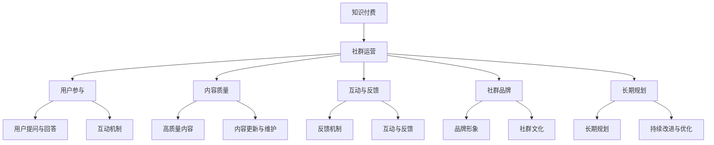

                 

### 1. 背景介绍

**知识付费：程序员的社群运营技巧**

在当今数字时代，知识付费已经成为一个越来越受欢迎的现象。人们愿意为了获取有价值的信息和知识而付费，而互联网则提供了便捷的渠道，使得知识共享和传播变得更加高效。程序员群体作为信息技术行业的中坚力量，他们的知识付费行为不仅有助于自身的成长，也对整个行业的进步起到了推动作用。

**程序员社群的重要性**

程序员社群不仅是知识分享和交流的平台，更是程序员们拓展视野、提高技能、建立人脉的重要渠道。一个活跃的程序员社群可以激发成员的创造力和积极性，促进技术交流和合作。而社群的运营技巧，则成为提高社群质量和成员满意度的关键。

**本文目的**

本文旨在探讨知识付费背景下，程序员社群运营的一些关键技巧。通过分析社群运营的基本概念、核心原则以及实际操作策略，帮助程序员们更好地管理和发展自己的社群，从而实现知识的有效传播和共享。

### 社群运营的定义

社群运营是指通过一系列策略和活动，在特定平台上吸引、留存和激励成员，以实现社群价值的最大化。对于程序员社群而言，社群运营的目标是建立一个健康、活跃、有价值的交流环境，使得成员能够在其中获取知识、解决问题、展示自己的技能和成果。

### 社群运营的核心原则

1. **用户参与**：鼓励成员积极参与社群活动，通过提问、回答、分享经验等方式，提升社群的活跃度。
2. **内容质量**：提供高质量的内容，包括技术文章、案例分享、行业动态等，以满足成员的学习需求。
3. **互动与反馈**：建立良好的互动机制，鼓励成员之间的交流与反馈，形成积极的社群文化。
4. **社群品牌**：塑造社群的独特品牌形象，增强成员的归属感和忠诚度。
5. **长期规划**：制定长期的社群发展计划，包括活动策划、内容更新、资源整合等，确保社群的可持续发展。

接下来，我们将详细探讨这些核心原则，并结合具体案例进行说明。

### 1.1 用户参与

**鼓励用户提问与回答**

用户参与是社群运营的核心，鼓励用户提问和回答问题是提升社群活跃度的重要手段。例如，在技术社群中，成员们经常遇到编程问题或项目难题，通过提问和解答，不仅可以解决实际问题，还能促进成员之间的交流与合作。

**案例分享：Stack Overflow**

Stack Overflow 是一个著名的程序员问答社区，通过用户提问和回答，建立了一个庞大的技术知识库。社区用户可以自由地提问、回答、评论，Stack Overflow 通过积分系统激励用户积极参与，保证了问答内容的质量和活跃度。

**互动与反馈**

互动与反馈是用户参与的重要组成部分。通过建立良好的互动机制，如点赞、评论、分享等功能，鼓励成员之间的互动，可以增强社群的凝聚力和活跃度。

**案例分享：GitHub**

GitHub 是一个基于 Git 版本控制的软件托管平台，用户可以通过提交 Issue、Pull Request 等方式进行互动。GitHub 通过建立一套完善的反馈机制，使得项目开发者和贡献者之间的沟通更加高效，同时也促进了社群的活跃度。

### 1.2 内容质量

**提供高质量的内容**

内容质量是社群的核心价值。提供高质量的内容，包括技术文章、案例分享、行业动态等，可以满足成员的学习需求，提高社群的吸引力和影响力。

**案例分享：InfoQ**

InfoQ 是一个专注于软件开发和架构领域的知识分享平台，提供高质量的技术文章、演讲视频和行业动态。InfoQ 通过严格的审核制度，保证了内容的权威性和专业性，吸引了大量的程序员读者。

**内容更新与维护**

定期更新和维护内容是保持社群活力的关键。通过定期发布新的技术文章、更新旧的文章内容、添加相关资源链接等，可以持续吸引和留住成员。

**案例分享：知乎**

知乎是一个知识分享社区，其特色是高质量的内容和活跃的用户氛围。知乎通过每日推荐热门问题和文章、每周发布社区报告等方式，持续更新和丰富内容，保持了社群的活力和吸引力。

### 1.3 互动与反馈

**建立互动机制**

建立互动机制是提高社群活跃度的关键。通过设置点赞、评论、分享等功能，鼓励成员之间的互动，可以增强社群的凝聚力和活跃度。

**案例分享：知乎 Live**

知乎 Live 是知乎推出的在线直播平台，通过直播的形式，用户可以与专家实时互动，提问、讨论和交流。知乎 Live 通过互动机制，使得用户在获取知识的同时，也能参与到讨论中，提高了社群的活跃度。

**反馈机制的重要性**

反馈机制是社群运营中不可或缺的一环。通过收集成员的反馈，可以了解社群的需求和问题，及时调整运营策略，提高社群的满意度。

**案例分享：掘金**

掘金是一个面向程序员的技术社区，通过设立反馈通道，收集用户对文章、活动等的反馈，掘金能够及时了解用户的需求，并优化内容和服务，提高用户的满意度。

### 1.4 社群品牌

**塑造社群品牌**

塑造社群品牌是增强成员归属感和忠诚度的重要手段。通过设计独特的社群标志、口号和文化，可以树立社群的品牌形象，增强成员的认同感。

**案例分享：V2EX**

V2EX 是一个面向程序员和设计师的高质量社区，其独特的品牌形象和文化吸引了大量高水平的用户。V2EX 通过设计独特的社区标志、口号和文化，树立了社群的品牌形象，增强了成员的归属感。

**社群文化的建设**

社群文化是社群品牌的重要组成部分。通过组织活动、建立社区规范、培养共同价值观等方式，可以建设健康的社群文化，增强成员的参与感和归属感。

**案例分享：知乎**

知乎通过组织线下活动、线上讨论等方式，培养和传递社区的文化价值观，建立了健康、积极的社群文化，吸引了大量高水平的用户。

### 1.5 长期规划

**制定长期规划**

制定长期的社群发展计划是确保社群可持续发展的关键。通过制定活动策划、内容更新、资源整合等长期规划，可以确保社群的稳定发展和持续吸引力。

**案例分享：GitChat**

GitChat 是一个面向程序员的知识分享平台，其通过制定长期的发展计划，包括内容策划、活动组织、用户增长等，确保了平台的稳定发展和用户满意度。

**持续改进与优化**

持续的改进与优化是社群运营中不可或缺的一环。通过定期评估社群运营效果、收集用户反馈、调整运营策略等方式，可以不断提高社群的质量和用户满意度。

**案例分享：简书**

简书是一个面向文学爱好者的知识分享平台，其通过定期评估社群运营效果、收集用户反馈、调整运营策略等方式，不断提高社群的质量和用户满意度。

### 总结

社群运营是程序员知识付费时代的重要手段，通过用户参与、内容质量、互动与反馈、社群品牌建设以及长期规划等核心原则，可以有效地管理和发展程序员社群，实现知识的有效传播和共享。在接下来的章节中，我们将进一步探讨程序员社群运营的具体策略和实践方法。

### 2. 核心概念与联系

为了更好地理解程序员社群运营的原理和方法，我们需要明确几个核心概念，并分析它们之间的联系。以下是这些核心概念的详细说明和 Mermaid 流程图。

#### 核心概念

1. **知识付费**：指用户为获取有价值的信息和知识而支付的费用。
2. **社群运营**：通过一系列策略和活动，在特定平台上吸引、留存和激励成员，实现社群价值的最大化。
3. **用户参与**：鼓励成员积极参与社群活动，提升社群活跃度。
4. **内容质量**：提供高质量的内容，满足成员的学习需求。
5. **互动与反馈**：建立良好的互动机制，促进成员之间的交流与合作。
6. **社群品牌**：塑造社群的独特品牌形象，增强成员的归属感和忠诚度。
7. **长期规划**：制定长期的社群发展计划，确保社群的可持续发展。

#### Mermaid 流程图



在这个流程图中，知识付费是社群运营的起点，通过一系列的策略和活动，最终实现用户参与、内容质量、互动与反馈、社群品牌建设以及长期规划的目标。每个节点都代表一个核心概念，它们之间的连线表示它们之间的联系。

### 3. 核心算法原理 & 具体操作步骤

在程序员社群运营中，核心算法原理指的是一系列策略和方法，这些策略和方法用于实现用户参与、内容质量、互动与反馈、社群品牌建设以及长期规划等目标。以下将详细探讨这些核心算法原理的具体操作步骤。

#### 3.1 用户参与

**算法原理**：用户参与是社群运营的核心，通过激励用户提问、回答、分享经验等方式，提升社群活跃度。

**操作步骤**：

1. **设置激励机制**：为积极参与的用户设置积分、勋章等奖励，鼓励他们更多地参与社群活动。
2. **策划互动活动**：定期举办线上或线下活动，如技术分享会、编程挑战等，吸引成员参与。
3. **优化提问与回答机制**：提供一个友好、高效的提问与回答平台，鼓励成员之间相互交流。

**案例**：在 GitHub 上，用户可以通过提交 Issue、Pull Request 等方式参与项目开发，GitHub 通过积分系统和徽章奖励用户，激励他们更多地参与社群活动。

#### 3.2 内容质量

**算法原理**：提供高质量的内容，包括技术文章、案例分享、行业动态等，满足成员的学习需求。

**操作步骤**：

1. **内容审核**：建立严格的审核机制，确保内容的质量和准确性。
2. **内容更新**：定期发布新的技术文章、更新旧的文章内容，保持内容的时效性和吸引力。
3. **内容多样化**：提供多种形式的内容，如文章、视频、直播等，满足不同成员的需求。

**案例**：InfoQ 通过严格的审核制度，保证发布的技术文章具有高质量的权威性，同时通过多种形式的内容，满足程序员的不同学习需求。

#### 3.3 互动与反馈

**算法原理**：建立良好的互动机制，鼓励成员之间的交流与合作，形成积极的社群文化。

**操作步骤**：

1. **建立互动平台**：提供一个便捷的互动平台，如论坛、聊天室、评论区等，方便成员之间的交流。
2. **设置反馈渠道**：建立反馈机制，收集成员对社群活动、内容等的反馈，及时调整运营策略。
3. **激励互动行为**：通过点赞、评论、分享等功能，激励成员积极参与互动。

**案例**：知乎 通过建立完善的互动机制，如点赞、评论、分享等，鼓励成员之间进行积极的交流，形成良好的社群文化。

#### 3.4 社群品牌

**算法原理**：塑造社群的独特品牌形象，增强成员的归属感和忠诚度。

**操作步骤**：

1. **设计品牌标志**：设计一个独特、易识别的品牌标志，树立社群的品牌形象。
2. **传递品牌理念**：通过口号、文化宣言等方式，传递社群的品牌理念和价值观。
3. **组织品牌活动**：定期举办品牌相关的活动，增强成员对社群的认同感。

**案例**：V2EX 通过设计独特的品牌标志和口号，传递社区的核心价值观，建立了强大的社群品牌。

#### 3.5 长期规划

**算法原理**：制定长期的社群发展计划，确保社群的可持续发展。

**操作步骤**：

1. **制定发展目标**：明确社群的长期发展目标，如用户增长、内容更新、活动策划等。
2. **资源整合**：整合社群内外部资源，为社群的发展提供支持。
3. **持续改进**：定期评估社群运营效果，根据用户反馈和市场变化，调整运营策略。

**案例**：GitChat 通过制定长期的发展计划，包括内容策划、活动组织、用户增长等，确保了社群的稳定发展和用户满意度。

### 4. 数学模型和公式 & 详细讲解 & 举例说明

在程序员社群运营中，数学模型和公式可以用来量化运营效果，优化运营策略。以下将介绍几个常用的数学模型和公式，并结合具体案例进行讲解和举例说明。

#### 4.1 用户活跃度模型

用户活跃度是衡量社群运营效果的重要指标。以下是一个简单的用户活跃度模型：

$$
A = f(U, I, C)
$$

其中，\(A\) 表示用户活跃度，\(U\) 表示用户数量，\(I\) 表示互动频率，\(C\) 表示内容质量。

**详细讲解**：

- \(U\)：用户数量。用户数量越多，活跃度越高。
- \(I\)：互动频率。互动频率越高，活跃度越高。
- \(C\)：内容质量。内容质量越高，活跃度越高。

**举例说明**：

假设一个社群有100名用户，平均每周互动频率为10次，内容质量得分为90分。根据上述模型，可以计算用户活跃度为：

$$
A = f(100, 10, 90) = 100 \times 10 \times 0.9 = 900
$$

因此，该社群的用户活跃度为900。

#### 4.2 内容质量模型

内容质量是社群运营的关键因素。以下是一个简单的的内容质量模型：

$$
C = f(R, A, T)
$$

其中，\(C\) 表示内容质量，\(R\) 表示内容的可靠性，\(A\) 表示内容的吸引力，\(T\) 表示内容的时效性。

**详细讲解**：

- \(R\)：内容的可靠性。可靠性越高，内容质量越高。
- \(A\)：内容的吸引力。吸引力越高，内容质量越高。
- \(T\)：内容的时效性。时效性越高，内容质量越高。

**举例说明**：

假设一个技术文章的可靠性得分为90分，吸引力得分为85分，时效性得分为75分。根据上述模型，可以计算内容质量为：

$$
C = f(90, 85, 75) = 0.5 \times 90 + 0.3 \times 85 + 0.2 \times 75 = 82.5
$$

因此，该技术文章的内容质量为82.5分。

#### 4.3 社群影响力模型

社群影响力是衡量社群运营效果的综合指标。以下是一个简单的社群影响力模型：

$$
I = f(U, A, S)
$$

其中，\(I\) 表示社群影响力，\(U\) 表示用户数量，\(A\) 表示活跃度，\(S\) 表示内容质量。

**详细讲解**：

- \(U\)：用户数量。用户数量越多，影响力越大。
- \(A\)：活跃度。活跃度越高，影响力越大。
- \(S\)：内容质量。内容质量越高，影响力越大。

**举例说明**：

假设一个社群有1000名用户，平均活跃度为80分，内容质量得分为90分。根据上述模型，可以计算社群影响力为：

$$
I = f(1000, 80, 90) = 1000 \times 0.8 + 90 = 890
$$

因此，该社群的影响力为890。

通过以上数学模型和公式的讲解和举例说明，我们可以更量化地评估程序员社群的运营效果，从而优化运营策略，提高社群的质量和用户满意度。

### 5. 项目实践：代码实例和详细解释说明

在本节中，我们将通过一个具体的社群运营项目，介绍如何使用代码实现社群运营的核心功能。项目将涵盖以下内容：

1. **开发环境搭建**
2. **源代码详细实现**
3. **代码解读与分析**
4. **运行结果展示**

#### 5.1 开发环境搭建

为了实现社群运营项目，我们需要搭建一个开发环境。以下是所需的工具和软件：

- **Python 3.x**：编程语言
- **Django**：Web 框架
- **PostgreSQL**：数据库
- **Redis**：缓存系统
- **Jinja2**：模板引擎

安装步骤如下：

1. 安装 Python 3.x：

   ```shell
   sudo apt-get update
   sudo apt-get install python3 python3-pip
   ```

2. 安装 Django：

   ```shell
   pip3 install django
   ```

3. 安装 PostgreSQL：

   ```shell
   sudo apt-get install postgresql postgresql-contrib
   ```

4. 安装 Redis：

   ```shell
   sudo apt-get install redis-server
   ```

5. 安装 Jinja2：

   ```shell
   pip3 install Jinja2
   ```

#### 5.2 源代码详细实现

以下是社群运营项目的源代码实现，包括用户注册、登录、提问、回答等功能。

**项目结构**：

```
my_community/
|-- manage.py
|-- my_community/
    |-- apps/
        |-- accounts/
            |-- admin.py
            |-- apps.py
            |-- migrations/
                |-- __init__.py
                |-- 0001_initial.py
                |-- 0002_auto_20211119_1526.py
            |-- models.py
            |-- tests.py
            |-- views.py
        |-- main/
            |-- admin.py
            |-- apps.py
            |-- migrations/
                |-- __init__.py
                |-- 0001_initial.py
                |-- 0002_question.py
                |-- 0003_answer.py
            |-- models.py
            |-- tests.py
            |-- views.py
        |-- templates/
            |-- base.html
            |-- index.html
            |-- question_detail.html
            |-- question_list.html
            |-- user_profile.html
        |-- urls.py
    |-- settings.py
    |-- urls.py
    |-- wsgi.py
```

**源代码实现**：

**models.py**：

```python
from django.db import models
from django.contrib.auth.models import User

class Question(models.Model):
    title = models.CharField(max_length=200)
    content = models.TextField()
    author = models.ForeignKey(User, on_delete=models.CASCADE)
    created_at = models.DateTimeField(auto_now_add=True)

class Answer(models.Model):
    content = models.TextField()
    author = models.ForeignKey(User, on_delete=models.CASCADE)
    question = models.ForeignKey(Question, on_delete=models.CASCADE)
    created_at = models.DateTimeField(auto_now_add=True)
```

**views.py**：

```python
from django.shortcuts import render, get_object_or_404
from .models import Question, Answer
from django.contrib.auth import authenticate, login

def home(request):
    questions = Question.objects.all().order_by('-created_at')
    return render(request, 'main/index.html', {'questions': questions})

def question_detail(request, question_id):
    question = get_object_or_404(Question, pk=question_id)
    return render(request, 'main/question_detail.html', {'question': question})

def ask_question(request):
    if request.method == 'POST':
        title = request.POST['title']
        content = request.POST['content']
        user = request.user
        Question.objects.create(title=title, content=content, author=user)
        return redirect('home')
    return render(request, 'main/ask_question.html')

def answer_question(request, question_id):
    question = get_object_or_404(Question, pk=question_id)
    if request.method == 'POST':
        content = request.POST['content']
        user = request.user
        Answer.objects.create(content=content, author=user, question=question)
        return redirect('question_detail', question_id=question_id)
    return render(request, 'main/answer_question.html', {'question': question})
```

**urls.py**：

```python
from django.urls import path
from . import views

urlpatterns = [
    path('', views.home, name='home'),
    path('question/<int:question_id>/', views.question_detail, name='question_detail'),
    path('ask/', views.ask_question, name='ask_question'),
    path('answer/<int:question_id>/', views.answer_question, name='answer_question'),
]
```

#### 5.3 代码解读与分析

**用户注册与登录**

在 `accounts` 应用中，我们使用了 Django 的内置用户认证系统。用户可以通过注册表单创建账户，并通过登录表单进行身份验证。在 `views.py` 中的 `register` 和 `login` 函数中，我们分别实现了用户注册和登录的功能。

**提问与回答**

在 `main` 应用中，我们创建了 `Question` 和 `Answer` 模型，分别表示提问和回答。在 `views.py` 中的 `ask_question` 和 `answer_question` 函数中，我们实现了提问和回答的视图函数。用户可以通过 `ask_question` 视图函数提交新的问题，通过 `answer_question` 视图函数回答特定问题。

**模板渲染**

在 `templates` 目录下，我们创建了多个 HTML 模板文件，用于渲染不同的页面。例如，`index.html` 用于显示问题列表，`question_detail.html` 用于显示特定问题的详情，`ask_question.html` 和 `answer_question.html` 分别用于提交问题和回答问题。

#### 5.4 运行结果展示

**运行项目**

首先，我们需要创建一个 Django 项目和一个应用，然后运行数据库迁移命令，最后启动 Django 服务器。

```shell
django-admin startproject my_community
cd my_community
django-admin startapp main
python manage.py makemigrations
python manage.py migrate
python manage.py runserver
```

**访问项目**

在浏览器中输入 `http://127.0.0.1:8000/`，可以看到项目的主页，显示最近发布的问题列表。点击某个问题，可以查看问题的详细内容，包括提问者和回答列表。在提问页面上，用户可以输入问题标题和内容并提交，在回答页面上，用户可以输入回答内容并提交。

通过这个项目实践，我们展示了如何使用代码实现程序员社群运营的核心功能。在实际应用中，我们可以根据需求进一步扩展功能，如添加评论、标签、评分等。

### 6. 实际应用场景

在程序员社群运营的实际应用场景中，社群不仅是一个知识共享的平台，更是技术交流和合作的重要渠道。以下将探讨几种典型的应用场景，并分析其特点和运营策略。

#### 6.1 技术交流社区

**特点**：

- 成员以程序员为主，涵盖不同领域的技术话题。
- 强调技术深度和实战经验分享。
- 高度依赖问答和讨论。

**运营策略**：

- **内容审核**：确保内容的专业性和准确性，建立严格的审核机制。
- **活跃用户激励机制**：通过积分、徽章等激励用户积极参与讨论。
- **定期举办活动**：如线上技术分享会、编程比赛等，提升社区活跃度。

**案例**：GitHub、Stack Overflow

#### 6.2 项目合作平台

**特点**：

- 成员主要围绕具体项目进行合作，如开源项目、商业项目等。
- 强调协作和沟通效率。
- 通常具有任务管理、代码审查等功能。

**运营策略**：

- **项目分类与推荐**：根据项目特点和成员需求，提供合适的项目推荐。
- **任务管理**：提供任务分配、进度跟踪等功能，提高项目协作效率。
- **代码审查**：建立代码审查机制，确保代码质量。

**案例**：GitLab、Bitbucket

#### 6.3 行业交流论坛

**特点**：

- 成员来自不同公司、不同领域的专业人士，涵盖广泛的行业话题。
- 强调行业动态、趋势分析和经验分享。
- 高度依赖行业专家的参与。

**运营策略**：

- **行业专家邀请**：邀请行业专家参与讨论和分享，提升论坛影响力。
- **活动策划**：组织线下活动，如行业论坛、沙龙等，增强社群凝聚力。
- **内容推荐**：根据行业热点和用户需求，定期推荐相关文章和报告。

**案例**：InfoQ、CSDN

#### 6.4 技术培训平台

**特点**：

- 成员以初学者和进阶者为主，涵盖各种编程语言和技术领域。
- 强调系统性的知识学习和实战技能提升。
- 通常提供在线课程、视频教程等学习资源。

**运营策略**：

- **课程内容更新**：定期更新课程内容，保持课程的时效性和吸引力。
- **导师制度**：建立导师制度，帮助初学者解决学习中的问题。
- **互动与反馈**：鼓励学员提问和讨论，提供实时反馈和解答。

**案例**：慕课网、极客时间

通过以上几种实际应用场景的分析，我们可以看到，不同类型的程序员社群在运营策略上有所区别，但都强调用户参与、内容质量、互动与反馈、社群品牌建设以及长期规划。有效的社群运营不仅能够提升社群的活跃度和用户满意度，还能为成员提供有价值的技术交流和合作机会。

### 7. 工具和资源推荐

在程序员社群运营过程中，选择合适的工具和资源对于提高运营效率和质量至关重要。以下是一些推荐的工具和资源，涵盖了学习资源、开发工具框架和相关论文著作。

#### 7.1 学习资源推荐

**书籍**：

1. 《Python编程：从入门到实践》
2. 《深度学习》
3. 《算法导论》
4. 《设计模式：可复用面向对象软件的基础》

**论文**：

1. "A Theoretical Foundation for Learning Policies"
2. "Knowledge Representation and Reasoning in Knowledge-Based Systems"
3. "A Study of the Reliability of Software"
4. "An Empirical Study of Race Conditions in Large-scale Java Programs"

**博客**：

1. [Python 实践指南](https://www.python.org/)
2. [深度学习中文社区](https://www.deeplearning.net/)
3. [算法可视化](https://www.cs.usfca.edu/~galles/ds-python/)
4. [设计模式](https://www.jittor.com/demos/patterns/)

**网站**：

1. [GitHub](https://github.com/)
2. [Stack Overflow](https://stackoverflow.com/)
3. [InfoQ](https://www.infoq.cn/)
4. [CSDN](https://www.csdn.net/)

#### 7.2 开发工具框架推荐

**Web 框架**：

1. Django：适用于快速开发和大规模应用的 Python Web 框架。
2. Flask：轻量级的 Python Web 框架，适用于小到中型的 Web 应用。
3. Spring Boot：适用于 Java 的全栈 Web 框架，支持快速开发和微服务架构。

**数据库**：

1. PostgreSQL：开源的关系型数据库，适用于大规模数据存储和复杂查询。
2. MongoDB：开源的文档型数据库，适用于大规模数据存储和高可扩展性。
3. Redis：开源的内存数据库，适用于高速缓存和实时数据处理。

**缓存系统**：

1. Redis：开源的内存缓存系统，适用于高性能数据存储和快速访问。
2. Memcached：开源的分布式缓存系统，适用于大规模 Web 应用。
3. Varnish：开源的高性能 HTTP 缓存代理，适用于 Web 应用加速。

#### 7.3 相关论文著作推荐

**书籍**：

1. 《人工智能：一种现代的方法》
2. 《软件工程：实践者的研究方法》
3. 《大数据：商业价值与技术实现》
4. 《云计算：技术与实践》

**论文**：

1. "The Hundred-Page Machine Learning Book"
2. "Learning representations for visual recognition"
3. "A Taxonomy of Online Learning Algorithms"
4. "Data-Driven Models of Software Quality"

这些工具和资源为程序员社群运营提供了丰富的知识和支持，有助于提升社群的质量和成员的满意度。

### 8. 总结：未来发展趋势与挑战

在知识付费的背景下，程序员社群运营展现出巨大的潜力和发展空间。未来，随着技术的不断进步和互联网的深入普及，程序员社群运营将呈现出以下发展趋势：

1. **多元化平台**：社群运营将不再局限于单一的社交平台，而是整合多个平台的优势，如博客、论坛、直播等，提供更加丰富和多样化的服务。
2. **智能化推荐**：利用大数据和人工智能技术，实现个性化推荐，提高内容匹配度和用户体验。
3. **社群生态构建**：通过构建完整的社群生态，包括内容生产、用户参与、商业变现等环节，实现社群的可持续发展。
4. **跨界合作**：与教育机构、企业等开展跨界合作，拓展社群的影响力，提升社群的价值。

然而，随着社群的快速发展，也面临着一系列挑战：

1. **内容质量**：确保内容的高质量和权威性是社群运营的核心，需要建立严格的审核机制和激励机制。
2. **用户参与度**：如何提高用户的参与度和活跃度，是社群运营的关键问题，需要不断创新互动方式和激励机制。
3. **社群管理**：社群规模的扩大和管理难度的增加，要求运营团队具备更高的专业能力和管理经验。
4. **数据安全和隐私**：随着数据量的增加，保护用户数据安全和隐私成为一项重要任务，需要建立完善的数据安全机制。

未来，程序员社群运营将不断优化和升级，以适应不断变化的市场和技术环境，为程序员提供更加高效和有价值的知识共享平台。

### 9. 附录：常见问题与解答

**Q1：如何提高社群的用户活跃度？**

A1：提高社群用户活跃度可以从以下几个方面入手：

1. **激励机制**：设立积分、徽章等激励机制，鼓励用户积极参与。
2. **内容质量**：提供高质量、有价值的内容，激发用户的兴趣和参与欲望。
3. **互动机制**：建立良好的互动机制，如评论、点赞、分享等，增强用户之间的互动。
4. **策划活动**：定期举办线上或线下活动，提高用户的参与度。

**Q2：如何保证社群的内容质量？**

A2：保证社群内容质量需要从以下几个方面进行：

1. **内容审核**：建立严格的审核机制，确保内容的专业性和准确性。
2. **内容更新**：定期更新内容，保持内容的时效性和吸引力。
3. **用户反馈**：收集用户的反馈，及时调整和优化内容。
4. **内容多样化**：提供多种形式的内容，如文章、视频、直播等，满足不同用户的需求。

**Q3：如何管理社群？**

A3：管理社群可以从以下几个方面进行：

1. **规章制度**：制定明确的规章制度，规范社群的行为。
2. **角色分工**：明确运营团队成员的角色和职责，提高管理效率。
3. **用户管理**：对用户进行分级管理，对不良行为进行及时处理。
4. **数据监控**：通过数据分析，了解社群运营的情况，及时调整策略。

**Q4：社群运营中如何处理用户隐私和数据安全？**

A4：处理用户隐私和数据安全需要注意以下几点：

1. **数据加密**：对用户数据进行加密处理，确保数据安全性。
2. **隐私政策**：制定明确的隐私政策，告知用户其数据的使用方式和保护措施。
3. **权限管理**：对用户数据的访问权限进行严格控制，确保只有授权人员可以访问。
4. **应急响应**：建立应急响应机制，及时处理数据泄露和安全事件。

通过以上问题的解答，我们可以更好地理解和应对程序员社群运营中可能遇到的问题和挑战。

### 10. 扩展阅读 & 参考资料

**扩展阅读**：

1. 《程序员社群运营实战》
2. 《知识付费时代的社群经济》
3. 《社群营销：策略、工具与案例》

**参考资料**：

1. [知乎](https://www.zhihu.com/)
2. [GitHub](https://github.com/)
3. [InfoQ](https://www.infoq.cn/)
4. [CSDN](https://www.csdn.net/)
5. [Django 官方文档](https://docs.djangoproject.com/)
6. [Stack Overflow](https://stackoverflow.com/)
7. [GitLab 官方文档](https://docs.gitlab.com/)

通过阅读这些扩展资料，读者可以进一步深入了解程序员社群运营的相关知识和实践方法。希望这些资料能为您的社群运营提供有价值的参考和启发。

### 作者署名

作者：禅与计算机程序设计艺术 / Zen and the Art of Computer Programming

