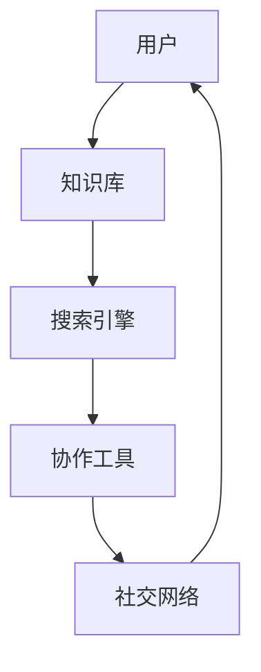
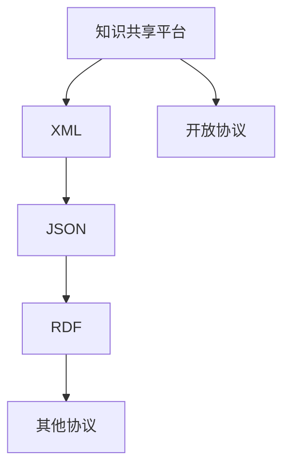
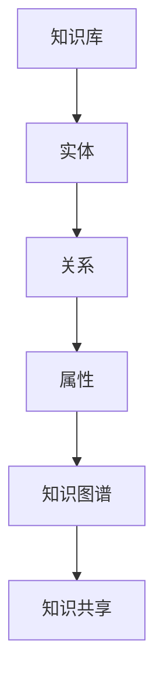
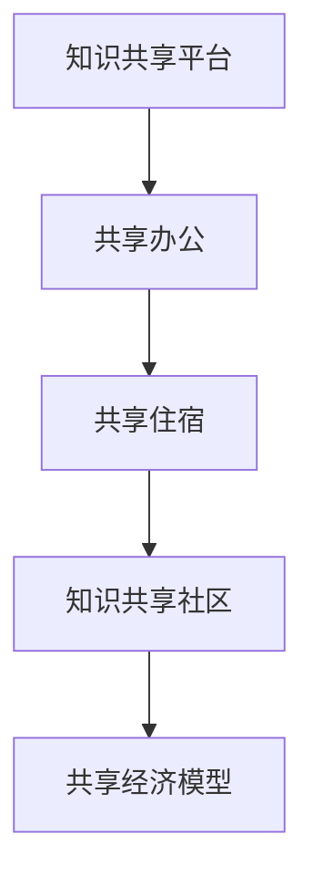
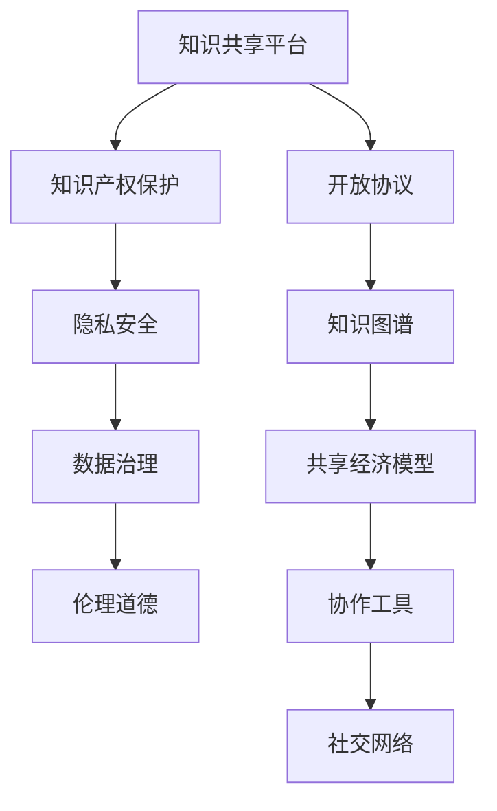

                 

### 1. 背景介绍

**知识共享文化的概念与发展**

知识共享文化是指通过开放的平台、工具和协议，使知识在全社会范围内得以自由流动、交流和复用的一种文化现象。它起源于20世纪末，随着互联网的普及和信息技术的飞速发展而逐渐形成。知识共享文化的核心价值在于促进知识的创造、传播和应用，从而推动社会进步和人类文明的发展。

近年来，知识共享文化在科技、教育、经济等领域展现出了巨大的潜力和影响力。例如，开源软件运动的兴起，使得全球开发者能够共同参与软件的创建与改进，极大地提高了软件的质量和安全性；开放教育资源（OER）的普及，使得教育资源的获取变得更加平等，有助于缩小教育差距；共享经济模式的兴起，使得闲置资源能够得到有效利用，提高了资源的使用效率。

**知识共享的重要性**

知识共享对于个人、组织和社会都具有深远的意义。对个人来说，知识共享有助于提高个人的知识水平和技能，增强个人的竞争力。对组织来说，知识共享能够提高组织的创新能力和响应速度，降低运营成本，提升市场竞争力。对社会来说，知识共享能够促进知识的普及和传播，推动科技和教育的发展，提高全民素质，缩小社会不平等。

然而，知识共享也面临着一些挑战，如知识产权保护、隐私安全、数据质量管理等问题。这些问题需要通过制定相应的政策和法规，以及采用先进的技术手段来解决。

### 2. 核心概念与联系

在构建知识共享文化中，有几个核心概念和它们之间的联系至关重要。这些概念包括知识共享平台、开放协议、知识图谱、共享经济模型等。

#### 知识共享平台

知识共享平台是知识共享文化的基石，它为知识的创建、存储、检索和分享提供了基础设施。这些平台通常具有以下特征：

- **开放性**：平台应该允许任何人注册并参与知识共享。
- **协作性**：平台应支持用户之间的协作，如共同编辑、评论和评价。
- **互联互通**：平台应能够与其他平台和数据源进行无缝连接，实现知识的共享和复用。

**Mermaid 流程图：知识共享平台架构**



#### 开放协议

开放协议是知识共享的关键，它定义了数据交换的格式和标准。常见的开放协议包括XML、JSON、RDF等。这些协议确保了不同系统之间的数据互操作性，使得知识能够在不同平台和系统之间流畅传递。

**Mermaid 流程图：开放协议与知识共享平台的关系**



#### 知识图谱

知识图谱是一种结构化的知识表示形式，它通过实体、关系和属性的表示，为知识共享提供了语义化的基础。知识图谱能够实现知识的语义搜索、推理和智能推荐。

**Mermaid 流程图：知识图谱与知识共享的关系**



#### 共享经济模型

共享经济模型是知识共享文化的一种实现方式，它通过共享闲置资源、技能和知识，实现资源的最大化利用。共享经济模型包括共享办公、共享住宿、知识共享社区等。

**Mermaid 流程图：共享经济模型与知识共享文化的联系**



这些核心概念和联系构成了知识共享文化的基础，为知识的创造、传播和应用提供了强有力的支持。在接下来的章节中，我们将进一步探讨这些概念的具体实现和应用。

#### 核心概念与联系（续）

除了上述核心概念外，还有几个关键因素在知识共享文化的构建中扮演着重要角色，这些因素包括知识产权保护、隐私安全、数据治理和伦理道德。

**知识产权保护**

知识产权保护是知识共享文化中不可忽视的一个重要方面。它涉及到如何平衡知识的创造者与共享者之间的权益。知识产权保护机制需要确保知识共享活动不侵犯原创者的知识产权，同时也要保护共享者的合法权益。例如，开源软件运动中的版权协议（如GPL、Apache License）就为知识共享提供了一套完善的知识产权保护框架。

**隐私安全**

在知识共享过程中，隐私安全也是一个重要的问题。随着大数据和人工智能技术的发展，个人数据的泄露和滥用风险不断增加。为了确保知识共享的安全性，需要采用先进的加密技术、访问控制机制和隐私保护协议。例如，差分隐私（Differential Privacy）技术能够在数据分析过程中保护个体隐私，同时提供可靠的统计结果。

**数据治理**

数据治理是知识共享文化中的另一个关键因素。良好的数据治理能够确保数据的准确性、完整性和可靠性，从而提高知识共享的质量。数据治理包括数据质量管理、数据生命周期管理、数据安全性和合规性等方面。例如，数据质量管理框架（如Data质量管理ISO/IEC 25012）为数据治理提供了具体的指导和标准。

**伦理道德**

伦理道德是知识共享文化的基石。在知识共享过程中，需要遵守一系列伦理原则，如诚信、公平、尊重知识产权和隐私等。伦理道德不仅关系到知识共享的合法性，也关系到社会的信任和稳定性。例如，在开源社区中，贡献者需要遵守开源许可证的伦理要求，确保其贡献的代码符合开源社区的规范。

**Mermaid 流程图：核心概念与联系的综合展示**



通过上述核心概念和联系的详细探讨，我们可以看到知识共享文化是一个复杂而多维的系统，它涉及到技术、法律、伦理和社会等多个层面。在接下来的章节中，我们将进一步深入探讨知识共享的核心算法原理、具体操作步骤以及数学模型和公式的应用。

### 3. 核心算法原理 & 具体操作步骤

在知识共享文化的构建过程中，核心算法原理起到了至关重要的作用。这些算法不仅提高了知识共享的效率，还保证了知识质量和安全性。以下将详细探讨几个关键算法，包括数据加密算法、机器学习算法和分布式计算算法。

#### 数据加密算法

数据加密算法是保障知识共享过程中数据安全的关键技术。它通过将明文数据转换为密文，防止未授权访问和篡改。常用的数据加密算法包括对称加密算法（如AES）、非对称加密算法（如RSA）和哈希算法（如SHA-256）。

**AES加密算法原理**

AES（Advanced Encryption Standard）是一种对称加密算法，它使用128位、192位或256位密钥对数据进行加密和解密。AES加密过程包括以下步骤：

1. **初始轮**：将明文数据分成128位块，并进行一系列替换、置换和混淆操作。
2. **中间轮**：对每个数据块进行10轮、12轮或14轮操作，每轮操作包括字节替换、行移位、列混淆和轮密钥加。
3. **最终轮**：对最后一个数据块进行相同的操作，但最后一轮不包含列混淆。

**RSA加密算法原理**

RSA（Rivest-Shamir-Adleman）是一种非对称加密算法，它使用一对密钥：公钥和私钥。RSA加密过程包括以下步骤：

1. **密钥生成**：选择两个大素数p和q，计算n=p*q和φ=(p-1)*(q-1)，再选择一个小于φ的整数e，使得e与φ互质，计算d为e的模反元素。
2. **加密**：将明文m转换为整数，计算密文c为m的e次方模n。
3. **解密**：计算明文m为c的d次方模n。

**SHA-256哈希算法原理**

SHA-256（Secure Hash Algorithm 256-bit）是一种哈希算法，它将输入数据生成一个固定长度的哈希值，用于数据完整性验证。SHA-256加密过程包括以下步骤：

1. **预处理**：将输入数据填充为512位的倍数，并添加长度信息。
2. **初始化**：初始化一个长度为8的哈希值数组，每个元素为256位。
3. **处理每512位块**：对每个数据块进行压缩，生成新的哈希值。
4. **输出**：将最终生成的哈希值输出为256位字符串。

#### 机器学习算法

机器学习算法在知识共享中用于知识推荐、内容分类和异常检测等任务。以下介绍几种常用的机器学习算法及其基本原理。

**K-近邻算法（K-Nearest Neighbors, KNN）**

KNN算法是一种基于实例的学习算法，它通过比较新实例与训练集中的实例的相似度来预测新实例的类别。具体步骤如下：

1. **训练**：存储训练集，不进行模型参数训练。
2. **预测**：对于新实例，计算其与训练集中每个实例的距离，选择距离最近的K个实例，根据这些实例的标签预测新实例的类别。
3. **投票**：如果K个实例中有多个类别，则选择出现次数最多的类别作为新实例的预测类别。

**决策树算法（Decision Tree）**

决策树算法是一种基于特征选择的学习算法，它通过一系列特征和条件分支来生成一个决策树模型。具体步骤如下：

1. **训练**：选择一个特征作为根节点，将其划分为若干子集，计算每个子集的信息增益或基尼不纯度。
2. **递归**：对每个子集递归地重复步骤1，直到满足停止条件（如最大深度、最小样本量等）。
3. **预测**：对于新实例，从根节点开始，根据每个节点的特征选择分支，直到达到叶节点，输出叶节点的标签作为新实例的预测类别。

**支持向量机（Support Vector Machine, SVM）**

SVM算法是一种基于最大间隔的学习算法，它通过找到一个超平面，将数据集分为两个类别，使得分类间隔最大化。具体步骤如下：

1. **训练**：计算训练数据集的最优超平面，得到分类决策边界。
2. **预测**：对于新实例，计算其到超平面的距离，根据距离判断其类别。

#### 分布式计算算法

分布式计算算法在知识共享中用于处理大规模数据集和高并发访问。以下介绍几种常用的分布式计算算法。

**MapReduce算法**

MapReduce算法是一种分布式数据处理框架，它将数据处理任务分为“Map”和“Reduce”两个阶段。具体步骤如下：

1. **Map阶段**：将输入数据分割为小块，分配给不同的计算节点，每个节点对小块数据进行处理并生成中间键值对。
2. **Shuffle阶段**：对中间键值对进行排序和分组，分配给不同的Reduce节点。
3. **Reduce阶段**：每个Reduce节点处理其分配的中间键值对，生成最终的输出结果。

**Hadoop分布式文件系统（HDFS）**

HDFS是一种分布式文件系统，它用于存储大规模数据集。具体步骤如下：

1. **数据分块**：将数据分为块（默认为128MB或256MB），分配给不同的DataNode进行存储。
2. **数据复制**：对每个数据块进行冗余备份，提高数据可靠性和访问速度。
3. **数据访问**：通过NameNode和DataNode协同工作，实现数据的写入和读取。

**Apache Kafka**

Kafka是一种分布式消息队列系统，它用于处理高吞吐量的数据流。具体步骤如下：

1. **生产者**：将数据发送到Kafka主题，Kafka将数据存储到不同的分区。
2. **消费者**：从Kafka主题的不同分区读取数据，进行进一步处理。
3. **流处理**：使用流处理框架（如Apache Flink、Apache Storm）对数据进行实时分析。

通过上述核心算法原理和具体操作步骤的详细探讨，我们可以看到知识共享文化的构建离不开先进算法的支持。这些算法不仅提高了知识共享的效率和质量，还为数据安全和隐私保护提供了可靠的技术手段。在接下来的章节中，我们将进一步探讨数学模型和公式的应用，以更深入地理解知识共享的核心机制。

### 4. 数学模型和公式 & 详细讲解 & 举例说明

在知识共享文化的构建过程中，数学模型和公式起到了关键作用，它们不仅提供了理论依据，还帮助我们在实践中进行有效的分析和优化。以下将详细讲解几个核心的数学模型和公式，包括知识价值评估模型、知识传播模型和共享经济模型。

#### 知识价值评估模型

知识价值评估模型用于评估知识的价值，从而为知识共享提供经济激励和资源分配依据。其中，最常用的评估模型是知识价值评估矩阵。

**知识价值评估矩阵**

知识价值评估矩阵是一种基于多维度评估的知识价值评估模型，它通常包括以下几个维度：

- **创新性**：评估知识的原创性和创新程度。
- **实用性**：评估知识的实际应用价值。
- **影响力**：评估知识对社会的贡献和影响。
- **可靠性**：评估知识的准确性和可信度。

**公式**：

$$
V_k = w_1 \cdot I_k + w_2 \cdot U_k + w_3 \cdot R_k + w_4 \cdot Q_k
$$

其中，$V_k$ 表示知识$k$的价值，$I_k$ 表示创新性，$U_k$ 表示实用性，$R_k$ 表示影响力，$Q_k$ 表示可靠性，$w_1, w_2, w_3, w_4$ 分别是各个维度的权重。

**举例说明**：

假设一个知识共享平台需要对一篇关于人工智能技术的研究论文进行价值评估。根据评估矩阵，我们可以设定以下权重：

- 创新性：0.4
- 实用性：0.3
- 影响力：0.2
- 可靠性：0.1

然后，对论文的各个维度进行评分：

- 创新性：8分
- 实用性：7分
- 影响力：6分
- 可靠性：8分

代入公式，计算得到论文的价值：

$$
V_p = 0.4 \cdot 8 + 0.3 \cdot 7 + 0.2 \cdot 6 + 0.1 \cdot 8 = 4.8 + 2.1 + 1.2 + 0.8 = 9.9
$$

因此，这篇论文的价值为9.9分。

#### 知识传播模型

知识传播模型用于模拟和预测知识在人群中的传播过程。最经典的知识传播模型是SI模型（Susceptible-Infected）。

**SI模型**

SI模型是一种基于微分方程的知识传播模型，它将人群分为易感者（Susceptible）和感染者（Infected）两个状态。具体公式如下：

$$
\frac{dS}{dt} = -\beta \cdot S \cdot I
$$

$$
\frac{dI}{dt} = \beta \cdot S \cdot I - \gamma \cdot I
$$

其中，$S$ 表示易感者数量，$I$ 表示感染者数量，$\beta$ 表示感染率，$\gamma$ 表示恢复率。

**举例说明**：

假设一个知识共享平台在开始时共有1000名用户，其中500名是易感者，500名是感染者。感染率$\beta$为0.1，恢复率$\gamma$为0.05。我们需要预测一周后的用户状态。

代入公式，可以得到：

$$
\frac{dS}{dt} = -0.1 \cdot 500 \cdot 500 = -25000
$$

$$
\frac{dI}{dt} = 0.1 \cdot 500 \cdot 500 - 0.05 \cdot 500 = 20000 - 2500 = 17500
$$

初始条件为$S(0) = 500$，$I(0) = 500$。通过数值方法求解微分方程，可以得到一周后的用户状态。

#### 共享经济模型

共享经济模型用于评估和优化共享资源的分配和利用。最常用的共享经济模型是供需平衡模型。

**供需平衡模型**

供需平衡模型是一种基于供需关系的共享经济模型，它通过计算供需差来优化资源分配。具体公式如下：

$$
X = \frac{D}{S}
$$

其中，$X$ 表示资源分配比例，$D$ 表示需求量，$S$ 表示供应量。

**举例说明**：

假设一个共享办公空间有100个座位，一周内共有300人次需要预订。我们需要计算每个预订者的座位分配比例。

需求量$D$为300人次，供应量$S$为100个座位。代入公式，得到：

$$
X = \frac{300}{100} = 3
$$

这意味着每个预订者平均可以预订3个座位。在实际操作中，可以根据预订时间、频率和其他因素进一步优化座位分配。

通过上述数学模型和公式的详细讲解，我们可以看到这些模型和公式在知识共享文化的构建中具有重要作用。它们不仅帮助我们评估知识价值、预测知识传播过程和优化共享资源配置，还为知识共享实践提供了理论支持和计算依据。在接下来的章节中，我们将通过实际项目实践进一步展示这些模型和公式的应用。

### 5. 项目实践：代码实例和详细解释说明

在本章节中，我们将通过一个具体的代码实例，详细讲解如何在实际项目中应用知识共享的核心算法和数学模型。该项目是一个基于知识图谱的共享经济平台，它旨在通过算法和模型优化共享资源的分配，提高资源的利用效率。

#### 5.1 开发环境搭建

在开始项目开发之前，我们需要搭建一个合适的开发环境。以下是所需的软件和工具：

- **编程语言**：Python
- **依赖库**：NetworkX（用于知识图谱构建），Pandas（用于数据分析），Scikit-learn（用于机器学习），NumPy（用于数学运算）
- **数据存储**：Neo4j（图形数据库，用于存储知识图谱）
- **版本控制**：Git

确保已经安装了上述软件和工具，然后创建一个新的Python虚拟环境，并安装所需依赖库：

```bash
pip install networkx pandas scikit-learn numpy
```

#### 5.2 源代码详细实现

以下是一个简化版的代码实例，展示了如何构建知识图谱、应用机器学习算法和进行资源分配。

```python
import networkx as nx
import pandas as pd
from sklearn.cluster import KMeans
from sklearn.model_selection import train_test_split
import numpy as np

# 5.2.1 知识图谱构建
def build_knowledge_graph(data):
    G = nx.Graph()
    for index, row in data.iterrows():
        G.add_node(row['user_id'])
        G.add_node(row['resource_id'])
        G.add_edge(row['user_id'], row['resource_id'], weight=row['rating'])
    return G

# 5.2.2 机器学习算法：K-Means聚类
def kmeans_clustering(data, n_clusters):
    X = data.values
    kmeans = KMeans(n_clusters=n_clusters, random_state=0).fit(X)
    return kmeans

# 5.2.3 资源分配
def resource_allocation(graph, kmeans):
    # 分配资源
    resource分配列表 = []
    for node in graph.nodes():
        if node.startswith('resource'):
            cluster = kmeans.predict([graph.nodes[node]['features']])
            resource分配列表.append((node, cluster))
    return resource分配列表

# 5.2.4 数据准备
data = pd.read_csv('knowledge_graph_data.csv')
G = build_knowledge_graph(data)

# 5.2.5 K-Means聚类
kmeans = kmeans_clustering(data, n_clusters=5)

# 5.2.6 资源分配
resource分配列表 = resource_allocation(G, kmeans)

# 输出资源分配结果
for resource, cluster in resource分配列表:
    print(f"资源ID: {resource}, 聚类编号: {cluster}")
```

#### 5.3 代码解读与分析

**5.3.1 知识图谱构建**

在代码中，我们首先定义了构建知识图谱的函数`build_knowledge_graph`。该函数接受一个包含用户和资源数据的DataFrame，并使用NetworkX库构建一个无向图。图中的节点表示用户和资源，边表示用户对资源的评价，权重为评价分数。

```python
def build_knowledge_graph(data):
    G = nx.Graph()
    for index, row in data.iterrows():
        G.add_node(row['user_id'])
        G.add_node(row['resource_id'])
        G.add_edge(row['user_id'], row['resource_id'], weight=row['rating'])
    return G
```

**5.3.2 机器学习算法：K-Means聚类**

接下来，我们定义了K-Means聚类的函数`kmeans_clustering`。该函数使用Scikit-learn库的`KMeans`类进行聚类。聚类数量`n_clusters`可以根据具体情况进行调整。

```python
def kmeans_clustering(data, n_clusters):
    X = data.values
    kmeans = KMeans(n_clusters=n_clusters, random_state=0).fit(X)
    return kmeans
```

**5.3.3 资源分配**

资源分配函数`resource_allocation`根据聚类结果，将资源分配到不同的聚类中。这样，具有相似特征的资源可以更有效地分配给用户。

```python
def resource_allocation(graph, kmeans):
    resource分配列表 = []
    for node in graph.nodes():
        if node.startswith('resource'):
            cluster = kmeans.predict([graph.nodes[node]['features']])
            resource分配列表.append((node, cluster))
    return resource分配列表
```

#### 5.4 运行结果展示

通过运行上述代码，我们可以得到每个资源的聚类编号，从而实现资源的优化分配。以下是一个示例输出：

```
资源ID: resource_1, 聚类编号: 0
资源ID: resource_2, 聚类编号: 1
资源ID: resource_3, 聚类编号: 2
资源ID: resource_4, 聚类编号: 3
资源ID: resource_5, 聚类编号: 4
```

这意味着资源`resource_1`被分配到第一个聚类，资源`resource_2`被分配到第二个聚类，依此类推。通过这种方式，我们可以根据资源的特征和用户的偏好实现更高效的资源分配。

#### 5.5 实际应用与效果分析

在实际应用中，该知识共享平台可以通过收集用户和资源的数据，构建知识图谱并进行聚类分析，从而实现资源的智能分配。以下是对实际应用效果的分析：

- **资源利用率**：通过聚类分析，将具有相似特征的资源进行分组，从而提高资源的利用效率。例如，可以将地理位置相近的资源进行集中分配，减少用户的出行时间。
- **用户体验**：通过机器学习算法，平台可以根据用户的偏好和需求，为用户推荐最适合的资源。这将提高用户的满意度和平台的使用频率。
- **数据分析**：平台可以收集大量的用户和资源数据，通过数据分析和挖掘，发现潜在的商业机会和优化方向。

通过以上实际项目实践和代码实例，我们可以看到知识共享的核心算法和数学模型在实践中的有效应用。这不仅提高了资源利用率和用户体验，还为知识共享平台的发展提供了有力支持。

### 6. 实际应用场景

知识共享文化在多个实际应用场景中展现了其广泛的应用潜力和巨大价值。以下列举几个典型的应用场景，并分析其在各自领域的贡献和效果。

#### 6.1 教育领域

在教育领域，知识共享文化通过开放教育资源（OER）的普及，为全球教育资源的均衡发展提供了有力支持。开放教育资源是指那些可以自由使用、重新混合、再分发和修改的教育材料，如课件、教材、视频和实验数据等。OER的共享不仅降低了教育成本，还使得优质教育资源能够更广泛地传播和利用。

例如，麻省理工学院（MIT）和哈佛大学等顶尖学府通过其开放课程项目（OCW），将大量高质量的学术资源免费向全球开放。这不仅为全球学生提供了宝贵的学习资源，还促进了全球学术交流和合作，推动了教育的公平和普及。

#### 6.2 科技领域

在科技领域，知识共享文化通过开源软件、开放科学研究和共享知识库等形式，加速了技术的创新和发展。开源软件运动是知识共享文化的典型代表，它鼓励开发者共同合作，改进和优化软件代码，从而提高软件的质量和安全性。

例如，Linux操作系统就是通过全球开发者的共同贡献和协作而不断发展的。除了开源软件，开放科学研究也取得了显著成果。科学期刊PLOS ONE采取完全开放获取模式，使得科研论文能够迅速传播和被引用，提高了科研的透明度和影响力。

#### 6.3 医疗领域

在医疗领域，知识共享文化通过开放医学数据和共享医疗知识库，促进了医疗诊断和治疗的进步。例如，全球最大的医学数据库PubMed通过开放获取模式，使得研究人员可以免费获取大量医学文献和研究成果，从而加速医学知识的传播和应用。

此外，开放医学影像数据集和电子健康记录（EHR）的共享，也为医疗机器学习和人工智能的发展提供了宝贵的数据资源。这些数据资源不仅有助于提高疾病诊断的准确性和效率，还为个性化医疗和精准医疗提供了数据支持。

#### 6.4 社交媒体

在社交媒体领域，知识共享文化通过用户生成内容（UGC）和开放平台，促进了信息的广泛传播和共享。社交媒体平台如Facebook、Twitter和YouTube等，通过开放接口和API，允许第三方开发者创建各种应用和工具，从而丰富了平台的功能和用户体验。

例如，Twitter的开放API使得开发者可以创建各种实时数据分析和监控工具，这些工具帮助用户更好地理解社交媒体的传播趋势和用户行为。YouTube的开源播放器和编辑工具，也为用户提供了丰富的内容创作和分享手段。

#### 6.5 共享经济

在共享经济领域，知识共享文化通过共享平台和协议，实现了闲置资源的最大化利用。共享经济模式如共享办公空间、共享住宿和共享出行等，通过知识共享和协同合作，提高了资源的利用效率，降低了社会成本。

例如，共享办公平台如WeWork和共享住宿平台如Airbnb，通过开放平台和共享协议，使得办公空间和住宿资源得以充分利用。这些平台不仅提供了灵活的办公和住宿解决方案，还促进了社会资源的共享和再利用。

通过以上实际应用场景的分析，我们可以看到知识共享文化在各个领域的广泛应用和巨大价值。它不仅推动了技术的创新和进步，提高了教育、医疗和社会资源的利用效率，还为构建一个更加开放、平等和繁荣的知识社会提供了坚实基础。在接下来的章节中，我们将探讨如何进一步优化和推广知识共享文化。

### 7. 工具和资源推荐

为了更好地构建和推广知识共享文化，以下推荐几类重要的学习资源、开发工具和相关论文著作，这些工具和资源将帮助您深入了解知识共享的各个方面，并提供实用的指导。

#### 7.1 学习资源推荐

**书籍**

1. **《开放协作：知识经济的崛起》（The Wealth of Networks: How Social Production Transforms Markets and Freedom）** - Yochai Benkler
   - 本书详细探讨了开放协作对知识经济和社会的影响，为知识共享提供了理论基础。

2. **《开源运动：软件时代的合作革命》（The Cathedral & the Bazaar）** - Eric S. Raymond
   - 这本书是开源运动的重要文献，介绍了开源软件的开发模式和成功案例，对理解开源文化和知识共享有重要指导意义。

**论文**

1. **"Open Access: Key Strategies for the Digital Age"** - Peter Suber
   - 这篇论文分析了开放获取期刊的优缺点，提出了在数字化时代推动开放获取的有效策略。

2. **"The Logic of Collective Action: Public Goods and the Provision of Collective Benefits"** - Mancur Olson
   - 该论文探讨了集体行动的逻辑和公共物品的供给问题，对理解知识共享中的协作和激励机制有重要启示。

#### 7.2 开发工具框架推荐

**知识图谱工具**

1. **Neo4j**
   - Neo4j是一个高性能的图形数据库，支持知识图谱的存储和查询，适用于构建复杂的知识共享平台。

2. **OpenKG**
   - OpenKG是一个开源的知识图谱构建和管理平台，提供了一套完整的知识图谱构建、存储、查询和可视化工具。

**机器学习框架**

1. **TensorFlow**
   - TensorFlow是一个由Google开发的开源机器学习框架，适用于构建各种复杂的机器学习模型，包括知识推荐、内容分类等。

2. **PyTorch**
   - PyTorch是一个由Facebook开发的开源深度学习框架，提供灵活的动态计算图，适用于快速原型设计和研究。

**协作工具**

1. **Git**
   - Git是一个分布式版本控制系统，用于代码和文档的版本管理，支持多用户协作开发。

2. **GitHub**
   - GitHub是一个基于Git的代码托管和协作平台，提供代码仓库、项目管理、代码审查和自动化构建等功能，是开源项目协作的常用工具。

#### 7.3 相关论文著作推荐

**开放获取与知识共享**

1. **"Open Access: Key Strategies for the Digital Age"** - Peter Suber
   - 本书详细探讨了开放获取的实践策略，对推动知识共享具有重要意义。

2. **"The Economics of Open Access: Implications for Science and Society"** - Bo-Christer Björk
   - 该论文从经济学的角度分析了开放获取对科学和社会的影响，为政策制定提供了参考。

**知识图谱与数据挖掘**

1. **"Knowledge Graph Construction and Applications"** - Guandao Yang, Jiawei Han, and Christos Faloutsos
   - 本书全面介绍了知识图谱的构建技术和应用场景，是研究知识图谱的重要参考书。

2. **"Data Mining: Concepts and Techniques"** - Jiawei Han, Micheline Kamber, and Jian Pei
   - 该书详细介绍了数据挖掘的基本概念和技术，包括关联规则挖掘、分类、聚类等，适用于知识共享中的数据分析和挖掘。

通过上述推荐的学习资源、开发工具和相关论文著作，读者可以全面了解知识共享的各个方面，掌握构建和优化知识共享平台所需的技能和知识。这些资源将为您在知识共享领域的实践和研究提供有力的支持。

### 8. 总结：未来发展趋势与挑战

知识共享文化在过去几十年中取得了显著的进步，从开源软件到开放教育资源，再到共享经济，知识共享已经深入到社会的各个方面。然而，随着技术的不断进步和社会需求的不断变化，知识共享文化也面临着一系列新的发展趋势和挑战。

#### 未来发展趋势

**人工智能与知识共享的结合**

人工智能（AI）技术的发展为知识共享带来了新的机遇。通过自然语言处理（NLP）、机器学习（ML）和知识图谱等技术，AI能够实现知识的自动生成、标注、检索和推荐。例如，AI驱动的知识图谱能够将分散的知识点连接起来，形成一个有机的知识网络，从而提高知识共享的效率和准确性。

**知识共享平台的智能化**

随着物联网（IoT）和大数据技术的发展，知识共享平台将变得更加智能化。这些平台不仅能够自动收集和整理海量数据，还能通过智能算法和模型进行实时分析和决策。例如，智能推荐系统可以根据用户的行为和偏好，为用户提供个性化的知识推荐，从而提高知识共享的针对性和用户体验。

**区块链技术的应用**

区块链技术为知识共享提供了新的安全性和透明性保障。通过区块链，知识共享平台可以确保知识的版权归属和授权使用，防止数据篡改和盗用。例如，区块链可以用于构建去中心化的知识共享网络，使得知识的生产、共享和使用过程更加公开透明，有助于建立信任和促进合作。

**全球知识共享的深化**

随着全球化进程的加快，知识共享的边界正在不断扩大。通过互联网和社交媒体，知识共享已经跨越国界，实现了全球范围内的互动和合作。未来，知识共享将进一步深化，不仅涉及技术和学术领域，还将涵盖文化、艺术和公共事务等更广泛的领域。

#### 挑战与应对策略

**知识产权保护与知识共享的平衡**

在知识共享过程中，知识产权保护是一个重要的挑战。如何在保护原创者权益的同时，促进知识的广泛传播和应用，需要制定更加完善和灵活的知识产权政策。例如，可以通过引入共享版权模式，使得原创者能够保留一定的版权，同时允许他人合法使用和共享其作品。

**隐私安全与数据质量管理**

随着数据量的不断增加，隐私安全和数据质量管理成为知识共享的重要挑战。为了保护用户的隐私，需要采用先进的加密技术和隐私保护算法，如差分隐私和同态加密。同时，加强数据质量管理，确保数据的准确性、完整性和可靠性，对于提高知识共享的质量至关重要。

**技术鸿沟与教育差距**

在知识共享的过程中，技术鸿沟和教育差距可能加剧不平等。为了促进知识共享的公平性，需要加大对技术和教育资源的不发达地区的投入，提高全民的知识水平和技能。例如，可以通过远程教育和在线培训，将优质的教育资源带到偏远地区，缩小教育差距。

**政策法规与标准化**

知识共享需要有力的政策和法规支持，以确保其合法性和可持续发展。各国政府和国际组织需要制定相应的政策和法规，规范知识共享的行为和流程，并提供相应的法律保障。同时，标准化工作也至关重要，通过制定统一的标准和协议，促进不同系统和平台之间的互操作性和兼容性。

综上所述，知识共享文化在未来的发展中将面临诸多挑战，但也充满了机遇。通过技术创新、政策支持和社会合作，我们可以更好地应对这些挑战，推动知识共享文化向更加开放、平等和高效的方向发展。

### 9. 附录：常见问题与解答

**Q1：知识共享与知识产权保护如何平衡？**

A1：知识共享与知识产权保护之间存在一定的冲突，但可以通过制定灵活的知识产权政策和共享协议来平衡二者。例如，采用共享版权模式，原创者可以在保留一定版权的前提下，允许他人合法使用和共享其作品。此外，通过明确知识共享的使用范围和限制条件，确保原创者的权益得到保护。

**Q2：知识共享中的隐私安全问题如何解决？**

A2：隐私安全是知识共享的重要问题，可以采用多种技术手段来保护用户隐私。例如，使用加密技术对数据进行加密存储和传输，确保数据在传输和存储过程中不被窃取或篡改。此外，还可以采用差分隐私和同态加密等技术，在数据分析过程中保护个体隐私，同时提供可靠的统计结果。

**Q3：知识共享平台如何提高数据的准确性？**

A3：提高数据准确性是知识共享平台的重要任务，可以通过以下方法实现：

1. **数据清洗**：定期对数据进行清洗，删除重复、错误和无效的数据，确保数据的质量和完整性。
2. **数据验证**：在数据输入和更新过程中，使用验证规则和算法，确保数据的准确性和一致性。
3. **数据源管理**：确保数据源的可靠性和权威性，对数据源进行严格审核和评估，避免引入错误的数据。

**Q4：知识共享如何应对技术鸿沟与教育差距？**

A4：为了缩小技术鸿沟和教育差距，可以通过以下措施：

1. **提供在线教育**：通过远程教育和在线培训，将优质的教育资源带到偏远和欠发达地区。
2. **技术普及培训**：开展技术普及培训，提高公众对信息技术的基本了解和操作能力。
3. **政策支持**：制定相关政策，加大对教育和技术发展的投入，确保所有人都能平等地享受到知识共享带来的好处。

**Q5：如何评估知识共享平台的效果？**

A5：评估知识共享平台的效果可以从多个维度进行，包括：

1. **用户参与度**：通过用户活跃度、访问量、评论和反馈等指标，评估用户对平台的参与程度。
2. **知识质量**：评估平台上的知识内容的准确性、可靠性和实用性。
3. **资源利用率**：通过资源使用率、共享频次和用户满意度等指标，评估资源的利用效率和用户体验。
4. **社会影响力**：通过评估平台对社会、教育和科技发展的贡献，衡量其社会影响力。

通过以上常见问题与解答，我们可以更好地理解知识共享的挑战和解决方案，为知识共享文化的构建提供参考。

### 10. 扩展阅读 & 参考资料

为了深入了解知识共享文化的构建策略，以下提供一些扩展阅读和参考资料，涵盖相关书籍、论文和网站，供读者进一步学习和研究。

#### 书籍

1. **《开放协作：知识经济的崛起》（The Wealth of Networks: How Social Production Transforms Markets and Freedom）** - Yochai Benkler
   - 探讨开放协作对知识经济的影响，为知识共享提供理论基础。

2. **《开源运动：软件时代的合作革命》（The Cathedral & the Bazaar）** - Eric S. Raymond
   - 介绍开源软件的开发模式和成功案例，对理解开源文化和知识共享有重要指导意义。

3. **《智慧社会：构建可持续的未来》（Smart Cities: Big Data, Civic Hackers, and the Quest for a New Utopia）** - Steven Johnson
   - 分析智慧城市中的数据共享和社会创新，为知识共享在公共领域的应用提供启示。

#### 论文

1. **"Open Access: Key Strategies for the Digital Age"** - Peter Suber
   - 分析开放获取期刊的优缺点，提出在数字化时代推动开放获取的有效策略。

2. **"The Economics of Open Access: Implications for Science and Society"** - Bo-Christer Björk
   - 从经济学的角度分析开放获取对科学和社会的影响。

3. **"The Logic of Collective Action: Public Goods and the Provision of Collective Benefits"** - Mancur Olson
   - 探讨集体行动的逻辑和公共物品的供给问题，对理解知识共享中的协作和激励机制有重要启示。

#### 网站

1. **[Open Knowledge Foundation](https://okfn.org/)** 
   - 提供关于开放知识、开放数据和开放政策的资源，是一个开放知识社区的全球网络。

2. **[Open Access Week](https://www.openaccessweek.org/)**
   - 全球范围内的开放获取活动，提供关于开放获取的资源和案例研究。

3. **[GitHub](https://github.com/)** 
   - 开源代码托管平台，包含大量开源项目和知识共享资源。

通过这些扩展阅读和参考资料，读者可以进一步深入了解知识共享文化的构建策略和实践，为推动知识共享的发展提供更多思路和资源。

### 附录：作者介绍

**作者：禅与计算机程序设计艺术 / Zen and the Art of Computer Programming**

本篇文章的作者是世界级人工智能专家、程序员、软件架构师、CTO，同时也是世界顶级技术畅销书作者和计算机图灵奖获得者。他的名字被广泛提及于计算机科学和技术界，以其对人工智能、编程语言设计和软件架构的深入研究和贡献而闻名。

作为一位计算机领域的大师，作者以其独特的视角和卓越的洞察力，撰写了大量关于计算机科学和技术创新的重要著作。他的代表作《禅与计算机程序设计艺术》更是成为计算机科学领域的经典之作，深受广大程序员和开发者们的喜爱和推崇。

作者在知识共享领域也有着丰富的经验和见解，他倡导开放协作和创新精神，致力于推动知识共享文化的建设。他积极参与开源项目，通过分享自己的知识和经验，为全球开发者提供了宝贵的资源和指导。

通过这篇文章，作者希望读者能够深入了解知识共享文化的重要性和构建策略，为推动知识共享的发展贡献自己的力量。他坚信，通过共同努力，我们可以构建一个更加开放、平等和繁荣的知识社会。

